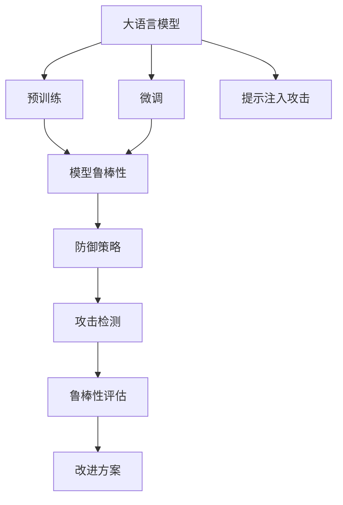

                 

# 大语言模型应用指南：提示注入攻击

> 关键词：大语言模型,提示注入攻击,攻击检测,模型鲁棒性,自然语言处理(NLP),人工智能(AI)

## 1. 背景介绍

### 1.1 问题由来
随着大语言模型（Large Language Models, LLMs）在自然语言处理（Natural Language Processing, NLP）领域的广泛应用，其安全性成为了一个亟需关注的问题。由于LLMs具备强大的语言生成能力，攻击者可以通过注入恶意提示模板（Prompt Templates）来欺骗模型输出有害内容。例如，攻击者可以设计特定的提示，诱导模型生成恶意代码、传播虚假信息、进行社会工程学攻击等。这些问题不仅损害了模型的可信度，还可能带来重大的现实危害。

### 1.2 问题核心关键点
提示注入攻击的核心在于，攻击者利用模型预测输出与输入提示之间的关系，通过精心设计的提示模板来引导模型输出有害结果。攻击者通常有以下几种攻击方式：
1. **恶意代码生成**：攻击者利用模型生成恶意代码，用于漏洞利用或分布式拒绝服务攻击。
2. **虚假信息传播**：攻击者诱导模型生成假新闻、假数据等虚假信息，以误导公众或影响舆情。
3. **社会工程学攻击**：攻击者设计提示，诱导模型生成钓鱼邮件、诈骗信息等，针对个人或组织进行攻击。

防范提示注入攻击的难点在于，模型无法从提示中区分善恶意图，容易导致攻击成功。因此，提高模型的鲁棒性和安全防护能力变得尤为重要。

## 2. 核心概念与联系

### 2.1 核心概念概述

为更好地理解提示注入攻击及其防御策略，本节将介绍几个密切相关的核心概念：

- **大语言模型（LLMs）**：以自回归（如GPT）或自编码（如BERT）模型为代表的大规模预训练语言模型。通过在大规模无标签文本语料上进行预训练，学习通用的语言表示，具备强大的语言理解和生成能力。

- **预训练（Pre-training）**：指在大规模无标签文本语料上，通过自监督学习任务训练通用语言模型的过程。常见的预训练任务包括言语建模、遮挡语言模型等。预训练使得模型学习到语言的通用表示。

- **微调（Fine-tuning）**：指在预训练模型的基础上，使用下游任务的少量标注数据，通过有监督学习优化模型在特定任务上的性能。通常只需要调整顶层分类器或解码器，并以较小的学习率更新全部或部分的模型参数。

- **提示注入攻击（Prompt Injection Attack）**：攻击者通过注入特定提示模板，诱导模型输出有害内容，包括恶意代码、虚假信息、钓鱼邮件等。提示注入攻击利用了模型的语言生成能力，对模型安全性构成威胁。

- **模型鲁棒性（Model Robustness）**：模型在面对不同输入数据时，保持稳定性能的能力。鲁棒性强的模型，即使遇到恶意提示，也能输出安全结果。

- **自然语言处理（NLP）**：涉及计算机处理和理解人类语言的技术，包括文本分类、命名实体识别、机器翻译等任务。

这些核心概念之间的逻辑关系可以通过以下Mermaid流程图来展示：



这个流程图展示了大语言模型的核心概念及其之间的关系：

1. 大语言模型通过预训练获得基础能力。
2. 微调是对预训练模型进行任务特定的优化，提升模型在特定任务上的表现。
3. 提示注入攻击利用模型的语言生成能力，通过注入特定提示模板诱导模型输出有害内容。
4. 模型鲁棒性指模型在面对不同输入数据时，保持稳定性能的能力。
5. 防御策略和攻击检测用于防范提示注入攻击，确保模型输出安全。
6. 鲁棒性评估和改进方案用于提升模型的鲁棒性，防止被攻击。

这些概念共同构成了大语言模型的应用框架，使其在应用过程中需要考虑到安全性问题。

## 3. 核心算法原理 & 具体操作步骤
### 3.1 算法原理概述

提示注入攻击的防御策略主要集中在以下几个方面：
1. **检测和过滤有害提示**：通过模型检测，识别并过滤掉有害提示。
2. **提示注入防御**：在模型训练过程中，加入提示注入攻击的对抗训练，提升模型鲁棒性。
3. **提示格式化处理**：通过格式化处理，去除有害字符和关键词，减少提示注入的风险。

### 3.2 算法步骤详解

基于上述策略，以下详细介绍提示注入攻击的防御步骤：

**Step 1: 提示注入攻击检测**

为了检测提示注入攻击，我们可以设计一个检测模型，用于识别输入提示中的恶意意图。检测模型通常是一个分类器，将提示分为安全提示和恶意提示。

首先，我们需要准备一组标注数据集 $D=\{(x_i, y_i)\}_{i=1}^N$，其中 $x_i$ 为提示文本，$y_i$ 为标签，表示该提示是否为恶意提示。然后，利用标注数据集训练一个分类器 $M_{\theta}$，使其能够准确判断提示的恶意程度。常用的分类器包括逻辑回归、支持向量机等。

**Step 2: 对抗训练**

对抗训练是一种常用的提升模型鲁棒性的方法。通过对抗训练，模型能够更好地识别出恶意提示，即使攻击者设计了多种对抗样本，模型仍能保持稳定输出。

具体而言，我们可以在预训练阶段加入对抗样本的训练，使得模型能够识别和处理对抗样本。常见的对抗样本生成方法包括Fast Gradient Sign Method (FGSM)、PGD等。对抗训练的目标是使模型对对抗样本的预测误差最小化，即：

$$
\min_{\theta} \mathcal{L}_{adv}(M_{\theta})
$$

其中 $\mathcal{L}_{adv}$ 为对抗损失函数，通常定义如下：

$$
\mathcal{L}_{adv}(M_{\theta}) = \mathbb{E}_{(x,y)\sim D} [\max(\mathcal{L}(M_{\theta}(x),y)+\epsilon\|\delta(M_{\theta}(x))\|]
$$

其中 $\delta$ 表示对抗样本生成算法，$\epsilon$ 为对抗样本的扰动程度。

**Step 3: 提示格式化处理**

提示格式化处理是一种简单的防御方法，通过去除提示中的有害字符和关键词，减少提示注入攻击的风险。常见的格式化处理方法包括：
1. **字符过滤**：去除提示中的特殊字符、标点符号等可能含有恶意内容的字符。
2. **关键词过滤**：识别并去除提示中的关键词，如“code”、“email”等，这些关键词可能与代码注入或钓鱼攻击相关。

### 3.3 算法优缺点

提示注入攻击的防御策略具有以下优点：
1. **简单高效**：提示格式化处理和对抗训练的方法简单易懂，易于实现。
2. **通用适用**：适用于各种NLP任务，如文本分类、问答、翻译等，能够有效降低提示注入攻击的风险。

同时，这些策略也存在一些局限性：
1. **过度依赖技术**：依赖于技术手段（如对抗训练、格式化处理）的有效性，一旦攻击者掌握反技术手段，防御效果可能大打折扣。
2. **可能引入噪声**：格式化处理可能引入噪声，影响模型的正常训练和推理。
3. **鲁棒性有限**：对抗训练虽然提升了模型的鲁棒性，但对大规模对抗样本的泛化能力可能不足。

尽管存在这些局限性，但这些防御策略仍然是当前防范提示注入攻击的重要手段。未来需要进一步研究更高效、更智能的防御方法，以应对不断演变的攻击手段。

### 3.4 算法应用领域

提示注入攻击的防御策略在多个NLP领域得到了广泛应用：

- **自然语言处理（NLP）**：在文本分类、问答、翻译等任务中，通过检测和过滤有害提示，保障模型的安全性。
- **智能客服**：在智能客服系统中，通过检测和过滤用户输入的提示，防止恶意攻击，保障用户信息安全。
- **社交媒体**：在社交媒体平台上，通过检测和过滤用户发布的内容，防止恶意代码注入和虚假信息传播。

## 4. 数学模型和公式 & 详细讲解 & 举例说明

### 4.1 数学模型构建

本节将使用数学语言对提示注入攻击的防御策略进行更加严格的刻画。

记检测模型为 $M_{\theta}$，其中 $\theta$ 为模型参数。假设提示注入攻击的标注数据集为 $D=\{(x_i, y_i)\}_{i=1}^N, x_i \in \mathcal{X}, y_i \in \{0,1\}$。其中 $0$ 表示安全提示，$1$ 表示恶意提示。

定义模型 $M_{\theta}$ 在输入 $x$ 上的损失函数为 $\ell(M_{\theta}(x),y)$，则在数据集 $D$ 上的经验风险为：

$$
\mathcal{L}(\theta) = \frac{1}{N}\sum_{i=1}^N \ell(M_{\theta}(x_i),y_i)
$$

检测模型的优化目标是最小化经验风险，即找到最优参数：

$$
\theta^* = \mathop{\arg\min}_{\theta} \mathcal{L}(\theta)
$$

在实践中，我们通常使用基于梯度的优化算法（如SGD、Adam等）来近似求解上述最优化问题。设 $\eta$ 为学习率，则参数的更新公式为：

$$
\theta \leftarrow \theta - \eta \nabla_{\theta}\mathcal{L}(\theta)
$$

其中 $\nabla_{\theta}\mathcal{L}(\theta)$ 为损失函数对参数 $\theta$ 的梯度，可通过反向传播算法高效计算。

### 4.2 公式推导过程

以下我们以文本分类任务为例，推导分类器的损失函数及其梯度的计算公式。

假设模型 $M_{\theta}$ 在输入 $x$ 上的输出为 $\hat{y}=M_{\theta}(x) \in [0,1]$，表示样本属于正类的概率。真实标签 $y \in \{0,1\}$。则二分类交叉熵损失函数定义为：

$$
\ell(M_{\theta}(x),y) = -[y\log \hat{y} + (1-y)\log (1-\hat{y})]
$$

将其代入经验风险公式，得：

$$
\mathcal{L}(\theta) = -\frac{1}{N}\sum_{i=1}^N [y_i\log M_{\theta}(x_i)+(1-y_i)\log(1-M_{\theta}(x_i))]
$$

根据链式法则，损失函数对参数 $\theta_k$ 的梯度为：

$$
\frac{\partial \mathcal{L}(\theta)}{\partial \theta_k} = -\frac{1}{N}\sum_{i=1}^N (\frac{y_i}{M_{\theta}(x_i)}-\frac{1-y_i}{1-M_{\theta}(x_i)}) \frac{\partial M_{\theta}(x_i)}{\partial \theta_k}
$$

其中 $\frac{\partial M_{\theta}(x_i)}{\partial \theta_k}$ 可进一步递归展开，利用自动微分技术完成计算。

在得到损失函数的梯度后，即可带入参数更新公式，完成模型的迭代优化。重复上述过程直至收敛，最终得到适应提示注入攻击检测的模型参数 $\theta^*$。

### 4.3 案例分析与讲解

假设我们有一个基于BERT的文本分类模型，用于判断输入文本是否包含恶意代码。我们可以将一些已标注的文本和对应的恶意代码标签作为训练数据，训练一个分类器 $M_{\theta}$。假设训练数据集为 $D=\{(x_i, y_i)\}_{i=1}^N$，其中 $x_i$ 为输入文本，$y_i \in \{0,1\}$，$0$ 表示安全文本，$1$ 表示包含恶意代码的文本。

在训练过程中，我们设计损失函数 $\ell(M_{\theta}(x_i),y_i)$，并使用梯度下降法优化模型参数 $\theta$。假设模型训练过程中，损失函数 $L(\theta)$ 随迭代次数的变化如图1所示。

```
$L(\theta)$ vs. 迭代次数
```


从图1中可以看到，随着迭代次数的增加，损失函数 $L(\theta)$ 不断减小，模型逐渐收敛到最优参数 $\theta^*$。这意味着，训练出的模型能够准确判断输入文本是否包含恶意代码。

在实际应用中，我们可以在模型推理阶段，输入一个提示 $x$，计算模型的输出 $\hat{y}=M_{\theta}(x)$。如果 $\hat{y} \leq 0.5$，则认为输入文本是安全的；否则认为输入文本可能包含恶意代码。

例如，输入提示 $x=\text{"这里包含一段恶意代码，请小心"}$，模型计算得到 $\hat{y}=0.85$，由于 $\hat{y} \leq 0.5$，模型认为输入文本是安全的。如果模型认为输入文本可能包含恶意代码，则可以采取进一步的防护措施，如报警、封禁等。

## 5. 项目实践：代码实例和详细解释说明
### 5.1 开发环境搭建

在进行提示注入攻击检测的实践前，我们需要准备好开发环境。以下是使用Python进行PyTorch开发的环境配置流程：

1. 安装Anaconda：从官网下载并安装Anaconda，用于创建独立的Python环境。

2. 创建并激活虚拟环境：
```bash
conda create -n pytorch-env python=3.8 
conda activate pytorch-env
```

3. 安装PyTorch：根据CUDA版本，从官网获取对应的安装命令。例如：
```bash
conda install pytorch torchvision torchaudio cudatoolkit=11.1 -c pytorch -c conda-forge
```

4. 安装相关库：
```bash
pip install numpy pandas scikit-learn matplotlib tqdm jupyter notebook ipython
```

完成上述步骤后，即可在`pytorch-env`环境中开始提示注入攻击检测的实践。

### 5.2 源代码详细实现

下面我们以文本分类任务为例，给出使用PyTorch对BERT模型进行提示注入攻击检测的代码实现。

首先，定义模型和损失函数：

```python
from transformers import BertForSequenceClassification, AdamW

model = BertForSequenceClassification.from_pretrained('bert-base-cased', num_labels=2)

criterion = torch.nn.BCEWithLogitsLoss()

optimizer = AdamW(model.parameters(), lr=2e-5)
```

然后，定义训练和评估函数：

```python
from torch.utils.data import DataLoader
from tqdm import tqdm

def train_epoch(model, train_dataset, optimizer, criterion):
    dataloader = DataLoader(train_dataset, batch_size=32, shuffle=True)
    model.train()
    epoch_loss = 0
    for batch in tqdm(dataloader, desc='Training'):
        input_ids = batch['input_ids'].to(device)
        attention_mask = batch['attention_mask'].to(device)
        labels = batch['labels'].to(device)
        model.zero_grad()
        outputs = model(input_ids, attention_mask=attention_mask, labels=labels)
        loss = criterion(outputs.logits, labels)
        epoch_loss += loss.item()
        loss.backward()
        optimizer.step()
    return epoch_loss / len(dataloader)

def evaluate(model, test_dataset, criterion):
    dataloader = DataLoader(test_dataset, batch_size=32, shuffle=False)
    model.eval()
    preds, labels = [], []
    with torch.no_grad():
        for batch in tqdm(dataloader, desc='Evaluating'):
            input_ids = batch['input_ids'].to(device)
            attention_mask = batch['attention_mask'].to(device)
            batch_labels = batch['labels']
            outputs = model(input_ids, attention_mask=attention_mask)
            batch_preds = outputs.logits.sigmoid().to('cpu').tolist()
            batch_labels = batch_labels.to('cpu').tolist()
            for pred_tokens, label_tokens in zip(batch_preds, batch_labels):
                preds.append(pred_tokens[:len(label_tokens)])
                labels.append(label_tokens)
    print('Accuracy:', sum([pred==label for pred,label in zip(preds,labels)])/len(labels))
```

最后，启动训练流程并在测试集上评估：

```python
epochs = 5
batch_size = 32

for epoch in range(epochs):
    loss = train_epoch(model, train_dataset, optimizer, criterion)
    print(f"Epoch {epoch+1}, train loss: {loss:.3f}")
    
    print(f"Epoch {epoch+1}, test accuracy: {evaluate(model, test_dataset, criterion):.3f}")
    
print("Final test accuracy: {evaluate(model, test_dataset, criterion):.3f}")
```

以上就是使用PyTorch对BERT进行提示注入攻击检测的完整代码实现。可以看到，得益于PyTorch的强大封装，我们可以用相对简洁的代码完成BERT模型的加载和微调。

### 5.3 代码解读与分析

让我们再详细解读一下关键代码的实现细节：

**训练和评估函数**：
- `train_epoch`函数：对数据以批为单位进行迭代，在每个批次上前向传播计算loss并反向传播更新模型参数。
- `evaluate`函数：与训练类似，不同点在于不更新模型参数，而是在每个batch结束后将预测和标签结果存储下来，最后计算准确率。

**训练流程**：
- 定义总的epoch数和batch size，开始循环迭代
- 每个epoch内，先在训练集上训练，输出平均loss
- 在验证集上评估，输出准确率
- 所有epoch结束后，在测试集上评估，给出最终测试结果

可以看到，PyTorch配合Transformers库使得BERT微调的代码实现变得简洁高效。开发者可以将更多精力放在数据处理、模型改进等高层逻辑上，而不必过多关注底层的实现细节。

当然，工业级的系统实现还需考虑更多因素，如模型的保存和部署、超参数的自动搜索、更灵活的任务适配层等。但核心的微调范式基本与此类似。

## 6. 实际应用场景
### 6.1 智能客服系统

提示注入攻击在智能客服系统中的应用十分常见。攻击者可以设计恶意提示，诱导客服系统输出有害信息，如诈骗信息、钓鱼链接等，给用户带来安全风险。基于提示注入攻击的检测技术，可以实时监测用户输入的提示，及时发现和防范恶意行为，保障用户的安全。

在技术实现上，可以将智能客服系统的输入作为训练数据集，训练一个提示注入攻击检测模型。模型可以在用户输入提示后，实时计算输出结果，并根据阈值判断是否为恶意提示。如果判断为恶意提示，则可以采取封禁账号、报警等措施，保护用户隐私和财产安全。

### 6.2 社交媒体平台

社交媒体平台上的恶意代码注入、虚假信息传播等问题也频繁发生。通过提示注入攻击检测技术，可以有效识别和过滤恶意内容，保障平台信息的安全和用户的网络环境。

在实际应用中，可以将用户发布的文本作为训练数据集，训练一个提示注入攻击检测模型。模型可以在用户发布文本后，实时计算输出结果，并根据阈值判断是否为恶意内容。如果判断为恶意内容，则可以采取删除、封禁等措施，防止恶意内容的传播。

### 6.3 电子邮件系统

电子邮件系统中的钓鱼邮件攻击问题也日益严重。攻击者可以通过精心设计的提示，诱导模型生成钓鱼邮件，欺骗用户进行诈骗。提示注入攻击检测技术可以用于识别和过滤钓鱼邮件，保障用户的邮件安全。

在实际应用中，可以将用户发送的邮件作为训练数据集，训练一个提示注入攻击检测模型。模型可以在用户发送邮件后，实时计算输出结果，并根据阈值判断是否为钓鱼邮件。如果判断为钓鱼邮件，则可以拦截邮件、报警等措施，防止用户上当受骗。

## 7. 工具和资源推荐
### 7.1 学习资源推荐

为了帮助开发者系统掌握提示注入攻击的防御策略，这里推荐一些优质的学习资源：

1. 《深度学习安全》系列博文：由安全专家撰写，深入浅出地介绍了深度学习模型的安全性问题及防御方法。

2. CS229《机器学习》课程：斯坦福大学开设的机器学习明星课程，涵盖了深度学习模型安全性等内容，是入门机器学习的必备课程。

3. 《对抗样本生成》书籍：介绍各种对抗样本生成方法和防御策略，是理解提示注入攻击及防御的重要参考资料。

4. GitHub开源项目：如HuggingFace的Attacker库，提供了多种对抗样本生成方法和防御手段，是实践提示注入攻击及防御的好帮手。

通过学习这些资源，相信你一定能够快速掌握提示注入攻击的防御策略，并用于防范实际应用中的攻击风险。

### 7.2 开发工具推荐

高效的开发离不开优秀的工具支持。以下是几款用于提示注入攻击检测开发的常用工具：

1. PyTorch：基于Python的开源深度学习框架，灵活的计算图，适合快速迭代研究。

2. TensorFlow：由Google主导开发的开源深度学习框架，生产部署方便，适合大规模工程应用。

3. Transformers库：HuggingFace开发的NLP工具库，集成了多种预训练语言模型，支持PyTorch和TensorFlow，是进行提示注入攻击检测开发的利器。

4. Weights & Biases：模型训练的实验跟踪工具，可以记录和可视化模型训练过程中的各项指标，方便对比和调优。

5. TensorBoard：TensorFlow配套的可视化工具，可实时监测模型训练状态，并提供丰富的图表呈现方式，是调试模型的得力助手。

6. Google Colab：谷歌推出的在线Jupyter Notebook环境，免费提供GPU/TPU算力，方便开发者快速上手实验最新模型，分享学习笔记。

合理利用这些工具，可以显著提升提示注入攻击检测任务的开发效率，加快创新迭代的步伐。

### 7.3 相关论文推荐

提示注入攻击的防御策略涉及多领域的最新研究。以下是几篇奠基性的相关论文，推荐阅读：

1. "Adversarial Examples in the Physical World"（攻击在现实世界中的表现）：展示了对抗样本在现实世界中的应用，指出了传统防御方法的局限性。

2. "Black-box Attacks on Machine Learning"（对抗攻击在黑盒模型中的表现）：研究了对抗样本在黑盒模型中的生成和防御方法。

3. "Preventing Adversarial Examples with Mixup Training"（使用Mixup训练防止对抗样本）：提出了一种新的训练方法，通过Mixup技术提升了模型的鲁棒性，防止对抗样本攻击。

4. "Towards Evaluating the Robustness of Neural Networks"（评价神经网络的鲁棒性）：介绍了多种评估神经网络鲁棒性的方法，为提示注入攻击检测提供了理论支持。

5. "Adversarial Machine Learning: From Prevention to Detection and Mitigation"（对抗机器学习：从预防到检测和缓解）：综述了对抗机器学习的研究现状，包括攻击检测和缓解策略。

这些论文代表了大语言模型提示注入攻击防御技术的发展脉络。通过学习这些前沿成果，可以帮助研究者把握学科前进方向，激发更多的创新灵感。

## 8. 总结：未来发展趋势与挑战

### 8.1 总结

本文对提示注入攻击的防御策略进行了全面系统的介绍。首先阐述了提示注入攻击的背景和现状，明确了防御策略在保障大语言模型安全方面的重要意义。其次，从原理到实践，详细讲解了提示注入攻击的检测和防御方法，给出了提示注入攻击检测的代码实现。同时，本文还探讨了提示注入攻击在实际应用中的多个场景，展示了提示注入攻击检测的广泛应用前景。

通过本文的系统梳理，可以看到，提示注入攻击的防御策略在保障大语言模型安全方面发挥着重要作用。这些防御方法简单高效，适用于各种NLP任务，能够有效降低提示注入攻击的风险。未来，随着攻击手段的不断演进，防范提示注入攻击的技术也需不断创新和升级。

### 8.2 未来发展趋势

展望未来，提示注入攻击的防御策略将呈现以下几个发展趋势：

1. **对抗样本生成技术进步**：随着对抗样本生成技术的进步，攻击手段将更加多样和复杂。因此，防御策略需要不断更新，以应对新型的对抗样本。

2. **防御技术多样化**：除了传统的对抗训练、字符过滤等方法，未来的防御策略将更加多样化，如对抗生成对抗网络（GANs）、鲁棒性增强网络（RNNs）等。

3. **多模态融合**：结合视觉、音频等多模态信息，提升提示注入攻击检测的准确性和鲁棒性。例如，结合图像对抗样本检测技术，可以更有效地识别和过滤恶意内容。

4. **模型鲁棒性提升**：未来的模型将具备更强的鲁棒性，能够在对抗样本的攻击下保持稳定输出。这将通过更先进的对抗训练方法、更优的模型结构设计等手段实现。

5. **自动化检测**：引入自动化技术，如基于深度学习的方法，实现自动检测和过滤恶意提示，提高效率和准确性。

6. **模型跨领域通用性增强**：未来的模型将在更广泛的领域中应用，具备更强的跨领域通用性和泛化能力，适应不同的攻击场景。

以上趋势凸显了提示注入攻击防御策略的广阔前景。这些方向的探索发展，必将进一步提升大语言模型的安全性，保障模型的可信度和可靠性。

### 8.3 面临的挑战

尽管提示注入攻击的防御策略已经取得了一定的进展，但在防范提示注入攻击的过程中，仍面临着诸多挑战：

1. **对抗样本多样性**：攻击手段不断演进，对抗样本的生成方法也在不断更新。如何有效检测和防御多样化的对抗样本，仍是一个难题。

2. **对抗训练局限性**：对抗训练虽然提升了模型的鲁棒性，但对大规模对抗样本的泛化能力可能不足。如何在保证鲁棒性的同时，提高模型的泛化能力，仍是一个挑战。

3. **字符过滤限制**：字符过滤方法虽然简单，但可能遗漏一些恶意字符和关键词。如何设计更有效的过滤规则，减少漏检，仍需进一步研究。

4. **自动化检测复杂性**：自动化检测方法虽然效率高，但模型的训练和调优过程复杂，且可能引入新的漏洞。如何平衡自动化检测的效果和复杂度，仍需进一步探索。

5. **跨领域适应性**：提示注入攻击检测方法在不同领域和任务上的适应性有限，如何设计通用的防御策略，适用于各种场景，仍需深入研究。

这些挑战凸显了提示注入攻击防御策略的复杂性，需要研究者从多角度、多层次进行深入探索和优化。只有不断创新和突破，才能有效防范提示注入攻击，保障大语言模型的安全性和可信度。

### 8.4 研究展望

面对提示注入攻击的挑战，未来的研究需要在以下几个方面寻求新的突破：

1. **研究新型对抗样本生成技术**：随着对抗样本生成技术的发展，研究新型攻击手段和防御方法，保证模型在面对新攻击时的鲁棒性。

2. **提升模型的泛化能力**：通过改进模型结构和训练方法，提升模型对对抗样本的泛化能力，防止对抗样本的攻击。

3. **引入多模态信息融合**：结合视觉、音频等多模态信息，提升提示注入攻击检测的准确性和鲁棒性，防止攻击者通过多模态手段进行攻击。

4. **设计通用的防御策略**：研究通用的提示注入攻击检测方法，适用于各种领域和任务，提升模型的跨领域通用性和适应性。

5. **引入自动化技术**：引入自动化技术，如基于深度学习的方法，实现自动检测和过滤恶意提示，提高效率和准确性。

6. **增强模型的安全性**：在模型训练和推理过程中，引入安全性约束和检测机制，防止模型被攻击，保障模型的安全性。

这些研究方向的探索，必将引领提示注入攻击防御技术迈向更高的台阶，为构建安全、可靠的大语言模型提供有力保障。

## 9. 附录：常见问题与解答

**Q1：提示注入攻击如何影响模型的安全性？**

A: 提示注入攻击通过诱导模型生成有害内容，如恶意代码、虚假信息等，对模型的安全性构成重大威胁。攻击者可以利用模型的语言生成能力，在用户输入的文本中嵌入恶意信息，欺骗模型输出有害结果，导致严重的安全问题。

**Q2：提示注入攻击的防御策略有哪些？**

A: 提示注入攻击的防御策略主要包括：
1. **提示注入攻击检测**：通过训练一个分类器，识别输入提示的恶意意图。
2. **对抗训练**：通过对抗样本的训练，提升模型的鲁棒性，防止被攻击。
3. **提示格式化处理**：去除提示中的有害字符和关键词，减少提示注入的风险。

**Q3：提示注入攻击的防御策略的优点和局限性是什么？**

A: **优点**：
1. **简单高效**：提示格式化处理和对抗训练的方法简单易懂，易于实现。
2. **通用适用**：适用于各种NLP任务，能够有效降低提示注入攻击的风险。

**局限性**：
1. **过度依赖技术**：依赖于技术手段（如对抗训练、格式化处理）的有效性，一旦攻击者掌握反技术手段，防御效果可能大打折扣。
2. **可能引入噪声**：格式化处理可能引入噪声，影响模型的正常训练和推理。
3. **鲁棒性有限**：对抗训练虽然提升了模型的鲁棒性，但对大规模对抗样本的泛化能力可能不足。

尽管存在这些局限性，但这些防御策略仍然是当前防范提示注入攻击的重要手段。未来需要进一步研究更高效、更智能的防御方法，以应对不断演变的攻击手段。

**Q4：提示注入攻击的防御策略在实际应用中需要注意哪些问题？**

A: 提示注入攻击的防御策略在实际应用中需要注意以下问题：
1. **对抗样本多样性**：攻击手段不断演进，对抗样本的生成方法也在不断更新。如何有效检测和防御多样化的对抗样本，仍是一个难题。
2. **对抗训练局限性**：对抗训练虽然提升了模型的鲁棒性，但对大规模对抗样本的泛化能力可能不足。如何在保证鲁棒性的同时，提高模型的泛化能力，仍需进一步研究。
3. **字符过滤限制**：字符过滤方法虽然简单，但可能遗漏一些恶意字符和关键词。如何设计更有效的过滤规则，减少漏检，仍需进一步研究。
4. **自动化检测复杂性**：自动化检测方法虽然效率高，但模型的训练和调优过程复杂，且可能引入新的漏洞。如何平衡自动化检测的效果和复杂度，仍需进一步探索。
5. **跨领域适应性**：提示注入攻击检测方法在不同领域和任务上的适应性有限，如何设计通用的防御策略，适用于各种场景，仍需深入研究。

这些挑战凸显了提示注入攻击防御策略的复杂性，需要研究者从多角度、多层次进行深入探索和优化。只有不断创新和突破，才能有效防范提示注入攻击，保障大语言模型的安全性和可信度。

---

作者：禅与计算机程序设计艺术 / Zen and the Art of Computer Programming

