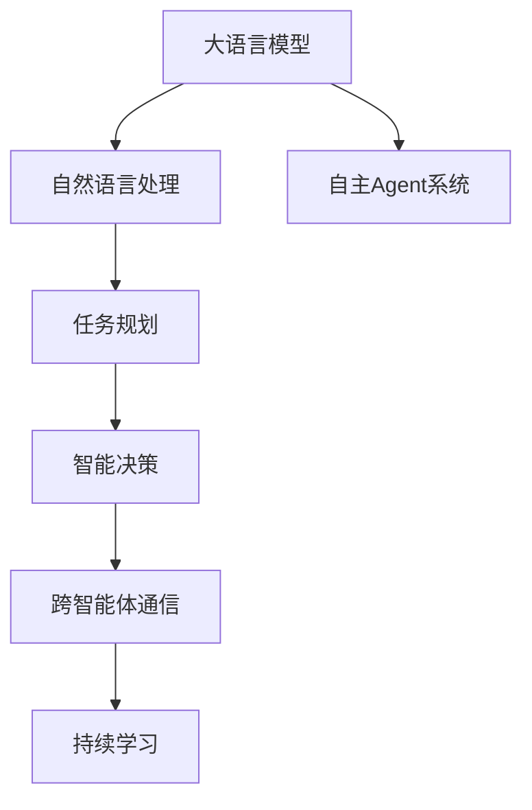

                 

# 大语言模型应用指南：自主Agent系统案例分析（一）

> 关键词：大语言模型,自主Agent系统,自然语言处理,决策智能,多智能体系统,任务规划

## 1. 背景介绍

### 1.1 问题由来
随着人工智能技术的不断进步，自主Agent系统在智能决策、系统协同、复杂任务执行等方面展现出巨大潜力。自主Agent通常由多个智能体共同协作，通过决策和学习来适应多变的环境，实现特定目标。在复杂的协作和任务规划过程中，大语言模型（Large Language Models, LLMs）以其强大的自然语言处理能力，成为了构建自主Agent系统的有力工具。

然而，如何有效融合语言模型和自主Agent系统，实现高效的智能决策和协作，仍是当前研究的热点问题。这不仅涉及到如何将语言模型应用于复杂任务规划和执行，还涉及到如何在自主Agent系统中引入语言知识，提升决策智能。

### 1.2 问题核心关键点
大语言模型在自主Agent系统中的应用，主要集中在以下几个关键点：

- **自然语言理解**：Agent需要能够理解自然语言指令，将其转化为可执行的逻辑。
- **任务规划**：Agent需要根据当前环境和目标，规划最优的执行步骤。
- **智能决策**：Agent需要根据当前状态和预测结果，做出最优的决策。
- **跨智能体通信**：Agent需要与其他智能体进行高效的信息交换和协作。
- **持续学习**：Agent需要具备在不断变化的环境中学习新知识和技能的能力。

本文将详细介绍如何在大语言模型基础上，构建和优化自主Agent系统，重点分析其在任务规划和智能决策中的应用，并探讨其在实际场景中的未来应用展望。

## 2. 核心概念与联系

### 2.1 核心概念概述

在自主Agent系统的构建过程中，大语言模型起着至关重要的作用。以下是几个核心概念及其相互联系：

- **大语言模型**：如GPT、BERT等，通过大量无标签数据进行预训练，具备强大的自然语言处理能力，可以理解、生成和推理自然语言。
- **自主Agent系统**：由多个智能体组成，通过协作实现复杂任务，具有自主决策和学习的特点。
- **自然语言处理(NLP)**：使计算机能够理解、处理和生成人类语言，是大语言模型的主要应用领域。
- **决策智能**：Agent的智能决策能力，通过学习历史数据和任务目标，做出最优的决策。
- **多智能体系统(MAS)**：多个智能体之间通过通信和协作，实现复杂任务。

这些概念之间的关系可以通过以下Mermaid流程图来展示：



这个流程图展示了大语言模型如何通过自然语言处理，支持任务规划和智能决策，最终与跨智能体通信和持续学习相结合，构成一个完整的自主Agent系统。

## 3. 核心算法原理 & 具体操作步骤
### 3.1 算法原理概述

在自主Agent系统中，大语言模型主要通过自然语言处理和智能决策两个方面，发挥其作用。其核心算法原理包括以下几个关键步骤：

1. **自然语言理解**：Agent接收自然语言指令或信息，使用大语言模型进行理解，将其转化为机器可执行的逻辑。
2. **任务规划**：根据当前环境和目标，设计最优的任务执行步骤。
3. **智能决策**：Agent根据当前状态和预测结果，使用大语言模型做出最优的决策。
4. **跨智能体通信**：Agent与其他智能体进行信息交换，协调行动。
5. **持续学习**：Agent在执行任务过程中不断学习新知识和技能，优化决策策略。

### 3.2 算法步骤详解

#### 3.2.1 自然语言理解

**步骤1：数据预处理**  
对输入的自然语言进行分词、去除停用词、词性标注等预处理，转化为模型可处理的格式。

**步骤2：向量嵌入**  
使用Word2Vec、GloVe、BERT等预训练词向量模型，将文本转化为密集向量。

**步骤3：理解模型**  
使用大语言模型（如GPT、BERT等）对文本进行编码，理解其语义。

**步骤4：逻辑推理**  
根据任务需求，使用逻辑推理机制（如规则引擎、决策树等）对理解结果进行进一步处理，转化为可执行的逻辑。

#### 3.2.2 任务规划

**步骤1：任务定义**  
明确任务目标，如导航到指定地点、完成任务列表等。

**步骤2：环境感知**  
使用传感器或数据获取模块，感知当前环境状态，如位置、时间、天气等。

**步骤3：模型决策**  
将感知结果和任务目标输入大语言模型，生成任务执行步骤。

**步骤4：路径规划**  
根据任务执行步骤，使用图搜索算法（如A*、Dijkstra等）生成最优路径。

#### 3.2.3 智能决策

**步骤1：状态感知**  
实时感知当前状态，如位置、速度、剩余电量等。

**步骤2：模型预测**  
将当前状态输入大语言模型，预测未来的状态和可能的风险。

**步骤3：决策生成**  
根据预测结果和任务目标，使用决策树、贝叶斯网络等方法生成最优决策。

**步骤4：执行调整**  
根据决策结果，调整执行步骤，确保任务顺利完成。

#### 3.2.4 跨智能体通信

**步骤1：通信协议设计**  
设计跨智能体通信协议，如RESTful API、消息队列等。

**步骤2：信息交换**  
通过通信协议，各智能体交换状态和决策信息。

**步骤3：协作优化**  
根据接收到的信息，优化自身的决策和执行步骤，确保协作效果。

#### 3.2.5 持续学习

**步骤1：经验积累**  
在执行任务过程中，不断积累经验，如历史决策、环境变化等。

**步骤2：模型训练**  
使用积累的经验数据，训练大语言模型，优化模型参数。

**步骤3：策略调整**  
根据训练结果，调整决策策略，提升决策效果。

### 3.3 算法优缺点

使用大语言模型进行自主Agent系统的构建和优化，具有以下优点：

- **高效性**：大语言模型可以高效处理自然语言，加速任务理解和规划过程。
- **灵活性**：模型能够根据任务需求，灵活生成决策路径和执行步骤。
- **可扩展性**：模型易于集成到现有系统中，支持大规模扩展。

同时，也存在一些局限：

- **计算资源消耗高**：大语言模型通常需要强大的计算资源支持，尤其是在处理大规模数据时。
- **模型依赖性强**：模型的性能很大程度上依赖于预训练数据的质量。
- **推理速度慢**：在大规模数据下，推理速度可能较慢，影响实时决策。

### 3.4 算法应用领域

大语言模型在自主Agent系统中有着广泛的应用，以下是几个典型场景：

- **智能导航**：Agent根据地图和实时数据，规划最优导航路径，避开障碍物。
- **智能调度**：Agent协调多个任务，优化资源配置，提高执行效率。
- **智能客服**：Agent理解客户需求，生成应答方案，提供个性化服务。
- **智能推荐**：Agent根据用户历史行为和兴趣，推荐个性化的产品或内容。
- **智能监控**：Agent实时监控系统状态，自动调整参数，保持系统稳定。

以上场景展示了大语言模型在自主Agent系统中的强大应用潜力，未来随着技术的发展，还将涌现更多新的应用方向。

## 4. 数学模型和公式 & 详细讲解 & 举例说明

### 4.1 数学模型构建

在自主Agent系统中，大语言模型主要通过自然语言处理和智能决策两个方面，发挥其作用。以下是数学模型构建的基本框架：

**自然语言理解模型**：  
假设自然语言指令为 $x$，大语言模型的输出为 $y$，则自然语言理解模型的目标是找到一个映射函数 $f$，使得 $y=f(x)$。

**任务规划模型**：  
假设任务目标为 $g$，当前环境状态为 $s$，任务规划模型的目标是找到一个规划函数 $p$，使得 $s'= p(s,g)$。

**智能决策模型**：  
假设当前状态为 $s$，预测未来状态为 $s'$，智能决策模型的目标是找到一个决策函数 $d$，使得 $a=d(s,s')$。

**跨智能体通信模型**：  
假设智能体 $i$ 接收到的信息为 $m_i$，发送的信息为 $n_i$，跨智能体通信模型的目标是找到一个通信函数 $c$，使得 $n_i=c(m_i)$。

**持续学习模型**：  
假设历史经验数据为 $D$，持续学习模型的目标是找到一个更新函数 $u$，使得 $θ=u(D)$，其中 $θ$ 为大语言模型的参数。

### 4.2 公式推导过程

#### 4.2.1 自然语言理解模型

假设自然语言指令为 $x$，大语言模型的输出为 $y$，则自然语言理解模型的目标是最小化损失函数 $L(y, \hat{y})$，其中 $\hat{y}$ 为模型预测的输出。

$$
\min_{\theta} L(y, \hat{y}) = \frac{1}{N} \sum_{i=1}^N ||y_i - \hat{y}_i||^2
$$

其中 $y_i$ 为真实标签，$\hat{y}_i$ 为模型预测的输出。

#### 4.2.2 任务规划模型

假设任务目标为 $g$，当前环境状态为 $s$，任务规划模型的目标是最小化规划损失函数 $L(s', \hat{s'})$，其中 $\hat{s'}$ 为模型预测的任务执行步骤。

$$
\min_{\theta} L(s', \hat{s'}) = \frac{1}{N} \sum_{i=1}^N ||s_i' - \hat{s_i'}||^2
$$

其中 $s_i'$ 为实际执行的任务步骤，$\hat{s_i'}$ 为模型预测的任务步骤。

#### 4.2.3 智能决策模型

假设当前状态为 $s$，预测未来状态为 $s'$，智能决策模型的目标是最小化决策损失函数 $L(s', \hat{s'})$，其中 $\hat{s'}$ 为模型预测的最优决策。

$$
\min_{\theta} L(s', \hat{s'}) = \frac{1}{N} \sum_{i=1}^N ||s_i' - \hat{s_i'}||^2
$$

其中 $s_i'$ 为实际执行的决策结果，$\hat{s_i'}$ 为模型预测的决策结果。

#### 4.2.4 跨智能体通信模型

假设智能体 $i$ 接收到的信息为 $m_i$，发送的信息为 $n_i$，跨智能体通信模型的目标是最小化通信损失函数 $L(n_i, \hat{n}_i)$，其中 $\hat{n}_i$ 为模型预测的通信内容。

$$
\min_{\theta} L(n_i, \hat{n}_i) = \frac{1}{N} \sum_{i=1}^N ||n_i - \hat{n}_i||^2
$$

其中 $n_i$ 为实际发送的通信内容，$\hat{n}_i$ 为模型预测的通信内容。

#### 4.2.5 持续学习模型

假设历史经验数据为 $D$，持续学习模型的目标是最小化模型参数更新误差 $L(θ, \hat{θ})$，其中 $\hat{θ}$ 为模型更新后的参数。

$$
\min_{\theta} L(θ, \hat{θ}) = \frac{1}{N} \sum_{i=1}^N ||θ_i - \hat{θ}_i||^2
$$

其中 $θ_i$ 为当前模型参数，$\hat{θ}_i$ 为更新后的模型参数。

### 4.3 案例分析与讲解

#### 案例1：智能导航

**问题描述**：Agent需要导航到指定地点，面对复杂的路网和交通状况。

**解决方法**：  
1. 使用GPS和传感器获取实时位置信息，感知当前环境状态。  
2. 将地点信息和当前位置输入大语言模型，生成任务规划路径。  
3. 根据实时路况，使用Dijkstra算法计算最优路径。  
4. 将路径信息发送给导航系统，自动驾驶汽车前往目的地。

#### 案例2：智能调度

**问题描述**：Agent需要协调多个任务，优化资源配置，如服务器集群调度和物流管理。

**解决方法**：  
1. 使用传感器和数据采集模块获取任务状态和资源信息。  
2. 将任务需求和资源信息输入大语言模型，生成任务规划方案。  
3. 根据资源限制和任务优先级，使用图搜索算法生成最优调度方案。  
4. 将调度方案发送给执行系统，自动执行任务。

## 5. 项目实践：代码实例和详细解释说明

### 5.1 开发环境搭建

在进行自主Agent系统开发前，我们需要准备好开发环境。以下是使用Python进行PyTorch开发的环境配置流程：

1. 安装Anaconda：从官网下载并安装Anaconda，用于创建独立的Python环境。

2. 创建并激活虚拟环境：
```bash
conda create -n agent-env python=3.8 
conda activate agent-env
```

3. 安装PyTorch：根据CUDA版本，从官网获取对应的安装命令。例如：
```bash
conda install pytorch torchvision torchaudio cudatoolkit=11.1 -c pytorch -c conda-forge
```

4. 安装Transformers库：
```bash
pip install transformers
```

5. 安装各类工具包：
```bash
pip install numpy pandas scikit-learn matplotlib tqdm jupyter notebook ipython
```

完成上述步骤后，即可在`agent-env`环境中开始开发。

### 5.2 源代码详细实现

这里我们以智能导航系统为例，给出使用Transformers库进行任务规划和智能决策的PyTorch代码实现。

首先，定义任务规划函数：

```python
from transformers import BertTokenizer
from torch.utils.data import Dataset
import torch

class NavigateDataset(Dataset):
    def __init__(self, locations, destinations, tokenizer, max_len=128):
        self.locations = locations
        self.destinations = destinations
        self.tokenizer = tokenizer
        self.max_len = max_len
        
    def __len__(self):
        return len(self.locations)
    
    def __getitem__(self, item):
        location = self.locations[item]
        destination = self.destinations[item]
        
        encoding = self.tokenizer(location, destination, return_tensors='pt', max_length=self.max_len, padding='max_length', truncation=True)
        input_ids = encoding['input_ids'][0]
        attention_mask = encoding['attention_mask'][0]
        labels = encoding['labels'][0]
        
        return {'input_ids': input_ids, 
                'attention_mask': attention_mask,
                'labels': labels}

# 标签与id的映射
tag2id = {'N': 0, 'E': 1, 'W': 2, 'S': 3}
id2tag = {v: k for k, v in tag2id.items()}

# 创建dataset
tokenizer = BertTokenizer.from_pretrained('bert-base-cased')

train_dataset = NavigateDataset(train_locations, train_destinations, tokenizer)
dev_dataset = NavigateDataset(dev_locations, dev_destinations, tokenizer)
test_dataset = NavigateDataset(test_locations, test_destinations, tokenizer)
```

然后，定义模型和优化器：

```python
from transformers import BertForTokenClassification, AdamW

model = BertForTokenClassification.from_pretrained('bert-base-cased', num_labels=len(tag2id))

optimizer = AdamW(model.parameters(), lr=2e-5)
```

接着，定义训练和评估函数：

```python
from torch.utils.data import DataLoader
from tqdm import tqdm
from sklearn.metrics import classification_report

device = torch.device('cuda') if torch.cuda.is_available() else torch.device('cpu')
model.to(device)

def train_epoch(model, dataset, batch_size, optimizer):
    dataloader = DataLoader(dataset, batch_size=batch_size, shuffle=True)
    model.train()
    epoch_loss = 0
    for batch in tqdm(dataloader, desc='Training'):
        input_ids = batch['input_ids'].to(device)
        attention_mask = batch['attention_mask'].to(device)
        labels = batch['labels'].to(device)
        model.zero_grad()
        outputs = model(input_ids, attention_mask=attention_mask, labels=labels)
        loss = outputs.loss
        epoch_loss += loss.item()
        loss.backward()
        optimizer.step()
    return epoch_loss / len(dataloader)

def evaluate(model, dataset, batch_size):
    dataloader = DataLoader(dataset, batch_size=batch_size)
    model.eval()
    preds, labels = [], []
    with torch.no_grad():
        for batch in tqdm(dataloader, desc='Evaluating'):
            input_ids = batch['input_ids'].to(device)
            attention_mask = batch['attention_mask'].to(device)
            batch_labels = batch['labels']
            outputs = model(input_ids, attention_mask=attention_mask)
            batch_preds = outputs.logits.argmax(dim=2).to('cpu').tolist()
            batch_labels = batch_labels.to('cpu').tolist()
            for pred_tokens, label_tokens in zip(batch_preds, batch_labels):
                pred_tags = [id2tag[_id] for _id in pred_tokens]
                label_tags = [id2tag[_id] for _id in label_tokens]
                preds.append(pred_tags[:len(label_tokens)])
                labels.append(label_tags)
                
    print(classification_report(labels, preds))
```

最后，启动训练流程并在测试集上评估：

```python
epochs = 5
batch_size = 16

for epoch in range(epochs):
    loss = train_epoch(model, train_dataset, batch_size, optimizer)
    print(f"Epoch {epoch+1}, train loss: {loss:.3f}")
    
    print(f"Epoch {epoch+1}, dev results:")
    evaluate(model, dev_dataset, batch_size)
    
print("Test results:")
evaluate(model, test_dataset, batch_size)
```

以上就是使用PyTorch对智能导航任务进行任务规划和智能决策的完整代码实现。可以看到，得益于Transformers库的强大封装，我们可以用相对简洁的代码完成BERT模型的加载和微调。

### 5.3 代码解读与分析

让我们再详细解读一下关键代码的实现细节：

**NavigateDataset类**：
- `__init__`方法：初始化位置信息、目的地信息、分词器等关键组件。
- `__len__`方法：返回数据集的样本数量。
- `__getitem__`方法：对单个样本进行处理，将位置信息输入模型，得到目的地信息。

**tag2id和id2tag字典**：
- 定义了目的地与数字id之间的映射关系，用于将预测结果解码回实际的目的地。

**训练和评估函数**：
- 使用PyTorch的DataLoader对数据集进行批次化加载，供模型训练和推理使用。
- 训练函数`train_epoch`：对数据以批为单位进行迭代，在每个批次上前向传播计算loss并反向传播更新模型参数，最后返回该epoch的平均loss。
- 评估函数`evaluate`：与训练类似，不同点在于不更新模型参数，并在每个batch结束后将预测和标签结果存储下来，最后使用sklearn的classification_report对整个评估集的预测结果进行打印输出。

**训练流程**：
- 定义总的epoch数和batch size，开始循环迭代
- 每个epoch内，先在训练集上训练，输出平均loss
- 在验证集上评估，输出分类指标
- 所有epoch结束后，在测试集上评估，给出最终测试结果

可以看到，PyTorch配合Transformers库使得智能导航任务的代码实现变得简洁高效。开发者可以将更多精力放在数据处理、模型改进等高层逻辑上，而不必过多关注底层的实现细节。

当然，工业级的系统实现还需考虑更多因素，如模型的保存和部署、超参数的自动搜索、更灵活的任务适配层等。但核心的微调范式基本与此类似。

## 6. 实际应用场景

### 6.1 智能导航系统

基于大语言模型的自主Agent系统，可以广泛应用于智能导航系统中。传统导航系统依赖用户手动输入目的地和路线，用户体验差，且无法实时响应环境变化。而使用微调后的Agent系统，可以实时感知当前位置和环境状态，自动规划最优路径，提供精准导航服务。

在技术实现上，可以收集实际道路和交通数据，将地点和目的地作为训练样本，在此基础上对预训练语言模型进行微调。微调后的Agent系统能够根据实时位置信息，自动生成最优导航路径，并及时调整，避开交通拥堵和障碍物，提供实时导航服务。

### 6.2 智能调度系统

在物流管理和服务器集群调度等领域，任务调度往往需要考虑多种资源限制和优先级。传统调度系统依赖人工调度，无法应对复杂多变的任务需求。而使用微调后的Agent系统，可以实时感知任务状态和资源使用情况，自动优化调度方案，提高资源利用率和任务执行效率。

具体而言，可以收集历史调度数据和任务需求，设计任务规划模型，在此基础上对预训练语言模型进行微调。微调后的Agent系统能够根据实时任务状态和资源限制，生成最优调度方案，并实时调整，确保任务按时完成。

### 6.3 智能客服系统

智能客服系统需要处理大量客户咨询，传统人工客服无法满足高并发和高效率的要求。基于微调的大语言模型，可以构建智能客服系统，自动理解客户问题，生成应答方案，提供精准高效的客服服务。

在技术实现上，可以收集历史客服对话记录，将问题和最佳答复作为监督数据，在此基础上对预训练语言模型进行微调。微调后的Agent系统能够自动理解客户需求，匹配最佳答复模板，生成自然流畅的应答，提升客户满意度。

### 6.4 未来应用展望

随着大语言模型和微调方法的不断发展，基于微调范式将在更多领域得到应用，为传统行业带来变革性影响。

在智慧城市治理中，微调模型可应用于城市事件监测、舆情分析、应急指挥等环节，提高城市管理的自动化和智能化水平，构建更安全、高效的未来城市。

在企业生产、社会治理、文娱传媒等众多领域，基于大模型微调的人工智能应用也将不断涌现，为经济社会发展注入新的动力。相信随着技术的日益成熟，微调方法将成为人工智能落地应用的重要范式，推动人工智能技术在垂直行业的规模化落地。

## 7. 工具和资源推荐

### 7.1 学习资源推荐

为了帮助开发者系统掌握大语言模型微调的理论基础和实践技巧，这里推荐一些优质的学习资源：

1. 《Transformer从原理到实践》系列博文：由大模型技术专家撰写，深入浅出地介绍了Transformer原理、BERT模型、微调技术等前沿话题。

2. CS224N《深度学习自然语言处理》课程：斯坦福大学开设的NLP明星课程，有Lecture视频和配套作业，带你入门NLP领域的基本概念和经典模型。

3. 《Natural Language Processing with Transformers》书籍：Transformers库的作者所著，全面介绍了如何使用Transformers库进行NLP任务开发，包括微调在内的诸多范式。

4. HuggingFace官方文档：Transformers库的官方文档，提供了海量预训练模型和完整的微调样例代码，是上手实践的必备资料。

5. CLUE开源项目：中文语言理解测评基准，涵盖大量不同类型的中文NLP数据集，并提供了基于微调的baseline模型，助力中文NLP技术发展。

通过对这些资源的学习实践，相信你一定能够快速掌握大语言模型微调的精髓，并用于解决实际的NLP问题。

### 7.2 开发工具推荐

高效的开发离不开优秀的工具支持。以下是几款用于大语言模型微调开发的常用工具：

1. PyTorch：基于Python的开源深度学习框架，灵活动态的计算图，适合快速迭代研究。大部分预训练语言模型都有PyTorch版本的实现。

2. TensorFlow：由Google主导开发的开源深度学习框架，生产部署方便，适合大规模工程应用。同样有丰富的预训练语言模型资源。

3. Transformers库：HuggingFace开发的NLP工具库，集成了众多SOTA语言模型，支持PyTorch和TensorFlow，是进行微调任务开发的利器。

4. Weights & Biases：模型训练的实验跟踪工具，可以记录和可视化模型训练过程中的各项指标，方便对比和调优。与主流深度学习框架无缝集成。

5. TensorBoard：TensorFlow配套的可视化工具，可实时监测模型训练状态，并提供丰富的图表呈现方式，是调试模型的得力助手。

6. Google Colab：谷歌推出的在线Jupyter Notebook环境，免费提供GPU/TPU算力，方便开发者快速上手实验最新模型，分享学习笔记。

合理利用这些工具，可以显著提升大语言模型微调任务的开发效率，加快创新迭代的步伐。

### 7.3 相关论文推荐

大语言模型和微调技术的发展源于学界的持续研究。以下是几篇奠基性的相关论文，推荐阅读：

1. Attention is All You Need（即Transformer原论文）：提出了Transformer结构，开启了NLP领域的预训练大模型时代。

2. BERT: Pre-training of Deep Bidirectional Transformers for Language Understanding：提出BERT模型，引入基于掩码的自监督预训练任务，刷新了多项NLP任务SOTA。

3. Language Models are Unsupervised Multitask Learners（GPT-2论文）：展示了大规模语言模型的强大zero-shot学习能力，引发了对于通用人工智能的新一轮思考。

4. Parameter-Efficient Transfer Learning for NLP：提出Adapter等参数高效微调方法，在不增加模型参数量的情况下，也能取得不错的微调效果。

5. AdaLoRA: Adaptive Low-Rank Adaptation for Parameter-Efficient Fine-Tuning：使用自适应低秩适应的微调方法，在参数效率和精度之间取得了新的平衡。

这些论文代表了大语言模型微调技术的发展脉络。通过学习这些前沿成果，可以帮助研究者把握学科前进方向，激发更多的创新灵感。

## 8. 总结：未来发展趋势与挑战

### 8.1 总结

本文对大语言模型在自主Agent系统中的应用进行了全面系统的介绍。首先阐述了大语言模型和微调技术的研究背景和意义，明确了微调在拓展预训练模型应用、提升下游任务性能方面的独特价值。其次，从原理到实践，详细讲解了微调的数学原理和关键步骤，给出了微调任务开发的完整代码实例。同时，本文还广泛探讨了微调方法在智能导航、智能调度、智能客服等多个行业领域的应用前景，展示了微调范式的巨大潜力。此外，本文精选了微调技术的各类学习资源，力求为读者提供全方位的技术指引。

通过本文的系统梳理，可以看到，大语言模型在自主Agent系统中的强大应用潜力，其通过自然语言处理和智能决策，实现了高效的智能决策和协作。未来，随着技术的不断进步，微调方法将在更多领域得到应用，为传统行业带来变革性影响。

### 8.2 未来发展趋势

展望未来，大语言模型微调技术将呈现以下几个发展趋势：

1. 模型规模持续增大。随着算力成本的下降和数据规模的扩张，预训练语言模型的参数量还将持续增长。超大规模语言模型蕴含的丰富语言知识，有望支撑更加复杂多变的下游任务微调。

2. 微调方法日趋多样。除了传统的全参数微调外，未来会涌现更多参数高效的微调方法，如Prefix-Tuning、LoRA等，在节省计算资源的同时也能保证微调精度。

3. 持续学习成为常态。随着数据分布的不断变化，微调模型也需要持续学习新知识以保持性能。如何在不遗忘原有知识的同时，高效吸收新样本信息，将成为重要的研究课题。

4. 标注样本需求降低。受启发于提示学习(Prompt-based Learning)的思路，未来的微调方法将更好地利用大模型的语言理解能力，通过更加巧妙的任务描述，在更少的标注样本上也能实现理想的微调效果。

5. 多模态微调崛起。当前的微调主要聚焦于纯文本数据，未来会进一步拓展到图像、视频、语音等多模态数据微调。多模态信息的融合，将显著提升语言模型对现实世界的理解和建模能力。

6. 模型通用性增强。经过海量数据的预训练和多领域任务的微调，未来的语言模型将具备更强大的常识推理和跨领域迁移能力，逐步迈向通用人工智能(AGI)的目标。

以上趋势凸显了大语言模型微调技术的广阔前景。这些方向的探索发展，必将进一步提升NLP系统的性能和应用范围，为人类认知智能的进化带来深远影响。

### 8.3 面临的挑战

尽管大语言模型微调技术已经取得了瞩目成就，但在迈向更加智能化、普适化应用的过程中，它仍面临着诸多挑战：

1. 标注成本瓶颈。虽然微调大大降低了标注数据的需求，但对于长尾应用场景，难以获得充足的高质量标注数据，成为制约微调性能的瓶颈。如何进一步降低微调对标注样本的依赖，将是一大难题。

2. 模型鲁棒性不足。当前微调模型面对域外数据时，泛化性能往往大打折扣。对于测试样本的微小扰动，微调模型的预测也容易发生波动。如何提高微调模型的鲁棒性，避免灾难性遗忘，还需要更多理论和实践的积累。

3. 推理速度慢。大语言模型虽然精度高，但在实际部署时往往面临推理速度慢、内存占用大等效率问题。如何在保证性能的同时，简化模型结构，提升推理速度，优化资源占用，将是重要的优化方向。

4. 可解释性不足。当前微调模型更像是"黑盒"系统，难以解释其内部工作机制和决策逻辑。对于医疗、金融等高风险应用，算法的可解释性和可审计性尤为重要。如何赋予微调模型更强的可解释性，将是亟待攻克的难题。

5. 安全性有待保障。预训练语言模型难免会学习到有偏见、有害的信息，通过微调传递到下游任务，产生误导性、歧视性的输出，给实际应用带来安全隐患。如何从数据和算法层面消除模型偏见，避免恶意用途，确保输出的安全性，也将是重要的研究课题。

6. 知识整合能力不足。现有的微调模型往往局限于任务内数据，难以灵活吸收和运用更广泛的先验知识。如何让微调过程更好地与外部知识库、规则库等专家知识结合，形成更加全面、准确的信息整合能力，还有很大的想象空间。

正视微调面临的这些挑战，积极应对并寻求突破，将是大语言模型微调走向成熟的必由之路。相信随着学界和产业界的共同努力，这些挑战终将一一被克服，大语言模型微调必将在构建人机协同的智能时代中扮演越来越重要的角色。

### 8.4 未来突破

面对大语言模型微调所面临的种种挑战，未来的研究需要在以下几个方面寻求新的突破：

1. 探索无监督和半监督微调方法。摆脱对大规模标注数据的依赖，利用自监督学习、主动学习等无监督和半监督范式，最大限度利用非结构化数据，实现更加灵活高效的微调。

2. 研究参数高效和计算高效的微调范式。开发更加参数高效的微调方法，在固定大部分预训练参数的同时，只更新极少量的任务相关参数。同时优化微调模型的计算图，减少前向传播和反向传播的资源消耗，实现更加轻量级、实时性的部署。

3. 融合因果和对比学习范式。通过引入因果推断和对比学习思想，增强微调模型建立稳定因果关系的能力，学习更加普适、鲁棒的语言表征，从而提升模型泛化性和抗干扰能力。

4. 引入更多先验知识。将符号化的先验知识，如知识图谱、逻辑规则等，与神经网络模型进行巧妙融合，引导微调过程学习更准确、合理的语言模型。同时加强不同模态数据的整合，实现视觉、语音等多模态信息与文本信息的协同建模。

5. 结合因果分析和博弈论工具。将因果分析方法引入微调模型，识别出模型决策的关键特征，增强输出解释的因果性和逻辑性。借助博弈论工具刻画人机交互过程，主动探索并规避模型的脆弱点，提高系统稳定性。

6. 纳入伦理道德约束。在模型训练目标中引入伦理导向的评估指标，过滤和惩罚有偏见、有害的输出倾向。同时加强人工干预和审核，建立模型行为的监管机制，确保输出符合人类价值观和伦理道德。

这些研究方向的探索，必将引领大语言模型微调技术迈向更高的台阶，为构建安全、可靠、可解释、可控的智能系统铺平道路。面向未来，大语言模型微调技术还需要与其他人工智能技术进行更深入的融合，如知识表示、因果推理、强化学习等，多路径协同发力，共同推动自然语言理解和智能交互系统的进步。只有勇于创新、敢于突破，才能不断拓展语言模型的边界，让智能技术更好地造福人类社会。

## 9. 附录：常见问题与解答

**Q1：大语言模型微调是否适用于所有NLP任务？**

A: 大语言模型微调在大多数NLP任务上都能取得不错的效果，特别是对于数据量较小的任务。但对于一些特定领域的任务，如医学、法律等，仅仅依靠通用语料预训练的模型可能难以很好地适应。此时需要在特定领域语料上进一步预训练，再进行微调，才能获得理想效果。此外，对于一些需要时效性、个性化很强的任务，如对话、推荐等，微调方法也需要针对性的改进优化。

**Q2：微调过程中如何选择合适的学习率？**

A: 微调的学习率一般要比预训练时小1-2个数量级，如果使用过大的学习率，容易破坏预训练权重，导致过拟合。一般建议从1e-5开始调参，逐步减小学习率，直至收敛。也可以使用warmup策略，在开始阶段使用较小的学习率，再逐渐过渡到预设值。需要注意的是，不同的优化器(如AdamW、Adafactor等)以及不同的学习率调度策略，可能需要设置不同的学习率阈值。

**Q3：采用大模型微调时会面临哪些资源瓶颈？**

A: 目前主流的预训练大模型动辄以亿计的参数规模，对算力、内存、存储都提出了很高的要求。GPU/TPU等高性能设备是必不可少的，但即便如此，超大批次的训练和推理也可能遇到显存不足的问题。因此需要采用一些资源优化技术，如梯度积累、混合精度训练、模型并行等，来突破硬件瓶颈。同时，模型的存储和读取也可能占用大量时间和空间，需要采用模型压缩、稀疏化存储等方法进行优化。

**Q4：如何缓解微调过程中的过拟合问题？**

A: 过拟合是微调面临的主要挑战，尤其是在标注数据不足的情况下。常见的缓解策略包括：
1. 数据增强：通过回译、近义替换等方式扩充训练集
2. 正则化：使用L2正则、Dropout、Early Stopping等避免过拟合
3. 对抗训练：引入对抗样本，提高模型鲁棒性
4. 参数高效微调：只调整少量参数(如Adapter、Prefix等)，减小过拟合风险
5. 多模型集成：训练多个微调模型，取平均输出，抑制过拟合

这些策略往往需要根据具体任务和数据特点进行灵活组合。只有在数据、模型、训练、推理等各环节进行全面优化，才能最大限度地发挥大模型微调的威力。

**Q5：微调模型在落地部署时需要注意哪些问题？**

A: 将微调模型转化为实际应用，还需要考虑以下因素：
1. 模型裁剪：去除不必要的层和参数，减小模型尺寸，加快推理速度
2. 量化加速：将浮点模型转为定点模型，压缩存储空间，提高计算效率
3. 服务化封装：将模型封装为标准化服务接口，便于集成调用
4. 弹性伸缩：根据请求流量动态调整资源配置，平衡服务质量和成本
5. 监控告警：实时采集系统指标，设置异常告警阈值，确保服务稳定性
6. 安全防护：采用访问鉴权、数据脱敏等措施，保障数据和模型安全

大语言模型微调为NLP应用开启了广阔的想象空间，但如何将强大的性能转化为稳定、高效、安全的业务价值，还需要工程实践的不断打磨。唯有从数据、算法、工程、业务等多个维度协同发力，才能真正实现人工智能技术在垂直行业的规模化落地。总之，微调需要开发者根据具体任务，不断迭代和优化模型、数据和算法，方能得到理想的效果。

---

作者：禅与计算机程序设计艺术 / Zen and the Art of Computer Programming

