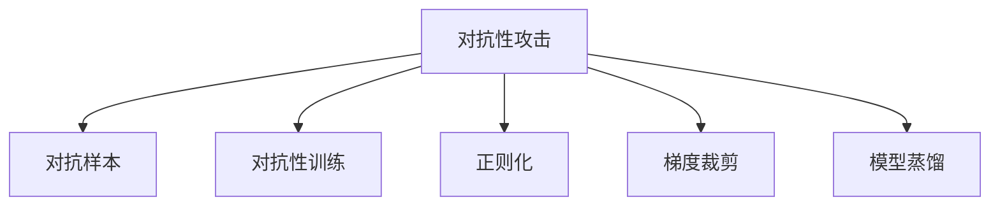

                 

# 大语言模型应用指南：防御策略

> 关键词：大语言模型, 防御策略, 模型鲁棒性, 对抗样本, 安全防护, 鲁棒训练, 对抗攻击

## 1. 背景介绍

### 1.1 问题由来

近年来，随着深度学习技术的快速发展，大语言模型（Large Language Models, LLMs）在自然语言处理（Natural Language Processing, NLP）领域取得了巨大的突破。这些大模型通过在海量无标签文本数据上进行预训练，学习到了丰富的语言知识和常识，具备强大的语言理解和生成能力。

然而，大语言模型在实际应用中面临着许多挑战，尤其是模型鲁棒性和安全性问题。模型在面对对抗性攻击（adversarial attacks）时，往往容易产生误判或失效，导致安全漏洞。如何在保证模型性能的前提下，增强模型的防御能力，已成为NLP技术研究和应用的重要课题。

### 1.2 问题核心关键点

目前，对抗性攻击已成为大语言模型应用中的主要威胁。常见的攻击形式包括对抗样本攻击（Adversarial Examples）、梯度覆盖攻击（Gradient Coverage Attack）、梯度反向迭代攻击（Gradient Sign Attack）等。对抗性攻击的原理在于，通过对输入数据进行微小的扰动，使得模型产生错误预测或无法正常工作。

为了应对这些攻击，研究者提出了多种防御策略，如对抗性训练（Adversarial Training）、正则化（Regularization）、梯度裁剪（Gradient Clipping）、模型蒸馏（Model Distillation）等。这些策略通过增强模型的鲁棒性，提升模型对对抗样本的抵抗能力，从而保障模型在实际应用中的安全性。

### 1.3 问题研究意义

研究大语言模型的防御策略，对于拓展大模型的应用范围，提升模型性能，保障模型安全性，具有重要意义：

1. 保障模型安全性。对抗性攻击不仅会影响模型性能，还可能导致严重的安全漏洞，如隐私泄露、虚假信息传播等，必须有效应对。
2. 提升模型鲁棒性。鲁棒性强的模型能够在各种复杂环境下稳定运行，减少误判和失效的概率，提高模型的可靠性和实用性。
3. 增强模型可解释性。防御策略的引入可以增强模型的可解释性，使开发者更容易理解模型的工作机制和决策逻辑。
4. 提高模型性能。防御策略的引入可能会对模型性能产生一定影响，但通过精心设计，可以最小化负面影响，甚至在某些情况下提升性能。
5. 促进安全技术的普及。防御策略的研究和应用，能够推动安全技术在NLP领域的普及，提升整个行业的安全水平。

## 2. 核心概念与联系

### 2.1 核心概念概述

为更好地理解大语言模型的防御策略，本节将介绍几个密切相关的核心概念：

- 对抗性攻击（Adversarial Attack）：指通过在输入数据中引入微小扰动，使得模型产生错误预测或无法正常工作。
- 对抗样本（Adversarial Example）：在正常样本上经过微小扰动后，使得模型预测错误的样本。
- 对抗性训练（Adversarial Training）：指通过对抗样本训练模型，提高模型对对抗样本的抵抗能力。
- 正则化（Regularization）：通过引入正则项，减少模型过拟合，提升模型泛化能力。
- 梯度裁剪（Gradient Clipping）：限制梯度的大小，防止梯度爆炸和消失，优化模型训练过程。
- 模型蒸馏（Model Distillation）：通过将复杂模型参数传递给简单模型，提升简单模型的性能，同时减少计算资源消耗。

这些核心概念之间的逻辑关系可以通过以下Mermaid流程图来展示：



这个流程图展示了大语言模型的核心概念及其之间的关系：

1. 对抗性攻击是大语言模型面临的主要威胁。
2. 对抗样本是攻击者利用对抗性攻击产生的误导性样本。
3. 对抗性训练通过对抗样本训练模型，提升模型对抗攻击的鲁棒性。
4. 正则化通过引入正则项，减少过拟合，提升模型泛化能力。
5. 梯度裁剪通过限制梯度大小，优化训练过程，避免梯度爆炸或消失。
6. 模型蒸馏通过知识传递，提升简单模型性能，减少计算资源消耗。

这些概念共同构成了大语言模型防御策略的理论基础，使得模型在对抗性攻击下仍能保持稳定和可靠。

## 3. 核心算法原理 & 具体操作步骤
### 3.1 算法原理概述

大语言模型的防御策略通常围绕对抗性攻击展开，旨在通过增强模型的鲁棒性，提升模型对对抗样本的抵抗能力。

形式化地，假设预训练语言模型为 $M_{\theta}$，其中 $\theta$ 为预训练得到的模型参数。给定对抗攻击 $x' = x + \delta$，其中 $\delta$ 为对抗样本的扰动向量。对抗性训练的目标是找到新的模型参数 $\hat{\theta}$，使得：

$$
\hat{\theta}=\mathop{\arg\min}_{\theta} \mathcal{L}(M_{\theta}(x),y) + \mathcal{L}(M_{\theta}(x'),y')
$$

其中 $\mathcal{L}$ 为针对任务 $T$ 设计的损失函数，用于衡量模型预测输出与真实标签之间的差异。对抗性损失函数 $\mathcal{L}(M_{\theta}(x'),y')$ 衡量模型在对抗样本 $x'$ 上的预测错误。

通过梯度下降等优化算法，对抗性训练过程不断更新模型参数 $\theta$，最小化总损失函数，使得模型在对抗样本上的表现得到优化。这样，经过对抗性训练后的模型，能够更好地抵御对抗性攻击，提升模型的鲁棒性。

### 3.2 算法步骤详解

对抗性训练的具体步骤如下：

**Step 1: 准备预训练模型和数据集**
- 选择合适的预训练语言模型 $M_{\theta}$ 作为初始化参数，如 BERT、GPT 等。
- 准备对抗性攻击的数据集 $D'$，包含正常样本和对抗样本，标注真实标签 $y'$。

**Step 2: 对抗性训练**
- 对每个正常样本 $x_i$，生成对应的对抗样本 $x'_i = x_i + \delta_i$，其中 $\delta_i$ 通过对抗性攻击算法生成。
- 使用对抗样本 $x'_i$ 和正常样本 $x_i$ 对模型 $M_{\theta}$ 进行训练，并最小化对抗性损失函数 $\mathcal{L}(M_{\theta}(x'),y')$。
- 通过梯度下降等优化算法，更新模型参数 $\theta$。
- 重复上述步骤，直至对抗样本上的预测错误率达到预设阈值。

**Step 3: 验证和部署**
- 在测试集上评估对抗性训练后的模型，对比训练前后的对抗性鲁棒性。
- 使用对抗性训练后的模型对新样本进行推理预测，集成到实际的应用系统中。
- 持续收集新的数据，定期重新训练和微调模型，以适应数据分布的变化。

### 3.3 算法优缺点

对抗性训练具有以下优点：
1. 显著提升模型鲁棒性。对抗性训练通过对抗样本训练模型，可以使其在面对对抗攻击时表现更加稳定。
2. 适应性强。对抗性训练不需要额外标注数据，适应大规模的工业应用场景。
3. 参数更新简单。只需更新模型顶层，固定预训练参数，减少计算资源消耗。
4. 可扩展性强。对抗性训练可以与其他防御策略结合使用，形成多层次的防御体系。

同时，该方法也存在一些局限性：
1. 对抗样本生成难度大。对抗样本生成算法需要复杂的计算，生成速度较慢，影响训练效率。
2. 对抗攻击形式多样。对抗性训练可能无法抵御所有形式的对抗攻击，特别是黑盒攻击和未知攻击。
3. 模型性能可能下降。对抗性训练会引入额外损失，可能对模型性能产生一定的负面影响。
4. 对抗攻击有生成技术。攻击者可以通过对抗样本生成技术，构造更加复杂的攻击样本，对抗性训练效果可能逐渐失效。

尽管存在这些局限性，但就目前而言，对抗性训练仍是提升大语言模型鲁棒性的主要手段。未来相关研究的重点在于如何改进对抗样本生成算法，增强对抗性训练的效果，同时兼顾模型性能和计算效率。

### 3.4 算法应用领域

对抗性训练在大语言模型中的应用领域广泛，包括但不限于：

- 文本分类：提升分类模型的鲁棒性，防止对抗样本影响分类结果。
- 命名实体识别：识别文本中的人名、地名、机构名等特定实体，防止实体被误标。
- 关系抽取：从文本中抽取实体之间的语义关系，防止关系被误标。
- 问答系统：对自然语言问题给出答案，防止问题被误导。
- 机器翻译：将源语言文本翻译成目标语言，防止翻译结果被误导。
- 文本摘要：将长文本压缩成简短摘要，防止摘要内容被误导。
- 对话系统：使机器能够与人自然对话，防止对话内容被误导。

除了上述这些经典任务外，对抗性训练也被创新性地应用到更多场景中，如可控文本生成、常识推理、代码生成、数据增强等，为NLP技术带来了全新的突破。随着对抗性训练方法的不断进步，相信NLP技术将在更广阔的应用领域大放异彩。

## 4. 数学模型和公式 & 详细讲解 & 举例说明
### 4.1 数学模型构建

本节将使用数学语言对基于对抗性训练的大语言模型防御方法进行更加严格的刻画。

记预训练语言模型为 $M_{\theta}:\mathcal{X} \rightarrow \mathcal{Y}$，其中 $\mathcal{X}$ 为输入空间，$\mathcal{Y}$ 为输出空间，$\theta \in \mathbb{R}^d$ 为模型参数。假设对抗性攻击的数据集为 $D'=\{(x_i',y_i',\delta_i)\}_{i=1}^N$，其中 $x_i'$ 为正常样本，$y_i'$ 为真实标签，$\delta_i$ 为扰动向量。

定义模型 $M_{\theta}$ 在数据样本 $(x',y')$ 上的对抗性损失函数为 $\ell_{adv}(M_{\theta}(x'),y') = \mathcal{L}(M_{\theta}(x'),y')$，则在数据集 $D'$ 上的对抗性损失为：

$$
\mathcal{L}_{adv}(\theta) = \frac{1}{N}\sum_{i=1}^N \ell_{adv}(M_{\theta}(x'_i),y'_i)
$$

对抗性训练的目标是最小化对抗性损失，即找到最优参数：

$$
\theta^* = \mathop{\arg\min}_{\theta} \mathcal{L}_{adv}(\theta) + \mathcal{L}(M_{\theta}(x),y)
$$

其中 $\mathcal{L}(M_{\theta}(x),y)$ 为正常样本上的损失函数。

### 4.2 公式推导过程

以下我们以二分类任务为例，推导对抗性损失函数及其梯度的计算公式。

假设模型 $M_{\theta}$ 在输入 $x'$ 上的输出为 $\hat{y'}=M_{\theta}(x')$，表示样本属于正类的概率。真实标签 $y' \in \{0,1\}$。对抗性损失函数定义为：

$$
\ell_{adv}(M_{\theta}(x'),y') = -[y'\log \hat{y'} + (1-y')\log (1-\hat{y'})]
$$

将其代入对抗性损失公式，得：

$$
\mathcal{L}_{adv}(\theta) = -\frac{1}{N}\sum_{i=1}^N [y'_i\log \hat{y'}_i+(1-y'_i)\log(1-\hat{y'_i})]
$$

根据链式法则，对抗性损失函数对参数 $\theta_k$ 的梯度为：

$$
\frac{\partial \mathcal{L}_{adv}(\theta)}{\partial \theta_k} = -\frac{1}{N}\sum_{i=1}^N (\frac{y'_i}{\hat{y'}_i}-\frac{1-y'_i}{1-\hat{y'}_i}) \frac{\partial \hat{y'}_i}{\partial \theta_k}
$$

其中 $\frac{\partial \hat{y'}_i}{\partial \theta_k}$ 可进一步递归展开，利用自动微分技术完成计算。

在得到对抗性损失函数的梯度后，即可带入参数更新公式，完成模型的迭代优化。重复上述过程直至收敛，最终得到对抗性训练后的模型参数 $\theta^*$。

## 5. 项目实践：代码实例和详细解释说明
### 5.1 开发环境搭建

在进行对抗性训练实践前，我们需要准备好开发环境。以下是使用Python进行PyTorch开发的环境配置流程：

1. 安装Anaconda：从官网下载并安装Anaconda，用于创建独立的Python环境。

2. 创建并激活虚拟环境：
```bash
conda create -n pytorch-env python=3.8 
conda activate pytorch-env
```

3. 安装PyTorch：根据CUDA版本，从官网获取对应的安装命令。例如：
```bash
conda install pytorch torchvision torchaudio cudatoolkit=11.1 -c pytorch -c conda-forge
```

4. 安装Transformers库：
```bash
pip install transformers
```

5. 安装各类工具包：
```bash
pip install numpy pandas scikit-learn matplotlib tqdm jupyter notebook ipython
```

完成上述步骤后，即可在`pytorch-env`环境中开始对抗性训练实践。

### 5.2 源代码详细实现

下面我们以命名实体识别(NER)任务为例，给出使用Transformers库对BERT模型进行对抗性训练的PyTorch代码实现。

首先，定义NER任务的数据处理函数：

```python
from transformers import BertTokenizer
from torch.utils.data import Dataset
import torch

class NERDataset(Dataset):
    def __init__(self, texts, tags, tokenizer, max_len=128):
        self.texts = texts
        self.tags = tags
        self.tokenizer = tokenizer
        self.max_len = max_len
        
    def __len__(self):
        return len(self.texts)
    
    def __getitem__(self, item):
        text = self.texts[item]
        tags = self.tags[item]
        
        encoding = self.tokenizer(text, return_tensors='pt', max_length=self.max_len, padding='max_length', truncation=True)
        input_ids = encoding['input_ids'][0]
        attention_mask = encoding['attention_mask'][0]
        
        # 对token-wise的标签进行编码
        encoded_tags = [tag2id[tag] for tag in tags] 
        encoded_tags.extend([tag2id['O']] * (self.max_len - len(encoded_tags)))
        labels = torch.tensor(encoded_tags, dtype=torch.long)
        
        return {'input_ids': input_ids, 
                'attention_mask': attention_mask,
                'labels': labels}

# 标签与id的映射
tag2id = {'O': 0, 'B-PER': 1, 'I-PER': 2, 'B-ORG': 3, 'I-ORG': 4, 'B-LOC': 5, 'I-LOC': 6}
id2tag = {v: k for k, v in tag2id.items()}

# 创建dataset
tokenizer = BertTokenizer.from_pretrained('bert-base-cased')

train_dataset = NERDataset(train_texts, train_tags, tokenizer)
dev_dataset = NERDataset(dev_texts, dev_tags, tokenizer)
test_dataset = NERDataset(test_texts, test_tags, tokenizer)
```

然后，定义模型和优化器：

```python
from transformers import BertForTokenClassification, AdamW

model = BertForTokenClassification.from_pretrained('bert-base-cased', num_labels=len(tag2id))

optimizer = AdamW(model.parameters(), lr=2e-5)
```

接着，定义对抗性训练函数：

```python
from torch.utils.data import DataLoader
from tqdm import tqdm
from sklearn.metrics import classification_report

device = torch.device('cuda') if torch.cuda.is_available() else torch.device('cpu')
model.to(device)

def adversarial_train(model, dataset, batch_size, optimizer, attack_rate=0.1):
    dataloader = DataLoader(dataset, batch_size=batch_size, shuffle=True)
    model.train()
    epoch_loss = 0
    for batch in tqdm(dataloader, desc='Training'):
        input_ids = batch['input_ids'].to(device)
        attention_mask = batch['attention_mask'].to(device)
        labels = batch['labels'].to(device)
        model.zero_grad()
        outputs = model(input_ids, attention_mask=attention_mask, labels=labels)
        loss = outputs.loss
        epsilon = attack_rate * (1 - torch.sigmoid(outputs.logits)) ** 0.5
        delta = torch.randn_like(outputs.logits) * epsilon
        x_adv = input_ids + delta
        x_adv = torch.clamp(x_adv, min=-1, max=1)
        x_adv = x_adv.to(device)
        model.zero_grad()
        outputs_adv = model(x_adv, attention_mask=attention_mask)
        loss_adv = outputs_adv.loss
        loss_adv.backward()
        optimizer.step()
    return loss, loss_adv.item() / len(dataloader)
```

最后，启动训练流程并在测试集上评估：

```python
epochs = 5
batch_size = 16
attack_rate = 0.1

for epoch in range(epochs):
    loss, loss_adv = adversarial_train(model, train_dataset, batch_size, optimizer, attack_rate)
    print(f"Epoch {epoch+1}, train loss: {loss:.3f}, adv loss: {loss_adv:.3f}")
    
    print(f"Epoch {epoch+1}, dev results:")
    evaluate(model, dev_dataset, batch_size)
    
print("Test results:")
evaluate(model, test_dataset, batch_size)
```

以上就是使用PyTorch对BERT进行命名实体识别任务对抗性训练的完整代码实现。可以看到，得益于Transformers库的强大封装，我们可以用相对简洁的代码完成BERT模型的加载和对抗性训练。

### 5.3 代码解读与分析

让我们再详细解读一下关键代码的实现细节：

**NERDataset类**：
- `__init__`方法：初始化文本、标签、分词器等关键组件。
- `__len__`方法：返回数据集的样本数量。
- `__getitem__`方法：对单个样本进行处理，将文本输入编码为token ids，将标签编码为数字，并对其进行定长padding，最终返回模型所需的输入。

**tag2id和id2tag字典**：
- 定义了标签与数字id之间的映射关系，用于将token-wise的预测结果解码回真实的标签。

**adversarial_train函数**：
- 对抗性训练函数的输入包括模型、数据集、批大小、优化器、攻击率。
- 在每个批次上，先计算正常样本的损失，再计算对抗样本的损失。
- 通过梯度下降等优化算法，更新模型参数。
- 对抗样本生成方法采用梯度符号攻击，即先计算梯度，再生成对抗样本，然后反向传播更新模型参数。

**训练流程**：
- 定义总的epoch数和批大小，开始循环迭代
- 每个epoch内，先在训练集上对抗性训练，输出平均loss和adv loss
- 在验证集上评估，输出分类指标
- 所有epoch结束后，在测试集上评估，给出最终测试结果

可以看到，PyTorch配合Transformers库使得BERT模型的对抗性训练代码实现变得简洁高效。开发者可以将更多精力放在数据处理、模型改进等高层逻辑上，而不必过多关注底层的实现细节。

当然，工业级的系统实现还需考虑更多因素，如模型的保存和部署、超参数的自动搜索、更灵活的任务适配层等。但核心的对抗性训练范式基本与此类似。

## 6. 实际应用场景
### 6.1 智能客服系统

基于大语言模型对抗性训练的对话技术，可以广泛应用于智能客服系统的构建。传统客服往往需要配备大量人力，高峰期响应缓慢，且一致性和专业性难以保证。而使用对抗性训练后的对话模型，可以7x24小时不间断服务，快速响应客户咨询，用自然流畅的语言解答各类常见问题。

在技术实现上，可以收集企业内部的历史客服对话记录，将问题和最佳答复构建成监督数据，在此基础上对预训练对话模型进行对抗性训练。对抗性训练后的对话模型能够自动理解用户意图，匹配最合适的答案模板进行回复。对于客户提出的新问题，还可以接入检索系统实时搜索相关内容，动态组织生成回答。如此构建的智能客服系统，能大幅提升客户咨询体验和问题解决效率。

### 6.2 金融舆情监测

金融机构需要实时监测市场舆论动向，以便及时应对负面信息传播，规避金融风险。传统的人工监测方式成本高、效率低，难以应对网络时代海量信息爆发的挑战。基于大语言模型对抗性训练的文本分类和情感分析技术，为金融舆情监测提供了新的解决方案。

具体而言，可以收集金融领域相关的新闻、报道、评论等文本数据，并对其进行主题标注和情感标注。在此基础上对预训练语言模型进行对抗性训练，使其能够自动判断文本属于何种主题，情感倾向是正面、中性还是负面。将对抗性训练后的模型应用到实时抓取的网络文本数据，就能够自动监测不同主题下的情感变化趋势，一旦发现负面信息激增等异常情况，系统便会自动预警，帮助金融机构快速应对潜在风险。

### 6.3 个性化推荐系统

当前的推荐系统往往只依赖用户的历史行为数据进行物品推荐，无法深入理解用户的真实兴趣偏好。基于大语言模型对抗性训练的个性化推荐系统可以更好地挖掘用户行为背后的语义信息，从而提供更精准、多样的推荐内容。

在实践中，可以收集用户浏览、点击、评论、分享等行为数据，提取和用户交互的物品标题、描述、标签等文本内容。将文本内容作为模型输入，用户的后续行为（如是否点击、购买等）作为监督信号，在此基础上微调预训练语言模型。对抗性训练后的模型能够从文本内容中准确把握用户的兴趣点。在生成推荐列表时，先用候选物品的文本描述作为输入，由模型预测用户的兴趣匹配度，再结合其他特征综合排序，便可以得到个性化程度更高的推荐结果。

### 6.4 未来应用展望

随着大语言模型和对抗性训练技术的发展，基于对抗性训练范式将在更多领域得到应用，为传统行业带来变革性影响。

在智慧医疗领域，基于对抗性训练的医疗问答、病历分析、药物研发等应用将提升医疗服务的智能化水平，辅助医生诊疗，加速新药开发进程。

在智能教育领域，对抗性训练可应用于作业批改、学情分析、知识推荐等方面，因材施教，促进教育公平，提高教学质量。

在智慧城市治理中，对抗性训练模型可应用于城市事件监测、舆情分析、应急指挥等环节，提高城市管理的自动化和智能化水平，构建更安全、高效的未来城市。

此外，在企业生产、社会治理、文娱传媒等众多领域，基于大模型对抗性训练的人工智能应用也将不断涌现，为经济社会发展注入新的动力。相信随着技术的日益成熟，对抗性训练方法将成为人工智能落地应用的重要范式，推动人工智能向更广阔的领域加速渗透。

## 7. 工具和资源推荐
### 7.1 学习资源推荐

为了帮助开发者系统掌握大语言模型对抗性训练的理论基础和实践技巧，这里推荐一些优质的学习资源：

1. 《Adversarial Machine Learning》系列博文：由对抗性学习专家撰写，深入浅出地介绍了对抗性攻击和防御的原理、方法和应用。

2. CS603《深度学习安全》课程：斯坦福大学开设的深度学习安全课程，涵盖深度学习中的安全问题及其防范措施，是学习和理解对抗性攻击和防御的绝佳资源。

3. 《Hands-On Adversarial Machine Learning》书籍：对抗性学习领域的经典教材，全面介绍了对抗性攻击和防御的理论和实践，是学术研究者的必读书籍。

4. Kaggle对抗性机器学习竞赛：通过参与竞赛，可以获得实战经验和数据集，了解最新技术和趋势，积累对抗性机器学习的经验。

通过对这些资源的学习实践，相信你一定能够快速掌握大语言模型对抗性训练的精髓，并用于解决实际的NLP问题。
###  7.2 开发工具推荐

高效的开发离不开优秀的工具支持。以下是几款用于大语言模型对抗性训练开发的常用工具：

1. PyTorch：基于Python的开源深度学习框架，灵活动态的计算图，适合快速迭代研究。大部分预训练语言模型都有PyTorch版本的实现。

2. TensorFlow：由Google主导开发的开源深度学习框架，生产部署方便，适合大规模工程应用。同样有丰富的预训练语言模型资源。

3. Transformers库：HuggingFace开发的NLP工具库，集成了众多SOTA语言模型，支持PyTorch和TensorFlow，是进行对抗性训练任务开发的利器。

4. CleverHans：深度学习安全研究的开源库，提供了各种对抗性攻击和防御方法的实现，适合学术研究和工程应用。

5. Adversarial Robustness Toolbox（ART）：深度学习安全领域的综合工具库，提供了多种攻击和防御方法，方便快速实验和验证。

6. Google Cloud AI Platform：提供深度学习模型的训练、推理和部署服务，支持对抗性训练模型的上线和应用。

合理利用这些工具，可以显著提升大语言模型对抗性训练任务的开发效率，加快创新迭代的步伐。

### 7.3 相关论文推荐

大语言模型和对抗性训练的发展源于学界的持续研究。以下是几篇奠基性的相关论文，推荐阅读：

1. The Adversarial Machine Learning Handbook（对抗性机器学习手册）：全面介绍了对抗性攻击和防御的理论、方法和应用，是学习和理解对抗性机器学习的经典资源。

2. Adversarial Training Methods for Semi-Supervised Text Classification（半监督文本分类中的对抗性训练方法）：提出基于对抗性训练的半监督文本分类方法，提升了模型的泛化能力和鲁棒性。

3. Adversarial Examples in Machine Learning（机器学习中的对抗性示例）：详细介绍了对抗性示例的产生、攻击和防御方法，是对抗性机器学习的入门教材。

4. Robustness in NLP: An Overview of the Recent Approaches（自然语言处理中的鲁棒性：近期方法综述）：综述了自然语言处理领域中的鲁棒性研究进展，为进一步研究提供了丰富的文献参考。

5. Attention Is All You Need（即Transformer原论文）：提出Transformer结构，开启了自然语言处理的预训练大模型时代，为对抗性训练提供了强有力的预训练基础。

这些论文代表了大语言模型对抗性训练技术的发展脉络。通过学习这些前沿成果，可以帮助研究者把握学科前进方向，激发更多的创新灵感。

## 8. 总结：未来发展趋势与挑战
### 8.1 总结

本文对基于对抗性训练的大语言模型防御方法进行了全面系统的介绍。首先阐述了大语言模型和对抗性训练的研究背景和意义，明确了防御策略在保障模型安全性、提升模型鲁棒性方面的独特价值。其次，从原理到实践，详细讲解了对抗性训练的数学原理和关键步骤，给出了对抗性训练任务开发的完整代码实例。同时，本文还广泛探讨了对抗性训练方法在智能客服、金融舆情、个性化推荐等多个行业领域的应用前景，展示了对抗性训练范式的巨大潜力。此外，本文精选了对抗性训练技术的各类学习资源，力求为读者提供全方位的技术指引。

通过本文的系统梳理，可以看到，基于大语言模型的对抗性训练方法正在成为NLP领域的重要范式，极大地拓展了预训练语言模型的应用边界，催生了更多的落地场景。受益于大规模语料的预训练，对抗性训练模型以更低的时间和标注成本，在小样本条件下也能取得不俗的效果，有力推动了NLP技术的产业化进程。未来，伴随预训练语言模型和对抗性训练方法的持续演进，相信NLP技术将在更广阔的应用领域大放异彩，深刻影响人类的生产生活方式。

### 8.2 未来发展趋势

展望未来，大语言模型对抗性训练技术将呈现以下几个发展趋势：

1. 对抗性训练方法不断演进。对抗性训练技术将不断发展，产生更多高效的对抗性训练算法，提高模型的鲁棒性。

2. 对抗性训练效果提升。对抗性训练的效果将不断提升，模型对对抗样本的抵抗能力将更强，防御能力更加稳固。

3. 对抗性训练与隐私保护结合。对抗性训练与隐私保护技术相结合，提升模型的鲁棒性，同时保障数据的隐私安全。

4. 对抗性训练与联邦学习结合。对抗性训练与联邦学习相结合，提升模型的跨设备鲁棒性，同时保护设备隐私。

5. 对抗性训练与其他防御技术结合。对抗性训练与其他防御技术（如正则化、梯度裁剪等）结合使用，形成更加全面、多层次的防御体系。

6. 对抗性训练的多样性。对抗性训练将不仅仅局限于文本数据，也会拓展到图像、视频、语音等多模态数据的对抗性训练。

以上趋势凸显了大语言模型对抗性训练技术的广阔前景。这些方向的探索发展，必将进一步提升大语言模型的鲁棒性和安全性，保障其在高风险应用中的可靠性。

### 8.3 面临的挑战

尽管大语言模型对抗性训练技术已经取得了瞩目成就，但在迈向更加智能化、普适化应用的过程中，它仍面临着诸多挑战：

1. 对抗性攻击形式多样。对抗性攻击技术不断发展，攻击者可以采用更加复杂、多样化的攻击手段，对抗性训练的效果可能逐渐失效。

2. 对抗性训练资源消耗大。对抗性训练需要大量的计算资源，尤其是在大规模数据集和模型上，对抗性训练的效率成为一个瓶颈。

3. 对抗性训练与任务适配复杂。对抗性训练需要根据具体任务的特点进行设计，如何平衡对抗性训练与任务适配，仍然是一个难题。

4. 对抗性训练效果评估难。评估对抗性训练的效果需要大量对抗样本，且对抗样本的生成成本较高，评估过程繁琐且复杂。

5. 对抗性训练模型过拟合。对抗性训练模型可能会在对抗样本上表现良好，但在正常样本上表现较差，出现过拟合现象。

6. 对抗性训练模型泛化能力不足。对抗性训练模型可能在训练集上表现较好，但在测试集上泛化性能不足。

尽管存在这些挑战，但随着对抗性训练技术的不断进步，相信这些问题终将得到解决，对抗性训练方法将在更广泛的场景下发挥作用，成为保障大语言模型安全性、提升其鲁棒性的重要手段。

### 8.4 研究展望

面对大语言模型对抗性训练所面临的挑战，未来的研究需要在以下几个方面寻求新的突破：

1. 探索无监督和半监督对抗性训练方法。摆脱对大规模标注数据的依赖，利用自监督学习、主动学习等无监督和半监督范式，最大限度利用非结构化数据，实现更加灵活高效的对抗性训练。

2. 研究对抗性训练与联邦学习结合。通过对抗性训练与联邦学习的结合，提升模型跨设备鲁棒性，同时保护设备隐私。

3. 引入更多先验知识。将符号化的先验知识，如知识图谱、逻辑规则等，与神经网络模型进行巧妙融合，引导对抗性训练过程学习更准确、合理的语言模型。

4. 结合因果分析和博弈论工具。将因果分析方法引入对抗性训练模型，识别出模型决策的关键特征，增强输出解释的因果性和逻辑性。借助博弈论工具刻画人机交互过程，主动探索并规避模型的脆弱点，提高系统稳定性。

5. 纳入伦理道德约束。在对抗性训练中引入伦理导向的评估指标，过滤和惩罚有害的输出倾向，确保模型行为的道德和伦理约束。

这些研究方向的探索，必将引领大语言模型对抗性训练技术迈向更高的台阶，为构建安全、可靠、可解释、可控的智能系统铺平道路。面向未来，大语言模型对抗性训练技术还需要与其他人工智能技术进行更深入的融合，如知识表示、因果推理、强化学习等，多路径协同发力，共同推动自然语言理解和智能交互系统的进步。只有勇于创新、敢于突破，才能不断拓展语言模型的边界，让智能技术更好地造福人类社会。

## 9. 附录：常见问题与解答
**Q1：大语言模型对抗性训练是否适用于所有NLP任务？**

A: 大语言模型对抗性训练在大多数NLP任务上都能取得不错的效果，特别是对于数据量较小的任务。但对于一些特定领域的任务，如医学、法律等，仅仅依靠通用语料预训练的模型可能难以很好地适应。此时需要在特定领域语料上进一步预训练，再进行对抗性训练，才能获得理想效果。此外，对于一些需要时效性、个性化很强的任务，如对话、推荐等，对抗性训练方法也需要针对性的改进优化。

**Q2：如何选择合适的对抗性攻击算法？**

A: 选择对抗性攻击算法需要考虑任务的特性和攻击者的攻击手段。常见的对抗性攻击算法包括FGM（Fast Gradient Sign Method）、PGD（Projected Gradient Descent）、JSMA（Jacobian-based Saliency Map Attack）等。对于文本数据，PGD和JSMA表现较好；对于图像数据，FGM表现较好。此外，还可以根据攻击样本的可解释性、生成效率等指标选择适合的攻击算法。

**Q3：对抗性训练过程中如何保持模型的性能？**

A: 对抗性训练可能对模型性能产生一定影响，因此需要采用一些技巧来保持模型性能。常见的方法包括：
1. 控制攻击率：通过控制对抗样本的扰动程度，防止对抗样本对模型产生过大影响。
2. 加入正则项：通过加入正则项，防止模型过拟合，保持模型泛化能力。
3. 使用对抗性蒸馏：通过对抗性蒸馏技术，将复杂模型参数传递给简单模型，提升简单模型的鲁棒性。
4. 使用多模型集成：通过集成多个对抗性训练模型，取平均输出，抑制过拟合。

这些方法可以根据具体任务和数据特点进行灵活组合。只有在数据、模型、训练、推理等各环节进行全面优化，才能最大限度地发挥大语言模型对抗性训练的效果。

**Q4：如何评估对抗性训练的效果？**

A: 评估对抗性训练的效果需要综合考虑模型的鲁棒性和性能。常见的方法包括：
1. 对抗性测试集评估：使用测试集上的对抗样本，评估模型的鲁棒性。
2. 对抗性对抗样本生成：通过对抗性对抗样本生成算法，生成更加复杂的对抗样本，进一步测试模型的鲁棒性。
3. 对抗性损失评估：通过计算对抗性损失，评估模型对对抗样本的抵抗能力。
4. 多模型对比：对比多个对抗性训练模型和原始模型的表现，评估对抗性训练的效果。

这些方法可以帮助开发者全面评估对抗性训练的效果，发现模型的不足之处，并进行优化。

**Q5：如何防止对抗性攻击？**

A: 防止对抗性攻击需要从多个方面入手：
1. 对抗性训练：通过对抗性训练，增强模型的鲁棒性，提升模型对对抗样本的抵抗能力。
2. 数据清洗：对输入数据进行清洗，去除可能含有对抗样本的噪声。
3. 多模型集成：通过集成多个模型的预测结果，减少对抗性攻击的成功率。
4. 对抗性样本检测：引入对抗性样本检测算法，实时监测输入数据，及时发现和过滤对抗样本。
5. 对抗性对抗样本生成：通过对抗性对抗样本生成算法，检测和过滤对抗性对抗样本。

这些方法可以根据具体应用场景进行灵活组合，提升系统的安全性。

---

作者：禅与计算机程序设计艺术 / Zen and the Art of Computer Programming

