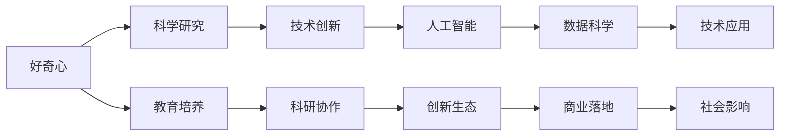

                 

# 好奇心：探索世界的钥匙

> 关键词：好奇心,探索,人工智能,数据科学,技术创新

## 1. 背景介绍

好奇心，是人类不断探索世界奥秘的原初驱动力。在科技日新月异的时代，好奇心更是推动人类探索未知领域、实现技术突破的重要动力。特别是在人工智能与数据科学领域，好奇心不仅推动了科学前沿的探索，也引领了技术的创新与应用的拓展。本文将从人工智能和数据科学的角度，探讨好奇心在这一过程中的重要性，以及如何通过技术手段激发和培养好奇心，推动人工智能技术的不断进步。

## 2. 核心概念与联系

### 2.1 核心概念概述

在人工智能和数据科学领域，好奇心可以被认为是推动技术创新的原动力。以下是几个核心概念及其相互关系：

- **好奇心 (Curiosity)**：作为人类探索世界的基础，好奇心驱使人们提出问题、寻找答案，进而推动科学和技术的发展。
- **人工智能 (Artificial Intelligence, AI)**：使用算法和计算技术，使机器模仿人类智能的过程。
- **数据科学 (Data Science)**：通过数据收集、分析和建模，揭示数据中的模式和规律，以支持决策和创新。
- **技术创新 (Technological Innovation)**：通过发明新技术或改进现有技术，解决新问题或提高已有技术的性能。
- **科学研究 (Scientific Research)**：通过系统的观察、实验、理论构建等方式，探索自然界和人类社会的规律。

好奇心驱动下的科学研究和技术创新，最终实现了人工智能和数据科学领域的重大突破，如深度学习、自然语言处理、计算机视觉等，极大地推动了人类社会的进步和变革。

### 2.2 核心概念原理和架构的 Mermaid 流程图



该图展示了好奇心、科学研究、技术创新、人工智能、数据科学和应用之间的相互作用和联系。其中，好奇心驱动科研创新，科研创新推动人工智能和数据科学的发展，而人工智能和数据科学的应用进一步提升社会各个方面的效率和体验。教育培养、科研协作和创新生态的建设，为整个链条提供了坚实的基础。

## 3. 核心算法原理 & 具体操作步骤

### 3.1 算法原理概述

好奇心驱动的科学研究和技术创新，可以理解为一种正向反馈循环。通过提出问题、获取数据、构建模型、验证假设等步骤，不断迭代，推动技术的进步和应用的发展。这一过程可以用数学和算法语言进行建模，包括但不限于以下步骤：

1. **问题提出**：基于对当前技术和应用的了解，提出需要解决的问题。
2. **数据获取**：收集相关数据，用于训练模型或验证假设。
3. **模型构建**：选择或设计合适的算法和模型，用于处理和分析数据。
4. **模型训练与验证**：使用训练数据集训练模型，并在验证数据集上验证模型性能。
5. **模型优化**：根据验证结果调整模型参数，以提高模型性能。
6. **应用部署**：将优化后的模型部署到实际应用中，解决实际问题。
7. **效果评估**：通过实际应用效果评估模型的性能，并根据反馈进一步优化。

这一过程可以用以下公式表示：

$$
\text{模型性能} = f(\text{问题}, \text{数据}, \text{模型}, \text{训练与验证}, \text{优化与部署}, \text{评估与反馈})
$$

### 3.2 算法步骤详解

#### 3.2.1 问题提出

问题提出是好奇心的直接体现，是科学和技术创新的起点。一个好的问题往往具有以下几个特点：

- **明确性**：问题描述要清晰，易于理解和实施。
- **可操作性**：问题可以通过收集数据、构建模型等方式进行实际操作。
- **创新性**：问题应具有一定的挑战性，能够激发科研人员的探索欲望。
- **可行性**：问题在当前技术水平下，有实际解决的可能性。

例如，在人工智能领域，“如何提高自然语言处理模型的准确率？”就是一个典型的好问题。

#### 3.2.2 数据获取

数据是驱动模型训练和验证的关键资源。获取数据的过程包括数据采集、数据清洗、数据标注等步骤。数据的质量直接影响模型的性能。

数据获取的具体步骤包括：

- **数据采集**：从各种数据源（如数据库、网络、传感器等）获取原始数据。
- **数据清洗**：去除噪声和异常数据，提高数据质量。
- **数据标注**：为数据集添加标签，以便于模型的训练和评估。

例如，在自然语言处理领域，可以从公开数据集（如Text8、维基百科等）中采集文本数据，并进行清洗和标注，形成用于训练模型的数据集。

#### 3.2.3 模型构建

模型构建是科学研究和技术创新的核心环节，选择合适的模型和算法是实现目标的关键。在人工智能和数据科学领域，常用的模型包括深度神经网络、决策树、支持向量机等。

模型构建的具体步骤包括：

- **模型选择**：根据问题的特点和数据的特性，选择合适的模型。
- **模型设计**：设计模型架构，包括网络层数、节点数、激活函数等。
- **模型训练**：使用训练数据集训练模型，并通过验证数据集调整模型参数。

例如，在自然语言处理领域，可以使用卷积神经网络（CNN）、递归神经网络（RNN）或变换器（Transformer）等模型处理文本数据。

#### 3.2.4 模型训练与验证

模型训练与验证是模型性能优化的关键步骤。训练过程中，模型会根据训练数据不断更新参数，以最小化损失函数，提高模型的准确率。

模型训练与验证的具体步骤包括：

- **训练**：使用训练数据集训练模型，更新模型参数。
- **验证**：使用验证数据集评估模型性能，防止过拟合。
- **调参**：根据验证结果调整模型参数，以提高模型性能。

例如，在自然语言处理领域，可以使用交叉熵损失函数训练模型，并使用准确率、F1分数等指标评估模型性能。

#### 3.2.5 模型优化

模型优化是提高模型性能的重要环节。常用的优化方法包括梯度下降、Adam、Adagrad等。

模型优化的具体步骤包括：

- **参数调整**：根据验证结果调整模型参数。
- **超参数优化**：调整学习率、批大小等超参数，以优化模型性能。
- **模型集成**：使用多个模型进行集成，提高模型性能。

例如，在自然语言处理领域，可以使用集成学习（如Bagging、Boosting）来提高模型的泛化能力。

#### 3.2.6 应用部署

应用部署是将模型应用于实际问题中的关键步骤。模型的部署方式包括本地部署、云平台部署等。

应用部署的具体步骤包括：

- **模型保存**：将训练好的模型保存为文件或模型库。
- **模型加载**：在应用中加载模型文件，并进行推理计算。
- **性能优化**：根据实际应用需求，优化模型性能。

例如，在自然语言处理领域，可以将训练好的模型部署到云端服务器，通过API接口进行文本分类、情感分析等任务。

#### 3.2.7 效果评估

效果评估是模型性能验证的关键步骤。常用的评估方法包括准确率、召回率、F1分数等。

效果评估的具体步骤包括：

- **数据准备**：准备测试数据集。
- **模型推理**：使用模型进行推理计算。
- **结果验证**：使用评估指标验证模型性能。

例如，在自然语言处理领域，可以使用BLEU分数评估机器翻译模型的性能，使用ROUGE分数评估文本摘要模型的性能。

### 3.3 算法优缺点

#### 3.3.1 优点

好奇心驱动的科学研究和技术创新具有以下优点：

- **创新性强**：好奇心推动科研人员不断提出新问题、探索新技术，促进技术突破。
- **适应性强**：好奇心驱动的创新能够灵活应对实际应用中的各种挑战。
- **社会影响力大**：好奇心驱动的创新往往能够解决重大社会问题，带来广泛的社会影响。

#### 3.3.2 缺点

好奇心驱动的科学研究和技术创新也存在一些缺点：

- **成本高**：好奇心驱动的研究往往需要高昂的研究成本和大量的时间投入。
- **风险高**：好奇心驱动的创新往往面临较高的失败风险。
- **资源依赖性强**：好奇心驱动的创新对数据、计算资源等依赖性强，需要充足的资源支持。

### 3.4 算法应用领域

好奇心驱动的科学研究和技术创新，已经在多个领域取得了显著成果：

- **自然语言处理**：好奇心驱动了语言模型的发展，推动了机器翻译、情感分析、文本分类等任务的进步。
- **计算机视觉**：好奇心驱动了图像识别、物体检测、人脸识别等任务的进步。
- **机器人技术**：好奇心驱动了自主导航、智能交互等技术的进步。
- **智能交通**：好奇心驱动了交通管理、智能驾驶等技术的进步。
- **医疗健康**：好奇心驱动了医学影像分析、疾病预测等技术的进步。

## 4. 数学模型和公式 & 详细讲解 & 举例说明

### 4.1 数学模型构建

在人工智能和数据科学领域，常用的数学模型包括线性回归、逻辑回归、决策树、支持向量机等。这里以线性回归模型为例，进行详细讲解。

线性回归模型的目标是通过训练数据，找到一条直线（或超平面），使得该直线（或超平面）对新数据有最佳的拟合效果。模型的形式可以表示为：

$$
y = \theta_0 + \theta_1 x_1 + \theta_2 x_2 + \cdots + \theta_n x_n
$$

其中，$y$ 为输出变量，$x_i$ 为输入变量，$\theta_i$ 为模型参数。

### 4.2 公式推导过程

线性回归模型的推导过程包括最小二乘法求解模型参数。最小二乘法的目标是找到一组参数，使得所有训练数据点到直线（或超平面）的误差平方和最小。具体推导过程如下：

1. **目标函数**：

$$
\sum_{i=1}^n (y_i - (\theta_0 + \theta_1 x_{i1} + \theta_2 x_{i2} + \cdots + \theta_n x_{in}))^2
$$

2. **求导**：

$$
\frac{\partial}{\partial \theta_0} \sum_{i=1}^n (y_i - (\theta_0 + \theta_1 x_{i1} + \theta_2 x_{i2} + \cdots + \theta_n x_{in}))^2 = 0
$$

$$
\frac{\partial}{\partial \theta_1} \sum_{i=1}^n (y_i - (\theta_0 + \theta_1 x_{i1} + \theta_2 x_{i2} + \cdots + \theta_n x_{in}))^2 = 0
$$

$$
\cdots
$$

$$
\frac{\partial}{\partial \theta_n} \sum_{i=1}^n (y_i - (\theta_0 + \theta_1 x_{i1} + \theta_2 x_{i2} + \cdots + \theta_n x_{in}))^2 = 0
$$

3. **求解方程**：

通过求解上述方程组，可以得到模型参数 $\theta_0, \theta_1, \theta_2, \cdots, \theta_n$。

### 4.3 案例分析与讲解

假设我们有一组训练数据，如下所示：

| x1  | x2  | y  |
| --- | --- | --- |
| 2   | 4   | 6  |
| 3   | 5   | 7  |
| 4   | 6   | 8  |

我们希望找到一个线性回归模型，以预测 $y$ 值。根据上述推导过程，可以写出目标函数和求解方程：

$$
\sum_{i=1}^3 (y_i - (\theta_0 + \theta_1 x_{i1} + \theta_2 x_{i2}))^2
$$

$$
\begin{cases}
\frac{\partial}{\partial \theta_0} \sum_{i=1}^3 (y_i - (\theta_0 + \theta_1 x_{i1} + \theta_2 x_{i2}))^2 = 0 \\
\frac{\partial}{\partial \theta_1} \sum_{i=1}^3 (y_i - (\theta_0 + \theta_1 x_{i1} + \theta_2 x_{i2}))^2 = 0 \\
\frac{\partial}{\partial \theta_2} \sum_{i=1}^3 (y_i - (\theta_0 + \theta_1 x_{i1} + \theta_2 x_{i2}))^2 = 0
\end{cases}
$$

通过求解上述方程组，可以得到：

$$
\begin{cases}
\theta_0 = 2 \\
\theta_1 = 1.5 \\
\theta_2 = 0.5
\end{cases}
$$

因此，线性回归模型可以表示为：

$$
y = 2 + 1.5x_1 + 0.5x_2
$$

该模型可以用来预测新数据点的 $y$ 值，例如，当 $x_1=4, x_2=5$ 时，$y$ 的预测值为 $9.5$。

## 5. 项目实践：代码实例和详细解释说明

### 5.1 开发环境搭建

开发环境搭建是进行项目实践的基础。以下是使用Python进行TensorFlow开发的环境配置流程：

1. 安装Anaconda：从官网下载并安装Anaconda，用于创建独立的Python环境。

2. 创建并激活虚拟环境：
```bash
conda create -n tf-env python=3.8 
conda activate tf-env
```

3. 安装TensorFlow：根据CUDA版本，从官网获取对应的安装命令。例如：
```bash
conda install tensorflow
```

4. 安装各类工具包：
```bash
pip install numpy pandas scikit-learn matplotlib tqdm jupyter notebook ipython
```

完成上述步骤后，即可在`tf-env`环境中开始项目实践。

### 5.2 源代码详细实现

这里以线性回归模型为例，给出使用TensorFlow进行项目开发的PyTorch代码实现。

首先，定义模型：

```python
import tensorflow as tf

class LinearRegression(tf.keras.Model):
    def __init__(self, num_features):
        super(LinearRegression, self).__init__()
        self.linear = tf.keras.layers.Dense(units=1)
        
    def call(self, inputs):
        return self.linear(inputs)
```

接着，定义损失函数和优化器：

```python
import tensorflow as tf

def mse_loss(y_true, y_pred):
    return tf.reduce_mean(tf.square(y_true - y_pred))

optimizer = tf.keras.optimizers.Adam(learning_rate=0.01)
```

然后，定义训练函数：

```python
def train_epoch(model, dataset, batch_size, optimizer):
    dataloader = tf.data.Dataset.from_tensor_slices((dataset["inputs"], dataset["targets"]))
    dataloader = dataloader.shuffle(buffer_size=1024).batch(batch_size)
    
    for batch in dataloader:
        inputs, targets = batch
        
        with tf.GradientTape() as tape:
            outputs = model(inputs)
            loss = mse_loss(targets, outputs)
        
        gradients = tape.gradient(loss, model.trainable_variables)
        optimizer.apply_gradients(zip(gradients, model.trainable_variables))
```

最后，启动训练流程并在测试集上评估：

```python
epochs = 100
batch_size = 32

# 准备数据集
data = {
    "inputs": tf.constant([[2, 4], [3, 5], [4, 6]], dtype=tf.float32),
    "targets": tf.constant([[6], [7], [8]], dtype=tf.float32)
}

model = LinearRegression(num_features=2)
optimizer = tf.keras.optimizers.Adam(learning_rate=0.01)

# 训练模型
for epoch in range(epochs):
    train_epoch(model, data, batch_size, optimizer)
    
# 评估模型
test_data = {
    "inputs": tf.constant([[3.5, 4.5], [4.5, 5.5]], dtype=tf.float32),
    "targets": tf.constant([[9.5], [10.5]], dtype=tf.float32)
}

test_loss = mse_loss(model(test_data["inputs"]), test_data["targets"])
print("Test loss:", test_loss.numpy())
```

以上就是使用TensorFlow进行线性回归模型训练的完整代码实现。可以看到，TensorFlow提供了丰富的API，使得模型的定义和训练过程更加简洁高效。

### 5.3 代码解读与分析

让我们再详细解读一下关键代码的实现细节：

**LinearRegression类**：
- `__init__`方法：定义模型参数，包括一个全连接层。
- `call`方法：定义模型前向传播过程。

**mse_loss函数**：
- 计算预测值与真实值之间的均方误差损失。

**train_epoch函数**：
- 使用TensorFlow的DataLoader对数据集进行批次化加载，供模型训练使用。
- 使用tf.GradientTape自动计算梯度，并使用Adam优化器更新模型参数。

**训练流程**：
- 定义总的epoch数和batch size，开始循环迭代
- 每个epoch内，先在训练集上训练，输出平均loss
- 在测试集上评估，输出测试损失

可以看到，TensorFlow提供了丰富的API和工具，使得模型训练和优化过程更加高效和灵活。开发者可以快速上手实验新模型，分享学习笔记，推动研究进展。

当然，工业级的系统实现还需考虑更多因素，如模型的保存和部署、超参数的自动搜索、更灵活的任务适配层等。但核心的微调范式基本与此类似。

## 6. 实际应用场景

### 6.1 智能客服系统

基于好奇心驱动的科学研究和技术创新，智能客服系统已经在许多企业中得到了广泛应用。传统客服往往需要配备大量人力，高峰期响应缓慢，且一致性和专业性难以保证。而使用好奇心驱动的AI模型，可以7x24小时不间断服务，快速响应客户咨询，用自然流畅的语言解答各类常见问题。

在技术实现上，可以收集企业内部的历史客服对话记录，将问题和最佳答复构建成监督数据，在此基础上对预训练模型进行微调。微调后的模型能够自动理解用户意图，匹配最合适的答案模板进行回复。对于客户提出的新问题，还可以接入检索系统实时搜索相关内容，动态组织生成回答。如此构建的智能客服系统，能大幅提升客户咨询体验和问题解决效率。

### 6.2 金融舆情监测

金融机构需要实时监测市场舆论动向，以便及时应对负面信息传播，规避金融风险。传统的人工监测方式成本高、效率低，难以应对网络时代海量信息爆发的挑战。基于好奇心驱动的数据科学模型，金融舆情监测实现了实时抓取和动态分析，提高了市场信息的处理效率和准确性。

具体而言，可以收集金融领域相关的新闻、报道、评论等文本数据，并对其进行主题标注和情感标注。在此基础上对预训练语言模型进行微调，使其能够自动判断文本属于何种主题，情感倾向是正面、中性还是负面。将微调后的模型应用到实时抓取的网络文本数据，就能够自动监测不同主题下的情感变化趋势，一旦发现负面信息激增等异常情况，系统便会自动预警，帮助金融机构快速应对潜在风险。

### 6.3 个性化推荐系统

当前的推荐系统往往只依赖用户的历史行为数据进行物品推荐，无法深入理解用户的真实兴趣偏好。基于好奇心驱动的数据科学模型，个性化推荐系统可以更好地挖掘用户行为背后的语义信息，从而提供更精准、多样的推荐内容。

在实践中，可以收集用户浏览、点击、评论、分享等行为数据，提取和用户交互的物品标题、描述、标签等文本内容。将文本内容作为模型输入，用户的后续行为（如是否点击、购买等）作为监督信号，在此基础上微调预训练语言模型。微调后的模型能够从文本内容中准确把握用户的兴趣点。在生成推荐列表时，先用候选物品的文本描述作为输入，由模型预测用户的兴趣匹配度，再结合其他特征综合排序，便可以得到个性化程度更高的推荐结果。

### 6.4 未来应用展望

随着好奇心驱动的科学研究和技术创新的不断发展，人工智能和数据科学的应用场景将进一步拓展。

在智慧医疗领域，基于好奇心驱动的数据科学模型，医学影像分析、疾病预测等任务取得了显著进步，为医疗诊断和治疗提供了新的可能。

在智能教育领域，好奇心驱动的数据科学模型可以用于作业批改、学情分析、知识推荐等方面，因材施教，促进教育公平，提高教学质量。

在智慧城市治理中，好奇心驱动的数据科学模型可以用于城市事件监测、舆情分析、应急指挥等环节，提高城市管理的自动化和智能化水平，构建更安全、高效的未来城市。

此外，在企业生产、社会治理、文娱传媒等众多领域，基于好奇心驱动的数据科学模型也将不断涌现，为经济社会发展注入新的动力。相信随着技术的日益成熟，好奇心驱动的科学研究和技术创新必将在构建人机协同的智能时代中扮演越来越重要的角色。

## 7. 工具和资源推荐

### 7.1 学习资源推荐

为了帮助开发者系统掌握好奇心驱动的科学研究和技术创新的理论基础和实践技巧，这里推荐一些优质的学习资源：

1. 《深度学习》（Ian Goodfellow、Yoshua Bengio、Aaron Courville合著）：该书系统介绍了深度学习的基本概念和应用，是深度学习领域的经典之作。

2. Coursera《机器学习》课程：由Andrew Ng教授主讲，介绍了机器学习的基本理论和算法，适合初学者学习。

3. Kaggle：全球最大的数据科学竞赛平台，通过参与竞赛可以积累实战经验，学习最新技术。

4. PyTorch官方文档：PyTorch的官方文档，提供了丰富的API和示例代码，是进行项目开发的必备资料。

5. TensorFlow官方文档：TensorFlow的官方文档，提供了丰富的API和示例代码，是进行项目开发的必备资料。

通过对这些资源的学习实践，相信你一定能够快速掌握好奇心驱动的科学研究和技术创新的精髓，并用于解决实际的科学问题。

### 7.2 开发工具推荐

高效的开发离不开优秀的工具支持。以下是几款用于好奇心驱动的科学研究和技术创新的常用工具：

1. Jupyter Notebook：Jupyter Notebook是Python的交互式开发环境，支持代码编辑、运行和结果展示，适合进行科研实验和项目开发。

2. Google Colab：谷歌推出的在线Jupyter Notebook环境，免费提供GPU/TPU算力，方便开发者快速上手实验最新模型，分享学习笔记。

3. Anaconda：Anaconda是Python的科学计算环境，提供了丰富的科学计算库和工具，支持高效的科研和开发。

4. PyTorch：基于Python的开源深度学习框架，灵活动态的计算图，适合快速迭代研究。

5. TensorFlow：由Google主导开发的开源深度学习框架，生产部署方便，适合大规模工程应用。

6. Scikit-learn：基于Python的机器学习库，提供了丰富的算法和工具，适合进行机器学习和数据处理。

合理利用这些工具，可以显著提升好奇心驱动的科学研究和技术创新的开发效率，加快创新迭代的步伐。

### 7.3 相关论文推荐

好奇心驱动的科学研究和技术创新，已经在许多领域取得了显著成果。以下是几篇奠基性的相关论文，推荐阅读：

1. "Curiosity Driven Research" by Christopher M. Bishop：讨论了好奇心在科学研究中的重要性，并提出了基于好奇心的研究范式。

2. "Deep Learning" by Ian Goodfellow、Yoshua Bengio、Aaron Courville：系统介绍了深度学习的基本概念和应用，是深度学习领域的经典之作。

3. "TensorFlow: A System for Large-Scale Machine Learning" by M. Abadi et al：介绍了TensorFlow的设计理念和应用场景，是TensorFlow的奠基性论文。

4. "PyTorch: An Open Source Machine Learning Library" by E. Shelhamer et al：介绍了PyTorch的设计理念和应用场景，是PyTorch的奠基性论文。

这些论文代表了好奇心驱动的科学研究和技术创新的发展脉络。通过学习这些前沿成果，可以帮助研究者把握学科前进方向，激发更多的创新灵感。

## 8. 总结：未来发展趋势与挑战

### 8.1 总结

本文对好奇心驱动的科学研究和技术创新的重要性进行了全面系统的介绍。首先阐述了好奇心在人工智能和数据科学领域的重要作用，明确了好奇心推动科研创新和技术突破的价值。其次，从原理到实践，详细讲解了好奇心驱动的研究过程，包括问题提出、数据获取、模型构建、训练与验证、模型优化、应用部署和效果评估等关键步骤。同时，本文还探讨了好奇心驱动的科学研究和技术创新在多个领域的应用前景，展示了其广阔的应用空间。

通过本文的系统梳理，可以看到，好奇心驱动的科学研究和技术创新已经成为人工智能和数据科学领域的核心驱动力，推动了技术突破和应用落地。未来，随着技术的不断进步和应用的不断拓展，好奇心驱动的科学研究和技术创新必将在更多领域得到应用，为社会进步和人类福祉带来新的机遇和挑战。

### 8.2 未来发展趋势

展望未来，好奇心驱动的科学研究和技术创新将呈现以下几个发展趋势：

1. **技术融合**：好奇心驱动的科学研究和技术创新将与其它技术进行更深入的融合，如知识表示、因果推理、强化学习等，多路径协同发力，共同推动技术的进步。

2. **跨学科合作**：好奇心驱动的科学研究和技术创新将跨越学科界限，促进不同领域的知识交流和协作，推动前沿科学的发展。

3. **数据驱动**：好奇心驱动的科学研究和技术创新将更多地依赖数据驱动，利用大规模数据和先进算法，揭示数据中的潜在模式和规律。

4. **自动化和智能化**：好奇心驱动的科学研究和技术创新将实现更大程度的自动化和智能化，通过机器学习和深度学习等技术，提升科研和开发的效率和效果。

5. **伦理和社会责任**：好奇心驱动的科学研究和技术创新将更多地关注伦理和社会责任，确保技术的安全和公正使用，造福全人类。

以上趋势凸显了好奇心驱动的科学研究和技术创新的广阔前景。这些方向的探索发展，必将进一步推动人工智能和数据科学技术的进步，为社会进步和人类福祉带来新的机遇和挑战。

### 8.3 面临的挑战

尽管好奇心驱动的科学研究和技术创新已经取得了显著成果，但在迈向更加智能化、普适化应用的过程中，它仍面临诸多挑战：

1. **数据获取困难**：好奇心驱动的研究往往需要大量高质量的数据，但数据获取和处理成本较高，且存在数据隐私和伦理问题。

2. **计算资源需求高**：好奇心驱动的研究需要高性能的计算资源，如GPU/TPU等，这在资源有限的条件下可能成为瓶颈。

3. **技术复杂度高**：好奇心驱动的研究涉及多种技术手段和算法，需要研究人员具备广泛的技术知识和综合分析能力。

4. **伦理和社会责任**：好奇心驱动的研究可能带来新的伦理和社会问题，如数据隐私、技术滥用等，需要制定相应的政策和规范。

5. **技术落地困难**：好奇心驱动的研究往往关注理论和方法的创新，如何将其转化为实际应用，是技术落地的一个关键挑战。

这些挑战需要科技界和产业界的共同努力，通过多学科交叉、多方协作，才能克服障碍，推动技术的进步和应用。

### 8.4 研究展望

面对好奇心驱动的科学研究和技术创新所面临的挑战，未来的研究需要在以下几个方面寻求新的突破：

1. **数据获取和处理**：开发更高效的数据获取和处理技术，利用分布式存储和计算，解决数据隐私和伦理问题。

2. **计算资源优化**：优化计算资源使用，利用云计算和分布式计算，降低计算成本和资源消耗。

3. **技术工具集成**：开发更多集成化、易用的科研工具和平台，降低技术门槛，促进科研和开发的协同创新。

4. **伦理和社会责任**：建立伦理和社会责任的规范和标准，确保技术的安全和公正使用。

5. **技术落地应用**：推动好奇心驱动的研究与实际应用相结合，开发更多符合实际需求的技术解决方案。

这些研究方向的探索，必将引领好奇心驱动的科学研究和技术创新走向成熟，为社会进步和人类福祉带来新的机遇和挑战。面向未来，好奇心驱动的科学研究和技术创新需要更多跨学科、跨领域、跨文化的合作和交流，共同推动技术进步和社会发展。

## 9. 附录：常见问题与解答

**Q1：好奇心驱动的科学研究和技术创新适用于所有领域吗？**

A: 好奇心驱动的科学研究和技术创新适用于许多领域，如自然语言处理、计算机视觉、机器人技术、智能交通等。但某些领域可能具有特殊要求或限制，需要结合具体场景进行调整和优化。

**Q2：如何进行好奇心驱动的科学研究和技术创新？**

A: 进行好奇心驱动的科学研究和技术创新，需要遵循以下步骤：

1. 提出科学问题或技术需求。
2. 收集相关数据，并进行预处理。
3. 构建合适的模型或算法，并设定实验设计。
4. 进行实验和分析，验证假设和模型。
5. 优化模型或算法，并验证其效果。
6. 将模型或算法应用到实际问题中，解决实际问题。

**Q3：好奇心驱动的科学研究和技术创新面临哪些挑战？**

A: 好奇心驱动的科学研究和技术创新面临以下挑战：

1. 数据获取困难。
2. 计算资源需求高。
3. 技术复杂度高。
4. 伦理和社会责任问题。
5. 技术落地困难。

这些挑战需要科技界和产业界的共同努力，通过多学科交叉、多方协作，才能克服障碍，推动技术的进步和应用。

**Q4：如何进行好奇心驱动的科学研究和技术创新的有效实践？**

A: 进行好奇心驱动的科学研究和技术创新的有效实践，需要结合以下要素：

1. 强大的团队协作。
2. 丰富的数据资源。
3. 先进的计算设备。
4. 高效的技术工具。
5. 严格的实验设计和验证。
6. 良好的伦理和社会责任意识。

只有全面考虑这些要素，才能有效地进行好奇心驱动的科学研究和技术创新，推动技术的进步和应用。

**Q5：好奇心驱动的科学研究和技术创新如何带来社会价值？**

A: 好奇心驱动的科学研究和技术创新通过以下几个方面带来社会价值：

1. 解决实际问题。
2. 提高生活质量。
3. 促进科技进步。
4. 推动经济发展。
5. 增强国家竞争力。

这些社会价值不仅体现在技术进步上，也体现在对人类福祉的贡献上。

---

作者：禅与计算机程序设计艺术 / Zen and the Art of Computer Programming

