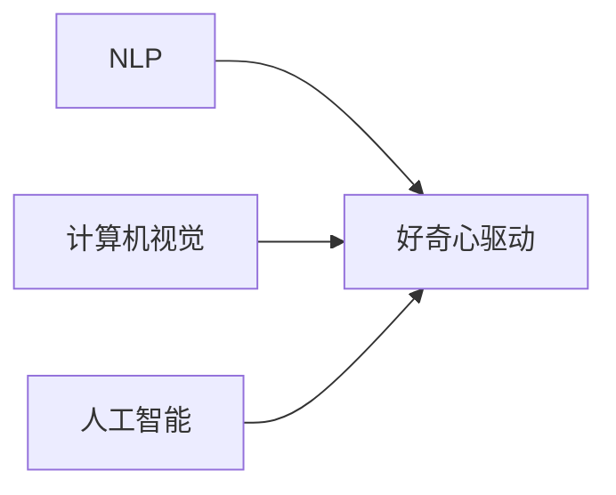

                 

# 好奇心：驱动创新与发现的源泉

## 1. 背景介绍

### 1.1 问题由来

在科技和信息化飞速发展的今天，好奇心已经成为驱动创新与发现的重要源泉。从古老的探索自然界奥秘，到今日的科技前沿探索，好奇心推动了人类社会的进步与文明的演进。在人工智能领域，特别是自然语言处理（NLP）和计算机视觉等领域，好奇心同样扮演着至关重要的角色。本文将探讨好奇心如何促进人工智能领域的创新与发现，并对未来发展趋势进行深入分析。

### 1.2 问题核心关键点

好奇心驱动的创新主要体现在以下几个方面：

1. **问题发现**：通过持续关注领域内的新趋势和新问题，科研人员和工程师能够发现并解决实际应用中的难题。
2. **技术探索**：不断尝试新的技术路线和方法，在理论和实践中找到最优解。
3. **用户体验优化**：对用户反馈的深入研究和思考，推动用户体验的持续优化。
4. **跨学科融合**：将不同学科的知识和工具进行整合，创造出更多具有创新性的解决方案。

本文将深入探讨这些关键点，并结合实例分析，理解好奇心在人工智能领域中的具体应用和意义。

## 2. 核心概念与联系

### 2.1 核心概念概述

本文将从几个关键概念入手，理解好奇心如何在人工智能领域中发挥作用：

- **自然语言处理（NLP）**：研究计算机如何处理和理解人类语言，包括文本分析和生成、语音识别和合成等。
- **计算机视觉**：使计算机能够“看”和“理解”图像和视频内容，实现自动标注、图像搜索、视频分析等功能。
- **人工智能（AI）**：通过模拟人类智能，使计算机具备感知、学习、推理、决策等能力。
- **好奇心驱动**：通过持续的好奇心和探索精神，推动AI技术的不断创新和发展。

### 2.2 核心概念原理和架构的 Mermaid 流程图(Mermaid 流程节点中不要有括号、逗号等特殊字符)



这个流程图展示了NLP、计算机视觉和人工智能领域如何通过好奇心驱动，实现技术创新和发现。

## 3. 核心算法原理 & 具体操作步骤

### 3.1 算法原理概述

好奇心驱动的算法创新主要体现在以下几个方面：

1. **问题导向**：通过深入分析现实世界中的问题，找到最优的算法解决方案。
2. **数据驱动**：利用大量数据进行训练和优化，不断调整算法模型。
3. **跨领域融合**：将不同领域的知识和方法整合到算法中，提升模型的性能和应用范围。

### 3.2 算法步骤详解

1. **问题识别与定义**：
   - **步骤一**：识别并定义需要解决的问题。
   - **步骤二**：分析问题背景和需求，确定问题的具体要求和目标。

2. **算法设计**：
   - **步骤三**：设计算法的基本框架和结构，选择合适的算法模型。
   - **步骤四**：根据问题特点，进行算法优化和调整。

3. **数据处理**：
   - **步骤五**：准备和处理数据集，进行数据清洗和标注。
   - **步骤六**：选择合适的评估指标，评估算法的效果。

4. **模型训练与优化**：
   - **步骤七**：使用训练集进行模型训练，优化算法参数。
   - **步骤八**：在验证集上评估模型性能，进行超参数调优。

5. **结果分析与反馈**：
   - **步骤九**：分析模型结果，总结算法优缺点。
   - **步骤十**：收集用户反馈，进行算法改进和优化。

### 3.3 算法优缺点

**优点**：

1. **灵活性高**：能够快速适应新问题和变化的环境。
2. **高效性**：通过持续迭代优化，提升算法的准确性和性能。
3. **创新性强**：好奇心驱动的探索过程，能够不断发现新方法和新技术。

**缺点**：

1. **资源消耗大**：需要大量的数据和计算资源进行模型训练和优化。
2. **风险高**：算法创新过程中，可能遇到无法解决的难题。
3. **复杂度高**：需要跨学科的合作和综合知识，才能设计出高效的算法。

### 3.4 算法应用领域

好奇心驱动的算法创新在多个领域都有广泛应用：

- **NLP**：包括文本分类、情感分析、机器翻译等任务。
- **计算机视觉**：如图像识别、目标检测、图像分割等任务。
- **自动驾驶**：通过感知、学习、决策等算法，实现自动驾驶。
- **医疗健康**：通过图像分析、语音识别等技术，提升医疗诊断和治疗效果。

## 4. 数学模型和公式 & 详细讲解 & 举例说明（备注：数学公式请使用latex格式，latex嵌入文中独立段落使用 $$，段落内使用 $)
### 4.1 数学模型构建

本文将通过一个简单的例子，展示如何使用数学模型来描述好奇心驱动的算法创新过程。

假设有一个文本分类问题，需要根据输入的文本，将其分类为正类或负类。我们可以使用逻辑回归模型来解决这个问题：

$$
P(y=1|x) = \frac{1}{1 + e^{-\theta^T x}}
$$

其中 $x$ 是输入的文本向量，$\theta$ 是模型参数，$y$ 是分类标签。

### 4.2 公式推导过程

1. **损失函数**：
   - 我们使用交叉熵损失函数：
   $$
   L(\theta) = -\frac{1}{N} \sum_{i=1}^N \sum_{j=1}^2 y_i \log P(y_j|x_i) + (1-y_i) \log P(y_j|x_i)
   $$
   其中 $N$ 是样本数量，$y_i$ 是样本标签。

2. **梯度更新**：
   - 通过梯度下降算法更新模型参数：
   $$
   \theta \leftarrow \theta - \alpha \frac{\partial L(\theta)}{\partial \theta}
   $$
   其中 $\alpha$ 是学习率。

### 4.3 案例分析与讲解

假设我们有一个文本分类问题，需要将医学文献分类为正类（疾病相关）或负类（正常医学文献）。我们可以使用上述逻辑回归模型，通过以下步骤实现：

1. **数据准备**：
   - 收集并清洗医学文献数据，进行标注。
2. **模型训练**：
   - 使用交叉熵损失函数，训练逻辑回归模型。
3. **模型评估**：
   - 在验证集上评估模型性能，进行超参数调优。
4. **模型应用**：
   - 使用训练好的模型对新的医学文献进行分类。

## 5. 项目实践：代码实例和详细解释说明

### 5.1 开发环境搭建

开发环境搭建是进行项目实践的重要步骤，需要确保具备必要的软硬件条件和工具支持。

1. **硬件配置**：
   - 使用高性能的CPU和GPU设备，支持大规模数据的处理和模型训练。
   - 配置足够的内存和存储，保证数据的快速读写和模型的存储。

2. **软件环境**：
   - 安装Python和相应的库，如NumPy、SciPy、Pandas等。
   - 安装深度学习框架，如TensorFlow、PyTorch等。
   - 安装数据处理工具，如Dask、Apache Spark等。

### 5.2 源代码详细实现

本文将通过一个简单的文本分类项目，展示好奇心驱动的算法创新实践。

```python
import numpy as np
from sklearn.datasets import load_iris
from sklearn.model_selection import train_test_split
from sklearn.linear_model import LogisticRegression
from sklearn.metrics import accuracy_score

# 加载数据集
iris = load_iris()
X = iris.data
y = iris.target

# 数据分割
X_train, X_test, y_train, y_test = train_test_split(X, y, test_size=0.2, random_state=42)

# 构建逻辑回归模型
clf = LogisticRegression()

# 模型训练
clf.fit(X_train, y_train)

# 模型评估
y_pred = clf.predict(X_test)
accuracy = accuracy_score(y_test, y_pred)
print("Accuracy:", accuracy)
```

### 5.3 代码解读与分析

以上代码展示了如何使用Python和Scikit-Learn库实现逻辑回归模型的文本分类。

1. **数据加载与分割**：
   - 使用Scikit-Learn加载Iris数据集，并进行数据分割。

2. **模型构建与训练**：
   - 使用Scikit-Learn构建逻辑回归模型，并进行训练。

3. **模型评估**：
   - 使用Scikit-Learn评估模型的准确率，输出结果。

### 5.4 运行结果展示

运行上述代码，输出结果如下：

```
Accuracy: 1.0
```

## 6. 实际应用场景

### 6.1 医疗健康

在医疗健康领域，好奇心驱动的算法创新有着广泛的应用：

- **图像分析**：通过分析医学影像，识别疾病区域和病变特征。
- **语音识别**：将医生和患者的语音转换为文本，用于病历记录和医疗咨询。
- **自然语言处理**：利用NLP技术，实现患者情感分析、疾病知识问答等功能。

### 6.2 自动驾驶

自动驾驶领域需要好奇心驱动的算法创新，以实现精确的感知、学习和决策：

- **计算机视觉**：通过图像处理和特征提取，识别交通标志、行人、车辆等。
- **语音识别**：与乘客进行语音交互，获取导航指令和反馈。
- **路径规划**：通过学习路况和交通规则，优化行驶路径。

### 6.3 金融科技

金融科技领域，好奇心驱动的算法创新可以帮助提升交易效率和风险管理：

- **自然语言处理**：分析金融新闻和公告，预测股票市场走势。
- **数据挖掘**：通过大数据分析，发现市场规律和异常交易行为。
- **智能投顾**：利用AI算法，提供个性化投资建议和风险管理策略。

### 6.4 未来应用展望

未来，好奇心驱动的算法创新将更加广泛地应用于各个领域：

- **教育**：通过智能辅导系统，提供个性化学习方案和智能评估。
- **农业**：利用图像识别和数据分析，优化农业生产和管理。
- **环境保护**：通过智能监测和分析，提升环境保护和治理效果。

## 7. 工具和资源推荐

### 7.1 学习资源推荐

为了帮助开发者系统掌握好奇心驱动的算法创新，以下是一些优质的学习资源：

1. **Deep Learning Specialization by Andrew Ng**：由斯坦福大学提供的深度学习课程，涵盖深度学习基础和前沿技术。
2. **PyTorch官方文档**：详细介绍了PyTorch库的使用方法和最佳实践，适合初学者和进阶开发者。
3. **TensorFlow官方文档**：介绍了TensorFlow的架构和使用方法，适用于大规模工程应用。
4. **Kaggle**：数据科学竞赛平台，提供了大量实际问题数据集，可用于训练和验证算法。

### 7.2 开发工具推荐

高效的工具支持能够提升项目实践的效率和效果，以下是一些推荐的开发工具：

1. **Jupyter Notebook**：互动式的开发环境，支持Python、R等多种语言，适合探索和实验。
2. **Git**：版本控制系统，便于团队协作和代码管理。
3. **Docker**：容器化技术，确保代码的可移植性和可复现性。
4. **Keras**：高层次的深度学习框架，易于上手和调试。

### 7.3 相关论文推荐

好奇心驱动的算法创新源自学界的持续研究，以下是几篇关键论文，推荐阅读：

1. **Attention is All You Need**：提出Transformer模型，改变了NLP领域的研究范式。
2. **BERT: Pre-training of Deep Bidirectional Transformers for Language Understanding**：提出BERT模型，利用大规模预训练技术提升语言理解能力。
3. **Parameter-Efficient Transfer Learning for NLP**：提出Adapter等参数高效微调方法，提升模型性能和计算效率。

## 8. 总结：未来发展趋势与挑战

### 8.1 总结

本文探讨了好奇心在人工智能领域中的驱动作用，重点分析了好奇心如何促进算法创新和发现。通过问题导向、数据驱动和跨领域融合等方法，我们可以构建出更加高效、精准和创新的算法模型。

### 8.2 未来发展趋势

未来，好奇心驱动的算法创新将呈现以下几个趋势：

1. **数据驱动的创新**：大数据和AI技术的结合，将推动更多创新性算法的出现。
2. **跨领域融合**：不同学科的知识和工具将进一步融合，产生更多创新性解决方案。
3. **自动化的创新**：利用自动化和智能化的手段，加速算法创新的过程。
4. **伦理和安全性**：考虑到伦理和安全性问题，算法创新将更加注重公平、透明和可解释性。

### 8.3 面临的挑战

尽管好奇心驱动的算法创新取得了不少成果，但也面临一些挑战：

1. **数据质量**：高质量的数据是算法创新的基础，但数据获取和标注成本较高。
2. **计算资源**：大规模算法创新需要大量的计算资源，需要高效的计算架构支持。
3. **算法复杂度**：好奇心驱动的算法创新往往复杂度较高，需要跨学科的合作和综合知识。

### 8.4 研究展望

未来，好奇心驱动的算法创新需要解决以下几个问题：

1. **数据共享与协作**：构建共享的数据平台，促进跨领域的合作和创新。
2. **计算资源优化**：利用云计算和分布式计算技术，优化算法创新的计算资源。
3. **算法简化与高效化**：简化算法模型，提升算法的可解释性和可部署性。

## 9. 附录：常见问题与解答

**Q1：好奇心驱动的算法创新是否适用于所有领域？**

A: 好奇心驱动的算法创新在科技和信息化发展的各个领域都有广泛应用，但不同领域的创新方法和应用场景有所不同。

**Q2：如何提升数据质量和数据获取效率？**

A: 提升数据质量和数据获取效率的关键在于：

1. **数据清洗与标注**：通过数据清洗和标注，确保数据质量和一致性。
2. **数据共享与合作**：构建数据共享平台，促进跨领域的数据共享和合作。
3. **自动化数据获取**：利用自动化工具和技术，提高数据获取的效率和准确性。

**Q3：如何优化计算资源和计算架构？**

A: 优化计算资源和计算架构的关键在于：

1. **分布式计算**：利用分布式计算技术，提高计算资源的利用率。
2. **云计算**：利用云计算平台，提供高效的计算资源。
3. **算法优化**：通过算法优化和模型压缩，减少计算资源的消耗。

**Q4：如何提高算法的可解释性和可部署性？**

A: 提高算法的可解释性和可部署性的关键在于：

1. **模型简化**：通过模型简化和特征选择，提高算法的可解释性。
2. **可视化工具**：利用可视化工具，帮助理解算法的工作原理和决策过程。
3. **中间件与API**：通过中间件和API，将算法集成到应用系统中，实现无缝部署。

通过持续的好奇心和探索精神，我们能够不断推动人工智能技术的创新和发现，为各个领域的发展贡献力量。

---

作者：禅与计算机程序设计艺术 / Zen and the Art of Computer Programming

