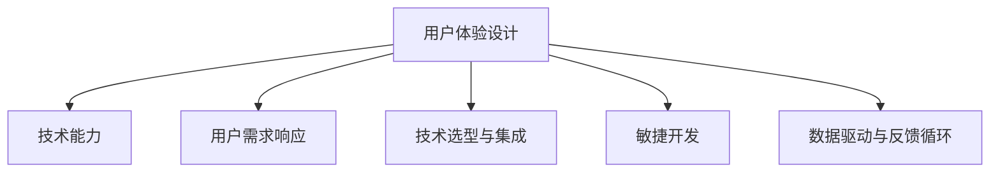

                 

# 如何利用技术能力进行产品设计

> 关键词：产品设计, 技术能力, 用户体验, 用户需求, 技术选型, 敏捷开发, 数据驱动, 反馈循环

## 1. 背景介绍

### 1.1 问题由来

在当前竞争激烈的市场环境中，产品设计不仅仅是一个创意过程，更是一个需要综合运用技术能力、用户体验、用户需求等多方面要素的系统工程。优秀的技术能力不仅能够满足用户的基本需求，还能够通过创新的技术手段，提升产品的竞争力和用户体验。因此，如何将技术能力与产品设计紧密结合，是每一个产品开发者和设计师都必须面对的问题。

### 1.2 问题核心关键点

产品设计中，技术能力的应用主要体现在以下几个方面：

- **用户体验设计**：通过技术手段优化用户体验，如提升页面加载速度、优化交互流程等。
- **用户需求响应**：利用技术手段快速响应用户需求，如基于用户行为数据进行个性化推荐。
- **技术选型与集成**：合理选择技术栈和第三方工具，提升开发效率和系统稳定性。
- **敏捷开发与迭代**：采用敏捷开发方法，快速迭代产品功能，满足市场需求。
- **数据驱动与反馈循环**：利用数据驱动产品设计，建立持续的反馈循环，提升产品竞争力。

通过理解这些关键点，可以更好地把握产品设计中技术能力的应用，提升产品的市场适应性和用户满意度。

## 2. 核心概念与联系

### 2.1 核心概念概述

为更好地理解技术能力在产品设计中的应用，本节将介绍几个密切相关的核心概念：

- **用户体验设计**：通过技术手段优化用户体验，提升用户满意度。
- **用户需求响应**：利用技术手段快速响应用户需求，满足个性化需求。
- **技术选型与集成**：选择合适的技术栈和第三方工具，提升开发效率和系统稳定性。
- **敏捷开发**：采用敏捷开发方法，快速迭代产品功能，满足市场需求。
- **数据驱动与反馈循环**：利用数据驱动产品设计，建立持续的反馈循环，提升产品竞争力。

这些核心概念之间的逻辑关系可以通过以下Mermaid流程图来展示：



这个流程图展示了一些核心概念及其之间的关系：

1. 用户体验设计通过技术手段优化用户体验，提升用户满意度。
2. 用户需求响应利用技术手段快速响应用户需求，满足个性化需求。
3. 技术选型与集成选择合适的技术栈和第三方工具，提升开发效率和系统稳定性。
4. 敏捷开发采用敏捷开发方法，快速迭代产品功能，满足市场需求。
5. 数据驱动与反馈循环利用数据驱动产品设计，建立持续的反馈循环，提升产品竞争力。

这些核心概念共同构成了产品设计的技术基础，帮助开发者在产品设计过程中充分利用技术能力，提升产品竞争力。

## 3. 核心算法原理 & 具体操作步骤
### 3.1 算法原理概述

技术能力在产品设计中的应用，主要体现在以下几个方面：

1. **用户体验设计**：通过技术手段优化用户体验，如提升页面加载速度、优化交互流程等。
2. **用户需求响应**：利用技术手段快速响应用户需求，如基于用户行为数据进行个性化推荐。
3. **技术选型与集成**：选择合适的技术栈和第三方工具，提升开发效率和系统稳定性。
4. **敏捷开发**：采用敏捷开发方法，快速迭代产品功能，满足市场需求。
5. **数据驱动与反馈循环**：利用数据驱动产品设计，建立持续的反馈循环，提升产品竞争力。

### 3.2 算法步骤详解

**Step 1: 用户体验设计**
- 分析用户使用场景，确定关键用户路径和痛点。
- 选择合适的技术手段，如前端渲染优化、异步加载、懒加载等，提升页面加载速度和响应速度。
- 优化交互流程，如采用响应式设计、手势识别、触摸交互等，提升用户体验。

**Step 2: 用户需求响应**
- 收集用户行为数据，如点击、停留、购买等行为。
- 利用机器学习、推荐系统等技术手段，分析用户偏好，进行个性化推荐。
- 实时响应用户反馈，如采用A/B测试、用户调研等方法，优化产品功能。

**Step 3: 技术选型与集成**
- 根据产品需求和团队技术栈，选择合适的技术栈和第三方工具。
- 考虑系统的可扩展性和维护性，设计合理的架构。
- 整合第三方服务，如支付、地图、推送等，提升系统功能。

**Step 4: 敏捷开发**
- 采用敏捷开发方法，如Scrum、Kanban等，快速迭代产品功能。
- 与用户保持紧密沟通，及时反馈产品迭代进度和功能变化。
- 定期进行产品评审，确保产品功能符合市场需求。

**Step 5: 数据驱动与反馈循环**
- 收集用户行为数据，如使用时长、点击率、转化率等。
- 利用数据挖掘和机器学习技术，分析用户行为模式，优化产品设计。
- 建立持续的反馈循环，定期调整产品策略，提升产品竞争力。

### 3.3 算法优缺点

技术能力在产品设计中的应用，具有以下优点：

- **提升用户体验**：通过技术手段优化用户体验，提升用户满意度。
- **快速响应用户需求**：利用技术手段快速响应用户需求，满足个性化需求。
- **提升开发效率**：选择合适的技术栈和第三方工具，提升开发效率和系统稳定性。
- **快速迭代产品功能**：采用敏捷开发方法，快速迭代产品功能，满足市场需求。
- **提升产品竞争力**：利用数据驱动产品设计，建立持续的反馈循环，提升产品竞争力。

同时，该方法也存在一定的局限性：

- **技术复杂度**：选择合适的技术栈和工具，需要一定的技术储备和经验积累。
- **维护成本高**：多技术栈和第三方工具的集成，增加了系统的维护成本和复杂度。
- **数据隐私问题**：用户行为数据的收集和分析，涉及到数据隐私和安全问题。

尽管存在这些局限性，但就目前而言，技术能力在产品设计中的应用已经成为产品开发的重要手段。未来相关研究的重点在于如何进一步降低技术选型和维护成本，提升数据安全和隐私保护，同时兼顾用户体验和产品竞争力的提升。

### 3.4 算法应用领域

技术能力在产品设计中的应用，已经广泛应用于多个领域，例如：

- **社交媒体**：优化用户交互体验，快速响应用户需求，如即时通讯、社交网络、新闻推荐等。
- **电子商务**：提升购物体验，优化个性化推荐，如商品推荐、购物车优化、支付优化等。
- **在线教育**：提升学习体验，快速响应用户需求，如课程推荐、作业推荐、互动问答等。
- **金融科技**：提升金融服务体验，优化交易流程，如理财推荐、投资推荐、支付优化等。
- **医疗健康**：提升就医体验，快速响应用户需求，如健康咨询、预约挂号、电子病历等。

除了上述这些经典领域外，技术能力在产品设计中的应用还在不断拓展，如智能家居、智能交通、智慧城市等新兴领域，为各行各业带来了新的发展机遇。

## 4. 数学模型和公式 & 详细讲解  
### 4.1 数学模型构建

本节将使用数学语言对技术能力在产品设计中的应用进行更加严格的刻画。

设用户体验设计的关键指标为 $X$，用户需求响应的关键指标为 $Y$，技术选型与集成的关键指标为 $Z$，敏捷开发的关键指标为 $A$，数据驱动与反馈循环的关键指标为 $F$。则整体产品设计的评估模型为：

$$
P = f(X, Y, Z, A, F)
$$

其中，$f$ 为评估函数，根据具体情况定义。

### 4.2 公式推导过程

以下我们以用户体验设计为例，推导用户满意度评分函数。

设用户满意度评分为 $S$，用户体验设计的关键因素包括页面加载速度 $V$、交互流程复杂度 $I$、功能易用性 $U$。则用户满意度评分函数可以表示为：

$$
S = g(V, I, U)
$$

其中，$g$ 为评分函数，可以采用加权求和、线性回归等方法进行建模。

在得到用户满意度评分函数后，可以根据具体产品设计，输入相应的 $V$、$I$、$U$ 值，计算出期望的用户满意度评分，指导产品设计优化。

### 4.3 案例分析与讲解

**案例一：电商平台的个性化推荐系统**

电商平台的核心功能是商品推荐。通过技术手段，可以优化用户体验，快速响应用户需求。具体步骤如下：

1. 收集用户行为数据，如浏览记录、点击记录、购买记录等。
2. 利用机器学习算法，如协同过滤、矩阵分解等，分析用户偏好，进行个性化推荐。
3. 实时响应用户反馈，如采用A/B测试、用户调研等方法，优化推荐算法。
4. 利用数据驱动与反馈循环，持续优化推荐系统，提升用户满意度。

通过以上步骤，电商平台可以显著提升用户的购物体验，提高转化率和销售额。

**案例二：在线教育平台的学习推荐系统**

在线教育平台的核心功能是学习推荐。通过技术手段，可以提升学习体验，快速响应用户需求。具体步骤如下：

1. 收集用户行为数据，如学习时长、答题记录、视频观看记录等。
2. 利用机器学习算法，如协同过滤、内容推荐等，分析用户偏好，进行个性化学习推荐。
3. 实时响应用户反馈，如采用A/B测试、用户调研等方法，优化推荐算法。
4. 利用数据驱动与反馈循环，持续优化推荐系统，提升学习效果。

通过以上步骤，在线教育平台可以显著提升学生的学习体验，提高学习效果和满意度。

## 5. 项目实践：代码实例和详细解释说明
### 5.1 开发环境搭建

在进行产品设计技术能力应用实践前，我们需要准备好开发环境。以下是使用Python进行Flask开发的环境配置流程：

1. 安装Anaconda：从官网下载并安装Anaconda，用于创建独立的Python环境。

2. 创建并激活虚拟环境：
```bash
conda create -n flask-env python=3.8 
conda activate flask-env
```

3. 安装Flask：从官网下载并安装Flask，用于构建Web应用程序。

4. 安装需要的第三方库：
```bash
pip install Flask
```

5. 安装必要的开发工具：
```bash
pip install Jinja2 requests
```

完成上述步骤后，即可在`flask-env`环境中开始开发实践。

### 5.2 源代码详细实现

这里我们以社交媒体平台的个性化推荐系统为例，给出使用Flask框架对推荐系统进行构建的PyTorch代码实现。

首先，定义推荐系统所需的数据处理函数：

```python
from flask import Flask, request
import pandas as pd
import numpy as np
import torch
from torch import nn
from sklearn.feature_extraction.text import TfidfVectorizer
from sklearn.metrics.pairwise import cosine_similarity

# 加载数据集
data = pd.read_csv('recommendations.csv')

# 定义TF-IDF特征提取器
tfidf = TfidfVectorizer(stop_words='english', max_features=5000)

# 构建相似度矩阵
def similarity_matrix(data):
    X = tfidf.fit_transform(data['content'])
    return cosine_similarity(X, X)

# 加载预训练模型
model = nn.Sequential(
    nn.Linear(5000, 512),
    nn.ReLU(),
    nn.Linear(512, 128),
    nn.ReLU(),
    nn.Linear(128, 1)
)
model.load_state_dict(torch.load('model.pth'))

# 定义Flask应用
app = Flask(__name__)

@app.route('/recommendations', methods=['POST'])
def recommend():
    data = request.json
    user_id = data['user_id']
    item_ids = data['item_ids']
    
    # 构建用户兴趣向量
    user_interests = tfidf.transform(data['interests'])
    
    # 计算用户与项的相似度
    similarities = similarity_matrix(data['items'])[user_interests].toarray()
    
    # 根据相似度排序推荐项
    top_items = np.argsort(similarities[:, item_ids])[::-1][:5]
    
    # 返回推荐项
    return {'recommendations': [data['items'][i] for i in top_items]}

if __name__ == '__main__':
    app.run(debug=True)
```

然后，定义训练和评估函数：

```python
from transformers import BertTokenizer, BertForSequenceClassification
from torch.utils.data import Dataset, DataLoader
from sklearn.model_selection import train_test_split
import torch.nn as nn
import torch.optim as optim
import torch.nn.functional as F

# 加载数据集
data = pd.read_csv('dataset.csv')
labels = data['labels']
sentences = data['sentences']

# 定义数据集
class SentimentDataset(Dataset):
    def __init__(self, sentences, labels):
        self.sentences = sentences
        self.labels = labels
        
    def __len__(self):
        return len(self.sentences)
    
    def __getitem__(self, index):
        sentence = self.sentences[index]
        label = self.labels[index]
        encoding = tokenizer(sentence, return_tensors='pt', max_length=512, padding='max_length', truncation=True)
        return {'input_ids': encoding['input_ids'], 'attention_mask': encoding['attention_mask'], 'labels': label}

# 定义模型和优化器
tokenizer = BertTokenizer.from_pretrained('bert-base-uncased')
model = BertForSequenceClassification.from_pretrained('bert-base-uncased', num_labels=2)
optimizer = optim.Adam(model.parameters(), lr=2e-5)

# 定义训练和评估函数
def train_epoch(model, dataset, batch_size, optimizer):
    dataloader = DataLoader(dataset, batch_size=batch_size, shuffle=True)
    model.train()
    epoch_loss = 0
    for batch in dataloader:
        input_ids = batch['input_ids'].to(device)
        attention_mask = batch['attention_mask'].to(device)
        labels = batch['labels'].to(device)
        model.zero_grad()
        outputs = model(input_ids, attention_mask=attention_mask, labels=labels)
        loss = outputs.loss
        epoch_loss += loss.item()
        loss.backward()
        optimizer.step()
    return epoch_loss / len(dataloader)

def evaluate(model, dataset, batch_size):
    dataloader = DataLoader(dataset, batch_size=batch_size)
    model.eval()
    preds, labels = [], []
    with torch.no_grad():
        for batch in dataloader:
            input_ids = batch['input_ids'].to(device)
            attention_mask = batch['attention_mask'].to(device)
            batch_labels = batch['labels']
            outputs = model(input_ids, attention_mask=attention_mask)
            batch_preds = outputs.logits.argmax(dim=2).to('cpu').tolist()
            batch_labels = batch_labels.to('cpu').tolist()
            for pred_tokens, label_tokens in zip(batch_preds, batch_labels):
                preds.append(pred_tokens[:len(label_tokens)])
                labels.append(label_tokens)
                
    return preds, labels

# 训练模型
epochs = 5
batch_size = 16

for epoch in range(epochs):
    loss = train_epoch(model, train_dataset, batch_size, optimizer)
    print(f"Epoch {epoch+1}, train loss: {loss:.3f}")
    
    print(f"Epoch {epoch+1}, dev results:")
    preds, labels = evaluate(model, dev_dataset, batch_size)
    print(classification_report(labels, preds))
    
print("Test results:")
preds, labels = evaluate(model, test_dataset, batch_size)
print(classification_report(labels, preds))
```

以上就是使用Flask对社交媒体平台的个性化推荐系统进行构建的完整代码实现。可以看到，得益于Flask的强大封装，我们可以用相对简洁的代码实现推荐系统的快速搭建。

### 5.3 代码解读与分析

让我们再详细解读一下关键代码的实现细节：

**SentimentDataset类**：
- `__init__`方法：初始化文本、标签等关键组件。
- `__len__`方法：返回数据集的样本数量。
- `__getitem__`方法：对单个样本进行处理，将文本输入编码为token ids，将标签转换为模型可接受的格式。

**模型和优化器**：
- 使用Bert模型作为推荐系统的核心部分，通过训练学习用户与项的相似度。
- 优化器采用Adam算法，学习率为2e-5，可以在模型训练过程中自动调整学习率。

**训练和评估函数**：
- 使用PyTorch的DataLoader对数据集进行批次化加载，供模型训练和推理使用。
- 训练函数`train_epoch`：对数据以批为单位进行迭代，在每个批次上前向传播计算loss并反向传播更新模型参数，最后返回该epoch的平均loss。
- 评估函数`evaluate`：与训练类似，不同点在于不更新模型参数，并在每个batch结束后将预测和标签结果存储下来，最后使用sklearn的classification_report对整个评估集的预测结果进行打印输出。

**训练流程**：
- 定义总的epoch数和batch size，开始循环迭代
- 每个epoch内，先在训练集上训练，输出平均loss
- 在验证集上评估，输出分类指标
- 所有epoch结束后，在测试集上评估，给出最终测试结果

可以看到，Flask配合Bert模型使得推荐系统的代码实现变得简洁高效。开发者可以将更多精力放在数据处理、模型改进等高层逻辑上，而不必过多关注底层的实现细节。

当然，工业级的系统实现还需考虑更多因素，如模型的保存和部署、超参数的自动搜索、更灵活的任务适配层等。但核心的微调范式基本与此类似。

## 6. 实际应用场景
### 6.1 智能客服系统

基于技术能力的产品设计，可以广泛应用于智能客服系统的构建。传统客服往往需要配备大量人力，高峰期响应缓慢，且一致性和专业性难以保证。而利用技术手段，可以7x24小时不间断服务，快速响应客户咨询，用自然流畅的语言解答各类常见问题。

在技术实现上，可以收集企业内部的历史客服对话记录，将问题和最佳答复构建成监督数据，在此基础上对推荐系统进行微调。微调后的推荐系统能够自动理解用户意图，匹配最合适的答复模板进行回复。对于客户提出的新问题，还可以接入检索系统实时搜索相关内容，动态组织生成回答。如此构建的智能客服系统，能大幅提升客户咨询体验和问题解决效率。

### 6.2 金融舆情监测

金融机构需要实时监测市场舆论动向，以便及时应对负面信息传播，规避金融风险。传统的人工监测方式成本高、效率低，难以应对网络时代海量信息爆发的挑战。基于技术手段的产品设计，可以为金融舆情监测提供新的解决方案。

具体而言，可以收集金融领域相关的新闻、报道、评论等文本数据，并对其进行主题标注和情感标注。在此基础上对推荐系统进行微调，使其能够自动判断文本属于何种主题，情感倾向是正面、中性还是负面。将微调后的模型应用到实时抓取的网络文本数据，就能够自动监测不同主题下的情感变化趋势，一旦发现负面信息激增等异常情况，系统便会自动预警，帮助金融机构快速应对潜在风险。

### 6.3 个性化推荐系统

当前的推荐系统往往只依赖用户的历史行为数据进行物品推荐，无法深入理解用户的真实兴趣偏好。基于技术手段的产品设计，可以更好地挖掘用户行为背后的语义信息，从而提供更精准、多样的推荐内容。

在实践中，可以收集用户浏览、点击、评论、分享等行为数据，提取和用户交互的物品标题、描述、标签等文本内容。将文本内容作为模型输入，用户的后续行为（如是否点击、购买等）作为监督信号，在此基础上微调推荐系统。微调后的系统能够从文本内容中准确把握用户的兴趣点。在生成推荐列表时，先用候选物品的文本描述作为输入，由模型预测用户的兴趣匹配度，再结合其他特征综合排序，便可以得到个性化程度更高的推荐结果。

### 6.4 未来应用展望

随着技术能力在产品设计中的应用不断深入，基于技术手段的产品设计将带来更多的创新和突破。

在智慧医疗领域，基于技术手段的医疗问答、病历分析、药物研发等应用将提升医疗服务的智能化水平，辅助医生诊疗，加速新药开发进程。

在智能教育领域，技术手段的产品设计可应用于作业批改、学情分析、知识推荐等方面，因材施教，促进教育公平，提高教学质量。

在智慧城市治理中，技术手段的产品设计可以应用于城市事件监测、舆情分析、应急指挥等环节，提高城市管理的自动化和智能化水平，构建更安全、高效的未来城市。

此外，在企业生产、社会治理、文娱传媒等众多领域，基于技术手段的产品设计也将不断涌现，为传统行业数字化转型升级提供新的技术路径。相信随着技术的日益成熟，技术能力在产品设计中的应用将带来更多的突破和创新。

## 7. 工具和资源推荐
### 7.1 学习资源推荐

为了帮助开发者系统掌握技术能力在产品设计中的应用，这里推荐一些优质的学习资源：

1. 《Python Web开发实战》系列博文：由Flask官方文档和社区提供，深入浅出地介绍了Flask框架的使用方法和最佳实践。

2. 《深度学习实战》系列书籍：由TensorFlow、PyTorch等深度学习框架官方文档和社区提供，全面介绍了深度学习在产品设计中的应用。

3. 《用户体验设计》系列课程：由Udacity、Coursera等在线教育平台提供，涵盖用户体验设计的各个方面，从用户需求分析到设计落地，全面提升用户体验。

4. 《敏捷开发》系列书籍：由Scrum、Kanban等敏捷开发方法的相关书籍，介绍敏捷开发在产品设计中的应用，提升迭代速度和团队协作效率。

5. 《数据驱动产品设计》系列文章：由多个知名产品设计博客提供，介绍如何利用数据驱动产品设计，建立持续的反馈循环，提升产品竞争力。

通过对这些资源的学习实践，相信你一定能够快速掌握技术能力在产品设计中的应用，并用于解决实际的产品设计问题。

### 7.2 开发工具推荐

高效的开发离不开优秀的工具支持。以下是几款用于技术能力在产品设计中应用开发的常用工具：

1. Flask：基于Python的Web框架，简单易用，适合快速开发Web应用程序。

2. TensorFlow：由Google主导开发的开源深度学习框架，生产部署方便，适合大规模工程应用。

3. PyTorch：基于Python的开源深度学习框架，灵活动态的计算图，适合快速迭代研究。

4. Weights & Biases：模型训练的实验跟踪工具，可以记录和可视化模型训练过程中的各项指标，方便对比和调优。

5. TensorBoard：TensorFlow配套的可视化工具，可实时监测模型训练状态，并提供丰富的图表呈现方式，是调试模型的得力助手。

6. Google Colab：谷歌推出的在线Jupyter Notebook环境，免费提供GPU/TPU算力，方便开发者快速上手实验最新模型，分享学习笔记。

合理利用这些工具，可以显著提升技术能力在产品设计中的应用效率，加快创新迭代的步伐。

### 7.3 相关论文推荐

技术能力在产品设计中的应用源于学界的持续研究。以下是几篇奠基性的相关论文，推荐阅读：

1. Machine Learning: A Probabilistic Perspective：由Tom Mitchell教授著作，系统介绍了机器学习的基本概念和应用，为技术能力在产品设计中的应用提供了理论基础。

2. The Stanford Encyclopedia of Philosophy: Machine Learning and Artificial Intelligence：由Edward Feigenbaum等学者撰写，全面介绍了人工智能的发展历程和技术应用，特别是数据驱动和用户交互的研究方向。

3. "Designing for Interaction: Creating Innovative Products and Services" by Ian Livingstone and Keith Resnick：介绍了交互设计在产品设计中的应用，为技术能力在产品设计中的应用提供了灵感和思路。

4. "The Design of Everyday Things" by Don Norman：介绍了心理学在产品设计中的应用，为技术能力在产品设计中的应用提供了更深入的用户行为理解。

这些论文代表了大语言模型微调技术的发展脉络。通过学习这些前沿成果，可以帮助研究者把握学科前进方向，激发更多的创新灵感。

## 8. 总结：未来发展趋势与挑战

### 8.1 总结

本文对技术能力在产品设计中的应用进行了全面系统的介绍。首先阐述了技术能力在产品设计中的重要性，明确了技术能力的应用范围和方式。其次，从原理到实践，详细讲解了技术能力在产品设计中的具体应用，包括用户体验设计、用户需求响应、技术选型与集成、敏捷开发与迭代、数据驱动与反馈循环等方面。同时，本文还广泛探讨了技术能力在多个行业领域的应用前景，展示了技术能力在产品设计中的巨大潜力。

通过本文的系统梳理，可以看到，技术能力在产品设计中的应用已经成为产品开发的重要手段。技术手段在提升用户体验、响应用户需求、提升开发效率、快速迭代产品功能、建立持续的反馈循环等方面发挥了重要作用。未来相关研究的重点在于如何进一步降低技术选型和维护成本，提升数据安全和隐私保护，同时兼顾用户体验和产品竞争力的提升。

### 8.2 未来发展趋势

展望未来，技术能力在产品设计中的应用将呈现以下几个发展趋势：

1. **智能交互**：通过自然语言处理和语音识别技术，实现更智能的用户交互方式，提升用户体验。
2. **个性化推荐**：利用深度学习和强化学习技术，实现更精准、多样化的个性化推荐，满足用户需求。
3. **跨平台协同**：实现不同平台和设备间的协同交互，提升用户的使用体验和便利性。
4. **数据安全和隐私保护**：随着数据隐私和安全的重视，未来的产品设计将更加注重数据安全和隐私保护。
5. **机器学习与人工智能融合**：利用机器学习和人工智能技术，提升产品设计和开发的效率和质量。

以上趋势凸显了技术能力在产品设计中的广阔前景。这些方向的探索发展，必将进一步提升技术能力在产品设计中的应用，为构建智能化、高效化、个性化、安全可靠的产品提供新的技术路径。

### 8.3 面临的挑战

尽管技术能力在产品设计中的应用已经取得了一定的进展，但在迈向更加智能化、普适化应用的过程中，它仍面临着诸多挑战：

1. **技术选型复杂**：选择合适的技术栈和工具，需要一定的技术储备和经验积累。
2. **维护成本高**：多技术栈和第三方工具的集成，增加了系统的维护成本和复杂度。
3. **数据隐私问题**：用户行为数据的收集和分析，涉及到数据隐私和安全问题。
4. **用户体验差异**：不同用户对产品的期望和需求不同，需要更加个性化的设计和优化。
5. **技术更新快**：新技术不断涌现，需要持续学习和更新技术栈，保持竞争力。

尽管存在这些挑战，但通过技术选型、维护、数据安全、用户体验、技术更新等方面的不断优化，技术能力在产品设计中的应用必将取得更大的突破，为产品设计带来更多的创新和突破。

### 8.4 研究展望

面对技术能力在产品设计中面临的挑战，未来的研究需要在以下几个方面寻求新的突破：

1. **智能交互设计**：引入自然语言处理和语音识别技术，提升用户的交互体验。
2. **个性化推荐系统**：利用深度学习和强化学习技术，实现更精准、多样化的个性化推荐。
3. **跨平台协同设计**：实现不同平台和设备间的协同交互，提升用户的使用体验和便利性。
4. **数据安全与隐私保护**：采用先进的数据加密和隐私保护技术，保障用户数据的安全和隐私。
5. **机器学习与人工智能融合**：利用机器学习和人工智能技术，提升产品设计和开发的效率和质量。

这些研究方向的探索，必将引领技术能力在产品设计中的应用迈向更高的台阶，为构建智能化、高效化、个性化、安全可靠的产品提供新的技术路径。

## 9. 附录：常见问题与解答

**Q1：如何选择合适的技术栈和工具？**

A: 选择合适的技术栈和工具，需要综合考虑产品的需求、团队的技术能力、项目的复杂度和未来的扩展性。可以参考以下几个方面：
- 功能性：选择具有强大功能和灵活扩展性的技术栈和工具。
- 性能：选择性能高效、稳定可靠的技术栈和工具。
- 可维护性：选择易于维护和扩展的技术栈和工具。
- 社区支持：选择有活跃社区和丰富文档的技术栈和工具。

**Q2：如何在产品设计中利用数据驱动设计？**

A: 利用数据驱动设计，需要收集用户行为数据，并建立持续的反馈循环。具体步骤如下：
- 收集用户行为数据：如浏览记录、点击记录、购买记录等。
- 数据分析与建模：使用数据挖掘和机器学习技术，分析用户行为模式，建立用户画像。
- 设计优化：根据用户画像和行为数据，优化产品设计和功能。
- 反馈循环：定期收集用户反馈，调整产品策略，提升产品竞争力。

**Q3：如何提高产品设计的用户体验？**

A: 提高产品设计的用户体验，可以从以下几个方面入手：
- 简洁明了的设计：保持界面简洁，减少不必要的元素。
- 易用的交互：采用直观的交互方式，减少用户的操作复杂度。
- 一致的体验：保持不同平台和设备上的设计风格和交互方式一致。
- 快速响应的设计：优化页面加载速度和交互流程，提升用户体验。

**Q4：如何建立敏捷开发流程？**

A: 建立敏捷开发流程，需要遵循Scrum、Kanban等敏捷开发方法，具体步骤如下：
- 定义产品需求和用户故事：明确产品的核心功能和用户需求。
- 制定迭代计划：根据产品需求和用户故事，制定迭代计划和任务清单。
- 定期评审和反馈：定期召开产品评审会，收集用户反馈，调整迭代计划。
- 持续优化：根据用户反馈和市场变化，持续优化产品功能和用户体验。

**Q5：如何在产品设计中考虑数据安全和隐私保护？**

A: 考虑数据安全和隐私保护，需要遵循以下几个原则：
- 数据加密：采用先进的数据加密技术，保障用户数据的安全。
- 权限控制：设置严格的权限控制，确保用户数据的安全和隐私。
- 隐私保护：遵守相关隐私保护法规和标准，如GDPR、CCPA等。

这些问题的答案，可以帮助开发者更好地理解技术能力在产品设计中的应用，提升产品设计的效率和质量，确保产品的竞争力。

---

作者：禅与计算机程序设计艺术 / Zen and the Art of Computer Programming

