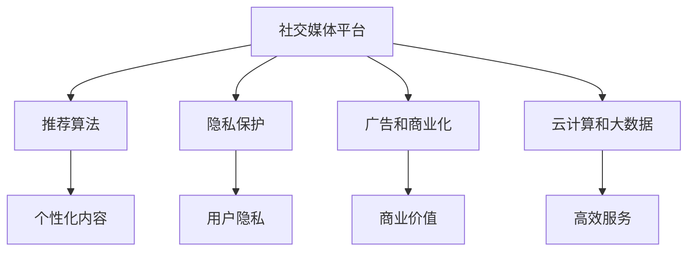

                 

# 如何利用技术能力进行社交媒体平台创新

## 1. 背景介绍

### 1.1 问题由来

近年来，随着互联网技术的飞速发展，社交媒体平台已成为人们日常生活的重要组成部分。Facebook、Twitter、Instagram等主流平台吸引了数十亿的用户，成为信息传播、社交互动的重要渠道。然而，在商业模式的竞争下，社交媒体平台的创新变得越来越困难。许多平台面临增长乏力、用户流失、收入下降等挑战，亟需利用技术能力进行创新。

### 1.2 问题核心关键点

社交媒体平台的创新主要集中在以下几个方面：

1. **用户互动体验的提升**：通过优化算法，增强社区感和互动性，使用户能够更愉快地使用平台。
2. **个性化内容的推荐**：利用机器学习算法，提升内容的相关性和用户体验，吸引用户长期使用。
3. **隐私和数据安全的保护**：在数据收集、使用和存储过程中，采取严格的隐私保护措施，增强用户信任。
4. **广告和商业模式的创新**：通过创新的广告和商业合作模式，拓展收入来源，提升平台盈利能力。
5. **技术基础设施的升级**：通过云计算、大数据等技术，提升平台性能，确保高效稳定的服务。

这些关键点构成了社交媒体平台创新的技术基础，本文将从这些方面展开讨论。

## 2. 核心概念与联系

### 2.1 核心概念概述

为更好地理解社交媒体平台的创新，本节将介绍几个密切相关的核心概念：

- **社交媒体平台**：以用户交互和信息共享为核心，通过算法、技术和数据，提供个性化服务，增强社区感和互动性。
- **推荐算法**：基于用户行为和偏好，推荐个性化内容，提升用户体验。
- **隐私保护**：在数据收集、存储和处理过程中，采用严格的隐私保护措施，保障用户隐私安全。
- **广告和商业化**：通过创新广告和商业合作模式，提升平台的商业价值。
- **云计算和大数据**：利用云平台和数据处理技术，提供高效、稳定的服务，处理海量数据。

这些核心概念之间的逻辑关系可以通过以下Mermaid流程图来展示：



这个流程图展示社交媒体平台的核心概念及其之间的关系：

1. 社交媒体平台通过推荐算法提升用户互动体验。
2. 隐私保护是平台正常运营的基础。
3. 广告和商业化是平台盈利的重要手段。
4. 云计算和大数据是平台高效稳定运行的技术保障。

这些概念共同构成了社交媒体平台的技术框架，使得平台能够提供优质的服务，实现商业价值，同时保障用户隐私安全。

## 3. 核心算法原理 & 具体操作步骤
### 3.1 算法原理概述

社交媒体平台的创新主要依赖于机器学习和数据处理等技术手段。其核心算法包括推荐算法、隐私保护算法、广告优化算法等。以下将详细阐述这些核心算法的原理。

### 3.2 算法步骤详解

#### 3.2.1 推荐算法

推荐算法是提升社交媒体平台用户互动体验的重要手段。推荐算法的核心在于构建用户兴趣模型，通过相似性度量和推荐策略，向用户推荐个性化内容。

1. **用户兴趣模型构建**
   - 收集用户的行为数据，如浏览记录、点赞、评论等。
   - 对数据进行预处理和特征提取，生成用户兴趣向量。
   - 将兴趣向量与物品向量进行相似度计算，得到用户对每个物品的兴趣度。

2. **相似性度量**
   - 使用余弦相似度、欧几里得距离等方法，计算用户与物品之间的相似度。
   - 利用协同过滤算法，找到与用户兴趣相似的其他用户，推荐其喜欢的物品。

3. **推荐策略**
   - 使用基于内容的推荐策略，根据物品的特征信息，推荐相关物品。
   - 使用基于协同过滤的推荐策略，通过相似用户的偏好，推荐类似物品。
   - 使用混合推荐策略，综合多种推荐方法，提升推荐效果。

#### 3.2.2 隐私保护算法

隐私保护是社交媒体平台正常运营的基础。隐私保护算法主要涉及数据匿名化、差分隐私和数据访问控制等方面。

1. **数据匿名化**
   - 对用户数据进行去标识化处理，如数据扰动、数据泛化等。
   - 采用伪匿名和假名化技术，保护用户身份信息。

2. **差分隐私**
   - 在数据分析和处理过程中，加入噪声，保护个体隐私。
   - 使用ε-差分隐私算法，控制隐私泄露风险。

3. **数据访问控制**
   - 通过身份验证和授权机制，限制对数据的访问。
   - 采用访问控制列表(ACL)等技术，确保数据仅对授权用户可见。

#### 3.2.3 广告优化算法

广告优化算法是社交媒体平台盈利的核心手段。广告优化算法的核心在于优化广告投放策略，提升广告效果，最大化广告收益。

1. **广告投放策略**
   - 利用A/B测试和多臂老虎机算法，优化广告投放策略。
   - 通过反向强化学习算法，优化广告预算分配。

2. **广告效果评估**
   - 使用点击率、转化率、广告成本等指标，评估广告效果。
   - 采用离线评估和在线评估方法，结合使用，提升广告效果。

3. **广告竞价算法**
   - 使用二次拍卖和第一价格密封拍卖算法，优化广告竞价。
   - 通过协同过滤算法，推荐最佳广告位。

### 3.3 算法优缺点

#### 3.3.1 推荐算法

推荐算法能够显著提升用户体验，但也存在一些缺点：

- **数据稀疏性问题**：新用户或冷门物品的推荐效果差。
- **协同过滤的局限性**：用户和物品的稀疏性可能导致协同过滤失效。
- **模型复杂度**：复杂的推荐模型需要更多的计算资源。

#### 3.3.2 隐私保护算法

隐私保护算法能够保障用户隐私安全，但也存在一些缺点：

- **数据匿名化的效果有限**：匿名化后的数据可能仍存在隐私泄露风险。
- **差分隐私的限制**：噪声的引入可能会降低数据分析的精度。
- **数据访问控制的复杂性**：限制数据访问可能导致信息获取的困难。

#### 3.3.3 广告优化算法

广告优化算法能够最大化广告收益，但也存在一些缺点：

- **广告投放的随机性**：广告投放策略可能存在随机性，影响广告效果。
- **广告效果的评估难度**：广告效果的评估可能存在复杂性，难以准确评估。
- **广告竞价的复杂性**：复杂的竞价算法需要更多的计算资源。

### 3.4 算法应用领域

推荐算法在社交媒体平台中的应用包括个性化内容推荐、智能广告投放、智能客服等。

- **个性化内容推荐**：通过推荐算法，向用户推荐个性化的文章、视频、新闻等。
- **智能广告投放**：通过广告优化算法，提升广告投放效果，最大化广告收益。
- **智能客服**：通过自然语言处理和推荐算法，提升客服互动体验。

隐私保护算法在社交媒体平台中的应用包括用户数据保护、数据访问控制等。

- **用户数据保护**：采用数据匿名化和差分隐私算法，保障用户数据安全。
- **数据访问控制**：通过身份验证和授权机制，限制对数据的访问。

广告优化算法在社交媒体平台中的应用包括精准广告投放、广告预算优化等。

- **精准广告投放**：利用广告投放策略和效果评估算法，提升广告投放效果。
- **广告预算优化**：通过广告竞价算法，优化广告预算分配。

## 4. 数学模型和公式 & 详细讲解  
### 4.1 数学模型构建

社交媒体平台的推荐算法、隐私保护算法和广告优化算法，通常采用以下数学模型：

- **用户兴趣模型**：$U = (u_1, u_2, ..., u_n)$，其中 $u_i = (f_i^+, f_i^-)$ 表示用户 $i$ 对物品 $j$ 的正面和负面兴趣。

- **物品特征模型**：$I = (i_1, i_2, ..., i_m)$，其中 $i_j = (g_j^+, g_j^-)$ 表示物品 $j$ 的正面和负面特征。

- **相似性度量**：$sim(u_i, i_j) = \cos(u_i, i_j) = \frac{u_i \cdot i_j}{\|u_i\| \cdot \|i_j\|}$。

- **推荐策略**：$R = (r_{u_i, i_j})$，其中 $r_{u_i, i_j} = sim(u_i, i_j) \cdot f_j$。

### 4.2 公式推导过程

以下以推荐算法为例，详细推导其数学模型：

1. **用户兴趣模型构建**
   - 收集用户的行为数据 $D = \{(x_{ui}, y_{ui})\}_{i=1}^N$，其中 $x_{ui}$ 表示用户 $i$ 对物品 $j$ 的交互行为，$y_{ui} = 1$ 表示正向行为，$y_{ui} = 0$ 表示负向行为。

   - 对数据进行预处理，生成用户兴趣向量 $U = (u_1, u_2, ..., u_n)$，其中 $u_i = (f_i^+, f_i^-)$ 表示用户 $i$ 对物品 $j$ 的正面和负面兴趣。

   - 对数据进行特征提取，生成物品特征向量 $I = (i_1, i_2, ..., i_m)$，其中 $i_j = (g_j^+, g_j^-)$ 表示物品 $j$ 的正面和负面特征。

   - 将用户兴趣模型和物品特征模型结合，得到用户对每个物品的兴趣度 $R_{ui} = sim(u_i, i_j) \cdot f_j$。

2. **相似性度量**
   - 使用余弦相似度计算用户与物品之间的相似度，即 $sim(u_i, i_j) = \frac{u_i \cdot i_j}{\|u_i\| \cdot \|i_j\|}$。

   - 利用协同过滤算法，找到与用户兴趣相似的其他用户，推荐其喜欢的物品。

3. **推荐策略**
   - 使用基于内容的推荐策略，根据物品的特征信息，推荐相关物品。

   - 使用基于协同过滤的推荐策略，通过相似用户的偏好，推荐类似物品。

   - 使用混合推荐策略，综合多种推荐方法，提升推荐效果。

### 4.3 案例分析与讲解

以Facebook平台为例，分析推荐算法、隐私保护算法和广告优化算法的应用。

#### 4.3.1 推荐算法

Facebook通过推荐算法，向用户推荐个性化内容。

1. **用户兴趣模型构建**
   - 收集用户的行为数据，如浏览记录、点赞、评论等。
   - 对数据进行预处理和特征提取，生成用户兴趣向量。
   - 将兴趣向量与物品向量进行相似度计算，得到用户对每个物品的兴趣度。

2. **相似性度量**
   - 使用余弦相似度、欧几里得距离等方法，计算用户与物品之间的相似度。
   - 利用协同过滤算法，找到与用户兴趣相似的其他用户，推荐其喜欢的物品。

3. **推荐策略**
   - 使用基于内容的推荐策略，根据物品的特征信息，推荐相关物品。
   - 使用基于协同过滤的推荐策略，通过相似用户的偏好，推荐类似物品。
   - 使用混合推荐策略，综合多种推荐方法，提升推荐效果。

#### 4.3.2 隐私保护算法

Facebook通过隐私保护算法，保障用户隐私安全。

1. **数据匿名化**
   - 对用户数据进行去标识化处理，如数据扰动、数据泛化等。
   - 采用伪匿名和假名化技术，保护用户身份信息。

2. **差分隐私**
   - 在数据分析和处理过程中，加入噪声，保护个体隐私。
   - 使用ε-差分隐私算法，控制隐私泄露风险。

3. **数据访问控制**
   - 通过身份验证和授权机制，限制对数据的访问。
   - 采用访问控制列表(ACL)等技术，确保数据仅对授权用户可见。

#### 4.3.3 广告优化算法

Facebook通过广告优化算法，提升广告投放效果。

1. **广告投放策略**
   - 利用A/B测试和多臂老虎机算法，优化广告投放策略。
   - 通过反向强化学习算法，优化广告预算分配。

2. **广告效果评估**
   - 使用点击率、转化率、广告成本等指标，评估广告效果。
   - 采用离线评估和在线评估方法，结合使用，提升广告效果。

3. **广告竞价算法**
   - 使用二次拍卖和第一价格密封拍卖算法，优化广告竞价。
   - 通过协同过滤算法，推荐最佳广告位。

## 5. 项目实践：代码实例和详细解释说明
### 5.1 开发环境搭建

在进行社交媒体平台创新实践前，我们需要准备好开发环境。以下是使用Python进行PyTorch开发的环境配置流程：

1. 安装Anaconda：从官网下载并安装Anaconda，用于创建独立的Python环境。

2. 创建并激活虚拟环境：
```bash
conda create -n pytorch-env python=3.8 
conda activate pytorch-env
```

3. 安装PyTorch：根据CUDA版本，从官网获取对应的安装命令。例如：
```bash
conda install pytorch torchvision torchaudio cudatoolkit=11.1 -c pytorch -c conda-forge
```

4. 安装各类工具包：
```bash
pip install numpy pandas scikit-learn matplotlib tqdm jupyter notebook ipython
```

完成上述步骤后，即可在`pytorch-env`环境中开始社交媒体平台创新的实践。

### 5.2 源代码详细实现

下面我们以Facebook平台为例，给出使用Transformers库进行推荐算法的PyTorch代码实现。

首先，定义推荐算法的数据处理函数：

```python
from transformers import BertTokenizer
from torch.utils.data import Dataset
import torch

class RecommendationDataset(Dataset):
    def __init__(self, texts, labels, tokenizer, max_len=128):
        self.texts = texts
        self.labels = labels
        self.tokenizer = tokenizer
        self.max_len = max_len
        
    def __len__(self):
        return len(self.texts)
    
    def __getitem__(self, item):
        text = self.texts[item]
        label = self.labels[item]
        
        encoding = self.tokenizer(text, return_tensors='pt', max_length=self.max_len, padding='max_length', truncation=True)
        input_ids = encoding['input_ids'][0]
        attention_mask = encoding['attention_mask'][0]
        
        # 对label进行编码
        encoded_label = [label] + [0]*(self.max_len - 1)
        labels = torch.tensor(encoded_label, dtype=torch.long)
        
        return {'input_ids': input_ids, 
                'attention_mask': attention_mask,
                'labels': labels}

# 标签与id的映射
label2id = {'0': 0, '1': 1, '2': 2, '3': 3}
id2label = {v: k for k, v in label2id.items()}

# 创建dataset
tokenizer = BertTokenizer.from_pretrained('bert-base-cased')

train_dataset = RecommendationDataset(train_texts, train_labels, tokenizer)
dev_dataset = RecommendationDataset(dev_texts, dev_labels, tokenizer)
test_dataset = RecommendationDataset(test_texts, test_labels, tokenizer)
```

然后，定义模型和优化器：

```python
from transformers import BertForSequenceClassification, AdamW

model = BertForSequenceClassification.from_pretrained('bert-base-cased', num_labels=len(label2id))

optimizer = AdamW(model.parameters(), lr=2e-5)
```

接着，定义训练和评估函数：

```python
from torch.utils.data import DataLoader
from tqdm import tqdm
from sklearn.metrics import accuracy_score

device = torch.device('cuda') if torch.cuda.is_available() else torch.device('cpu')
model.to(device)

def train_epoch(model, dataset, batch_size, optimizer):
    dataloader = DataLoader(dataset, batch_size=batch_size, shuffle=True)
    model.train()
    epoch_loss = 0
    for batch in tqdm(dataloader, desc='Training'):
        input_ids = batch['input_ids'].to(device)
        attention_mask = batch['attention_mask'].to(device)
        labels = batch['labels'].to(device)
        model.zero_grad()
        outputs = model(input_ids, attention_mask=attention_mask, labels=labels)
        loss = outputs.loss
        epoch_loss += loss.item()
        loss.backward()
        optimizer.step()
    return epoch_loss / len(dataloader)

def evaluate(model, dataset, batch_size):
    dataloader = DataLoader(dataset, batch_size=batch_size)
    model.eval()
    preds, labels = [], []
    with torch.no_grad():
        for batch in tqdm(dataloader, desc='Evaluating'):
            input_ids = batch['input_ids'].to(device)
            attention_mask = batch['attention_mask'].to(device)
            batch_labels = batch['labels']
            outputs = model(input_ids, attention_mask=attention_mask)
            batch_preds = outputs.logits.argmax(dim=2).to('cpu').tolist()
            batch_labels = batch_labels.to('cpu').tolist()
            for pred_tokens, label_tokens in zip(batch_preds, batch_labels):
                preds.append(pred_tokens[:len(label_tokens)])
                labels.append(label_tokens)
                
    print(accuracy_score(labels, preds))
```

最后，启动训练流程并在测试集上评估：

```python
epochs = 5
batch_size = 16

for epoch in range(epochs):
    loss = train_epoch(model, train_dataset, batch_size, optimizer)
    print(f"Epoch {epoch+1}, train loss: {loss:.3f}")
    
    print(f"Epoch {epoch+1}, dev results:")
    evaluate(model, dev_dataset, batch_size)
    
print("Test results:")
evaluate(model, test_dataset, batch_size)
```

以上就是使用PyTorch对BERT进行推荐算法的代码实现。可以看到，得益于Transformers库的强大封装，我们可以用相对简洁的代码完成BERT模型的加载和推荐算法的开发。

### 5.3 代码解读与分析

让我们再详细解读一下关键代码的实现细节：

**RecommendationDataset类**：
- `__init__`方法：初始化文本、标签、分词器等关键组件。
- `__len__`方法：返回数据集的样本数量。
- `__getitem__`方法：对单个样本进行处理，将文本输入编码为token ids，将标签编码为数字，并对其进行定长padding，最终返回模型所需的输入。

**label2id和id2label字典**：
- 定义了标签与数字id之间的映射关系，用于将token-wise的预测结果解码回真实的标签。

**训练和评估函数**：
- 使用PyTorch的DataLoader对数据集进行批次化加载，供模型训练和推理使用。
- 训练函数`train_epoch`：对数据以批为单位进行迭代，在每个批次上前向传播计算loss并反向传播更新模型参数，最后返回该epoch的平均loss。
- 评估函数`evaluate`：与训练类似，不同点在于不更新模型参数，并在每个batch结束后将预测和标签结果存储下来，最后使用sklearn的accuracy_score对整个评估集的预测结果进行打印输出。

**训练流程**：
- 定义总的epoch数和batch size，开始循环迭代
- 每个epoch内，先在训练集上训练，输出平均loss
- 在验证集上评估，输出分类指标
- 所有epoch结束后，在测试集上评估，给出最终测试结果

可以看到，PyTorch配合Transformers库使得BERT推荐算法的代码实现变得简洁高效。开发者可以将更多精力放在数据处理、模型改进等高层逻辑上，而不必过多关注底层的实现细节。

当然，工业级的系统实现还需考虑更多因素，如模型的保存和部署、超参数的自动搜索、更灵活的任务适配层等。但核心的推荐范式基本与此类似。

## 6. 实际应用场景
### 6.1 智能客服系统

基于推荐算法和自然语言处理技术，智能客服系统可以实现更高效、更个性化的服务。传统客服往往需要配备大量人力，高峰期响应缓慢，且一致性和专业性难以保证。而使用推荐算法和自然语言处理技术构建的智能客服系统，能够24小时不间断服务，快速响应客户咨询，用自然流畅的语言解答各类常见问题。

在技术实现上，可以收集企业内部的历史客服对话记录，将问题和最佳答复构建成监督数据，在此基础上对预训练模型进行微调。微调后的推荐算法和自然语言处理模型能够自动理解用户意图，匹配最合适的答案模板进行回复。对于客户提出的新问题，还可以接入检索系统实时搜索相关内容，动态组织生成回答。如此构建的智能客服系统，能大幅提升客户咨询体验和问题解决效率。

### 6.2 金融舆情监测

金融机构需要实时监测市场舆论动向，以便及时应对负面信息传播，规避金融风险。传统的人工监测方式成本高、效率低，难以应对网络时代海量信息爆发的挑战。基于推荐算法和自然语言处理技术，金融舆情监测系统可以实现更高效、更准确的舆情分析。

具体而言，可以收集金融领域相关的新闻、报道、评论等文本数据，并对其进行主题标注和情感标注。在此基础上对预训练语言模型进行微调，使其能够自动判断文本属于何种主题，情感倾向是正面、中性还是负面。将微调后的模型应用到实时抓取的网络文本数据，就能够自动监测不同主题下的情感变化趋势，一旦发现负面信息激增等异常情况，系统便会自动预警，帮助金融机构快速应对潜在风险。

### 6.3 个性化推荐系统

当前的推荐系统往往只依赖用户的历史行为数据进行物品推荐，无法深入理解用户的真实兴趣偏好。基于推荐算法和自然语言处理技术，个性化推荐系统可以更好地挖掘用户行为背后的语义信息，从而提供更精准、多样的推荐内容。

在实践中，可以收集用户浏览、点击、评论、分享等行为数据，提取和用户交互的物品标题、描述、标签等文本内容。将文本内容作为模型输入，用户的后续行为（如是否点击、购买等）作为监督信号，在此基础上微调预训练语言模型。微调后的模型能够从文本内容中准确把握用户的兴趣点。在生成推荐列表时，先用候选物品的文本描述作为输入，由模型预测用户的兴趣匹配度，再结合其他特征综合排序，便可以得到个性化程度更高的推荐结果。

### 6.4 未来应用展望

随着推荐算法和自然语言处理技术的不断发展，基于推荐算法的社交媒体平台创新将拓展到更多场景中，为NLP技术带来新的突破。

在智慧医疗领域，基于推荐算法和自然语言处理技术的医疗问答、病历分析、药物研发等应用将提升医疗服务的智能化水平，辅助医生诊疗，加速新药开发进程。

在智能教育领域，推荐算法和自然语言处理技术可应用于作业批改、学情分析、知识推荐等方面，因材施教，促进教育公平，提高教学质量。

在智慧城市治理中，推荐算法和自然语言处理技术可应用于城市事件监测、舆情分析、应急指挥等环节，提高城市管理的自动化和智能化水平，构建更安全、高效的未来城市。

此外，在企业生产、社会治理、文娱传媒等众多领域，基于推荐算法和自然语言处理技术的社交媒体平台创新也将不断涌现，为传统行业数字化转型升级提供新的技术路径。相信随着技术的日益成熟，推荐算法和自然语言处理技术将成为社交媒体平台创新的重要范式，推动人工智能技术在各个行业的应用。

## 7. 工具和资源推荐
### 7.1 学习资源推荐

为了帮助开发者系统掌握推荐算法和自然语言处理技术的理论基础和实践技巧，这里推荐一些优质的学习资源：

1. 《推荐系统实战》系列博文：由大模型技术专家撰写，深入浅出地介绍了推荐系统原理、算法优化、实践案例等。

2. 《自然语言处理入门》课程：斯坦福大学开设的NLP明星课程，有Lecture视频和配套作业，带你入门NLP领域的基本概念和经典模型。

3. 《推荐系统》书籍：详细介绍了推荐系统的各种算法和优化技术，适合深入研究推荐系统技术。

4. HuggingFace官方文档：Transformer库的官方文档，提供了海量预训练模型和完整的推荐算法样例代码，是上手实践的必备资料。

5. Kaggle数据集：提供大量的推荐系统和自然语言处理竞赛数据集，帮助你进行实际项目练习。

通过对这些资源的学习实践，相信你一定能够快速掌握推荐算法和自然语言处理技术的精髓，并用于解决实际的社交媒体平台创新问题。
### 7.2 开发工具推荐

高效的开发离不开优秀的工具支持。以下是几款用于社交媒体平台创新的推荐算法和自然语言处理开发的常用工具：

1. PyTorch：基于Python的开源深度学习框架，灵活动态的计算图，适合快速迭代研究。大部分推荐系统和自然语言处理模型都有PyTorch版本的实现。

2. TensorFlow：由Google主导开发的开源深度学习框架，生产部署方便，适合大规模工程应用。同样有丰富的推荐系统和自然语言处理资源。

3. Transformers库：HuggingFace开发的NLP工具库，集成了众多SOTA推荐系统和自然语言处理模型，支持PyTorch和TensorFlow，是进行推荐算法和自然语言处理开发的利器。

4. Weights & Biases：模型训练的实验跟踪工具，可以记录和可视化模型训练过程中的各项指标，方便对比和调优。与主流深度学习框架无缝集成。

5. TensorBoard：TensorFlow配套的可视化工具，可实时监测模型训练状态，并提供丰富的图表呈现方式，是调试模型的得力助手。

6. Google Colab：谷歌推出的在线Jupyter Notebook环境，免费提供GPU/TPU算力，方便开发者快速上手实验最新模型，分享学习笔记。

合理利用这些工具，可以显著提升推荐算法和自然语言处理技术的开发效率，加快创新迭代的步伐。

### 7.3 相关论文推荐

推荐算法和自然语言处理技术的不断发展源于学界的持续研究。以下是几篇奠基性的相关论文，推荐阅读：

1. "A Collaborative Filtering Model for Recommendation System"：提出了协同过滤推荐算法的基本框架，为后续推荐系统研究奠定了基础。

2. "Neural Attention for Machine Reading Comprehension"：提出了基于注意力机制的阅读理解模型，提升了自然语言处理模型的理解和推理能力。

3. "Attention is All You Need"：提出了Transformer结构，开启了NLP领域的预训练大模型时代。

4. "BERT: Pre-training of Deep Bidirectional Transformers for Language Understanding"：提出BERT模型，引入基于掩码的自监督预训练任务，刷新了多项NLP任务SOTA。

5. "Exploring the Limits of Transfer Learning with a Unified Text-to-Text Transformer"：提出T5模型，展示了大规模语言模型在多任务上的强大迁移能力。

这些论文代表了大语言模型推荐算法和自然语言处理技术的发展脉络。通过学习这些前沿成果，可以帮助研究者把握学科前进方向，激发更多的创新灵感。

## 8. 总结：未来发展趋势与挑战

### 8.1 总结

本文对基于推荐算法和自然语言处理技术的社交媒体平台创新进行了全面系统的介绍。首先阐述了社交媒体平台的创新背景和核心技术，明确了推荐算法、隐私保护算法、广告优化算法等关键技术在平台中的应用。其次，从原理到实践，详细讲解了推荐算法的数学模型和计算过程，给出了推荐算法的代码实现。同时，本文还广泛探讨了推荐算法在智能客服、金融舆情、个性化推荐等多个行业领域的应用前景，展示了推荐算法的巨大潜力。此外，本文精选了推荐算法和自然语言处理技术的各类学习资源，力求为读者提供全方位的技术指引。

通过本文的系统梳理，可以看到，基于推荐算法和自然语言处理技术的社交媒体平台创新正在成为NLP领域的重要范式，极大地拓展了预训练语言模型的应用边界，催生了更多的落地场景。受益于大规模语料的预训练，推荐算法和自然语言处理模型在少样本条件下也能取得理想的效果，有力推动了NLP技术的产业化进程。未来，伴随预训练语言模型和推荐算法的持续演进，相信NLP技术将在更广阔的应用领域大放异彩，深刻影响人类的生产生活方式。

### 8.2 未来发展趋势

展望未来，推荐算法和自然语言处理技术的创新将呈现以下几个发展趋势：

1. **模型规模持续增大**：随着算力成本的下降和数据规模的扩张，预训练语言模型的参数量还将持续增长。超大规模语言模型蕴含的丰富语言知识，有望支撑更加复杂多变的推荐任务。

2. **推荐算法日趋多样**：除了传统的协同过滤外，未来会涌现更多推荐算法，如基于内容的推荐、基于图网络的推荐等，在提升推荐效果的同时，减少对数据的依赖。

3. **持续学习成为常态**：随着数据分布的不断变化，推荐算法和自然语言处理模型也需要持续学习新知识以保持性能。如何在不遗忘原有知识的同时，高效吸收新样本信息，将成为重要的研究课题。

4. **标注样本需求降低**：受启发于提示学习(Prompt-based Learning)的思路，未来的推荐算法将更好地利用大模型的语言理解能力，通过更加巧妙的任务描述，在更少的标注样本上也能实现理想的推荐效果。

5. **多模态推荐崛起**：当前的推荐主要聚焦于文本数据，未来会进一步拓展到图像、视频、语音等多模态数据推荐。多模态信息的融合，将显著提升推荐系统的性能。

6. **推荐系统通用性增强**：经过海量数据的预训练和多领域任务的微调，推荐算法和自然语言处理模型将具备更强大的常识推理和跨领域迁移能力，逐步迈向通用人工智能(AGI)的目标。

以上趋势凸显了推荐算法和自然语言处理技术的广阔前景。这些方向的探索发展，必将进一步提升推荐系统的性能和应用范围，为社会各行各业带来变革性影响。

### 8.3 面临的挑战

尽管推荐算法和自然语言处理技术已经取得了瞩目成就，但在迈向更加智能化、普适化应用的过程中，它们仍面临着诸多挑战：

1. **数据稀疏性问题**：新用户或冷门物品的推荐效果差，推荐算法需要进一步优化。

2. **协同过滤的局限性**：用户和物品的稀疏性可能导致协同过滤失效，需要更多元化的推荐策略。

3. **模型复杂度**：复杂的推荐模型需要更多的计算资源，需要在效率和效果之间找到平衡。

4. **隐私保护难度**：推荐算法和自然语言处理模型需要大量的用户数据，如何在保护用户隐私的同时，获取高质量的数据，仍是一个难题。

5. **推荐系统的鲁棒性**：推荐系统在面对恶意用户、噪音数据等情况时，容易失效，如何提升系统的鲁棒性，是一个重要的研究方向。

6. **计算资源的限制**：大规模模型和复杂算法的计算需求巨大，如何在有限的计算资源下，优化推荐算法的性能，是一个重要的挑战。

### 8.4 研究展望

面对推荐算法和自然语言处理技术所面临的种种挑战，未来的研究需要在以下几个方面寻求新的突破：

1. **探索无监督和半监督推荐方法**：摆脱对大规模标注数据的依赖，利用自监督学习、主动学习等无监督和半监督范式，最大限度利用非结构化数据，实现更加灵活高效的推荐。

2. **研究参数高效和计算高效的推荐范式**：开发更加参数高效的推荐方法，在固定大部分预训练参数的同时，只更新极少量的任务相关参数。同时优化推荐模型的计算图，减少前向传播和反向传播的资源消耗，实现更加轻量级、实时性的部署。

3. **融合因果和对比学习范式**：通过引入因果推断和对比学习思想，增强推荐系统建立稳定因果关系的能力，学习更加普适、鲁棒的语言表征，从而提升推荐效果。

4. **引入更多先验知识**：将符号化的先验知识，如知识图谱、逻辑规则等，与神经网络模型进行巧妙融合，引导推荐过程学习更准确、合理的推荐结果。同时加强不同模态数据的整合，实现视觉、语音等多模态信息与文本信息的协同建模。

5. **结合因果分析和博弈论工具**：将因果分析方法引入推荐系统，识别出推荐决策的关键特征，增强推荐结果的因果性和逻辑性。借助博弈论工具刻画人机交互过程，主动探索并规避推荐系统的脆弱点，提高系统稳定性。

6. **纳入伦理道德约束**：在推荐系统训练目标中引入伦理导向的评估指标，过滤和惩罚有偏见、有害的推荐结果，确保推荐系统的公平性和安全性。

这些研究方向的探索，必将引领推荐算法和自然语言处理技术迈向更高的台阶，为构建安全、可靠、可解释、可控的智能系统铺平道路。面向未来，推荐算法和自然语言处理技术还需要与其他人工智能技术进行更深入的融合，如知识表示、因果推理、强化学习等，多路径协同发力，共同推动自然语言理解和智能交互系统的进步。只有勇于创新、敢于突破，才能不断拓展推荐算法和自然语言处理技术的边界，让智能技术更好地造福人类社会。

## 9. 附录：常见问题与解答

**Q1：如何利用推荐算法提升社交媒体平台的个性化推荐效果？**

A: 利用推荐算法提升社交媒体平台的个性化推荐效果，可以从以下几个方面进行优化：

1. **用户行为数据收集**：收集用户的浏览记录、点击行为、评论内容等行为数据，生成用户行为向量。

2. **物品特征提取**：对物品的标题、描述、标签等信息进行特征提取，生成物品特征向量。

3. **相似性度量**：使用余弦相似度、欧几里得距离等方法，计算用户与物品之间的相似度。

4. **推荐策略优化**：采用基于内容的推荐、协同过滤、混合推荐等多种策略，提升推荐效果。

5. **模型参数优化**：使用深度学习模型，如BERT、LSTM等，对用户行为和物品特征进行建模，提升推荐精度。

6. **模型集成和调参**：集成多个推荐模型，使用交叉验证和超参数优化，找到最优的模型配置。

7. **实时数据更新**：定期更新用户行为和物品特征，保持模型的最新状态。

**Q2：如何在社交媒体平台上保护用户隐私？**

A: 在社交媒体平台上保护用户隐私，可以从以下几个方面进行优化：

1. **数据匿名化**：对用户数据进行去标识化处理，如数据扰动、数据泛化等，保护用户隐私。

2. **差分隐私**：在数据分析和处理过程中，加入噪声，保护个体隐私，使用ε-差分隐私算法，控制隐私泄露风险。

3. **数据访问控制**：通过身份验证和授权机制，限制对数据的访问，采用访问控制列表(ACL)等技术，确保数据仅对授权用户可见。

4. **隐私政策和合规**：制定详细的隐私政策，明确数据收集、使用和存储的规范，确保符合相关法律法规。

5. **用户知情权**：提供清晰的隐私设置选项，让用户了解和控制自己的数据，增强用户信任。

6. **定期审计**：定期进行隐私安全审计，评估和改进隐私保护措施。

**Q3：推荐系统在社交媒体平台上的主要应用场景有哪些？**

A: 推荐系统在社交媒体平台上的主要应用场景包括：

1. **个性化内容推荐**：根据用户兴趣和行为，推荐个性化的文章、视频、新闻等内容。

2. **智能广告投放**：通过推荐算法和自然语言处理技术，实现精准广告投放，提升广告效果。

3. **智能客服系统**：通过自然语言处理和推荐算法，提升客服互动体验，提高客户满意度。

4. **内容生成和创作**：利用推荐系统生成相关内容，辅助用户创作，提升平台内容的丰富性和多样性。

5. **用户画像和行为分析**：通过用户行为数据，构建用户画像，分析用户兴趣和行为模式，提升平台的用户粘性和留存率。

6. **跨平台推荐**：将用户在不同平台上的行为数据进行关联，实现跨平台推荐，提升用户价值。

7. **实时监控和预警**：利用推荐系统实时监控用户行为，及时发现异常情况，进行预警和处理。

**Q4：推荐系统的核心算法有哪些？**

A: 推荐系统的核心算法包括以下几种：

1. **协同过滤算法**：基于用户和物品的相似性，推荐相似用户喜欢的物品。

2. **基于内容的推荐算法**：根据物品的特征信息，推荐相关物品。

3. **混合推荐算法**：综合多种推荐策略，提升推荐效果。

4. **深度学习推荐算法**：利用深度学习模型，对用户行为和物品特征进行建模，提升推荐精度。

5. **矩阵分解推荐算法**：将用户行为数据表示为矩阵，使用矩阵分解技术，预测用户对物品的评分。

6. **基于图网络的推荐算法**：利用图网络模型，对用户和物品进行建模，提升推荐效果。

7. **多臂老虎机算法**：在有限资源下，优化推荐策略，提高推荐效果。

8. **元学习推荐算法**：通过元学习，提高推荐系统的泛化能力，提升推荐效果。

这些核心算法在推荐系统中均有广泛应用，选择合适的算法，能够显著提升推荐效果。

**Q5：如何在社交媒体平台上实现跨平台推荐？**

A: 在社交媒体平台上实现跨平台推荐，可以从以下几个方面进行优化：

1. **用户数据统一**：将用户在不同平台上的数据进行统一处理和存储，形成用户全局行为向量。

2. **推荐模型统一**：在不同平台上使用统一的推荐模型，确保推荐策略的一致性。

3. **数据同步和融合**：通过API接口，实现不同平台之间的数据同步和融合，形成全面的用户画像。

4. **跨平台特征提取**：对用户在不同平台上的行为数据进行特征提取，提升推荐精度。

5. **推荐结果合并**：将不同平台上的推荐结果进行合并，提供更全面、个性化的推荐服务。

6. **用户反馈收集**：收集用户对跨平台推荐的反馈，持续优化推荐策略。

7. **推荐系统协同优化**：在不同平台之间进行推荐系统的协同优化，提高推荐效果。

**Q6：推荐系统在社交媒体平台上的主要挑战有哪些？**

A: 推荐系统在社交媒体平台上的主要挑战包括：

1. **数据稀疏性问题**：新用户或冷门物品的推荐效果差，推荐算法需要进一步优化。

2. **协同过滤的局限性**：用户和物品的稀疏性可能导致协同过滤失效，需要更多元化的推荐策略。

3. **模型复杂度**：复杂的推荐模型需要更多的计算资源，需要在效率和效果之间找到平衡。

4. **隐私保护难度**：推荐系统需要大量的用户数据，如何在保护用户隐私的同时，获取高质量的数据，仍是一个难题。

5. **推荐系统的鲁棒性**：推荐系统在面对恶意用户、噪音数据等情况时，容易失效，如何提升系统的鲁棒性，是一个重要的研究方向。

6. **计算资源的限制**：大规模模型和复杂算法的计算需求巨大，如何在有限的计算资源下，优化推荐算法的性能，是一个重要的挑战。

这些挑战需要技术创新和应用实践，才能逐步解决。只有不断优化推荐算法和自然语言处理技术，才能更好地服务用户，提升社交媒体平台的价值。

---

作者：禅与计算机程序设计艺术 / Zen and the Art of Computer Programming

