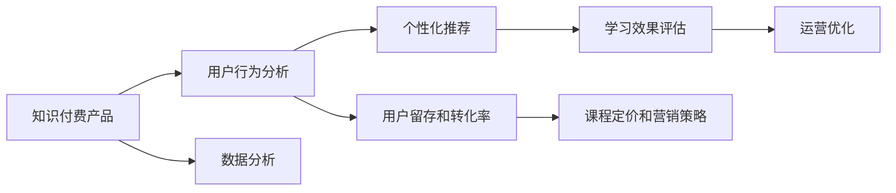
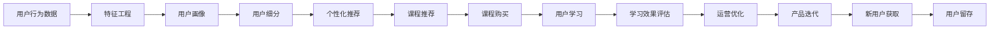

                 

# 如何利用数据分析优化知识付费产品

> 关键词：数据分析, 知识付费, 用户行为, 个性化推荐, 用户留存, 学习效果, 课程优化

## 1. 背景介绍

### 1.1 问题由来
在知识付费市场蓬勃发展的今天，各大平台和教育机构纷纷推出在线课程、学习资源和服务，竞争日趋激烈。然而，仅仅提供优质内容已不足够，只有通过科学的数据分析，才能更好地了解用户需求，提升课程质量和用户满意度，最终实现商业变现和可持续发展。本文将从多个维度，探讨如何利用数据分析来优化知识付费产品，提升用户体验和平台收益。

### 1.2 问题核心关键点
数据驱动的决策是知识付费平台竞争力的核心关键。在平台内容创作、推荐策略、用户行为分析等方面，数据分析均扮演着至关重要的角色。具体来说，数据分析能够帮助平台：
- 优化课程内容：通过挖掘用户反馈和行为数据，指导内容创作者生产更具吸引力和实用性的课程。
- 个性化推荐：根据用户兴趣、学习进度等数据，推荐最适合用户的课程和学习路径，提升用户留存和转化率。
- 预测用户流失：利用用户行为数据，预测可能流失的用户，及时采取干预措施，降低用户流失率。
- 评估学习效果：通过用户测试和学习进度数据，评估课程效果，发现问题并进行改进。
- 改进运营策略：根据用户数据，优化课程定价、营销渠道、用户获取策略等运营环节。

## 2. 核心概念与联系

### 2.1 核心概念概述

为更好地理解本文内容，本节将介绍几个核心概念：

- **知识付费**：指通过在线平台购买、订阅各类课程和服务，提升个人知识和技能的过程。知识付费市场包括在线教育、培训、咨询等多个细分领域。

- **数据分析**：指利用统计学、机器学习等方法，从原始数据中提取有价值的信息和知识，辅助决策和优化。

- **用户行为分析**：通过追踪、记录用户与产品互动的方式、时长、路径等行为数据，了解用户需求和习惯，进行产品优化。

- **个性化推荐系统**：根据用户的历史行为数据，动态调整推荐算法，提供符合用户偏好的内容和服务。

- **用户留存和转化率**：衡量知识付费平台吸引和保留用户的能力，用户留存率越高，平台的商业模式越健康。

- **学习效果评估**：通过问卷、测试、进度跟踪等方式，评估用户的学习成果和满意度，指导课程和平台的改进。

这些核心概念之间的关系可以简单地用以下Mermaid流程图表示：



### 2.2 核心概念原理和架构的 Mermaid 流程图

在深入研究核心概念的原理和架构之前，让我们先通过一个简单的流程图，展示数据分析在知识付费产品中的具体应用路径：



## 3. 核心算法原理 & 具体操作步骤

### 3.1 算法原理概述

知识付费产品的数据分析过程可以分为以下几个步骤：

1. **数据收集**：通过用户行为记录、问卷调查、APP数据跟踪等方式，收集全面的用户数据。
2. **特征工程**：对原始数据进行清洗、处理和提取，生成有意义的特征变量。
3. **模型训练**：选择合适的模型和算法，对用户数据进行训练，生成预测模型或用户画像。
4. **模型评估**：使用验证集或测试集数据评估模型效果，优化模型参数。
5. **应用部署**：将训练好的模型部署到产品中，实现个性化推荐、课程优化等功能。

### 3.2 算法步骤详解

#### 3.2.1 数据收集

收集用户数据是数据分析的第一步。具体可以包括以下几个方面：

- **行为数据**：如课程浏览次数、学习时长、互动评论等。
- **用户属性**：如年龄、性别、职业、教育背景等。
- **购买行为**：如课程购买次数、购买金额、用户续费率等。
- **反馈数据**：如问卷调查、课程评价、学习效果反馈等。

通过数据收集工具和技术，如Google Analytics、Amplitude等，可以全面追踪用户行为，生成详细的用户画像。

#### 3.2.2 特征工程

特征工程是将原始数据转换为有用特征的过程。其核心目标是通过数据预处理和特征提取，为模型训练提供高质量的输入数据。具体步骤包括：

1. **数据清洗**：去除重复、缺失、异常数据，保证数据质量和一致性。
2. **数据转换**：对数据进行归一化、标准化、分箱处理等，使数据更适合模型训练。
3. **特征选择**：选择最具预测能力的特征，避免维度灾难，提高模型效率。
4. **特征构造**：通过用户行为数据生成新的特征变量，如用户活跃度、学习进度等。

#### 3.2.3 模型训练

选择合适的模型和算法是数据分析的核心。根据不同的业务需求，可以采用以下几种模型：

- **分类模型**：如逻辑回归、随机森林、支持向量机等，用于预测用户行为（如是否购买课程、课程推荐）。
- **回归模型**：如线性回归、岭回归、XGBoost等，用于预测课程完成度、用户留存率等。
- **聚类模型**：如K-means、层次聚类等，用于用户细分和画像生成。
- **关联规则模型**：如Apriori、FP-Growth等，用于发现用户购买行为之间的关联。

#### 3.2.4 模型评估

模型评估是通过验证集或测试集数据，对训练好的模型进行效果验证和参数调整。具体方法包括：

- **交叉验证**：将数据集分为训练集和验证集，进行交叉验证，评估模型泛化能力。
- **指标分析**：如准确率、召回率、F1值、ROC曲线等，综合评估模型效果。
- **A/B测试**：对比不同模型的性能，选择最优模型进行部署。

#### 3.2.5 应用部署

模型部署是将训练好的模型应用到实际产品中的过程。具体步骤包括：

1. **数据接入**：将用户数据接入到实时数据流，供模型进行实时预测和推荐。
2. **模型调用**：在产品页面调用训练好的模型，进行个性化推荐和课程优化。
3. **结果反馈**：收集用户反馈和行为数据，进一步优化模型和产品。

### 3.3 算法优缺点

#### 3.3.1 优点

数据分析在知识付费产品中的应用具有以下优点：

1. **提升用户体验**：通过个性化推荐和课程优化，提供更加符合用户需求的服务。
2. **提高运营效率**：通过用户留存和转化率分析，优化课程定价和营销策略，降低用户获取成本。
3. **增加收入**：通过精准预测用户行为，提升课程转化率和用户续费率，增加平台收益。
4. **降低风险**：通过用户流失预测，及时采取干预措施，降低用户流失率，提升用户留存率。

#### 3.3.2 缺点

数据分析也存在一些局限性：

1. **数据隐私问题**：用户数据涉及隐私，处理不当可能引发法律风险。
2. **数据质量问题**：数据收集和处理过程中，难免存在误差和偏差，影响分析结果。
3. **模型复杂性**：选择和训练模型需要大量计算资源和时间，模型调优过程复杂。
4. **结果解释性**：部分模型（如深度学习）结果可解释性差，难以进行直观的分析和解释。

## 4. 数学模型和公式 & 详细讲解 & 举例说明

### 4.1 数学模型构建

在本节中，我们将以用户留存预测为例，构建一个简单的用户留存分析模型。用户留存预测的核心目标是预测用户是否会在一定时间内继续使用平台，其数学模型可以表示为：

$$
P(\text{留存}) = f(\text{用户属性}, \text{行为数据}, \text{课程数据})
$$

其中，$f$为预测函数，将用户属性、行为数据和课程数据映射到留存概率。

### 4.2 公式推导过程

具体来说，用户留存预测可以采用多种机器学习算法。以逻辑回归为例，其基本公式为：

$$
P(\text{留存}) = \frac{1}{1 + \exp(-\beta_0 - \sum_{i=1}^n \beta_i X_i)}
$$

其中，$X_i$为第$i$个特征变量，$\beta_i$为对应特征的系数。通过训练数据，最小化损失函数：

$$
L(\beta) = -\frac{1}{N} \sum_{i=1}^N [y_i \log P(\text{留存}) + (1 - y_i) \log (1 - P(\text{留存}))]
$$

采用梯度下降等优化算法，求解最优的$\beta$，从而得到用户留存的预测模型。

### 4.3 案例分析与讲解

假设我们收集了以下用户数据：

| 用户ID | 年龄 | 职业 | 教育背景 | 课程完成度 | 学习时长 | 课程购买次数 | 续费次数 | 活跃度 |
|--------|------|------|----------|----------|--------|------------|----------|-------|

通过特征工程，我们生成如下特征：

| 用户ID | 年龄 | 职业 | 教育背景 | 课程完成度 | 学习时长 | 课程购买次数 | 续费次数 | 活跃度 | 用户活跃度 | 学习进度 | 课程完成率 | 用户细分标签 |
|--------|------|------|----------|----------|--------|------------|----------|-------|------------|-----------|-----------|--------------|

将这些特征数据代入逻辑回归模型，进行训练和验证，即可得到用户留存的预测模型。

## 5. 项目实践：代码实例和详细解释说明

### 5.1 开发环境搭建

在进行数据分析和模型训练前，我们需要准备好开发环境。以下是使用Python进行TensorFlow和Keras开发的环境配置流程：

1. 安装Anaconda：从官网下载并安装Anaconda，用于创建独立的Python环境。

2. 创建并激活虚拟环境：
```bash
conda create -n tf-env python=3.8 
conda activate tf-env
```

3. 安装TensorFlow：根据CUDA版本，从官网获取对应的安装命令。例如：
```bash
conda install tensorflow
```

4. 安装Keras：
```bash
pip install keras
```

5. 安装各类工具包：
```bash
pip install numpy pandas scikit-learn matplotlib tqdm jupyter notebook ipython
```

完成上述步骤后，即可在`tf-env`环境中开始数据分析和模型训练。

### 5.2 源代码详细实现

假设我们使用逻辑回归模型进行用户留存预测。以下是使用TensorFlow和Keras实现的代码：

```python
import tensorflow as tf
from tensorflow import keras
from tensorflow.keras import layers
from sklearn.model_selection import train_test_split
from sklearn.metrics import accuracy_score

# 加载数据
data = ...  # 从数据源加载用户数据
target = ...  # 从数据源加载用户留存标签

# 特征工程
features = ...  # 从数据源加载特征数据

# 划分训练集和验证集
train_features, test_features, train_target, test_target = train_test_split(features, target, test_size=0.2, random_state=42)

# 定义模型
model = keras.Sequential([
    layers.Dense(32, activation='relu', input_shape=(features.shape[1],)),
    layers.Dense(16, activation='relu'),
    layers.Dense(1, activation='sigmoid')
])

# 编译模型
model.compile(optimizer='adam', loss='binary_crossentropy', metrics=['accuracy'])

# 训练模型
model.fit(train_features, train_target, epochs=10, batch_size=32, validation_data=(test_features, test_target))

# 评估模型
test_loss, test_accuracy = model.evaluate(test_features, test_target)
print(f"Test accuracy: {test_accuracy:.2f}")
```

### 5.3 代码解读与分析

让我们再详细解读一下关键代码的实现细节：

**数据加载**：
```python
data = ...  # 从数据源加载用户数据
target = ...  # 从数据源加载用户留存标签
```

数据加载可以使用Pandas、SQL、API等多种方式进行，具体方法根据数据源和平台不同而有所差异。例如，可以使用Pandas读取本地CSV文件，或通过API获取在线数据。

**特征工程**：
```python
features = ...  # 从数据源加载特征数据
```

特征工程是数据分析的核心步骤。常用的特征工程方法包括：
- 数据清洗：去除重复、缺失、异常数据，处理空值和缺失值。
- 数据转换：对数据进行归一化、标准化、分箱处理等，使数据更适合模型训练。
- 特征选择：选择最具预测能力的特征，避免维度灾难，提高模型效率。
- 特征构造：通过用户行为数据生成新的特征变量，如用户活跃度、学习进度等。

**模型定义**：
```python
model = keras.Sequential([
    layers.Dense(32, activation='relu', input_shape=(features.shape[1],)),
    layers.Dense(16, activation='relu'),
    layers.Dense(1, activation='sigmoid')
])
```

模型定义通常使用Keras等深度学习框架进行。以上代码定义了一个包含3个全连接层的逻辑回归模型，其中最后一层为sigmoid激活函数，适合二分类问题。

**模型编译**：
```python
model.compile(optimizer='adam', loss='binary_crossentropy', metrics=['accuracy'])
```

模型编译是定义损失函数和优化器，并设置评估指标的过程。在此步骤中，我们选择了Adam优化器和二元交叉熵损失函数，用于最大化准确率。

**模型训练**：
```python
model.fit(train_features, train_target, epochs=10, batch_size=32, validation_data=(test_features, test_target))
```

模型训练是使用训练集数据，通过前向传播和反向传播更新模型参数的过程。以上代码设置了10个epochs和32个样本批次的训练过程，并使用测试集进行验证。

**模型评估**：
```python
test_loss, test_accuracy = model.evaluate(test_features, test_target)
print(f"Test accuracy: {test_accuracy:.2f}")
```

模型评估是使用测试集数据，评估模型效果的过程。以上代码计算了模型在测试集上的准确率，并打印输出。

## 6. 实际应用场景

### 6.1 智能客服系统

基于数据分析的用户行为分析，可以在智能客服系统中发挥重要作用。通过追踪用户与客服互动的频率、时长、满意度等数据，平台可以了解用户需求和痛点，进行针对性优化：

1. **问题反馈分析**：分析用户反馈数据，识别常见问题，及时优化客服解答模板。
2. **客服话术优化**：根据用户互动数据，生成更贴近用户需求的客服话术，提升用户体验。
3. **智能推荐系统**：根据用户历史咨询记录，推荐最合适的解决方案，提高用户满意度。

### 6.2 内容推荐系统

数据分析在内容推荐系统中也至关重要。通过追踪用户行为数据，平台可以构建用户画像，进行个性化推荐：

1. **用户画像构建**：通过用户行为数据，生成用户兴趣和行为特征，生成用户画像。
2. **内容推荐优化**：根据用户画像和内容特征，生成推荐结果，提高点击率和转化率。
3. **模型调优**：通过A/B测试等方法，不断优化推荐算法，提升推荐效果。

### 6.3 课程推荐系统

课程推荐系统是知识付费平台的核心功能之一。通过数据分析，平台可以：

1. **用户画像构建**：通过用户历史学习数据，生成用户画像，了解用户学习偏好和需求。
2. **课程推荐优化**：根据用户画像和课程特征，生成推荐结果，提升课程推荐效果。
3. **课程优化**：通过用户学习效果数据，优化课程内容，提高用户满意度。

### 6.4 未来应用展望

随着数据分析技术的不断进步，其在知识付费产品中的应用将更加广泛和深入：

1. **用户行为预测**：通过用户行为数据，预测用户流失、续费等行为，及时采取干预措施，提升用户留存率。
2. **多模态数据分析**：融合视频、音频等多模态数据，提升用户行为分析和内容推荐效果。
3. **实时数据分析**：通过实时数据分析，优化产品功能，提升用户体验。
4. **个性化推荐系统**：构建更精确、更全面的个性化推荐模型，提升推荐效果。

## 7. 工具和资源推荐

### 7.1 学习资源推荐

为了帮助开发者系统掌握数据分析的理论基础和实践技巧，这里推荐一些优质的学习资源：

1. **《Python数据分析实战》**：全面介绍Python数据分析的各项工具和技术，适合初学者入门。
2. **《机器学习实战》**：详细讲解常用的机器学习算法和模型，适合进阶学习。
3. **Kaggle**：全球知名的数据科学竞赛平台，提供大量高质量数据集和Kaggle Kernels，适合进行数据分析和机器学习实践。
4. **Coursera**：提供大量数据分析和机器学习的在线课程，适合系统学习。
5. **TensorFlow官方文档**：提供了丰富的TensorFlow和Keras文档和教程，适合开发者快速上手。

### 7.2 开发工具推荐

高效的开发离不开优秀的工具支持。以下是几款用于数据分析和模型训练开发的常用工具：

1. **Python**：作为数据科学和机器学习的主流语言，Python提供了丰富的数据分析和机器学习库，如Pandas、NumPy、Scikit-learn等。
2. **TensorFlow**：由Google主导开发的深度学习框架，提供丰富的模型和算法，适合大规模模型训练。
3. **Keras**：基于TensorFlow的高级API，适合快速原型开发和模型训练。
4. **Jupyter Notebook**：开源的交互式笔记本环境，支持Python、R等多种语言，适合进行数据分析和机器学习实验。
5. **Tableau**：强大的数据可视化工具，适合进行数据探索和报表生成。

### 7.3 相关论文推荐

数据分析和机器学习领域的研究不断涌现，以下是几篇具有代表性的相关论文，推荐阅读：

1. **《数据挖掘与统计学习基础》**：入门级教材，适合了解数据分析和机器学习的基础知识。
2. **《深度学习》**：李宏毅和Ian Goodfellow等人著，详细讲解深度学习理论和实践。
3. **《推荐系统：从原理到算法》**：讲解推荐系统原理和算法的经典书籍，适合系统学习。
4. **《用户行为分析：从理论到实践》**：介绍用户行为分析的理论和实践方法的书籍，适合数据分析和产品优化。

## 8. 总结：未来发展趋势与挑战

### 8.1 研究成果总结

本文通过多个实例和场景，详细介绍了利用数据分析优化知识付费产品的核心方法和实践技巧。具体来说，主要包括以下内容：

1. **数据分析的核心步骤**：数据收集、特征工程、模型训练、模型评估和应用部署。
2. **数据分析在知识付费产品中的应用**：用户行为分析、个性化推荐、用户留存预测等。
3. **数据分析的优势和局限性**：提升用户体验、提高运营效率、增加收入等优点，以及数据隐私和模型复杂性等缺点。

### 8.2 未来发展趋势

展望未来，数据分析和机器学习在知识付费产品中的应用将不断深入和扩展：

1. **更广泛的数据融合**：融合更多数据源和数据类型，提升数据质量和应用效果。
2. **更先进的算法技术**：引入深度学习、强化学习等新技术，提升模型的准确性和泛化能力。
3. **更高效的数据处理**：采用分布式计算、数据流技术等手段，提升数据处理效率和实时性。
4. **更智能的推荐系统**：构建更精确、更全面的推荐模型，提升推荐效果和用户满意度。

### 8.3 面临的挑战

尽管数据分析在知识付费产品中已经取得了显著成效，但仍然面临一些挑战：

1. **数据隐私问题**：用户数据涉及隐私，处理不当可能引发法律风险。
2. **数据质量和完整性**：数据收集和处理过程中，难免存在误差和偏差，影响分析结果。
3. **模型复杂性**：选择和训练模型需要大量计算资源和时间，模型调优过程复杂。
4. **结果解释性**：部分模型（如深度学习）结果可解释性差，难以进行直观的分析和解释。

### 8.4 研究展望

未来的研究需要在以下几个方面寻求新的突破：

1. **无监督学习**：利用无监督学习技术，降低对标注数据的依赖，提高模型泛化能力。
2. **自动化数据处理**：通过自动化数据处理技术，提升数据处理效率和准确性。
3. **跨领域知识融合**：将跨领域的知识与机器学习模型进行融合，提升模型的表现力和应用范围。
4. **模型解释性**：研究可解释性强的模型和算法，提高模型的透明性和可信度。

总之，数据分析和机器学习在知识付费产品中的应用将不断深入，为平台带来更多的价值和优势。开发者需要不断学习新知识，掌握新技能，才能在激烈的市场竞争中保持领先。

