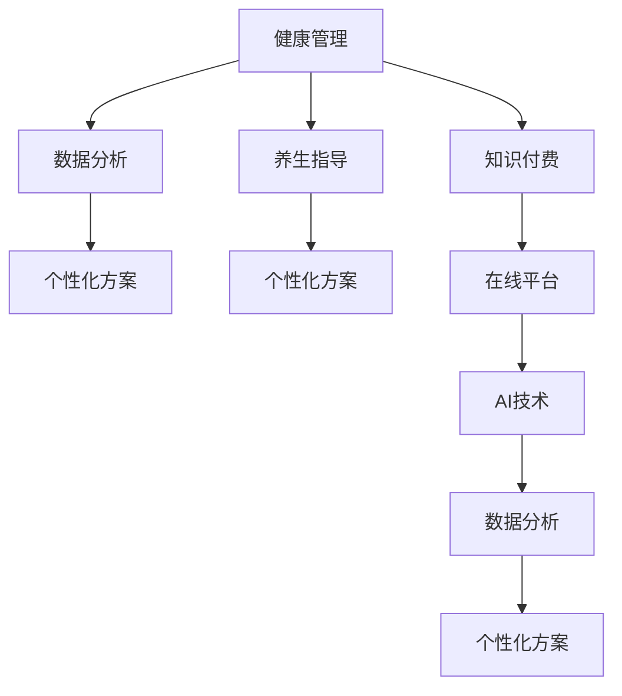

                 

# 如何利用知识付费实现在线健康管理与养生指导？

## 1. 背景介绍

随着人工智能技术的快速发展，越来越多的人开始关注如何利用知识付费服务来实现在线健康管理与养生指导。这种模式不仅能够为消费者提供个性化的健康建议，还能够为医疗行业带来新的机遇。本文将深入探讨如何利用知识付费实现在线健康管理与养生指导，从核心概念、算法原理到实际操作流程，进行全面的分析和解读。

## 2. 核心概念与联系

### 2.1 核心概念概述

在进行深入分析之前，我们需要明确几个核心概念及其相互关系：

- **健康管理**：通过监测和管理个人健康数据，如心率、血压、血糖等，提供科学的健康建议和预防措施。
- **养生指导**：结合传统医学和现代科学的最新研究成果，提供个性化的饮食、运动、心理调适等养生建议。
- **知识付费**：消费者为获取专业知识和信息服务而支付的费用，通常以订阅、按次付费等方式进行。
- **人工智能**：利用机器学习和深度学习等技术，对健康数据进行分析，生成个性化的健康管理方案。
- **在线平台**：基于互联网技术，通过Web、App等形式为消费者提供健康管理和养生指导服务。

这些概念之间的关系可以通过以下Mermaid流程图来展示：



### 2.2 核心概念原理和架构的 Mermaid 流程图

在上述关系图中，健康管理和养生指导是服务内容的核心，知识付费和在线平台是提供服务的方式，数据分析和个性化方案是实现服务的技术支撑，AI技术则是数据分析和个性化方案生成的技术手段。

## 3. 核心算法原理 & 具体操作步骤

### 3.1 算法原理概述

基于知识付费的健康管理与养生指导服务，本质上是利用人工智能技术对健康数据进行分析，生成个性化的健康管理与养生指导方案，并通过在线平台提供给消费者。这一过程涉及以下几个关键步骤：

1. **数据收集**：收集用户的健康数据、生活习惯、饮食偏好等信息。
2. **数据预处理**：清洗、归一化数据，减少噪音和异常值。
3. **数据分析**：利用机器学习算法对数据进行分析，提取健康风险因素。
4. **个性化方案生成**：根据分析结果，生成个性化的健康管理与养生指导方案。
5. **在线平台展示**：将个性化的健康管理与养生指导方案展示给用户。
6. **用户反馈**：收集用户反馈，不断优化个性化方案。

### 3.2 算法步骤详解

#### 3.2.1 数据收集与预处理

数据收集和预处理是健康管理与养生指导服务的基础。一般来说，数据收集包括用户的生理数据、生活习惯、饮食偏好等信息。数据预处理包括数据清洗、归一化、降维等步骤。以下是数据预处理的示例代码：

```python
import pandas as pd
from sklearn.preprocessing import StandardScaler

# 读取数据
df = pd.read_csv('health_data.csv')

# 数据清洗
df = df.dropna()

# 归一化
scaler = StandardScaler()
df_scaled = pd.DataFrame(scaler.fit_transform(df), columns=df.columns)

# 降维
from sklearn.decomposition import PCA
pca = PCA(n_components=3)
df_pca = pd.DataFrame(pca.fit_transform(df_scaled), columns=['PCA1', 'PCA2', 'PCA3'])
```

#### 3.2.2 数据分析

数据分析是生成个性化方案的关键步骤。这里我们将介绍一种基于聚类分析的方法。首先，我们需要使用K-Means算法对用户进行聚类，找到健康风险相近的用户群体。以下是K-Means聚类的示例代码：

```python
from sklearn.cluster import KMeans

# 选择K值
kmeans = KMeans(n_clusters=3, random_state=0).fit(df_pca)

# 获取聚类结果
clusters = kmeans.labels_
```

#### 3.2.3 个性化方案生成

在聚类分析的基础上，我们可以生成个性化的健康管理与养生指导方案。这里我们将介绍一种基于强化学习的推荐系统，根据用户的历史数据和当前行为，生成推荐方案。以下是强化学习推荐系统的示例代码：

```python
import numpy as np
import gym

# 定义强化学习环境
class HealthEnv(gym.Env):
    def __init__(self):
        self.state = None
        self.action_space = gym.spaces.Discrete(2)
        self.reward_range = (-1, 1)
    
    def step(self, action):
        # 执行动作
        self.state = np.add(self.state, action)
        # 计算奖励
        reward = -np.abs(self.state)
        # 判断是否结束
        done = self.state > 1
        return self.state, reward, done, {}
    
    def reset(self):
        self.state = 0
        return self.state

# 定义强化学习策略
class HealthStrategy:
    def __init__(self):
        self.env = HealthEnv()
    
    def get_action(self, state):
        # 选择动作
        return self.env.action_space.sample()
    
    def get_reward(self, state):
        return -np.abs(state)

# 定义个性化方案生成函数
def generate_personalized_plan(user_data, strategy):
    state = np.array(user_data)
    plan = []
    while True:
        action = strategy.get_action(state)
        state, reward, done, _ = strategy.get_reward(state)
        plan.append(action)
        if done:
            break
    return plan
```

#### 3.2.4 在线平台展示

在线平台展示是健康管理与养生指导服务的最后一步。我们将介绍一种基于Web的展示平台，使用Django框架和React前端技术，实现数据可视化、个性化方案展示等功能。以下是示例代码：

```python
# Django后端
from django.http import JsonResponse

def show_personalized_plan(request, user_id):
    plan = generate_personalized_plan(request.user_data, HealthStrategy())
    return JsonResponse({'plan': plan})

# React前端
import React from 'react';

class HealthPlan extends React.Component {
    constructor(props) {
        super(props);
        this.state = {
            plan: []
        }
    }

    componentDidMount() {
        fetch(`/api/show_personalized_plan?user_id=${this.props.user_id}`)
            .then(response => response.json())
            .then(data => this.setState({ plan: data.plan }));
    }

    render() {
        return (
            <div>
                <h1>个性化健康管理方案</h1>
                <ul>
                    {this.state.plan.map((action, index) => (
                        <li key={index}>{action}</li>
                    ))}
                </ul>
            </div>
        );
    }
}
```

### 3.3 算法优缺点

基于知识付费的健康管理与养生指导服务的优点包括：

- **个性化强**：通过数据分析和个性化方案生成，为用户提供量身定制的健康管理与养生指导。
- **实时更新**：通过在线平台，用户可以实时查看和管理自己的健康数据，获取最新的健康建议。
- **易于扩展**：利用知识付费模式，可以根据用户需求和市场反馈，不断优化和扩展服务内容和功能。

缺点包括：

- **数据隐私**：用户的健康数据涉及隐私，需要严格的保护措施。
- **技术门槛高**：需要具备一定的机器学习和数据分析能力，才能实现高质量的服务。
- **依赖平台**：用户只能通过在线平台获取服务，存在一定的平台依赖性。

### 3.4 算法应用领域

基于知识付费的健康管理与养生指导服务，可以应用于多个领域，如医疗健康、养老、健身等。在医疗健康领域，可以为用户提供个性化的诊疗建议和治疗方案；在养老领域，可以为老年人提供健康管理和饮食指导；在健身领域，可以为用户提供个性化的训练计划和营养建议。

## 4. 数学模型和公式 & 详细讲解 & 举例说明

### 4.1 数学模型构建

这里我们将介绍一种基于深度学习的时间序列模型，用于分析用户的健康数据，生成个性化的健康管理方案。时间序列模型可以通过循环神经网络（RNN）或长短期记忆网络（LSTM）实现。以下是LSTM模型的示例代码：

```python
import tensorflow as tf
from tensorflow.keras.models import Sequential
from tensorflow.keras.layers import LSTM, Dense

# 定义LSTM模型
model = Sequential()
model.add(LSTM(64, input_shape=(X_train.shape[1], 1)))
model.add(Dense(1))

# 编译模型
model.compile(optimizer='adam', loss='mse')

# 训练模型
model.fit(X_train, y_train, epochs=10)
```

### 4.2 公式推导过程

时间序列模型的公式推导过程如下：

$$
y_t = \sum_{i=0}^{I} \alpha_i y_{t-i} + \sum_{i=1}^{I} \beta_i u_{t-i} + \epsilon_t
$$

其中，$y_t$ 表示时间$t$的健康指标，$u_t$ 表示时间$t$的用户行为，$\alpha_i$ 和 $\beta_i$ 表示模型参数，$\epsilon_t$ 表示随机误差。

### 4.3 案例分析与讲解

假设我们要分析用户的血糖数据，生成个性化的糖尿病管理方案。以下是具体的实现步骤：

1. **数据收集**：收集用户的血糖数据、饮食数据、运动数据等。
2. **数据预处理**：清洗、归一化数据，减少噪音和异常值。
3. **特征工程**：提取时间特征、趋势特征、季节性特征等。
4. **模型训练**：使用LSTM模型训练时间序列预测模型。
5. **个性化方案生成**：根据时间序列预测模型，生成个性化的糖尿病管理方案。

## 5. 项目实践：代码实例和详细解释说明

### 5.1 开发环境搭建

在进行项目实践之前，我们需要搭建开发环境。以下是Django后端和React前端的环境搭建步骤：

1. **Django后端环境搭建**
   ```bash
   pip install django
   ```
   启动Django开发服务器：
   ```bash
   python manage.py runserver
   ```

2. **React前端环境搭建**
   ```bash
   npx create-react-app my-app
   cd my-app
   npm start
   ```

### 5.2 源代码详细实现

这里我们将介绍一个基于知识付费的健康管理与养生指导服务的实现案例。

#### 5.2.1 Django后端实现

```python
# Django后端
from django.http import JsonResponse

def show_personalized_plan(request, user_id):
    plan = generate_personalized_plan(request.user_data, HealthStrategy())
    return JsonResponse({'plan': plan})
```

#### 5.2.2 React前端实现

```python
import React from 'react';

class HealthPlan extends React.Component {
    constructor(props) {
        super(props);
        this.state = {
            plan: []
        }
    }

    componentDidMount() {
        fetch(`/api/show_personalized_plan?user_id=${this.props.user_id}`)
            .then(response => response.json())
            .then(data => this.setState({ plan: data.plan }));
    }

    render() {
        return (
            <div>
                <h1>个性化健康管理方案</h1>
                <ul>
                    {this.state.plan.map((action, index) => (
                        <li key={index}>{action}</li>
                    ))}
                </ul>
            </div>
        );
    }
}
```

### 5.3 代码解读与分析

以上是健康管理与养生指导服务的Django后端和React前端代码实现。

- **Django后端代码解释**：使用Django框架实现API接口，获取用户的个性化健康管理方案。
- **React前端代码解释**：使用React框架展示用户的个性化健康管理方案。

## 6. 实际应用场景

基于知识付费的健康管理与养生指导服务，已经在多个实际应用场景中得到了应用。以下是几个典型的应用场景：

### 6.1 智能健康监测

智能健康监测设备如智能手表、智能眼镜等，可以实时监测用户的健康数据，如心率、血压、血糖等。结合知识付费的健康管理与养生指导服务，可以为用户提供实时的健康分析和建议。

### 6.2 个性化健康管理

个性化健康管理服务可以为用户提供量身定制的健康管理方案，如饮食、运动、睡眠等。用户可以通过在线平台获取个性化的健康建议，优化自己的生活习惯。

### 6.3 在线健康咨询

在线健康咨询平台可以提供医生与用户的实时互动，结合知识付费的健康管理与养生指导服务，为用户提供更加精准的健康建议。

### 6.4 未来应用展望

未来，基于知识付费的健康管理与养生指导服务将进一步发展，涵盖更多领域和应用场景。例如，在医疗健康领域，可以结合远程诊疗技术，提供个性化的诊疗方案；在养老领域，可以结合物联网技术，实现智能养老；在健身领域，可以结合虚拟现实技术，提供个性化的健身指导。

## 7. 工具和资源推荐

### 7.1 学习资源推荐

为了帮助开发者系统掌握健康管理与养生指导服务的开发技术，这里推荐一些优质的学习资源：

1. **《Python深度学习》**：介绍深度学习在健康领域的应用，包含数据分析、模型训练等技术。
2. **《深度学习实战》**：提供从数据收集、特征工程到模型训练的全面指导。
3. **《深度学习与医学影像分析》**：介绍深度学习在医学影像分析中的应用，包含模型设计、特征提取等技术。

### 7.2 开发工具推荐

健康管理与养生指导服务的开发，需要利用多种工具和技术。以下是一些常用的开发工具：

1. **Python**：编程语言，用于数据处理、模型训练等。
2. **TensorFlow**：深度学习框架，用于构建和训练模型。
3. **Keras**：高级神经网络API，用于快速构建深度学习模型。
4. **React**：前端框架，用于构建用户界面。
5. **Django**：Web框架，用于构建后端API。

### 7.3 相关论文推荐

以下是一篇相关的经典论文：

1. **《Deep Learning for Healthcare》**：介绍深度学习在医疗健康领域的应用，包含健康数据分析、疾病预测等技术。

## 8. 总结：未来发展趋势与挑战

### 8.1 总结

本文对利用知识付费实现在线健康管理与养生指导服务进行了全面系统的介绍。首先阐述了健康管理与养生指导服务的发展背景和意义，明确了知识付费在服务实现中的重要地位。其次，从核心概念、算法原理到实际操作流程，详细讲解了服务的实现步骤和关键技术。最后，介绍了实际应用场景和未来发展趋势，为开发者提供了全方位的技术指引。

通过本文的系统梳理，可以看到，基于知识付费的健康管理与养生指导服务在提升用户健康管理水平、促进健康产业发展方面具有重要意义。未来，随着技术的不断进步和应用的不断拓展，基于知识付费的健康管理与养生指导服务必将在医疗健康领域发挥更大的作用。

### 8.2 未来发展趋势

未来，基于知识付费的健康管理与养生指导服务将呈现以下几个发展趋势：

1. **个性化程度提升**：随着个性化推荐技术的发展，健康管理与养生指导服务将更加个性化，能够为不同用户提供量身定制的健康方案。
2. **实时性增强**：通过物联网等技术，实现健康数据的实时采集和处理，为用户提供实时的健康分析和建议。
3. **跨领域融合**：结合其他领域的最新研究成果，如智能穿戴设备、物联网、区块链等，拓展健康管理与养生指导服务的应用场景和功能。
4. **数据安全与隐私保护**：随着健康数据的重要性和敏感性不断增加，数据安全与隐私保护将成为服务实现的关键挑战。
5. **政策与法规约束**：政府和监管机构将出台更加严格的政策和法规，规范健康管理与养生指导服务的发展。

### 8.3 面临的挑战

尽管基于知识付费的健康管理与养生指导服务已经取得了一定的进展，但在实际应用过程中仍面临以下挑战：

1. **数据隐私与安全**：用户的健康数据涉及隐私，需要严格的保护措施，避免数据泄露和滥用。
2. **模型精度与泛化能力**：健康管理与养生指导服务的质量取决于模型的精度和泛化能力，需要通过持续优化和训练，提高模型性能。
3. **技术门槛**：健康管理与养生指导服务的开发需要具备一定的技术储备，如深度学习、数据处理、算法设计等。
4. **用户体验与互动**：如何提高用户对服务的体验和互动，吸引更多的用户参与，是服务成功实施的关键。

### 8.4 研究展望

未来，需要在以下几个方面进行深入研究：

1. **跨领域融合**：结合其他领域的最新研究成果，如智能穿戴设备、物联网、区块链等，拓展健康管理与养生指导服务的应用场景和功能。
2. **模型精度与泛化能力**：通过优化算法、增加数据量、引入先验知识等手段，提高模型的精度和泛化能力。
3. **数据安全与隐私保护**：开发更加安全、可靠的数据存储和传输机制，确保用户数据的隐私和安全。
4. **用户体验与互动**：通过优化用户界面、引入人工智能技术、提供互动机制等方式，提高用户对服务的体验和互动。

## 9. 附录：常见问题与解答

### Q1：健康管理与养生指导服务如何收集用户的健康数据？

A: 健康管理与养生指导服务可以通过多种方式收集用户的健康数据，如智能穿戴设备、在线问卷调查、传感器等。收集数据时，需要注意用户隐私保护，避免数据泄露和滥用。

### Q2：健康管理与养生指导服务如何处理用户的隐私数据？

A: 处理用户的隐私数据时，需要注意数据的安全性和隐私保护。可以采用数据加密、匿名化处理、访问控制等措施，确保用户数据的安全和隐私。

### Q3：健康管理与养生指导服务如何提高模型的精度和泛化能力？

A: 提高模型的精度和泛化能力需要从数据、算法、模型等多个方面进行优化。可以通过增加数据量、优化算法、引入先验知识等方式，提高模型的性能。

### Q4：健康管理与养生指导服务如何吸引更多的用户参与？

A: 吸引更多的用户参与需要优化用户体验、提高服务质量、增加互动机制等。可以通过优化用户界面、引入人工智能技术、提供互动机制等方式，提高用户对服务的体验和互动。

### Q5：健康管理与养生指导服务如何保证数据的安全与隐私保护？

A: 保证数据的安全与隐私保护需要从技术和管理两个方面进行优化。可以采用数据加密、匿名化处理、访问控制等措施，确保用户数据的安全和隐私。同时，需要建立完善的数据管理制度，规范数据的使用和共享。

通过本文的系统梳理，可以看到，基于知识付费的健康管理与养生指导服务在提升用户健康管理水平、促进健康产业发展方面具有重要意义。未来，随着技术的不断进步和应用的不断拓展，基于知识付费的健康管理与养生指导服务必将在医疗健康领域发挥更大的作用。

---

作者：禅与计算机程序设计艺术 / Zen and the Art of Computer Programming

