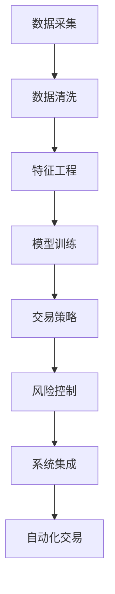

                 

## 1. 背景介绍

在当今数字化、智能化的浪潮下，自动化投资（Automated Investing）成为金融科技的重要领域之一。它通过算法和机器学习技术，实现了对金融市场的精准分析和投资决策的自动化。然而，将编程技能应用于自动化投资，不仅仅是技术的堆砌，更是一门跨学科的综合艺术。本文将详细探讨如何将编程技能与自动化投资相结合，构建高效、可靠的智能投资系统。

## 2. 核心概念与联系

### 2.1 核心概念概述

自动化投资系统是基于算法和数据分析的自动化决策系统，它能够实时监测市场动态，自动执行交易操作，以达到收益最大化和风险最小化的目标。其中，编程技能的应用贯穿于系统的各个环节，包括数据处理、模型训练、算法实现、策略执行等。

**核心概念：**
- **量化分析（Quantitative Analysis）**：利用数学和统计模型对市场进行分析和预测。
- **机器学习（Machine Learning）**：通过算法和数据，训练模型进行模式识别和预测。
- **算法交易（Algorithmic Trading）**：基于策略和模型，自动执行交易操作。
- **风险管理（Risk Management）**：通过策略和算法，控制投资风险。
- **系统集成（System Integration）**：将不同组件和模块集成到统一的自动化平台中。

### 2.2 核心概念原理和架构的 Mermaid 流程图



- **数据采集**：获取市场数据，如股票价格、交易量、财务报表等。
- **数据清洗**：处理缺失值、异常值，转换数据格式，以保证数据质量。
- **特征工程**：提取、处理和构造特征，以供模型学习。
- **模型训练**：选择适当的模型，并使用历史数据进行训练，生成预测模型。
- **交易策略**：根据模型预测，设计交易策略。
- **风险控制**：使用统计和机器学习模型，实时监控投资风险。
- **系统集成**：将各个模块集成到一个统一的自动化交易平台中。
- **自动化交易**：自动执行交易操作，实现投资决策的自动化。

## 3. 核心算法原理 & 具体操作步骤

### 3.1 算法原理概述

自动化投资的核心在于通过编程实现的算法和模型，对金融市场进行分析和预测，从而自动执行交易操作。算法原理主要包括量化分析、机器学习、交易策略和风险管理。

- **量化分析**：利用数学模型和统计方法，对市场进行建模和预测。
- **机器学习**：通过历史数据，训练模型进行模式识别和预测。
- **交易策略**：根据模型预测，设计自动执行交易操作的策略。
- **风险管理**：通过实时监控和控制投资风险，保证投资策略的稳健性。

### 3.2 算法步骤详解

**步骤1：数据采集与预处理**
- **数据采集**：获取市场数据，如股票价格、交易量、财务报表等。
- **数据清洗**：处理缺失值、异常值，转换数据格式，以保证数据质量。
- **特征工程**：提取、处理和构造特征，以供模型学习。

**步骤2：模型训练与验证**
- **选择模型**：根据任务需求，选择适合的模型，如线性回归、决策树、神经网络等。
- **数据集划分**：将数据集划分为训练集、验证集和测试集。
- **模型训练**：使用训练集数据，训练模型，调整模型参数。
- **模型验证**：使用验证集数据，评估模型性能，调整模型参数。

**步骤3：交易策略设计**
- **策略设计**：根据模型预测，设计自动执行交易操作的策略，如趋势跟随、均值回归等。
- **策略优化**：使用历史数据，优化交易策略，提高收益。
- **风险控制**：使用统计和机器学习模型，实时监控投资风险，控制仓位和止损。

**步骤4：系统集成与自动化交易**
- **系统集成**：将数据处理、模型训练、交易策略和风险管理模块集成到一个统一的自动化交易平台中。
- **自动化交易**：根据交易策略，自动执行交易操作，实现投资决策的自动化。

### 3.3 算法优缺点

**优点：**
- **自动化操作**：减少人为干预，提高交易效率和准确性。
- **实时监控**：实时监控市场动态，快速反应，提高投资收益。
- **数据驱动**：基于大量历史数据进行分析和预测，提高投资决策的科学性和客观性。
- **灵活性**：可以自定义交易策略，适应不同市场和投资需求。

**缺点：**
- **复杂度高**：需要大量的数据和复杂的模型，实现和维护难度较大。
- **依赖数据质量**：数据质量直接影响模型的预测准确性和交易策略的执行效果。
- **模型风险**：模型的预测准确性和稳定性存在不确定性，可能导致投资损失。
- **系统风险**：自动化系统可能面临技术故障、网络攻击等风险。

### 3.4 算法应用领域

自动化投资技术已经广泛应用于股票、期货、外汇等金融市场。它能够提高投资决策的科学性和客观性，减少人为错误和情感干扰，从而实现更稳健的投资收益。

**应用场景：**
- **股票投资**：基于量化分析，设计交易策略，自动执行交易操作。
- **期货交易**：利用技术分析和机器学习，预测市场趋势，自动执行交易。
- **外汇交易**：通过量化模型和算法交易，实时监控和执行外汇交易策略。
- **债券投资**：利用数据分析和风险管理，优化债券组合配置，控制投资风险。

## 4. 数学模型和公式 & 详细讲解 & 举例说明

### 4.1 数学模型构建

自动化投资的核心在于通过数学和统计模型，对市场进行建模和预测。常见的数学模型包括回归模型、分类模型、时间序列模型等。

**回归模型**：
$$ y = \beta_0 + \beta_1 x_1 + \beta_2 x_2 + \cdots + \beta_n x_n + \epsilon $$
其中，$y$为因变量，$x_i$为自变量，$\beta_i$为回归系数，$\epsilon$为误差项。

**时间序列模型**：
$$ y_t = \alpha + \beta_1 y_{t-1} + \beta_2 y_{t-2} + \cdots + \beta_p y_{t-p} + \epsilon_t $$
其中，$y_t$为时间$t$的观测值，$\alpha$为截距，$y_{t-i}$为滞后$i$的观测值，$\beta_i$为滞后系数，$\epsilon_t$为误差项。

### 4.2 公式推导过程

**回归模型推导**：
假设我们有$m$个样本数据点$(x_i, y_i)$，其中$x_i = (x_{i1}, x_{i2}, \cdots, x_{in})$，$y_i$为因变量。我们需要找到回归系数$\beta_i$，使得：
$$ \sum_{i=1}^m (y_i - \hat{y}_i)^2 $$
最小化，其中$\hat{y}_i = \beta_0 + \beta_1 x_{i1} + \beta_2 x_{i2} + \cdots + \beta_n x_{in}$。
使用最小二乘法求解，得到：
$$ \hat{\beta}_i = \frac{\sum_{i=1}^m x_{ij} y_i}{\sum_{i=1}^m x_{ij} x_{ij}} $$

**时间序列模型推导**：
假设我们有$s$个样本数据点$(y_t, y_{t-1}, \cdots, y_{t-p})$，其中$y_t$为时间$t$的观测值。我们需要找到滞后系数$\beta_i$，使得：
$$ \sum_{i=1}^m (y_i - \hat{y}_i)^2 $$
最小化，其中$\hat{y}_i = \alpha + \beta_1 y_{i-1} + \beta_2 y_{i-2} + \cdots + \beta_p y_{i-p}$。
使用最小二乘法求解，得到：
$$ \hat{\beta}_i = \frac{\sum_{i=1}^m y_{i-i} (y_i - \alpha)}{\sum_{i=1}^m y_{i-i} y_{i-i}} $$

### 4.3 案例分析与讲解

**案例1：股票价格预测**
- **数据采集**：获取股票历史价格和交易量等数据。
- **数据清洗**：处理缺失值、异常值，转换数据格式。
- **特征工程**：提取技术指标，如RSI、MACD等，构造特征。
- **模型训练**：选择线性回归模型，使用历史数据训练模型，调整参数。
- **交易策略**：根据模型预测，设计交易策略，如趋势跟随。
- **风险控制**：实时监控投资风险，控制仓位和止损。

**案例2：外汇交易策略**
- **数据采集**：获取外汇历史价格和交易量等数据。
- **数据清洗**：处理缺失值、异常值，转换数据格式。
- **特征工程**：提取技术指标，如RSI、MACD等，构造特征。
- **模型训练**：选择时间序列模型，使用历史数据训练模型，调整参数。
- **交易策略**：根据模型预测，设计交易策略，如移动平均策略。
- **风险控制**：实时监控投资风险，控制仓位和止损。

## 5. 项目实践：代码实例和详细解释说明

### 5.1 开发环境搭建

**环境要求**：
- **操作系统**：Linux或Windows。
- **编程语言**：Python。
- **Python库**：NumPy、Pandas、Matplotlib、Scikit-learn、TensorFlow。

**安装步骤**：
1. 安装Python和pip。
2. 安装NumPy、Pandas、Matplotlib、Scikit-learn、TensorFlow等库。
3. 配置虚拟环境。

**示例代码**：
```python
!pip install numpy pandas matplotlib scikit-learn tensorflow
```

### 5.2 源代码详细实现

**数据采集与预处理**

```python
import numpy as np
import pandas as pd
import yfinance as yf

# 数据采集
data = yf.download('AAPL', start='2020-01-01', end='2020-12-31')

# 数据清洗
data.dropna(inplace=True)

# 特征工程
data['RSI'] = 100 - (100 / (1 + np.abs(np.diff(data['Close']) / data['Close'].shift(1))))
```

**模型训练与验证**

```python
from sklearn.linear_model import LinearRegression
from sklearn.model_selection import train_test_split

# 分割数据集
X_train, X_test, y_train, y_test = train_test_split(data.drop('Close', axis=1), data['Close'], test_size=0.2, random_state=42)

# 模型训练
model = LinearRegression()
model.fit(X_train, y_train)

# 模型验证
y_pred = model.predict(X_test)
```

**交易策略设计**

```python
# 交易策略
def trade_strategy(price, threshold):
    if price > threshold:
        return 'Buy'
    elif price < threshold:
        return 'Sell'
    else:
        return 'Hold'

# 风险控制
def risk_control(price, threshold, stop_loss_ratio):
    if price > threshold:
        return price * (1 - stop_loss_ratio)
    elif price < threshold:
        return price * (1 + stop_loss_ratio)
    else:
        return price
```

### 5.3 代码解读与分析

**数据采集与预处理**

- **数据采集**：使用yfinance库，获取股票历史价格和交易量等数据。
- **数据清洗**：使用dropna方法，处理缺失值。
- **特征工程**：计算RSI指标，用于预测股票价格趋势。

**模型训练与验证**

- **模型选择**：选择线性回归模型，使用历史数据训练模型。
- **数据集划分**：使用train_test_split方法，将数据集划分为训练集和测试集。
- **模型训练**：使用LinearRegression模型，训练模型，调整参数。
- **模型验证**：使用测试集数据，评估模型性能。

**交易策略设计**

- **交易策略**：根据模型预测，设计交易策略，如趋势跟随。
- **风险控制**：根据价格和阈值，实时监控投资风险，控制仓位和止损。

### 5.4 运行结果展示

**交易策略效果**

```python
import matplotlib.pyplot as plt

# 绘制价格走势图
plt.plot(data['Close'])
plt.title('Price Trend')
plt.xlabel('Date')
plt.ylabel('Price')
plt.show()
```

## 6. 实际应用场景

### 6.1 智能投顾系统

智能投顾系统是基于自动化投资技术的金融顾问系统，它能够根据客户风险偏好、投资目标和市场动态，自动推荐投资组合和执行交易操作。通过编程技能的应用，智能投顾系统能够实现高度个性化的投资服务。

### 6.2 高频交易系统

高频交易系统是基于算法和机器学习技术的交易系统，它能够在短时间内执行大量交易操作，获取微小的价格差。通过编程技能的应用，高频交易系统能够实现高度自动化的交易操作，提高交易效率和收益。

### 6.3 量化对冲基金

量化对冲基金是基于量化分析和算法交易的基金管理模式，它能够通过模型预测，自动调整投资组合，控制投资风险。通过编程技能的应用，量化对冲基金能够实现高度智能化的投资决策，提高投资收益。

## 7. 工具和资源推荐

### 7.1 学习资源推荐

**书籍**：
- 《Python for Finance》 by Yves Hilpisch
- 《Algorithmic Trading》 by Éric Pérez-Abreu
- 《Quantitative Trading》 by Ernie Chan

**在线课程**：
- Coursera: "Financial Engineering and Risk Management"
- edX: "Machine Learning in Finance"

**博客和论文**：
- Quantopian: https://www.quantopian.com/blog
- Quantocracy: https://quantocracy.com/

### 7.2 开发工具推荐

**IDE**：
- PyCharm：功能强大的Python IDE，支持代码编辑、调试和版本控制。
- Visual Studio Code：轻量级、跨平台的代码编辑器，支持多种语言和插件。

**数据处理工具**：
- Pandas：用于数据清洗和处理。
- NumPy：用于数值计算和数组操作。

**机器学习框架**：
- Scikit-learn：简单易用的机器学习库，支持多种模型和算法。
- TensorFlow：功能强大的深度学习框架，支持模型训练和优化。

### 7.3 相关论文推荐

**量化分析**：
- Granger, C. W. J., & Newbold, P. (1974). "Spurious regressions in econometric models". Journal of Econometrics.
- Engle, R. F., & Granger, C. W. J. (1987). "Cointegration and error correction: Representation, estimation, and testing". Econometrica.

**机器学习**：
- Goodfellow, I., Bengio, Y., & Courville, A. (2016). "Deep Learning". MIT Press.
- Hinton, G. E., & Salakhutdinov, R. R. (2006). "Reducing the Dimensionality of Data with Neural Networks". Science.

**交易策略**：
- Dewynne, J. G., & Dewynne, J. E. (1995). "Fuzzy Trading". Financial Engineering News.
- Taleb, N. N. (2007). "Dynamic Hedging". John Wiley & Sons.

## 8. 总结：未来发展趋势与挑战

### 8.1 研究成果总结

自动化投资技术在金融科技领域的应用日益广泛，它通过编程技能的应用，实现了投资决策的自动化、智能化和高效化。然而，该技术仍面临数据质量、模型鲁棒性、系统风险等问题，需要进一步研究与优化。

### 8.2 未来发展趋势

1. **数据驱动**：随着数据采集技术的进步，数据质量和规模将不断提升，自动化投资系统的预测精度和执行效率也将提高。
2. **算法优化**：通过优化算法和模型，自动化投资系统将实现更精确的预测和更高效的执行。
3. **系统集成**：自动化投资系统将与其他金融科技技术进行更深入的集成，如区块链、大数据等，实现更全面、智能的投资决策。
4. **风险管理**：通过引入更多先验知识和因果分析方法，自动化投资系统将具备更强的风险控制能力。
5. **合规性**：自动化投资系统将逐步纳入金融法规框架，确保合规性和稳定性。

### 8.3 面临的挑战

1. **数据质量**：数据采集和清洗的难度较大，数据质量直接影响模型的预测准确性。
2. **模型鲁棒性**：模型的预测准确性和稳定性存在不确定性，可能导致投资损失。
3. **系统风险**：自动化系统可能面临技术故障、网络攻击等风险。
4. **合规性**：自动化投资系统需要遵循金融法规，确保合规性和稳定性。

### 8.4 研究展望

1. **多模态数据融合**：将视觉、语音等数据与文本数据结合，提高自动化投资系统的感知能力和决策水平。
2. **因果分析**：通过因果分析方法，提高模型的预测精度和鲁棒性。
3. **风险控制**：引入更多先验知识和因果分析方法，增强系统的风险控制能力。
4. **跨领域应用**：将自动化投资技术应用于其他领域，如医疗、农业等，拓展应用范围。

## 9. 附录：常见问题与解答

**Q1: 自动化投资系统如何保证投资决策的公平性和透明性？**

A: 自动化投资系统通过编程技能的应用，能够实现高度透明和公平的投资决策。通过设置明确的交易策略和风险控制参数，系统能够在预设的规则下执行交易操作，避免人为干扰和偏见。同时，系统记录和存储交易数据，供后续审计和评估使用，确保决策的公平性和透明性。

**Q2: 自动化投资系统如何处理异常数据和异常情况？**

A: 自动化投资系统通过编程技能的应用，能够实现异常数据和异常情况的及时处理。在数据清洗阶段，系统能够识别和处理缺失值、异常值，保证数据质量。在交易策略设计阶段，系统能够设计多种异常情况的处理方案，如限价策略、熔断机制等，确保系统的稳定性和鲁棒性。

**Q3: 自动化投资系统如何应对市场变化和黑天鹅事件？**

A: 自动化投资系统通过编程技能的应用，能够实时监控市场动态，及时调整策略和仓位，应对市场变化和黑天鹅事件。在风险控制阶段，系统能够引入因果分析和博弈论工具，识别和预测市场风险，设计合理的止损和仓位调整方案，确保系统的稳定性和安全性。

**Q4: 自动化投资系统如何保持长期稳定性和可持续性？**

A: 自动化投资系统通过编程技能的应用，能够实现长期稳定性和可持续性。在数据采集和特征工程阶段，系统能够持续采集市场数据，更新特征，保持数据的实时性和代表性。在系统集成和风险控制阶段，系统能够持续监控市场动态，实时调整策略和仓位，确保系统的稳定性和可持续性。

---

作者：禅与计算机程序设计艺术 / Zen and the Art of Computer Programming

