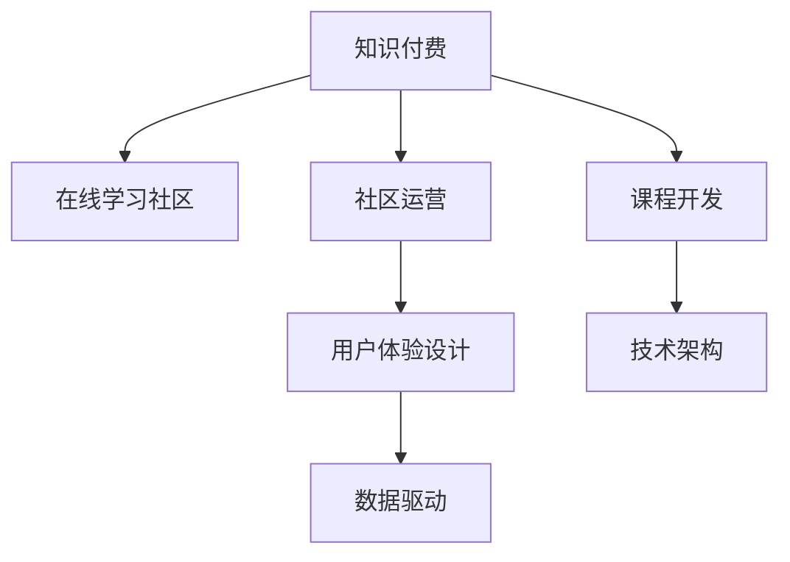

                 

# 如何打造知识付费的在线学习社区

> 关键词：知识付费,在线学习社区,社区运营,课程开发,学习路径规划,用户体验设计,技术架构,数据驱动

## 1. 背景介绍

在互联网时代，知识付费已经成为用户获取专业知识的重要方式。随着互联网的普及和智能设备的普及，越来越多的人选择通过网络学习提升自身能力，在线学习社区应运而生。然而，传统的在线学习社区往往存在内容质量参差不齐、用户体验不佳等问题，导致用户流失率高。为了解决这些问题，本文将从社区的运营策略、课程开发、用户体验设计、技术架构等几个方面入手，探讨如何打造一个高效、有价值的知识付费在线学习社区。

## 2. 核心概念与联系

### 2.1 核心概念概述

为了更好地理解如何打造知识付费的在线学习社区，本节将介绍几个关键概念：

- **知识付费(Knowledge-as-a-Service, KaaS)**：以知识为核心产品，通过在线平台提供各类专业课程、电子书、视频教程等，为用户提供个性化的知识获取服务。

- **在线学习社区(Online Learning Community, OLC)**：以网络为媒介，聚集拥有相同学习兴趣或职业目标的用户，通过课程学习、社群交流、知识分享等方式，促进用户之间的互动和合作。

- **社区运营(Community Operation)**：指通过平台、机制、活动等手段，吸引、保持和活跃社区用户，提升用户满意度和留存率。

- **课程开发(Course Development)**：指基于用户需求和学习规律，开发适合在线学习社区的课程内容，包括教材编写、教学设计、评估测试等环节。

- **用户体验设计(User Experience Design, UX)**：关注用户在使用产品时的情感和行为体验，通过界面设计、交互设计、服务设计等手段，提升用户的使用感受和满意度。

- **技术架构(Technical Architecture)**：指在线学习社区的软硬件架构设计，包括系统架构、数据库设计、网络架构等。

- **数据驱动(Data-Driven)**：利用大数据分析、机器学习等技术，分析用户行为、需求、反馈等信息，驱动社区的优化和发展。

这些核心概念之间的逻辑关系可以通过以下Mermaid流程图来展示：



这个流程图展示了这个社区的各个核心概念以及它们之间的相互关系：

1. 知识付费是大背景和核心驱动力。
2. 在线学习社区是具体实现形式。
3. 社区运营、课程开发、用户体验设计和技术架构是支撑社区运作的四大支柱。
4. 数据驱动贯穿整个社区的各个环节，确保社区的决策和优化基于科学的数据分析。

## 3. 核心算法原理 & 具体操作步骤
### 3.1 算法原理概述

打造知识付费的在线学习社区，本质上是一个面向用户需求的学习产品设计、开发与运营过程。核心算法原理包括以下几个关键步骤：

1. **用户需求分析**：通过用户调研、问卷调查等方式，分析用户的学习需求和偏好。
2. **课程内容设计**：基于用户需求，设计适合的课程内容和教学方式。
3. **用户体验优化**：通过UI/UX设计，提升用户的使用体验和满意度。
4. **技术架构优化**：优化系统架构和数据库设计，确保平台稳定、高效运行。
5. **社区运营管理**：通过活动策划、用户互动等方式，提升社区的活跃度和用户粘性。
6. **数据驱动分析**：利用大数据分析技术，分析用户行为和反馈，驱动社区优化和课程改进。

### 3.2 算法步骤详解

以下是打造知识付费在线学习社区的具体操作步骤：

**Step 1: 用户需求分析**

- **用户调研**：通过问卷、访谈等方式，收集用户的基本信息、学习目标、时间偏好等。
- **需求挖掘**：分析用户的反馈，提炼出共性需求和个性化需求。
- **需求分类**：根据课程类型、学习形式等标准，将需求进行分类。

**Step 2: 课程内容设计**

- **课程规划**：基于用户需求，制定课程大纲，确定课程主题、难度、时长等。
- **内容开发**：邀请专家、教师进行课程内容的编写、录制等。
- **教学设计**：设计适合在线学习的教学方法和评估方式。

**Step 3: 用户体验优化**

- **界面设计**：设计简洁、易用的界面，保证用户操作的流畅性和舒适度。
- **交互设计**：优化用户交互，提升用户在使用过程中的参与感和满足感。
- **服务设计**：设计合理的社区活动和社群交流机制，增强用户之间的互动和合作。

**Step 4: 技术架构优化**

- **系统架构设计**：设计可扩展、高可用、高可靠的系统架构。
- **数据库设计**：设计高效、可扩展的数据库，支持用户数据、课程数据等。
- **网络架构设计**：设计稳定的网络架构，确保数据传输的稳定性和安全性。

**Step 5: 社区运营管理**

- **活动策划**：组织各类学习活动，如专家讲座、在线研讨、课程答疑等。
- **用户互动**：通过社区论坛、学习小组等方式，增强用户之间的互动和合作。
- **社区管理**：制定社区规则，打击侵权、广告等不良行为，维护社区秩序。

**Step 6: 数据驱动分析**

- **数据采集**：收集用户行为数据、课程反馈、互动数据等。
- **数据分析**：利用大数据分析、机器学习等技术，分析用户行为和需求。
- **结果应用**：基于分析结果，驱动课程改进、活动策划、用户体验优化等。

### 3.3 算法优缺点

**优点：**

1. **规模化发展**：通过互联网平台，可以覆盖大量用户，实现规模化发展。
2. **个性化定制**：基于用户需求，可以定制化开发课程，满足用户个性化学习需求。
3. **高互动性**：在线学习社区可以提供实时互动、社群交流等高互动性学习方式。
4. **高效便捷**：用户可以随时随地进行学习，方便快捷。
5. **数据驱动**：通过数据驱动分析，可以持续优化课程和社区运营。

**缺点：**

1. **课程质量参差不齐**：优质课程的开发成本高，难以保证全部课程的高质量。
2. **用户体验不稳定**：部分用户可能对界面、交互体验等不满意，影响使用感受。
3. **社区活跃度依赖用户粘性**：社区运营需要持续投入，用户粘性不足可能导致活跃度下降。
4. **技术架构复杂**：在线学习社区的技术架构设计复杂，需要强大的技术团队支持。
5. **数据安全风险**：用户数据的隐私和安全性问题需要高度重视。

## 4. 数学模型和公式 & 详细讲解 & 举例说明
### 4.1 数学模型构建

为了更好地理解和优化在线学习社区，本文将构建一个数学模型，用于描述用户行为和社区运营的关键指标。

设社区内用户数为 $U$，课程数量为 $C$，每天活跃用户数为 $A$，课程购买率为 $R$，用户留存率为 $S$。

根据以上变量，我们可以定义以下关键指标：

- **用户参与度**：衡量用户每天在社区内的活跃程度，可以通过每天登陆次数、学习时长等指标来衡量。
- **课程完成率**：衡量用户学习完某门课程的概率，可以通过用户完成课程的比例来衡量。
- **用户满意度**：衡量用户对课程和社区的满意度，可以通过用户评价、反馈等来衡量。
- **用户留存率**：衡量用户长期留在社区的概率，可以通过用户在不同时间段的留存率来衡量。
- **课程销售收入**：衡量课程销售带来的收入，可以通过课程购买量、单价等来衡量。

### 4.2 公式推导过程

- **用户参与度**：
$$
UPT = \frac{A}{U}
$$

- **课程完成率**：
$$
CER = \frac{C}{UPT \times C}
$$

- **用户满意度**：
$$
USAT = \frac{POS}{A \times C}
$$

- **用户留存率**：
$$
URR = \frac{S_1 + S_2 + \dots + S_t}{U \times t}
$$

- **课程销售收入**：
$$
RSI = R \times C \times P
$$

其中，$POS$ 表示用户对某门课程的评价为正面的比例，$S_i$ 表示用户在第 $i$ 时间段的留存率，$C$ 表示课程数量，$A$ 表示活跃用户数，$U$ 表示用户总数，$P$ 表示课程单价。

### 4.3 案例分析与讲解

以某在线编程学习社区为例，假设社区内共有 10 万用户，每天有 5000 用户活跃，课程购买率为 20%，用户留存率在前 7 天内为 30%，第 30 天为 80%，课程数量为 50 门，每门课程价格为 200 元。

根据以上数据，我们可以计算出：

- **用户参与度**：$UPT = \frac{5000}{100000} = 0.05$
- **课程完成率**：$CER = \frac{50}{0.05 \times 50} = 0.2$
- **用户满意度**：假设 80% 的用户对某门课程的评价为正面，则 $USAT = \frac{0.8 \times 50}{5000 \times 50} = 0.2$
- **用户留存率**：$URR = \frac{0.3 \times 7 + 0.8 \times 30}{100000 \times 30} = 0.2$
- **课程销售收入**：$RSI = 0.2 \times 50 \times 200 = 200000$ 元

这些指标可以帮助社区运营者了解社区的整体状况，并进行针对性的优化和调整。

## 5. 项目实践：代码实例和详细解释说明
### 5.1 开发环境搭建

在进行社区的开发实践前，我们需要准备好开发环境。以下是使用Python进行Django开发的环境配置流程：

1. 安装Anaconda：从官网下载并安装Anaconda，用于创建独立的Python环境。

2. 创建并激活虚拟环境：
```bash
conda create -n django-env python=3.8 
conda activate django-env
```

3. 安装Django：
```bash
pip install django
```

4. 安装各类工具包：
```bash
pip install pandas numpy scikit-learn matplotlib tensorflow
```

5. 安装Web服务器：
```bash
pip install gunicorn
```

完成上述步骤后，即可在`django-env`环境中开始社区的开发实践。

### 5.2 源代码详细实现

下面以用户行为分析功能为例，给出使用Django进行用户行为分析的代码实现。

首先，定义用户行为分析模型：

```python
from django.db import models
from django.contrib.auth.models import User
from django.urls import reverse

class UserBehavior(models.Model):
    user = models.ForeignKey(User, on_delete=models.CASCADE)
    login_times = models.IntegerField(default=0)
    study_duration = models.DurationField(default=0)
    courses_purchased = models.IntegerField(default=0)
    satisfaction = models.FloatField(default=0.0)
    churn_reason = models.CharField(max_length=100, default='')
    churn_date = models.DateTimeField(null=True, blank=True)

    def __str__(self):
        return f"{self.user.username} - {self.login_times} - {self.study_duration}"
```

然后，定义相关的视图和路由：

```python
from django.shortcuts import render
from django.http import HttpResponse

def user_behavior(request):
    user = request.user
    behavior = UserBehavior.objects.filter(user=user).first()
    return render(request, 'user_behavior.html', {'behavior': behavior})

def behavior_analysis(request):
    if request.method == 'POST':
        login_times = request.POST.get('login_times')
        study_duration = request.POST.get('study_duration')
        courses_purchased = request.POST.get('courses_purchased')
        satisfaction = request.POST.get('satisfaction')
        churn_reason = request.POST.get('churn_reason')
        churn_date = request.POST.get('churn_date')
        behavior = UserBehavior.objects.filter(user=request.user).first()
        if behavior is None:
            behavior = UserBehavior(user=request.user)
        behavior.login_times = login_times
        behavior.study_duration = timedelta(hours=int(study_duration))
        behavior.courses_purchased = courses_purchased
        behavior.satisfaction = float(satisfaction)
        behavior.churn_reason = churn_reason
        behavior.churn_date = datetime.strptime(churn_date, '%Y-%m-%d %H:%M:%S')
        behavior.save()
        return HttpResponse('Data updated successfully')
```

最后，定义相关的表单和模板：

```html
<!-- user_behavior.html -->
<form method="post">
    
    {{ behavior.login_times }}
    {{ behavior.study_duration }}
    {{ behavior.courses_purchased }}
    {{ behavior.satisfaction }}
    {{ behavior.churn_reason }}
    {{ behavior.churn_date }}
    <input type="submit" value="Submit">
</form>
```

可以看到，使用Django进行用户行为分析的代码实现相对简洁，可以很好地支持用户数据的收集和分析。

### 5.3 代码解读与分析

让我们再详细解读一下关键代码的实现细节：

**UserBehavior模型**：
- 定义了一个UserBehavior模型，用于记录用户的行为数据。
- 包括用户ID、登录次数、学习时长、已购课程数、满意度、流失原因和流失日期等字段。

**user_behavior视图和模板**：
- 定义了一个user_behavior视图，用于展示用户的行为数据。
- 模板中展示用户登录次数、学习时长、已购课程数、满意度、流失原因和流失日期等数据。

**behavior_analysis视图**：
- 定义了一个behavior_analysis视图，用于更新用户的行为数据。
- 通过POST请求获取用户的行为数据，并更新UserBehavior模型。

这些代码实现可以很好地支持用户行为的收集和分析，帮助社区运营者了解用户的使用情况，进行针对性的优化和改进。

## 6. 实际应用场景
### 6.1 智能推荐系统

智能推荐系统是知识付费在线学习社区的重要组成部分，通过分析用户的学习行为和偏好，为用户推荐合适的课程和内容，提升用户体验和学习效果。

具体而言，可以设计如下推荐算法：

1. **用户兴趣分析**：根据用户的学习行为、浏览记录、课程评价等数据，分析用户的兴趣和偏好。
2. **课程内容推荐**：基于用户兴趣，推荐适合的课程和内容。
3. **学习路径规划**：根据课程难度、用户基础等，为用户规划合适的学习路径。
4. **互动交流推荐**：根据用户的学习状态和需求，推荐相关的社群、讨论组等。

通过这些算法，可以提升用户的学习体验和效果，增强用户粘性和满意度。

### 6.2 用户互动与社区活动

用户互动是知识付费在线学习社区的重要特征，通过社群交流、学习小组等方式，增强用户之间的互动和合作，提升社区的活跃度。

具体而言，可以设计如下互动与活动策略：

1. **社群建设**：根据用户的兴趣和需求，建立相关的学习小组和讨论组，增强用户之间的互动。
2. **学习小组**：组织用户参与学习小组，进行学习分享、互动讨论等。
3. **专家讲座**：邀请专家进行讲座，解答用户的学习问题，提升用户的学习动力。
4. **在线研讨**：组织在线研讨活动，探讨学习中的问题，提升用户的学习效果。
5. **课程答疑**：提供课程答疑服务，解答用户的学习问题，提升用户的学习体验。

通过这些策略，可以增强用户之间的互动和合作，提升社区的活跃度和用户满意度。

### 6.3 用户反馈与社区优化

用户反馈是知识付费在线学习社区的重要数据来源，通过收集用户反馈，进行社区优化和改进，提升用户满意度和留存率。

具体而言，可以设计如下反馈与优化策略：

1. **用户调研**：通过问卷调查等方式，收集用户对课程、社区的反馈。
2. **数据分析**：利用大数据分析技术，分析用户反馈中的关键问题。
3. **问题改进**：根据分析结果，改进课程内容、社区管理等。
4. **用户激励**：通过积分、优惠券等方式，激励用户参与社区活动。
5. **用户粘性提升**：通过优化课程内容、提高用户体验等方式，提升用户粘性。

通过这些策略，可以及时了解用户的需求和问题，进行针对性的优化和改进，提升用户满意度和留存率。

### 6.4 未来应用展望

随着知识付费在线学习社区的不断发展，未来将会有更多的应用场景和创新技术涌现，为社区用户带来更多的价值和体验。

在智慧教育领域，社区可以与学校、培训机构等进行合作，提供优质的教育资源，满足不同用户的需求。

在远程办公领域，社区可以提供各类职业技能培训课程，提升员工的技能水平和工作效率。

在职业发展领域，社区可以提供各类职业发展课程，帮助用户提升职业技能，实现职业晋升。

未来，知识付费在线学习社区还将结合更多的新兴技术，如增强现实、虚拟现实、区块链等，提供更丰富的学习体验和更高的学习效率。

## 7. 工具和资源推荐
### 7.1 学习资源推荐

为了帮助开发者系统掌握知识付费在线学习社区的理论基础和实践技巧，这里推荐一些优质的学习资源：

1. **《知识付费行业分析与未来发展趋势》**：报告介绍了知识付费行业的市场规模、用户行为、业务模式等，帮助开发者了解行业背景。

2. **《在线教育平台设计与运营》**：课程介绍了在线教育平台的设计和运营技巧，涵盖课程开发、用户体验设计、社区运营等环节。

3. **《数据驱动的在线教育优化》**：书籍介绍了如何使用大数据分析技术，优化在线教育平台的课程和用户体验。

4. **《Python编程与Django框架》**：书籍介绍了Python编程语言和Django框架的基础知识和应用技巧，帮助开发者快速上手社区开发。

5. **《机器学习与在线教育》**：课程介绍了机器学习在在线教育中的应用，涵盖用户行为分析、课程推荐等环节。

通过这些学习资源，相信你一定能够快速掌握知识付费在线学习社区的理论基础和实践技巧，并用于解决实际的社区问题。

### 7.2 开发工具推荐

高效的开发离不开优秀的工具支持。以下是几款用于知识付费在线学习社区开发的常用工具：

1. **Django**：基于Python的开源Web框架，支持快速开发和部署社区网站。

2. **Flask**：基于Python的开源微框架，适合开发轻量级的社区应用。

3. **React**：基于JavaScript的前端框架，适合开发动态交互的社区界面。

4. **Vue.js**：基于JavaScript的前端框架，适合开发高质量的社区界面。

5. **TensorFlow**：由Google主导开发的开源深度学习框架，适合开发复杂的社区算法和模型。

6. **PyTorch**：由Facebook主导开发的开源深度学习框架，适合开发高效的社区算法和模型。

7. **AWS**：亚马逊提供的云服务，支持高可用的社区部署和运营。

合理利用这些工具，可以显著提升社区的开发效率，加快创新迭代的步伐。

### 7.3 相关论文推荐

知识付费在线学习社区的发展离不开学界的持续研究。以下是几篇奠基性的相关论文，推荐阅读：

1. **《基于用户行为分析的推荐系统研究》**：介绍了用户行为分析在推荐系统中的应用，涵盖用户兴趣分析、课程推荐、学习路径规划等环节。

2. **《知识付费平台的用户体验设计》**：介绍了知识付费平台的用户体验设计，涵盖界面设计、交互设计、服务设计等环节。

3. **《社区运营策略与数据分析》**：介绍了社区运营的策略和数据分析的方法，涵盖用户调研、用户行为分析、社区优化等环节。

4. **《大数据驱动的在线教育优化》**：介绍了大数据分析在在线教育中的应用，涵盖用户行为分析、课程推荐、社区优化等环节。

5. **《深度学习在在线教育中的应用》**：介绍了深度学习在在线教育中的应用，涵盖用户行为分析、课程推荐、社区优化等环节。

这些论文代表了大数据、深度学习在知识付费在线学习社区中的应用方向，帮助开发者深入理解社区发展的理论基础和实践方法。

## 8. 总结：未来发展趋势与挑战
### 8.1 研究成果总结

本文从用户需求分析、课程内容设计、用户体验优化、技术架构优化、社区运营管理、数据驱动分析等多个方面，系统介绍了如何打造知识付费的在线学习社区。具体包括以下几个关键点：

1. **用户需求分析**：通过用户调研、问卷调查等方式，分析用户的学习需求和偏好。
2. **课程内容设计**：基于用户需求，设计适合的课程内容和教学方式。
3. **用户体验优化**：通过UI/UX设计，提升用户的使用体验和满意度。
4. **技术架构优化**：优化系统架构和数据库设计，确保平台稳定、高效运行。
5. **社区运营管理**：通过活动策划、用户互动等方式，提升社区的活跃度和用户粘性。
6. **数据驱动分析**：利用大数据分析技术，分析用户行为和反馈，驱动社区优化和课程改进。

### 8.2 未来发展趋势

展望未来，知识付费在线学习社区的发展将呈现以下几个趋势：

1. **个性化推荐**：基于用户行为和兴趣，提供个性化推荐，提升用户的学习效果和体验。
2. **跨领域融合**：结合人工智能、大数据等技术，提升社区的智能化水平，提供更多样的学习方式。
3. **社区生态建设**：构建开放、共享、协作的社区生态，促进知识共享和传播。
4. **多元化的学习内容**：提供多样化的学习内容，满足用户不同的学习需求。
5. **全流程的学习支持**：从课程设计、学习过程到课程评估，提供全流程的学习支持。

### 8.3 面临的挑战

尽管知识付费在线学习社区取得了一定的成就，但在发展过程中仍面临一些挑战：

1. **课程质量保障**：课程的开发和质量保障需要大量的时间和资源投入，难以保证所有课程的高质量。
2. **用户体验提升**：如何提升用户的使用体验，增强用户粘性，仍是一个需要不断优化的问题。
3. **社区运营投入**：社区运营需要持续投入，如何在低成本下维持高活性和高粘性，仍是一个挑战。
4. **技术架构复杂**：社区的技术架构设计复杂，需要强大的技术团队支持。
5. **数据安全风险**：用户数据的隐私和安全性问题需要高度重视。

### 8.4 研究展望

未来，知识付费在线学习社区的研究需要在以下几个方面寻求新的突破：

1. **新算法和新模型的应用**：结合最新的算法和技术，提升课程推荐、用户行为分析等环节的准确性和效果。
2. **社区生态的构建**：构建开放、共享、协作的社区生态，促进知识共享和传播。
3. **多元化学习内容的提供**：提供多样化的学习内容，满足用户不同的学习需求。
4. **全流程学习支持的完善**：从课程设计、学习过程到课程评估，提供全流程的学习支持。
5. **数据安全技术的创新**：研发高效、安全的数据安全技术，保障用户数据的隐私和安全性。

这些研究方向的探索，必将引领知识付费在线学习社区走向更高的台阶，为社区用户带来更多的价值和体验。

## 9. 附录：常见问题与解答

**Q1：如何确保课程内容的优质性？**

A: 确保课程内容的优质性需要多方努力，具体措施包括：

1. **邀请专家教师**：邀请行业专家、资深教师参与课程开发，确保课程内容的准确性和权威性。
2. **用户反馈机制**：建立用户反馈机制，及时收集用户对课程的评价和建议，进行课程改进。
3. **课程更新机制**：定期更新课程内容，确保课程内容的时效性和前沿性。
4. **内容质量控制**：建立内容质量控制机制，确保课程内容符合行业标准和用户需求。

**Q2：如何提升社区的活跃度和用户粘性？**

A: 提升社区的活跃度和用户粘性需要多管齐下，具体措施包括：

1. **社群建设**：根据用户的兴趣和需求，建立相关的学习小组和讨论组，增强用户之间的互动。
2. **学习小组**：组织用户参与学习小组，进行学习分享、互动讨论等。
3. **专家讲座**：邀请专家进行讲座，解答用户的学习问题，提升用户的学习动力。
4. **在线研讨**：组织在线研讨活动，探讨学习中的问题，提升用户的学习效果。
5. **课程答疑**：提供课程答疑服务，解答用户的学习问题，提升用户的学习体验。
6. **用户激励**：通过积分、优惠券等方式，激励用户参与社区活动。

**Q3：如何优化社区的技术架构？**

A: 优化社区的技术架构需要考虑以下几个方面：

1. **高可用性**：设计高可用的系统架构，确保系统能够稳定运行。
2. **可扩展性**：设计可扩展的系统架构，支持社区的持续发展。
3. **安全性**：设计安全的网络架构，保障用户数据的安全性。
4. **性能优化**：优化系统的性能，确保用户的流畅体验。
5. **弹性伸缩**：根据用户流量动态调整资源配置，平衡服务质量和成本。

**Q4：如何保障用户数据的隐私和安全？**

A: 保障用户数据的隐私和安全需要多方面措施，具体包括：

1. **数据加密**：对用户数据进行加密存储和传输，防止数据泄露和篡改。
2. **访问控制**：建立严格的数据访问控制机制，防止未授权访问。
3. **匿名化处理**：对用户数据进行匿名化处理，保护用户隐私。
4. **安全审计**：定期进行安全审计，发现和修复潜在的安全漏洞。
5. **数据备份**：定期备份用户数据，防止数据丢失。

**Q5：如何提升用户的学习效果？**

A: 提升用户的学习效果需要从多个方面进行优化，具体措施包括：

1. **个性化推荐**：根据用户的学习行为和兴趣，提供个性化的课程推荐。
2. **学习路径规划**：根据课程难度和用户基础，为用户规划合适的学习路径。
3. **互动交流**：提供互动交流的平台，增强用户之间的互动和合作。
4. **专家指导**：邀请专家进行指导，解答用户的学习问题，提升用户的学习动力。
5. **定期评估**：进行学习效果的定期评估，及时发现和改进问题。

**Q6：如何构建开放的社区生态？**

A: 构建开放的社区生态需要以下几个方面的努力：

1. **开源平台**：开放社区平台和API接口，促进社区内容的共享和传播。
2. **用户贡献**：鼓励用户贡献课程和内容，丰富社区的学习资源。
3. **社区协作**：建立社区协作机制，促进用户之间的合作和交流。
4. **外部合作**：与学校、培训机构等外部机构合作，提供优质的教育资源。

**Q7：如何保障社区的运营投入？**

A: 保障社区的运营投入需要以下几个方面的努力：

1. **多元化收入**：探索多元化的收入来源，如广告、课程销售、会员费等。
2. **成本控制**：控制社区的运营成本，提升运营效率。
3. **持续创新**：不断进行技术创新和产品优化，提升用户满意度和粘性。

这些问题的解答，可以为社区的运营和发展提供有力的支持。总之，知识付费在线学习社区需要在多方面进行优化和改进，才能实现高质量、高活性和高粘性的发展目标。

---

作者：禅与计算机程序设计艺术 / Zen and the Art of Computer Programming

