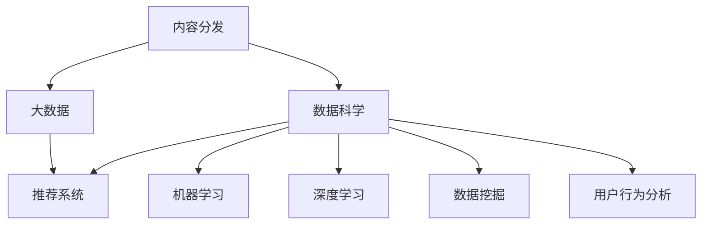

                 

# 如何进行有效的内容分发

> 关键词：内容分发, 数据科学, 大数据, 推荐系统, 机器学习, 深度学习, 数据挖掘, 用户行为分析

## 1. 背景介绍

### 1.1 问题由来

在互联网时代，内容的分发和推荐变得尤为重要。无论是社交媒体平台，还是电商平台，内容分发的效果直接决定了用户体验和平台流量。然而，传统的内容推荐方式往往基于固定规则和简单的统计模型，难以应对复杂多样的用户需求和不断变化的市场环境。随着数据科学和大数据技术的发展，基于机器学习和深度学习的内容推荐算法开始兴起，能够更加灵活高效地进行内容分发。

### 1.2 问题核心关键点

内容分发算法主要包括以下关键问题：

- 如何根据用户的历史行为和偏好，推荐其感兴趣的内容？
- 如何在海量数据中高效检索，并实时响应用户需求？
- 如何平衡个性化推荐和多样化展示，优化用户体验？
- 如何在保证算法精度的同时，避免数据偏见和隐私问题？
- 如何不断学习和适应用户需求的变化，提升推荐系统的长期效果？

这些问题共同构成了内容分发的核心挑战，需要通过合理的算法设计和数据策略来解决。

## 2. 核心概念与联系

### 2.1 核心概念概述

为了更好地理解内容分发的算法和实践，本节将介绍几个密切相关的核心概念：

- 内容分发(Content Distribution)：通过算法和数据模型，将合适的内容推荐给合适的用户。
- 数据科学(Data Science)：基于数据挖掘、统计分析等技术，从海量数据中提取有价值的信息，为推荐系统提供支撑。
- 大数据(Big Data)：指超过传统数据库处理能力的大规模数据，涉及数据收集、存储、处理和分析等多个环节。
- 推荐系统(Recommender System)：利用机器学习算法，为用户提供个性化的内容推荐。
- 机器学习(Machine Learning)：通过训练模型，使计算机系统具备预测、分类、回归等自动化处理能力。
- 深度学习(Deep Learning)：一种特殊的机器学习方法，使用多层神经网络对复杂非线性关系进行建模。
- 数据挖掘(Data Mining)：从数据中发现隐藏在数据中的规律和知识，为决策提供依据。
- 用户行为分析(User Behavior Analysis)：分析用户行为数据，了解用户需求和兴趣，提升推荐系统的准确性。

这些核心概念之间的逻辑关系可以通过以下Mermaid流程图来展示：



这个流程图展示了几者之间的联系和协同关系：

1. 内容分发依赖于数据科学和推荐系统，通过算法和模型为用户推荐合适内容。
2. 大数据为数据科学提供了数据支撑，使其能够从海量数据中提取有用的信息。
3. 机器学习和深度学习为推荐系统提供了算法基础，使得推荐算法更加精准。
4. 数据挖掘和用户行为分析为推荐系统提供了用户数据的深度洞察，进一步提升推荐效果。

这些概念共同构成了内容分发的技术基础，使其能够高效、精准地进行内容推荐。

## 3. 核心算法原理 & 具体操作步骤

### 3.1 算法原理概述

基于数据科学和推荐系统的内容分发算法，主要基于以下几个核心原理：

- **协同过滤**：通过用户行为数据，找出相似用户并推荐其感兴趣的内容。
- **基于内容的推荐**：分析内容特征，推荐与用户历史兴趣相似的新内容。
- **混合推荐**：综合利用协同过滤和基于内容的推荐，提升推荐效果。
- **深度学习模型**：使用多层神经网络对用户行为和内容特征进行建模，提升推荐准确性。

### 3.2 算法步骤详解

内容分发的核心算法步骤如下：

**Step 1: 数据预处理**

- 收集用户行为数据：包括浏览历史、点击记录、购买行为等。
- 清洗和整合数据：去除噪声和缺失值，标准化数据格式。
- 分治数据集：将数据集分为训练集、验证集和测试集。

**Step 2: 特征工程**

- 提取用户特征：如用户ID、性别、年龄、兴趣等。
- 提取内容特征：如文本关键词、图片元数据、视频标签等。
- 构建用户-内容画像：通过TF-IDF、Word2Vec等方法，将用户和内容特征转换为向量表示。

**Step 3: 模型训练**

- 选择推荐算法：如协同过滤、基于内容、混合推荐等。
- 训练模型：使用训练集数据，优化模型参数。
- 评估模型：在验证集上测试模型性能，调整模型参数。

**Step 4: 推荐系统部署**

- 实时推荐：根据用户当前行为，实时推荐相关内容。
- 动态调整：根据用户反馈和行为变化，动态更新推荐算法。
- 多设备同步：确保跨设备间的推荐内容一致性。

**Step 5: 效果监控和优化**

- 数据监控：实时监测推荐系统的效果，如点击率、转化率等。
- 用户反馈：收集用户对推荐内容的反馈，优化推荐算法。
- A/B测试：对比不同算法和策略的效果，选择最优方案。

### 3.3 算法优缺点

基于数据科学和推荐系统的内容分发算法具有以下优点：

1. **高度个性化**：通过用户行为数据和内容特征，能够提供高度个性化的推荐内容。
2. **动态更新**：能够根据用户行为变化和市场趋势，动态调整推荐策略，适应不断变化的需求。
3. **可解释性**：通过特征工程和算法选择，能够对推荐过程进行解释和优化，提高算法透明度。

同时，该算法也存在以下局限性：

1. **数据依赖**：算法效果很大程度上依赖于数据质量和多样性，获取高质量数据成本较高。
2. **隐私问题**：用户行为数据涉及隐私问题，如何保护用户隐私成为重要挑战。
3. **数据偏差**：数据中可能存在的偏差会影响推荐效果，需要进行数据清洗和预处理。
4. **算法复杂**：部分算法（如深度学习）需要较强的计算资源，推广应用成本较高。

尽管存在这些局限性，但就目前而言，基于数据科学和推荐系统的算法仍是目前内容分发的主流范式。未来相关研究的重点在于如何进一步降低数据获取成本，提高推荐系统的鲁棒性和可解释性，同时兼顾隐私保护和算法效率。

### 3.4 算法应用领域

基于数据科学和推荐系统的算法在内容分发领域已经得到了广泛的应用，覆盖了以下多个方面：

- **社交媒体推荐**：如Facebook、Twitter等平台，推荐用户感兴趣的内容。
- **电子商务推荐**：如Amazon、淘宝等电商网站，推荐商品和优惠信息。
- **新闻媒体推荐**：如Netflix、Spotify等媒体平台，推荐影视、音乐等内容。
- **广告推荐**：如Google Ads、Facebook Ads等广告系统，推荐精准广告。
- **视频推荐**：如YouTube、Bilibili等视频平台，推荐视频内容。

除了上述这些经典应用外，推荐算法还被创新性地应用到更多场景中，如个性化旅游推荐、智能医疗推荐、个性化阅读推荐等，为不同行业带来了新的变革和创新。随着推荐系统的不断演进，相信内容分发技术将在更广泛的领域发挥重要作用。

## 4. 数学模型和公式 & 详细讲解 & 举例说明

### 4.1 数学模型构建

本节将使用数学语言对基于数据科学和推荐系统的内容分发算法进行更加严格的刻画。

假设用户集合为 $U=\{u_1, u_2, ..., u_m\}$，内容集合为 $I=\{i_1, i_2, ..., i_n\}$，用户对内容的评分矩阵为 $R_{mi}$。定义用户 $u$ 对内容 $i$ 的评分函数为 $f(u, i)$。

推荐系统的主要目标是最小化预测评分和实际评分之间的误差，即：

$$
\min_{f} \frac{1}{N} \sum_{(u,i) \in D} (r_{ui} - f(u,i))^2
$$

其中 $D$ 为用户-内容评分数据集，$N$ 为样本数量。

### 4.2 公式推导过程

以下是基于协同过滤的推荐算法的详细推导过程。

假设推荐系统已经收集了用户 $u$ 对内容 $i$ 的评分数据 $R_{ui}$。对于新用户 $u'$ 和内容 $i'$，需要预测其评分 $f(u', i')$。根据协同过滤算法，可以利用相似用户的评分数据进行预测。

设用户 $u$ 和 $u'$ 的相似度为 $s(u, u')$，内容 $i$ 和 $i'$ 的相似度为 $s(i, i')$。对于新用户 $u'$ 对内容 $i'$ 的评分预测公式为：

$$
f(u', i') = \sum_{i \in I} s(i, i') \sum_{u \in U} s(u, u') r_{ui}
$$

其中 $s(u, u')$ 和 $s(i, i')$ 可以通过余弦相似度、皮尔逊相关系数等方法计算。

这个公式展示了协同过滤算法的核心思想：通过相似用户和内容的评分数据，预测新用户对新内容的评分。

### 4.3 案例分析与讲解

**案例分析：Netflix推荐系统**

Netflix推荐系统是协同过滤算法的典型应用。Netflix每天产生数百万用户-内容评分数据，通过这些数据，推荐系统能够准确预测用户对新内容的评分。Netflix在用户行为分析上投入巨大，结合多种特征（如用户年龄、性别、观看历史、评分等），构建了高度个性化的推荐系统。

Netflix推荐系统的核心算法步骤如下：

1. **数据预处理**：收集用户行为数据，包括观影记录、评分记录、浏览历史等。
2. **特征工程**：提取用户特征（如年龄、性别、地理位置）和内容特征（如电影类别、演员、导演等）。
3. **模型训练**：使用协同过滤算法（如基于矩阵分解的方法），训练推荐模型。
4. **实时推荐**：根据用户当前行为和历史记录，实时推荐电影、剧集等内容。
5. **效果监控和优化**：监测推荐系统效果，收集用户反馈，动态调整推荐策略。

Netflix推荐系统通过高度个性化的推荐，显著提升了用户观看体验和平台黏性。Netflix的成功，展示了协同过滤算法在内容分发上的强大能力。

## 5. 项目实践：代码实例和详细解释说明

### 5.1 开发环境搭建

在进行推荐系统开发前，我们需要准备好开发环境。以下是使用Python进行Scikit-Learn和TensorFlow开发的环境配置流程：

1. 安装Anaconda：从官网下载并安装Anaconda，用于创建独立的Python环境。

2. 创建并激活虚拟环境：
```bash
conda create -n recsys python=3.8 
conda activate recsys
```

3. 安装Scikit-Learn和TensorFlow：根据CUDA版本，从官网获取对应的安装命令。例如：
```bash
conda install scikit-learn tensorflow -c conda-forge -c pytorch
```

4. 安装TensorBoard：
```bash
pip install tensorboard
```

5. 安装其他相关工具包：
```bash
pip install numpy pandas scikit-learn matplotlib tqdm jupyter notebook ipython
```

完成上述步骤后，即可在`recsys`环境中开始推荐系统开发。

### 5.2 源代码详细实现

下面我们以协同过滤算法为例，给出使用Scikit-Learn和TensorFlow进行内容推荐的PyTorch代码实现。

首先，定义协同过滤算法的核心组件：

```python
from sklearn.metrics.pairwise import cosine_similarity
from sklearn.decomposition import TruncatedSVD
import numpy as np

# 数据预处理
def preprocess_data(R):
    R_mean = R.mean(axis=1)  # 对用户评分数据求均值
    R_mean[R_mean == 0] = 1  # 处理均值为0的评分
    R_norm = np.sqrt(R ** 2 + R_mean ** 2)  # 标准化评分数据
    R_scaled = (R - R_mean) / R_norm  # 标准化后的评分数据
    return R_scaled

# 协同过滤算法
class CollaborativeFiltering:
    def __init__(self, n_factors=10, n_epochs=100, learning_rate=0.01):
        self.n_factors = n_factors
        self.n_epochs = n_epochs
        self.learning_rate = learning_rate
        
    def train(self, R):
        R_scaled = preprocess_data(R)
        n_users, n_items = R_scaled.shape
        
        # 初始化用户向量
        user_embeddings = np.random.rand(n_users, self.n_factors)
        
        # 初始化物品向量
        item_embeddings = np.random.rand(n_items, self.n_factors)
        
        for epoch in range(self.n_epochs):
            for i in range(n_items):
                for j in range(n_users):
                    # 计算预测评分
                    pred = np.dot(user_embeddings[j], item_embeddings[i])
                    # 更新用户向量
                    user_embeddings[j] += self.learning_rate * (R_scaled[j, i] - pred) * item_embeddings[i]
                    # 更新物品向量
                    item_embeddings[i] += self.learning_rate * (R_scaled[j, i] - pred) * user_embeddings[j]
        
        return user_embeddings, item_embeddings

# 测试推荐系统
def test_model(user_embeddings, item_embeddings, R):
    R_scaled = preprocess_data(R)
    n_users, n_items = R_scaled.shape
    
    # 预测评分
    scores = np.dot(user_embeddings, item_embeddings.T)
    # 排序并输出前10个推荐结果
    idx = np.argsort(scores, axis=1)[::-1]
    return idx

# 评估推荐系统
def evaluate_model(R, predictions):
    R_mean = R.mean(axis=1)
    R_pred = predictions.mean(axis=1)
    print("Mean Absolute Error:", np.mean(np.abs(R_pred - R_mean)))
```

然后，定义数据集和测试函数：

```python
# 定义数据集
R = np.array([[5, 3, 0, 0],
              [0, 0, 1, 5],
              [3, 0, 2, 0],
              [0, 0, 0, 3]])
R_test = np.array([[0, 1, 2, 0],
                   [0, 0, 0, 1]])

# 定义测试函数
def test CollaborativeFiltering():
    model = CollaborativeFiltering(n_epochs=1000)
    user_embeddings, item_embeddings = model.train(R)
    print("Recommendations for user 1:")
    print(test_model(user_embeddings, item_embeddings, R_test))

test CollaborativeFiltering()
```

以上就是使用Scikit-Learn和TensorFlow进行协同过滤算法推荐系统的代码实现。可以看到，通过Scikit-Learn和TensorFlow，我们可以很方便地实现协同过滤算法，并快速进行模型训练和测试。

### 5.3 代码解读与分析

让我们再详细解读一下关键代码的实现细节：

**preprocess_data函数**：
- 对用户评分数据进行标准化处理，防止均值为0的评分和异常值的影响。

**CollaborativeFiltering类**：
- 定义协同过滤算法的参数，如因子数、迭代次数、学习率等。
- 训练模型：使用矩阵分解的方法，对用户和物品的嵌入进行优化。

**test_model函数**：
- 根据训练好的用户和物品嵌入，计算预测评分，并排序推荐前N个内容。

**evaluate_model函数**：
- 计算预测评分与实际评分之间的绝对误差，评估推荐系统的性能。

通过这些函数，我们可以实现一个基本的协同过滤推荐系统。开发者可以根据具体任务的需求，对函数进行扩展和优化。

## 6. 实际应用场景

### 6.1 社交媒体推荐

社交媒体平台如Facebook、Twitter等，每天都会产生大量用户互动数据，这些数据蕴含了丰富的用户兴趣和行为信息。通过推荐系统，可以为用户提供个性化的内容推荐，增强平台黏性和用户体验。

在技术实现上，可以收集用户点赞、分享、评论等互动数据，构建用户行为模型。利用协同过滤算法，推荐用户可能感兴趣的内容，如文章、图片、视频等。同时，可以引入深度学习技术，提高推荐系统的精准度和个性化水平。

### 6.2 电子商务推荐

电子商务平台如Amazon、淘宝等，需要为用户推荐个性化商品。通过推荐系统，可以提高商品曝光率和转化率，提升用户购物体验。

在技术实现上，可以收集用户浏览、点击、购买记录等数据，构建用户行为特征。利用基于内容的推荐算法，根据商品属性和用户兴趣，推荐相关商品。同时，可以引入协同过滤算法，推荐与用户行为相似的其他商品。

### 6.3 新闻媒体推荐

新闻媒体平台如Netflix、Spotify等，需要为用户推荐个性化内容。通过推荐系统，可以为用户提供高质量的影视、音乐等娱乐内容，提升平台吸引力和用户满意度。

在技术实现上，可以收集用户观看、收听记录等数据，构建用户行为模型。利用深度学习技术，预测用户对不同内容的兴趣，推荐相关内容。同时，可以引入协同过滤算法，推荐与用户行为相似的其他内容。

### 6.4 未来应用展望

随着推荐系统的不断演进，内容分发技术将在更多领域得到应用，为各行业带来新的突破。

在智慧医疗领域，推荐系统可以用于病患推荐、药品推荐、诊疗方案推荐等，提升医疗服务的智能化水平，辅助医生诊疗，加速新药开发进程。

在智能教育领域，推荐系统可以用于个性化作业推荐、学情分析、知识推荐等，因材施教，促进教育公平，提高教学质量。

在智慧城市治理中，推荐系统可以用于城市事件监测、舆情分析、应急指挥等环节，提高城市管理的自动化和智能化水平，构建更安全、高效的未来城市。

此外，在企业生产、社会治理、文娱传媒等众多领域，推荐技术也将不断涌现，为传统行业数字化转型升级提供新的技术路径。相信随着技术的日益成熟，推荐系统将成为人工智能落地应用的重要手段，推动人工智能技术在垂直行业的规模化落地。

## 7. 工具和资源推荐

### 7.1 学习资源推荐

为了帮助开发者系统掌握内容分发的技术基础和实践技巧，这里推荐一些优质的学习资源：

1. 《推荐系统实践》系列博文：由大模型技术专家撰写，深入浅出地介绍了推荐系统的基本概念和经典算法。

2. CS229《机器学习》课程：斯坦福大学开设的经典课程，涵盖了机器学习的基本理论和技术，是推荐系统的理论基础。

3. 《机器学习实战》书籍：亚马逊畅销书，介绍了多种推荐算法和实用案例，适合实践者快速上手。

4. Kaggle推荐系统竞赛：通过参加比赛，可以学习多种推荐算法，提升实战能力。

5. Jupyter Notebook：Python交互式开发工具，适合进行快速原型开发和数据分析。

通过对这些资源的学习实践，相信你一定能够快速掌握内容分发的精髓，并用于解决实际的推荐问题。

### 7.2 开发工具推荐

高效的开发离不开优秀的工具支持。以下是几款用于内容分发推荐的常用工具：

1. Scikit-Learn：基于Python的机器学习库，提供了多种推荐算法实现。

2. TensorFlow：由Google主导开发的深度学习框架，支持分布式训练和模型部署。

3. Keras：高层次的深度学习库，简化了深度学习模型的构建和训练过程。

4. Hadoop/Spark：大数据处理平台，支持大规模数据处理和分析。

5. Apache Kafka：分布式消息队列，支持实时数据流处理和推荐系统部署。

6. Elasticsearch：分布式搜索和分析引擎，支持实时查询和推荐系统优化。

合理利用这些工具，可以显著提升内容分发推荐的开发效率，加快创新迭代的步伐。

### 7.3 相关论文推荐

内容分发推荐技术的发展源于学界的持续研究。以下是几篇奠基性的相关论文，推荐阅读：

1. Recommender Systems Handbook：推荐系统权威手册，介绍了多种推荐算法和应用案例。

2. Collaborative Filtering for Implicit Feedback Datasets：介绍协同过滤算法的经典论文。

3. Beyond Matrix Factorization: A Canonical Tensor Factorization Framework for Recommendations：提出基于张量分解的推荐算法。

4. Deep Learning Recommendation Systems：综述深度学习在推荐系统中的应用。

5. Real-Time User Behavior Prediction：提出基于LSTM的时间序列推荐算法。

这些论文代表了大规模内容分发推荐技术的发展脉络。通过学习这些前沿成果，可以帮助研究者把握学科前进方向，激发更多的创新灵感。

## 8. 总结：未来发展趋势与挑战

### 8.1 总结

本文对基于数据科学和推荐系统的内容分发算法进行了全面系统的介绍。首先阐述了内容分发算法的核心原理和实现流程，明确了推荐系统在提升用户体验和平台流量方面的独特价值。其次，从原理到实践，详细讲解了协同过滤、基于内容、深度学习等推荐算法的数学模型和实现细节，给出了推荐系统开发的完整代码实例。同时，本文还广泛探讨了推荐系统在社交媒体、电子商务、新闻媒体等多个行业领域的应用前景，展示了推荐系统的强大潜力。此外，本文精选了推荐系统的各类学习资源，力求为读者提供全方位的技术指引。

通过本文的系统梳理，可以看到，基于数据科学和推荐系统的算法正在成为内容分发的核心技术，极大地提升了推荐系统的个性化和精准性，为各行业的数字化转型提供了新的技术路径。未来，伴随推荐系统的不断演进，内容分发技术将在更广泛的领域发挥重要作用，推动人工智能技术在垂直行业的规模化落地。

### 8.2 未来发展趋势

展望未来，内容分发推荐技术将呈现以下几个发展趋势：

1. **深度学习模型**：随着深度学习技术的不断进步，推荐系统将更加精准、个性化。
2. **多模态数据融合**：结合用户行为数据和多种类型的内容数据，提升推荐系统的鲁棒性和普适性。
3. **实时推荐**：通过大数据处理和流计算技术，实现实时推荐，提升用户体验。
4. **可解释性增强**：引入可解释性技术，使推荐系统具备更高的透明性和可信度。
5. **公平性和多样性**：优化推荐算法，避免数据偏见和算法歧视，实现公平和多样化的内容推荐。
6. **自适应推荐**：根据用户反馈和行为变化，动态调整推荐策略，提升推荐系统的长期效果。

以上趋势凸显了内容分发推荐技术的广阔前景。这些方向的探索发展，必将进一步提升推荐系统的性能和应用范围，为传统行业带来变革性影响。

### 8.3 面临的挑战

尽管推荐系统已经取得了瞩目成就，但在迈向更加智能化、普适化应用的过程中，它仍面临着诸多挑战：

1. **数据质量**：推荐系统的效果很大程度上依赖于数据质量和多样性，如何获取高质量数据成为重要挑战。
2. **隐私保护**：用户行为数据涉及隐私问题，如何保护用户隐私成为重要挑战。
3. **算法复杂性**：部分算法（如深度学习）需要较强的计算资源，推广应用成本较高。
4. **算法鲁棒性**：推荐系统面对噪声和异常数据时，泛化性能往往大打折扣。
5. **可解释性**：推荐系统的决策过程缺乏可解释性，难以对其推理逻辑进行分析和调试。

尽管存在这些挑战，但就目前而言，基于数据科学和推荐系统的算法仍是目前内容分发的主流范式。未来相关研究的重点在于如何进一步降低数据获取成本，提高推荐系统的鲁棒性和可解释性，同时兼顾隐私保护和算法效率。

### 8.4 研究展望

面对推荐系统面临的种种挑战，未来的研究需要在以下几个方面寻求新的突破：

1. **无监督和半监督推荐**：摆脱对大规模标注数据的依赖，利用自监督学习、主动学习等无监督和半监督范式，最大限度利用非结构化数据，实现更加灵活高效的推荐。
2. **深度学习模型的改进**：开发更加参数高效和计算高效的深度学习推荐模型，在保证精度的情况下，减少计算资源消耗。
3. **多模态数据融合**：结合视觉、语音、文本等多种类型的数据，实现多模态内容推荐，提升推荐系统的鲁棒性和普适性。
4. **可解释性和公平性**：引入可解释性技术和公平性评估指标，使推荐系统具备更高的透明性和可信度，避免数据偏见和算法歧视。
5. **自适应推荐**：根据用户反馈和行为变化，动态调整推荐策略，提升推荐系统的长期效果，实现自适应推荐。

这些研究方向的探索，必将引领内容分发推荐技术迈向更高的台阶，为构建安全、可靠、可解释、可控的推荐系统铺平道路。面向未来，内容分发推荐技术还需要与其他人工智能技术进行更深入的融合，如知识表示、因果推理、强化学习等，多路径协同发力，共同推动推荐系统的进步。只有勇于创新、敢于突破，才能不断拓展推荐系统的边界，让内容分发技术更好地造福人类社会。

## 9. 附录：常见问题与解答

**Q1：推荐系统是否适用于所有应用场景？**

A: 推荐系统在大部分应用场景上都能取得不错的效果，特别是对于数据量较大的场景。但对于一些特定领域的场景，如医学、法律等，推荐系统的效果可能不如传统推荐方式。此时需要在特定领域内进行针对性优化，如引入领域知识、优化数据模型等。

**Q2：推荐系统如何平衡个性化和多样性？**

A: 推荐系统可以通过以下几个方法平衡个性化和多样性：
1. 多臂老虎机算法：将推荐系统视为多臂老虎机，平衡个性化推荐和多样化展示。
2. 协同过滤算法：通过相似用户和内容的评分数据，推荐多样化内容。
3. 随机推荐算法：在推荐时加入随机因素，提升多样性。

这些方法往往需要根据具体应用场景进行灵活组合。只有在数据、算法、模型、业务等多个维度进行全面优化，才能最大限度地平衡个性化和多样性。

**Q3：推荐系统如何处理用户行为数据？**

A: 推荐系统通常需要收集用户的各种行为数据，如浏览记录、点击记录、购买记录等。在处理这些数据时，需要注意以下几个方面：
1. 数据清洗：去除噪声和异常值，标准化数据格式。
2. 特征工程：提取用户和内容的特征，构建用户行为模型。
3. 数据预处理：对数据进行归一化、降维等处理，提高模型效果。
4. 模型训练：选择合适的推荐算法，优化模型参数。
5. 效果评估：在测试集上评估推荐系统的性能，进行持续优化。

通过这些步骤，推荐系统可以有效地利用用户行为数据，提供精准的内容推荐。

**Q4：推荐系统如何避免数据偏见？**

A: 推荐系统需要在数据收集和模型训练过程中，避免数据偏见。具体方法包括：
1. 数据采集：确保数据采集的全面性和代表性，避免数据集中化和偏差。
2. 数据清洗：识别并处理数据中的偏见和歧视，如去除不公正评分、处理性别偏见等。
3. 模型选择：选择无偏见的推荐算法，如 fairness-aware ranking等。
4. 公平性评估：在模型训练过程中，引入公平性评估指标，优化模型效果。

通过这些方法，推荐系统可以最大限度地避免数据偏见，提高推荐系统的公平性和可信度。

---

作者：禅与计算机程序设计艺术 / Zen and the Art of Computer Programming

