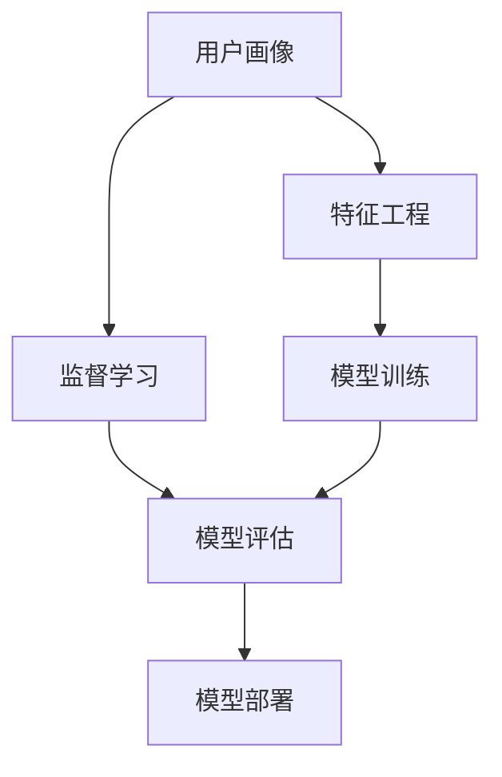

                 

# 如何进行有效的用户画像更新

## 1. 背景介绍

### 1.1 问题由来
在数字化时代，用户画像成为企业洞察用户需求、优化产品和服务、提升用户体验的关键工具。传统的用户画像往往基于问卷调查、行为数据、社交网络等手段获取用户特征信息，然后进行特征提取和分类，建立用户模型。然而，这种方法存在诸多局限性：

1. 数据质量参差不齐：问卷调查的可靠性和有效性依赖于问卷设计和样本代表性；行为数据易受隐私政策限制，获取难度大；社交网络数据易被操纵，真实性难以验证。
2. 画像模型缺乏动态性：用户画像一旦建立，难以根据新数据及时更新，无法反映用户行为和偏好的变化。
3. 数据更新频率较低：频繁更新用户画像涉及大量的数据处理和模型训练，耗时耗力。

为克服这些局限性，利用机器学习和深度学习技术，能够实时更新用户画像，使其更精准、动态、高效。这不仅能够提升企业对用户的理解深度，还能驱动产品和服务创新，实现更精准的市场定位和个性化推荐。

### 1.2 问题核心关键点
本文将探讨如何利用机器学习和深度学习技术，构建实时更新的用户画像，并重点讨论基于监督学习的用户画像更新方法。

## 2. 核心概念与联系

### 2.1 核心概念概述

为更好地理解基于监督学习的用户画像更新方法，本节将介绍几个密切相关的核心概念：

- 用户画像(User Profile)：用于描述用户特征、行为、兴趣等信息的模型，通常包含用户的静态属性和动态行为。
- 监督学习(Supervised Learning)：利用标注数据，训练模型学习输入和输出之间的映射关系。常见的监督学习算法包括回归、分类、序列预测等。
- 特征工程(Feature Engineering)：对原始数据进行预处理、转换、组合等操作，提取更有意义、更有预测性的特征。
- 模型训练(Training)：使用训练数据集对模型进行迭代训练，优化模型参数以最小化预测误差。
- 模型评估(Evaluation)：使用测试数据集评估模型预测性能，衡量模型的准确性、召回率、F1分数等指标。
- 模型部署(Deployment)：将训练好的模型应用到实际场景中，进行实时预测和更新。

这些核心概念之间的逻辑关系可以通过以下Mermaid流程图来展示：



这个流程图展示了这个过程的主要步骤：

1. 用户画像通过特征工程转化为适合模型训练的特征。
2. 监督学习模型基于标注数据学习用户画像与行为之间的映射关系。
3. 模型训练通过迭代优化模型参数，提高预测准确性。
4. 模型评估通过测试数据集评估模型性能。
5. 模型部署将训练好的模型应用到实际场景中，实现实时更新。

## 3. 核心算法原理 & 具体操作步骤

### 3.1 算法原理概述

基于监督学习的用户画像更新方法，本质上是利用历史用户数据和行为，训练一个预测模型，预测用户未来的行为或特征。其主要流程包括：

1. 特征工程：将原始用户数据转化为适合模型训练的特征向量。
2. 模型训练：使用标注数据训练监督学习模型，如随机森林、支持向量机、神经网络等。
3. 模型评估：通过测试数据集评估模型性能，选择最优模型。
4. 模型部署：将训练好的模型应用到实际场景中，实时更新用户画像。

### 3.2 算法步骤详解

**Step 1: 特征工程**

- 收集用户数据：包括用户基本信息、行为数据、社交网络数据等。
- 数据清洗：去除重复、缺失、异常数据，确保数据质量。
- 特征提取：从原始数据中提取有意义、可预测的特征，如年龄、性别、地域、购买频率、点击行为等。
- 特征转换：对特征进行归一化、编码等处理，便于模型训练。

**Step 2: 模型训练**

- 数据划分：将数据集划分为训练集、验证集和测试集，一般比例为7:2:1。
- 选择模型：根据问题类型选择合适的监督学习模型，如线性回归、逻辑回归、决策树、随机森林、支持向量机、神经网络等。
- 训练模型：使用训练集训练模型，优化模型参数。
- 验证模型：使用验证集评估模型性能，调整模型超参数，防止过拟合。

**Step 3: 模型评估**

- 评估指标：根据具体问题，选择合适的评估指标，如均方误差、准确率、召回率、F1分数等。
- 测试模型：使用测试集评估模型性能，确认模型是否过拟合。
- 选择最优模型：选择表现最优的模型，作为最终用户画像更新的模型。

**Step 4: 模型部署**

- 模型集成：将训练好的模型部署到实际应用场景中，如CRM系统、推荐系统、营销系统等。
- 实时更新：根据新数据实时更新用户画像，保证用户画像的时效性。
- 模型监控：监控模型性能和预测准确性，确保模型在实际应用中的稳定性。

### 3.3 算法优缺点

基于监督学习的用户画像更新方法具有以下优点：

1. 精确度较高：通过标注数据训练的模型，能够对用户行为和特征进行精准预测。
2. 泛化能力强：利用监督学习模型，能够处理复杂的非线性关系，适用于多种场景。
3. 可解释性强：模型训练过程可解释，便于理解模型决策过程。

同时，该方法也存在一定的局限性：

1. 依赖标注数据：需要大量标注数据训练模型，标注成本较高。
2. 数据隐私问题：标注数据可能涉及用户隐私，隐私保护需要严格把控。
3. 模型复杂度高：模型训练需要大量计算资源和时间，部署复杂。
4. 动态性不足：模型更新频率较低，难以实时反映用户行为变化。

尽管存在这些局限性，但就目前而言，基于监督学习的用户画像更新方法仍是最主流、最有效的方式。未来相关研究的重点在于如何进一步降低标注数据的依赖，提高模型的动态性，同时兼顾隐私保护和可解释性等因素。

### 3.4 算法应用领域

基于监督学习用户画像更新方法，在市场营销、电子商务、金融风控、医疗健康等领域广泛应用，取得了显著的效果：

- 市场营销：通过用户画像，精准定位目标客户，提升广告投放效果和客户转化率。
- 电子商务：根据用户画像，个性化推荐商品，提升用户体验和销售额。
- 金融风控：利用用户画像，识别高风险用户，防范金融风险。
- 医疗健康：基于用户画像，提供个性化健康服务，提升诊疗效率。

除了这些经典应用外，用户画像更新技术还被创新性地应用到更多场景中，如智能客服、智能家居、智能制造等，为各行各业带来了新的活力和机遇。

## 4. 数学模型和公式 & 详细讲解 & 举例说明

### 4.1 数学模型构建

基于监督学习用户画像更新方法的核心思想是利用历史数据训练一个预测模型，然后根据新数据实时更新用户画像。假设用户画像包含n个特征$X=(X_1,X_2,...,X_n)$，对应的行为标签为$Y$，则监督学习模型$M$的目标是最小化预测误差$L$，即：

$$
\min_{M} L = \frac{1}{N}\sum_{i=1}^N (M(X_i) - Y_i)^2
$$

其中$N$为样本数量，$M(X_i)$为模型对样本$X_i$的预测值，$Y_i$为样本$X_i$的真实标签。

### 4.2 公式推导过程

以线性回归为例，假设模型$M$为线性回归模型，其形式为：

$$
M(X) = \theta_0 + \theta_1X_1 + \theta_2X_2 + ... + \theta_nX_n
$$

则预测误差$L$可以表示为：

$$
L = \frac{1}{N}\sum_{i=1}^N (M(X_i) - Y_i)^2 = \frac{1}{N}\sum_{i=1}^N (\theta_0 + \theta_1X_{i1} + \theta_2X_{i2} + ... + \theta_nX_{in} - Y_i)^2
$$

为了最小化$L$，需要求解$\theta_0,\theta_1,...,\theta_n$。根据最小二乘法，求解上述目标函数，可得：

$$
\theta_j = \frac{1}{N}\sum_{i=1}^N (X_{ij} - \bar{X}_j)(Y_i - \bar{Y})
$$

其中$\bar{X}_j$和$\bar{Y}$分别为特征$X_j$和标签$Y$的均值。

### 4.3 案例分析与讲解

假设某电商平台需要根据用户历史购买行为，预测其未来是否会购买某商品。首先将用户历史购买行为数据进行特征工程，提取年龄、性别、地域、购买频率、商品类别等特征。然后使用随机森林模型对这些特征进行训练，选择表现最优的模型，并在测试集上验证其预测性能。最后，将训练好的模型部署到推荐系统中，根据用户实时行为数据实时更新用户画像，预测其是否会购买目标商品。

## 5. 项目实践：代码实例和详细解释说明

### 5.1 开发环境搭建

在进行用户画像更新实践前，我们需要准备好开发环境。以下是使用Python进行PyTorch开发的环境配置流程：

1. 安装Anaconda：从官网下载并安装Anaconda，用于创建独立的Python环境。

2. 创建并激活虚拟环境：
```bash
conda create -n user_profile_env python=3.8 
conda activate user_profile_env
```

3. 安装PyTorch：根据CUDA版本，从官网获取对应的安装命令。例如：
```bash
conda install pytorch torchvision torchaudio cudatoolkit=11.1 -c pytorch -c conda-forge
```

4. 安装Pandas、NumPy等数据处理库：
```bash
pip install pandas numpy scikit-learn matplotlib tqdm jupyter notebook ipython
```

5. 安装相关库：
```bash
pip install catboost lightgbm scikit-learn
```

完成上述步骤后，即可在`user_profile_env`环境中开始用户画像更新的实践。

### 5.2 源代码详细实现

这里我们以用户购买预测为例，给出使用LightGBM库对用户画像进行监督学习的PyTorch代码实现。

首先，定义用户数据处理函数：

```python
import pandas as pd
import numpy as np
from sklearn.model_selection import train_test_split

def load_data(file_path):
    data = pd.read_csv(file_path)
    return data

def preprocess_data(data):
    # 数据清洗
    data = data.drop_duplicates()
    data = data.dropna()
    
    # 特征提取
    features = data[['age', 'gender', 'location', 'purchase_frequency', 'category']]
    labels = data['purchase']
    
    # 数据转换
    features = pd.get_dummies(features, drop_first=True)
    
    return features, labels

# 加载数据
data = load_data('user_profile.csv')
features, labels = preprocess_data(data)

# 数据划分
features_train, features_test, labels_train, labels_test = train_test_split(features, labels, test_size=0.2, random_state=42)
```

然后，定义模型训练函数：

```python
from lightgbm import LGBMClassifier
from sklearn.metrics import accuracy_score

def train_model(features_train, labels_train):
    model = LGBMClassifier()
    model.fit(features_train, labels_train)
    return model

# 训练模型
model = train_model(features_train, labels_train)
```

接着，定义模型评估函数：

```python
def evaluate_model(model, features_test, labels_test):
    y_pred = model.predict(features_test)
    accuracy = accuracy_score(labels_test, y_pred)
    return accuracy

# 评估模型
accuracy = evaluate_model(model, features_test, labels_test)
print(f'Accuracy: {accuracy:.2f}')
```

最后，启动训练流程并在测试集上评估：

```python
# 模型部署
model = train_model(features_train, labels_train)

# 实时更新用户画像
while True:
    # 获取新数据
    new_data = load_data('new_user_profile.csv')
    features, labels = preprocess_data(new_data)
    
    # 实时更新用户画像
    y_pred = model.predict(features)
    
    # 输出结果
    print(y_pred)
```

以上就是使用PyTorch对用户画像进行监督学习的完整代码实现。可以看到，得益于Pandas、LightGBM等库的强大封装，我们可以用相对简洁的代码完成用户画像的训练和实时更新。

### 5.3 代码解读与分析

让我们再详细解读一下关键代码的实现细节：

**load_data函数**：
- 从指定路径加载数据，返回Pandas数据框。

**preprocess_data函数**：
- 对数据进行清洗，去除重复和缺失数据。
- 提取特征，选择年龄、性别、地域、购买频率、商品类别等。
- 对特征进行编码，避免类别特征之间的共线性。

**train_model函数**：
- 使用LightGBM模型对训练数据进行训练，返回训练好的模型。

**evaluate_model函数**：
- 使用测试数据评估模型性能，输出准确率。

**while循环**：
- 持续获取新数据，实时更新用户画像。

可以看到，PyTorch配合LightGBM等库使得用户画像的监督学习代码实现变得简洁高效。开发者可以将更多精力放在数据处理、模型改进等高层逻辑上，而不必过多关注底层的实现细节。

当然，工业级的系统实现还需考虑更多因素，如模型的保存和部署、超参数的自动搜索、更灵活的特征工程等。但核心的监督学习过程基本与此类似。

## 6. 实际应用场景

### 6.1 市场营销

基于用户画像的监督学习方法，在市场营销领域有广泛的应用。企业可以通过分析用户画像，精准定位目标客户，实现个性化营销和精准广告投放，提升营销效果和客户转化率。

例如，某电商企业通过分析用户购买行为，构建用户画像模型，并根据模型预测用户是否会购买某商品。根据预测结果，针对高潜在购买用户进行个性化推荐和促销，大幅提升销售额。

### 6.2 金融风控

金融行业面临的信用风险较高，利用用户画像的监督学习方法，可以识别高风险用户，有效防范金融风险。

例如，某银行通过分析用户历史贷款行为，构建用户画像模型，并根据模型预测用户是否会按时还款。根据预测结果，对高风险用户进行信贷限制，降低坏账率，保障银行资金安全。

### 6.3 医疗健康

在医疗领域，用户画像的监督学习方法可以提升诊疗效率和医疗服务质量。

例如，某医院通过分析患者历史诊疗记录，构建用户画像模型，并根据模型预测患者是否会进行复查或住院。根据预测结果，提前安排医生和资源，提升诊疗效率，降低患者等待时间。

### 6.4 未来应用展望

随着监督学习方法的不断演进，基于用户画像的个性化推荐和风险预测将迎来更大的发展机遇。未来，用户画像更新技术将在更多领域得到应用，为各行各业带来新的价值和变革：

- 智能客服：通过分析用户历史行为，构建用户画像，实现个性化对话，提升客户体验和满意度。
- 智能制造：通过分析员工操作数据，构建用户画像，实现智能排班和生产调度，提升生产效率。
- 智慧城市：通过分析市民行为数据，构建用户画像，实现智能交通和资源分配，提升城市管理水平。
- 社会治理：通过分析公众行为数据，构建用户画像，实现智能监控和舆情分析，提升社会治理能力。

总之，用户画像更新技术将在各个领域发挥越来越重要的作用，为社会创造更多的价值和效益。相信随着技术的不断进步和应用的不断深入，基于监督学习的方法将在大数据时代迎来更加广阔的应用前景。

## 7. 工具和资源推荐

### 7.1 学习资源推荐

为了帮助开发者系统掌握用户画像的监督学习理论基础和实践技巧，这里推荐一些优质的学习资源：

1. 《Python数据科学手册》系列博文：由数据科学专家撰写，详细介绍了数据处理、特征工程、监督学习等基本概念和经典模型。

2. Kaggle Machine Learning教程：Kaggle平台的机器学习教程，涵盖大量经典案例和实战练习，是入门机器学习的绝佳资源。

3. Coursera《机器学习》课程：由斯坦福大学开设的机器学习课程，系统介绍了机器学习的基本概念和算法，并包含大量案例和项目练习。

4. 《深度学习》书籍：Ian Goodfellow等著作的深度学习经典教材，系统介绍了深度学习的基本原理和应用，包括监督学习、无监督学习等。

5. 《Hands-On Machine Learning with Scikit-Learn, Keras, and TensorFlow》书籍：Aurélien Géron著作的经典深度学习教材，详细介绍了Scikit-Learn、Keras、TensorFlow等常用机器学习库的用法，并包含大量实战案例。

通过这些资源的学习实践，相信你一定能够快速掌握用户画像的监督学习方法和技术，并用于解决实际的NLP问题。

### 7.2 开发工具推荐

高效的开发离不开优秀的工具支持。以下是几款用于用户画像监督学习开发的常用工具：

1. PyTorch：基于Python的开源深度学习框架，灵活动态的计算图，适合快速迭代研究。

2. TensorFlow：由Google主导开发的开源深度学习框架，生产部署方便，适合大规模工程应用。

3. LightGBM：由微软开发的梯度提升决策树库，高效快速，支持GPU加速。

4. Scikit-Learn：Python科学计算库，包含大量经典的机器学习算法，简单易用。

5. Weights & Biases：模型训练的实验跟踪工具，可以记录和可视化模型训练过程中的各项指标，方便对比和调优。

6. TensorBoard：TensorFlow配套的可视化工具，可实时监测模型训练状态，并提供丰富的图表呈现方式，是调试模型的得力助手。

合理利用这些工具，可以显著提升用户画像更新的开发效率，加快创新迭代的步伐。

### 7.3 相关论文推荐

用户画像更新技术的发展源于学界的持续研究。以下是几篇奠基性的相关论文，推荐阅读：

1. "The Elements of Statistical Learning"（李航著作的统计学习经典教材，详细介绍了监督学习、非监督学习等基本概念和算法）。

2. "Customer Segmentation Using Multi-Objective Optimization Techniques"（一篇经典的客户细分论文，探讨了如何通过监督学习方法实现客户细分）。

3. "Data Mining and Statistical Learning"（周志华著作的机器学习教材，详细介绍了各种监督学习算法及其应用）。

4. "User Behavior Modeling for Recommender Systems"（一篇关于用户行为建模的论文，探讨了如何通过监督学习方法实现个性化推荐）。

5. "User Profiling for Personalized Recommendation"（一篇关于用户画像的论文，探讨了如何通过监督学习方法构建用户画像）。

这些论文代表了大数据和机器学习在用户画像领域的发展脉络。通过学习这些前沿成果，可以帮助研究者把握学科前进方向，激发更多的创新灵感。

## 8. 总结：未来发展趋势与挑战

### 8.1 总结

本文对基于监督学习的大规模用户画像更新方法进行了全面系统的介绍。首先阐述了用户画像在数字化时代的重要性，明确了监督学习方法在用户画像更新中的独特价值。其次，从原理到实践，详细讲解了监督学习方法的数学原理和关键步骤，给出了用户画像更新的完整代码实例。同时，本文还广泛探讨了用户画像更新在市场营销、金融风控、医疗健康等多个领域的应用前景，展示了监督学习范式的巨大潜力。此外，本文精选了监督学习技术的各类学习资源，力求为读者提供全方位的技术指引。

通过本文的系统梳理，可以看到，基于监督学习的方法能够有效地处理和分析用户数据，构建精准的用户画像，为市场营销、金融风控、医疗健康等领域带来深刻的变革和创新。未来，伴随技术的不断演进和应用的不断深入，用户画像更新方法必将在更广泛的领域发挥更大的作用，为各行各业带来更多的价值和机遇。

### 8.2 未来发展趋势

展望未来，用户画像更新技术将呈现以下几个发展趋势：

1. 模型规模持续增大。随着深度学习和大数据技术的进步，用户画像模型将越来越复杂，能够更好地捕捉用户行为和偏好的细节。
2. 动态性增强。通过在线学习和增量更新，用户画像模型能够实时反映用户行为的变化，保持其时效性和准确性。
3. 多模态融合。将文本、图像、语音等多模态数据整合到用户画像中，提升模型的综合表现和应用范围。
4. 可解释性加强。引入可解释性算法和工具，使用户画像模型更具透明性和可理解性。
5. 隐私保护强化。加强数据隐私保护，确保用户画像的构建和使用符合隐私法律法规，避免数据滥用。
6. 实时计算优化。通过分布式计算和并行计算技术，提升用户画像模型的实时计算能力，支持大规模数据的实时处理。

这些趋势凸显了用户画像更新技术的广阔前景。这些方向的探索发展，将进一步提升用户画像的精度、动态性和应用价值，为各行各业带来更多的机遇和变革。

### 8.3 面临的挑战

尽管基于监督学习的方法在用户画像更新中取得了显著效果，但在迈向更加智能化、普适化应用的过程中，它仍面临诸多挑战：

1. 数据获取和处理难度大。用户数据的获取和处理涉及隐私、数据质量、数据量等多个问题，需要耗费大量时间和资源。
2. 模型复杂度高。用户画像模型需要处理大规模非结构化数据，模型的训练和推理复杂度高，对计算资源和硬件要求较高。
3. 数据隐私问题。用户数据的隐私保护需要严格把控，如何在保护隐私的前提下进行有效的数据建模和分析，是一大难题。
4. 模型泛化能力不足。用户画像模型容易过拟合，难以泛化到未见过的新数据和新用户。
5. 实时更新难度大。实时更新用户画像需要高性能的计算资源和高效的算法支持，技术实现难度较大。

尽管存在这些挑战，但随着技术的不断进步和应用的不断深入，用户画像更新技术必将在更广泛的领域发挥更大的作用，为各行各业带来更多的价值和机遇。相信随着学界和产业界的共同努力，这些挑战终将一一被克服，用户画像更新方法必将在构建人机协同的智能时代中扮演越来越重要的角色。

### 8.4 研究展望

面对用户画像更新技术所面临的种种挑战，未来的研究需要在以下几个方面寻求新的突破：

1. 探索无监督和半监督学习方法。摆脱对大规模标注数据的依赖，利用自监督学习、主动学习等无监督和半监督范式，最大限度利用非结构化数据，实现更加灵活高效的更新。
2. 研究参数高效和计算高效的更新范式。开发更加参数高效的更新方法，在固定大部分用户画像参数的情况下，只更新极少量的任务相关参数。同时优化更新模型的计算图，减少前向传播和反向传播的资源消耗，实现更加轻量级、实时性的部署。
3. 引入更多先验知识。将符号化的先验知识，如知识图谱、逻辑规则等，与神经网络模型进行巧妙融合，引导更新过程学习更准确、合理的用户画像。同时加强不同模态数据的整合，实现视觉、语音等多模态信息与文本信息的协同建模。
4. 结合因果分析和博弈论工具。将因果分析方法引入用户画像更新模型，识别出模型决策的关键特征，增强输出解释的因果性和逻辑性。借助博弈论工具刻画人机交互过程，主动探索并规避模型的脆弱点，提高系统稳定性。
5. 纳入伦理道德约束。在模型训练目标中引入伦理导向的评估指标，过滤和惩罚有偏见、有害的输出倾向。同时加强人工干预和审核，建立模型行为的监管机制，确保输出符合人类价值观和伦理道德。

这些研究方向的探索，必将引领用户画像更新技术迈向更高的台阶，为构建安全、可靠、可解释、可控的智能系统铺平道路。面向未来，用户画像更新技术还需要与其他人工智能技术进行更深入的融合，如知识表示、因果推理、强化学习等，多路径协同发力，共同推动用户画像模型的进步。只有勇于创新、敢于突破，才能不断拓展用户画像的边界，让智能技术更好地造福人类社会。

## 9. 附录：常见问题与解答

**Q1：用户画像更新是否适用于所有业务场景？**

A: 用户画像更新在大多数业务场景中都有广泛的应用，尤其是涉及用户行为和偏好的场景。例如，市场营销、金融风控、医疗健康等。但在一些特定领域，如医疗、法律等，仅依靠用户画像可能无法完全解决问题。此时需要在特定领域语料上进一步预训练，再进行更新，才能获得理想效果。

**Q2：如何选择合适的用户画像更新模型？**

A: 用户画像更新模型的选择应根据具体业务需求和数据特点进行。常见的模型包括线性回归、逻辑回归、决策树、随机森林、梯度提升树、神经网络等。建议先进行模型对比实验，选择表现最优的模型作为最终用户画像更新模型。同时，根据业务需求，选择合适的方法进行特征工程和模型训练，以提升模型的预测准确性和泛化能力。

**Q3：用户画像更新过程中需要注意哪些问题？**

A: 用户画像更新过程中，需要注意以下问题：
1. 数据隐私保护：用户数据可能涉及隐私，需要严格把控数据隐私保护，避免数据滥用。
2. 数据质量问题：原始数据可能存在噪声、缺失、异常等，需要进行数据清洗和处理。
3. 模型过拟合问题：用户画像模型容易过拟合，需要进行正则化处理和交叉验证，防止模型过拟合。
4. 模型泛化能力不足：用户画像模型需要具有较好的泛化能力，以适应新用户和新数据。
5. 实时更新难度大：用户画像模型需要实时更新，需要高性能的计算资源和高效的算法支持。

**Q4：用户画像更新技术在落地部署时需要注意哪些问题？**

A: 用户画像更新技术在落地部署时，需要注意以下问题：
1. 模型裁剪：去除不必要的层和参数，减小模型尺寸，加快推理速度。
2. 量化加速：将浮点模型转为定点模型，压缩存储空间，提高计算效率。
3. 服务化封装：将模型封装为标准化服务接口，便于集成调用。
4. 弹性伸缩：根据请求流量动态调整资源配置，平衡服务质量和成本。
5. 监控告警：实时采集系统指标，设置异常告警阈值，确保服务稳定性。

用户画像更新技术在实际应用中还需要考虑更多因素，如模型的保存和部署、超参数的自动搜索、更灵活的特征工程等。但核心的监督学习过程基本与此类似。

---

作者：禅与计算机程序设计艺术 / Zen and the Art of Computer Programming

