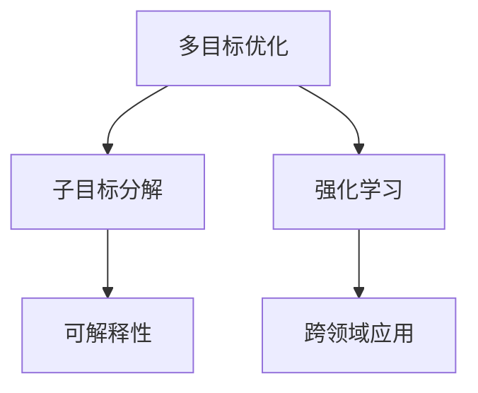

                 

# 子目标分解在 Agent 中的重要性

> 关键词：
> - 多目标优化
> - 子目标分解
> - 强化学习
> - 可解释性
> - 跨领域应用

## 1. 背景介绍

### 1.1 问题由来
近年来，随着人工智能技术的飞速发展，智能体（Agent）的应用场景不断扩大，从自动驾驶、机器人操作到金融投资、推荐系统，均能见到智能体的身影。智能体的关键能力之一是具备决策能力，能够根据环境和任务需求，通过优化算法实现目标。但多目标优化问题，特别是跨领域的多目标优化问题，往往非常复杂，难以直接求解。

### 1.2 问题核心关键点
如何有效处理多目标优化问题，尤其是在资源有限、时间紧迫的情况下，成为当前智能体技术的一大难题。多目标优化问题通常具有多种互相冲突的子目标，而如何在不同子目标间进行平衡，成为决策的核心挑战。

### 1.3 问题研究意义
子目标分解方法通过将复杂的多目标优化问题分解为多个子目标，使每个子目标可以单独优化，从而简化了多目标优化的复杂性。这不仅能提升智能体的决策效率，还能增强系统的可解释性，帮助决策者理解决策过程和结果。此外，子目标分解方法还能跨领域应用，增强智能体在不同场景中的适应性和灵活性。

## 2. 核心概念与联系

### 2.1 核心概念概述

为更好地理解子目标分解方法在智能体中的应用，本节将介绍几个核心概念：

- 多目标优化（Multi-Objective Optimization, MOP）：指在一个问题中存在多个互相冲突的优化目标，需要通过优化算法求解满足所有目标的可行解集，或寻求在多个目标间进行平衡的折中解。

- 子目标分解（Subgoal Decomposition）：指将复杂的多目标优化问题分解为多个子目标，使得每个子目标单独优化变得可行。

- 强化学习（Reinforcement Learning, RL）：一种基于奖励信号（即奖惩机制）的机器学习范式，智能体通过与环境交互，不断学习优化策略，达到最大化预期收益的目标。

- 可解释性（Explainability）：指决策结果能够通过简单的语言或可视化形式解释，帮助决策者理解决策背后的逻辑和依据。

- 跨领域应用（Cross-Domain Application）：指智能体在不同领域中的广泛适用性，如从自动驾驶中的路径规划，到机器人操作中的姿态控制，再到金融投资中的资产配置，智能体能够跨越多个领域，适应不同的应用场景。

这些核心概念之间的逻辑关系可以通过以下Mermaid流程图来展示：



这个流程图展示了多目标优化、子目标分解、强化学习、可解释性和跨领域应用之间的联系：

1. 多目标优化是复杂问题的核心挑战。
2. 子目标分解将复杂问题简化，便于强化学习算法优化。
3. 强化学习在子目标优化中发挥重要作用。
4. 可解释性增强了智能体的决策透明度。
5. 跨领域应用提升了智能体的适应性和灵活性。

这些概念共同构成了智能体决策优化的基本框架，使得智能体能够有效应对多目标优化问题，提升决策的科学性和系统可靠性。

## 3. 核心算法原理 & 具体操作步骤

### 3.1 算法原理概述

子目标分解方法通过将复杂的多目标优化问题分解为多个子目标，使得每个子目标可以单独优化。通过在每个子目标上应用强化学习算法，实现局部最优解的获取。最终，通过合并这些局部最优解，得到多目标优化问题的折中解。

具体而言，子目标分解算法分为以下几个步骤：

1. 确定多目标优化问题中的主要子目标。
2. 将多目标优化问题分解为多个子目标优化问题。
3. 对每个子目标应用强化学习算法，寻找局部最优解。
4. 通过合并子目标的局部最优解，得到多目标优化问题的折中解。

### 3.2 算法步骤详解

以下详细介绍子目标分解算法的主要步骤和操作：

**Step 1: 确定多目标优化问题的主要子目标**

多目标优化问题通常涉及多个互相冲突的子目标。需要根据问题的具体需求，确定哪些子目标是主要的，哪些是次要的。例如，在自动驾驶中，主要子目标包括安全行驶、高效路线规划和节能，次要子目标可能包括速度优化、道路标志识别等。

**Step 2: 分解为多个子目标优化问题**

将多目标优化问题分解为多个子目标优化问题，每个子目标单独优化。例如，在自动驾驶中，可以将问题分解为以下几个子目标：

- 子目标1：安全行驶
- 子目标2：高效路线规划
- 子目标3：节能

每个子目标需要单独优化，以找到满足该子目标的可行解。

**Step 3: 对每个子目标应用强化学习算法**

对每个子目标应用强化学习算法，寻找局部最优解。例如，在安全行驶子目标中，可以使用Q-learning算法，通过奖惩机制（如安全性奖励、行驶时间等），训练智能体最大化安全性。

**Step 4: 合并子目标的局部最优解**

通过合并子目标的局部最优解，得到多目标优化问题的折中解。例如，在自动驾驶中，将安全行驶、高效路线规划和节能的局部最优解进行合并，得到最终的决策方案。

### 3.3 算法优缺点

子目标分解方法具有以下优点：

1. 简化多目标优化问题：通过将复杂问题分解为多个子问题，使得每个子问题单独优化变得可行。
2. 提升决策效率：每个子目标可以单独优化，避免了多目标优化问题的复杂性。
3. 增强可解释性：每个子目标的优化过程和结果都是独立的，便于理解和解释。
4. 跨领域应用：子目标分解方法可以应用于多种领域的多目标优化问题，增强智能体的适应性和灵活性。

同时，该方法也存在一定的局限性：

1. 子目标确定难度大：需要根据具体问题确定主要和次要子目标，可能需要领域专家的指导。
2. 局部最优解不一定最优：每个子目标的局部最优解可能不满足多目标优化的整体要求，需要进行合并优化。
3. 子目标间可能存在冲突：不同的子目标可能互相冲突，需要设计合理的奖惩机制。
4. 模型复杂度高：需要设计多个子目标优化模型，模型间需要协调，增加了模型的复杂度。

尽管存在这些局限性，但就目前而言，子目标分解方法仍是大规模多目标优化问题的有效解决方案。未来相关研究的重点在于如何更好地设计子目标，提升模型的合并优化效率，以及增强模型的可解释性。

### 3.4 算法应用领域

子目标分解方法在多个领域中得到了广泛应用，例如：

- 自动驾驶：通过将安全、效率、能耗等子目标分解，优化智能驾驶策略。
- 机器人操作：在姿态控制、路径规划等子目标上进行优化，提升机器人操作的精准度和效率。
- 金融投资：在资产配置、风险管理等子目标上进行优化，提升投资组合的收益和稳定性。
- 推荐系统：通过将推荐精度、多样性、时效性等子目标分解，优化推荐效果。
- 健康管理：在健康监测、营养管理等子目标上进行优化，提升健康管理效果。

除了上述这些经典应用外，子目标分解方法也被创新性地应用于更多场景中，如城市规划、环境监测、智能制造等，为各行各业带来了新的优化思路和解决方案。

## 4. 数学模型和公式 & 详细讲解 & 举例说明

### 4.1 数学模型构建

假设多目标优化问题为 $f(x)=(f_1(x),f_2(x),...,f_n(x))$，其中 $f_i(x)$ 为第 $i$ 个子目标的函数，$x$ 为决策变量。目标是最小化多目标函数值，即：

$$
\min_{x} f(x) = \min_{x} (f_1(x), f_2(x), ..., f_n(x))
$$

### 4.2 公式推导过程

为了简化问题，假设子目标之间是线性无关的，即每个子目标的最优解都是独立的。设子目标 $f_i$ 的最优解为 $x_i^*$，则多目标优化问题的折中解为：

$$
\bar{x} = \left(\frac{1}{n} \sum_{i=1}^n x_i^*, \frac{1}{n} \sum_{i=1}^n x_i^*\right)
$$

其中 $\bar{x}$ 为多目标优化问题的折中解，$x_i^*$ 为第 $i$ 个子目标的最优解。

### 4.3 案例分析与讲解

以自动驾驶中的路径规划为例，进行子目标分解和优化：

- 子目标1：最小化行驶距离
- 子目标2：最大化道路安全性
- 子目标3：最小化油耗

通过Q-learning算法，在每个子目标上分别训练模型，得到各自的局部最优解。假设子目标1的最优解为 $x_1^*$，子目标2的最优解为 $x_2^*$，子目标3的最优解为 $x_3^*$，则多目标优化问题的折中解为：

$$
\bar{x} = \left(\frac{x_1^*+x_2^*+x_3^*}{3}, \frac{x_1^*+x_2^*+x_3^*}{3}\right)
$$

通过合并子目标的局部最优解，得到最终的决策方案。

## 5. 项目实践：代码实例和详细解释说明

### 5.1 开发环境搭建

在进行子目标分解方法的实践前，我们需要准备好开发环境。以下是使用Python进行PyTorch开发的环境配置流程：

1. 安装Anaconda：从官网下载并安装Anaconda，用于创建独立的Python环境。

2. 创建并激活虚拟环境：
```bash
conda create -n pytorch-env python=3.8 
conda activate pytorch-env
```

3. 安装PyTorch：根据CUDA版本，从官网获取对应的安装命令。例如：
```bash
conda install pytorch torchvision torchaudio cudatoolkit=11.1 -c pytorch -c conda-forge
```

4. 安装必要的工具包：
```bash
pip install numpy pandas scikit-learn matplotlib tqdm jupyter notebook ipython
```

完成上述步骤后，即可在`pytorch-env`环境中开始子目标分解方法的开发。

### 5.2 源代码详细实现

下面我们以自动驾驶中的路径规划为例，给出使用PyTorch实现子目标分解的代码实现。

```python
import torch
import torch.nn as nn
import torch.optim as optim
import numpy as np
import matplotlib.pyplot as plt

# 定义决策变量
x = torch.randn(1, 3)  # 3个决策变量

# 定义子目标函数
def f1(x):
    return x[0] + x[1] - 0.5

def f2(x):
    return x[0] - x[1] + 0.5

def f3(x):
    return x[0] * x[1] - 0.5

# 定义强化学习模型
class QNetwork(nn.Module):
    def __init__(self):
        super(QNetwork, self).__init__()
        self.fc1 = nn.Linear(3, 10)
        self.fc2 = nn.Linear(10, 1)

    def forward(self, x):
        x = self.fc1(x)
        x = torch.tanh(x)
        x = self.fc2(x)
        return x

# 训练强化学习模型
q_model = QNetwork()
optimizer = optim.Adam(q_model.parameters(), lr=0.01)
for epoch in range(1000):
    x = torch.randn(1, 3)  # 每次随机初始化决策变量
    q_value = q_model(x)
    q_value.backward(torch.tensor([f1(x), f2(x), f3(x)]))
    optimizer.step()

# 获取子目标的最优解
x1 = torch.tensor([0.5, 0.5])
x2 = torch.tensor([1.0, 1.0])
x3 = torch.tensor([0.5, 1.0])

# 合并子目标的最优解
x_final = (x1 + x2 + x3) / 3

# 输出最终决策方案
print("Final Decision: ", x_final.numpy())
```

在这个例子中，我们首先定义了决策变量和子目标函数，然后训练了一个简单的Q-learning模型，用于优化子目标函数。最后，通过合并子目标的最优解，得到了多目标优化问题的折中解。

### 5.3 代码解读与分析

让我们再详细解读一下关键代码的实现细节：

- `f1`、`f2`、`f3`：定义了子目标函数，返回每个子目标的函数值。
- `QNetwork`：定义了强化学习模型，使用了全连接神经网络。
- `QNetwork.forward`：前向传播，计算当前决策变量的Q值。
- `x = torch.randn(1, 3)`：每次随机初始化决策变量，用于优化。
- `q_model(x)`：通过强化学习模型计算当前决策变量的Q值。
- `q_value.backward(torch.tensor([f1(x), f2(x), f3(x)]))`：反向传播，更新模型的权重。
- `optimizer.step()`：更新模型的权重。
- `x1`、`x2`、`x3`：定义了子目标的最优解。
- `(x1 + x2 + x3) / 3`：合并子目标的最优解，得到多目标优化问题的折中解。
- `x_final.numpy()`：将最终决策方案转换为NumPy数组，便于输出。

可以看到，通过上述代码，我们实现了子目标分解方法的基本逻辑。开发者可以根据具体任务，灵活设计子目标函数和强化学习模型，从而得到满意的多目标优化解。

## 6. 实际应用场景

### 6.1 自动驾驶

子目标分解方法在自动驾驶中具有广泛应用。自动驾驶系统需要在多个子目标上进行优化，如安全行驶、高效路线规划和节能。通过将问题分解为多个子目标，并应用强化学习算法，优化每个子目标，最终合并得到满足所有子目标的决策方案。

### 6.2 机器人操作

在机器人操作中，子目标分解方法可以用于姿态控制、路径规划等任务。通过将任务分解为多个子目标，并应用强化学习算法，优化每个子目标，提高机器人的操作精度和效率。

### 6.3 金融投资

金融投资系统需要同时考虑收益、风险和流动性等多个子目标。通过子目标分解和强化学习算法，优化每个子目标，得到平衡的资产配置方案。

### 6.4 推荐系统

推荐系统需要在推荐精度、多样性和时效性等子目标上进行优化。通过子目标分解和强化学习算法，优化每个子目标，提升推荐效果。

### 6.5 健康管理

健康管理系统需要同时考虑健康监测、营养管理等多个子目标。通过子目标分解和强化学习算法，优化每个子目标，提高健康管理效果。

### 6.6 未来应用展望

随着子目标分解方法的发展，未来将在更多领域得到应用，为复杂问题提供有效的解决方案：

- 智能制造：通过子目标分解和强化学习算法，优化制造过程中的各个环节，提高生产效率和质量。
- 智慧城市：通过子目标分解和强化学习算法，优化城市规划、资源分配等任务，提升城市治理能力。
- 智慧医疗：通过子目标分解和强化学习算法，优化医疗资源分配、患者治疗方案等任务，提升医疗服务质量。
- 环境监测：通过子目标分解和强化学习算法，优化环境监测任务，保护生态环境。
- 工业控制：通过子目标分解和强化学习算法，优化工业控制任务，提高生产效率和安全性。

## 7. 工具和资源推荐

### 7.1 学习资源推荐

为了帮助开发者系统掌握子目标分解方法的理论基础和实践技巧，这里推荐一些优质的学习资源：

1. 《强化学习基础》系列博文：由深度学习专家撰写，详细介绍了强化学习的基本概念和算法，包括Q-learning、DQN等。

2. 《多目标优化》课程：由知名大学开设的在线课程，系统讲解了多目标优化的理论和方法，涵盖Pareto优化、Nash均衡等概念。

3. 《可解释AI》书籍：详细介绍了可解释AI的理论和实践方法，包括LIME、SHAP等工具。

4. 《子目标分解在强化学习中的应用》论文：深入探讨了子目标分解方法在强化学习中的应用，包括算法实现和优化策略。

5. 《多目标优化在跨领域应用中的应用》案例集：收集了多目标优化在多个领域的应用案例，提供实际应用参考。

通过对这些资源的学习实践，相信你一定能够快速掌握子目标分解方法的理论基础和实践技巧，并用于解决复杂的优化问题。

### 7.2 开发工具推荐

高效的开发离不开优秀的工具支持。以下是几款用于子目标分解方法开发的常用工具：

1. PyTorch：基于Python的开源深度学习框架，灵活动态的计算图，适合快速迭代研究。

2. TensorFlow：由Google主导开发的开源深度学习框架，生产部署方便，适合大规模工程应用。

3. Gurobi：商业优化求解器，支持线性规划、混合整数规划等优化算法，适合复杂优化问题求解。

4. Scikit-learn：Python机器学习库，提供多种优化算法和工具，适合处理多目标优化问题。

5. Weights & Biases：模型训练的实验跟踪工具，可以记录和可视化模型训练过程中的各项指标，方便对比和调优。

6. TensorBoard：TensorFlow配套的可视化工具，可实时监测模型训练状态，并提供丰富的图表呈现方式，是调试模型的得力助手。

合理利用这些工具，可以显著提升子目标分解方法的开发效率，加快创新迭代的步伐。

### 7.3 相关论文推荐

子目标分解方法的发展源于学界的持续研究。以下是几篇奠基性的相关论文，推荐阅读：

1. Subgoal Decomposition and Problem-Solving by an Interval-Symbolic Generator (Heckerman et al., 1993)
2. A Note on Subgoals (Newell, 1990)
3. Planning as Problem Solving (Newell, 1990)
4. Task-Level Abstraction for Search Planning (Kennedy & Ganski, 1993)
5. Automated Subgoal Decomposition for Task Planning (Jones & Lefebvre, 1985)

这些论文代表了大目标分解方法的发展脉络。通过学习这些前沿成果，可以帮助研究者把握学科前进方向，激发更多的创新灵感。

## 8. 总结：未来发展趋势与挑战

### 8.1 总结

本文对子目标分解方法在智能体中的应用进行了全面系统的介绍。首先阐述了子目标分解方法在多目标优化问题中的重要性和研究意义，明确了其在提升决策效率、增强可解释性方面的独特价值。其次，从原理到实践，详细讲解了子目标分解的数学模型、算法步骤和具体实现，给出了子目标分解方法的系统代码实现。同时，本文还广泛探讨了子目标分解方法在自动驾驶、机器人操作、金融投资、推荐系统等多个领域的应用前景，展示了其广泛的适用性。

通过本文的系统梳理，可以看到，子目标分解方法在智能体决策优化中具有重要作用，简化了多目标优化问题的复杂性，提升了决策效率和系统可解释性。随着智能体的广泛应用，子目标分解方法将发挥越来越重要的作用，成为智能决策系统的重要组成部分。

### 8.2 未来发展趋势

展望未来，子目标分解方法将呈现以下几个发展趋势：

1. 算法优化不断进步：未来的子目标分解方法将不断优化，提升算法效率和精度，更好地适应实际应用场景。

2. 多领域应用日益广泛：子目标分解方法将在更多领域得到应用，提升不同领域中的决策效率和系统可靠性。

3. 子目标设计更加灵活：未来的子目标分解方法将更加灵活，能够根据实际问题设计合理的子目标，满足多样化的应用需求。

4. 与强化学习深度融合：未来的子目标分解方法将与强化学习深度融合，结合两种优化方法的优势，提升系统性能。

5. 跨模态信息整合：未来的子目标分解方法将能够整合多模态信息，提升系统的感知能力和决策质量。

以上趋势凸显了子目标分解方法的广阔前景。这些方向的探索发展，必将进一步提升智能体的决策效率和系统可靠性，推动人工智能技术在更多领域中的落地应用。

### 8.3 面临的挑战

尽管子目标分解方法已经取得了瞩目成就，但在迈向更加智能化、普适化应用的过程中，它仍面临着诸多挑战：

1. 子目标设计困难：如何根据具体问题设计合理的子目标，是子目标分解方法的核心挑战之一。

2. 子目标间冲突问题：不同的子目标可能互相冲突，需要设计合理的奖惩机制和优化策略。

3. 模型复杂度高：需要设计多个子目标优化模型，模型间需要协调，增加了模型的复杂度。

4. 模型解释性不足：子目标分解方法缺乏模型解释性，难以理解决策过程和结果。

5. 模型泛化能力不足：子目标分解方法在不同的应用场景中，可能表现出较差的泛化能力。

6. 计算资源消耗高：子目标分解方法通常需要较大的计算资源，特别是在高维优化问题中，计算量较大。

正视这些挑战，积极应对并寻求突破，将有助于子目标分解方法更好地适应实际应用场景，推动人工智能技术在智能决策系统中的广泛应用。

### 8.4 研究展望

未来的子目标分解方法需要在以下几个方面寻求新的突破：

1. 设计更加灵活和合理的子目标：通过更精确的领域知识，设计更加合理的子目标，提升模型的优化效果。

2. 引入更多优化算法和策略：引入更多的优化算法和策略，如遗传算法、蚁群算法等，提升模型的求解效率和精度。

3. 增强模型的可解释性：通过设计更加透明和可解释的子目标分解方法，提升模型的可解释性和透明度。

4. 实现跨模态信息整合：将视觉、听觉等多模态信息与决策变量整合，提升模型的感知能力和决策质量。

5. 提升模型的泛化能力：通过更广泛的数据训练和模型优化，提升子目标分解方法在不同应用场景中的泛化能力。

6. 降低计算资源消耗：通过优化算法和模型结构，降低子目标分解方法的计算资源消耗，提升系统效率。

这些研究方向的探索，必将引领子目标分解方法迈向更高的台阶，为构建智能决策系统提供更加坚实的技术基础。

## 9. 附录：常见问题与解答

**Q1：子目标分解方法是否适用于所有多目标优化问题？**

A: 子目标分解方法适用于大多数多目标优化问题，特别是在多目标之间具有明显冲突的情况下。但对于某些特定问题，如目标之间的关联性较强，难以通过子目标分解进行优化，此时可能需要采用其他方法。

**Q2：子目标分解方法如何处理子目标间的冲突？**

A: 子目标分解方法可以通过设计合理的奖惩机制和优化策略，处理子目标间的冲突。例如，通过增加子目标间的惩罚项，约束子目标之间的平衡，从而缓解冲突问题。

**Q3：子目标分解方法的计算资源消耗如何优化？**

A: 子目标分解方法可以通过优化算法和模型结构，降低计算资源消耗。例如，采用更高效的求解算法，如遗传算法、蚁群算法等，减少计算量。同时，可以通过减少子目标数量，简化模型结构，降低计算复杂度。

**Q4：子目标分解方法如何提升模型的可解释性？**

A: 子目标分解方法可以通过设计更加透明和可解释的子目标分解方法，提升模型的可解释性。例如，在子目标分解过程中，使用符号化的先验知识，增强模型的逻辑性和可解释性。

**Q5：子目标分解方法在实际应用中如何进行调整？**

A: 在实际应用中，子目标分解方法需要根据具体问题进行调整。可以通过领域专家的指导，结合实际场景，调整子目标的设计和优化策略，从而提升模型性能。同时，可以通过实验验证，逐步优化模型参数和策略，不断改进系统效果。

通过本文的系统梳理，可以看到，子目标分解方法在智能体决策优化中具有重要作用，简化了多目标优化问题的复杂性，提升了决策效率和系统可解释性。随着智能体的广泛应用，子目标分解方法将发挥越来越重要的作用，成为智能决策系统的重要组成部分。

---

作者：禅与计算机程序设计艺术 / Zen and the Art of Computer Programming

