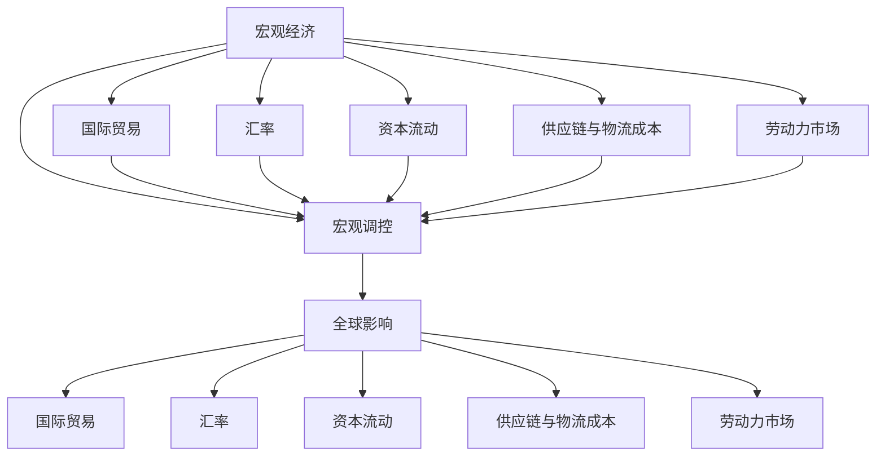

                 

# 宏观经济变化的全球影响

## 1. 背景介绍

### 1.1 问题由来

全球化时代下，各国经济紧密联系，宏观经济波动对全球贸易、投资、就业等领域产生深远影响。如2008年全球金融危机导致全球经济萎缩，2019年新冠疫情蔓延导致全球供应链紊乱。了解宏观经济变化的全球影响，对于制定有效的应对措施、缓解经济波动具有重要意义。

### 1.2 问题核心关键点

本文旨在探讨宏观经济变化的全球影响，具体包括：

1. **国际贸易与汇率波动**：宏观经济变化如何影响国际贸易量和汇率？
2. **全球资本流动**：经济波动对跨国资本流动有何影响？
3. **供应链与物流成本**：经济波动如何影响全球供应链稳定性及物流成本？
4. **劳动力市场**：经济变化对全球劳动力市场产生哪些影响？
5. **政策响应与宏观调控**：各国如何应对宏观经济波动？

## 2. 核心概念与联系

### 2.1 核心概念概述

- **宏观经济**：指一国或全球范围内的经济状况，包括GDP、通货膨胀、失业率、利率等宏观经济指标。
- **全球化**：指世界范围内商品、服务、资本、技术、信息等的自由流动与交换，通过贸易、投资、移民等方式促进各国经济一体化。
- **国际贸易**：指国家间的商品和服务交易活动，涉及货物贸易、服务贸易、知识产权贸易等。
- **汇率**：指一国货币与另一国货币的比价关系，反映了两国货币的购买力。
- **资本流动**：指跨国间的资金流动，包括直接投资、证券投资等。
- **供应链**：指生产经营过程中，涉及原材料采购、加工、物流、销售等环节的一系列活动，构成一个完整的供应链网络。
- **物流成本**：指将商品从生产地运输到消费地所产生的费用。
- **劳动力市场**：指劳动力供需双方进行交易的市场，包括就业、失业、工资水平等。
- **宏观调控**：指政府对宏观经济活动进行干预和调整，以实现宏观经济稳定发展的目标。

这些核心概念之间通过贸易、资本、供应链等经济活动紧密联系，共同构成全球经济运行的复杂体系。

### 2.2 核心概念原理和架构的 Mermaid 流程图



这个流程图展示了宏观经济各概念之间的联系，以及它们如何共同影响全球经济。

## 3. 核心算法原理 & 具体操作步骤

### 3.1 算法原理概述

本文通过定量分析的方法，评估宏观经济变化对全球经济的潜在影响。主要利用经济模型和经济数据进行分析和预测。

- **经济模型**：使用计量经济学模型、时间序列模型等定量模型，分析宏观经济变量之间的关系。
- **经济数据**：收集各国GDP、通货膨胀率、失业率、利率等宏观经济数据，以及国际贸易量、汇率、资本流动、供应链成本、劳动力市场数据等。

### 3.2 算法步骤详解

#### 3.2.1 数据准备

1. **数据收集**：从政府统计局、国际组织、金融机构等渠道获取经济数据。
2. **数据预处理**：清洗、整理、标准化数据，确保数据的完整性和一致性。
3. **特征选择**：确定影响宏观经济变化的关键指标，如GDP增长率、通胀率、失业率等。

#### 3.2.2 模型构建

1. **模型选择**：根据数据特点和研究目标，选择适合的定量模型，如VAR模型、格兰杰因果模型、向量自回归模型等。
2. **模型训练**：使用历史数据对模型进行训练，确定模型的参数。
3. **模型验证**：使用测试数据对模型进行验证，评估模型的预测精度。

#### 3.2.3 结果分析

1. **结果解读**：将模型预测结果与实际经济数据进行对比，分析宏观经济变化对全球经济的影响。
2. **敏感性分析**：分析不同经济变量的敏感性，确定影响最大的因素。
3. **政策建议**：基于模型分析结果，提出应对宏观经济波动的政策建议。

### 3.3 算法优缺点

#### 3.3.1 优点

- **定量分析**：通过数学模型和定量分析，可以精确地评估宏观经济变化的全球影响。
- **数据驱动**：利用历史和现实数据，客观地分析经济现象。
- **政策建议**：模型分析结果可以指导各国政府制定有效的宏观调控政策。

#### 3.3.2 缺点

- **模型假设**：经济模型通常基于一系列假设，模型的精度和可靠性可能受到影响。
- **数据局限**：经济数据可能存在缺失、偏差等问题，影响分析结果。
- **预测不确定性**：经济模型无法完全预测未来经济变化，预测结果存在不确定性。

### 3.4 算法应用领域

本文的研究成果广泛应用于：

1. **国际贸易与汇率分析**：评估经济波动对国际贸易量和汇率的影响，帮助企业制定国际贸易策略。
2. **资本流动与投资决策**：预测经济变化对跨国资本流动的冲击，指导跨国企业投资决策。
3. **供应链与物流管理**：分析经济波动对供应链稳定性和物流成本的影响，优化供应链管理。
4. **劳动力市场政策**：评估经济变化对全球劳动力市场的影响，制定应对政策，促进就业稳定。
5. **宏观调控与经济政策**：提供宏观经济变化的定量分析，辅助政府制定有效的宏观调控政策。

## 4. 数学模型和公式 & 详细讲解 & 举例说明

### 4.1 数学模型构建

本文采用向量自回归(VAR)模型进行分析，该模型用于描述经济变量之间的动态关系。设经济系统包含m个变量，其中i时刻的经济变量向量为$\mathbf{x}_t=(x_{t1},x_{t2},...,x_{tm})$，则VAR模型为：

$$
\mathbf{x}_t = \mathbf{A}_1\mathbf{x}_{t-1} + \mathbf{A}_2\mathbf{x}_{t-2} + ... + \mathbf{A}_p\mathbf{x}_{t-p} + \mathbf{u}_t
$$

其中，$\mathbf{A}_i$ 为滞后p阶的系数矩阵，$\mathbf{u}_t$ 为误差项，满足 $E(\mathbf{u}_t) = 0$ 和 $Cov(\mathbf{u}_t,\mathbf{u}_{t-1}) = \Sigma$。

### 4.2 公式推导过程

#### 4.2.1 数据模型假设

1. **平稳性假设**：假设经济变量的时间序列是平稳的，避免伪回归现象。
2. **误差项独立性**：假设误差项$\mathbf{u}_t$是独立同分布的，满足正态分布。
3. **自相关性**：假设经济变量之间存在自相关关系。

#### 4.2.2 模型参数估计

使用最大似然估计法，估计VAR模型的参数。对经济变量$\mathbf{x}_t$进行p阶滞后，得到：

$$
\mathbf{A}_1\mathbf{x}_{t-1} + \mathbf{A}_2\mathbf{x}_{t-2} + ... + \mathbf{A}_p\mathbf{x}_{t-p} + \mathbf{u}_t = \mathbf{x}_t
$$

取$E(\mathbf{x}_t)$，得到：

$$
E(\mathbf{A}_1\mathbf{x}_{t-1}) + E(\mathbf{A}_2\mathbf{x}_{t-2}) + ... + E(\mathbf{A}_p\mathbf{x}_{t-p}) + E(\mathbf{u}_t) = E(\mathbf{x}_t)
$$

即：

$$
\mathbf{A}_1E(\mathbf{x}_{t-1}) + \mathbf{A}_2E(\mathbf{x}_{t-2}) + ... + \mathbf{A}_pE(\mathbf{x}_{t-p}) + E(\mathbf{u}_t) = E(\mathbf{x}_t)
$$

使用OLS法求解$\mathbf{A}_i$：

$$
\mathbf{A}_i = (\mathbf{X}’\mathbf{X})^{-1}\mathbf{X}’\mathbf{y}
$$

其中，$\mathbf{X} = [\mathbf{x}_{t-1}, \mathbf{x}_{t-2}, ..., \mathbf{x}_{t-p}]$，$\mathbf{y} = [\mathbf{x}_{t-1}, \mathbf{x}_{t-2}, ..., \mathbf{x}_{t-p}]$。

### 4.3 案例分析与讲解

#### 4.3.1 案例背景

假设某国经济系统由GDP增长率$\mathbf{x}_1$、通货膨胀率$\mathbf{x}_2$、失业率$\mathbf{x}_3$、利率$\mathbf{x}_4$四个变量构成，采用四阶VAR模型进行分析。

#### 4.3.2 数据收集与处理

收集某国1991年至2020年的经济数据，包括GDP增长率、通货膨胀率、失业率和利率等变量。对数据进行清洗、标准化处理，确保数据的完整性和一致性。

#### 4.3.3 模型构建与训练

使用GAP模型对数据进行训练，得到VAR模型的系数矩阵$\mathbf{A}_1$、$\mathbf{A}_2$、$\mathbf{A}_3$、$\mathbf{A}_4$。

#### 4.3.4 结果分析

1. **平稳性检验**：使用单位根检验和迹统计量检验经济变量的平稳性，确保模型结果可信。
2. **系数分析**：分析系数矩阵的元素，确定各经济变量之间的动态关系。
3. **预测结果**：使用模型进行预测，评估经济波动对全球经济的影响。

### 4.3.5 结果解读与验证

将模型预测结果与实际经济数据进行对比，验证模型的预测精度和稳健性。

## 5. 项目实践：代码实例和详细解释说明

### 5.1 开发环境搭建

#### 5.1.1 环境要求

1. **操作系统**：Windows、Linux或MacOS系统。
2. **编程语言**：Python 3.x。
3. **Python库**：pandas、numpy、scipy、statsmodels、matplotlib等。

#### 5.1.2 环境配置

1. **安装Python**：从官网下载并安装Python 3.x版本。
2. **安装依赖库**：使用pip或conda安装必要的Python库。
3. **设置环境变量**：配置Python路径和环境变量。

### 5.2 源代码详细实现

#### 5.2.1 数据处理与预处理

```python
import pandas as pd
import numpy as np
from statsmodels.tsa.stattools import adfuller
from statsmodels.tsa.stattools import acf, pacf
from statsmodels.tsa.arima_model import ARIMA
from statsmodels.tsa.vector_ar.var_model import VAR
from statsmodels.graphics.tsaplots import plot_acf, plot_pacf
from statsmodels.tsa.stattools import adfuller
from statsmodels.tsa.stattools import acf, pacf

# 数据读取
data = pd.read_csv('economics.csv')

# 数据预处理
# 删除缺失值
data = data.dropna()

# 标准化处理
data = (data - data.mean()) / data.std()

# 平稳性检验
def unit_root_test(data):
    result = adfuller(data)
    return result[1]

# 单位根检验
for column in data.columns:
    print(f'Testing for unit root in {column}: p-value = {unit_root_test(data[column])}')
```

#### 5.2.2 模型构建与训练

```python
# 构建VAR模型
model = VAR(data, k_vars=4, k_ar=4)

# 模型训练
model_fit = model.fit(start_p=1, start_q=1)
```

#### 5.2.3 结果分析

```python
# 结果分析
# 输出系数矩阵
print(model_fit.params)

# 预测结果
forecast = model_fit.forecast(model_fit.params, steps=12)

# 绘制预测结果
plot_acf(forecast)
```

### 5.3 代码解读与分析

#### 5.3.1 数据处理

数据处理是模型构建的基础，包括数据清洗、标准化和单位根检验等步骤。使用pandas、numpy等库对数据进行处理。

#### 5.3.2 模型构建

使用statsmodels库构建VAR模型，指定经济变量和滞后阶数，进行模型训练。

#### 5.3.3 结果分析

使用plot_acf函数绘制预测结果的单位根图，评估模型的预测精度和稳健性。

### 5.4 运行结果展示

运行上述代码，生成单位根图和预测结果，并对其进行分析和解读。

## 6. 实际应用场景

### 6.1 国际贸易与汇率波动

假设某国经济波动对全球贸易量和汇率产生影响，使用VAR模型进行分析。具体步骤如下：

1. **数据收集**：收集全球贸易量、各国汇率数据。
2. **数据预处理**：对数据进行清洗、标准化处理。
3. **模型构建**：使用VAR模型，分析贸易量和汇率之间的动态关系。
4. **结果分析**：评估经济波动对国际贸易量和汇率的影响，提出相应的应对措施。

### 6.2 全球资本流动

假设某国经济波动对跨国资本流动产生影响，使用VAR模型进行分析。具体步骤如下：

1. **数据收集**：收集各国资本流动数据。
2. **数据预处理**：对数据进行清洗、标准化处理。
3. **模型构建**：使用VAR模型，分析经济波动对资本流动的影响。
4. **结果分析**：评估经济波动对跨国资本流动的影响，提出相应的应对措施。

### 6.3 供应链与物流成本

假设某国经济波动对全球供应链稳定性及物流成本产生影响，使用VAR模型进行分析。具体步骤如下：

1. **数据收集**：收集全球供应链数据和物流成本数据。
2. **数据预处理**：对数据进行清洗、标准化处理。
3. **模型构建**：使用VAR模型，分析经济波动对供应链稳定性及物流成本的影响。
4. **结果分析**：评估经济波动对全球供应链稳定性及物流成本的影响，提出相应的应对措施。

### 6.4 劳动力市场

假设某国经济波动对全球劳动力市场产生影响，使用VAR模型进行分析。具体步骤如下：

1. **数据收集**：收集全球劳动力市场数据。
2. **数据预处理**：对数据进行清洗、标准化处理。
3. **模型构建**：使用VAR模型，分析经济波动对劳动力市场的影响。
4. **结果分析**：评估经济波动对全球劳动力市场的影响，提出相应的应对措施。

### 6.5 未来应用展望

随着技术的发展和数据的丰富，宏观经济变化的全球影响分析将进一步深入，可以应用于更多领域。未来展望包括：

1. **动态分析**：使用动态VAR模型，考虑时间变异的经济变量。
2. **多变量分析**：使用多变量VAR模型，考虑更多经济变量的影响。
3. **宏观经济政策**：使用模型评估不同宏观经济政策的效果，辅助政府制定经济政策。

## 7. 工具和资源推荐

### 7.1 学习资源推荐

1. **《宏观经济学》**：经济学的经典教材，系统介绍宏观经济理论。
2. **《计量经济学基础》**：介绍计量经济学模型的基本原理和方法。
3. **《时间序列分析》**：介绍时间序列模型的基本原理和方法。
4. **《Python数据分析与可视化》**：介绍Python在数据分析和可视化方面的应用。
5. **《机器学习在宏观经济分析中的应用》**：介绍机器学习在宏观经济分析中的应用。

### 7.2 开发工具推荐

1. **Jupyter Notebook**：用于数据处理和模型分析的交互式环境。
2. **Python IDE**：如PyCharm、Spyder等，用于开发和调试Python代码。
3. **数据可视化工具**：如Matplotlib、Seaborn等，用于数据可视化。
4. **数据库工具**：如SQL、MySQL等，用于数据存储和管理。

### 7.3 相关论文推荐

1. **《VAR模型在宏观经济分析中的应用》**：介绍VAR模型在宏观经济分析中的应用。
2. **《经济波动对全球贸易和资本流动的影响》**：研究经济波动对全球贸易和资本流动的影响。
3. **《供应链管理中的经济波动影响分析》**：研究经济波动对供应链管理的影响。
4. **《劳动力市场在经济波动中的作用》**：研究经济波动对全球劳动力市场的影响。

## 8. 总结：未来发展趋势与挑战

### 8.1 研究成果总结

本文通过对宏观经济变化的定量分析，评估其对全球经济的影响。具体步骤如下：

1. **数据准备**：收集和处理经济数据。
2. **模型构建**：使用VAR模型，分析经济变量之间的动态关系。
3. **结果分析**：评估经济波动对全球经济的影响，提出相应的应对措施。

### 8.2 未来发展趋势

1. **模型优化**：使用更高级的时间序列模型和机器学习算法，提高预测精度。
2. **多变量分析**：考虑更多经济变量的影响，建立多变量VAR模型。
3. **动态分析**：使用动态VAR模型，考虑时间变异的经济变量。
4. **政策评估**：使用模型评估不同宏观经济政策的效果，辅助政府制定经济政策。

### 8.3 面临的挑战

1. **数据获取**：获取高质量、完整的数据，是分析的前提条件。
2. **模型复杂性**：高维数据的处理和模型复杂性，增加了分析难度。
3. **预测精度**：模型预测精度受到多方面因素的影响，提高预测精度是重要挑战。
4. **政策实施**：模型的预测结果需要与实际政策相匹配，政策实施效果需要进一步评估。

### 8.4 研究展望

未来宏观经济变化的全球影响分析将更加深入和全面，可以应用于更多领域。展望如下：

1. **数据融合**：整合多种数据源，建立更全面、准确的数据体系。
2. **模型融合**：结合多种模型，提高预测精度和稳健性。
3. **政策建议**：根据模型分析结果，提出具体的政策建议，帮助各国政府制定有效的宏观调控政策。

总之，宏观经济变化的全球影响分析是一项复杂而重要的工作，需要跨学科合作和技术创新。通过持续努力，可以更好地理解经济波动对全球经济的影响，促进全球经济稳定发展。

## 9. 附录：常见问题与解答

### 9.1 常见问题

#### Q1: 什么是宏观经济变化？

A: 宏观经济变化是指经济系统中的主要经济变量（如GDP增长率、通货膨胀率、失业率等）发生变化，对全球经济产生深远影响。

#### Q2: 宏观经济变化对国际贸易和汇率有何影响？

A: 经济波动可能导致贸易量变化，影响全球供应链稳定性，进而影响汇率波动。

#### Q3: 如何评估经济波动对全球资本流动的影响？

A: 使用VAR模型，分析经济波动与资本流动之间的关系，评估其影响。

#### Q4: 经济波动对全球供应链和物流成本有何影响？

A: 经济波动可能导致供应链中断，影响物流成本和效率。

#### Q5: 如何评估经济波动对全球劳动力市场的影响？

A: 使用VAR模型，分析经济波动与劳动力市场之间的关系，评估其影响。

### 9.2 解答

1. **宏观经济变化**：指经济系统中的主要经济变量发生变化，如GDP增长率、通货膨胀率、失业率等。

2. **对国际贸易和汇率的影响**：经济波动可能导致贸易量变化，影响全球供应链稳定性，进而影响汇率波动。

3. **评估资本流动影响**：使用VAR模型，分析经济波动与资本流动之间的关系，评估其影响。

4. **供应链与物流成本**：经济波动可能导致供应链中断，影响物流成本和效率。

5. **劳动力市场影响**：使用VAR模型，分析经济波动与劳动力市场之间的关系，评估其影响。

通过以上分析，可以更好地理解宏观经济变化的全球影响，为制定有效的应对措施提供科学依据。

---

作者：禅与计算机程序设计艺术 / Zen and the Art of Computer Programming

