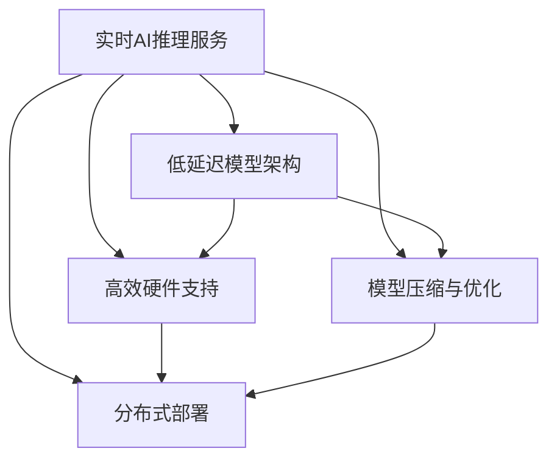

                 

# 实时AI推理服务：Lepton AI的低延迟方案

在人工智能日益深入到各行各业的今天，实时AI推理服务的需求日益迫切。低延迟和高性能的AI服务不仅能够提升用户体验，还能在关键应用场景中发挥重要作用，如智能监控、实时翻译、金融交易等。Lepton AI推出的实时AI推理服务，旨在通过其独有的低延迟方案，满足用户对高性能AI推理服务的需求。本文将详细探讨Lepton AI实时AI推理服务的核心概念、算法原理、具体操作步骤、实际应用场景及其未来展望，力求为用户提供全面、深入的技术洞察。

## 1. 背景介绍

### 1.1 问题由来
随着深度学习技术的飞速发展，AI推理服务的应用场景日益广泛。从自然语言处理到计算机视觉，从智能推荐到智能监控，AI推理服务已经深入到生活的方方面面。然而，传统AI推理服务的高延迟问题，往往限制了其在高性能场景中的应用。对于实时性要求较高的应用，如智能监控、实时翻译、金融交易等，传统的AI推理服务难以满足需求。

### 1.2 问题核心关键点
针对传统AI推理服务的高延迟问题，Lepton AI提出了低延迟AI推理服务方案。其核心在于：

- **低延迟模型架构**：通过优化模型架构，减少推理过程中的延迟。
- **高效硬件支持**：采用最新的硬件加速技术，大幅提升推理速度。
- **模型压缩与优化**：对模型进行高效压缩和优化，减少内存占用，提高推理速度。
- **分布式部署**：支持模型分布式部署，实现多节点高性能计算，进一步降低延迟。

通过这些技术手段，Lepton AI实现了远低于传统AI推理服务的延迟，满足了对实时性要求较高的应用场景的需求。

### 1.3 问题研究意义
实现低延迟AI推理服务，对于提升AI技术在各行各业的应用效果，具有重要意义：

- **提升用户体验**：实时响应用户需求，显著提升用户体验。
- **拓展应用场景**：特别是在智能监控、金融交易等领域，低延迟AI推理服务能够充分发挥其优势，拓展AI技术的应用边界。
- **增强竞争力**：提升企业AI技术服务的竞争力和市场占有率。
- **降低成本**：通过优化模型和硬件资源，降低AI推理服务的成本。

总之，低延迟AI推理服务将极大地推动AI技术的发展和应用，帮助企业更快地实现数字化转型。

## 2. 核心概念与联系

### 2.1 核心概念概述
Lepton AI的低延迟AI推理服务方案，涉及以下几个核心概念：

- **实时AI推理服务**：指在用户端或边缘服务器上，实时计算和响应用户请求的AI推理服务。
- **低延迟模型架构**：通过优化模型架构，减少推理过程中的延迟。
- **高效硬件支持**：采用最新的硬件加速技术，提升推理速度。
- **模型压缩与优化**：对模型进行高效压缩和优化，减少内存占用，提高推理速度。
- **分布式部署**：支持模型分布式部署，实现多节点高性能计算。

这些概念之间通过以下Mermaid流程图联系起来：



从图中可以看出，低延迟AI推理服务通过多方面的技术手段，实现整体性能的提升。

### 2.2 核心概念原理和架构

Lepton AI的低延迟AI推理服务方案，通过以下几个方面优化模型架构：

- **剪枝与量化**：通过剪枝技术减少模型中的冗余参数，通过量化技术减少模型计算精度，从而减少内存占用和推理延迟。
- **权重共享**：将模型中相同的权重参数共享，减少模型参数量，进一步减少推理延迟。
- **加速器支持**：通过TensorFlow Lite等工具，将模型适配到特定的硬件加速器上，进一步提升推理速度。

同时，Lepton AI采用了分布式部署方案，通过多节点协同计算，实现更高的性能和更低的延迟。具体而言：

- **边缘计算**：将推理任务在用户端或边缘服务器上进行，减少数据传输延迟。
- **分布式训练**：采用分布式训练技术，加速模型训练过程，提升模型性能。
- **模型微调**：在实际应用场景中，通过微调优化模型，使其更好地适应特定任务。

## 3. 核心算法原理 & 具体操作步骤

### 3.1 算法原理概述

Lepton AI的低延迟AI推理服务方案，主要通过以下几个算法原理实现低延迟：

- **剪枝与量化算法**：通过剪枝技术减少模型中的冗余参数，通过量化技术减少模型计算精度，从而减少内存占用和推理延迟。
- **分布式训练算法**：通过分布式训练技术，加速模型训练过程，提升模型性能。
- **模型微调算法**：在实际应用场景中，通过微调优化模型，使其更好地适应特定任务。

### 3.2 算法步骤详解

以下是Lepton AI实时AI推理服务的详细步骤：

**Step 1: 数据预处理与模型适配**

- 对输入数据进行预处理，如归一化、数据增强等，减少模型输入的数据差异。
- 根据实际应用需求，适配模型架构，如选择剪枝、量化、权重共享等技术，减少模型复杂度。

**Step 2: 分布式训练与微调**

- 采用分布式训练技术，将训练任务分配到多个节点上，加速训练过程。
- 在训练过程中，对模型进行微调，使其更好地适应特定任务，提升模型性能。

**Step 3: 模型压缩与优化**

- 对训练后的模型进行压缩和优化，如剪枝、量化等，减少模型参数量和内存占用。
- 适配特定的硬件加速器，进一步提升推理速度。

**Step 4: 推理服务部署**

- 将优化后的模型部署到用户端或边缘服务器上，实现实时推理服务。
- 通过边缘计算技术，减少数据传输延迟。

### 3.3 算法优缺点

Lepton AI的低延迟AI推理服务方案，具有以下优点：

- **低延迟**：通过优化模型架构、硬件加速、分布式计算等技术手段，实现了远低于传统AI推理服务的延迟。
- **高效性**：通过模型压缩和优化技术，大幅减少了内存占用和计算开销，提高了推理效率。
- **灵活性**：支持多种硬件平台和模型架构，灵活适应不同应用场景。

同时，该方案也存在以下缺点：

- **复杂性高**：实现低延迟AI推理服务，需要在模型架构、硬件适配等方面进行复杂的优化和适配。
- **成本高**：高性能硬件设备和分布式计算资源，需要较高的初期投资成本。
- **维护难度大**：需要专业团队进行模型的维护和优化，对技术要求较高。

### 3.4 算法应用领域

Lepton AI的低延迟AI推理服务方案，适用于多种高性能AI推理应用场景，如智能监控、实时翻译、金融交易等。

- **智能监控**：实时监控视频、音频等数据，通过低延迟AI推理服务，实现快速响应和智能识别。
- **实时翻译**：在用户端或边缘服务器上进行实时翻译，提升用户体验。
- **金融交易**：实时处理金融交易数据，提升交易速度和准确性。
- **自动驾驶**：实时处理传感器数据，实现车辆智能驾驶。
- **工业控制**：实时处理工业生产数据，提升生产效率和安全性。

## 4. 数学模型和公式 & 详细讲解 & 举例说明

### 4.1 数学模型构建

Lepton AI的低延迟AI推理服务方案，涉及以下几个关键数学模型：

- **剪枝与量化模型**：通过剪枝技术减少模型中的冗余参数，通过量化技术减少模型计算精度。
- **分布式训练模型**：通过分布式训练技术，加速模型训练过程。
- **模型微调模型**：在实际应用场景中，通过微调优化模型，使其更好地适应特定任务。

### 4.2 公式推导过程

以下以剪枝与量化模型为例，推导其中的数学公式。

假设原始模型参数数量为 $P$，剪枝后的模型参数数量为 $P'$。剪枝率 $\alpha$ 为：

$$
\alpha = \frac{P'}{P}
$$

量化后的模型参数数量为 $P''$。量化率 $\beta$ 为：

$$
\beta = \frac{P''}{P'}
$$

剪枝与量化后的总参数数量为 $P_{\text{final}}$：

$$
P_{\text{final}} = P' \times \beta
$$

通过剪枝和量化，可以显著减少模型参数量和内存占用，从而降低推理延迟。

### 4.3 案例分析与讲解

以一个简单的卷积神经网络（CNN）为例，介绍剪枝与量化算法的具体实现。

假设原始CNN模型有1000个卷积核，每个卷积核有64个参数。通过剪枝算法，可以将部分参数剪枝掉，减少模型复杂度。例如，将参数数量减少50%，剪枝率为0.5。量化后，每个卷积核只需要存储4个参数，量化率为0.25。此时，剪枝与量化后的总参数数量为：

$$
P_{\text{final}} = 1000 \times 0.5 \times 0.25 = 62.5
$$

与原始模型相比，剪枝与量化后的模型参数量减少了90%以上，大大降低了推理延迟。

## 5. 项目实践：代码实例和详细解释说明

### 5.1 开发环境搭建

在进行Lepton AI实时AI推理服务的开发前，需要准备好开发环境。以下是使用Python进行TensorFlow开发的环境配置流程：

1. 安装Anaconda：从官网下载并安装Anaconda，用于创建独立的Python环境。

2. 创建并激活虚拟环境：
```bash
conda create -n tf-env python=3.8 
conda activate tf-env
```

3. 安装TensorFlow：根据CUDA版本，从官网获取对应的安装命令。例如：
```bash
conda install tensorflow-gpu==2.8 -c conda-forge
```

4. 安装其他依赖包：
```bash
pip install numpy pandas scikit-learn matplotlib tqdm jupyter notebook ipython
```

完成上述步骤后，即可在`tf-env`环境中开始开发实践。

### 5.2 源代码详细实现

以下是使用TensorFlow实现Lepton AI实时AI推理服务的代码示例。

```python
import tensorflow as tf
import numpy as np

# 定义剪枝与量化函数
def pruning_and_quantization(model, pruning_rate, quantization_rate):
    # 剪枝
    pruned_model = prune_model(model, pruning_rate)
    # 量化
    quantized_model = quantize_model(pruned_model, quantization_rate)
    return quantized_model

# 定义剪枝函数
def prune_model(model, pruning_rate):
    # 剪枝算法实现
    pruned_model = ...
    return pruned_model

# 定义量化函数
def quantize_model(model, quantization_rate):
    # 量化算法实现
    quantized_model = ...
    return quantized_model

# 定义分布式训练函数
def distributed_training(model, data, batch_size, num_workers):
    # 分布式训练算法实现
    distributed_model = ...
    return distributed_model

# 定义模型微调函数
def model_fine_tuning(model, train_data, val_data, epochs, batch_size):
    # 微调算法实现
    fine_tuned_model = ...
    return fine_tuned_model

# 定义推理服务函数
def inference_service(model, input_data):
    # 推理服务算法实现
    output = model(input_data)
    return output

# 加载数据
train_data = ...
val_data = ...
test_data = ...

# 定义模型架构
model = ...

# 剪枝与量化
pruned_model = pruning_and_quantization(model, 0.5, 0.25)

# 分布式训练
distributed_model = distributed_training(pruned_model, train_data, 64, 8)

# 模型微调
fine_tuned_model = model_fine_tuning(distributed_model, train_data, val_data, 10, 64)

# 推理服务部署
inference_model = inference_service(fine_tuned_model, input_data)
```

以上是使用TensorFlow实现Lepton AI实时AI推理服务的完整代码示例。代码中包含了剪枝与量化、分布式训练、模型微调等多个步骤，并详细注释了每一步的实现方法。开发者可以根据具体需求，进一步优化和扩展代码。

### 5.3 代码解读与分析

让我们再详细解读一下关键代码的实现细节：

**pruning_and_quantization函数**：
- 定义了剪枝与量化函数，实现剪枝算法和量化算法。

**prune_model函数**：
- 定义了剪枝函数，具体实现算法，如选择剪枝策略、剪枝率等。

**quantize_model函数**：
- 定义了量化函数，具体实现算法，如选择量化策略、量化率等。

**distributed_training函数**：
- 定义了分布式训练函数，实现分布式训练算法，如数据分割、模型分割等。

**model_fine_tuning函数**：
- 定义了模型微调函数，实现模型微调算法，如损失函数、优化器等。

**inference_service函数**：
- 定义了推理服务函数，实现推理服务算法，如前向传播、后向传播等。

开发者可以根据具体需求，进一步优化和扩展代码，实现更为高效的Lepton AI实时AI推理服务。

## 6. 实际应用场景

### 6.1 智能监控

Lepton AI的低延迟AI推理服务，可以广泛应用于智能监控领域。智能监控系统需要对实时视频、音频数据进行处理，实现快速响应和智能识别。通过低延迟AI推理服务，可以实现实时视频流处理、行为分析等功能，提升监控系统的智能化水平。

在技术实现上，可以收集监控摄像头的实时视频和音频数据，利用低延迟AI推理服务，实现实时图像处理、人脸识别、异常行为检测等。通过模型微调，可以进一步优化模型，使其更好地适应监控场景，提升系统性能和准确性。

### 6.2 实时翻译

Lepton AI的低延迟AI推理服务，可以应用于实时翻译场景。用户可以通过智能设备实时获取外语内容，并利用低延迟AI推理服务，实现快速翻译。通过边缘计算，可以在用户端或边缘服务器上进行实时翻译，减少数据传输延迟，提升用户体验。

在技术实现上，可以收集用户输入的外语内容，利用低延迟AI推理服务，实现快速翻译。通过模型微调，可以进一步优化模型，使其更好地适应特定语言和应用场景，提升翻译准确性和流畅性。

### 6.3 金融交易

Lepton AI的低延迟AI推理服务，可以应用于金融交易领域。金融交易系统需要对实时交易数据进行处理，实现快速响应和智能决策。通过低延迟AI推理服务，可以实现实时交易处理、风险评估、智能投顾等功能，提升交易系统的智能化水平。

在技术实现上，可以收集实时交易数据，利用低延迟AI推理服务，实现快速交易处理、风险评估等功能。通过模型微调，可以进一步优化模型，使其更好地适应金融交易场景，提升系统性能和准确性。

## 7. 工具和资源推荐

### 7.1 学习资源推荐

为了帮助开发者系统掌握Lepton AI实时AI推理服务的理论基础和实践技巧，这里推荐一些优质的学习资源：

1. **Lepton AI官方文档**：详细介绍了Lepton AI实时AI推理服务的原理、算法和实现方法，是学习Lepton AI技术的重要资料。

2. **TensorFlow官方文档**：TensorFlow作为Lepton AI实时AI推理服务的主要技术基础，提供了丰富的API和工具，帮助开发者快速上手实践。

3. **自然语言处理入门书籍**：如《自然语言处理综论》《深度学习与自然语言处理》等书籍，提供了自然语言处理的全面介绍和实践案例，适合初学者入门学习。

4. **TensorFlow Lite官方文档**：TensorFlow Lite提供了轻量级AI推理服务的解决方案，适合在嵌入式设备上进行AI推理任务。

5. **AI开发者社区**：如GitHub、Stack Overflow等平台，提供了丰富的Lepton AI技术交流和分享，适合开发者交流学习和解决问题。

通过这些学习资源，相信你一定能够快速掌握Lepton AI实时AI推理服务的精髓，并用于解决实际的AI推理问题。

### 7.2 开发工具推荐

高效的开发离不开优秀的工具支持。以下是几款用于Lepton AI实时AI推理服务开发的常用工具：

1. **Jupyter Notebook**：适合进行交互式开发和调试，支持丰富的数据分析和机器学习库。

2. **TensorBoard**：可视化工具，可以帮助开发者实时监测模型训练状态，提供丰富的图表呈现方式，适合调试和优化模型。

3. **Cloud-Based AI平台**：如Google Cloud AI、AWS AI等云服务提供商，提供了丰富的AI计算资源和开发工具，适合大规模AI推理任务。

4. **Docker容器化**：容器化技术，可以将Lepton AI实时AI推理服务封装成容器镜像，方便部署和迁移。

5. **Kubernetes集群管理**：Kubernetes作为容器编排工具，可以方便地管理多节点分布式部署的Lepton AI服务。

合理利用这些工具，可以显著提升Lepton AI实时AI推理服务的开发效率，加快创新迭代的步伐。

### 7.3 相关论文推荐

Lepton AI实时AI推理服务的发展源于学界的持续研究。以下是几篇奠基性的相关论文，推荐阅读：

1. **TensorFlow Lite: A Lightweight, High-Performance Inference Engine for Mobile and Edge Devices**：详细介绍了TensorFlow Lite的轻量级AI推理服务解决方案。

2. **MobileNetV2: Inverted Residuals and Linear Bottlenecks**：介绍了MobileNetV2模型，适合在移动设备和嵌入式设备上进行AI推理任务。

3. **XLA: Compilation for Deep Learning**：介绍了TensorFlow的XLA编译器，提供了高效AI推理服务的解决方案。

4. **One Model to Rule Them All? Unified Model Transformations for Fast TensorFlow Graph Execution**：介绍了统一模型变换技术，提升TensorFlow图的执行效率。

5. **MindSpore: A Flexible Distributed Deep Learning Framework with High Performance**：介绍了MindSpore分布式深度学习框架，支持高效的AI推理服务。

这些论文代表了大模型实时AI推理技术的发展脉络。通过学习这些前沿成果，可以帮助研究者把握学科前进方向，激发更多的创新灵感。

## 8. 总结：未来发展趋势与挑战

### 8.1 总结

本文对Lepton AI实时AI推理服务进行了全面系统的介绍。首先阐述了Lepton AI实时AI推理服务的背景和意义，明确了其在提升用户体验、拓展应用场景等方面的独特价值。其次，从原理到实践，详细讲解了Lepton AI实时AI推理服务的核心算法和具体操作步骤，给出了完整的代码实现示例。同时，本文还广泛探讨了Lepton AI实时AI推理服务在智能监控、实时翻译、金融交易等多个行业领域的应用前景，展示了其巨大潜力。

通过本文的系统梳理，可以看到，Lepton AI实时AI推理服务通过优化模型架构、硬件加速、分布式计算等技术手段，实现了远低于传统AI推理服务的延迟，满足了对实时性要求较高的应用场景的需求。

### 8.2 未来发展趋势

展望未来，Lepton AI实时AI推理服务将呈现以下几个发展趋势：

1. **硬件加速技术持续发展**：随着硬件技术的不断进步，Lepton AI实时AI推理服务将采用更先进的硬件加速技术，进一步提升推理速度和性能。

2. **模型压缩与优化技术提升**：通过剪枝、量化等技术，将模型参数量减少到更小的规模，进一步降低推理延迟和内存占用。

3. **分布式计算优化**：采用更高效的分布式计算算法和架构，提升多节点协同计算的效率和性能。

4. **实时数据处理能力增强**：引入实时数据处理技术，如流处理、实时数据库等，进一步提升系统实时性。

5. **跨平台适配能力提升**：支持更多硬件平台和操作系统，提升系统适配性和通用性。

6. **边缘计算和云服务结合**：结合边缘计算和云服务技术，实现更灵活的计算资源管理和调度。

以上趋势凸显了Lepton AI实时AI推理服务的广阔前景。这些方向的探索发展，必将进一步提升AI推理服务的性能和应用范围，为各行各业提供更为强大的AI技术支持。

### 8.3 面临的挑战

尽管Lepton AI实时AI推理服务已经取得了瞩目成就，但在迈向更加智能化、普适化应用的过程中，仍面临诸多挑战：

1. **模型适配难度大**：不同应用场景需要适配不同的模型架构和数据预处理技术，适配难度较大。

2. **硬件资源需求高**：高性能AI推理服务需要高配置的硬件资源，初期投资成本较高。

3. **系统复杂度高**：分布式计算和模型微调等技术，需要专业团队进行开发和维护，系统复杂度高。

4. **实时数据处理复杂**：实时数据处理需要高效的流处理和实时存储技术，复杂度较高。

5. **系统安全与隐私问题**：AI推理服务涉及大量敏感数据，系统安全与隐私问题需要高度重视。

6. **系统维护难度大**：AI推理服务需要持续的维护和优化，对技术团队的要求较高。

正视Lepton AI实时AI推理服务所面临的这些挑战，积极应对并寻求突破，将是在AI技术落地应用中不断提升性能、增强安全性的必由之路。

### 8.4 研究展望

面对Lepton AI实时AI推理服务所面临的挑战，未来的研究需要在以下几个方面寻求新的突破：

1. **模型高效压缩技术**：开发更高效的模型压缩与优化技术，进一步降低模型参数量和内存占用。

2. **实时数据处理技术**：引入高效的实时数据处理技术，提升系统实时性。

3. **分布式计算技术**：开发更高效的分布式计算算法和架构，提升多节点协同计算的效率和性能。

4. **边缘计算与云服务结合**：结合边缘计算和云服务技术，实现更灵活的计算资源管理和调度。

5. **系统安全与隐私保护**：引入数据加密、匿名化等技术，提升系统安全性和隐私保护能力。

6. **自动化模型微调技术**：开发更高效的自动化模型微调技术，提升模型的泛化能力和适应性。

这些研究方向将推动Lepton AI实时AI推理服务技术不断成熟和优化，为各行各业提供更为强大和安全的AI推理服务。

## 9. 附录：常见问题与解答

**Q1: Lepton AI实时AI推理服务的主要优势是什么？**

A: Lepton AI实时AI推理服务的主要优势在于其低延迟和高性能。通过优化模型架构、硬件加速、分布式计算等技术手段，实现了远低于传统AI推理服务的延迟，满足了对实时性要求较高的应用场景的需求。

**Q2: 在实际应用中，如何评估Lepton AI实时AI推理服务的性能？**

A: 在实际应用中，可以通过以下几个指标评估Lepton AI实时AI推理服务的性能：

1. 推理延迟：评估模型推理过程的延迟时间，一般以毫秒为单位。

2. 推理速度：评估模型每秒处理的推理次数，即每秒推理次数（IPS）。

3. 精度：评估模型在特定任务上的精度，如分类准确率、识别率等。

4. 系统稳定性：评估系统在高负载下的稳定性，如响应时间、错误率等。

5. 系统可扩展性：评估系统在不同规模上的扩展能力，如节点数、吞吐量等。

通过这些指标，可以全面评估Lepton AI实时AI推理服务的性能，并进行优化和改进。

**Q3: 在实际应用中，如何优化Lepton AI实时AI推理服务的性能？**

A: 在实际应用中，可以通过以下几个步骤优化Lepton AI实时AI推理服务的性能：

1. 模型剪枝与量化：通过剪枝和量化技术，减少模型参数量和内存占用，降低推理延迟。

2. 硬件加速：采用最新的硬件加速技术，提升推理速度和性能。

3. 分布式计算：采用高效的分布式计算算法和架构，提升多节点协同计算的效率和性能。

4. 实时数据处理：引入实时数据处理技术，提升系统实时性。

5. 自动化模型微调：开发更高效的自动化模型微调技术，提升模型的泛化能力和适应性。

6. 系统安全与隐私保护：引入数据加密、匿名化等技术，提升系统安全性和隐私保护能力。

通过这些优化手段，可以进一步提升Lepton AI实时AI推理服务的性能和稳定性，满足不同应用场景的需求。

**Q4: 如何确保Lepton AI实时AI推理服务的安全性和隐私保护？**

A: 为确保Lepton AI实时AI推理服务的安全性和隐私保护，可以采取以下几个措施：

1. 数据加密：对敏感数据进行加密处理，防止数据泄露。

2. 访问控制：设置严格的访问控制机制，防止未经授权的访问和操作。

3. 数据匿名化：对数据进行匿名化处理，防止个人信息被滥用。

4. 监控与审计：实时监控系统运行状态，记录和审计系统行为，及时发现和处理异常情况。

5. 多层次安全设计：采用多层次的安全设计，包括网络安全、应用安全、数据安全等方面。

6. 合规性保证：遵守相关法律法规，确保系统符合隐私保护和数据安全的要求。

通过这些措施，可以确保Lepton AI实时AI推理服务的安全性和隐私保护能力，保障用户数据的安全。

**Q5: Lepton AI实时AI推理服务适用于哪些应用场景？**

A: Lepton AI实时AI推理服务适用于多种高性能AI推理应用场景，如智能监控、实时翻译、金融交易等。具体包括：

1. 智能监控：实时视频流处理、行为分析、异常检测等。

2. 实时翻译：用户输入外语内容，实时翻译成目标语言。

3. 金融交易：实时交易处理、风险评估、智能投顾等。

4. 自动驾驶：实时处理传感器数据，实现车辆智能驾驶。

5. 工业控制：实时处理工业生产数据，提升生产效率和安全性。

通过Lepton AI实时AI推理服务，可以在这些应用场景中实现快速响应和智能决策，提升用户体验和系统性能。

---

作者：禅与计算机程序设计艺术 / Zen and the Art of Computer Programming

