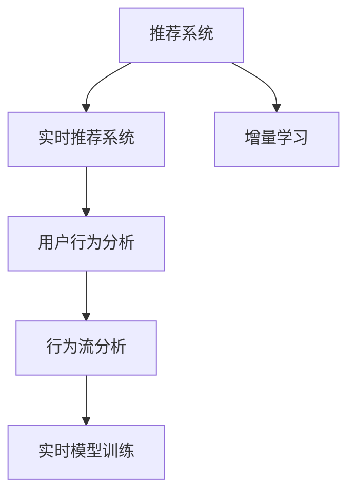

                 

# 实时推荐的用户行为分析

## 1. 背景介绍

随着电子商务、互联网金融、社交媒体等领域的迅速发展，推荐系统已成为各大平台提升用户体验、增加业务收益的核心技术之一。推荐系统通过分析用户的历史行为、兴趣偏好，提供个性化的商品或内容推荐，有效解决了信息过载问题，显著提升了用户满意度和平台转化率。

然而，传统的推荐算法往往基于用户历史行为数据进行静态推荐，难以应对用户行为随时间变化的动态特性。实时推荐系统（Real-time Recommendation System）通过动态分析用户行为变化，实时调整推荐策略，能够更好地匹配用户需求，进一步提升推荐效果。

## 2. 核心概念与联系

### 2.1 核心概念概述

为了更好地理解实时推荐系统，本节将介绍几个关键概念：

- 推荐系统（Recommendation System）：通过分析用户行为和偏好，为用户提供个性化推荐内容的系统。常见的推荐算法包括协同过滤、基于内容的推荐、混合推荐等。
- 实时推荐系统（Real-time Recommendation System）：基于用户实时行为数据，动态调整推荐策略，提供即时个性化的推荐服务。
- 用户行为分析（User Behavior Analysis）：通过分析用户的操作、浏览、点击等行为数据，理解用户兴趣、偏好和需求，用于指导推荐系统。
- 行为流分析（Behavioral Stream Analysis）：对用户行为流数据进行实时处理，分析用户行为变化趋势，用于实时调整推荐策略。
- 实时模型训练（Real-time Model Training）：利用实时数据流进行模型训练和更新，使推荐系统能够快速响应用户需求变化。
- 增量学习（Incremental Learning）：基于历史数据和实时数据，不断更新模型参数，提升模型预测能力。

这些概念之间的逻辑关系可以通过以下Mermaid流程图来展示：



这个流程图展示出各个概念之间的关联：

1. 推荐系统是实时推荐系统的基础。
2. 用户行为分析通过分析用户历史和实时行为数据，指导实时推荐系统。
3. 行为流分析对用户行为流数据进行实时处理，用于调整推荐策略。
4. 实时模型训练利用实时数据流进行模型训练和更新。
5. 增量学习结合历史数据和实时数据，不断更新模型参数。

这些概念共同构成了实时推荐系统的核心框架，使其能够在各种应用场景下提供高效、个性化的推荐服务。

## 3. 核心算法原理 & 具体操作步骤
### 3.1 算法原理概述

实时推荐系统的核心算法原理基于协同过滤、内容推荐、混合推荐等经典推荐算法，同时引入了增量学习、实时流处理等技术，使得推荐系统能够动态响应用户行为变化，提供更加个性化的推荐服务。

具体而言，实时推荐系统的工作流程包括以下几个关键步骤：

1. **数据采集**：从各种数据源（如电商平台、社交网络、金融交易系统等）采集用户行为数据。
2. **行为分析**：对用户行为数据进行预处理、特征提取，分析用户行为模式和兴趣偏好。
3. **模型训练**：利用历史行为数据进行模型训练，构建推荐模型。
4. **实时流处理**：对实时行为流数据进行实时处理，动态调整推荐策略。
5. **推荐服务**：根据用户实时行为和推荐模型，实时生成推荐结果，推送给用户。

### 3.2 算法步骤详解

#### 数据采集

数据采集是实时推荐系统的第一步，需要从多个数据源采集用户行为数据。常见的数据源包括：

- 电商平台：用户浏览、购买、评分记录等。
- 社交网络：用户点赞、评论、分享等行为数据。
- 金融交易系统：用户交易、投资记录等。
- 移动应用：用户在应用内的点击、停留时间、消费等数据。

对于每个数据源，需要进行不同的数据处理和采集方法。例如，电商平台的数据通常包含用户ID、商品ID、购买时间、价格等信息。社交网络的数据可能包含用户ID、发布内容、互动对象ID等信息。金融交易数据可能包含交易时间、金额、交易类型等。

#### 行为分析

行为分析是通过对用户行为数据进行预处理、特征提取和建模，理解用户兴趣、偏好和需求的过程。具体步骤包括：

1. **数据清洗**：去除噪声数据、缺失值、异常值，保证数据质量。
2. **特征提取**：提取有意义的特征，如用户ID、商品ID、时间戳、购买金额等。
3. **行为建模**：使用协同过滤、基于内容的推荐、混合推荐等算法，建立推荐模型。
4. **行为预测**：预测用户对不同商品或内容的兴趣程度，生成推荐结果。

行为分析过程中，可以使用多种算法和技术：

- 协同过滤（Collaborative Filtering）：通过用户历史行为数据，预测用户对新物品的评分。
- 基于内容的推荐（Content-Based Recommendation）：根据物品属性和用户兴趣，生成个性化推荐。
- 混合推荐（Hybrid Recommendation）：结合协同过滤和内容推荐，提升推荐效果。

#### 模型训练

模型训练是实时推荐系统的核心，通过历史行为数据进行模型训练，生成推荐模型。具体步骤如下：

1. **选择合适的算法**：如协同过滤、内容推荐等。
2. **特征工程**：选择合适的特征，构建特征向量。
3. **训练模型**：利用历史数据训练推荐模型。
4. **模型评估**：使用交叉验证、AUC等指标评估模型性能。
5. **模型部署**：将训练好的模型部署到实时推荐系统中。

#### 实时流处理

实时流处理是实时推荐系统的关键步骤，通过实时处理用户行为流数据，动态调整推荐策略。具体步骤如下：

1. **数据采集**：从各种数据源实时采集用户行为数据。
2. **数据融合**：将实时数据和历史数据融合，形成统一的行为流数据。
3. **流处理**：利用流处理框架（如Apache Flink、Apache Kafka等），实时处理行为流数据。
4. **推荐调整**：根据实时数据流，动态调整推荐策略。
5. **结果推送**：根据用户实时行为和推荐策略，实时生成推荐结果，推送给用户。

#### 推荐服务

推荐服务是将实时推荐策略应用到具体业务场景中的最后一步，主要包括以下步骤：

1. **数据采集**：采集用户实时行为数据。
2. **推荐生成**：根据实时行为和推荐策略，生成推荐结果。
3. **结果展示**：将推荐结果展示给用户，如在电商平台上显示商品推荐，在社交网络上显示内容推荐等。
4. **用户反馈**：收集用户对推荐结果的反馈，用于进一步优化推荐策略。

### 3.3 算法优缺点

实时推荐系统相对于传统的推荐算法具有以下优点：

- **动态响应**：能够实时响应用户行为变化，提供个性化的推荐服务。
- **高精度**：通过实时数据流处理，不断提高推荐模型的精度和效果。
- **用户体验**：基于实时行为数据，推荐内容更加贴合用户需求，提升用户体验。
- **成本降低**：实时推荐系统利用已有历史数据和实时数据进行增量学习，降低数据采集和处理的成本。

然而，实时推荐系统也存在一些缺点：

- **数据处理复杂**：需要处理多种数据源，数据格式和类型各异，数据融合和处理难度大。
- **实时流处理**：实时流处理需要高性能的计算资源，数据量大的情况下可能面临性能瓶颈。
- **模型更新频繁**：实时推荐系统需要频繁更新模型参数，可能导致模型不稳定。
- **用户隐私保护**：实时采集用户行为数据，需要考虑用户隐私和数据安全问题。

### 3.4 算法应用领域

实时推荐系统在多个领域中得到了广泛应用，例如：

- 电子商务平台：实时推荐商品、活动优惠等。
- 社交媒体平台：实时推荐内容、话题讨论等。
- 金融交易平台：实时推荐股票、基金等投资产品。
- 旅游平台：实时推荐景点、酒店等旅游产品。
- 视频流平台：实时推荐影片、电视剧等视频内容。
- 医疗健康平台：实时推荐健康产品、医疗信息等。

## 4. 数学模型和公式 & 详细讲解 & 举例说明

### 4.1 数学模型构建

本节将使用数学语言对实时推荐系统的数学模型进行更加严格的刻画。

设用户 $U$ 和物品 $I$，行为数据 $B$ 表示用户对物品的评分或点击行为，其中 $b_{ui} \in \{0, 1\}$ 表示用户 $u$ 是否对物品 $i$ 进行了点击。推荐模型 $M$ 的输入为用户行为数据 $B$，输出为用户对物品的评分预测 $\hat{b}_{ui}$。

### 4.2 公式推导过程

对于协同过滤推荐模型，假设用户 $u$ 和物品 $i$ 的评分 $r_{ui}$ 可由其他用户 $v$ 和物品 $i$ 的评分 $r_{vi}$ 预测得到。常用的协同过滤算法包括基于矩阵分解的方法（如SVD）、基于用户协同的方法（如ALS）、基于物品协同的方法等。

对于基于矩阵分解的方法，推荐模型 $M$ 可以表示为：

$$
M(b_{ui}) = \sum_{v=1}^V w_{uv} \cdot r_{vi}
$$

其中 $w_{uv}$ 为用户 $u$ 对用户 $v$ 的权重。

对于基于用户协同的方法，推荐模型 $M$ 可以表示为：

$$
M(b_{ui}) = \sum_{v=1}^V w_{uv} \cdot b_{vi}
$$

其中 $w_{uv}$ 为用户 $u$ 对用户 $v$ 的权重。

对于基于物品协同的方法，推荐模型 $M$ 可以表示为：

$$
M(b_{ui}) = \sum_{v=1}^V w_{vi} \cdot b_{uv}
$$

其中 $w_{vi}$ 为物品 $i$ 对用户 $v$ 的权重。

在实际应用中，协同过滤模型的权重 $w$ 可以通过矩阵分解、梯度下降等方法进行训练和更新。

### 4.3 案例分析与讲解

#### 案例一：协同过滤推荐

假设用户 $u$ 对物品 $i$ 的评分 $r_{ui}$ 可通过其他用户 $v$ 对物品 $i$ 的评分 $r_{vi}$ 预测得到。协同过滤推荐模型的训练过程如下：

1. **数据准备**：准备用户和物品的评分数据，如用户 $u$ 对物品 $i$ 的评分 $r_{ui}$ 和用户 $v$ 对物品 $i$ 的评分 $r_{vi}$。
2. **特征提取**：提取用户 $u$ 和物品 $i$ 的特征，如用户ID、物品ID、评分时间等。
3. **模型训练**：使用梯度下降等方法训练协同过滤模型 $M$。
4. **模型评估**：使用交叉验证、AUC等指标评估模型性能。
5. **推荐生成**：根据用户行为和模型，生成推荐结果。

#### 案例二：基于内容的推荐

假设用户 $u$ 对物品 $i$ 的评分 $r_{ui}$ 可通过物品的属性特征 $a_i$ 预测得到。基于内容的推荐模型训练过程如下：

1. **数据准备**：准备物品的属性特征 $a_i$ 和用户 $u$ 的特征。
2. **特征提取**：提取物品 $i$ 和用户 $u$ 的特征，如物品ID、物品属性、用户ID等。
3. **模型训练**：使用梯度下降等方法训练基于内容的推荐模型 $M$。
4. **模型评估**：使用交叉验证、AUC等指标评估模型性能。
5. **推荐生成**：根据用户行为和模型，生成推荐结果。

## 5. 项目实践：代码实例和详细解释说明

### 5.1 开发环境搭建

在进行实时推荐系统开发前，需要先搭建好开发环境。以下是使用Python进行PyTorch和Spark开发的配置流程：

1. 安装Anaconda：从官网下载并安装Anaconda，用于创建独立的Python环境。

2. 创建并激活虚拟环境：
```bash
conda create -n recommendation-env python=3.8 
conda activate recommendation-env
```

3. 安装PyTorch：根据CUDA版本，从官网获取对应的安装命令。例如：
```bash
conda install pytorch torchvision torchaudio cudatoolkit=11.1 -c pytorch -c conda-forge
```

4. 安装Apache Spark：从官网下载并安装Apache Spark，配置好Hadoop环境。

5. 安装PySpark：安装Spark的Python接口PySpark，配置好Spark和PySpark环境。

6. 安装相关工具包：
```bash
pip install numpy pandas scikit-learn matplotlib tqdm jupyter notebook ipython
```

完成上述步骤后，即可在`recommendation-env`环境中开始实时推荐系统的开发。

### 5.2 源代码详细实现

这里我们以电子商务平台的实时推荐系统为例，给出使用PyTorch和Spark进行协同过滤推荐模型的代码实现。

首先，定义协同过滤推荐模型的训练函数：

```python
from pyspark.ml import Pipeline
from pyspark.ml.feature import VectorAssembler, VectorIndexer
from pyspark.ml.recommendation import ALS

def train_model(spark, data_path):
    # 加载数据
    df = spark.read.csv(data_path, header=True, inferSchema=True)
    
    # 数据清洗
    df = df.dropna().dropDuplicates()
    
    # 特征工程
    assembler = VectorAssembler(inputCols=['user_id', 'item_id', 'rating_time'], outputCol='features')
    df = assembler.transform(df)
    
    # 模型训练
    indexer = VectorIndexer(inputCol='features', outputCol='indexed_features', maxCategories=5)
    df = indexer.fit(df).transform(df)
    model = ALS(userCol='user_id', itemCol='item_id', ratingsCol='rating', rank=10, iterations=10, regParam=0.1)
    df = model.fit(df)
    
    # 推荐生成
    p = Pipeline(stages=[assembler, indexer, model])
    df = p.fit(df)
    return df
```

然后，定义实时推荐系统的推荐生成函数：

```python
def generate_recommendation(spark, model, user_id, top_n=10):
    # 加载用户行为数据
    df = spark.read.csv('user_behavior.csv', header=True, inferSchema=True)
    
    # 推荐生成
    df = model.recommendForUser(user_id, top_n=top_n)
    
    # 结果展示
    df.show()
```

最后，启动实时推荐系统：

```bash
python train_model.py spark://master:7077 user_behavior.csv
python generate_recommendation.py spark://master:7077 user_id top_n=10
```

### 5.3 代码解读与分析

让我们再详细解读一下关键代码的实现细节：

**train_model函数**：
- 加载数据：从指定路径加载用户行为数据。
- 数据清洗：去除缺失值和重复数据，保证数据质量。
- 特征工程：使用VectorAssembler进行特征提取，将用户ID、物品ID、评分时间等特征组合成一个向量。
- 模型训练：使用ALS模型进行协同过滤推荐模型训练，指定用户ID、物品ID、评分等列。
- 推荐生成：构建推荐模型Pipeline，返回训练好的模型。

**generate_recommendation函数**：
- 加载数据：从指定路径加载用户行为数据。
- 推荐生成：使用训练好的模型，生成指定用户的推荐结果。
- 结果展示：展示推荐结果，可以进一步开发API接口，推送给前端系统。

**推荐服务**：
- 数据采集：采集用户实时行为数据，如点击行为、浏览记录等。
- 推荐生成：根据实时行为和推荐模型，生成推荐结果。
- 结果展示：将推荐结果展示给用户，如在电商平台上显示商品推荐。

## 6. 实际应用场景

### 6.1 电商推荐

电商平台的实时推荐系统能够显著提升用户购物体验和平台转化率。用户通过搜索、浏览、点击等行为，系统会实时分析其兴趣和需求，推荐个性化商品和活动。

例如，用户A通过浏览“手机”分类，点击了“iPhone”产品，系统会实时推荐“iPhone”的相关配件、配件套装、配件配件等商品。用户B通过搜索“笔记本”，点击了“MacBook”产品，系统会实时推荐“MacBook”的周边配件、配件套装、配件配件等商品。用户C通过浏览“家用电器”分类，点击了“洗衣机”产品，系统会实时推荐“洗衣机”的清洁用品、配件套装等商品。

### 6.2 社交媒体推荐

社交媒体平台的实时推荐系统能够帮助用户发现兴趣内容，增加用户粘性。用户通过点赞、评论、分享等行为，系统会实时分析其兴趣和偏好，推荐相关内容。

例如，用户A点赞了一条关于“健身”的内容，系统会实时推荐更多“健身”相关的内容，如健身视频、健身装备、健身装备配件等。用户B评论了一条关于“旅行”的内容，系统会实时推荐更多“旅行”相关的内容，如旅行攻略、旅行装备、旅行装备配件等。用户C分享了一条关于“科技”的内容，系统会实时推荐更多“科技”相关的内容，如科技新闻、科技产品、科技产品配件等。

### 6.3 金融推荐

金融交易平台的实时推荐系统能够帮助用户发现投资机会，提高收益。用户通过交易、投资、理财等行为，系统会实时分析其风险偏好和收益目标，推荐投资产品和理财方案。

例如，用户A投资了股票“AAPL”，系统会实时推荐更多“科技”类投资产品，如科技类股票、科技类基金等。用户B投资了基金“GSPC”，系统会实时推荐更多“指数”类投资产品，如指数基金、指数ETF等。用户C理财了理财产品“货币基金”，系统会实时推荐更多“固定收益”类投资产品，如固定收益类基金、固定收益类债券等。

## 7. 工具和资源推荐

### 7.1 学习资源推荐

为了帮助开发者系统掌握实时推荐系统的理论基础和实践技巧，这里推荐一些优质的学习资源：

1. 《推荐系统实战》系列博文：由大模型技术专家撰写，深入浅出地介绍了推荐系统的基本概念和经典算法。

2. CS446《推荐系统》课程：斯坦福大学开设的推荐系统明星课程，涵盖推荐系统基础和前沿技术，适合进一步学习和研究。

3. 《推荐系统》书籍：该书系统介绍了推荐系统的理论基础和实践方法，是推荐系统开发者的必备参考资料。

4. KDD论文：推荐系统领域的重要会议，收录了大量前沿研究成果，适合学习和跟踪最新趋势。

5. AI Challenger竞赛：由阿里提供的推荐系统竞赛平台，提供实际数据集和场景，验证算法性能。

通过对这些资源的学习实践，相信你一定能够快速掌握实时推荐系统的精髓，并用于解决实际的推荐问题。

### 7.2 开发工具推荐

高效的开发离不开优秀的工具支持。以下是几款用于实时推荐系统开发的常用工具：

1. PyTorch：基于Python的开源深度学习框架，灵活动态的计算图，适合快速迭代研究。

2. TensorFlow：由Google主导开发的开源深度学习框架，生产部署方便，适合大规模工程应用。

3. Spark：Apache提供的开源大数据处理框架，支持分布式计算，适合处理大规模数据集。

4. Hadoop：Apache提供的开源大数据处理框架，支持海量数据的存储和处理。

5. Apache Flink：支持流处理的高性能计算框架，适合实时数据流处理。

6. Apache Kafka：分布式流处理平台，支持实时数据采集和传输。

合理利用这些工具，可以显著提升实时推荐系统的开发效率，加快创新迭代的步伐。

### 7.3 相关论文推荐

实时推荐系统的发展源于学界的持续研究。以下是几篇奠基性的相关论文，推荐阅读：

1. 《推荐系统中的协同过滤算法》：详细介绍了协同过滤算法的原理和实现方法，是推荐系统领域的重要基础。

2. 《基于内容的推荐算法》：介绍了基于内容的推荐算法的原理和实现方法，是推荐系统领域的经典算法之一。

3. 《混合推荐算法》：讨论了混合推荐算法的原理和实现方法，是推荐系统领域的高级算法之一。

4. 《实时推荐系统中的流处理》：介绍了实时流处理的原理和实现方法，是推荐系统领域的重要技术之一。

5. 《增量学习在推荐系统中的应用》：讨论了增量学习在推荐系统中的应用，是推荐系统领域的重要技术之一。

这些论文代表了大推荐系统的发展脉络。通过学习这些前沿成果，可以帮助研究者把握学科前进方向，激发更多的创新灵感。

## 8. 总结：未来发展趋势与挑战

### 8.1 总结

本文对实时推荐系统进行了全面系统的介绍。首先阐述了实时推荐系统的背景和重要性，明确了实时推荐系统在电商、社交媒体、金融等领域的广泛应用。其次，从原理到实践，详细讲解了实时推荐系统的核心算法和具体操作步骤，给出了推荐系统开发的完整代码实例。同时，本文还广泛探讨了实时推荐系统在电子商务、社交媒体、金融等领域的应用前景，展示了实时推荐系统的巨大潜力。此外，本文精选了实时推荐系统的各类学习资源，力求为读者提供全方位的技术指引。

通过本文的系统梳理，可以看到，实时推荐系统正在成为电商、社交媒体、金融等领域的重要技术范式，极大地提升了用户体验和平台收益。未来，伴随预训练语言模型和微调方法的持续演进，实时推荐系统必将在更广阔的应用领域大放异彩，深刻影响人类的生产生活方式。

### 8.2 未来发展趋势

展望未来，实时推荐系统的发展趋势将呈现以下几个方向：

1. **多模态推荐**：将文本、图像、视频等多种模态数据进行融合，提升推荐系统的效果和精度。

2. **跨领域推荐**：将不同领域的数据进行跨领域融合，实现多领域推荐的协同优化。

3. **个性化推荐**：基于用户行为流数据分析，实现更加个性化、精准的推荐。

4. **实时流处理**：引入流处理技术，实现实时数据流的动态处理和分析。

5. **增量学习**：利用增量学习技术，不断更新模型参数，提升模型性能和效果。

6. **联邦学习**：利用联邦学习技术，保护用户隐私的同时，提升推荐系统的泛化能力。

以上趋势凸显了实时推荐系统的发展潜力。这些方向的探索发展，必将进一步提升推荐系统的精度和效果，为电商、社交媒体、金融等领域带来革命性变化。

### 8.3 面临的挑战

尽管实时推荐系统已经取得了显著成果，但在迈向更加智能化、普适化应用的过程中，它仍面临诸多挑战：

1. **数据处理复杂**：实时推荐系统需要处理多种数据源，数据格式和类型各异，数据融合和处理难度大。

2. **实时流处理**：实时流处理需要高性能的计算资源，数据量大的情况下可能面临性能瓶颈。

3. **模型更新频繁**：实时推荐系统需要频繁更新模型参数，可能导致模型不稳定。

4. **用户隐私保护**：实时采集用户行为数据，需要考虑用户隐私和数据安全问题。

5. **算力需求高**：实时推荐系统需要高性能的计算资源，对硬件设备提出了很高的要求。

6. **推荐效果不稳定性**：实时推荐系统的效果受用户行为变化的影响较大，稳定性问题需要进一步解决。

正视实时推荐系统面临的这些挑战，积极应对并寻求突破，将是大规模实时推荐系统走向成熟的必由之路。相信随着学界和产业界的共同努力，这些挑战终将一一被克服，实时推荐系统必将在构建人机协同的智能时代中扮演越来越重要的角色。

### 8.4 未来突破

面对实时推荐系统所面临的种种挑战，未来的研究需要在以下几个方面寻求新的突破：

1. **多模态融合**：将文本、图像、视频等多种模态数据进行融合，提升推荐系统的效果和精度。

2. **跨领域推荐**：将不同领域的数据进行跨领域融合，实现多领域推荐的协同优化。

3. **个性化推荐**：基于用户行为流数据分析，实现更加个性化、精准的推荐。

4. **实时流处理**：引入流处理技术，实现实时数据流的动态处理和分析。

5. **增量学习**：利用增量学习技术，不断更新模型参数，提升模型性能和效果。

6. **联邦学习**：利用联邦学习技术，保护用户隐私的同时，提升推荐系统的泛化能力。

这些研究方向的探索，必将引领实时推荐系统技术迈向更高的台阶，为电商、社交媒体、金融等领域带来变革性影响。面向未来，实时推荐系统还需要与其他人工智能技术进行更深入的融合，如知识表示、因果推理、强化学习等，多路径协同发力，共同推动推荐系统的进步。只有勇于创新、敢于突破，才能不断拓展推荐系统的边界，让推荐系统更好地服务用户。

## 9. 附录：常见问题与解答

**Q1：实时推荐系统是如何进行动态推荐？**

A: 实时推荐系统通过实时流处理技术，对用户行为数据进行动态分析，动态调整推荐策略。具体而言，实时推荐系统通过以下步骤实现动态推荐：

1. **数据采集**：从各种数据源实时采集用户行为数据，如点击行为、浏览记录等。

2. **数据融合**：将实时数据和历史数据融合，形成统一的行为流数据。

3. **流处理**：利用流处理框架（如Apache Flink、Apache Kafka等），实时处理行为流数据。

4. **推荐调整**：根据实时数据流，动态调整推荐策略。

5. **结果推送**：根据用户实时行为和推荐策略，实时生成推荐结果，推送给用户。

通过实时流处理和动态调整推荐策略，实时推荐系统能够快速响应用户行为变化，提供更加个性化和精准的推荐服务。

**Q2：实时推荐系统如何保证推荐效果的一致性和稳定性？**

A: 实时推荐系统通过以下几种方式保证推荐效果的一致性和稳定性：

1. **数据质量控制**：实时推荐系统对数据进行清洗和去重，保证数据质量。

2. **模型稳定性**：实时推荐系统使用增量学习技术，不断更新模型参数，提升模型稳定性。

3. **用户隐私保护**：实时推荐系统采用差分隐私、联邦学习等技术，保护用户隐私。

4. **多层次推荐策略**：实时推荐系统采用多层次推荐策略，提高推荐效果的一致性和稳定性。

5. **A/B测试**：实时推荐系统通过A/B测试，不断优化推荐策略，提高推荐效果的一致性和稳定性。

通过这些措施，实时推荐系统能够保证推荐效果的一致性和稳定性，提供高质量的推荐服务。

**Q3：实时推荐系统如何处理数据异构性？**

A: 实时推荐系统通过以下几种方式处理数据异构性：

1. **数据格式转换**：实时推荐系统将不同格式的数据进行统一格式转换，形成统一的行为流数据。

2. **数据标准化**：实时推荐系统对数据进行标准化处理，消除数据异构性。

3. **数据融合**：实时推荐系统将多种数据源的数据进行融合，消除数据异构性。

4. **数据增补**：实时推荐系统对缺失数据进行增补，消除数据异构性。

5. **特征工程**：实时推荐系统对数据进行特征工程处理，消除数据异构性。

通过这些措施，实时推荐系统能够处理数据异构性，提升推荐系统的精度和效果。

**Q4：实时推荐系统如何保护用户隐私？**

A: 实时推荐系统通过以下几种方式保护用户隐私：

1. **差分隐私**：实时推荐系统采用差分隐私技术，保护用户隐私。

2. **联邦学习**：实时推荐系统利用联邦学习技术，保护用户隐私的同时，提升推荐系统的泛化能力。

3. **数据加密**：实时推荐系统对用户数据进行加密处理，保护用户隐私。

4. **访问控制**：实时推荐系统对用户数据进行访问控制，保护用户隐私。

5. **匿名化处理**：实时推荐系统对用户数据进行匿名化处理，保护用户隐私。

通过这些措施，实时推荐系统能够保护用户隐私，确保用户数据的安全性。

**Q5：实时推荐系统如何提高推荐效果？**

A: 实时推荐系统通过以下几种方式提高推荐效果：

1. **多模态融合**：实时推荐系统将文本、图像、视频等多种模态数据进行融合，提升推荐系统的效果和精度。

2. **跨领域推荐**：实时推荐系统将不同领域的数据进行跨领域融合，实现多领域推荐的协同优化。

3. **个性化推荐**：实时推荐系统基于用户行为流数据分析，实现更加个性化、精准的推荐。

4. **实时流处理**：实时推荐系统引入流处理技术，实现实时数据流的动态处理和分析。

5. **增量学习**：实时推荐系统利用增量学习技术，不断更新模型参数，提升模型性能和效果。

6. **联邦学习**：实时推荐系统利用联邦学习技术，保护用户隐私的同时，提升推荐系统的泛化能力。

通过这些措施，实时推荐系统能够提高推荐效果，提供更加个性化和精准的推荐服务。

**Q6：实时推荐系统如何实现高精度推荐？**

A: 实时推荐系统通过以下几种方式实现高精度推荐：

1. **多模态融合**：实时推荐系统将文本、图像、视频等多种模态数据进行融合，提升推荐系统的效果和精度。

2. **跨领域推荐**：实时推荐系统将不同领域的数据进行跨领域融合，实现多领域推荐的协同优化。

3. **个性化推荐**：实时推荐系统基于用户行为流数据分析，实现更加个性化、精准的推荐。

4. **实时流处理**：实时推荐系统引入流处理技术，实现实时数据流的动态处理和分析。

5. **增量学习**：实时推荐系统利用增量学习技术，不断更新模型参数，提升模型性能和效果。

6. **联邦学习**：实时推荐系统利用联邦学习技术，保护用户隐私的同时，提升推荐系统的泛化能力。

通过这些措施，实时推荐系统能够实现高精度推荐，提供更加个性化和精准的推荐服务。

**Q7：实时推荐系统如何优化推荐策略？**

A: 实时推荐系统通过以下几种方式优化推荐策略：

1. **多层次推荐策略**：实时推荐系统采用多层次推荐策略，提高推荐效果的一致性和稳定性。

2. **A/B测试**：实时推荐系统通过A/B测试，不断优化推荐策略，提高推荐效果的一致性和稳定性。

3. **增量学习**：实时推荐系统利用增量学习技术，不断更新模型参数，提升模型性能和效果。

4. **联邦学习**：实时推荐系统利用联邦学习技术，保护用户隐私的同时，提升推荐系统的泛化能力。

5. **推荐策略调优**：实时推荐系统通过调整推荐策略，优化推荐效果。

通过这些措施，实时推荐系统能够优化推荐策略，提供更加个性化和精准的推荐服务。

总之，实时推荐系统通过动态分析用户行为数据，动态调整推荐策略，能够提供更加个性化、精准的推荐服务。然而，实时推荐系统也面临数据处理复杂、实时流处理性能瓶颈、模型更新频繁、用户隐私保护、算力需求高等诸多挑战。未来，随着预训练语言模型和微调方法的持续演进，实时推荐系统必将在更广阔的应用领域大放异彩，深刻影响人类的生产生活方式。

作者：禅与计算机程序设计艺术 / Zen and the Art of Computer Programming

