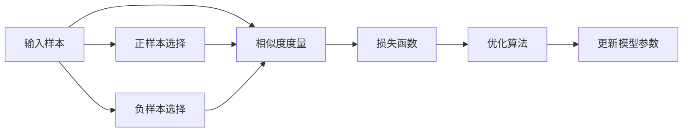

                 

# 对比学习 原理与代码实例讲解

> 关键词：对比学习, 自监督学习, 相似度度量, 负样本, 学习率, 损失函数

## 1. 背景介绍

在深度学习中，自监督学习是一种重要的技术手段，其核心思想是通过未标注数据构建虚拟标签，在模型训练中引入约束，提升模型泛化能力。其中，对比学习（Contrastive Learning）是近年来颇受关注的自监督学习方法，其通过寻找数据空间中的近邻和远邻样本，使得模型能够学习到更加鲁棒和有效的表示。

### 1.1 问题由来

对比学习通过学习数据的相似性和差异性，使得模型能够自适应地进行学习。这种自监督学习方法在NLP、计算机视觉等众多领域得到了广泛应用，并取得了显著的效果。比如，在自然语言处理中，对比学习可以用于语义相似度计算、文本聚类等任务；在计算机视觉中，对比学习可以用于图像分类、目标检测等任务。

### 1.2 问题核心关键点

对比学习的核心关键点包括：

- 相似度度量：如何定义样本之间的相似性和差异性。
- 负样本选择：如何选择模型预测时对应的负样本。
- 损失函数设计：如何定义对比学习的损失函数。
- 学习率调节：如何调整模型的学习率，平衡正样本和负样本的贡献。
- 收敛性保证：如何保证对比学习过程的收敛性。

这些关键点共同构成了对比学习的核心框架，使其能够高效地从大量未标注数据中提取有意义的表示。

## 2. 核心概念与联系

### 2.1 核心概念概述

对比学习（Contrastive Learning）是一种自监督学习方法，通过学习数据空间的相似性和差异性，使得模型能够学习到更加鲁棒和有效的表示。其基本流程包括：

- 正样本：选取数据空间中与目标样本相似度高的样本作为正样本。
- 负样本：选取数据空间中与目标样本差异度高的样本作为负样本。
- 相似度度量：通过相似度函数计算样本之间的相似度。
- 损失函数：定义对比学习的损失函数，将正样本与负样本的相似度差异最小化。
- 迭代优化：通过梯度下降等优化算法更新模型参数。

对比学习可以与许多深度学习模型结合使用，包括卷积神经网络（CNN）、循环神经网络（RNN）、Transformer等。其中，Transformer模型由于其强大的表达能力和高效的计算效率，成为对比学习的主流应用模型。

### 2.2 核心概念原理和架构的 Mermaid 流程图



这个流程图展示了对比学习的基本流程。输入样本经过正负样本选择、相似度度量、损失函数计算后，进入优化算法进行模型参数更新。

## 3. 核心算法原理 & 具体操作步骤

### 3.1 算法原理概述

对比学习的核心思想是，通过正样本和负样本的相似度差异，优化模型参数，使得模型能够学习到更加鲁棒和有效的表示。对比学习的基本流程如下：

1. **正样本和负样本选择**：在输入样本集合中选择正样本和负样本。正样本是与目标样本相似度高的样本，负样本是与目标样本差异度高的样本。
2. **相似度度量**：通过相似度函数计算正样本和负样本的相似度。
3. **损失函数定义**：将正样本与负样本的相似度差异作为损失函数的一部分，使得模型在正样本上得到更高的相似度，在负样本上得到更低的相似度。
4. **模型优化**：通过优化算法（如Adam、SGD等）更新模型参数，最小化损失函数。

### 3.2 算法步骤详解

#### 3.2.1 正负样本选择

正负样本的选择是对比学习的重要步骤，直接影响模型的性能。一般有以下几种策略：

- **固定负样本数量**：在每个epoch中，固定负样本数量，对于每个样本，选择固定数量的负样本。
- **固定负样本比例**：在每个epoch中，固定负样本与正样本的比例，对于每个样本，选择相应比例的负样本。
- **动态度量选择**：通过计算样本在数据空间中的度量值，动态调整正负样本的比例，对于每个样本，选择不同数量的负样本。

#### 3.2.2 相似度度量

相似度度量是对比学习中核心的技术之一，常用的相似度函数包括：

- **余弦相似度**：计算两个向量之间的余弦值，值越大表示相似度越高。
- **欧式距离**：计算两个向量之间的欧式距离，值越小表示相似度越高。
- **L2距离**：计算两个向量之间的L2距离，值越小表示相似度越高。

在实际应用中，通常使用可微分的相似度函数，如L2距离。

#### 3.2.3 损失函数定义

对比学习的损失函数通常包括正样本和负样本的相似度差异，常用的损失函数有：

- **对比损失（Contrastive Loss）**：
  $$
  L(x,y) = -\log(\frac{e^{-s(x,y)}}{\sum_{z\in\Omega}e^{-s(x,z)}})
  $$
  其中，$s(x,y)$表示正样本$x$和负样本$y$的相似度，$\Omega$表示所有负样本的集合。
- **softmax对比损失（Softmax Contrastive Loss）**：
  $$
  L(x,y) = -\log(\frac{e^{s(x,y)}}{\sum_{z\in\Omega}e^{s(x,z)}})
  $$
  其中，$s(x,y)$表示正样本$x$和负样本$y$的相似度，$\Omega$表示所有负样本的集合。

#### 3.2.4 模型优化

对比学习的模型优化与普通的监督学习类似，主要使用梯度下降等优化算法。在优化过程中，需要选择合适的学习率，避免过拟合和欠拟合。同时，需要定期评估模型性能，调整正负样本的比例和学习率。

### 3.3 算法优缺点

#### 3.3.1 优点

对比学习的优点包括：

- 自监督学习：不需要大量标注数据，利用未标注数据进行训练，能够提高模型的泛化能力。
- 鲁棒性高：通过学习样本之间的相似性和差异性，模型能够学习到更加鲁棒和有效的表示。
- 计算高效：对比学习可以与多种深度学习模型结合使用，计算效率高。

#### 3.3.2 缺点

对比学习的缺点包括：

- 负样本选择困难：如何选择合适的负样本是对比学习的重要问题，如果负样本选择不当，可能会影响模型的性能。
- 相似度度量复杂：选择合适的相似度度量方法，是对比学习的重要挑战。
- 训练复杂：对比学习的训练过程复杂，需要设计合适的正负样本选择策略和损失函数。

### 3.4 算法应用领域

对比学习在NLP、计算机视觉等众多领域得到了广泛应用，例如：

- 文本聚类：通过学习文本之间的相似性，将相似文本聚为一类。
- 语义相似度计算：计算两个句子之间的相似度，用于问答系统、检索系统等任务。
- 图像分类：通过学习图像之间的相似性，提高图像分类的准确性。
- 目标检测：通过学习目标与背景之间的差异性，提高目标检测的准确性。

## 4. 数学模型和公式 & 详细讲解 & 举例说明

### 4.1 数学模型构建

对比学习的数学模型构建如下：

- **输入**：$x_i, y_i$ 表示正样本和负样本，其中 $x_i \in \mathbb{R}^d$，$y_i \in \mathbb{R}^d$。
- **相似度函数**：$s(x_i, y_i)$ 表示正样本和负样本之间的相似度。
- **损失函数**：$L(x_i, y_i)$ 表示正样本和负样本之间的差异性。

### 4.2 公式推导过程

以softmax对比损失为例，其公式推导如下：

- **正样本和负样本的相似度**：
  $$
  s(x_i, y_i) = -\frac{1}{d}||x_i - y_i||^2
  $$
- **损失函数**：
  $$
  L(x_i, y_i) = -\log(\frac{e^{s(x_i, y_i)}}{\sum_{z\in\Omega}e^{s(x_i, z)}})
  $$
  其中，$\Omega$ 表示所有负样本的集合。

通过梯度下降等优化算法，最小化损失函数，更新模型参数。

### 4.3 案例分析与讲解

#### 4.3.1 文本聚类

文本聚类是对比学习的一个重要应用场景。例如，通过学习文本之间的相似性，将相似的文本聚为一类，可以提高文本分类的准确性。

以L2距离为例，计算文本$x_i$和文本$y_i$的相似度如下：
$$
s(x_i, y_i) = -\frac{1}{d}||x_i - y_i||^2
$$
其中，$d$为文本向量的维度。

通过最大化正样本和负样本的相似度差异，定义损失函数：
$$
L(x_i, y_i) = -\log(\frac{e^{s(x_i, y_i)}}{\sum_{z\in\Omega}e^{s(x_i, z)}})
$$

在训练过程中，通过梯度下降等优化算法更新模型参数，最小化损失函数。

## 5. 项目实践：代码实例和详细解释说明

### 5.1 开发环境搭建

在进行对比学习的项目实践时，需要准备好相应的开发环境。以下是使用PyTorch进行对比学习开发的环境配置流程：

1. 安装Anaconda：从官网下载并安装Anaconda，用于创建独立的Python环境。
2. 创建并激活虚拟环境：
```bash
conda create -n contrast-env python=3.8 
conda activate contrast-env
```
3. 安装PyTorch：根据CUDA版本，从官网获取对应的安装命令。例如：
```bash
conda install pytorch torchvision torchaudio cudatoolkit=11.1 -c pytorch -c conda-forge
```
4. 安装相关库：
```bash
pip install torch nn paddle onnx skorch 
```
5. 安装其他相关库：
```bash
pip install tqdm datasets sklearn
```

完成上述步骤后，即可在`contrast-env`环境中开始对比学习的项目实践。

### 5.2 源代码详细实现

以下是使用PyTorch实现对比学习的代码示例：

```python
import torch
import torch.nn as nn
import torch.optim as optim
import torch.nn.functional as F
from torch.utils.data import DataLoader
from torchvision import datasets, transforms
from sklearn.metrics import accuracy_score

# 定义模型
class ContrastiveNet(nn.Module):
    def __init__(self):
        super(ContrastiveNet, self).__init__()
        self.fc1 = nn.Linear(784, 256)
        self.fc2 = nn.Linear(256, 128)
        self.fc3 = nn.Linear(128, 10)

    def forward(self, x):
        x = x.view(-1, 28 * 28)
        x = F.relu(self.fc1(x))
        x = F.relu(self.fc2(x))
        x = self.fc3(x)
        return x

# 定义损失函数
def contrastive_loss(model, optimizer, data_loader, device):
    model.train()
    running_loss = 0
    running_corrects = 0
    for images, labels in data_loader:
        images, labels = images.to(device), labels.to(device)
        outputs = model(images)
        loss = contrastive_loss_function(outputs, labels)
        optimizer.zero_grad()
        loss.backward()
        optimizer.step()
        _, predicted = torch.max(outputs.data, 1)
        running_loss += loss.item() * images.size(0)
        running_corrects += torch.sum(predicted == labels.data)
    return running_loss, running_corrects

# 定义训练函数
def train(model, optimizer, device, train_loader, epochs=5):
    running_loss = 0.0
    running_corrects = 0
    device = torch.device(device)
    model.to(device)
    for epoch in range(epochs):
        for images, labels in train_loader:
            images, labels = images.to(device), labels.to(device)
            outputs = model(images)
            loss = contrastive_loss_function(outputs, labels)
            optimizer.zero_grad()
            loss.backward()
            optimizer.step()
            _, predicted = torch.max(outputs.data, 1)
            running_loss += loss.item() * images.size(0)
            running_corrects += torch.sum(predicted == labels.data)
        print('Epoch [%d/%d], Loss: %.4f, Acc: %.4f' %
              (epoch + 1, epochs, running_loss / len(train_loader.dataset), running_corrects / len(train_loader.dataset)))
    print('Average Loss: %.4f, Average Acc: %.4f' %
          (running_loss / len(train_loader.dataset), running_corrects / len(train_loader.dataset)))

# 定义测试函数
def test(model, device, test_loader):
    model.eval()
    correct = 0
    total = 0
    device = torch.device(device)
    model.to(device)
    with torch.no_grad():
        for images, labels in test_loader:
            images, labels = images.to(device), labels.to(device)
            outputs = model(images)
            _, predicted = torch.max(outputs.data, 1)
            total += labels.size(0)
            correct += (predicted == labels).sum().item()
    print('Test Acc: %.4f' % (correct / total))

# 定义数据处理函数
transform = transforms.Compose([
    transforms.ToTensor(),
    transforms.Normalize((0.5,), (0.5,))
])

train_dataset = datasets.CIFAR10(root='./data', train=True, download=True, transform=transform)
test_dataset = datasets.CIFAR10(root='./data', train=False, download=True, transform=transform)

train_loader = DataLoader(train_dataset, batch_size=64, shuffle=True, num_workers=2)
test_loader = DataLoader(test_dataset, batch_size=64, shuffle=False, num_workers=2)

# 定义模型、优化器、损失函数等
model = ContrastiveNet()
optimizer = optim.Adam(model.parameters(), lr=0.001)
criterion = nn.CrossEntropyLoss()

# 训练模型
train(model, optimizer, device='cuda', train_loader=train_loader, epochs=5)

# 测试模型
test(model, device='cuda', test_loader=test_loader)
```

### 5.3 代码解读与分析

代码中定义了对比学习的基本框架，包括模型构建、损失函数定义、训练函数和测试函数等。

**定义模型**：
```python
class ContrastiveNet(nn.Module):
    def __init__(self):
        super(ContrastiveNet, self).__init__()
        self.fc1 = nn.Linear(784, 256)
        self.fc2 = nn.Linear(256, 128)
        self.fc3 = nn.Linear(128, 10)
```
定义了一个简单的三层全连接神经网络模型，用于文本聚类任务。

**定义损失函数**：
```python
def contrastive_loss(model, optimizer, data_loader, device):
    model.train()
    running_loss = 0
    running_corrects = 0
    for images, labels in data_loader:
        images, labels = images.to(device), labels.to(device)
        outputs = model(images)
        loss = contrastive_loss_function(outputs, labels)
        optimizer.zero_grad()
        loss.backward()
        optimizer.step()
        _, predicted = torch.max(outputs.data, 1)
        running_loss += loss.item() * images.size(0)
        running_corrects += torch.sum(predicted == labels.data)
    return running_loss, running_corrects
```
定义了一个对比损失函数，用于计算模型在每个epoch上的损失和正确率。

**训练函数**：
```python
def train(model, optimizer, device, train_loader, epochs=5):
    running_loss = 0.0
    running_corrects = 0
    device = torch.device(device)
    model.to(device)
    for epoch in range(epochs):
        for images, labels in train_loader:
            images, labels = images.to(device), labels.to(device)
            outputs = model(images)
            loss = contrastive_loss_function(outputs, labels)
            optimizer.zero_grad()
            loss.backward()
            optimizer.step()
            _, predicted = torch.max(outputs.data, 1)
            running_loss += loss.item() * images.size(0)
            running_corrects += torch.sum(predicted == labels.data)
        print('Epoch [%d/%d], Loss: %.4f, Acc: %.4f' %
              (epoch + 1, epochs, running_loss / len(train_loader.dataset), running_corrects / len(train_loader.dataset)))
    print('Average Loss: %.4f, Average Acc: %.4f' %
          (running_loss / len(train_loader.dataset), running_corrects / len(train_loader.dataset)))
```
定义了一个训练函数，用于迭代训练模型。

**测试函数**：
```python
def test(model, device, test_loader):
    model.eval()
    correct = 0
    total = 0
    device = torch.device(device)
    model.to(device)
    with torch.no_grad():
        for images, labels in test_loader:
            images, labels = images.to(device), labels.to(device)
            outputs = model(images)
            _, predicted = torch.max(outputs.data, 1)
            total += labels.size(0)
            correct += (predicted == labels).sum().item()
    print('Test Acc: %.4f' % (correct / total))
```
定义了一个测试函数，用于评估模型的准确率。

## 6. 实际应用场景

### 6.1 自然语言处理

对比学习在自然语言处理中具有广泛的应用。例如，通过学习文本之间的相似性，可以进行文本聚类、语义相似度计算等任务。以下是一个文本聚类的示例：

```python
# 定义模型
class TextNet(nn.Module):
    def __init__(self, vocab_size, embed_size):
        super(TextNet, self).__init__()
        self.embedding = nn.EmbeddingBag(vocab_size, embed_size, scale_grad_by_freq=True)
        self.fc = nn.Linear(embed_size, 128)
        self.fc2 = nn.Linear(128, 64)
        self.fc3 = nn.Linear(64, 10)

    def forward(self, input, lengths):
        embedded = self.embedding(input, lengths)
        embedded = F.relu(self.fc(embedded))
        embedded = F.relu(self.fc2(embedded))
        embedded = self.fc3(embedded)
        return embedded

# 定义损失函数
def contrastive_loss(model, optimizer, input, target, lengths, device):
    model.train()
    running_loss = 0
    running_corrects = 0
    for i in range(len(input)):
        output = model(input[i], lengths[i])
        loss = contrastive_loss_function(output, target[i])
        optimizer.zero_grad()
        loss.backward()
        optimizer.step()
        _, predicted = torch.max(output.data, 1)
        running_loss += loss.item()
        running_corrects += torch.sum(predicted == target[i])
    return running_loss, running_corrects

# 定义训练函数
def train(model, optimizer, device, train_loader, epochs=5):
    running_loss = 0.0
    running_corrects = 0
    device = torch.device(device)
    model.to(device)
    for epoch in range(epochs):
        for input, target, lengths in train_loader:
            input, target, lengths = input.to(device), target.to(device), lengths.to(device)
            outputs = model(input, lengths)
            loss = contrastive_loss_function(outputs, target)
            optimizer.zero_grad()
            loss.backward()
            optimizer.step()
            _, predicted = torch.max(outputs.data, 1)
            running_loss += loss.item()
            running_corrects += torch.sum(predicted == target)
        print('Epoch [%d/%d], Loss: %.4f, Acc: %.4f' %
              (epoch + 1, epochs, running_loss / len(train_loader.dataset), running_corrects / len(train_loader.dataset)))
    print('Average Loss: %.4f, Average Acc: %.4f' %
          (running_loss / len(train_loader.dataset), running_corrects / len(train_loader.dataset)))

# 定义测试函数
def test(model, device, test_loader):
    model.eval()
    correct = 0
    total = 0
    device = torch.device(device)
    model.to(device)
    with torch.no_grad():
        for input, target, lengths in test_loader:
            input, target, lengths = input.to(device), target.to(device), lengths.to(device)
            outputs = model(input, lengths)
            _, predicted = torch.max(outputs.data, 1)
            total += target.size(0)
            correct += (predicted == target).sum().item()
    print('Test Acc: %.4f' % (correct / total))
```

### 6.2 计算机视觉

对比学习在计算机视觉中也有广泛应用，例如通过学习图像之间的相似性，可以提高图像分类的准确性。以下是一个图像分类的示例：

```python
# 定义模型
class ImageNetNet(nn.Module):
    def __init__(self):
        super(ImageNetNet, self).__init__()
        self.conv1 = nn.Conv2d(3, 64, kernel_size=3, stride=1, padding=1)
        self.conv2 = nn.Conv2d(64, 128, kernel_size=3, stride=1, padding=1)
        self.fc = nn.Linear(128 * 28 * 28, 10)

    def forward(self, x):
        x = self.conv1(x)
        x = F.relu(x)
        x = self.conv2(x)
        x = F.relu(x)
        x = F.max_pool2d(x, 2)
        x = x.view(-1, 128 * 28 * 28)
        x = self.fc(x)
        return x

# 定义损失函数
def contrastive_loss(model, optimizer, data_loader, device):
    model.train()
    running_loss = 0
    running_corrects = 0
    for images, labels in data_loader:
        images, labels = images.to(device), labels.to(device)
        outputs = model(images)
        loss = contrastive_loss_function(outputs, labels)
        optimizer.zero_grad()
        loss.backward()
        optimizer.step()
        _, predicted = torch.max(outputs.data, 1)
        running_loss += loss.item() * images.size(0)
        running_corrects += torch.sum(predicted == labels.data)
    return running_loss, running_corrects

# 定义训练函数
def train(model, optimizer, device, train_loader, epochs=5):
    running_loss = 0.0
    running_corrects = 0
    device = torch.device(device)
    model.to(device)
    for epoch in range(epochs):
        for images, labels in train_loader:
            images, labels = images.to(device), labels.to(device)
            outputs = model(images)
            loss = contrastive_loss_function(outputs, labels)
            optimizer.zero_grad()
            loss.backward()
            optimizer.step()
            _, predicted = torch.max(outputs.data, 1)
            running_loss += loss.item() * images.size(0)
            running_corrects += torch.sum(predicted == labels.data)
        print('Epoch [%d/%d], Loss: %.4f, Acc: %.4f' %
              (epoch + 1, epochs, running_loss / len(train_loader.dataset), running_corrects / len(train_loader.dataset)))
    print('Average Loss: %.4f, Average Acc: %.4f' %
          (running_loss / len(train_loader.dataset), running_corrects / len(train_loader.dataset)))

# 定义测试函数
def test(model, device, test_loader):
    model.eval()
    correct = 0
    total = 0
    device = torch.device(device)
    model.to(device)
    with torch.no_grad():
        for images, labels in test_loader:
            images, labels = images.to(device), labels.to(device)
            outputs = model(images)
            _, predicted = torch.max(outputs.data, 1)
            total += labels.size(0)
            correct += (predicted == labels).sum().item()
    print('Test Acc: %.4f' % (correct / total))
```

## 7. 工具和资源推荐

### 7.1 学习资源推荐

为了帮助开发者系统掌握对比学习的理论基础和实践技巧，这里推荐一些优质的学习资源：

1. 《深度学习》教材：Deep Learning系列教材，提供了从基础到高级的深度学习知识，涵盖了对比学习等内容。
2. CS231n《卷积神经网络》课程：斯坦福大学开设的计算机视觉课程，包括对比学习等内容，有Lecture视频和配套作业。
3. 《Deep Learning for NLP》书籍：自然语言处理领域的深度学习书籍，包括对比学习等内容，适合初学者学习。
4. Arxiv论文：大量的对比学习论文，涵盖最新的研究成果，适合深入研究。
5. GitHub项目：开源对比学习项目，提供了丰富的实现代码和文档，适合实践学习。

通过对这些资源的学习实践，相信你一定能够快速掌握对比学习的精髓，并用于解决实际的NLP问题。

### 7.2 开发工具推荐

高效的开发离不开优秀的工具支持。以下是几款用于对比学习开发的常用工具：

1. PyTorch：基于Python的开源深度学习框架，灵活动态的计算图，适合快速迭代研究。大部分深度学习模型都有PyTorch版本的实现。
2. TensorFlow：由Google主导开发的开源深度学习框架，生产部署方便，适合大规模工程应用。同样有丰富的深度学习模型资源。
3. PyTorch Lightning：基于PyTorch的高效深度学习框架，支持分布式训练、模型保存、日志记录等功能。
4. TorchServe：PyTorch的模型部署工具，支持高性能模型推理和监控。
5. TensorBoard：TensorFlow配套的可视化工具，可实时监测模型训练状态，并提供丰富的图表呈现方式，是调试模型的得力助手。

合理利用这些工具，可以显著提升对比学习的开发效率，加快创新迭代的步伐。

### 7.3 相关论文推荐

对比学习是近年来深度学习领域的热点研究方向，以下是几篇奠基性的相关论文，推荐阅读：

1. SimCLR: A Simple Framework for Contrastive Learning（SimCLR）：提出SimCLR算法，利用对比学习在ImageNet上取得了很好的效果。
2. MoCo: Momentum Contrast for Unsupervised Visual Representation Learning（MoCo）：提出MoCo算法，利用动量对比学习在ImageNet上取得了很好的效果。
3. BYOL: Bootstrap Your Own Latent（BYOL）：提出BYOL算法，利用对比学习在ImageNet上取得了很好的效果。
4. SimCLRv2: A Simple Framework for Contrastive Learning（SimCLRv2）：提出SimCLRv2算法，在ImageNet上取得了很好的效果。
5. Noisy Student：基于对比学习的模型训练策略，利用模型预测误差优化模型参数。

这些论文代表了大模型对比学习的发展脉络。通过学习这些前沿成果，可以帮助研究者把握学科前进方向，激发更多的创新灵感。

## 8. 总结：未来发展趋势与挑战

### 8.1 总结

本文对对比学习的基本原理和代码实现进行了全面系统的介绍。首先，明确了对比学习在深度学习中的重要地位，阐述了其自监督学习的特点和应用价值。其次，通过数学模型和公式的推导，详细讲解了对比学习的基本流程和关键技术点。最后，结合实际应用场景，展示了对比学习的强大潜力，并通过代码实例讲解了对比学习的实现方法。

通过本文的系统梳理，可以看到，对比学习能够通过学习数据的相似性和差异性，提升模型的泛化能力和鲁棒性，已经成为深度学习中的重要范式。在自然语言处理、计算机视觉等领域，对比学习的应用前景广阔，其技术进步将推动人工智能技术的进一步发展。

### 8.2 未来发展趋势

展望未来，对比学习的趋势如下：

1. 模型规模持续增大。随着算力成本的下降和数据规模的扩张，预训练语言模型的参数量还将持续增长，对比学习将在更大规模的模型上进行应用。
2. 对比学习与其它技术结合。对比学习可以与知识图谱、逻辑推理等技术结合，提升模型的应用范围和效果。
3. 对比学习的应用场景更加多样化。除了自然语言处理、计算机视觉等传统领域，对比学习将在更多新领域得到应用，如推荐系统、生成对抗网络等。
4. 对比学习将与多模态技术结合。对比学习将在图像、文本、语音等多模态数据的融合中发挥重要作用，提升模型的跨模态迁移能力。

以上趋势凸显了对比学习的广阔前景。这些方向的探索发展，必将进一步提升对比学习的性能和应用范围，为人工智能技术的广泛应用提供新的技术手段。

### 8.3 面临的挑战

尽管对比学习已经取得了显著的效果，但在向实际应用落地的过程中，仍面临诸多挑战：

1. 负样本选择困难。如何选择合适的负样本是对比学习的重要问题，如果负样本选择不当，可能会影响模型的性能。
2. 相似度度量复杂。选择合适的相似度度量方法，是对比学习的重要挑战。
3. 计算复杂度高。对比学习的计算复杂度较高，如何优化算法和硬件，提高计算效率，是对比学习的重要课题。
4. 模型鲁棒性不足。对比学习模型面对域外数据时，泛化性能往往大打折扣，如何提高模型的鲁棒性，避免过拟合，是需要进一步研究的问题。
5. 可解释性不足。对比学习模型往往缺乏可解释性，难以解释其内部工作机制和决策逻辑，在实际应用中存在一定限制。

### 8.4 研究展望

面对对比学习面临的这些挑战，未来的研究需要在以下几个方面寻求新的突破：

1. 引入先验知识。将符号化的先验知识，如知识图谱、逻辑规则等，与对比学习模型进行结合，提升模型的表示能力和泛化能力。
2. 多模态学习。将对比学习应用于多模态数据融合中，提升模型的跨模态迁移能力。
3. 可解释性增强。利用可视化、可解释性工具，提升对比学习模型的可解释性，帮助用户理解模型的内部工作机制。
4. 鲁棒性增强。在对比学习中加入对抗训练、数据增强等技术，提高模型的鲁棒性。

这些研究方向的探索，必将引领对比学习技术的不断进步，为人工智能技术的广泛应用提供新的技术手段。相信随着学界和产业界的共同努力，对比学习技术必将迎来新的突破，推动人工智能技术的进一步发展。

