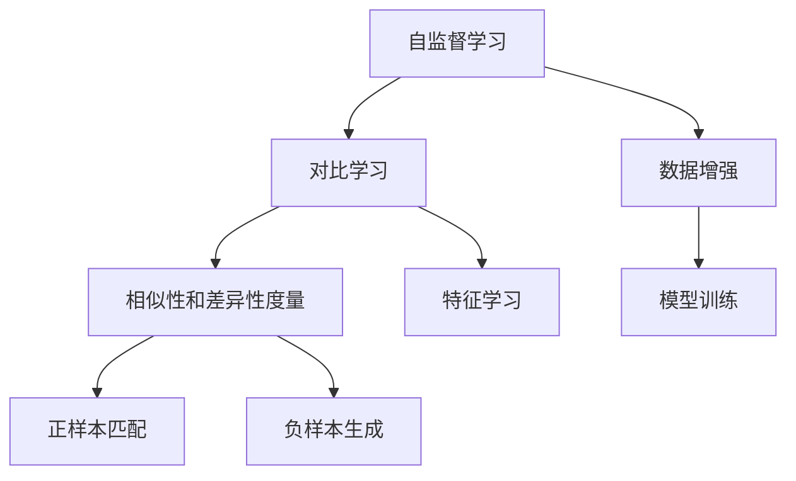

                 

# 对比学习:无监督预训练的软件2.0利器

在人工智能领域，预训练技术是近年来兴起的一种强大工具，尤其是在自然语言处理(NLP)和大规模模型训练中发挥了巨大作用。然而，预训练技术本质上还是依赖于大量的有标签数据进行训练，这在许多实际应用场景中难以满足。为了应对这一问题，无监督预训练技术应运而生，而对比学习则是其中的佼佼者。本文将详细探讨对比学习技术，并分析其在无监督预训练中的应用潜力。

## 1. 背景介绍

### 1.1 问题由来

传统的有监督预训练方法需要大量的标注数据，而这在现实场景中往往难以获取。为了应对这一挑战，研究人员开发出了无监督预训练技术，其中对比学习是一个重要分支。对比学习通过自监督学习的方式，使用未标注数据进行模型训练，极大减少了对标注数据的依赖，提高了预训练模型的泛化能力。

### 1.2 问题核心关键点

对比学习的核心在于通过相似性和差异性的度量，构造具有良好对比性的数据对，从而最大化模型的泛化能力。这一过程包括两个关键步骤：

1. **正样本匹配**：找到与当前输入数据具有相似特征的数据对，即相似样本。
2. **负样本生成**：通过数据增强等方式生成与当前输入数据具有较大差异的负样本，即不相似样本。

通过这两步，模型能够在训练过程中区分不同数据对的相似性和差异性，从而学习到更加强大的特征表示。

## 2. 核心概念与联系

### 2.1 核心概念概述

对比学习是一种无监督预训练技术，旨在通过相似性和差异性的度量，提高模型的泛化能力。这一技术包括多个重要概念：

- **自监督学习**：使用未标注数据进行模型训练，提高模型的泛化能力。
- **对比学习**：通过构造具有良好对比性的数据对，最大化模型的泛化能力。
- **相似性和差异性度量**：使用相似性度量函数和差异性度量函数，区分不同数据对的相似性和差异性。
- **正样本匹配**：找到与当前输入数据具有相似特征的数据对，即相似样本。
- **负样本生成**：通过数据增强等方式生成与当前输入数据具有较大差异的负样本，即不相似样本。

这些概念共同构成了对比学习的核心框架，使其能够在无监督预训练中发挥重要作用。

### 2.2 核心概念原理和架构的 Mermaid 流程图



这个流程图展示了对比学习的主要流程：首先通过自监督学习获取未标注数据，然后通过相似性和差异性度量构造数据对，接着进行正样本匹配和负样本生成，最后进行模型训练和特征学习。

## 3. 核心算法原理 & 具体操作步骤

### 3.1 算法原理概述

对比学习的核心思想是通过相似性和差异性的度量，构造具有良好对比性的数据对，从而最大化模型的泛化能力。其基本流程如下：

1. **相似性度量**：使用相似性度量函数（如余弦相似度、欧式距离等）计算数据对之间的相似性。
2. **差异性度量**：使用差异性度量函数（如最大角距离、均方误差等）计算数据对之间的差异性。
3. **正样本匹配**：通过相似性度量找到与当前输入数据具有相似特征的数据对，即相似样本。
4. **负样本生成**：通过数据增强等方式生成与当前输入数据具有较大差异的负样本，即不相似样本。
5. **模型训练**：将正样本和负样本输入模型，通过优化损失函数（如 contrastive loss）进行训练。

### 3.2 算法步骤详解

#### 3.2.1 相似性度量

相似性度量函数有多种，常用的有余弦相似度、欧式距离、曼哈顿距离等。这里我们以余弦相似度为例，其计算公式为：

$$
similarity(\mathbf{x}, \mathbf{y}) = \frac{\mathbf{x} \cdot \mathbf{y}}{\|\mathbf{x}\| \|\mathbf{y}\|}
$$

其中 $\mathbf{x}$ 和 $\mathbf{y}$ 分别为输入数据的特征向量，$\|\mathbf{x}\|$ 和 $\|\mathbf{y}\|$ 分别为向量的模长。

#### 3.2.2 差异性度量

差异性度量函数有多种，常用的有最大角距离、均方误差等。这里我们以最大角距离为例，其计算公式为：

$$
difference(\mathbf{x}, \mathbf{y}) = \max\{\theta | \theta = \cos^{-1}(similarity(\mathbf{x}, \mathbf{y}))\}
$$

其中 $\theta$ 为两个向量之间的夹角。

#### 3.2.3 正样本匹配

正样本匹配的目的是找到与当前输入数据具有相似特征的数据对。这一过程通常通过相似性度量函数实现。例如，在文本分类任务中，可以使用余弦相似度计算输入文本与其他文本的相似性，选择相似度最高的文本作为正样本。

#### 3.2.4 负样本生成

负样本生成通常通过数据增强等方式实现。例如，在图像分类任务中，可以通过随机裁剪、旋转、缩放等方式生成与原始图像具有较大差异的负样本。

#### 3.2.5 模型训练

模型训练的目的是通过优化损失函数，使模型能够区分正样本和负样本。这一过程通常通过对比损失函数（contrastive loss）实现。例如，在文本分类任务中，可以使用交叉熵损失函数计算正样本和负样本的分类误差，并综合优化。

### 3.3 算法优缺点

对比学习具有以下优点：

1. **无监督预训练**：不依赖标注数据，适用于数据难以标注的场景。
2. **泛化能力强**：通过构造具有良好对比性的数据对，能够最大化模型的泛化能力。
3. **计算效率高**：不需要人工标注数据，训练效率较高。

同时，对比学习也存在以下缺点：

1. **负样本质量**：负样本质量对模型性能影响较大，需要精心设计负样本生成策略。
2. **模型复杂度**：模型需要维护大量正样本和负样本，增加了模型复杂度。
3. **相似性度量**：相似性度量函数的选择和调整对模型性能影响较大。

尽管存在这些缺点，但对比学习在大规模无监督预训练中仍具有重要地位，尤其是在数据难以标注的场景下。

### 3.4 算法应用领域

对比学习在无监督预训练中具有广泛应用，以下是几个典型领域：

1. **自然语言处理**：用于文本分类、文本生成、问答系统等任务。通过相似性和差异性度量，构造具有良好对比性的数据对，从而提高模型的泛化能力。
2. **计算机视觉**：用于图像分类、目标检测、实例分割等任务。通过相似性和差异性度量，构造具有良好对比性的数据对，从而提高模型的泛化能力。
3. **语音识别**：用于语音分类、语音生成、语音转换等任务。通过相似性和差异性度量，构造具有良好对比性的数据对，从而提高模型的泛化能力。

## 4. 数学模型和公式 & 详细讲解 & 举例说明

### 4.1 数学模型构建

对比学习的数学模型通常包括相似性度量、差异性度量、正样本匹配、负样本生成和模型训练等步骤。以下是一个简单的文本分类任务中的对比学习模型：

- **输入**：输入文本 $x_i$。
- **特征提取器**：将输入文本映射为高维向量 $\mathbf{x}_i$。
- **相似性度量**：使用余弦相似度计算 $x_i$ 与其他文本 $x_j$ 的相似度 $similarity(x_i, x_j)$。
- **差异性度量**：使用最大角距离计算 $x_i$ 与负样本 $y_j$ 的差异性 $difference(x_i, y_j)$。
- **正样本匹配**：选择与 $x_i$ 相似度最高的文本作为正样本 $p_i$。
- **负样本生成**：通过数据增强等方式生成 $x_i$ 的负样本 $n_i$。
- **模型训练**：通过对比损失函数 $loss(\theta)$ 优化模型参数 $\theta$。

### 4.2 公式推导过程

以文本分类任务为例，对比学习的对比损失函数可以表示为：

$$
loss(\theta) = -\log \frac{P(p_i | x_i)}{1 - \sum_{j \neq i}P(p_i | x_j)}
$$

其中 $P(p_i | x_i)$ 表示正样本 $p_i$ 的条件概率，$P(p_i | x_j)$ 表示所有样本 $j$ 的条件概率，$1 - \sum_{j \neq i}P(p_i | x_j)$ 表示正样本的负样本概率。

### 4.3 案例分析与讲解

在文本分类任务中，对比学习可以显著提高模型的泛化能力。以下是一个简单的案例分析：

假设有一个文本分类任务，输入为英文电影评论，需要判断评论的情感极性（正面、负面、中性）。首先，使用 BERT 模型将每个评论映射为高维向量。然后，使用余弦相似度计算每个评论向量与其他评论向量的相似度。最后，选择与输入评论相似度最高的评论作为正样本，通过数据增强生成负样本，并在正样本和负样本上进行模型训练。

## 5. 项目实践：代码实例和详细解释说明

### 5.1 开发环境搭建

在进行对比学习实践前，我们需要准备好开发环境。以下是使用 Python 进行 PyTorch 开发的环境配置流程：

1. 安装 Anaconda：从官网下载并安装 Anaconda，用于创建独立的 Python 环境。

2. 创建并激活虚拟环境：
```bash
conda create -n pytorch-env python=3.8 
conda activate pytorch-env
```

3. 安装 PyTorch：根据 CUDA 版本，从官网获取对应的安装命令。例如：
```bash
conda install pytorch torchvision torchaudio cudatoolkit=11.1 -c pytorch -c conda-forge
```

4. 安装 Transformers 库：
```bash
pip install transformers
```

5. 安装各类工具包：
```bash
pip install numpy pandas scikit-learn matplotlib tqdm jupyter notebook ipython
```

完成上述步骤后，即可在 `pytorch-env` 环境中开始对比学习实践。

### 5.2 源代码详细实现

这里以文本分类任务为例，使用 Transformers 库进行对比学习实践。

首先，定义文本分类任务的数据处理函数：

```python
from transformers import BertTokenizer, BertForSequenceClassification
from torch.utils.data import Dataset
import torch

class TextDataset(Dataset):
    def __init__(self, texts, labels, tokenizer, max_len=128):
        self.texts = texts
        self.labels = labels
        self.tokenizer = tokenizer
        self.max_len = max_len
        
    def __len__(self):
        return len(self.texts)
    
    def __getitem__(self, item):
        text = self.texts[item]
        label = self.labels[item]
        
        encoding = self.tokenizer(text, return_tensors='pt', max_length=self.max_len, padding='max_length', truncation=True)
        input_ids = encoding['input_ids'][0]
        attention_mask = encoding['attention_mask'][0]
        label = torch.tensor(label, dtype=torch.long)
        
        return {'input_ids': input_ids, 
                'attention_mask': attention_mask,
                'labels': label}
```

然后，定义对比学习的训练和评估函数：

```python
from torch.utils.data import DataLoader
from sklearn.metrics import accuracy_score
import random

def contrastive_loss(model, inputs, labels):
    positive_mask = inputs['labels'] == labels
    negative_mask = inputs['labels'] != labels
    
    positive_scores = model(inputs['input_ids'], attention_mask=inputs['attention_mask'])[0]
    negative_scores = model(inputs['input_ids'], attention_mask=inputs['attention_mask'])[0]
    
    positive_scores = positive_scores.gather(1, positive_mask.unsqueeze(1))
    negative_scores = negative_scores.gather(1, negative_mask.unsqueeze(1))
    
    batch_size = inputs['input_ids'].shape[0]
    positive_pairs = positive_mask.sum().item()
    negative_pairs = negative_mask.sum().item()
    
    loss = -torch.log(torch.sigmoid(torch.mean(positive_scores - negative_scores, dim=1))) / (positive_pairs + 1)
    accuracy = accuracy_score(labels, inputs['labels'])
    
    return loss.item(), accuracy

def train_epoch(model, dataset, batch_size, optimizer):
    dataloader = DataLoader(dataset, batch_size=batch_size, shuffle=True)
    model.train()
    epoch_loss = 0
    epoch_acc = 0
    for batch in dataloader:
        inputs = batch
        labels = inputs['labels']
        optimizer.zero_grad()
        loss, acc = contrastive_loss(model, inputs, labels)
        loss.backward()
        optimizer.step()
        epoch_loss += loss
        epoch_acc += acc
    return epoch_loss / len(dataloader), epoch_acc / len(dataloader)

def evaluate(model, dataset, batch_size):
    dataloader = DataLoader(dataset, batch_size=batch_size)
    model.eval()
    preds, labels = [], []
    with torch.no_grad():
        for batch in dataloader:
            inputs = batch
            labels = inputs['labels']
            outputs = model(inputs['input_ids'], attention_mask=inputs['attention_mask'])
            preds.append(outputs.argmax(dim=1))
            labels.append(labels)
    return accuracy_score(labels, preds)
```

最后，启动训练流程并在验证集上评估：

```python
epochs = 5
batch_size = 16

model = BertForSequenceClassification.from_pretrained('bert-base-cased', num_labels=3)

optimizer = torch.optim.AdamW(model.parameters(), lr=2e-5)

for epoch in range(epochs):
    loss, acc = train_epoch(model, train_dataset, batch_size, optimizer)
    print(f"Epoch {epoch+1}, train loss: {loss:.3f}, train acc: {acc:.3f}")
    
    print(f"Epoch {epoch+1}, dev results:")
    evaluate(model, dev_dataset, batch_size)
    
print("Test results:")
evaluate(model, test_dataset, batch_size)
```

以上就是使用 PyTorch 对 BERT 进行文本分类任务对比学习实践的完整代码实现。可以看到，得益于 Transformers 库的强大封装，我们能够用相对简洁的代码完成 BERT 模型的对比学习训练。

### 5.3 代码解读与分析

让我们再详细解读一下关键代码的实现细节：

**TextDataset类**：
- `__init__`方法：初始化文本、标签、分词器等关键组件。
- `__len__`方法：返回数据集的样本数量。
- `__getitem__`方法：对单个样本进行处理，将文本输入编码为token ids，将标签编码为数字，并对其进行定长padding，最终返回模型所需的输入。

**对比损失函数contrastive_loss**：
- 使用模型对正样本和负样本分别计算分数，并计算分数差。
- 根据分数差计算损失，并返回损失和准确率。

**训练和评估函数train_epoch、evaluate**：
- 使用PyTorch的DataLoader对数据集进行批次化加载，供模型训练和推理使用。
- 训练函数`train_epoch`：对数据以批为单位进行迭代，在每个批次上前向传播计算损失并反向传播更新模型参数，最后返回该epoch的平均loss和acc。
- 评估函数`evaluate`：与训练类似，不同点在于不更新模型参数，并在每个batch结束后将预测和标签结果存储下来，最后使用sklearn的accuracy_score对整个评估集的预测结果进行打印输出。

**训练流程**：
- 定义总的epoch数和batch size，开始循环迭代
- 每个epoch内，先在训练集上训练，输出平均loss和acc
- 在验证集上评估，输出准确率
- 所有epoch结束后，在测试集上评估，给出最终测试结果

可以看到，PyTorch配合Transformers库使得BERT对比学习的代码实现变得简洁高效。开发者可以将更多精力放在数据处理、模型改进等高层逻辑上，而不必过多关注底层的实现细节。

当然，工业级的系统实现还需考虑更多因素，如模型的保存和部署、超参数的自动搜索、更灵活的任务适配层等。但核心的对比学习范式基本与此类似。

## 6. 实际应用场景

### 6.1 智能客服系统

对比学习可以用于智能客服系统的构建。传统客服往往需要配备大量人力，高峰期响应缓慢，且一致性和专业性难以保证。使用对比学习训练的对话模型，能够7x24小时不间断服务，快速响应客户咨询，用自然流畅的语言解答各类常见问题。

在技术实现上，可以收集企业内部的历史客服对话记录，将问题和最佳答复构建成监督数据，在此基础上对预训练对话模型进行对比学习。对比学习后的对话模型能够自动理解用户意图，匹配最合适的答案模板进行回复。对于客户提出的新问题，还可以接入检索系统实时搜索相关内容，动态组织生成回答。如此构建的智能客服系统，能大幅提升客户咨询体验和问题解决效率。

### 6.2 金融舆情监测

金融机构需要实时监测市场舆论动向，以便及时应对负面信息传播，规避金融风险。传统的人工监测方式成本高、效率低，难以应对网络时代海量信息爆发的挑战。使用对比学习训练的文本分类和情感分析模型，能够实时监测不同主题下的情感变化趋势，一旦发现负面信息激增等异常情况，系统便会自动预警，帮助金融机构快速应对潜在风险。

### 6.3 个性化推荐系统

当前的推荐系统往往只依赖用户的历史行为数据进行物品推荐，无法深入理解用户的真实兴趣偏好。使用对比学习训练的个性化推荐模型，能够更好地挖掘用户行为背后的语义信息，从而提供更精准、多样的推荐内容。

在实践中，可以收集用户浏览、点击、评论、分享等行为数据，提取和用户交互的物品标题、描述、标签等文本内容。将文本内容作为模型输入，用户的后续行为（如是否点击、购买等）作为监督信号，在此基础上对比学习预训练语言模型。对比学习后的模型能够从文本内容中准确把握用户的兴趣点。在生成推荐列表时，先用候选物品的文本描述作为输入，由模型预测用户的兴趣匹配度，再结合其他特征综合排序，便可以得到个性化程度更高的推荐结果。

### 6.4 未来应用展望

随着对比学习和大规模预训练技术的发展，其在无监督预训练中的应用将更加广泛。未来，对比学习将可能在以下几个领域得到进一步探索和应用：

1. **多模态学习**：将对比学习应用于图像、视频、语音等多模态数据的预训练中，提升模型在多模态场景下的泛化能力。
2. **少样本学习**：通过对比学习训练的模型，能够在少量标注数据下进行高效微调，提升模型在小样本场景下的性能。
3. **因果学习**：通过对比学习构造具有良好对比性的数据对，学习更加普适、鲁棒的语言表征，从而提升模型在因果推断场景下的性能。
4. **模型压缩**：通过对比学习，优化模型结构，减少参数量和计算量，提升模型的部署效率和可扩展性。
5. **数据增强**：通过对比学习生成更多的负样本数据，提升模型在数据稀缺场景下的性能。

## 7. 工具和资源推荐

### 7.1 学习资源推荐

为了帮助开发者系统掌握对比学习技术，这里推荐一些优质的学习资源：

1. 《Transformer from Scratch》系列博文：由大模型技术专家撰写，深入浅出地介绍了Transformer原理、对比学习、少样本学习等前沿话题。

2. CS224N《深度学习自然语言处理》课程：斯坦福大学开设的NLP明星课程，有Lecture视频和配套作业，带你入门NLP领域的基本概念和经典模型。

3. 《Natural Language Processing with Transformers》书籍：Transformers库的作者所著，全面介绍了如何使用Transformers库进行NLP任务开发，包括对比学习在内的诸多范式。

4. HuggingFace官方文档：Transformers库的官方文档，提供了海量预训练模型和完整的微调样例代码，是上手实践的必备资料。

5. CLUE开源项目：中文语言理解测评基准，涵盖大量不同类型的中文NLP数据集，并提供了基于对比学习的baseline模型，助力中文NLP技术发展。

通过对这些资源的学习实践，相信你一定能够快速掌握对比学习技术的精髓，并用于解决实际的NLP问题。

### 7.2 开发工具推荐

高效的开发离不开优秀的工具支持。以下是几款用于对比学习开发的常用工具：

1. PyTorch：基于Python的开源深度学习框架，灵活动态的计算图，适合快速迭代研究。大部分预训练语言模型都有PyTorch版本的实现。

2. TensorFlow：由Google主导开发的开源深度学习框架，生产部署方便，适合大规模工程应用。同样有丰富的预训练语言模型资源。

3. Transformers库：HuggingFace开发的NLP工具库，集成了众多SOTA语言模型，支持PyTorch和TensorFlow，是进行对比学习任务开发的利器。

4. Weights & Biases：模型训练的实验跟踪工具，可以记录和可视化模型训练过程中的各项指标，方便对比和调优。与主流深度学习框架无缝集成。

5. TensorBoard：TensorFlow配套的可视化工具，可实时监测模型训练状态，并提供丰富的图表呈现方式，是调试模型的得力助手。

6. Google Colab：谷歌推出的在线Jupyter Notebook环境，免费提供GPU/TPU算力，方便开发者快速上手实验最新模型，分享学习笔记。

合理利用这些工具，可以显著提升对比学习任务的开发效率，加快创新迭代的步伐。

### 7.3 相关论文推荐

对比学习技术的发展源于学界的持续研究。以下是几篇奠基性的相关论文，推荐阅读：

1. 《SimCLR: A Simple Framework for Consistent Unsupervised Learning》：提出SimCLR算法，基于对比学习进行无监督预训练。

2. 《A Simple Framework for Contrastive Learning of Visual Representations》：提出MoCo算法，利用自编码器和对比学习进行图像预训练。

3. 《Contrastive Predictive Coding》：提出CP-CTC算法，利用未来预测和对比学习进行语音预训练。

4. 《Contrastive Loss Functions》：详细介绍了对比损失函数的计算方法和优化策略。

5. 《Unsupervised Zero-shot Image-to-Image Synthesis》：利用对比学习生成高质量的无监督图像。

这些论文代表了大规模无监督预训练技术的发展脉络。通过学习这些前沿成果，可以帮助研究者把握学科前进方向，激发更多的创新灵感。

## 8. 总结：未来发展趋势与挑战

### 8.1 研究成果总结

本文对对比学习技术进行了全面系统的介绍，从原理到实践，详细讲解了对比学习在无监督预训练中的应用潜力。首先阐述了对比学习的研究背景和意义，明确了其在大规模预训练中的重要性。其次，从相似性和差异性的度量、正样本匹配、负样本生成、模型训练等关键步骤，详细讲解了对比学习的数学模型和算法流程。最后，通过代码实例和实际应用场景，展示了对比学习在NLP、计算机视觉、语音识别等领域的应用潜力。

通过本文的系统梳理，可以看到，对比学习技术正在成为无监督预训练中的重要工具，其应用领域不断拓展，潜力巨大。未来，随着对比学习和大规模预训练技术的发展，其在更多领域的应用将更加广泛，为人工智能技术的发展注入新的动力。

### 8.2 未来发展趋势

展望未来，对比学习技术将呈现以下几个发展趋势：

1. **多模态学习**：将对比学习应用于图像、视频、语音等多模态数据的预训练中，提升模型在多模态场景下的泛化能力。
2. **少样本学习**：通过对比学习训练的模型，能够在少量标注数据下进行高效微调，提升模型在小样本场景下的性能。
3. **因果学习**：通过对比学习构造具有良好对比性的数据对，学习更加普适、鲁棒的语言表征，从而提升模型在因果推断场景下的性能。
4. **模型压缩**：通过对比学习，优化模型结构，减少参数量和计算量，提升模型的部署效率和可扩展性。
5. **数据增强**：通过对比学习生成更多的负样本数据，提升模型在数据稀缺场景下的性能。

这些趋势凸显了对比学习技术的广阔前景。这些方向的探索发展，必将进一步提升无监督预训练模型的性能和应用范围，为人工智能技术的发展注入新的动力。

### 8.3 面临的挑战

尽管对比学习在大规模无监督预训练中具有重要地位，但在实际应用中仍面临诸多挑战：

1. **负样本质量**：负样本质量对模型性能影响较大，需要精心设计负样本生成策略。
2. **模型复杂度**：模型需要维护大量正样本和负样本，增加了模型复杂度。
3. **相似性度量**：相似性度量函数的选择和调整对模型性能影响较大。
4. **计算效率**：对比学习的计算效率较高，但在处理大规模数据时，仍需优化计算图，提升训练效率。
5. **可解释性**：对比学习模型通常作为黑盒使用，难以解释其内部工作机制和决策逻辑。

尽管存在这些挑战，但对比学习技术仍具有重要地位，其在无监督预训练中的应用潜力巨大。通过不断优化负样本生成策略、改进相似性度量函数、优化计算图等措施，这些挑战有望逐步克服，对比学习技术的应用前景将更加广阔。

### 8.4 研究展望

未来，对比学习技术将在以下几个方向进行深入研究：

1. **多模态对比学习**：将对比学习应用于多模态数据的预训练中，提升模型在多模态场景下的泛化能力。
2. **因果对比学习**：通过对比学习构造具有良好对比性的数据对，学习更加普适、鲁棒的语言表征，从而提升模型在因果推断场景下的性能。
3. **强化对比学习**：通过对比学习生成更多的负样本数据，提升模型在数据稀缺场景下的性能。
4. **模型压缩**：通过对比学习优化模型结构，减少参数量和计算量，提升模型的部署效率和可扩展性。
5. **数据增强**：通过对比学习生成更多的负样本数据，提升模型在数据稀缺场景下的性能。

这些研究方向将推动对比学习技术不断突破，为人工智能技术的发展注入新的动力。相信通过学界和产业界的共同努力，对比学习技术将不断成熟，成为无监督预训练的重要工具。

## 9. 附录：常见问题与解答

**Q1：对比学习是否适用于所有NLP任务？**

A: 对比学习在大多数NLP任务上都能取得不错的效果，特别是对于数据量较小的任务。但对于一些特定领域的任务，如医学、法律等，仅仅依靠通用语料预训练的模型可能难以很好地适应。此时需要在特定领域语料上进一步预训练，再进行对比学习，才能获得理想效果。

**Q2：如何选择对比学习的相似性度量函数？**

A: 对比学习的相似性度量函数有多种，常用的有余弦相似度、欧式距离、曼哈顿距离等。选择合适的相似性度量函数需要根据具体的任务和数据特点进行选择。例如，在文本分类任务中，余弦相似度通常是一个不错的选择，而在图像分类任务中，欧式距离可能更为适合。

**Q3：对比学习在训练过程中如何处理正样本和负样本的比例？**

A: 对比学习训练过程中，正样本和负样本的比例通常需要根据具体的任务和数据集进行调整。通常情况下，正样本和负样本的比例为1:1或1:2，但在某些任务中，可能需要根据数据分布进行调整，以获得更好的训练效果。

**Q4：对比学习模型在实际应用中需要注意哪些问题？**

A: 将对比学习模型转化为实际应用，还需要考虑以下因素：
1. 模型裁剪：去除不必要的层和参数，减小模型尺寸，加快推理速度。
2. 量化加速：将浮点模型转为定点模型，压缩存储空间，提高计算效率。
3. 服务化封装：将模型封装为标准化服务接口，便于集成调用。
4. 弹性伸缩：根据请求流量动态调整资源配置，平衡服务质量和成本。
5. 监控告警：实时采集系统指标，设置异常告警阈值，确保服务稳定性。

对比学习模型虽然性能优越，但在实际应用中，仍需考虑模型的部署效率、可扩展性和稳定性等问题，才能真正实现其在实际应用中的价值。

---

作者：禅与计算机程序设计艺术 / Zen and the Art of Computer Programming

