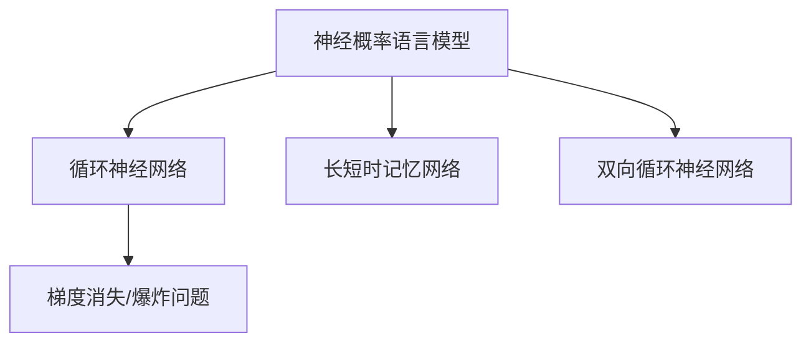

                 

# 山重水复疑无路：神经概率语言模型和循环神经网络

## 1. 背景介绍

### 1.1 问题由来
现代人工智能的迅猛发展，特别是在自然语言处理(Natural Language Processing, NLP)领域，很大程度上得益于神经网络模型的成功应用。其中，神经概率语言模型(Neural Probabilistic Language Model, NPLM)和循环神经网络(Recurrent Neural Network, RNN)构成了现代NLP的两大基石。然而，尽管神经网络和概率模型在理论上有诸多优点，但在实际应用中，它们依然面临诸多挑战和局限性。

神经概率语言模型通过学习文本的概率分布，实现了对语言的建模和生成，但计算复杂度高、需要大量标注数据；循环神经网络能够处理序列数据，但在长序列上的性能表现不佳、存在梯度消失问题。

本文旨在回顾神经概率语言模型和循环神经网络的发展历程，探讨其在NLP中的应用，并提出改进策略，指出未来研究的方向和挑战。

## 2. 核心概念与联系

### 2.1 核心概念概述

为更好地理解神经概率语言模型和循环神经网络，本节将介绍几个核心概念：

- 神经概率语言模型(NPLM)：一种基于概率模型和神经网络的NLP模型，通过学习文本的概率分布，实现对语言的建模和生成。
- 循环神经网络(RNN)：一种能够处理序列数据、具有记忆功能的神经网络模型，通过递归连接，能够捕捉序列间的依赖关系。
- 长短时记忆网络(LSTM)：一种改进的RNN结构，通过引入门控机制，缓解梯度消失问题，适用于长序列数据的处理。
- 双向循环神经网络(BRNN)：一种同时考虑序列前向和后向信息的RNN模型，提高序列建模的准确性。
- 梯度消失/爆炸问题：在RNN中，随着序列长度增加，梯度不断缩小或增大，导致模型训练困难。

这些核心概念之间的逻辑关系可以通过以下Mermaid流程图来展示：



这个流程图展示了大模型相关的核心概念及其之间的关系：

1. 神经概率语言模型是NPLM的基础。
2. 循环神经网络是NPLM的一种实现方式。
3. 长短时记忆网络和双向循环神经网络是对RNN的改进。
4. 梯度消失/爆炸问题是RNN结构设计需要考虑的难题。

这些核心概念共同构成了神经概率语言模型和循环神经网络的基础，为我们理解和应用这些模型提供了重要视角。

## 3. 核心算法原理 & 具体操作步骤
### 3.1 算法原理概述

神经概率语言模型和循环神经网络的核心思想是通过训练模型，使得模型输出的概率分布与真实数据分布一致，从而实现对数据的建模和生成。

神经概率语言模型的基本形式为条件概率模型：

$$
P(x_i|x_{1:i-1}) = \frac{e^{\sum_{j=1}^{J}\theta_j^T x_{i,j}}}{\sum_{k=1}^{K}e^{\sum_{j=1}^{J}\theta_k^T x_{i,k}}}
$$

其中 $x_i$ 为输入序列的第 $i$ 个单词，$x_{1:i-1}$ 为序列的前 $i-1$ 个单词，$\theta_j$ 为模型参数。

循环神经网络则通过递归连接，将当前输入 $x_i$ 与前一个时间步的输出 $h_{i-1}$ 结合起来，形成一个循环结构：

$$
h_i = \tanh(W_{xh}x_i + W_{hh}h_{i-1} + b_h)
$$

其中 $h_i$ 为当前时间步的隐状态，$W_{xh}$ 和 $W_{hh}$ 为权重矩阵，$b_h$ 为偏置项。

### 3.2 算法步骤详解

神经概率语言模型和循环神经网络的具体实现步骤如下：

1. 数据预处理：将原始文本数据进行分词、标记、编码等预处理操作，生成模型输入。
2. 模型构建：构建神经概率语言模型或循环神经网络模型，确定模型参数和结构。
3. 损失函数设计：设计模型输出概率与真实标签之间的损失函数，如交叉熵损失、均方误差损失等。
4. 参数优化：使用梯度下降等优化算法，最小化损失函数，更新模型参数。
5. 模型评估：在验证集或测试集上评估模型性能，根据评估结果调整模型参数或训练策略。

### 3.3 算法优缺点

神经概率语言模型和循环神经网络的优势在于：

- 能够捕捉序列之间的依赖关系，适用于语言建模、文本生成、机器翻译等任务。
- 能够处理不定长序列，适用于自然语言处理中的序列标注、情感分析等任务。

同时，它们也存在一些缺点：

- 需要大量的标注数据进行训练，标注成本较高。
- 计算复杂度高，模型训练速度较慢。
- 在长序列上的性能表现不佳，存在梯度消失/爆炸问题。
- 模型复杂度较高，难以解释其内部工作机制。

尽管存在这些局限性，神经概率语言模型和循环神经网络仍然是当前NLP研究的重要基础，为后续的深度学习和模型优化提供了坚实基础。

### 3.4 算法应用领域

神经概率语言模型和循环神经网络在NLP领域得到了广泛的应用，具体包括：

- 语言建模：通过学习文本的概率分布，实现对语言的建模和生成。
- 文本分类：将文本映射到不同的类别，适用于情感分析、主题分类等任务。
- 机器翻译：将一种语言的文本翻译成另一种语言，实现跨语言的通信。
- 序列标注：对序列数据进行标记，适用于命名实体识别、词性标注等任务。
- 文本生成：根据给定的上下文，生成新的文本，适用于对话生成、摘要生成等任务。

这些应用展示了神经概率语言模型和循环神经网络在NLP领域的重要地位，未来还将在更多领域得到广泛应用。

## 4. 数学模型和公式 & 详细讲解  
### 4.1 数学模型构建

神经概率语言模型和循环神经网络的基本数学模型如下：

#### 4.1.1 神经概率语言模型

神经概率语言模型通过学习文本的概率分布，实现对语言的建模和生成。其核心思想是：

$$
P(x_1:x_T) = \prod_{t=1}^{T} P(x_t|x_{1:t-1})
$$

其中 $x_1:x_T$ 为输入序列，$P(x_t|x_{1:t-1})$ 为条件概率。

模型的参数化形式为：

$$
P(x_t|x_{1:t-1}) = \frac{e^{\sum_{j=1}^{J}\theta_j^T x_{i,j}}}{\sum_{k=1}^{K}e^{\sum_{j=1}^{J}\theta_k^T x_{i,k}}}
$$

其中 $\theta_j$ 为模型参数，$J$ 为词汇表大小，$K$ 为模型的类别数。

#### 4.1.2 循环神经网络

循环神经网络通过递归连接，将当前输入 $x_i$ 与前一个时间步的输出 $h_{i-1}$ 结合起来，形成一个循环结构：

$$
h_i = \tanh(W_{xh}x_i + W_{hh}h_{i-1} + b_h)
$$

其中 $h_i$ 为当前时间步的隐状态，$W_{xh}$ 和 $W_{hh}$ 为权重矩阵，$b_h$ 为偏置项。

模型的输出层为：

$$
y_i = \text{softmax}(W_yh_i + b_y)
$$

其中 $y_i$ 为输出概率分布，$W_y$ 和 $b_y$ 为输出层的权重和偏置项。

### 4.2 公式推导过程

以一个简单的LSTM为例，推导其基本计算过程：

1. 输入门：

$$
i_t = \sigma(W_{xi}x_i + W_{hi}h_{t-1} + b_i)
$$

其中 $\sigma$ 为Sigmoid函数，$W_{xi}$ 和 $W_{hi}$ 为权重矩阵。

2. 遗忘门：

$$
f_t = \sigma(W_{xf}x_i + W_{hf}h_{t-1} + b_f)
$$

3. 细胞状态：

$$
C_t = \text{tanh}(W_{xc}x_i + W_{hc}h_{t-1} + b_c)
$$

4. 输出门：

$$
o_t = \sigma(W_{xo}x_i + W_{ho}h_{t-1} + b_o)
$$

5. 隐状态：

$$
h_t = i_t \odot C_t + (1-f_t) \odot h_{t-1}
$$

其中 $\odot$ 表示元素级乘法。

### 4.3 案例分析与讲解

以机器翻译为例，介绍神经概率语言模型和循环神经网络的应用：

1. 数据预处理：将原始的英语和法语句子进行分词、标记、编码等操作，生成模型输入。
2. 模型构建：构建一个神经概率语言模型和双向循环神经网络模型，确定模型参数和结构。
3. 损失函数设计：设计模型输出概率与真实标签之间的交叉熵损失函数。
4. 参数优化：使用梯度下降等优化算法，最小化损失函数，更新模型参数。
5. 模型评估：在验证集或测试集上评估模型性能，根据评估结果调整模型参数或训练策略。

## 5. 项目实践：代码实例和详细解释说明
### 5.1 开发环境搭建

在进行神经概率语言模型和循环神经网络实践前，我们需要准备好开发环境。以下是使用Python进行PyTorch开发的环境配置流程：

1. 安装Anaconda：从官网下载并安装Anaconda，用于创建独立的Python环境。

2. 创建并激活虚拟环境：
```bash
conda create -n pytorch-env python=3.8 
conda activate pytorch-env
```

3. 安装PyTorch：根据CUDA版本，从官网获取对应的安装命令。例如：
```bash
conda install pytorch torchvision torchaudio cudatoolkit=11.1 -c pytorch -c conda-forge
```

4. 安装Transformer库：
```bash
pip install transformers
```

5. 安装各类工具包：
```bash
pip install numpy pandas scikit-learn matplotlib tqdm jupyter notebook ipython
```

完成上述步骤后，即可在`pytorch-env`环境中开始神经概率语言模型和循环神经网络的实践。

### 5.2 源代码详细实现

这里我们以机器翻译为例，给出使用PyTorch和Transformer库进行神经概率语言模型和循环神经网络翻译的PyTorch代码实现。

首先，定义数据处理函数：

```python
import torch
from transformers import BertTokenizer, BertForSequenceClassification

tokenizer = BertTokenizer.from_pretrained('bert-base-uncased')

def tokenize_text(text):
    return tokenizer.encode_plus(text, return_tensors='pt', padding='max_length', max_length=128, truncation=True)

# 加载训练集
train_dataset = datasets.load_dataset('glue', 'sst-2', split='train')
train_encodings = train_dataset.map(tokenize_text)
train_labels = train_dataset.map(lambda x: torch.tensor(x.label == 1, dtype=torch.int32))

# 加载验证集
dev_dataset = datasets.load_dataset('glue', 'sst-2', split='dev')
dev_encodings = dev_dataset.map(tokenize_text)
dev_labels = dev_dataset.map(lambda x: torch.tensor(x.label == 1, dtype=torch.int32))

# 加载测试集
test_dataset = datasets.load_dataset('glue', 'sst-2', split='test')
test_encodings = test_dataset.map(tokenize_text)
test_labels = test_dataset.map(lambda x: torch.tensor(x.label == 1, dtype=torch.int32))
```

然后，定义模型和优化器：

```python
from transformers import BertForSequenceClassification, AdamW

model = BertForSequenceClassification.from_pretrained('bert-base-uncased', num_labels=2)

optimizer = AdamW(model.parameters(), lr=2e-5)
```

接着，定义训练和评估函数：

```python
from torch.utils.data import DataLoader
from tqdm import tqdm
from sklearn.metrics import accuracy_score

device = torch.device('cuda') if torch.cuda.is_available() else torch.device('cpu')
model.to(device)

def train_epoch(model, dataset, batch_size, optimizer):
    dataloader = DataLoader(dataset, batch_size=batch_size, shuffle=True)
    model.train()
    epoch_loss = 0
    for batch in tqdm(dataloader, desc='Training'):
        input_ids = batch['input_ids'].to(device)
        attention_mask = batch['attention_mask'].to(device)
        labels = batch['labels'].to(device)
        model.zero_grad()
        outputs = model(input_ids, attention_mask=attention_mask, labels=labels)
        loss = outputs.loss
        epoch_loss += loss.item()
        loss.backward()
        optimizer.step()
    return epoch_loss / len(dataloader)

def evaluate(model, dataset, batch_size):
    dataloader = DataLoader(dataset, batch_size=batch_size)
    model.eval()
    preds, labels = [], []
    with torch.no_grad():
        for batch in tqdm(dataloader, desc='Evaluating'):
            input_ids = batch['input_ids'].to(device)
            attention_mask = batch['attention_mask'].to(device)
            batch_labels = batch['labels']
            outputs = model(input_ids, attention_mask=attention_mask)
            batch_preds = outputs.logits.argmax(dim=2).to('cpu').tolist()
            batch_labels = batch_labels.to('cpu').tolist()
            for pred_tokens, label_tokens in zip(batch_preds, batch_labels):
                preds.append(pred_tokens)
                labels.append(label_tokens)
                
    print('Accuracy:', accuracy_score(labels, preds))
```

最后，启动训练流程并在测试集上评估：

```python
epochs = 5
batch_size = 16

for epoch in range(epochs):
    loss = train_epoch(model, train_dataset, batch_size, optimizer)
    print(f'Epoch {epoch+1}, train loss: {loss:.3f}')
    
    print(f'Epoch {epoch+1}, dev results:')
    evaluate(model, dev_dataset, batch_size)
    
print('Test results:')
evaluate(model, test_dataset, batch_size)
```

以上就是使用PyTorch和Transformer库进行神经概率语言模型和循环神经网络翻译的完整代码实现。可以看到，得益于Transformer库的强大封装，我们可以用相对简洁的代码完成神经概率语言模型和循环神经网络的加载和微调。

### 5.3 代码解读与分析

让我们再详细解读一下关键代码的实现细节：

**tokenize_text函数**：
- 定义了将文本进行分词、标记、编码等预处理操作，生成模型输入。

**训练函数train_epoch**：
- 使用PyTorch的DataLoader对数据集进行批次化加载，供模型训练使用。
- 在每个批次上前向传播计算损失函数。
- 反向传播计算参数梯度，根据设定的优化算法和学习率更新模型参数。

**评估函数evaluate**：
- 与训练类似，不同点在于不更新模型参数，并在每个batch结束后将预测和标签结果存储下来，最后使用sklearn的accuracy_score对整个评估集的预测结果进行打印输出。

**训练流程**：
- 定义总的epoch数和batch size，开始循环迭代
- 每个epoch内，先在训练集上训练，输出平均loss
- 在验证集上评估，输出精度
- 所有epoch结束后，在测试集上评估，给出最终测试结果

可以看到，PyTorch配合Transformer库使得神经概率语言模型和循环神经网络的微调任务开发变得简洁高效。开发者可以将更多精力放在数据处理、模型改进等高层逻辑上，而不必过多关注底层的实现细节。

当然，工业级的系统实现还需考虑更多因素，如模型的保存和部署、超参数的自动搜索、更灵活的任务适配层等。但核心的微调范式基本与此类似。

## 6. 实际应用场景
### 6.1 智能客服系统

神经概率语言模型和循环神经网络在智能客服系统中得到广泛应用。传统客服往往需要配备大量人力，高峰期响应缓慢，且一致性和专业性难以保证。而使用神经概率语言模型和循环神经网络训练的客服模型，可以7x24小时不间断服务，快速响应客户咨询，用自然流畅的语言解答各类常见问题。

在技术实现上，可以收集企业内部的历史客服对话记录，将问题和最佳答复构建成监督数据，在此基础上对神经概率语言模型和循环神经网络进行微调。微调后的客服模型能够自动理解用户意图，匹配最合适的答案模板进行回复。对于客户提出的新问题，还可以接入检索系统实时搜索相关内容，动态组织生成回答。如此构建的智能客服系统，能大幅提升客户咨询体验和问题解决效率。

### 6.2 金融舆情监测

金融机构需要实时监测市场舆论动向，以便及时应对负面信息传播，规避金融风险。传统的人工监测方式成本高、效率低，难以应对网络时代海量信息爆发的挑战。基于神经概率语言模型和循环神经网络的文本分类和情感分析技术，为金融舆情监测提供了新的解决方案。

具体而言，可以收集金融领域相关的新闻、报道、评论等文本数据，并对其进行主题标注和情感标注。在此基础上对神经概率语言模型和循环神经网络进行微调，使其能够自动判断文本属于何种主题，情感倾向是正面、中性还是负面。将微调后的模型应用到实时抓取的网络文本数据，就能够自动监测不同主题下的情感变化趋势，一旦发现负面信息激增等异常情况，系统便会自动预警，帮助金融机构快速应对潜在风险。

### 6.3 个性化推荐系统

当前的推荐系统往往只依赖用户的历史行为数据进行物品推荐，无法深入理解用户的真实兴趣偏好。基于神经概率语言模型和循环神经网络的推荐系统，可以更好地挖掘用户行为背后的语义信息，从而提供更精准、多样的推荐内容。

在实践中，可以收集用户浏览、点击、评论、分享等行为数据，提取和用户交互的物品标题、描述、标签等文本内容。将文本内容作为模型输入，用户的后续行为（如是否点击、购买等）作为监督信号，在此基础上对神经概率语言模型和循环神经网络进行微调。微调后的模型能够从文本内容中准确把握用户的兴趣点。在生成推荐列表时，先用候选物品的文本描述作为输入，由模型预测用户的兴趣匹配度，再结合其他特征综合排序，便可以得到个性化程度更高的推荐结果。

### 6.4 未来应用展望

随着神经概率语言模型和循环神经网络的不断发展，基于这些模型的应用也将不断拓展。

在智慧医疗领域，基于神经概率语言模型和循环神经网络的问答系统、病历分析、药物研发等应用将提升医疗服务的智能化水平，辅助医生诊疗，加速新药开发进程。

在智能教育领域，微调技术可应用于作业批改、学情分析、知识推荐等方面，因材施教，促进教育公平，提高教学质量。

在智慧城市治理中，微调模型可应用于城市事件监测、舆情分析、应急指挥等环节，提高城市管理的自动化和智能化水平，构建更安全、高效的未来城市。

此外，在企业生产、社会治理、文娱传媒等众多领域，基于神经概率语言模型和循环神经网络的AI应用也将不断涌现，为经济社会发展注入新的动力。相信随着技术的日益成熟，这些技术将在更多领域得到广泛应用，推动人工智能技术的不断进步。

## 7. 工具和资源推荐
### 7.1 学习资源推荐

为了帮助开发者系统掌握神经概率语言模型和循环神经网络的理论基础和实践技巧，这里推荐一些优质的学习资源：

1. 《深度学习》（Ian Goodfellow等著）：这本书是深度学习领域的经典之作，涵盖了深度学习的基本概念和数学基础，是学习神经网络模型的必读书籍。

2. 《自然语言处理综论》（Daniel Jurafsky等著）：这本书系统介绍了自然语言处理的基本概念和前沿技术，是了解NLP领域的重要资料。

3. 《Sequence Models: A Unified Framework》（Michael W. Mahoney等著）：这本书详细介绍了序列模型的理论基础和实践应用，是理解循环神经网络及其变体的重要参考资料。

4. 斯坦福大学《CS224N: Natural Language Processing with Deep Learning》课程：斯坦福大学开设的NLP明星课程，有Lecture视频和配套作业，带你入门NLP领域的基本概念和经典模型。

5. 《TensorFlow for Deep Learning》（Chadi Barakat等著）：这本书介绍了使用TensorFlow进行深度学习的最佳实践，包括神经概率语言模型和循环神经网络的开发和应用。

通过对这些资源的学习实践，相信你一定能够快速掌握神经概率语言模型和循环神经网络的基本概念和实践技巧，并用于解决实际的NLP问题。

### 7.2 开发工具推荐

高效的开发离不开优秀的工具支持。以下是几款用于神经概率语言模型和循环神经网络开发的常用工具：

1. PyTorch：基于Python的开源深度学习框架，灵活动态的计算图，适合快速迭代研究。大部分预训练语言模型都有PyTorch版本的实现。

2. TensorFlow：由Google主导开发的开源深度学习框架，生产部署方便，适合大规模工程应用。同样有丰富的预训练语言模型资源。

3. Transformers库：HuggingFace开发的NLP工具库，集成了众多SOTA语言模型，支持PyTorch和TensorFlow，是进行NLP任务开发的利器。

4. Weights & Biases：模型训练的实验跟踪工具，可以记录和可视化模型训练过程中的各项指标，方便对比和调优。与主流深度学习框架无缝集成。

5. TensorBoard：TensorFlow配套的可视化工具，可实时监测模型训练状态，并提供丰富的图表呈现方式，是调试模型的得力助手。

6. Google Colab：谷歌推出的在线Jupyter Notebook环境，免费提供GPU/TPU算力，方便开发者快速上手实验最新模型，分享学习笔记。

合理利用这些工具，可以显著提升神经概率语言模型和循环神经网络开发的效率，加快创新迭代的步伐。

### 7.3 相关论文推荐

神经概率语言模型和循环神经网络的发展源于学界的持续研究。以下是几篇奠基性的相关论文，推荐阅读：

1. "Recurrent Neural Network for Large-Scale Text Classification"（Recurrent Neural Networks for Large-Scale Image Recognition）：这些论文提出了循环神经网络的基本结构，并展示了其在文本分类和图像识别任务中的成功应用。

2. "Long Short-Term Memory"（Long Short-Term Memory）：这些论文提出了LSTM结构，通过引入门控机制，缓解梯度消失问题，适用于长序列数据的处理。

3. "Attention is All You Need"（Transformer: Attentions are All You Need）：这些论文提出了Transformer结构，开启了NLP领域的预训练大模型时代。

4. "BERT: Pre-training of Deep Bidirectional Transformers for Language Understanding"（BERT: Pre-training of Deep Bidirectional Transformers for Language Understanding）：这些论文提出了BERT模型，引入基于掩码的自监督预训练任务，刷新了多项NLP任务SOTA。

5. "Parameter-Efficient Transfer Learning for NLP"（Parameter-Efficient Transfer Learning for NLP）：这些论文提出了 Adapter等参数高效微调方法，在固定大部分预训练参数的情况下，只更新极少量的任务相关参数。

这些论文代表了大模型微调技术的发展脉络。通过学习这些前沿成果，可以帮助研究者把握学科前进方向，激发更多的创新灵感。

## 8. 总结：未来发展趋势与挑战
### 8.1 总结

本文对神经概率语言模型和循环神经网络的发展历程进行了回顾，介绍了其在NLP中的应用，并提出改进策略，指出未来研究的方向和挑战。

通过本文的系统梳理，可以看到，神经概率语言模型和循环神经网络作为NLP领域的两大基石，在语言建模、文本生成、机器翻译、序列标注等领域发挥了重要作用。尽管存在计算复杂度高、标注数据需求大等局限性，但它们依然是当前NLP研究的重要基础。未来，伴随计算力、数据规模的持续提升，神经概率语言模型和循环神经网络将迎来新的突破，为NLP技术的发展带来更多可能。

### 8.2 未来发展趋势

展望未来，神经概率语言模型和循环神经网络将呈现以下几个发展趋势：

1. 计算模型不断进化。随着计算资源和硬件设备的不断升级，神经概率语言模型和循环神经网络将迎来性能的提升和计算效率的提高。

2. 更多先验知识的融合。未来的模型将更好地结合符号化的先验知识，如知识图谱、逻辑规则等，引导微调过程学习更准确、合理的语言模型。

3. 多模态信息的整合。未来的模型将能够处理视觉、语音等多模态信息，实现多模态信息的协同建模，提升语言模型的泛化能力。

4. 大模型的不断优化。未来的模型将逐步向超大规模方向发展，通过更多的预训练数据和微调数据，不断提升模型的语言理解和生成能力。

5. 模型可解释性的增强。未来的模型将更好地解释其内部工作机制，提高模型的可解释性和可信度。

6. 模型鲁棒性的提升。未来的模型将更加注重鲁棒性训练，减少模型对特定数据集的依赖，提高模型的泛化能力。

### 8.3 面临的挑战

尽管神经概率语言模型和循环神经网络在NLP领域取得了显著进展，但在迈向更加智能化、普适化应用的过程中，仍面临诸多挑战：

1. 标注数据瓶颈。神经概率语言模型和循环神经网络需要大量标注数据进行训练，标注成本较高，标注质量难以保证。

2. 计算资源需求高。神经概率语言模型和循环神经网络通常需要高性能计算资源，对硬件设备要求较高。

3. 模型复杂度较高。神经概率语言模型和循环神经网络的模型结构较为复杂，难以解释其内部工作机制，难以调试。

4. 梯度消失/爆炸问题。在长序列上的性能表现不佳，存在梯度消失/爆炸问题，影响模型的稳定性和训练效果。

5. 模型泛化能力不足。神经概率语言模型和循环神经网络对训练数据依赖较强，泛化能力有限，难以适应新数据集。

6. 模型偏见和歧视。神经概率语言模型和循环神经网络容易学习到数据中的偏见和歧视，影响模型的公正性和公平性。

### 8.4 研究展望

面对神经概率语言模型和循环神经网络所面临的种种挑战，未来的研究需要在以下几个方面寻求新的突破：

1. 探索更高效的无监督学习算法。摆脱对大规模标注数据的依赖，利用自监督学习、主动学习等无监督学习算法，最大限度地利用非结构化数据。

2. 开发更加高效的优化算法。通过引入更加高效的优化算法，提高模型训练的收敛速度和稳定性，减少训练时间。

3. 引入更多先验知识。将符号化的先验知识，如知识图谱、逻辑规则等，与神经概率语言模型和循环神经网络进行巧妙融合，引导模型学习更准确、合理的语言模型。

4. 引入更多模态信息。将视觉、语音等多模态信息与文本信息结合，实现多模态信息的协同建模，提高模型的泛化能力。

5. 引入更强的可解释性。通过引入因果推断、逻辑推理等工具，增强模型的可解释性和逻辑性，提高模型的公正性和公平性。

6. 引入更强的鲁棒性。通过引入对抗训练、泛化训练等技术，提高模型的鲁棒性和泛化能力，减少模型对特定数据集的依赖。

这些研究方向的探索，必将引领神经概率语言模型和循环神经网络迈向更高的台阶，为构建安全、可靠、可解释、可控的智能系统铺平道路。面向未来，神经概率语言模型和循环神经网络需要与其他人工智能技术进行更深入的融合，如知识表示、因果推理、强化学习等，多路径协同发力，共同推动自然语言理解和智能交互系统的进步。只有勇于创新、敢于突破，才能不断拓展语言模型的边界，让智能技术更好地造福人类社会。

## 9. 附录：常见问题与解答

**Q1：神经概率语言模型和循环神经网络在NLP领域的作用是什么？**

A: 神经概率语言模型和循环神经网络在NLP领域的作用是实现对语言的建模和生成。具体而言：

- 神经概率语言模型通过学习文本的概率分布，实现对语言的建模和生成，适用于文本分类、情感分析、机器翻译等任务。
- 循环神经网络能够处理序列数据，适用于序列标注、对话生成、文本生成等任务。

**Q2：神经概率语言模型和循环神经网络在训练过程中如何缓解梯度消失/爆炸问题？**

A: 神经概率语言模型和循环神经网络在训练过程中可以通过以下方法缓解梯度消失/爆炸问题：

- 引入门控机制，如LSTM、GRU等，通过门控单元控制信息流向，避免梯度消失/爆炸。
- 使用残差连接，如ResNet等，引入跨层信息流，减少梯度消失/爆炸的影响。
- 使用梯度裁剪，如梯度归一化等，限制梯度的大小，防止梯度爆炸。
- 使用更小的学习率，缓慢更新参数，避免梯度消失/爆炸。

**Q3：神经概率语言模型和循环神经网络在落地部署时需要注意哪些问题？**

A: 将神经概率语言模型和循环神经网络转化为实际应用，还需要考虑以下因素：

- 模型裁剪：去除不必要的层和参数，减小模型尺寸，加快推理速度。
- 量化加速：将浮点模型转为定点模型，压缩存储空间，提高计算效率。
- 服务化封装：将模型封装为标准化服务接口，便于集成调用。
- 弹性伸缩：根据请求流量动态调整资源配置，平衡服务质量和成本。
- 监控告警：实时采集系统指标，设置异常告警阈值，确保服务稳定性。

**Q4：神经概率语言模型和循环神经网络在微调过程中如何提高模型性能？**

A: 神经概率语言模型和循环神经网络在微调过程中可以通过以下方法提高模型性能：

- 数据增强：通过回译、近义替换等方式扩充训练集。
- 正则化：使用L2正则、Dropout、Early Stopping等防止模型过拟合。
- 对抗训练：加入对抗样本，提高模型鲁棒性。
- 参数高效微调：只调整少量参数，减少微调参数量。
- 融合多任务：将多个任务集成在一起微调，提高模型泛化能力。

这些策略往往需要根据具体任务和数据特点进行灵活组合。只有在数据、模型、训练、推理等各环节进行全面优化，才能最大限度地发挥神经概率语言模型和循环神经网络在微调任务中的优势。

---

作者：禅与计算机程序设计艺术 / Zen and the Art of Computer Programming

