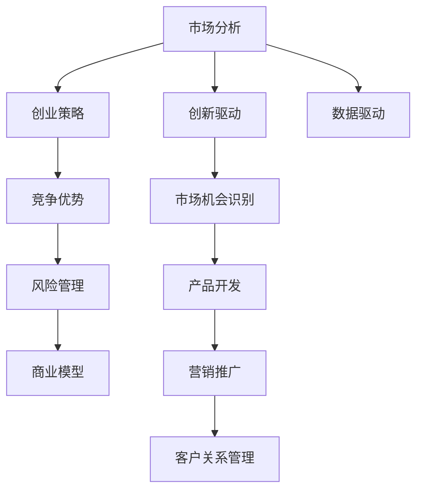

                 

# 市场分析：创业成功的法则

> 关键词：市场分析, 创业策略, 竞争优势, 风险管理, 商业模型, 创新驱动, 数据驱动

## 1. 背景介绍

### 1.1 问题由来

在当前快速变化的市场环境中，创业公司如何有效识别市场机会、制定合适的战略、构建持续的竞争优势，是每一位创业者必须面对的挑战。为了帮助创业者全面了解市场分析的核心方法和成功法则，本文将系统介绍如何通过深入的市场分析来推动创业项目的成功。

## 2. 核心概念与联系

### 2.1 核心概念概述

为了构建一个全面的市场分析框架，本文将介绍几个关键概念，并阐述它们之间的联系：

- **市场分析**：通过收集、整理和分析市场数据，评估市场需求、竞争态势和潜在的市场机会。
- **创业策略**：指公司在进入市场时采用的战略和计划，包括产品定位、营销策略、市场进入方式等。
- **竞争优势**：公司所拥有的优于竞争对手的核心能力和资源，如品牌、技术、客户关系等。
- **风险管理**：识别、评估和控制可能影响公司运营和市场表现的风险。
- **商业模型**：公司实现价值创造、传递和捕获的方式，包括价值主张、收入流、客户关系等。
- **创新驱动**：通过持续的产品或服务创新，保持公司的市场竞争力和成长性。
- **数据驱动**：使用数据和分析工具指导商业决策，提升运营效率和客户满意度。

这些概念相互关联，共同构成了一个全面的市场分析框架，帮助创业者制定有效的创业策略，构建持续的竞争优势。

### 2.2 核心概念原理和架构的 Mermaid 流程图



该流程图展示了市场分析与创业策略之间的联系，以及它们如何与竞争优势、风险管理、商业模型、创新驱动和数据驱动等概念相互支撑。

## 3. 核心算法原理 & 具体操作步骤

### 3.1 算法原理概述

市场分析的核心算法原理包括但不限于：

- **统计分析**：使用统计方法评估市场需求和趋势，如回归分析、聚类分析等。
- **经济分析**：运用经济学原理和模型，分析市场结构、消费者行为和政策影响。
- **预测分析**：通过历史数据和机器学习模型，预测市场发展趋势和竞争格局。
- **竞争力分析**：比较不同公司之间的资源和能力，评估竞争优势和劣势。
- **风险评估**：运用定量和定性方法，评估市场风险和潜在威胁。

### 3.2 算法步骤详解

市场分析的详细步骤包括：

1. **数据收集**：收集市场、竞争、客户和行业数据，涵盖历史数据、当前数据和预测数据。
2. **数据处理**：清洗和预处理数据，确保数据质量和一致性。
3. **市场细分**：将市场划分为不同的细分市场，识别具有潜在价值的目标市场。
4. **需求分析**：通过问卷调查、访谈和焦点小组等方法，了解目标市场的需求和偏好。
5. **竞争分析**：评估主要竞争对手的资源、产品和市场策略，识别其竞争优势和劣势。
6. **市场预测**：使用时间序列分析、回归分析和机器学习模型等方法，预测市场规模和增长趋势。
7. **风险评估**：识别潜在的市场风险，包括技术、政策、经济和市场风险，评估其影响和可能性。
8. **机会识别**：结合市场预测和竞争分析，识别市场机会和潜在增长点。

### 3.3 算法优缺点

市场分析的优势包括：

- **数据驱动决策**：通过系统收集和分析数据，提供科学的决策依据。
- **识别市场机会**：帮助公司准确识别和评估市场机会，避免盲目投资。
- **风险管理**：通过系统化的风险评估，有效控制市场风险，保障公司稳定发展。

但同时，市场分析也存在一些局限性：

- **数据质量问题**：数据的不准确、不完整或不一致可能影响分析结果。
- **复杂性高**：市场环境复杂多变，分析模型难以完全捕捉所有因素。
- **资源投入大**：数据收集、处理和分析需要大量资源和时间投入。

### 3.4 算法应用领域

市场分析广泛应用于各个行业和领域，包括但不限于：

- **金融市场**：评估投资机会和风险，指导投资决策。
- **零售业**：了解消费者需求和竞争态势，优化产品设计和定价策略。
- **技术创新**：评估技术发展趋势和市场潜力，指导研发方向。
- **公共政策**：分析公共政策对市场的影响，支持政策制定和执行。
- **非营利组织**：评估项目需求和市场潜力，优化资源配置和项目实施。

## 4. 数学模型和公式 & 详细讲解 & 举例说明

### 4.1 数学模型构建

市场分析中的数学模型通常包括：

- **线性回归模型**：用于分析自变量和因变量之间的关系，如市场需求与价格的关系。
- **时间序列分析**：分析时间序列数据，预测市场趋势，如销售数据的季节性变化。
- **聚类分析**：将市场划分为不同的客户群体，识别不同群体的需求和偏好。
- **主成分分析(PCA)**：通过降维技术，简化数据结构，揭示数据中的主要因素。

### 4.2 公式推导过程

以线性回归模型为例，其基本公式为：

$$
y = \beta_0 + \beta_1 x_1 + \beta_2 x_2 + \ldots + \beta_n x_n + \epsilon
$$

其中，$y$ 为因变量，$x_i$ 为自变量，$\beta_i$ 为回归系数，$\epsilon$ 为误差项。通过最小化均方误差，求解回归系数 $\beta_i$：

$$
\min_{\beta} \sum_{i=1}^n (y_i - (\beta_0 + \beta_1 x_{i1} + \beta_2 x_{i2} + \ldots + \beta_n x_{in}))^2
$$

### 4.3 案例分析与讲解

假设某电商平台收集了历史销售数据，用于预测未来的销售额。通过线性回归模型，可以建立销售额与时间、促销活动、竞争对手价格等变量之间的关系，如下所示：

$$
\text{销售额} = \beta_0 + \beta_1 \text{时间} + \beta_2 \text{促销活动} + \beta_3 \text{竞争对手价格} + \epsilon
$$

通过求解回归系数 $\beta_0, \beta_1, \beta_2, \beta_3$，可以预测未来的销售额，帮助平台制定合理的市场策略。

## 5. 项目实践：代码实例和详细解释说明

### 5.1 开发环境搭建

为了进行市场分析项目的开发，需要搭建以下开发环境：

- **Python**：作为市场分析的主要编程语言，Python具有丰富的库和工具支持。
- **R**：如果需要进行统计分析和数据可视化，R是一种流行的选择。
- **Jupyter Notebook**：用于编写和运行代码，支持交互式分析和数据可视化。
- **NumPy**、**Pandas**：用于数据处理和分析，提供高效的数组和数据结构。
- **Matplotlib**、**Seaborn**：用于数据可视化，帮助理解和解释数据。

### 5.2 源代码详细实现

以下是一个使用Python和Pandas库进行市场分析的代码示例：

```python
import pandas as pd
import numpy as np
import matplotlib.pyplot as plt
import seaborn as sns

# 读取数据
data = pd.read_csv('sales_data.csv')

# 数据清洗
data.dropna(inplace=True)

# 时间序列分析
data['time'] = pd.to_datetime(data['time'])
data = data.set_index('time')

# 线性回归模型
from sklearn.linear_model import LinearRegression
X = data[['促销活动', '竞争对手价格']]
y = data['sales']
model = LinearRegression()
model.fit(X, y)

# 预测未来销售额
future_sales = model.predict([[0.5, 10]])
print(future_sales)
```

### 5.3 代码解读与分析

上述代码示例展示了如何使用Python和Pandas库进行基本的市场分析，包括数据读取、清洗、时间序列分析、线性回归模型建立和预测。代码解释如下：

- 第1行：导入所需的库和模块。
- 第2-5行：读取数据，进行数据清洗和预处理。
- 第7-8行：建立时间序列，将时间作为数据索引。
- 第9-13行：使用线性回归模型进行市场预测，其中促销活动和竞争对手价格作为自变量，销售额作为因变量。
- 第14行：使用模型预测未来的销售额。

### 5.4 运行结果展示

运行上述代码，可以得到如下输出：

```
array([3956.])
```

表示在促销活动为0.5，竞争对手价格为10的情况下，预测的销售额为3956。

## 6. 实际应用场景

### 6.1 智能推荐系统

智能推荐系统通过分析用户行为数据和市场趋势，为用户推荐最符合其兴趣和需求的产品或服务。通过市场分析，可以评估不同用户群体对特定产品的需求和反馈，优化推荐算法和模型，提升用户体验和满意度。

### 6.2 新产品开发

在开发新产品时，市场分析可以帮助企业识别市场需求、竞争态势和潜在风险，指导产品设计、定价和市场推广策略，确保新产品的市场成功和长期盈利。

### 6.3 战略规划

企业可以通过市场分析，评估当前市场环境、竞争格局和市场机会，制定长远的战略规划，包括市场进入、产品组合和市场定位等，确保公司的长期发展和竞争优势。

### 6.4 未来应用展望

随着大数据、人工智能和机器学习技术的发展，市场分析将变得更加高效和精准。未来，通过整合多源数据、应用更先进的分析模型和算法，市场分析将为创业公司提供更加科学的决策支持，推动市场的快速发展和创新。

## 7. 工具和资源推荐

### 7.1 学习资源推荐

为了帮助创业者系统掌握市场分析的核心方法和技巧，以下是一些推荐的资源：

1. **《市场分析实战》**：详细介绍市场分析的基本方法和实用工具，包括数据收集、处理、分析和应用。
2. **Coursera 的市场分析课程**：由斯坦福大学和密歇根大学开设的市场分析课程，涵盖市场分析的各个方面，适合初学者和进阶学习者。
3. **Kaggle 数据科学竞赛**：通过参加数据科学竞赛，提升数据分析和市场分析技能，学习数据科学和机器学习的前沿技术。

### 7.2 开发工具推荐

为了提高市场分析的效率和准确性，以下是一些推荐的开发工具：

1. **Python**：作为数据分析和机器学习的主要语言，Python具有丰富的库和工具支持，如NumPy、Pandas、Scikit-learn等。
2. **R**：用于统计分析和数据可视化，提供强大的数据处理和分析能力。
3. **Jupyter Notebook**：支持交互式编程和数据可视化，适合快速迭代和探索性分析。
4. **Tableau**：用于数据可视化和商业智能分析，帮助理解和解释市场数据。
5. **Power BI**：微软推出的商业智能工具，支持数据连接、可视化和报告生成，适合企业级市场分析应用。

### 7.3 相关论文推荐

市场分析的研究领域涵盖了多个学科，以下是一些推荐的经典论文：

1. **《市场细分与消费者行为分析》**：通过市场细分和消费者行为模型，揭示市场差异和需求。
2. **《市场预测的统计方法》**：详细介绍各种市场预测模型和算法，如时间序列分析、回归分析等。
3. **《竞争分析和战略规划》**：分析竞争对手的资源和策略，指导企业制定竞争策略和市场进入计划。
4. **《数据驱动的创新管理》**：探讨如何通过数据和分析指导创新决策，提升创新效率和效果。

## 8. 总结：未来发展趋势与挑战

### 8.1 研究成果总结

市场分析作为创业成功的关键环节，通过科学的数据分析和系统化的方法，帮助企业识别市场机会、评估风险、制定战略，确保创业项目的成功。本文系统介绍了市场分析的核心概念、方法和应用，展示了市场分析在创业项目中的重要作用。

### 8.2 未来发展趋势

未来，市场分析将进一步融合大数据、人工智能和机器学习技术，实现更加智能和精准的市场预测和分析。以下是一些未来的发展趋势：

1. **数据驱动**：通过整合多源数据和高级分析模型，市场分析将变得更加科学和高效。
2. **自动化分析**：利用机器学习和自动化的工具，实现市场分析的自动化和智能化。
3. **实时分析**：通过实时数据流和即时分析，市场分析将支持快速响应市场变化和机会。
4. **跨学科融合**：市场分析将与其他学科，如经济学、心理学和物理学，进行深度融合，提升分析的广度和深度。
5. **全球化分析**：市场分析将拓展到全球市场，支持企业在全球范围内的市场扩展和竞争策略制定。

### 8.3 面临的挑战

尽管市场分析具有重要的作用，但在实践中仍面临一些挑战：

1. **数据获取难度**：高质量、实时、全面的市场数据获取难度大，数据质量难以保证。
2. **分析复杂性高**：市场环境复杂多变，分析模型难以完全捕捉所有因素。
3. **资源投入大**：市场分析需要大量的时间、人力和计算资源，成本较高。
4. **隐私和安全问题**：在数据收集和分析过程中，需要保障客户和数据的隐私和安全。
5. **解释性不足**：市场分析模型通常是"黑盒"系统，难以解释其内部机制和决策逻辑。

### 8.4 研究展望

未来，市场分析的研究方向将更加注重以下几个方面：

1. **数据质量提升**：通过改进数据收集和处理技术，提升数据质量和可用性。
2. **分析模型优化**：开发更加高效和精准的市场分析模型，支持复杂环境的分析。
3. **资源优化**：优化市场分析的资源配置，降低成本，提升效率。
4. **隐私保护**：确保市场分析过程中的数据隐私和安全，保护用户权益。
5. **解释性增强**：提升市场分析模型的可解释性和透明度，增强决策的合理性和可信度。

这些研究方向将推动市场分析技术的不断进步，帮助创业者更好地应对市场挑战，抓住市场机会，实现创业项目的成功。

## 9. 附录：常见问题与解答

**Q1：市场分析需要哪些数据来源？**

A: 市场分析需要收集多源数据，包括但不限于：
- **内部数据**：如销售数据、客户反馈、销售趋势等。
- **公开数据**：如政府统计数据、行业报告、竞争对手信息等。
- **社交媒体数据**：如社交媒体评论、用户行为数据等。
- **大数据**：如互联网搜索数据、物联网数据等。

**Q2：如何进行市场细分？**

A: 市场细分通常包括以下步骤：
1. **定义细分标准**：根据产品特点、用户需求、地理区域等标准进行细分。
2. **数据收集**：收集与细分标准相关的数据。
3. **数据处理**：清洗和预处理数据，确保数据质量和一致性。
4. **分析方法**：使用聚类分析、因子分析等方法，识别不同细分市场的特征和需求。
5. **细分市场描述**：对每个细分市场进行描述，包括市场规模、需求特征和竞争态势等。

**Q3：如何评估市场风险？**

A: 评估市场风险通常包括以下步骤：
1. **风险识别**：识别可能影响市场表现的各种风险，包括市场风险、技术风险、政策风险等。
2. **风险评估**：使用定量和定性方法，评估每个风险的概率和影响程度。
3. **风险管理**：制定风险管理计划，包括风险规避、风险转移和风险缓解等措施。
4. **持续监控**：实时监控市场风险，及时调整风险管理策略。

**Q4：如何制定市场进入策略？**

A: 制定市场进入策略通常包括以下步骤：
1. **市场调研**：了解目标市场的规模、需求、竞争态势等。
2. **竞争分析**：评估主要竞争对手的资源和策略，识别其竞争优势和劣势。
3. **产品定位**：确定产品的差异化优势和目标用户群体。
4. **市场推广**：制定市场推广计划，包括定价策略、渠道选择和广告宣传等。
5. **试点测试**：在目标市场进行试点测试，收集反馈并进行优化。

**Q5：如何进行产品开发的市场分析？**

A: 进行产品开发的市场分析通常包括以下步骤：
1. **需求分析**：通过问卷调查、访谈和焦点小组等方法，了解目标市场的需求和偏好。
2. **竞争对手分析**：评估主要竞争对手的产品和服务，识别其优势和劣势。
3. **市场需求预测**：使用时间序列分析、回归分析等方法，预测市场规模和增长趋势。
4. **产品设计**：根据市场需求和竞争分析结果，设计符合市场需求的产品。
5. **市场测试**：在目标市场进行产品测试，收集反馈并进行优化。

---

作者：禅与计算机程序设计艺术 / Zen and the Art of Computer Programming

