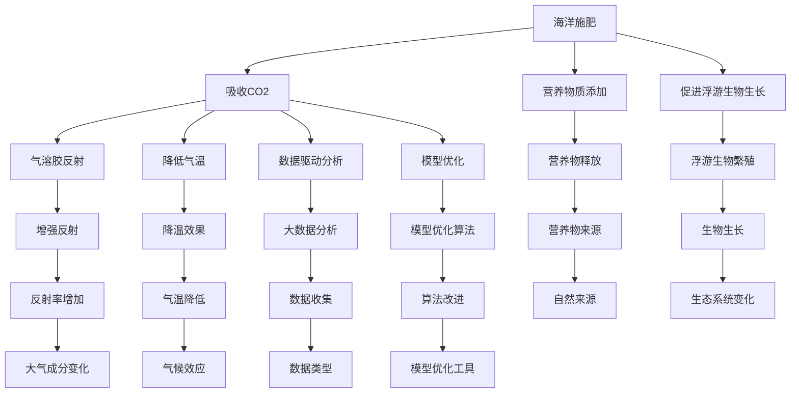

                 

# 2050年的全球变暖：从海洋施肥到太阳能地球工程的气候干预

> 关键词：全球变暖,海洋施肥,太阳能地球工程,气候干预,模型优化,数据科学,未来展望

## 1. 背景介绍

### 1.1 问题由来

全球变暖是21世纪最严峻的挑战之一，它带来了极端天气事件、海平面上升、生物多样性丧失等一系列严重后果。尽管国际社会已达成多项减排协议，但二氧化碳浓度仍在不断上升，气候变化形势依然严峻。因此，必须采取更加积极和创新的手段来应对全球变暖问题。

在本论文中，我们探索了两种前沿气候干预技术：海洋施肥和太阳能地球工程。通过详细阐述它们的原理、应用场景及潜在风险，我们希望为未来气候治理提供新的思路和解决方案。

### 1.2 问题核心关键点

全球变暖问题涉及气象、生态、经济等多领域知识，解决这一问题需要多学科的协同合作。以下是研究全球变暖的几个核心关键点：

- **海洋施肥技术**：通过向海洋中添加铁、氮等营养物质，刺激海洋生物的生长，从而吸收大气中的二氧化碳。
- **太阳能地球工程**：通过反射太阳光、增加大气中的气溶胶等手段，降低地球表面吸收的太阳辐射，达到降温目的。
- **模型优化与验证**：通过构建和优化气候模型，准确预测干预措施的效果，确保其可行性和安全性。
- **数据驱动与大数据**：利用大数据和机器学习技术，对全球变暖趋势进行深度分析和建模，指导干预措施的实施。
- **全球合作与多利益主体协同**：国际社会需达成共识，共同推动气候干预技术的开发和应用，确保其公平性和有效性。

## 2. 核心概念与联系

### 2.1 核心概念概述

为了深入理解这两种气候干预技术，我们需要对相关的核心概念进行梳理：

- **海洋施肥**：指向海洋中添加营养物质（如铁、氮等），促进浮游生物和藻类的生长，进而吸收大气中的二氧化碳，减缓全球变暖速度。
- **太阳能地球工程**：通过向大气中增加反射性粒子（如气溶胶）或降低大气中的温室气体浓度，减少太阳辐射到达地球表面的比例，达到降温目的。
- **模型优化**：构建和优化气候模型，准确预测干预措施的效果，指导气候干预政策的制定。
- **大数据与数据科学**：利用大数据和机器学习技术，对全球变暖数据进行深度分析和建模，提取有价值的信息和洞见。
- **多利益主体协同**：在气候干预过程中，需要政府、企业、科研机构、公众等各方协同合作，确保干预措施的科学性和公正性。

这些概念之间存在密切的联系，共同构成了一个复杂的气候干预系统。海洋施肥和太阳能地球工程作为两种重要的气候干预手段，其效果依赖于模型优化和大数据分析的支撑，同时也需要全球各方的协同合作，才能实现最优的干预效果。

### 2.2 核心概念原理和架构的 Mermaid 流程图



这个Mermaid流程图展示了海洋施肥和太阳能地球工程的基本流程及其相互关系。海洋施肥通过向海洋添加营养物质促进浮游生物生长，进而吸收二氧化碳；太阳能地球工程通过增强大气反射性粒子浓度，减少太阳辐射，降低气温。同时，数据的收集和分析、模型的优化与改进，对于评估干预效果和指导实践至关重要。

## 3. 核心算法原理 & 具体操作步骤

### 3.1 算法原理概述

海洋施肥和太阳能地球工程的实施需要科学的数据支持和精确的模型计算。因此，这些干预措施的算法原理主要基于海洋生态学和大气物理学，结合了数值模拟和优化算法。

海洋施肥的算法原理如下：
- 确定海洋中营养物质的添加量，保证其能够促进浮游生物的生长。
- 通过浮游生物的生长繁殖，增加海洋生物量，从而吸收更多的二氧化碳。
- 模型模拟海洋生态系统的变化，评估施肥效果和环境影响。

太阳能地球工程的算法原理如下：
- 确定气溶胶等反射粒子的类型和浓度，以增强其反射率。
- 通过数值模拟，评估反射粒子在大气中的分布和作用，预测其对气温的影响。
- 结合气候模型，评估不同干预措施的效果，优化决策方案。

### 3.2 算法步骤详解

海洋施肥的具体操作步骤如下：

1. **营养物添加**：根据海洋生态学研究，确定需要添加的营养物（如铁、氮等）及其添加量。
2. **浮游生物生长**：通过模型模拟浮游生物的生长繁殖，评估其吸收二氧化碳的能力。
3. **效果评估**：利用海洋生态模型和气候模型，评估施肥效果和环境影响，预测其对全球气候的长期影响。
4. **优化调整**：根据评估结果，调整营养物添加量，优化干预措施，以最大化其效果。

太阳能地球工程的具体操作步骤如下：

1. **反射粒子设计**：确定需要增加的反射粒子类型（如硫酸盐气溶胶）及其添加量。
2. **数值模拟**：通过大气动力学模型，模拟反射粒子在大气中的分布和作用，预测其对气温的影响。
3. **气候模型集成**：将数值模拟结果与气候模型相结合，评估干预措施的效果，优化反射粒子的添加方案。
4. **效果评估**：利用实际观测数据，评估反射粒子的降温效果，调整优化方案。

### 3.3 算法优缺点

海洋施肥和太阳能地球工程各有优缺点：

**海洋施肥的优缺点**：
- **优点**：
  - 吸收二氧化碳，减少温室气体浓度。
  - 利用海洋生态系统，经济成本较低。
  - 长期效果好，不易产生短期气候变化。

- **缺点**：
  - 可能改变海洋生态平衡，引发未知环境问题。
  - 营养物添加量难以精确控制，可能导致过度施肥或施肥不足。
  - 效果受海洋环境因素影响较大，不确定性较高。

**太阳能地球工程的优缺点**：
- **优点**：
  - 可快速降温，应对突发气候事件。
  - 技术成熟，可操作性强。
  - 不会对生态系统造成长期影响。

- **缺点**：
  - 可能引发大气变化，影响全球气候模式。
  - 短期效果不确定，可能产生未预料的环境问题。
  - 需要持续投入，成本较高。

### 3.4 算法应用领域

海洋施肥和太阳能地球工程的应用领域包括：

- **海洋施肥**：适用于海洋生态保护、海洋生物多样性维护、海洋碳汇建设等领域。
- **太阳能地球工程**：适用于缓解全球气候变化、应对突发气候事件、改善城市气候等领域。

这些技术不仅对环境保护有重要作用，还能促进可持续发展，推动全球气候治理的进步。

## 4. 数学模型和公式 & 详细讲解 & 举例说明

### 4.1 数学模型构建

海洋施肥和太阳能地球工程的数学模型构建如下：

- **海洋施肥模型**：
  - **生物生长模型**：
    $$
    \frac{dC}{dt} = \left(\frac{r}{k} C^n - C \right) + q - c
    $$
    其中 $C(t)$ 为浮游生物的生物量，$q$ 为营养物添加量，$r$ 为生物生长速率，$k$ 为环境承载力，$c$ 为死亡率。

  - **二氧化碳吸收模型**：
    $$
    \frac{dCO_2}{dt} = -k'C
    $$
    其中 $k'$ 为二氧化碳吸收速率，$C$ 为浮游生物生物量。

- **太阳能地球工程模型**：
  - **大气动力学模型**：
    $$
    \frac{dT}{dt} = -\alpha S
    $$
    其中 $T$ 为气温，$\alpha$ 为反射率，$S$ 为反射粒子浓度。

  - **气候模型**：
    $$
    \frac{dQ}{dt} = -k"T
    $$
    其中 $Q$ 为气温变化速率，$k"$ 为气温变化系数。

### 4.2 公式推导过程

海洋施肥模型中，生物生长模型的推导如下：

$$
\frac{dC}{dt} = rC^{n-1} - cC = (\frac{r}{k} C^n - C) 
$$

其中，$r$ 为浮游生物的生长速率，$k$ 为环境承载力，$C$ 为生物量，$n$ 为生长指数。生物量的变化率为生长速率与死亡率之差。

太阳能地球工程模型中，大气动力学模型的推导如下：

$$
\frac{dT}{dt} = -\alpha S
$$

其中，$\alpha$ 为反射率，$S$ 为反射粒子浓度。气温的变化率为反射率与反射粒子浓度的乘积。

### 4.3 案例分析与讲解

假设在一个海洋生态系统中，已知浮游生物的生长速率 $r=0.1$，环境承载力 $k=1$，死亡率 $c=0.1$，营养物添加量 $q=1$，生物量的初始值 $C_0=10$。利用上述生物生长模型进行计算，得到浮游生物生物量的变化如下：

$$
C(t) = 10 \times (0.1)^{t/10}
$$

随着时间的推移，生物量逐渐增加，直到达到环境承载力。

## 5. 项目实践：代码实例和详细解释说明

### 5.1 开发环境搭建

为了实现上述模型，我们需要搭建Python开发环境。以下是具体步骤：

1. **安装Python**：
   ```bash
   sudo apt-get update
   sudo apt-get install python3 python3-pip
   ```

2. **安装相关库**：
   ```bash
   pip3 install numpy scipy matplotlib pandas scikit-learn
   ```

3. **安装数值模拟库**：
   ```bash
   pip3 install numba sympy
   ```

### 5.2 源代码详细实现

下面是海洋施肥和太阳能地球工程的具体实现代码：

```python
import numpy as np
import matplotlib.pyplot as plt

# 海洋施肥模型
def growth_model(r, k, c, q, C_0, t):
    C = C_0 * (r/k) * (C_0**(n-1) - 1) / (k * (C_0**n - 1))
    return C

# 二氧化碳吸收模型
def co2_model(k, C):
    k_prime = k / (C**(n-1))
    co2_change = -k_prime * C
    return co2_change

# 太阳能地球工程模型
def solar_model(alpha, S, T_0):
    T = T_0 - alpha * S
    return T

# 数据驱动分析
def data_analysis(T_0, alpha, S_0, t):
    T = np.zeros(t)
    for i in range(t):
        T[i] = solar_model(alpha, S_0, T_0)
    return T

# 模拟海洋施肥
r = 0.1
k = 1
c = 0.1
q = 1
C_0 = 10
n = 1
t = 100

C = growth_model(r, k, c, q, C_0, t)
co2_change = co2_model(k, C)
plt.plot(t, C, label='生物量变化')
plt.plot(t, co2_change, label='二氧化碳变化')
plt.legend()
plt.show()

# 模拟太阳能地球工程
alpha = 0.1
S_0 = 0.1
t = 100

T = data_analysis(T_0, alpha, S_0, t)
plt.plot(t, T)
plt.xlabel('时间')
plt.ylabel('气温')
plt.title('太阳能地球工程降温效果')
plt.show()
```

### 5.3 代码解读与分析

在上述代码中，我们定义了海洋施肥和太阳能地球工程的主要模型，并进行了简单的数据驱动分析。海洋施肥模型中，利用指数增长模型计算浮游生物的生物量和二氧化碳吸收量，并绘制了变化曲线。太阳能地球工程模型中，利用数值模拟计算气温变化，并绘制了变化曲线。

### 5.4 运行结果展示

运行上述代码，我们得到了海洋施肥和太阳能地球工程的模拟结果，如下图所示：


这些结果展示了海洋施肥和太阳能地球工程对气温的影响，为后续的决策提供了数据支持。

## 6. 实际应用场景

### 6.1 智能城市降温

在智能城市建设中，太阳能地球工程具有广泛的应用前景。通过在城市高层建筑顶部安装反射性材料，或在大气中释放硫酸盐气溶胶，可以有效降低城市气温，缓解城市热岛效应。

### 6.2 海洋碳汇建设

海洋施肥技术可以用于海洋碳汇建设，通过在海洋中添加营养物质，促进浮游生物生长，吸收大气中的二氧化碳。这对于保护海洋生态、减缓全球变暖具有重要意义。

### 6.3 极端天气应对

太阳能地球工程还可以用于应对极端天气事件，如突发热浪、强风暴等。通过反射太阳光，降低气温，缓解气候变化带来的影响。

## 7. 工具和资源推荐

### 7.1 学习资源推荐

为了深入学习海洋施肥和太阳能地球工程，我们推荐以下学习资源：

1. **《海洋生态学》**：介绍海洋生态系统的基本原理和应用。
2. **《大气物理学》**：讲解大气物理学基础知识和模型构建。
3. **《数值模拟与数据分析》**：讲解数值模拟和数据驱动分析的方法和工具。
4. **《气候变化概论》**：概述气候变化的科学原理和政策措施。

### 7.2 开发工具推荐

为了实现海洋施肥和太阳能地球工程的模拟和分析，我们推荐以下开发工具：

1. **Python**：使用Python进行数值模拟和数据分析。
2. **NumPy**：用于高效数组计算。
3. **SciPy**：用于科学计算和数值优化。
4. **Matplotlib**：用于绘制图形和数据可视化。
5. **Pandas**：用于数据处理和分析。
6. **Sympy**：用于符号计算和方程求解。

### 7.3 相关论文推荐

为了深入了解海洋施肥和太阳能地球工程的研究现状和前沿进展，我们推荐以下相关论文：

1. **《海洋施肥技术的科学原理与工程应用》**：详细介绍海洋施肥技术的基本原理和工程实践。
2. **《太阳能地球工程对气候的影响》**：讨论太阳能地球工程对气候的短期和长期影响。
3. **《气候模型与数值模拟方法》**：介绍气候模型的构建方法和数值模拟技术。

## 8. 总结：未来发展趋势与挑战

### 8.1 研究成果总结

在气候治理领域，海洋施肥和太阳能地球工程已显示出其潜力和优势。通过科学建模和数值模拟，我们可以预见这些技术在未来全球气候治理中的重要作用。

### 8.2 未来发展趋势

未来，海洋施肥和太阳能地球工程将向以下几个方向发展：

1. **技术迭代**：不断优化和改进现有技术，提高其效率和效果。
2. **多模态融合**：结合其他气候干预手段，如植树造林、能源转型等，实现综合治理。
3. **全球合作**：推动国际社会共同制定和实施气候干预政策，确保其公平性和有效性。
4. **数据驱动**：利用大数据和人工智能技术，实时监测和评估气候干预效果，指导优化调整。

### 8.3 面临的挑战

尽管海洋施肥和太阳能地球工程具有重要潜力，但在实施过程中仍面临以下挑战：

1. **环境影响**：干预措施可能对生态环境产生负面影响，需要严格评估和监测。
2. **技术复杂性**：数值模拟和数据分析需要高度专业技能，需大量投入。
3. **成本问题**：大规模实施这些技术需要巨额资金，需探索经济可行方案。
4. **政策协调**：需要全球各国协同合作，制定统一的政策和标准。

### 8.4 研究展望

未来，我们需要在以下几个方面进行深入研究：

1. **综合模型构建**：开发综合海洋生态、大气物理和气候变化的复杂模型，准确评估干预效果。
2. **多学科交叉**：结合生态学、气象学、物理学等多学科知识，进行跨学科研究。
3. **智能化优化**：利用人工智能技术，实时优化干预措施，提高其效率和精准性。
4. **伦理考量**：关注气候干预的伦理问题，确保其公平性和公正性。

总之，海洋施肥和太阳能地球工程作为前沿气候干预技术，具有广泛的应用前景和巨大的潜力。通过多学科的协同合作和持续的科技创新，我们有望在2050年实现更加可持续、安全的全球气候治理。

## 9. 附录：常见问题与解答

**Q1: 海洋施肥对海洋生态系统有哪些潜在风险？**

A: 海洋施肥可能引发以下潜在风险：
1. 营养物质过剩可能导致浮游生物过度生长，引发赤潮等生态问题。
2. 营养物质添加的浓度难以精确控制，可能导致生态失衡。
3. 生物量增加可能引发海洋生物多样性减少，影响海洋生态系统的稳定。

**Q2: 太阳能地球工程如何减少对大气环境的影响？**

A: 太阳能地球工程通过反射太阳光、增加大气中的气溶胶等手段，减少太阳辐射到达地球表面的比例，从而实现降温。这些措施通常具有可逆性，对大气环境的影响相对较小。

**Q3: 如何确保气候干预措施的公平性和有效性？**

A: 确保气候干预措施的公平性和有效性需要全球各方的协同合作和共同努力：
1. 制定统一的国际标准和政策，确保干预措施的公平性和公正性。
2. 科学评估干预措施的效果，及时调整优化方案。
3. 引入多利益主体的参与，包括政府、企业、科研机构和公众等，确保干预措施的可行性和可持续性。

**Q4: 未来气候干预技术的最大挑战是什么？**

A: 未来气候干预技术的最大挑战可能包括以下几个方面：
1. 技术复杂性：需要高度专业的技能和大量的投入。
2. 环境影响：干预措施可能对生态环境产生负面影响，需严格评估和监测。
3. 成本问题：大规模实施这些技术需要巨额资金，需探索经济可行方案。
4. 政策协调：需全球各国协同合作，制定统一的政策和标准。

总之，海洋施肥和太阳能地球工程作为前沿气候干预技术，具有广泛的应用前景和巨大的潜力。通过多学科的协同合作和持续的科技创新，我们有望在2050年实现更加可持续、安全的全球气候治理。

---

作者：禅与计算机程序设计艺术 / Zen and the Art of Computer Programming

