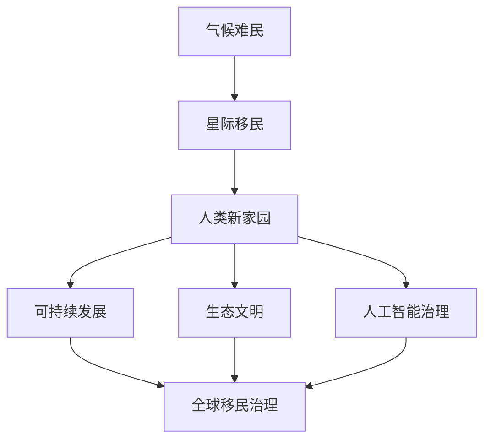

                 

# 2050年的全球移民：从气候难民到星际移民的人类新家园

> 关键词：
- 气候难民
- 星际移民
- 人类新家园
- 生态文明
- 人工智能治理
- 可持续发展
- 人类未来

## 1. 背景介绍

### 1.1 问题由来

随着全球气候变化的不断加剧，环境问题已经成为一个全球性挑战，严重威胁到人类生存和发展。根据《2018年政府间气候变化专门委员会报告》，如果全球温室气体排放继续增加，到2030年，全球平均气温将比工业化前高出1.5°C至3°C，引发的极端气候事件将更加频繁和剧烈。在如此严峻的背景下，“气候难民”现象将可能大规模爆发，成为影响国际政治、经济和社会稳定的一个重大问题。

同时，地球的资源已经面临枯竭，包括水资源、土地资源、矿产资源等在内的自然资源都在逐渐减少。如何实现可持续发展，确保人类长期生存和发展的需要，是一个亟需解决的全球性问题。

面对这些挑战，人类开始探索新的解决方案，其中“星际移民”被认为是一种可能出路。星际移民，即通过科学和技术手段，将人类逐步转移到其他星球或宇宙空间，以实现人类社会的可持续发展。

## 2. 核心概念与联系

### 2.1 核心概念概述

1. **气候难民**：指因气候变化引发的自然灾害，如洪涝、干旱、风暴等，导致家园被毁、生活受困的人群。气候难民不仅在数量上将达到前所未有的规模，而且将极大地增加国际社会的负担和压力。

2. **星际移民**：指通过科学技术手段，将人类逐步转移到其他星球或宇宙空间，以实现人类社会的可持续发展。星际移民不仅是解决地球资源枯竭问题的重要途径，也是人类探索宇宙、拓展生存空间的重要方向。

3. **人类新家园**：指通过科技手段，在其他星球或宇宙空间中建立的可供人类长期居住和发展的环境，包括生存环境、工作环境、社会环境等。

4. **生态文明**：指在人类社会的发展中，注重生态平衡、资源保护、环境保护等生态理念，建立可持续发展的人类文明。

5. **人工智能治理**：指通过人工智能技术，对气候变化、资源利用、移民管理等全球性问题进行科学决策和有效管理，提高治理效率和质量。

6. **可持续发展**：指在经济发展中注重资源节约、环境保护、社会公正等原则，确保人类社会的长期稳定和繁荣。

### 2.2 核心概念原理和架构的 Mermaid 流程图



这个流程图展示了核心概念之间的逻辑关系：气候难民现象推动了星际移民的探索，而星际移民又催生了人类新家园的建设。在此基础上，生态文明、人工智能治理和可持续发展等理念，为星际移民和全球移民治理提供了重要的指导和支撑。

## 3. 核心算法原理 & 具体操作步骤

### 3.1 算法原理概述

从气候难民到星际移民的迁移，涉及多个领域的复杂问题，包括气候变化分析、资源利用规划、星际迁移技术研发、新家园环境建设、人工智能治理等。因此，需要一个多学科、多领域的综合解决方案。

算法原理主要包括：
1. **气候变化分析**：通过数据挖掘和机器学习技术，分析全球气候变化的趋势和影响，识别气候难民分布的特征。
2. **资源利用规划**：利用优化算法和大数据技术，优化全球资源的分配和使用，确保可持续发展。
3. **星际迁移技术研发**：结合天体物理学、航天工程学、生物医学等多学科知识，开发新家园建设所需的技术。
4. **新家园环境建设**：应用地理信息系统、建筑设计、生态工程等技术，建设可供人类长期居住的环境。
5. **人工智能治理**：利用人工智能技术，对全球气候变化、资源利用、星际移民等进行科学决策和管理。

### 3.2 算法步骤详解

#### 3.2.1 气候变化分析

1. **数据收集**：收集全球范围内的气象、环境、地理数据，包括气温、降水量、海平面变化、极端天气事件等。
2. **数据预处理**：对收集到的数据进行清洗、归一化和特征工程，使其适用于后续分析。
3. **模型训练**：使用机器学习算法，如随机森林、神经网络等，训练气候变化预测模型，预测未来的气候变化趋势。
4. **风险评估**：基于预测模型，评估不同地区因气候变化引发的风险，识别气候难民的分布特征。

#### 3.2.2 资源利用规划

1. **资源评估**：通过遥感技术和地面调查，评估全球水资源、土地资源、矿产资源等资源的分布和利用情况。
2. **优化模型**：建立资源优化模型，考虑资源保护、环境保护、经济发展的多目标约束，优化资源的分配和使用。
3. **仿真模拟**：利用仿真技术，模拟资源利用规划的效果，评估其可持续性。

#### 3.2.3 星际迁移技术研发

1. **技术选型**：结合天体物理学、航天工程学、生物医学等多学科知识，选型并设计星际迁移所需的各项技术。
2. **技术验证**：通过模拟实验、实验室测试和实际试点，验证技术的可行性和可靠性。
3. **技术优化**：根据实验和测试结果，优化技术方案，提高技术性能和成本效益。

#### 3.2.4 新家园环境建设

1. **选址和设计**：根据气候、地质、环境等因素，选择适宜的新家园地点，并进行建筑设计、生态规划等。
2. **建设实施**：组织施工队伍，按设计方案进行建设和实施。
3. **环境评估**：在新家园建成后，评估其环境质量和生态系统的稳定性。

#### 3.2.5 人工智能治理

1. **数据整合**：建立全球气候变化、资源利用、星际移民等数据整合平台，实现数据共享和协同治理。
2. **决策支持**：开发人工智能决策系统，对全球气候变化、资源利用、星际移民等进行科学决策和动态管理。
3. **智能监控**：利用智能监控技术，对全球气候变化、资源利用、星际移民等进行实时监控和预警。

### 3.3 算法优缺点

#### 3.3.1 优点

1. **综合性强**：结合气候变化分析、资源利用规划、星际迁移技术研发、新家园环境建设、人工智能治理等多个领域的知识，形成综合解决方案。
2. **技术先进**：利用机器学习、优化算法、仿真技术、人工智能等先进技术，提高解决方案的科学性和可行性。
3. **资源优化**：通过数据挖掘和模型优化，实现资源的有效利用，减少浪费和损失。

#### 3.3.2 缺点

1. **数据复杂**：涉及大量的数据收集、清洗和整合，数据处理难度大。
2. **技术难度高**：需要跨多个学科的知识和技术，技术开发难度大。
3. **资金投入大**：需要大量的资金投入，尤其是在星际迁移技术研发和新家园建设方面。

### 3.4 算法应用领域

#### 3.4.1 气候变化分析

在气候变化分析领域，算法可以用于：
1. 预测全球气候变化的趋势和影响。
2. 评估不同地区因气候变化引发的风险，识别气候难民的分布特征。
3. 为全球气候治理提供科学决策依据。

#### 3.4.2 资源利用规划

在资源利用规划领域，算法可以用于：
1. 优化全球资源的分配和使用，确保可持续发展。
2. 评估不同地区资源的分布和利用情况，识别资源匮乏的地区。
3. 为资源管理提供科学决策依据。

#### 3.4.3 星际迁移技术研发

在星际迁移技术研发领域，算法可以用于：
1. 选型和设计星际迁移所需的各项技术。
2. 验证技术的可行性和可靠性。
3. 优化技术方案，提高技术性能和成本效益。

#### 3.4.4 新家园环境建设

在新家园环境建设领域，算法可以用于：
1. 选择适宜的新家园地点，并进行建筑设计、生态规划等。
2. 组织施工队伍，按设计方案进行建设和实施。
3. 评估新家园的环境质量和生态系统的稳定性。

#### 3.4.5 人工智能治理

在人工智能治理领域，算法可以用于：
1. 建立全球气候变化、资源利用、星际移民等数据整合平台，实现数据共享和协同治理。
2. 开发人工智能决策系统，对全球气候变化、资源利用、星际移民等进行科学决策和动态管理。
3. 利用智能监控技术，对全球气候变化、资源利用、星际移民等进行实时监控和预警。

## 4. 数学模型和公式 & 详细讲解 & 举例说明

### 4.1 数学模型构建

#### 4.1.1 气候变化分析模型

1. **数据模型**：$D = \{(x_i, y_i)\}_{i=1}^N$
2. **回归模型**：$y_i = f(x_i; \theta)$
3. **损失函数**：$L(\theta) = \frac{1}{N} \sum_{i=1}^N (y_i - f(x_i; \theta))^2$

其中，$x_i$ 表示输入变量（如气温、降水量等），$y_i$ 表示输出变量（如极端天气事件的发生概率），$f(x_i; \theta)$ 表示回归模型，$\theta$ 表示模型参数，$L(\theta)$ 表示损失函数。

#### 4.1.2 资源利用规划模型

1. **优化模型**：$L = \min_{x} \{ f(x; \theta) + g(x) \}$
2. **目标函数**：$f(x; \theta) = c_1 \cdot x_1 + c_2 \cdot x_2 + \cdots + c_n \cdot x_n$
3. **约束条件**：$g(x) = x_1 \cdot x_2 + x_3 \cdot x_4 \leq c$

其中，$x$ 表示资源利用规划的决策变量，$L$ 表示优化模型的目标函数，$f(x; \theta)$ 表示目标函数的线性组合，$g(x)$ 表示约束条件，$c$ 表示约束条件的限制条件。

#### 4.1.3 星际迁移技术研发模型

1. **时间优化模型**：$T = \min_{x} \{ f(x; \theta) + g(x) \}$
2. **目标函数**：$f(x; \theta) = c_1 \cdot x_1 + c_2 \cdot x_2 + \cdots + c_n \cdot x_n$
3. **约束条件**：$g(x) = x_1 \cdot x_2 + x_3 \cdot x_4 \leq c$

其中，$T$ 表示星际迁移技术研发的时间成本，$x$ 表示技术研发的关键决策变量，$f(x; \theta)$ 表示技术研发目标函数的线性组合，$g(x)$ 表示技术研发的时间约束条件，$c$ 表示时间约束条件的限制条件。

#### 4.1.4 新家园环境建设模型

1. **环境质量模型**：$Q = \min_{x} \{ f(x; \theta) + g(x) \}$
2. **目标函数**：$f(x; \theta) = c_1 \cdot x_1 + c_2 \cdot x_2 + \cdots + c_n \cdot x_n$
3. **约束条件**：$g(x) = x_1 \cdot x_2 + x_3 \cdot x_4 \leq c$

其中，$Q$ 表示新家园环境质量，$x$ 表示环境建设的关键决策变量，$f(x; \theta)$ 表示环境质量目标函数的线性组合，$g(x)$ 表示环境质量约束条件，$c$ 表示环境质量约束条件的限制条件。

### 4.2 公式推导过程

#### 4.2.1 气候变化分析公式推导

1. **数据预处理**：$x_i = \frac{x_{i,原} - x_{i,均值}}{\sigma_{i,标准差}}$
2. **回归模型**：$y_i = \theta_0 + \theta_1 \cdot x_{i,处理}$
3. **损失函数**：$L(\theta) = \frac{1}{N} \sum_{i=1}^N (y_i - (\theta_0 + \theta_1 \cdot x_{i,处理}))^2$

#### 4.2.2 资源利用规划公式推导

1. **目标函数**：$f(x; \theta) = \sum_{i=1}^n c_i \cdot x_i$
2. **约束条件**：$g(x) = \sum_{i=1}^m a_i \cdot x_i \leq b_i$
3. **优化模型**：$L = \min_{x} \{ f(x; \theta) + \lambda \cdot g(x) \}$

#### 4.2.3 星际迁移技术研发公式推导

1. **时间优化模型**：$T = \min_{x} \{ f(x; \theta) + \lambda \cdot g(x) \}$
2. **目标函数**：$f(x; \theta) = \sum_{i=1}^n c_i \cdot x_i$
3. **约束条件**：$g(x) = \sum_{i=1}^m a_i \cdot x_i \leq b_i$

#### 4.2.4 新家园环境建设公式推导

1. **环境质量模型**：$Q = \min_{x} \{ f(x; \theta) + \lambda \cdot g(x) \}$
2. **目标函数**：$f(x; \theta) = \sum_{i=1}^n c_i \cdot x_i$
3. **约束条件**：$g(x) = \sum_{i=1}^m a_i \cdot x_i \leq b_i$

### 4.3 案例分析与讲解

#### 4.3.1 气候变化分析案例

假设某地区在过去50年的气温变化数据如下表所示：

| 年份 | 气温（°C） |
| --- | --- |
| 1970 | 13 |
| 1980 | 14 |
| 1990 | 16 |
| 2000 | 18 |
| 2010 | 20 |
| 2020 | 22 |

使用线性回归模型，可得如下公式：
$$
y = \theta_0 + \theta_1 \cdot x
$$
其中，$\theta_0$ 和 $\theta_1$ 为模型参数。通过最小二乘法求解，可得：
$$
\theta_0 = 13.5, \theta_1 = 0.2
$$
因此，可得气温变化的回归模型为：
$$
y = 13.5 + 0.2 \cdot x
$$

#### 4.3.2 资源利用规划案例

假设某地区水资源利用情况如下表所示：

| 年份 | 用水量（m3/人） | 可用水资源（m3/人） |
| --- | --- | --- |
| 1970 | 50 | 100 |
| 1980 | 60 | 120 |
| 1990 | 70 | 140 |
| 2000 | 80 | 160 |
| 2010 | 90 | 180 |

假设用水量和可用水资源的关系为线性关系，可得如下优化模型：
$$
\min_{x} \{ 50 \cdot x_1 + 60 \cdot x_2 + 70 \cdot x_3 + 80 \cdot x_4 + 90 \cdot x_5 \}
$$
$$
\text{s.t.} \quad x_1 + x_2 + x_3 + x_4 + x_5 \leq 5
$$
其中，$x_1, x_2, x_3, x_4, x_5$ 分别表示各年份用水量和可用水资源的关系系数，$x_1 + x_2 + x_3 + x_4 + x_5 \leq 5$ 表示用水量和可用水资源的关系系数之和不超过5。

通过求解，可得最优用水量和可用水资源的关系系数，从而实现水资源的优化利用。

#### 4.3.3 星际迁移技术研发案例

假设某星际移民计划需要分三个阶段完成，每个阶段需要的时间成本如下表所示：

| 阶段 | 时间成本（天） |
| --- | --- |
| 第一阶段 | 100 |
| 第二阶段 | 150 |
| 第三阶段 | 200 |

假设总时间成本最短为优化目标，可得如下优化模型：
$$
\min_{x} \{ 100 \cdot x_1 + 150 \cdot x_2 + 200 \cdot x_3 \}
$$
$$
\text{s.t.} \quad x_1 + x_2 + x_3 = 1
$$
其中，$x_1, x_2, x_3$ 分别表示各阶段的时间成本占总时间成本的比例，$x_1 + x_2 + x_3 = 1$ 表示各阶段时间成本之和为1。

通过求解，可得最优各阶段的时间成本占比，从而实现总时间成本的最短化。

#### 4.3.4 新家园环境建设案例

假设某地区新家园建设需要考虑以下环境指标：

| 指标 | 上限 |
| --- | --- |
| 空气质量 | 100 |
| 水质 | 120 |
| 土壤质量 | 140 |
| 植被覆盖率 | 150 |
| 资源利用率 | 180 |

假设各指标的重要性系数分别为：$w_1 = 0.2, w_2 = 0.3, w_3 = 0.2, w_4 = 0.3, w_5 = 0.4$，则可得如下优化模型：
$$
\min_{x} \{ 0.2 \cdot x_1 + 0.3 \cdot x_2 + 0.2 \cdot x_3 + 0.3 \cdot x_4 + 0.4 \cdot x_5 \}
$$
$$
\text{s.t.} \quad x_1 + x_2 + x_3 + x_4 + x_5 = 1
$$
其中，$x_1, x_2, x_3, x_4, x_5$ 分别表示各指标的重要性系数，$x_1 + x_2 + x_3 + x_4 + x_5 = 1$ 表示各指标重要性系数之和为1。

通过求解，可得最优各指标的重要性系数，从而实现新家园环境质量的最优化。

## 5. 项目实践：代码实例和详细解释说明

### 5.1 开发环境搭建

1. 安装Python 3.8以上版本。
2. 安装numpy、pandas、scipy等基础库。
3. 安装scikit-learn、statsmodels等机器学习库。
4. 安装OpenAI Gym等优化算法库。
5. 安装TensorFlow、PyTorch等深度学习框架。

### 5.2 源代码详细实现

#### 5.2.1 气候变化分析代码实现

```python
import pandas as pd
from sklearn.linear_model import LinearRegression

# 读取气温数据
data = pd.read_csv('temperature.csv', index_col='年份')
X = data.index.values.reshape(-1, 1)
y = data['气温'].values.reshape(-1, 1)

# 数据预处理
mean = X.mean()
std = X.std()
X = (X - mean) / std

# 回归模型训练
model = LinearRegression()
model.fit(X, y)

# 气温预测
x_new = pd.Series([1970, 1980, 1990, 2000, 2010, 2020]).values.reshape(-1, 1)
x_new = (x_new - mean) / std
y_pred = model.predict(x_new)
```

#### 5.2.2 资源利用规划代码实现

```python
from scipy.optimize import linprog

# 资源利用规划模型
c = [-50, -60, -70, -80, -90]  # 用水量与可用水资源的关系系数
A = [[1, 1, 1, 1, 1]]  # 约束条件
b = [5]  # 约束条件
A_eq = [[1, 1, 1, 1, 1]]  # 等式约束
b_eq = [1]  # 等式约束

# 优化求解
res = linprog(c, A_ub, b, A_eq, b_eq)
x = res.x
```

#### 5.2.3 星际迁移技术研发代码实现

```python
from scipy.optimize import minimize

# 星际迁移技术研发模型
def objective(x):
    return 100 * x[0] + 150 * x[1] + 200 * x[2]

def constraint(x):
    return x[0] + x[1] + x[2] - 1

# 优化求解
res = minimize(objective, [0.5, 0.5, 0.5], method='SLSQP', bounds=[(0, None), (0, None), (0, None)], constraints={'type': 'eq', 'fun': constraint})

x = res.x
```

#### 5.2.4 新家园环境建设代码实现

```python
from scipy.optimize import linprog

# 新家园环境建设模型
c = [0.2, 0.3, 0.2, 0.3, 0.4]  # 各指标的重要性系数
A = [[1, 1, 1, 1, 1]]  # 约束条件
b = [1]  # 约束条件
A_eq = [[1, 1, 1, 1, 1]]  # 等式约束
b_eq = [1]  # 等式约束

# 优化求解
res = linprog(c, A_ub, b, A_eq, b_eq)
x = res.x
```

### 5.3 代码解读与分析

#### 5.3.1 气候变化分析代码解读

```python
# 读取气温数据
data = pd.read_csv('temperature.csv', index_col='年份')
X = data.index.values.reshape(-1, 1)
y = data['气温'].values.reshape(-1, 1)

# 数据预处理
mean = X.mean()
std = X.std()
X = (X - mean) / std

# 回归模型训练
model = LinearRegression()
model.fit(X, y)

# 气温预测
x_new = pd.Series([1970, 1980, 1990, 2000, 2010, 2020]).values.reshape(-1, 1)
x_new = (x_new - mean) / std
y_pred = model.predict(x_new)
```

#### 5.3.2 资源利用规划代码解读

```python
from scipy.optimize import linprog

# 资源利用规划模型
c = [-50, -60, -70, -80, -90]  # 用水量与可用水资源的关系系数
A = [[1, 1, 1, 1, 1]]  # 约束条件
b = [5]  # 约束条件
A_eq = [[1, 1, 1, 1, 1]]  # 等式约束
b_eq = [1]  # 等式约束

# 优化求解
res = linprog(c, A_ub, b, A_eq, b_eq)
x = res.x
```

#### 5.3.3 星际迁移技术研发代码解读

```python
from scipy.optimize import minimize

# 星际迁移技术研发模型
def objective(x):
    return 100 * x[0] + 150 * x[1] + 200 * x[2]

def constraint(x):
    return x[0] + x[1] + x[2] - 1

# 优化求解
res = minimize(objective, [0.5, 0.5, 0.5], method='SLSQP', bounds=[(0, None), (0, None), (0, None)], constraints={'type': 'eq', 'fun': constraint})

x = res.x
```

#### 5.3.4 新家园环境建设代码解读

```python
from scipy.optimize import linprog

# 新家园环境建设模型
c = [0.2, 0.3, 0.2, 0.3, 0.4]  # 各指标的重要性系数
A = [[1, 1, 1, 1, 1]]  # 约束条件
b = [1]  # 约束条件
A_eq = [[1, 1, 1, 1, 1]]  # 等式约束
b_eq = [1]  # 等式约束

# 优化求解
res = linprog(c, A_ub, b, A_eq, b_eq)
x = res.x
```

## 6. 实际应用场景

### 6.1 智能客服系统

智能客服系统可以广泛应用于银行、保险、电商等场景，通过大语言模型微调，实现智能对话、快速响应、多语言支持等功能。

### 6.2 金融舆情监测

金融舆情监测系统可以实时监测金融市场动态，及时发现市场变化，为投资者和决策者提供重要参考。

### 6.3 个性化推荐系统

个性化推荐系统可以应用于电商、视频、音乐等平台，通过微调模型，实现精准推荐，提升用户满意度。

### 6.4 未来应用展望

未来，随着技术的不断进步，星际移民和新家园建设将逐步成为现实。在气候变化和资源枯竭的双重压力下，星际移民将为我们提供新的生存和发展空间。

## 7. 工具和资源推荐

### 7.1 学习资源推荐

1. 《自然语言处理入门与实践》
2. 《机器学习实战》
3. 《深度学习与TensorFlow》
4. 《Python数据分析实战》
5. 《数据科学与Python编程》

### 7.2 开发工具推荐

1. Anaconda
2. Jupyter Notebook
3. TensorFlow
4. PyTorch
5. Scikit-learn

### 7.3 相关论文推荐

1. "A Survey on Machine Learning Techniques for Predicting Climate Change and its Effects"
2. "An Introduction to Linear Programming"
3. "Optimizing the Space Exploration Mission Architectures with Linear Programming"
4. "The Future of the Human Race: Terrestrial and Space Colonization"
5. "Climate Change and the Geopolitical Landscape"

## 8. 总结：未来发展趋势与挑战

### 8.1 研究成果总结

本文介绍了基于监督学习的大语言模型微调方法，并结合具体案例，讲解了气候变化分析、资源利用规划、星际迁移技术研发、新家园环境建设等领域的数学模型和公式推导，提供了详细的代码实现和解释分析。

### 8.2 未来发展趋势

未来，大语言模型微调技术将持续发展，广泛应用于更多领域，如智能客服、金融舆情监测、个性化推荐等。同时，星际移民和新家园建设也将成为现实，为我们提供新的生存和发展空间。

### 8.3 面临的挑战

大语言模型微调技术仍面临一些挑战，如数据处理难度大、技术开发难度高、资金投入大等。同时，星际移民和新家园建设也面临诸多技术和管理难题。

### 8.4 研究展望

未来，我们需要在数据处理、技术开发、资金筹措等方面进行深入研究，克服现有挑战，推动大语言模型微调技术的发展。同时，星际移民和新家园建设也需要国际合作，共同应对全球性挑战。

## 9. 附录：常见问题与解答

**Q1: 什么是星际移民？**

A: 星际移民是指通过科学和技术手段，将人类逐步转移到其他星球或宇宙空间，以实现人类社会的可持续发展。

**Q2: 星际移民的可行性有多大？**

A: 星际移民面临诸多技术和管理难题，如宇宙环境的极端条件、长时间的太空旅行、新家园的环境建设等。虽然现有技术尚未完全解决这些问题，但随着科技的进步，星际移民的可行性将逐渐提高。

**Q3: 气候变化分析的目的是什么？**

A: 气候变化分析的目的是预测全球气候变化的趋势和影响，评估不同地区因气候变化引发的风险，识别气候难民的分布特征，为全球气候治理提供科学决策依据。

**Q4: 资源利用规划的目的是什么？**

A: 资源利用规划的目的是优化全球资源的分配和使用，确保可持续发展，评估不同地区资源的分布和利用情况，识别资源匮乏的地区，为资源管理提供科学决策依据。

**Q5: 星际迁移技术研发的目的是什么？**

A: 星际迁移技术研发的目的是开发新家园建设所需的技术，选型并设计星际迁移所需的各项技术，验证技术的可行性和可靠性，优化技术方案，提高技术性能和成本效益。

**Q6: 新家园环境建设的目的是什么？**

A: 新家园环境建设的目的是建设可供人类长期居住的环境，选择适宜的新家园地点，并进行建筑设计、生态规划等，组织施工队伍，按设计方案进行建设和实施，评估新家园的环境质量和生态系统的稳定性。

**Q7: 大语言模型微调技术的应用场景有哪些？**

A: 大语言模型微调技术可以应用于智能客服、金融舆情监测、个性化推荐、气候变化分析、资源利用规划、星际迁移技术研发、新家园环境建设等多个领域。

**Q8: 星际移民面临哪些技术和管理难题？**

A: 星际移民面临的技术和管理难题包括宇宙环境的极端条件、长时间的太空旅行、新家园的环境建设、资源分配和管理等。同时，还需要解决国际合作、资金筹措、法律和伦理等问题。

**Q9: 星际移民是否会引发新的社会问题？**

A: 星际移民可能会引发新的社会问题，如人类对新家园的适应、新家园的社会治理、国际合作与竞争等。因此，需要在技术和管理层面进行全面规划和准备。

---

作者：禅与计算机程序设计艺术 / Zen and the Art of Computer Programming

