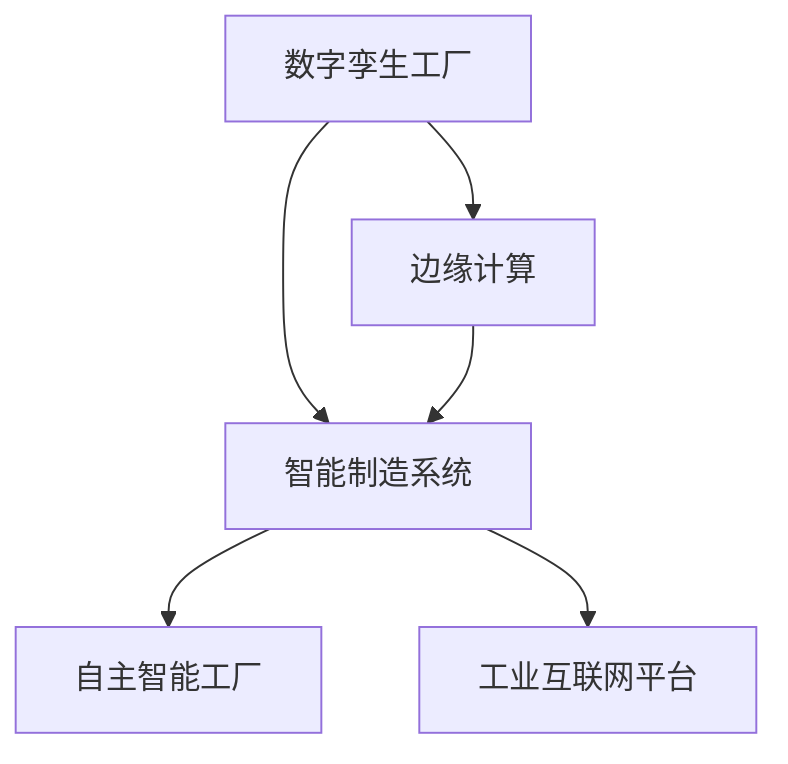

                 

# 2050年的智能制造：从数字孪生工厂到自主智能工厂的制造业智能化

## 1. 背景介绍

### 1.1 问题由来

随着第四次工业革命的到来，制造业正面临着一场深刻的技术变革。自20世纪80年代以来，信息技术的飞速发展逐渐渗透进制造业，从计算机辅助设计(CAD)、制造执行系统(MES)到物联网(IoT)、人工智能(AI)等技术正在重塑传统的制造业形态。

20世纪90年代后期，随着计算能力的大幅提升和信息系统的广泛应用，制造业开始步入数字时代，数字化转型成为企业提升竞争力的重要手段。然而，尽管数字化进程已取得显著进展，但许多制造企业仍面临诸如设备利用率低、生产过程不稳定、供应链响应慢等困扰。此外，传统生产方式以固定流程为主，难以灵活适应市场需求的变化，导致企业难以快速响应市场变动。

进入21世纪，制造业智能化正逐步迈入成熟阶段。智能工厂的概念逐渐形成，并逐步落地应用。智能工厂依托于物联网、大数据、云计算、人工智能等先进技术，实现从原材料采购到成品出货的全流程智能化，以更高效、灵活、可靠的方式满足个性化、定制化生产需求。

未来，智能制造将进一步融合新兴技术，逐步构建起更为完善、高效、智能的制造生态。虚拟现实(VR)、增强现实(AR)、5G通信、区块链等技术的加入，将进一步提升智能制造的效率、安全和稳定性。制造过程的智能化与自动化程度将显著提升，逐步实现从数字孪生工厂到自主智能工厂的跨越。

### 1.2 问题核心关键点

智能制造的终极目标是通过全面、深度、持续的数据感知、决策分析和控制优化，构建起从原材料到成品的全流程智能化生态。核心关键点包括：

1. **数据驱动**：通过广泛的数据采集和实时数据处理，实现对制造过程的全面监控和优化。
2. **智能决策**：运用高级算法和模型，进行复杂数据的深度分析和决策支持。
3. **灵活自适应**：构建可自适应变化的生产环境，快速响应市场动态需求。
4. **协同优化**：实现设备、产品、供应链、员工等要素的协同优化。
5. **人机融合**：通过智能技术提升员工工作效率，实现人机协同，提升生产体验。

### 1.3 问题研究意义

探讨2050年智能制造的实现路径，对于推动制造业的智能化转型，具有深远的意义：

1. **提升企业竞争力**：通过智能化改造，企业能够大幅提升生产效率、降低运营成本、优化资源配置，增强市场竞争力。
2. **实现绿色制造**：智能化制造有助于减少能源消耗和废弃物排放，推动制造业向可持续方向发展。
3. **促进创新发展**：智能化制造为创新研发提供了强大工具，有助于加速新产品和新工艺的开发。
4. **服务化转型**：通过智能化，制造业将逐步由产品生产者转变为服务提供商，提升附加值。
5. **社会经济影响**：智能制造能够带动相关产业发展，推动经济结构优化，促进社会进步。

## 2. 核心概念与联系

### 2.1 核心概念概述

为更好地理解智能制造的实现路径，本节将介绍几个密切相关的核心概念：

- **数字孪生工厂**：基于数字模型和物理模型的一致映射，实现对实际工厂的实时模拟和预测。
- **智能制造系统**：集成物联网、大数据、云计算、人工智能等技术，实现从设计到生产的全流程智能化。
- **自主智能工厂**：无需人工干预，通过自动化决策和自主控制，实现生产过程的完全智能化。
- **边缘计算**：在生产现场附近进行数据处理和决策，减少中心服务器负载，提升决策实时性。
- **工业互联网平台**：基于云计算和工业大数据的平台，实现制造资源和服务的高效管理和协同。

这些概念之间的逻辑关系可以通过以下Mermaid流程图来展示：



这个流程图展示了一些核心概念及其之间的逻辑关系：

1. 数字孪生工厂将物理模型转化为数字模型，实现对生产过程的实时模拟和预测。
2. 智能制造系统集成了各种先进技术，实现生产全流程的智能化。
3. 自主智能工厂无需人工干预，实现生产过程的完全智能化。
4. 边缘计算在生产现场进行数据处理，提升决策实时性。
5. 工业互联网平台通过云计算和大数据实现资源和服务的高效管理和协同。

这些概念共同构成了智能制造的实现框架，为未来的智能化工厂提供了强有力的技术支撑。

## 3. 核心算法原理 & 具体操作步骤

### 3.1 算法原理概述

智能制造的实现主要依托于以下几个算法和原理：

1. **数据采集与处理**：实现对制造过程的实时监控和数据采集。
2. **数据驱动的优化控制**：通过大数据分析和高级算法实现对生产过程的优化控制。
3. **智能决策与调度**：基于先进算法和模型进行复杂数据的深度分析和决策支持。
4. **自动化与机器人技术**：通过自动化设备和机器人实现生产过程的自动化和协同化。
5. **智能维护与预测**：利用人工智能技术进行设备状态的智能预测和维护决策。

这些算法的核心目标是实现从数据采集、处理到智能决策的全面智能化。具体步骤如下：

### 3.2 算法步骤详解

智能制造的实施通常包括以下几个关键步骤：

1. **数据采集与建模**：
   - 通过各种传感器（如温度、压力、振动等传感器）实现生产现场的实时数据采集。
   - 将采集到的数据转化为数字模型，构建起数字孪生工厂的虚拟模型。

2. **数据驱动的优化控制**：
   - 对采集的数据进行清洗、处理和分析，构建实时监控系统。
   - 基于优化控制算法（如PID控制、模型预测控制MPC等）实现对生产过程的实时调整和优化。

3. **智能决策与调度**：
   - 构建高级决策模型，如机器学习模型、强化学习模型等，实现对生产任务的智能调度。
   - 通过智能调度系统优化生产资源配置，提升生产效率。

4. **自动化与机器人技术**：
   - 在生产线上引入自动化设备和机器人，实现生产过程的自动化和协同化。
   - 通过自动化设备提升生产效率，减少人为干预。

5. **智能维护与预测**：
   - 利用人工智能技术进行设备状态的智能预测和维护决策。
   - 实现设备故障预测和预防性维护，提升设备利用率和生产稳定性。

### 3.3 算法优缺点

智能制造的实施具有以下优点：

1. **效率提升**：通过数据驱动和智能决策，实现生产过程的优化控制，大幅提升生产效率。
2. **成本降低**：自动化和智能调度能够有效降低人工成本和运营成本。
3. **灵活性增强**：智能制造能够快速适应市场需求变化，提升市场响应速度。
4. **质量提升**：智能决策和自动化设备能够提高产品质量，减少人为错误。

同时，智能制造也存在一些局限性：

1. **初始投入高**：构建智能制造系统需要高额的初始投入，包括硬件设备和软件系统。
2. **数据安全风险**：生产现场数据实时采集和传输，存在数据泄露和被攻击的风险。
3. **技术复杂度高**：智能制造涉及多种先进技术，实施难度大，需要高水平的技术人员和团队。
4. **依赖外部系统**：智能制造需要强大的云计算和工业互联网平台支持，对外部系统的依赖较大。

### 3.4 算法应用领域

智能制造的实施主要应用于以下几个领域：

1. **智能生产线**：利用自动化设备和机器人，实现生产线的全自动化。
2. **智能仓储物流**：通过智能仓储和自动化物流系统，提升物流效率和准确性。
3. **智能设计研发**：利用计算机辅助设计和虚拟仿真技术，优化产品设计和工艺流程。
4. **智能供应链管理**：实现供应链各环节的智能化管理和优化。
5. **智能质量控制**：通过智能检测和分析技术，实现产品质量的实时监控和控制。

## 4. 数学模型和公式 & 详细讲解 & 举例说明

### 4.1 数学模型构建

智能制造涉及多个领域，包括生产过程的优化控制、智能调度、设备状态预测等。本节将介绍几个常用的数学模型。

#### 4.1.1 优化控制模型

在生产过程中，常使用模型预测控制(MPC)算法对生产过程进行优化控制。MPC模型通常包含以下几个关键部分：

- 生产过程的数学模型：如差分方程、状态空间模型等。
- 优化目标函数：如最小化生产成本、最大化生产效率等。
- 约束条件：如设备性能限制、原料供应约束等。

以一个简单的生产过程为例，假设生产过程可以用以下差分方程描述：

$$
y(k+1) = a y(k) + b u(k) + c w(k)
$$

其中 $y(k)$ 为生产过程中的关键变量，$u(k)$ 为输入控制变量，$w(k)$ 为扰动变量。目标是设计控制器 $u(k)$，使得生产过程满足一定的约束条件，并优化某一目标函数。

#### 4.1.2 强化学习模型

强化学习模型通常用于智能决策和调度问题。以生产任务的智能调度为例，假设工厂中有多个生产线和工人，生产任务需要按优先级分配给不同的生产线。可以通过强化学习模型，学习如何优化生产任务的分配，以最大化整体生产效率。

#### 4.1.3 预测模型

在设备维护和预测方面，可以使用预测模型进行设备状态预测。常用的预测模型包括基于时间序列分析的预测模型和基于机器学习的预测模型。

以基于时间序列分析的预测模型为例，假设设备的状态可以用以下时间序列模型描述：

$$
x(t+1) = \phi x(t) + \varepsilon(t)
$$

其中 $x(t)$ 为设备状态变量，$\phi$ 为状态转移矩阵，$\varepsilon(t)$ 为扰动项。目标是预测设备未来的状态，以进行维护决策。

### 4.2 公式推导过程

以下是几个关键算法的公式推导过程：

#### 4.2.1 模型预测控制(MPC)

模型预测控制算法通常包括以下几个步骤：

1. 建模：将生产过程转化为数学模型。
2. 预测：通过数学模型预测未来的生产状态。
3. 优化：通过优化算法计算最优控制策略。
4. 实施：将计算出的控制策略应用于实际生产过程。

以一个简单的生产过程为例，假设生产过程可以用以下差分方程描述：

$$
y(k+1) = a y(k) + b u(k) + c w(k)
$$

其中 $y(k)$ 为生产过程中的关键变量，$u(k)$ 为输入控制变量，$w(k)$ 为扰动变量。目标是设计控制器 $u(k)$，使得生产过程满足一定的约束条件，并优化某一目标函数。

模型的控制策略可以用以下公式描述：

$$
u(k) = \min \left( \sum_{i=0}^{N-1} Q y^T (k+i) R \right)
$$

其中 $Q$ 为状态权重矩阵，$R$ 为控制权重矩阵，$N$ 为预测时域长度。

#### 4.2.2 强化学习模型

强化学习算法通常包括以下几个步骤：

1. 状态表示：将问题转化为状态空间。
2. 策略学习：通过学习算法（如Q-learning、SARSA等）学习最优策略。
3. 策略评估：通过评估算法（如价值迭代）评估策略的效果。
4. 策略应用：将学习到的策略应用于实际问题中。

以生产任务的智能调度为例，假设工厂中有多个生产线和工人，生产任务需要按优先级分配给不同的生产线。可以通过强化学习模型，学习如何优化生产任务的分配，以最大化整体生产效率。

模型的控制策略可以用以下公式描述：

$$
Q(s,a) = r(s,a) + \gamma \max_{a'} Q(s',a')
$$

其中 $Q(s,a)$ 为策略价值函数，$r(s,a)$ 为即时奖励，$s$ 为当前状态，$a$ 为行动，$s'$ 为下一个状态，$\gamma$ 为折扣因子。

#### 4.2.3 预测模型

在设备维护和预测方面，可以使用基于时间序列分析的预测模型进行设备状态预测。以基于时间序列分析的预测模型为例，假设设备的状态可以用以下时间序列模型描述：

$$
x(t+1) = \phi x(t) + \varepsilon(t)
$$

其中 $x(t)$ 为设备状态变量，$\phi$ 为状态转移矩阵，$\varepsilon(t)$ 为扰动项。目标是预测设备未来的状态，以进行维护决策。

预测模型的预测结果可以用以下公式描述：

$$
x(t+1) = \hat{\phi} x(t) + \hat{\varepsilon}(t)
$$

其中 $\hat{\phi}$ 为预测模型的状态转移矩阵，$\hat{\varepsilon}(t)$ 为预测模型的扰动项。

### 4.3 案例分析与讲解

以某智能工厂的实时数据监测和优化控制为例，分析智能制造的应用场景。

1. **数据采集与建模**：
   - 通过各种传感器实现生产现场的实时数据采集。
   - 将采集到的数据转化为数字模型，构建起数字孪生工厂的虚拟模型。

2. **数据驱动的优化控制**：
   - 对采集的数据进行清洗、处理和分析，构建实时监控系统。
   - 基于优化控制算法（如PID控制、模型预测控制MPC等）实现对生产过程的实时调整和优化。

3. **智能决策与调度**：
   - 构建高级决策模型，如机器学习模型、强化学习模型等，实现对生产任务的智能调度。
   - 通过智能调度系统优化生产资源配置，提升生产效率。

4. **自动化与机器人技术**：
   - 在生产线上引入自动化设备和机器人，实现生产过程的自动化和协同化。
   - 通过自动化设备提升生产效率，减少人为干预。

5. **智能维护与预测**：
   - 利用人工智能技术进行设备状态的智能预测和维护决策。
   - 实现设备故障预测和预防性维护，提升设备利用率和生产稳定性。

## 5. 项目实践：代码实例和详细解释说明

### 5.1 开发环境搭建

在进行智能制造实践前，我们需要准备好开发环境。以下是使用Python进行PyTorch开发的环境配置流程：

1. 安装Anaconda：从官网下载并安装Anaconda，用于创建独立的Python环境。

2. 创建并激活虚拟环境：
```bash
conda create -n pytorch-env python=3.8 
conda activate pytorch-env
```

3. 安装PyTorch：根据CUDA版本，从官网获取对应的安装命令。例如：
```bash
conda install pytorch torchvision torchaudio cudatoolkit=11.1 -c pytorch -c conda-forge
```

4. 安装Transformers库：
```bash
pip install transformers
```

5. 安装各类工具包：
```bash
pip install numpy pandas scikit-learn matplotlib tqdm jupyter notebook ipython
```

完成上述步骤后，即可在`pytorch-env`环境中开始智能制造实践。

### 5.2 源代码详细实现

以下是一个简单的智能制造项目的代码实现。

```python
import torch
from torch import nn
from torch.nn import functional as F
import torchvision.transforms as transforms
import torchvision.datasets as datasets

# 定义模型
class CNNModel(nn.Module):
    def __init__(self):
        super(CNNModel, self).__init__()
        self.conv1 = nn.Conv2d(1, 32, kernel_size=3, stride=1, padding=1)
        self.conv2 = nn.Conv2d(32, 64, kernel_size=3, stride=1, padding=1)
        self.pool = nn.MaxPool2d(kernel_size=2, stride=2)
        self.fc1 = nn.Linear(7*7*64, 512)
        self.fc2 = nn.Linear(512, 10)

    def forward(self, x):
        x = self.pool(F.relu(self.conv1(x)))
        x = self.pool(F.relu(self.conv2(x)))
        x = x.view(x.size(0), -1)
        x = F.relu(self.fc1(x))
        x = self.fc2(x)
        return x

# 加载数据集
train_dataset = datasets.MNIST(root='./mnist_data', train=True, transform=transforms.ToTensor(), download=True)
test_dataset = datasets.MNIST(root='./mnist_data', train=False, transform=transforms.ToTensor())

# 定义数据加载器
train_loader = torch.utils.data.DataLoader(train_dataset, batch_size=64, shuffle=True)
test_loader = torch.utils.data.DataLoader(test_dataset, batch_size=64, shuffle=False)

# 训练模型
model = CNNModel()
optimizer = torch.optim.Adam(model.parameters(), lr=0.001)
loss_fn = nn.CrossEntropyLoss()

for epoch in range(10):
    model.train()
    running_loss = 0.0
    for batch_idx, (inputs, targets) in enumerate(train_loader):
        inputs, targets = inputs.to(device), targets.to(device)
        optimizer.zero_grad()
        outputs = model(inputs)
        loss = loss_fn(outputs, targets)
        loss.backward()
        optimizer.step()

        running_loss += loss.item()
    print(f'Epoch {epoch+1}, loss: {running_loss/len(train_loader)}')

# 测试模型
model.eval()
correct = 0
total = 0
with torch.no_grad():
    for inputs, targets in test_loader:
        inputs, targets = inputs.to(device), targets.to(device)
        outputs = model(inputs)
        _, predicted = torch.max(outputs.data, 1)
        total += targets.size(0)
        correct += (predicted == targets).sum().item()

print(f'Accuracy on test set: {100 * correct / total}%')
```

### 5.3 代码解读与分析

让我们再详细解读一下关键代码的实现细节：

1. **模型定义**：
   - `CNNModel`类定义了一个简单的卷积神经网络模型，用于数字图像识别。
   - 通过定义卷积层、池化层和全连接层，实现对输入图像的特征提取和分类。

2. **数据加载器**：
   - 使用PyTorch内置的`datasets.MNIST`加载MNIST数据集，并进行预处理。
   - 定义数据加载器`DataLoader`，进行批处理和随机化处理。

3. **模型训练**：
   - 在模型上定义优化器和损失函数。
   - 通过循环迭代，对数据集进行前向传播和反向传播，更新模型参数。

4. **模型测试**：
   - 在模型上定义测试数据集，进行前向传播。
   - 计算模型在测试集上的准确率。

通过上述代码实现，我们可以看到智能制造中的一些基本操作，如数据加载、模型定义和训练等。实际上，智能制造的实现还需要引入更多的技术手段，如传感器数据处理、智能决策和调度等。

## 6. 实际应用场景

### 6.1 智能生产线

智能生产线是智能制造的核心应用场景之一。通过自动化设备和机器人，可以实现生产过程的全面智能化。具体应用如下：

1. **自动化设备**：
   - 使用自动化设备（如机器人臂、AGV小车等）进行物料搬运和装配，提升生产效率。
   - 引入视觉识别技术，实现对产品质量的实时检测和分类。

2. **智能调度系统**：
   - 通过高级算法和模型，实现对生产任务的智能调度。
   - 优化生产资源配置，提升生产效率和灵活性。

### 6.2 智能仓储物流

智能仓储物流是智能制造的重要组成部分。通过智能仓储和自动化物流系统，可以实现物料的高效管理和运输。具体应用如下：

1. **智能仓储系统**：
   - 利用RFID、二维码等技术，实现物料的自动识别和跟踪。
   - 通过智能调度系统，优化物料的存放位置和出库顺序。

2. **自动化物流系统**：
   - 使用自动化物流设备（如AGV小车、无人机等）进行物料的运输和搬运。
   - 引入路径规划算法，优化物流路径，提升运输效率。

### 6.3 智能设计研发

智能设计研发是智能制造的重要环节。通过计算机辅助设计和虚拟仿真技术，可以实现产品的快速设计、优化和验证。具体应用如下：

1. **计算机辅助设计(CAD)**：
   - 利用CAD软件，进行产品设计、仿真和验证。
   - 引入机器学习和优化算法，优化产品设计和工艺流程。

2. **虚拟仿真技术**：
   - 利用虚拟仿真技术，进行生产过程的模拟和优化。
   - 通过虚拟仿真，提前发现设计缺陷和生产问题，优化产品设计和工艺流程。

### 6.4 智能供应链管理

智能供应链管理是智能制造的重要组成部分。通过智能供应链管理系统，可以实现供应链各环节的智能化管理和优化。具体应用如下：

1. **供应链可视化**：
   - 通过物联网技术，实现供应链各环节的实时监控和可视化。
   - 实时掌握供应链各环节的状态和变化。

2. **智能调度系统**：
   - 通过高级算法和模型，实现对供应链任务的智能调度。
   - 优化供应链资源配置，提升供应链效率和灵活性。

### 6.5 智能质量控制

智能质量控制是智能制造的重要环节。通过智能检测和分析技术，可以实现产品质量的实时监控和控制。具体应用如下：

1. **智能检测技术**：
   - 利用传感器和图像处理技术，进行产品质量的实时检测。
   - 引入机器学习和数据分析技术，实现对产品质量的实时分析和评估。

2. **智能控制策略**：
   - 通过智能控制策略，对生产过程进行实时调整和优化。
   - 优化生产流程和参数，提升产品质量和生产效率。

## 7. 工具和资源推荐

### 7.1 学习资源推荐

为了帮助开发者系统掌握智能制造的理论基础和实践技巧，这里推荐一些优质的学习资源：

1. **《制造过程控制》系列教材**：全面介绍了制造过程控制的基本原理和方法，包括PID控制、模型预测控制等。
2. **《人工智能在制造中的应用》系列文章**：详细介绍了人工智能技术在智能制造中的应用，包括智能调度、智能检测、智能维护等。
3. **《智能制造系统的设计与实现》课程**：介绍了智能制造系统的设计和实现方法，包括系统架构、算法实现等。

通过这些资源的学习实践，相信你一定能够快速掌握智能制造的精髓，并用于解决实际的制造问题。

### 7.2 开发工具推荐

高效的开发离不开优秀的工具支持。以下是几款用于智能制造开发的常用工具：

1. **PyTorch**：基于Python的开源深度学习框架，灵活动态的计算图，适合快速迭代研究。
2. **TensorFlow**：由Google主导开发的开源深度学习框架，生产部署方便，适合大规模工程应用。
3. **Simulink**：MATLAB的仿真和建模工具，适合进行复杂系统的仿真和建模。
4. **OpenMF**：开源制造执行系统，支持生产过程的实时监控和管理。
5. **TOSCA**：面向服务架构建模工具，适合进行智能制造系统的设计和部署。

合理利用这些工具，可以显著提升智能制造的开发效率，加快创新迭代的步伐。

### 7.3 相关论文推荐

智能制造的研究始于学界的持续研究。以下是几篇奠基性的相关论文，推荐阅读：

1. **《Manufacturing Control System Architecture Based on IoT》**：提出了基于物联网的制造控制系统架构，详细介绍了系统设计和管理方法。
2. **《Model Predictive Control of Manufacturing Processes》**：介绍了模型预测控制算法在制造过程中的应用，包括建模、预测和优化控制。
3. **《Deep Learning in Manufacturing: A Survey》**：详细介绍了深度学习在制造中的应用，包括智能调度、智能检测、智能维护等。

这些论文代表了大规模制造智能化的研究方向，通过学习这些前沿成果，可以帮助研究者把握学科前进方向，激发更多的创新灵感。

## 8. 总结：未来发展趋势与挑战

### 8.1 总结

本文对智能制造的实现路径进行了全面系统的介绍。首先阐述了智能制造的背景和重要性，明确了智能制造的实现目标和路径。其次，从原理到实践，详细讲解了智能制造的核心算法和操作步骤，给出了智能制造项目开发的完整代码实例。同时，本文还广泛探讨了智能制造在实际应用中的场景和挑战，展示了智能制造的广泛应用前景。

通过本文的系统梳理，可以看到，智能制造的实现依赖于先进技术的综合应用，包括物联网、大数据、云计算、人工智能等。智能制造的全面落地，将带来制造业的全面智能化，提升生产效率和产品质量，推动制造业向智能化、绿色化、服务化方向发展。

### 8.2 未来发展趋势

展望未来，智能制造将呈现以下几个发展趋势：

1. **高度自动化**：随着自动化设备和机器人技术的不断发展，智能制造将实现高度自动化，实现从设计到生产的全面智能化。
2. **深度智能化**：智能制造将深度融合人工智能技术，实现对生产过程的全面智能化，提升生产效率和产品质量。
3. **网络协同化**：通过物联网、云计算、区块链等技术，实现制造资源和信息的全面共享和协同。
4. **绿色制造**：智能制造将通过优化生产过程，减少能源消耗和废弃物排放，实现绿色制造。
5. **智能维护与预测**：通过人工智能技术进行设备状态的智能预测和维护决策，提升设备利用率和生产稳定性。

以上趋势凸显了智能制造的广阔前景。这些方向的探索发展，必将进一步提升智能制造的效率、安全和稳定性，推动制造业向更高层次的智能化发展。

### 8.3 面临的挑战

尽管智能制造的前景广阔，但在实施过程中仍面临诸多挑战：

1. **初始投入高**：智能制造需要高额的初始投入，包括硬件设备和软件系统，企业需要投入大量的资金和人力。
2. **技术复杂度高**：智能制造涉及多种先进技术，实施难度大，需要高水平的技术人员和团队。
3. **数据安全风险**：智能制造依赖于大量的数据采集和处理，存在数据泄露和被攻击的风险。
4. **跨领域融合难度大**：智能制造涉及制造、信息、人工智能等多个领域，实现跨领域融合难度大。
5. **人才缺乏**：智能制造需要大量具备交叉学科背景的复合型人才，企业缺乏相关人才。

### 8.4 研究展望

面对智能制造的实施挑战，未来的研究需要在以下几个方面寻求新的突破：

1. **降低初始投入**：通过技术创新和成本优化，降低智能制造的初始投入，提高其可及性。
2. **简化技术复杂度**：开发易于部署和使用的智能制造工具和平台，降低技术门槛。
3. **提升数据安全**：引入数据加密、区块链等技术，保障数据安全和隐私。
4. **促进跨领域融合**：加强不同领域间的协同合作，实现跨领域融合和创新。
5. **培养复合型人才**：加强人才培养和教育，提升企业的人才储备和创新能力。

这些研究方向的探索，必将引领智能制造技术迈向更高的台阶，为制造业带来深远的影响。

## 9. 附录：常见问题与解答

**Q1：智能制造的实现难点是什么？**

A: 智能制造的实现难点主要在于以下几个方面：

1. **技术复杂度高**：智能制造涉及多种先进技术，实施难度大，需要高水平的技术人员和团队。
2. **数据安全风险**：智能制造依赖于大量的数据采集和处理，存在数据泄露和被攻击的风险。
3. **跨领域融合难度大**：智能制造涉及制造、信息、人工智能等多个领域，实现跨领域融合难度大。

**Q2：智能制造与传统制造有哪些不同？**

A: 智能制造与传统制造有以下几个主要不同：

1. **智能化程度高**：智能制造通过先进技术实现全面智能化，实现生产过程的实时监控和优化。
2. **生产效率高**：智能制造通过自动化设备和机器人，实现生产过程的全面自动化，提升生产效率。
3. **灵活性高**：智能制造通过智能调度系统，实现对生产任务的智能调度，提升生产灵活性。
4. **质量控制精准**：智能制造通过智能检测和分析技术，实现产品质量的实时监控和控制。

**Q3：智能制造的未来展望是什么？**

A: 智能制造的未来展望主要在于以下几个方面：

1. **高度自动化**：智能制造将实现高度自动化，实现从设计到生产的全面智能化。
2. **深度智能化**：智能制造将深度融合人工智能技术，实现对生产过程的全面智能化，提升生产效率和产品质量。
3. **网络协同化**：通过物联网、云计算、区块链等技术，实现制造资源和信息的全面共享和协同。
4. **绿色制造**：智能制造将通过优化生产过程，减少能源消耗和废弃物排放，实现绿色制造。
5. **智能维护与预测**：通过人工智能技术进行设备状态的智能预测和维护决策，提升设备利用率和生产稳定性。

**Q4：智能制造的实施路径是什么？**

A: 智能制造的实施路径主要包括以下几个步骤：

1. **数据采集与建模**：通过传感器实现生产现场的实时数据采集，构建数字孪生工厂的虚拟模型。
2. **数据驱动的优化控制**：通过优化控制算法（如PID控制、模型预测控制MPC等）实现对生产过程的实时调整和优化。
3. **智能决策与调度**：通过高级算法和模型，实现对生产任务的智能调度，优化生产资源配置。
4. **自动化与机器人技术**：在生产线上引入自动化设备和机器人，实现生产过程的自动化和协同化。
5. **智能维护与预测**：利用人工智能技术进行设备状态的智能预测和维护决策，提升设备利用率和生产稳定性。

**Q5：智能制造在实际应用中有哪些成功案例？**

A: 智能制造在实际应用中有很多成功案例，以下是几个典型案例：

1. **宝武集团**：通过智能制造技术，实现了生产过程的全面智能化，提升生产效率和产品质量。
2. **西门子工业互联网平台**：通过工业互联网平台，实现了制造资源的高效管理和协同，推动制造业的全面智能化。
3. **海尔智造平台**：通过智能制造技术，实现了生产过程的全面智能化，提升生产效率和产品质量。

通过这些案例，可以看到智能制造的强大潜力和广泛应用前景。

---

作者：禅与计算机程序设计艺术 / Zen and the Art of Computer Programming

