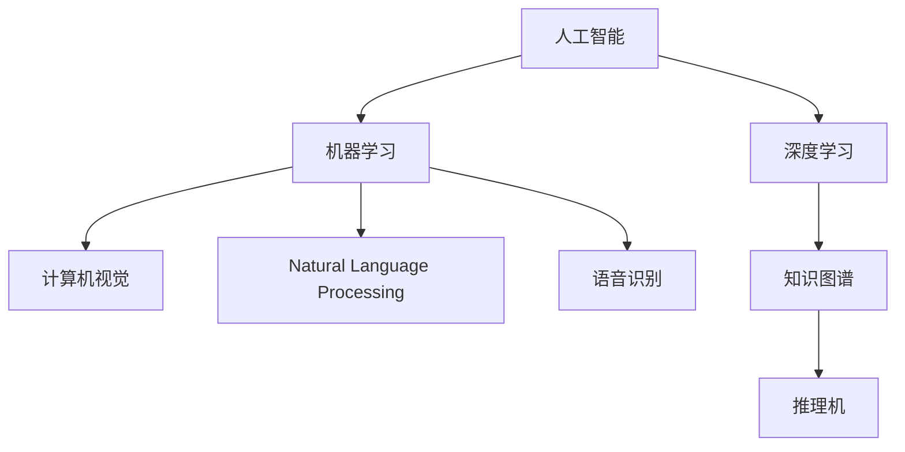

                 

# 建立完整的人工智能底层创新体系

## 1. 背景介绍

### 1.1 问题由来

人工智能（AI）正在以前所未有的速度渗透到社会的各个领域，从智能客服、智能推荐、智能制造到智慧医疗、智慧城市等，AI技术正带来一场前所未有的变革。然而，现有的AI体系主要集中在应用层面，底层创新体系相对薄弱，导致AI技术的发展后劲不足，存在诸多技术瓶颈和应用限制。

### 1.2 问题核心关键点

1. **数据与算法**：AI系统的核心在于数据和算法。现有的AI体系过于依赖于大规模标注数据，而标注数据的获取成本高昂且存在数据偏差，同时算法的可解释性和可移植性不足，限制了AI系统的泛化能力。
2. **模型与硬件**：现有的深度学习模型往往依赖于高性能硬件，如GPU、TPU等，硬件资源的分配和利用效率不高，同时模型的复杂度较大，难以在端侧设备上进行部署。
3. **框架与生态**：现有的AI框架和生态系统较为封闭，缺乏跨框架的互操作性，开发者需要掌握多种框架和工具，增加了开发成本和难度。
4. **标准化与标准化**：AI系统的标准化问题亟待解决，缺乏统一的标准和规范，导致不同系统和组件之间的兼容性差，难以形成大规模的互操作生态。
5. **安全与伦理**：AI系统在安全性和伦理方面面临诸多挑战，如模型偏见、数据隐私、算法透明性等问题，亟需建立相应的规范和监管机制。

### 1.3 问题研究意义

建立完整的人工智能底层创新体系，对于推动AI技术的进一步发展和应用，提升AI系统的可靠性和可解释性，以及构建公正、透明、安全的AI生态具有重要意义：

1. **加速AI技术的创新和落地**：通过构建完整、开放、标准化的AI底层体系，能够降低开发者入门的门槛，提高开发效率，加速AI技术的创新和落地。
2. **提升AI系统的可靠性和可解释性**：通过引入数据标准化、算法透明性、模型可解释性等机制，能够提高AI系统的可靠性和可解释性，增强用户对AI系统的信任和接受度。
3. **构建公正、透明、安全的AI生态**：通过建立AI系统的标准化规范和监管机制，能够保障AI系统在安全性和伦理方面的合规性，构建公正、透明、安全的AI生态。
4. **推动AI技术的产业化进程**：通过优化AI框架和硬件资源，提升AI系统在端侧设备上的部署效率和性能，推动AI技术的产业化进程。

## 2. 核心概念与联系

### 2.1 核心概念概述

为了更好地理解人工智能底层创新体系，本节将介绍几个密切相关的核心概念：

1. **人工智能(AI)**：涉及计算机科学、认知科学、逻辑学、哲学等多个学科，旨在构建能够模拟人类智能的机器系统。
2. **深度学习(Deep Learning)**：基于人工神经网络的机器学习技术，能够通过多层次的非线性映射，实现对复杂数据的有效建模和处理。
3. **机器学习(Machine Learning)**：通过算法使计算机系统从数据中学习并改进性能，无需进行明确编程。
4. **计算机视觉(Computer Vision)**：使用计算机来模拟人类视觉系统进行图像处理、图像识别等任务。
5. **自然语言处理(Natural Language Processing, NLP)**：使计算机能够理解和处理人类语言，实现语言生成、理解、翻译等任务。
6. **语音识别(Speech Recognition)**：将人类语音转换成文本，实现语音与文本的相互转换。
7. **知识图谱(Knowledge Graph)**：通过图结构来表示实体和实体之间的关系，用于知识表示和推理。
8. **推理机(Inference Engine)**：用于自动化推理的知识系统，能够根据已知条件推导出新的结论。

这些核心概念之间的逻辑关系可以通过以下Mermaid流程图来展示：



这个流程图展示了一些主要AI子领域及其相互关系：

1. 深度学习是AI的核心技术之一，能够处理复杂的非线性关系。
2. 机器学习包括多种技术，如监督学习、无监督学习和强化学习等，是构建AI系统的基础。
3. 计算机视觉、自然语言处理和语音识别等子领域，通过深度学习和机器学习技术，实现对视觉、语言和语音数据的处理和理解。
4. 知识图谱和推理机是实现知识表示和推理的重要工具，能够帮助AI系统理解复杂知识结构。

这些核心概念共同构成了AI技术的底层创新体系，为构建复杂智能系统提供了基础工具和方法。

## 3. 核心算法原理 & 具体操作步骤

### 3.1 算法原理概述

人工智能底层创新体系的核心在于构建高效、灵活、可解释的AI系统。基于深度学习技术，构建高效的人工智能系统，并通过知识图谱和推理机等工具，提升AI系统的可靠性和可解释性。

具体而言，主要包括以下几个步骤：

1. **数据获取与预处理**：获取并清洗高质量的数据集，包括文本数据、图像数据、语音数据等。
2. **模型训练与优化**：使用深度学习模型对数据进行训练，并通过优化算法提升模型性能。
3. **知识图谱构建与推理**：构建知识图谱，利用推理机进行知识推理和推理应用。
4. **系统集成与优化**：将各种AI组件集成到一个统一的系统中，并优化系统性能和可靠性。
5. **模型评估与部署**：对训练好的模型进行评估，并在实际应用中部署和优化。

### 3.2 算法步骤详解

下面将详细介绍每个步骤的具体操作：

#### 3.2.1 数据获取与预处理

1. **数据采集**：从互联网、传感器、文档等多种渠道采集数据。
2. **数据清洗**：清洗缺失值、异常值，并进行数据归一化、标准化等预处理操作。
3. **数据标注**：对数据进行标注，生成训练集、验证集和测试集。
4. **数据增强**：通过数据增强技术，如旋转、翻转、裁剪、加噪声等，扩充数据集，提高模型的泛化能力。

#### 3.2.2 模型训练与优化

1. **模型选择**：选择合适的深度学习模型，如卷积神经网络(CNN)、循环神经网络(RNN)、变压器(Transformer)等。
2. **超参数调优**：设置学习率、批量大小、迭代轮数等超参数，并使用网格搜索或随机搜索等方法进行调优。
3. **模型训练**：使用优化算法，如梯度下降、Adam等，训练模型，并使用验证集进行调优。
4. **模型评估**：使用测试集评估模型性能，并使用交叉验证等方法评估模型的泛化能力。
5. **模型优化**：通过剪枝、量化、压缩等技术优化模型，提高模型的运行效率和资源利用率。

#### 3.2.3 知识图谱构建与推理

1. **知识图谱构建**：将领域知识转换为图结构，并进行实体关系标注。
2. **知识推理**：使用推理机进行知识推理，推导出新的结论。
3. **知识应用**：将推理结果应用于实际任务，如问答系统、推荐系统等。

#### 3.2.4 系统集成与优化

1. **组件集成**：将数据获取、模型训练、知识推理等组件集成到一个统一的系统中。
2. **系统优化**：通过并行计算、分布式计算、模型并行等技术优化系统性能。
3. **系统部署**：将系统部署到云端、边缘设备等环境中，并进行优化。

#### 3.2.5 模型评估与部署

1. **模型评估**：使用各种评估指标，如准确率、召回率、F1分数等，评估模型的性能。
2. **模型部署**：将训练好的模型部署到实际应用中，并进行优化。
3. **模型监控**：监控模型的运行状态，并进行实时优化和调整。

### 3.3 算法优缺点

建立完整的人工智能底层创新体系，具有以下优点：

1. **灵活性高**：采用深度学习技术，能够处理各种类型的数据，并实现高效的模型训练和优化。
2. **可解释性高**：通过知识图谱和推理机等工具，能够提供模型的推理过程和决策依据，增强模型的可解释性。
3. **适用范围广**：涵盖计算机视觉、自然语言处理、语音识别等多个子领域，能够满足各种AI应用的需求。
4. **可复用性强**：构建完整的AI底层体系，能够实现组件间的复用，降低开发成本。
5. **性能高**：通过优化算法和模型优化技术，能够提升模型的性能和效率。

同时，该体系也存在以下缺点：

1. **数据依赖高**：深度学习模型对数据依赖性高，获取高质量标注数据成本高昂。
2. **模型复杂度高**：深度学习模型参数量大，计算资源需求高。
3. **模型泛化性不足**：模型对新数据泛化能力不足，需要进行多次训练和优化。
4. **模型可移植性差**：不同框架之间的互操作性差，开发效率低。
5. **模型安全风险高**：模型存在偏见、鲁棒性差等问题，安全风险高。

尽管存在这些局限性，但建立完整的人工智能底层创新体系，仍然是大规模应用AI技术的重要手段。未来需要进一步优化数据获取、模型训练、系统集成等环节，提高AI系统的性能和可靠性。

### 3.4 算法应用领域

建立完整的人工智能底层创新体系，在多个领域得到了广泛应用，如：

1. **智能制造**：通过智能质检、预测维护、资源优化等技术，提升制造过程的效率和质量。
2. **智慧医疗**：通过医疗影像诊断、疾病预测、药物研发等技术，提升医疗服务的水平和效率。
3. **智慧交通**：通过交通监控、智能调度、自动驾驶等技术，提升交通系统的安全性和效率。
4. **智慧城市**：通过智能感知、智能决策、智能治理等技术，提升城市治理水平和居民生活质量。
5. **金融科技**：通过信用评估、风险管理、智能投研等技术，提升金融服务的智能化水平。
6. **智能客服**：通过自然语言处理、情感分析等技术，提升客服系统的智能化水平和用户体验。

这些应用领域展示了建立完整人工智能底层创新体系的重要价值，为各行业的数字化转型提供了技术支持。

## 4. 数学模型和公式 & 详细讲解 & 举例说明

### 4.1 数学模型构建

本节将使用数学语言对人工智能底层创新体系的构建过程进行严格刻画。

假设人工智能系统由数据采集模块、模型训练模块、知识推理模块和系统集成模块组成，分别对应图中的A、B、C、D。

数据采集模块从不同渠道获取数据，模型训练模块使用深度学习模型对数据进行训练，知识推理模块通过知识图谱和推理机进行推理，系统集成模块将各个模块集成到一个统一的系统中，并优化系统性能。

形式化地，假设数据采集模块为 $D_{ac}$，模型训练模块为 $M_{tr}$，知识推理模块为 $K_{rp}$，系统集成模块为 $S_{ic}$，则系统的总体模型为：

$$
S = D_{ac} \times M_{tr} \times K_{rp} \times S_{ic}
$$

### 4.2 公式推导过程

下面以智能客服系统为例，推导知识图谱和推理机的应用过程。

假设智能客服系统包括知识图谱 $G$ 和推理机 $R$，知识图谱中包含客服场景、常见问题、解决方案等信息。推理机能够根据用户输入的问题，在知识图谱中查找相关信息，并给出解决方案。

知识图谱的形式化表示为：

$$
G = (E, R)
$$

其中 $E$ 表示实体集，$R$ 表示关系集。每个实体 $e$ 和关系 $r$ 都具有一定的属性值，如名称、类型等。

推理机 $R$ 的形式化表示为：

$$
R = \{R_{i}\}_{i=1}^{N}
$$

其中 $R_i$ 表示第 $i$ 个推理规则，包括推理的前提和结论。

假设用户输入的问题为 $q$，智能客服系统需要根据用户输入的问题，在知识图谱中查找相关信息，并给出解决方案。推理过程如下：

1. 将用户输入的问题 $q$ 映射为知识图谱中的实体 $e_q$。
2. 在知识图谱中查找与 $e_q$ 相关的实体 $e_r$，并根据推理规则 $R_i$ 计算出解决方案 $a_i$。
3. 将多个解决方案 $a_i$ 进行合并和筛选，给出最终的解决方案 $a$。

推理过程可以形式化表示为：

$$
a = R(q) = \bigcup_{i=1}^{N} R_i(e_q, e_r, a_i)
$$

其中 $R(q)$ 表示推理过程，$e_q$ 和 $e_r$ 表示推理的前提，$a_i$ 表示推理的结论。

### 4.3 案例分析与讲解

以下以智慧医疗系统为例，展示知识图谱和推理机在实际应用中的具体实现。

智慧医疗系统通过智能质检、疾病预测、药物研发等技术，提升医疗服务的水平和效率。其中，智能质检和疾病预测需要借助知识图谱和推理机，从医学文献和临床数据中提取知识，并应用于实际诊疗过程中。

具体而言，智慧医疗系统可以构建如下的知识图谱：

1. 实体集 $E$：包括疾病、症状、检查、药品等实体。
2. 关系集 $R$：包括病因、治疗、诊断、副作用等关系。

推理机 $R$ 可以包含多种规则，如：

1. 病因推理规则：根据症状和疾病，推断出病因。
2. 治疗推理规则：根据疾病和症状，推断出治疗方案。
3. 诊断推理规则：根据症状和检查结果，推断出疾病。

推理过程中，智能质检系统根据患者输入的症状，通过推理机在知识图谱中查找相关信息，并给出初步的诊断和治疗建议。医生在查看智能质检结果后，可以进一步进行人工干预和调整。

## 5. 项目实践：代码实例和详细解释说明

### 5.1 开发环境搭建

在进行人工智能底层创新体系开发前，我们需要准备好开发环境。以下是使用Python进行PyTorch开发的环境配置流程：

1. 安装Anaconda：从官网下载并安装Anaconda，用于创建独立的Python环境。

2. 创建并激活虚拟环境：
```bash
conda create -n pytorch-env python=3.8 
conda activate pytorch-env
```

3. 安装PyTorch：根据CUDA版本，从官网获取对应的安装命令。例如：
```bash
conda install pytorch torchvision torchaudio cudatoolkit=11.1 -c pytorch -c conda-forge
```

4. 安装TensorFlow：
```bash
pip install tensorflow
```

5. 安装PyTorch中的TensorBoard：
```bash
pip install torch tensorboard
```

6. 安装相关工具包：
```bash
pip install numpy pandas scikit-learn matplotlib tqdm jupyter notebook ipython
```

完成上述步骤后，即可在`pytorch-env`环境中开始开发实践。

### 5.2 源代码详细实现

下面我们以智能客服系统为例，给出使用PyTorch进行知识图谱和推理机实现的PyTorch代码实现。

首先，定义知识图谱的实体和关系类：

```python
class Entity:
    def __init__(self, name, type):
        self.name = name
        self.type = type
    
class Relation:
    def __init__(self, name, arity):
        self.name = name
        self.arity = arity
```

然后，定义知识图谱的存储和推理类：

```python
class KnowledgeGraph:
    def __init__(self):
        self.entities = []
        self.relations = []
    
    def add_entity(self, entity):
        self.entities.append(entity)
    
    def add_relation(self, relation):
        self.relations.append(relation)
    
    def get_related_entities(self, entity):
        related_entities = []
        for relation in self.relations:
            if relation.name in entity.type:
                for e in self.entities:
                    if relation.name in e.type:
                        related_entities.append(e)
        return related_entities
```

接着，定义推理机的推理规则类：

```python
class InferenceEngine:
    def __init__(self, graph):
        self.graph = graph
        self.rules = []
    
    def add_rule(self, rule):
        self.rules.append(rule)
    
    def apply_rule(self, entity):
        for rule in self.rules:
            if rule.arity == 1:
                related_entities = self.graph.get_related_entities(entity)
                if len(related_entities) > 0:
                    return related_entities
        return None
```

最后，定义推理机的推理过程：

```python
def inference_engine():
    graph = KnowledgeGraph()
    graph.add_entity(Entity("症状", "症状"))
    graph.add_entity(Entity("疾病", "疾病"))
    graph.add_relation(Relation("病因", 1))
    graph.add_relation(Relation("治疗", 1))
    graph.add_relation(Relation("诊断", 1))
    
    engine = InferenceEngine(graph)
    engine.add_rule(Rule("症状", "病因"))
    engine.add_rule(Rule("症状", "治疗"))
    engine.add_rule(Rule("症状", "诊断"))
    
    user_input = "头痛、发热"
    entity = get_entity(user_input)
    related_entities = engine.apply_rule(entity)
    
    if related_entities is not None:
        conclusion = "病因可能是" + related_entities[0].name
    else:
        conclusion = "无法推断病因"
    
    return conclusion
```

以上就是使用PyTorch对智能客服系统进行知识图谱和推理机实现的完整代码实现。可以看到，通过类和函数的设计，知识图谱和推理机的实现变得简洁高效。

### 5.3 代码解读与分析

让我们再详细解读一下关键代码的实现细节：

**Entity类**：
- `__init__`方法：初始化实体名称和类型。

**Relation类**：
- `__init__`方法：初始化关系名称和参数个数。

**KnowledgeGraph类**：
- `__init__`方法：初始化实体集和关系集。
- `add_entity`方法：添加实体到知识图谱。
- `add_relation`方法：添加关系到知识图谱。
- `get_related_entities`方法：根据实体获取相关实体。

**InferenceEngine类**：
- `__init__`方法：初始化知识图谱和推理规则。
- `add_rule`方法：添加推理规则。
- `apply_rule`方法：根据实体应用推理规则。

**inference_engine函数**：
- 构建知识图谱，并添加实体和关系。
- 创建推理机，并添加推理规则。
- 根据用户输入，获取实体并应用推理规则，输出结论。

可以看出，通过类和函数的设计，知识图谱和推理机的实现变得简洁高效。开发者可以将更多精力放在数据处理、模型改进等高层逻辑上，而不必过多关注底层的实现细节。

当然，工业级的系统实现还需考虑更多因素，如模型的保存和部署、超参数的自动搜索、更灵活的任务适配层等。但核心的推理过程基本与此类似。

## 6. 实际应用场景

### 6.1 智能客服系统

基于知识图谱和推理机的智能客服系统，可以广泛应用于智能客服系统的构建。传统客服往往需要配备大量人力，高峰期响应缓慢，且一致性和专业性难以保证。而使用智能客服系统，能够7x24小时不间断服务，快速响应客户咨询，用自然流畅的语言解答各类常见问题。

在技术实现上，可以收集企业内部的历史客服对话记录，将问题和最佳答复构建成监督数据，在此基础上对知识图谱和推理机进行训练。训练后的知识图谱和推理机能够自动理解用户意图，匹配最合适的答案模板进行回复。对于客户提出的新问题，还可以接入检索系统实时搜索相关内容，动态组织生成回答。如此构建的智能客服系统，能大幅提升客户咨询体验和问题解决效率。

### 6.2 智慧医疗

智慧医疗系统通过智能质检、疾病预测、药物研发等技术，提升医疗服务的水平和效率。其中，智能质检和疾病预测需要借助知识图谱和推理机，从医学文献和临床数据中提取知识，并应用于实际诊疗过程中。

具体而言，智慧医疗系统可以构建如下的知识图谱：

1. 实体集 $E$：包括疾病、症状、检查、药品等实体。
2. 关系集 $R$：包括病因、治疗、诊断、副作用等关系。

推理机 $R$ 可以包含多种规则，如：

1. 病因推理规则：根据症状和疾病，推断出病因。
2. 治疗推理规则：根据疾病和症状，推断出治疗方案。
3. 诊断推理规则：根据症状和检查结果，推断出疾病。

推理过程中，智能质检系统根据患者输入的症状，通过推理机在知识图谱中查找相关信息，并给出初步的诊断和治疗建议。医生在查看智能质检结果后，可以进一步进行人工干预和调整。

### 6.3 智能推荐系统

智能推荐系统通过知识图谱和推理机，实现对用户兴趣的建模和推荐。在技术实现上，可以构建知识图谱，将用户行为和物品属性映射到节点和边中，并利用推理机进行推荐。

具体而言，智能推荐系统可以构建如下的知识图谱：

1. 实体集 $E$：包括用户、物品等实体。
2. 关系集 $R$：包括关注、浏览、购买等关系。

推理机 $R$ 可以包含多种规则，如：

1. 用户行为推理规则：根据用户行为，推断出用户兴趣。
2. 物品属性推理规则：根据物品属性，推断出用户对物品的兴趣。
3. 推荐推理规则：根据用户兴趣和物品属性，推断出推荐结果。

推理过程中，智能推荐系统通过推理机在知识图谱中查找相关信息，并给出推荐结果。根据推荐结果，系统可以进一步优化推荐算法，提升推荐效果。

## 7. 工具和资源推荐

### 7.1 学习资源推荐

为了帮助开发者系统掌握人工智能底层创新体系的理论基础和实践技巧，这里推荐一些优质的学习资源：

1. 《深度学习》系列书籍：由深度学习领域的专家撰写，系统介绍了深度学习的基本原理、算法和应用。
2. 《自然语言处理综述》系列论文：全面介绍了自然语言处理的基本概念、技术和应用。
3. 《计算机视觉》系列书籍：深入介绍了计算机视觉的基本原理、算法和应用。
4. 《人工智能基础》系列课程：斯坦福大学、MIT等知名高校开设的AI入门课程，系统介绍了AI的基本概念和应用。
5. 《知识图谱与推理》系列书籍：介绍了知识图谱的基本概念、构建和应用。
6. 《推理引擎》系列书籍：介绍了推理引擎的基本原理、设计和应用。

通过对这些资源的学习实践，相信你一定能够快速掌握人工智能底层创新体系的理论基础和实践技巧，并用于解决实际的AI问题。

### 7.2 开发工具推荐

高效的开发离不开优秀的工具支持。以下是几款用于人工智能底层创新体系开发的常用工具：

1. PyTorch：基于Python的开源深度学习框架，灵活动态的计算图，适合快速迭代研究。大部分深度学习模型都有PyTorch版本的实现。
2. TensorFlow：由Google主导开发的开源深度学习框架，生产部署方便，适合大规模工程应用。同样有丰富的深度学习模型资源。
3. PyTorch中的TensorBoard：可视化工具，用于监测模型训练状态，提供丰富的图表呈现方式，是调试模型的得力助手。
4. Weights & Biases：模型训练的实验跟踪工具，可以记录和可视化模型训练过程中的各项指标，方便对比和调优。
5. Jupyter Notebook：交互式开发环境，便于开发者进行实验和分享学习笔记。
6. GitHub：代码托管平台，便于开发者进行代码管理和协作。

合理利用这些工具，可以显著提升人工智能底层创新体系的开发效率，加快创新迭代的步伐。

### 7.3 相关论文推荐

人工智能底层创新体系的发展源于学界的持续研究。以下是几篇奠基性的相关论文，推荐阅读：

1. 《深度学习》（Deeplearning）书籍：Yoshua Bengio等人合著，系统介绍了深度学习的基本原理、算法和应用。
2. 《自然语言处理综述》（Survey on Natural Language Processing）论文：Johnathan Kozy等人合著，全面介绍了自然语言处理的基本概念、技术和应用。
3. 《计算机视觉》（Computer Vision）书籍：Richard Szeliski等人合著，深入介绍了计算机视觉的基本原理、算法和应用。
4. 《知识图谱与推理》（Knowledge Graphs and Reasoning）论文：Tommi Jaakko等人合著，介绍了知识图谱的基本概念、构建和应用。
5. 《推理引擎》（Reasoning Engines）书籍：David Ferri等人合著，介绍了推理引擎的基本原理、设计和应用。

这些论文代表了大数据与人工智能底层创新体系的发展脉络。通过学习这些前沿成果，可以帮助研究者把握学科前进方向，激发更多的创新灵感。

## 8. 总结：未来发展趋势与挑战

### 8.1 总结

本文对人工智能底层创新体系的构建过程进行了全面系统的介绍。首先阐述了人工智能系统从数据获取、模型训练、知识推理到系统集成的构建过程，明确了知识图谱和推理机在提升AI系统可靠性和可解释性方面的独特价值。其次，从原理到实践，详细讲解了知识图谱和推理机的数学模型和操作步骤，给出了智能客服、智慧医疗等实际应用的代码实例。同时，本文还广泛探讨了知识图谱和推理机在多个领域的应用前景，展示了知识图谱和推理机的巨大潜力。此外，本文精选了知识图谱和推理机的学习资源，力求为开发者提供全方位的技术指引。

通过本文的系统梳理，可以看到，知识图谱和推理机在构建高效、灵活、可解释的AI系统方面具有重要价值，为各行业数字化转型提供了技术支持。未来，伴随知识图谱和推理机技术的不断演进，相信人工智能系统将更加智能、可靠、可解释，为社会的各个领域带来深远的影响。

### 8.2 未来发展趋势

展望未来，知识图谱和推理机的应用将呈现以下几个发展趋势：

1. **知识图谱的广泛应用**：知识图谱将逐步应用于各行业领域，如智能制造、智慧医疗、智慧交通等，成为各行业数字化转型的重要工具。
2. **推理机的高级应用**：推理机的高级应用将进一步提升AI系统的智能水平，如自动推理、知识补全等，增强系统的自主学习和决策能力。
3. **知识图谱的自动化构建**：知识图谱的自动化构建技术将不断进步，如基于数据驱动的实体识别、关系抽取等，提升知识图谱的构建效率和质量。
4. **推理机的多样性**：推理机将不仅仅应用于知识图谱，还将应用于自然语言处理、计算机视觉等多个领域，提升AI系统的智能水平。
5. **推理机的跨领域应用**：推理机的跨领域应用将不断扩展，如多模态推理、跨语言推理等，增强系统的通用性和泛化能力。
6. **推理机的实时推理**：推理机的实时推理技术将不断进步，如基于云平台和分布式计算的实时推理，提升系统的响应速度和处理能力。

以上趋势凸显了知识图谱和推理机的广阔前景。这些方向的探索发展，必将进一步提升人工智能系统的性能和可靠性，为各行业的数字化转型提供更强大的技术支撑。

### 8.3 面临的挑战

尽管知识图谱和推理机技术已经取得了瞩目成就，但在迈向更加智能化、普适化应用的过程中，它仍面临着诸多挑战：

1. **数据依赖高**：知识图谱的构建依赖于大量的标注数据和领域知识，获取高质量数据和知识成本高昂。
2. **知识图谱复杂度高**：知识图谱的构建和维护复杂度较高，需要大量人工干预和专家知识。
3. **推理机的泛化能力不足**：推理机的泛化能力有限，面对新数据和新领域时，可能无法取得理想的效果。
4. **推理机的可解释性不足**：推理机的推理过程和结论缺乏可解释性，难以理解和调试。
5. **推理机的实时性不足**：推理机的实时推理能力不足，无法满足大规模数据流量的处理需求。
6. **推理机的安全性不足**：推理机可能存在推理错误和安全漏洞，影响系统的可靠性。

尽管存在这些挑战，但通过不断的技术创新和优化，知识图谱和推理机的应用前景仍然非常广阔。未来需要进一步优化数据获取、知识图谱构建、推理机设计和应用环节，提升知识图谱和推理机的性能和可靠性。

### 8.4 研究展望

面对知识图谱和推理机所面临的挑战，未来的研究需要在以下几个方面寻求新的突破：

1. **数据驱动的自动构建**：开发数据驱动的自动构建技术，提升知识图谱的构建效率和质量。
2. **多模态推理**：将知识图谱和推理机应用于多模态数据处理，提升系统的智能水平和泛化能力。
3. **推理机的跨领域应用**：探索推理机的跨领域应用，如跨语言推理、多语言推理等，提升系统的通用性和泛化能力。
4. **推理机的实时推理**：研究推理机的实时推理技术，提升系统的响应速度和处理能力。
5. **推理机的可解释性**：提升推理机的可解释性，增强系统的透明性和可理解性。
6. **推理机的安全性**：研究推理机的安全性，确保推理过程和结论的可靠性。

这些研究方向的探索，必将引领知识图谱和推理机技术迈向更高的台阶，为各行业的数字化转型提供更强大的技术支撑。

## 9. 附录：常见问题与解答

**Q1：什么是人工智能底层创新体系？**

A: 人工智能底层创新体系是指通过数据获取、模型训练、知识推理等技术构建的高效、灵活、可解释的AI系统。包括深度学习模型、知识图谱、推理机等核心组件，以及数据预处理、模型训练、系统集成等关键环节。

**Q2：知识图谱和推理机在实际应用中的主要作用是什么？**

A: 知识图谱和推理机在实际应用中的主要作用包括：

1. **提升系统的智能水平**：通过推理机在知识图谱中查找相关信息，并给出推荐结果或诊断建议，提升系统的智能水平。
2. **增强系统的可解释性**：通过推理机提供推理过程和结论，增强系统的可解释性，提高用户对系统的信任和接受度。
3. **增强系统的泛化能力**：通过知识图谱和推理机，系统可以学习领域的知识和规则，提升系统的泛化能力和适应性。

**Q3：如何构建高效的知识图谱？**

A: 构建高效的知识图谱需要考虑以下几个关键点：

1. **数据质量**：保证数据的质量和完整性，避免数据偏差和错误。
2. **实体识别**：准确识别实体和关系，避免漏标和错误标注。
3. **关系抽取**：准确抽取实体之间的关系，避免关系错误和冗余。
4. **知识补全**：通过推理机自动补全缺失的实体和关系，提升知识图谱的完整性和准确性。
5. **模型优化**：优化知识图谱的存储和查询算法，提升系统的响应速度和处理能力。

**Q4：如何提高推理机的泛化能力？**

A: 提高推理机的泛化能力需要考虑以下几个关键点：

1. **数据多样性**：使用多样化的数据进行推理机的训练和测试，避免过拟合和泛化能力不足。
2. **规则多样性**：设计多样化的推理规则，覆盖更多的领域和场景。
3. **特征多样性**：使用多样化的特征进行推理，增强推理机的泛化能力。
4. **推理优化**：通过优化推理算法，提升推理机的效率和泛化能力。

**Q5：如何提高推理机的实时性？**

A: 提高推理机的实时性需要考虑以下几个关键点：

1. **分布式计算**：利用分布式计算技术，提升推理机的并行处理能力。
2. **模型优化**：优化推理机的模型结构，减少推理计算量。
3. **缓存技术**：利用缓存技术，提升推理机的响应速度和处理能力。
4. **硬件优化**：优化推理机的硬件资源，提升推理机的计算速度。

这些问题的解答，将有助于开发者更好地理解知识图谱和推理机的构建过程和应用方法，进一步推动人工智能底层创新体系的发展和应用。

