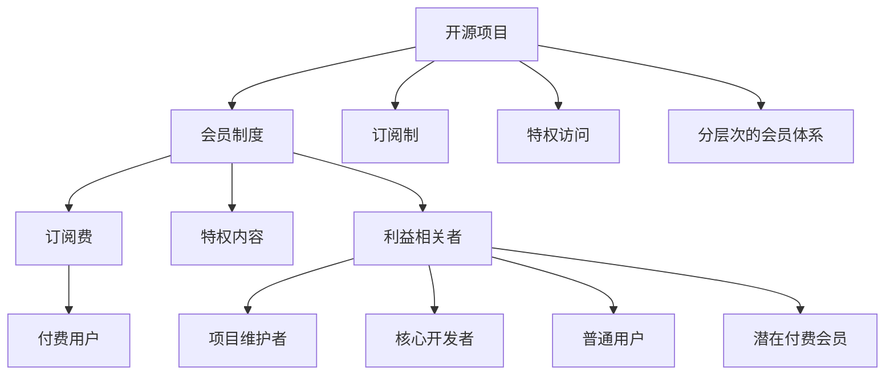

                 

# 建立开源项目的会员制度：创造持续收入

在开源软件和协作开发盛行的今天，开源项目如何从众筹、捐赠、广告中脱颖而出，持续创造商业价值，是众多项目维护者面临的挑战。本文将深入探讨建立开源项目会员制度的方法，揭示其背后的逻辑，并给出详尽的实施步骤。

## 1. 背景介绍

### 1.1 问题的由来

开源软件项目最初的设计初衷是共享资源、知识和技术，促进技术和社区的发展。然而，随着开源项目规模的扩大，越来越多项目开始面临资金、人力资源的短缺，项目维护变得愈发困难。

现有的开源社区众筹模式，如GitHub Sponsors、Open Collective等，虽然帮助开源项目获取了一定比例的资金支持，但总体上仍然难以满足项目长期发展的需求。因此，项目维护者需要找到新的方法，确保项目的长期可持续性。

### 1.2 问题核心关键点

本文将围绕以下几个核心关键点展开探讨：

- **开源项目会员制度**：如何通过订阅制、特权访问等方式，从会员群体中获取持续稳定的资金支持。
- **会员的层级与权益**：如何设计会员制度，使不同层次的会员享有不同程度的权益，促进项目的持续发展。
- **会员的招募与转化**：如何高效地招募会员，并促使潜在用户转化为付费会员。
- **会员体系的长期优化**：如何动态调整会员制度，以适应社区需求的变化，持续吸引新会员。

## 2. 核心概念与联系

### 2.1 核心概念概述

为了更好地理解开源项目会员制度，本节将介绍几个密切相关的核心概念：

- **开源项目**：通过开放源代码的方式，鼓励开发者贡献代码，实现共同开发的软件项目。
- **会员制度**：一种新的商业模式，用户通过订阅或付费，获得特权访问和支持。
- **订阅制**：用户定期支付费用，持续享受特定服务。
- **特权访问**：用户通过付费，获取项目中某些功能或资源的专属使用权。
- **分层次的会员体系**：根据用户付费的金额，提供不同层次的会员权益。
- **利益相关者**：包括项目维护者、核心开发者、普通用户、潜在付费会员等。

这些核心概念之间的逻辑关系可以通过以下Mermaid流程图来展示：



这个流程图展示了开源项目会员制度的关键组成和影响要素：

1. 开源项目通过引入会员制度，增加资金支持。
2. 用户通过订阅，定期支付费用。
3. 项目提供专属特权内容和功能。
4. 不同层次的会员享受不同程度的权益。
5. 各类利益相关者从会员制度中获益。

## 3. 核心算法原理 & 具体操作步骤

### 3.1 算法原理概述

开源项目会员制度的建立基于订阅制模型。用户通过支付月度或年度订阅费，获得访问特定功能、下载特定资源等特权。项目的持续维护和发展依赖于会员的稳定支付。

形式化地，假设项目有$N$个会员，$M$个功能模块。每个会员支付的月度或年度订阅费为$P$。设$F_i$为第$i$个会员每月或每年支付的订阅费。则项目的总订阅收入为：

$$
\text{总收入} = \sum_{i=1}^N F_i
$$

在实际操作中，通常需要考虑会员的激活率和流失率。设$A$为每月或每年的新激活会员数，$L$为流失会员数。则总收入为：

$$
\text{总收入} = (A - L)P
$$

收入最大化问题转化为：

$$
\max_{A, L} (A - L)P
$$

即在会员流失率一定的情况下，最大化新增会员数$A$，提高订阅收入。

### 3.2 算法步骤详解

开源项目会员制度的设计和实施主要包括以下几个步骤：

**Step 1: 设计会员制度**

- **定价策略**：确定基础会员和高级会员的定价策略。基础会员通常提供基本的特权，高级会员则提供额外的功能和服务。
- **特权内容**：确定会员的特权内容和功能模块。特权内容可以包括专享教程、专属客服、优先下载等。
- **会员层级**：根据会员付费金额，划分不同的会员层级。

**Step 2: 实施会员制度**

- **技术支持**：开发会员管理系统，支持用户订阅、取消订阅、管理会员等级等操作。
- **营销推广**：设计会员营销策略，吸引潜在用户成为付费会员。

**Step 3: 监控与优化**

- **会员招募**：定期分析会员招募策略的有效性，优化广告和推广渠道。
- **会员转化**：提高潜在用户到实际付费用户的转化率，分析会员流失的原因，改进会员体验。
- **制度调整**：根据社区反馈和会员行为，动态调整会员制度，保持会员的持续增长。

### 3.3 算法优缺点

开源项目会员制度有以下优点：

1. **稳定收入**：会员制度通过订阅费提供持续的资金支持，降低项目资金链断裂的风险。
2. **激励机制**：会员制度通过不同层次的会员权益，激励用户成为付费用户，提升项目的活跃度。
3. **品牌价值**：会员制度帮助项目建立品牌，吸引更多开发者和用户加入社区。

同时，会员制度也存在以下缺点：

1. **流失风险**：如果会员体验不佳，会员流失率可能会升高，影响项目的持续收入。
2. **用户体验**：设置过多的付费层次，可能会降低普通用户的使用体验。
3. **运营成本**：开发和维护会员系统需要额外的运营成本。

### 3.4 算法应用领域

开源项目会员制度主要应用于以下领域：

- **企业级开源软件**：如Red Hat、IBM等，通过订阅制提供商业支持和技术服务。
- **开源开发平台**：如GitHub、Apache等，通过会员订阅获取资金支持，提升社区活跃度。
- **开源工具和框架**：如MongoDB、Apache Kafka等，通过会员特权获取稳定的商业收入。

## 4. 数学模型和公式 & 详细讲解 & 举例说明

### 4.1 数学模型构建

为更好地理解开源项目会员制度，本节将介绍几个关键数学模型：

- **订阅收入模型**：
  $$
  \text{总收入} = \sum_{i=1}^N F_i
  $$

- **流失模型**：
  $$
  \text{总收入} = (A - L)P
  $$

- **会员转化率模型**：
  $$
  \text{转化率} = \frac{A}{A_{\text{total}}}
  $$

### 4.2 公式推导过程

在订阅收入模型中，总收入取决于每个会员的订阅费$P$和新增激活会员数$A$。

在流失模型中，总收入取决于新增激活会员数$A$和流失会员数$L$。

在会员转化率模型中，转化率$R$表示成功转化为付费用户的比例，$A_{\text{total}}$为潜在用户的总数。

### 4.3 案例分析与讲解

以MongoDB为例，MongoDB通过其商业版MongoDB Enterprise和开源版MongoDB Community进行会员制度的设计：

- **定价策略**：MongoDB Enterprise提供商业支持、性能优化、安全特性等高级功能，定价为每年数千美元；MongoDB Community为免费开源版本。
- **特权内容**：MongoDB Enterprise用户可以享受24/7技术支持、社区专属问答、专属访问频道等。
- **会员层级**：MongoDB Community用户可以免费使用核心功能，而MongoDB Enterprise用户则支付更高的订阅费，享受更丰富的特权内容。

根据MongoDB的会员制度，可以构建如下数学模型：

- **订阅收入模型**：
  $$
  \text{总收入} = A_{\text{Enterprise}}P_{\text{Enterprise}} + A_{\text{Community}}P_{\text{Community}}
  $$

- **流失模型**：
  $$
  \text{总收入} = (A_{\text{Enterprise}} - L_{\text{Enterprise}})P_{\text{Enterprise}} + (A_{\text{Community}} - L_{\text{Community}})P_{\text{Community}}
  $$

- **会员转化率模型**：
  $$
  R = \frac{A_{\text{Enterprise}}}{A_{\text{Enterprise}} + A_{\text{Community}}}
  $$

其中$A_{\text{Enterprise}}$和$L_{\text{Enterprise}}$分别表示MongoDB Enterprise的新增激活用户和流失用户数，$P_{\text{Enterprise}}$为MongoDB Enterprise的年度订阅费，$A_{\text{Community}}$和$L_{\text{Community}}$分别表示MongoDB Community的新增激活用户和流失用户数，$P_{\text{Community}}$为MongoDB Community的年度订阅费。

通过以上模型，可以计算MongoDB每年的总收入、转化率及流失率，从而进行会员制度的优化。

## 5. 项目实践：代码实例和详细解释说明

### 5.1 开发环境搭建

在进行开源项目会员制度实践前，我们需要准备好开发环境。以下是使用Python进行Flask开发的.env配置流程：

1. 安装Flask：`pip install Flask`
2. 安装Flask-RESTful：`pip install Flask-RESTful`
3. 安装Flask-SQLAlchemy：`pip install Flask-SQLAlchemy`
4. 安装SQLite：`pip install SQLite`
5. 创建数据库文件：`touch app.db`
6. 设置虚拟环境：`conda create -n myenv python=3.8`
7. 激活虚拟环境：`conda activate myenv`

完成上述步骤后，即可在`myenv`环境中开始会员制度的开发。

### 5.2 源代码详细实现

下面我们以MongoDB的会员系统为例，给出使用Flask实现的会员系统代码实现。

```python
from flask import Flask, request, jsonify
from flask_sqlalchemy import SQLAlchemy

app = Flask(__name__)
app.config['SQLALCHEMY_DATABASE_URI'] = 'sqlite:///app.db'
db = SQLAlchemy(app)

class Membership(db.Model):
    id = db.Column(db.Integer, primary_key=True)
    user_id = db.Column(db.Integer, nullable=False)
    tier = db.Column(db.String(50), nullable=False)
    subscription_date = db.Column(db.DateTime, nullable=False)
    expiration_date = db.Column(db.DateTime, nullable=False)

@app.route('/create', methods=['POST'])
def create_membership():
    data = request.json
    user_id = data['user_id']
    tier = data['tier']
    subscription_date = data['subscription_date']
    expiration_date = data['expiration_date']
    new_membership = Membership(user_id=user_id, tier=tier, subscription_date=subscription_date, expiration_date=expiration_date)
    db.session.add(new_membership)
    db.session.commit()
    return jsonify({'message': 'Membership created successfully'})

@app.route('/get_membership', methods=['GET'])
def get_membership():
    user_id = request.args.get('user_id')
    membership = Membership.query.filter_by(user_id=user_id).first()
    if membership:
        return jsonify({
            'id': membership.id,
            'user_id': membership.user_id,
            'tier': membership.tier,
            'subscription_date': membership.subscription_date,
            'expiration_date': membership.expiration_date
        })
    else:
        return jsonify({'message': 'Membership not found'})

if __name__ == '__main__':
    app.run(debug=True)
```

在Flask中，定义了`Membership`类来管理会员信息，包括用户ID、会员等级、订阅日期和到期日期。通过API接口，可以实现创建会员和获取会员信息的功能。

### 5.3 代码解读与分析

让我们再详细解读一下关键代码的实现细节：

**Flask环境配置**：
- 通过`app.config`设置数据库连接地址，创建SQLite数据库文件。
- 使用`Flask-SQLAlchemy`扩展，实现与SQLite数据库的交互。

**Membership类定义**：
- `id`：会员ID，主键。
- `user_id`：用户ID。
- `tier`：会员等级。
- `subscription_date`：订阅日期。
- `expiration_date`：到期日期。

**API接口**：
- `/create`：创建会员，通过POST请求传入用户ID、会员等级、订阅日期和到期日期，创建会员记录并保存到数据库。
- `/get_membership`：获取会员信息，通过GET请求传入用户ID，查询数据库中对应的会员记录并返回JSON格式的会员信息。

**Flask运行**：
- `app.run(debug=True)`：启动Flask应用，设置`debug`参数为True，开启调试模式。

可以看到，Flask提供的灵活接口和SQLAlchemy的数据库操作，使得开源项目会员制度的实现变得简洁高效。开发者可以将更多精力放在会员体系的顶层设计上，而不必过多关注底层实现细节。

## 6. 实际应用场景

### 6.1 企业级开源软件

企业级开源软件，如Red Hat、IBM等，通过会员制度提供商业支持和技术服务，帮助企业降低IT成本，提升开发效率。Red Hat提供多种会员计划，包括企业版、开发版和学生版，不同计划提供不同的特权和服务，满足企业多层次的需求。

### 6.2 开源开发平台

开源开发平台，如GitHub、Apache等，通过会员订阅获取资金支持，提升社区活跃度。GitHub提供个人和组织会员计划，包括GitHub Actions、GitHub Pages、Github Secret Scanning等功能，帮助开发者高效开发和部署项目。

### 6.3 开源工具和框架

开源工具和框架，如MongoDB、Apache Kafka等，通过会员特权获取稳定的商业收入。MongoDB通过其商业版和企业版提供专属功能，帮助企业应对数据管理和操作的需求。Apache Kafka通过会员订阅提供技术支持和社区支持，提升用户的使用体验。

## 7. 工具和资源推荐

### 7.1 学习资源推荐

为了帮助开发者系统掌握开源项目会员制度的理论基础和实践技巧，这里推荐一些优质的学习资源：

1. **《开源项目的商业化和可持续化》**：详细介绍了开源项目如何通过会员制度获取资金支持，提升商业可持续性。
2. **《订阅制商业模式的构建与优化》**：系统讲解了订阅制商业模式的构建方法、定价策略和用户管理。
3. **《开源社区的会员制度设计与运营》**：提供了开源社区会员制度的设计思路和运营策略。
4. **《Flask实战：Web开发全栈解决方案》**：介绍了Flask框架的高级应用，包括会员管理系统的实现。
5. **《SQLite实战：数据库开发全栈解决方案》**：讲解了SQLite数据库的操作方法和优化技巧。

通过对这些资源的学习实践，相信你一定能够快速掌握开源项目会员制度的精髓，并用于解决实际的商业问题。

### 7.2 开发工具推荐

高效的开发离不开优秀的工具支持。以下是几款用于开源项目会员制度开发的常用工具：

1. **Flask**：基于Python的开源Web框架，提供简单易用的API接口，适合快速迭代研究。
2. **SQLite**：轻量级的关系型数据库，适合小规模数据的存储和管理。
3. **GitHub**：开源代码托管平台，提供项目托管、版本控制和协作开发等功能。
4. **JIRA**：项目管理工具，帮助项目维护者跟踪任务进度和团队协作。
5. **Slack**：团队沟通工具，支持频道、话题、集成等功能，提升团队协作效率。

合理利用这些工具，可以显著提升开源项目会员制度的开发效率，加快创新迭代的步伐。

### 7.3 相关论文推荐

开源项目会员制度的发展源于学界的持续研究。以下是几篇奠基性的相关论文，推荐阅读：

1. **《开源社区的商业化和可持续化》**：探讨了开源社区的商业化路径和可持续化策略。
2. **《订阅制商业模式的构建与优化》**：分析了订阅制商业模式的构建方法、定价策略和用户管理。
3. **《开源社区的会员制度设计与运营》**：提供了开源社区会员制度的设计思路和运营策略。
4. **《Flask实战：Web开发全栈解决方案》**：介绍了Flask框架的高级应用，包括会员管理系统的实现。
5. **《SQLite实战：数据库开发全栈解决方案》**：讲解了SQLite数据库的操作方法和优化技巧。

这些论文代表了大语言模型微调技术的发展脉络。通过学习这些前沿成果，可以帮助研究者把握学科前进方向，激发更多的创新灵感。

## 8. 总结：未来发展趋势与挑战

### 8.1 总结

本文对开源项目会员制度的建立方法进行了全面系统的介绍。首先阐述了会员制度在开源项目中的重要性和实施步骤，其次详细讲解了会员制度的设计和优化方法，最后探讨了会员制度在开源领域的应用前景和未来趋势。通过本文的系统梳理，可以看到，开源项目会员制度已经初步形成了成熟的商业模式，成为开源项目持续发展的重要手段。

### 8.2 未来发展趋势

展望未来，开源项目会员制度将呈现以下几个发展趋势：

1. **订阅模式的细粒化**：会员制度将根据用户的不同需求，提供更加细粒化的订阅方案，提升用户体验。
2. **多平台整合**：开源项目将通过多个平台提供统一的服务和特权，提升会员的归属感和满意度。
3. **数据驱动优化**：会员制度将更加依赖数据分析和用户行为研究，进行动态调整和优化。
4. **区块链技术应用**：利用区块链技术，确保会员信息的透明和不可篡改，提升会员制度的信任度。
5. **跨行业融合**：开源项目将通过跨行业的整合，提供更加多样化和垂直化的服务，拓展应用场景。

### 8.3 面临的挑战

尽管开源项目会员制度已经取得了初步成功，但在迈向更加智能化、普适化应用的过程中，它仍面临着诸多挑战：

1. **用户体验**：会员制度需要兼顾普通用户和付费用户的需求，避免影响普通用户的使用体验。
2. **运营成本**：维护会员系统需要投入大量的人力物力，如何降低运营成本，提升效率，是重要的研究方向。
3. **数据安全**：会员数据的安全性是会员制度成功的关键，如何防范数据泄露和滥用，保护用户隐私，是重要的技术问题。
4. **市场竞争**：开源项目之间的竞争激烈，如何通过会员制度提升自身的竞争力，保持市场份额，是重要的商业问题。
5. **法律合规**：会员制度需要遵守法律法规，如何合规运营，避免侵犯用户权益，是重要的法律问题。

### 8.4 研究展望

面对开源项目会员制度所面临的种种挑战，未来的研究需要在以下几个方面寻求新的突破：

1. **用户体验优化**：通过更加个性化的会员设计，提升用户体验，增加会员的转化率。
2. **运营成本控制**：通过自动化工具和数据驱动运营，降低运营成本，提升效率。
3. **数据安全保障**：利用区块链等技术，提升数据安全性和透明度，增强用户信任。
4. **市场竞争策略**：通过差异化服务和品牌建设，提升市场竞争力，保持市场份额。
5. **法律合规保障**：确保会员制度的合法合规性，规避法律风险。

这些研究方向的探索，必将引领开源项目会员制度走向更高的台阶，为开源项目提供更加可持续的商业支持，推动开源社区的健康发展。

## 9. 附录：常见问题与解答

**Q1: 开源项目如何吸引更多会员？**

A: 开源项目可以通过以下方式吸引更多会员：
1. 提供高价值的特权和功能，吸引用户付费。
2. 通过有效的营销和推广，扩大项目的影响力和知名度。
3. 提供优质的社区服务和支持，提升用户满意度和忠诚度。

**Q2: 会员制度如何与项目开发结合？**

A: 会员制度应与项目开发紧密结合，提供持续的资金支持和技术保障。具体来说，可以将项目开发过程中遇到的问题和需求，通过会员反馈机制及时传递给会员，提升会员的参与感和归属感。

**Q3: 如何保证会员数据的隐私和安全？**

A: 开源项目应采用严格的会员数据管理策略，确保会员数据的隐私和安全。可以使用数据加密、访问控制等技术手段，防止数据泄露和滥用。同时，制定清晰的数据隐私政策，向用户透明公开数据处理方式。

**Q4: 会员制度是否适合所有开源项目？**

A: 会员制度并不适合所有开源项目。对于项目规模较小、社区活跃度不高或需求不明确的项目，会员制度可能不适用。项目维护者应根据项目特点和需求，灵活选择适合的商业模式。

**Q5: 会员制度对项目的可持续性有哪些好处？**

A: 会员制度对项目的可持续性有以下好处：
1. 提供持续的资金支持，降低项目资金链断裂的风险。
2. 提升项目的技术和社区支持，提升用户满意度和忠诚度。
3. 增强项目的影响力和品牌价值，吸引更多用户和开发者参与。

总之，开源项目通过建立会员制度，可以最大化利用用户资源，提升项目的商业可持续性，推动开源社区的健康发展。通过不断优化会员制度，提升用户体验和社区活力，项目维护者可以确保开源项目的长久繁荣。

