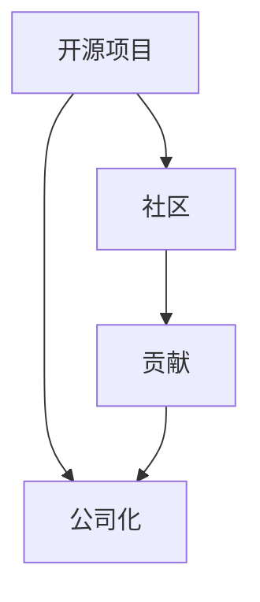

                 

# 开源创业：从项目到公司的转型之路

## 1. 背景介绍

在过去的几十年里，开源软件改变了我们软件开发的方方面面。从操作系统、数据库，到云计算、人工智能，开源技术的广泛应用使得我们能够以低成本、高效能的方式构建软件系统。而开源创业，则将这一理念进一步扩展到软件公司运营的各个层面。从初始的项目开发，到成熟的公司运营，开源创业路径提供了宝贵的经验和教训。本文将围绕开源创业的核心理念和方法，深入探讨开源公司如何从项目到公司转型之路的探索和实践。

## 2. 核心概念与联系

### 2.1 核心概念概述

开源创业涉及多个核心概念，它们相互关联、相互促进，构成了开源公司发展的基石。以下是我们将重点讨论的关键概念：

- **开源项目(Open Source Project)**：指由多个开发者共同维护的软件项目，其源代码完全公开，允许任何人自由地使用、修改和分发。
- **社区(Community)**：指围绕开源项目形成的用户和开发者社区，通常通过在线论坛、邮件列表、代码仓库等方式进行沟通和协作。
- **贡献(Contributions)**：指开发者为开源项目贡献代码、文档、设计等资源的行为，是开源社区发展的驱动力。
- **公司化(Companyization)**：指将开源项目或社区进一步发展成为具有商业运营能力的公司的过程。

这些概念之间具有如下逻辑关系：



开源项目的成功依赖于其社区的活跃度，而社区的活力又离不开贡献者的积极参与。同时，开源项目随着其影响力的提升，有潜力被公司化，进一步发展成为具有商业价值的软件公司。

### 2.2 核心概念原理和架构

开源创业的核心概念可以通过以下三个层面进行阐述：

1. **技术层面**：开源项目通常基于Git等版本控制工具进行协作开发，代码托管在如GitHub、GitLab等平台上，通过Pull Request和Issue等机制进行沟通和协调。

2. **社区层面**：社区构建依赖于良好的沟通和协作机制，如邮件列表、Slack、Discord等平台，以及在线文档、代码评审工具等。

3. **公司化层面**：公司化过程通常需要构建商业化运营的基础设施，如产品管理、市场营销、客户支持等部门，同时还需要建立商业模式和盈利机制。

这三个层面共同构成了开源创业的全貌，缺一不可。

## 3. 核心算法原理 & 具体操作步骤

### 3.1 算法原理概述

开源创业的核心算法原理可以归纳为以下几点：

1. **分而治之(DevOps)**：将项目开发和运维进行分离，构建自动化流水线，提高开发效率和产品质量。
2. **迭代开发(Iterative Development)**：通过快速迭代和持续交付，及时收集反馈，快速调整和改进产品。
3. **社区治理(Community Governance)**：通过开源社区的民主治理机制，确保社区成员的平等参与和决策。

### 3.2 算法步骤详解

开源创业的具体操作步骤如下：

1. **初始阶段**：
   - **定义愿景**：明确项目的愿景和目标，确定项目的价值主张。
   - **组建团队**：吸引志同道合的开发者加入社区，成立项目核心团队。
   - **选择工具**：选择合适的开源工具和平台，如Git、GitHub等。

2. **项目开发**：
   - **需求分析**：通过问卷调查、用户访谈等方式收集用户需求。
   - **版本规划**：制定版本计划，明确每个版本的功能和优先级。
   - **迭代开发**：按照迭代周期进行开发，每个周期交付可用的功能模块。

3. **社区建设**：
   - **文档编写**：编写详细的项目文档，包括使用手册、API文档等。
   - **沟通渠道**：建立社区沟通渠道，如邮件列表、在线论坛等。
   - **代码审查**：实施代码审查机制，确保代码质量。

4. **公司化转型**：
   - **商业模式**：确定盈利模式，如广告、订阅、开源付费等。
   - **产品管理**：构建产品管理团队，进行市场分析和需求调研。
   - **市场营销**：进行品牌建设，通过博客、社交媒体等进行宣传推广。

5. **持续发展**：
   - **持续迭代**：根据用户反馈进行持续迭代，优化产品。
   - **社区扩展**：吸引更多开发者加入社区，促进技术交流和创新。
   - **商业化运营**：建立完整的商业运营体系，如销售、客户支持等。

### 3.3 算法优缺点

开源创业具有以下优点：

1. **共享资源**：开源项目可以共享代码和文档资源，降低开发成本。
2. **社区协作**：社区成员共同参与开发和测试，提高了产品的质量和可靠性。
3. **快速迭代**：迭代开发模式可以迅速响应市场变化，保持产品的竞争力。

但开源创业也面临以下缺点：

1. **贡献动力不足**：社区成员可能缺乏持续贡献的动机，导致项目进展缓慢。
2. **商业化困难**：开源项目的商业模式较为单一，难以实现商业化盈利。
3. **维护成本高**：开源项目通常缺乏稳定的资金支持，维护成本较高。

### 3.4 算法应用领域

开源创业方法适用于各种类型的软件开发项目，特别是需要快速迭代、社区协作的产品。以下是几个具体的应用领域：

1. **操作系统**：如Linux、Apache Hadoop等。
2. **云平台**：如Kubernetes、OpenStack等。
3. **数据库**：如MySQL、PostgreSQL等。
4. **应用程序**：如Node.js、React等。

这些领域内的开源项目，通过社区协作和快速迭代，已经取得了广泛的应用和影响。

## 4. 数学模型和公式 & 详细讲解 & 举例说明

### 4.1 数学模型构建

开源创业的数学模型可以从项目管理和社区治理两个方面进行构建。以下是一个简化的模型：

1. **项目管理系统**：
   - **需求管理**：使用MoSCoW方法进行需求分类和优先级排序。
   - **版本管理**：使用敏捷开发的Scrum方法进行版本规划和迭代。
   - **问题管理**：使用Bug Tracking工具进行问题跟踪和解决。

2. **社区治理模型**：
   - **社区参与度**：通过社区活跃度指标（如Issue数量、Pull Request数量）进行衡量。
   - **决策机制**：使用民主决策机制，如多数投票、共识等。

### 4.2 公式推导过程

以GitHub上的一个开源项目为例，其代码贡献度量可以通过Git历史数据进行推导：

$$
\text{Contribution Count} = \sum_{i=1}^{n} \text{Commit Count}_{i}
$$

其中，$\text{Commit Count}_{i}$ 表示第$i$个贡献者的提交次数。

### 4.3 案例分析与讲解

以Apache Hadoop为例，它是一个开源的分布式计算框架，通过社区协作，已经成为全球领先的大数据处理平台。Apache Hadoop的社区管理和产品发展模式，可以为其他开源项目提供宝贵的经验和教训。

## 5. 项目实践：代码实例和详细解释说明

### 5.1 开发环境搭建

构建一个开源项目通常需要以下开发环境：

1. **版本控制工具**：如Git，用于代码版本管理和分发。
2. **构建工具**：如Maven、Gradle，用于项目管理。
3. **代码评审工具**：如GitHub、GitLab，用于代码评审和问题跟踪。
4. **持续集成工具**：如Jenkins、Travis CI，用于自动化构建和测试。

### 5.2 源代码详细实现

以下是一个简单的开源项目示例，使用Java和Maven进行开发：

```java
import java.util.*;

public class MyOpenSourceProject {
    public static void main(String[] args) {
        // 项目代码
    }
}
```

通过Maven管理依赖和构建，可以方便地进行项目的打包和发布。

### 5.3 代码解读与分析

代码示例展示了开源项目的基本结构和开发流程。通过版本控制工具和构建工具，可以高效地进行代码管理和构建。

### 5.4 运行结果展示

运行结果通常包括项目构建、测试和部署的结果，以及社区反馈和贡献情况。

## 6. 实际应用场景

### 6.1 开源社区的持续发展

开源社区是开源创业的重要组成部分。成功的开源社区需要持续的贡献和活跃的交流。

### 6.2 商业化运营

开源项目的商业化运营，是开源创业的关键步骤。成功的商业模式，可以支持社区的持续发展，并实现商业盈利。

## 7. 工具和资源推荐

### 7.1 学习资源推荐

1. **《开源社区管理》**：介绍开源社区管理和社区治理的最佳实践。
2. **《敏捷开发实践》**：讲解敏捷开发和迭代开发的方法论。
3. **《GitHub入门指南》**：提供GitHub的使用和社区协作的详细教程。

### 7.2 开发工具推荐

1. **Git**：全球领先的分布式版本控制系统，支持分支管理、合并等操作。
2. **Jenkins**：开源的持续集成服务器，支持自动化构建、测试和部署。
3. **GitHub**：全球最大的代码托管平台，提供强大的代码评审和问题跟踪功能。

### 7.3 相关论文推荐

1. **《开源项目成功因素》**：探讨开源项目成功的关键因素。
2. **《开源社区的演化》**：分析开源社区的形成和发展的机制。
3. **《开源项目的商业化》**：讨论开源项目的商业模式和盈利机制。

## 8. 总结：未来发展趋势与挑战

### 8.1 研究成果总结

开源创业已经取得了显著的成果，通过社区协作和快速迭代，开发出许多高质量的开源项目。

### 8.2 未来发展趋势

开源创业的未来发展趋势包括：

1. **商业化加速**：开源项目将更多地探索商业化运营，实现盈利。
2. **跨界融合**：开源项目将与其他技术和行业进行更深入的融合，形成跨领域的技术生态。
3. **自动化技术**：引入自动化技术，如DevOps、人工智能等，提高开发效率。

### 8.3 面临的挑战

开源创业面临的挑战包括：

1. **贡献动力**：社区成员如何持续贡献代码和资源。
2. **商业模式**：如何实现开源项目的商业盈利。
3. **维护成本**：开源项目的长期维护和运营成本。

### 8.4 研究展望

开源创业的研究展望包括：

1. **自动化工具**：开发更多的自动化工具，提高开发效率。
2. **商业化运营**：探索更多的商业模式，支持开源项目的持续发展。
3. **社区治理**：建立更有效的社区治理机制，促进社区成员的积极参与。

## 9. 附录：常见问题与解答

**Q1: 开源项目如何吸引更多的贡献者？**

A: 吸引更多贡献者可以通过以下方式：
- **提供清晰的贡献指南**：明确项目的贡献流程、代码规范等。
- **建立良好的社区文化**：鼓励积极参与和反馈，提供奖励和认可。
- **进行定期活动**：如Hackathon、Meetup等，促进社区交流和互动。

**Q2: 开源项目如何进行商业化？**

A: 开源项目的商业化可以通过以下方式：
- **订阅模式**：提供高级功能或企业版，收取订阅费用。
- **开源付费**：提供商业版或开源企业版，收取授权费用。
- **广告模式**：通过社区广告和推广，实现盈利。

**Q3: 开源项目如何进行有效的版本管理？**

A: 开源项目可以使用以下方法进行版本管理：
- **敏捷开发**：通过Scrum或Kanban等敏捷方法，进行迭代开发和版本规划。
- **持续集成**：使用Jenkins等工具，进行自动化构建和测试。
- **版本控制**：使用Git等版本控制工具，管理代码变更。

---

作者：禅与计算机程序设计艺术 / Zen and the Art of Computer Programming

