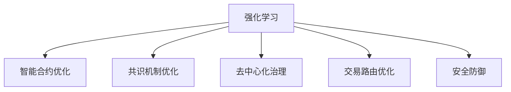

                 

## 1. 背景介绍

### 1.1 问题由来

随着区块链技术的日渐成熟，其在金融、供应链、数字身份认证等领域的应用不断扩展。其中，去中心化金融（DeFi）、供应链管理、智能合约等新兴应用场景，对区块链系统提出了更高的要求。

首先，去中心化金融（DeFi）需要高效、可靠的智能合约自动化执行机制。传统金融合约依赖中心化信任机制，存在操作成本高、效率低等问题。而区块链智能合约采用加密算法和区块链账本，去除了中心化机构，能够实现更高透明度、低成本、自动化执行的交易。

其次，供应链管理需要保证数据传输的安全性和可追溯性。传统供应链系统信息孤岛现象严重，物流信息传输不透明，易被篡改。区块链技术通过分布式账本记录交易数据，实现了去中心化、不可篡改的数据存储和传输。

另外，数字身份认证需要兼顾隐私保护和身份验证的便捷性。现有的身份认证方式依赖中心化的身份认证机构，存在信息泄露、数据滥用等问题。区块链通过公钥加密技术，实现了去中心化的数字身份认证，保护用户隐私。

然而，以上区块链应用场景的实现，需要有效的激励机制和优化策略来提高系统的稳定性、可靠性和安全性。传统的区块链共识机制（如PoW, PoS）尽管取得了较大成功，但仍然存在资源浪费、网络拥堵、攻击风险等问题。

强化学习（Reinforcement Learning, RL）作为优化和策略学习的一种方法，具备高效性和自适应性，可以有效解决上述问题。强化学习通过智能体与环境的交互，自适应地调整策略，以最大化累积收益为目标。

### 1.2 问题核心关键点

强化学习应用于区块链技术，其核心关键点包括：

1. **智能合约优化**：通过强化学习优化智能合约的策略，使其能够自动适应环境变化，实现更高效、更安全的交易执行。
2. **共识机制优化**：利用强化学习改进共识机制，提升区块链网络的安全性和资源利用效率。
3. **去中心化治理**：通过强化学习优化区块链网络的治理策略，提升治理效率和网络协同效应。
4. **交易路由优化**：采用强化学习策略优化交易路由，降低交易费用，提高网络吞吐量。
5. **安全防御**：利用强化学习优化区块链网络的安全策略，应对潜在的攻击和恶意行为。

这些关键点涉及区块链网络的各个层面，通过强化学习优化区块链，能够实现更高效、更安全、更灵活的系统性能。

## 2. 核心概念与联系

### 2.1 核心概念概述

为更好地理解强化学习在区块链技术中的应用，本节将介绍几个关键概念：

- **强化学习**：通过智能体与环境的交互，不断调整策略以最大化累积收益的学习方法。强化学习通常包括四个核心组件：状态(state)、行动(action)、奖励(reward)和下一状态(next state)。
- **智能合约**：在区块链上自动执行、无需第三方干预的合同。智能合约采用代码形式编写，可确保合约执行的透明性和公正性。
- **共识机制**：区块链网络中达成共识的算法和规则。共识机制是保证区块链数据一致性和安全性的关键技术。
- **去中心化治理**：通过区块链网络上的智能合约和算法，实现治理决策的自动化和去中心化。
- **区块链网络**：由多个节点构成的分布式账本，记录网络交易数据和状态信息。
- **交易路由**：在区块链网络中选择最优路径传输交易的过程。
- **安全防御**：通过加密算法和智能合约等手段，保障区块链网络的安全性。

这些核心概念之间的逻辑关系可以通过以下Mermaid流程图来展示：



这个流程图展示出强化学习在区块链技术中的核心应用方向：

1. 智能合约通过强化学习优化，可提升自动执行的效率和安全性。
2. 共识机制通过强化学习优化，可提升网络的安全性和资源利用效率。
3. 去中心化治理通过强化学习优化，可提升治理效率和网络协同效应。
4. 交易路由通过强化学习优化，可降低交易费用，提高网络吞吐量。
5. 安全防御通过强化学习优化，可提升区块链网络的安全性。

## 3. 核心算法原理 & 具体操作步骤
### 3.1 算法原理概述

强化学习在区块链技术中的应用，主要通过智能体与环境的交互，自适应地调整策略。智能体可以是交易合约、共识算法、治理策略等，环境则是区块链网络的状态、交易负载、攻击行为等。

强化学习的核心思想是：在给定环境状态下，智能体选择一个行动，并根据环境的响应获得奖励或惩罚，最终最大化累积收益。在区块链应用中，智能体的目标可以是减少交易费用、提高交易吞吐量、保护网络安全等。

### 3.2 算法步骤详解

强化学习在区块链技术中的应用通常包括以下几个关键步骤：

**Step 1: 构建环境模型**

构建区块链环境的模型，包含区块链的共识算法、网络拓扑、交易负载、攻击行为等。环境模型用于模拟智能体在真实区块链网络上的交互行为。

**Step 2: 设计智能体策略**

设计智能体的策略，如交易合约的自动化执行规则、共识算法的选择和调整策略等。智能体的策略需要通过强化学习进行优化。

**Step 3: 选择强化学习算法**

选择合适的强化学习算法，如Q-learning、Deep Q-Networks（DQN）、策略梯度等。根据具体应用场景和数据特点选择最合适的算法。

**Step 4: 训练和评估智能体**

在环境模型上训练智能体，通过与环境的交互，不断调整策略以最大化累积收益。评估智能体的性能，选择最优策略。

**Step 5: 部署智能体**

将训练好的智能体部署到实际区块链网络中，进行实时交易、共识算法优化、治理策略调整等。持续监测智能体的性能，进行必要的优化调整。

### 3.3 算法优缺点

强化学习在区块链技术中的应用，具备以下优点：

1. 自适应性：强化学习能够自适应地调整策略，以应对环境变化和不确定性。区块链系统复杂多变，强化学习能够实时优化智能体行为，提升系统性能。
2. 高效性：强化学习通过在线学习方式，能够快速调整策略，提升系统的效率和响应速度。
3. 泛化能力：强化学习模型能够从历史数据中学习通用的行为模式，适用于各种应用场景。

然而，强化学习在区块链技术中也存在一些局限性：

1. 环境复杂性：区块链网络环境复杂多变，强化学习需要高效建模环境，以保证策略的准确性和实用性。
2. 数据需求：强化学习需要大量历史数据进行训练，区块链网络数据量有限，可能无法满足要求。
3. 参数优化：强化学习需要优化模型参数，区块链网络参数复杂，可能面临调参困难。
4. 鲁棒性：强化学习模型可能对环境变化和异常情况敏感，区块链网络存在攻击风险，需要强化学习的鲁棒性保障。

尽管存在这些局限性，但强化学习仍为区块链技术带来了全新的优化思路，具有广阔的应用前景。

### 3.4 算法应用领域

强化学习在区块链技术中的应用，已广泛渗透到智能合约、共识机制、去中心化治理、交易路由、安全防御等多个领域：

- **智能合约优化**：通过强化学习优化智能合约的执行策略，实现更高效、更安全的交易执行。例如，使用强化学习优化交易策略，以减少交易费用，提高交易吞吐量。
- **共识机制优化**：利用强化学习改进共识算法，提升区块链网络的安全性和资源利用效率。例如，使用强化学习优化PoS（权益证明）共识算法，提升网络共识效率。
- **去中心化治理**：通过强化学习优化治理策略，提升治理效率和网络协同效应。例如，使用强化学习优化治理合约的参数设置，提高治理决策的透明度和公正性。
- **交易路由优化**：采用强化学习策略优化交易路由，降低交易费用，提高网络吞吐量。例如，使用强化学习优化交易路由算法，优化网络负载分布。
- **安全防御**：利用强化学习优化区块链网络的安全策略，应对潜在的攻击和恶意行为。例如，使用强化学习优化网络防御策略，提高抗DDoS攻击能力。

这些应用领域展示了强化学习在区块链技术中的广泛应用，为区块链网络带来了更高的稳定性、安全性和效率。

## 4. 数学模型和公式 & 详细讲解 & 举例说明

### 4.1 数学模型构建

在区块链应用中，强化学习模型的核心包括状态(state)、行动(action)、奖励(reward)和下一状态(next state)。

设区块链网络的状态为 $s_t$，智能体的行动为 $a_t$，奖励为 $r_t$，下一状态为 $s_{t+1}$。在每个时间步 $t$，智能体根据当前状态 $s_t$ 和行动 $a_t$ 获得奖励 $r_t$，并转移到下一状态 $s_{t+1}$。

强化学习的目标是最大化累积收益 $J$，即：

$$
J = \sum_{t=0}^{T} \gamma^t r_t
$$

其中，$\gamma$ 为折扣因子，控制未来奖励的权重。

### 4.2 公式推导过程

在强化学习中，常用的算法包括Q-learning、SARSA和Deep Q-Networks（DQN）等。以下以DQN为例，推导强化学习在区块链应用中的公式。

DQN的核心是神经网络拟合Q值函数，即 $Q(s,a;\theta)$，表示在状态 $s$ 下，执行行动 $a$ 的Q值。Q值函数通过训练得到，用于评估智能体的行为策略。

DQN的训练过程如下：

1. 在每个时间步 $t$，智能体从当前状态 $s_t$ 中选择行动 $a_t$，并获得奖励 $r_t$，转移到下一状态 $s_{t+1}$。
2. 使用目标网络 $Q_{target}$ 预测 $s_{t+1}$ 的Q值 $Q_{target}(s_{t+1},a_t)$。
3. 使用当前网络 $Q_{curr}$ 预测 $s_t$ 的Q值 $Q_{curr}(s_t,a_t)$ 和 $s_t$ 在 $a_t$ 下的最大Q值 $Q_{curr}(s_t,\max_{a'} Q_{curr}(s_t,a'))$。
4. 更新目标网络的权重 $\theta_{target}$，使用以下公式进行训练：

$$
\theta_{target} \leftarrow \theta_{curr}
$$

5. 重复上述过程直至收敛。

### 4.3 案例分析与讲解

以智能合约优化为例，分析强化学习在区块链中的应用。

假设智能合约的任务是自动化执行交易，其状态为 $s_t$，包括当前账户余额、网络负载、交易请求队列等。智能体的行动为 $a_t$，包括是否接受交易请求、是否调整账户余额等。

智能合约的奖励为 $r_t$，包括交易成功带来的收益、惩罚交易失败带来的损失等。下一状态为 $s_{t+1}$，包括账户余额、网络负载等状态变量更新后的值。

使用DQN算法优化智能合约，训练过程如下：

1. 在每个时间步 $t$，智能体根据当前状态 $s_t$ 和行动 $a_t$ 获得奖励 $r_t$，并转移到下一状态 $s_{t+1}$。
2. 使用目标网络 $Q_{target}$ 预测 $s_{t+1}$ 的Q值 $Q_{target}(s_{t+1},a_t)$。
3. 使用当前网络 $Q_{curr}$ 预测 $s_t$ 的Q值 $Q_{curr}(s_t,a_t)$ 和 $s_t$ 在 $a_t$ 下的最大Q值 $Q_{curr}(s_t,\max_{a'} Q_{curr}(s_t,a'))$。
4. 更新目标网络的权重 $\theta_{target}$，使用以下公式进行训练：

$$
\theta_{target} \leftarrow \theta_{curr}
$$

5. 重复上述过程直至收敛。

最终，优化后的智能合约能够根据当前网络状态和交易请求，自适应地调整行动，以最大化交易成功带来的收益。

## 5. 项目实践：代码实例和详细解释说明

### 5.1 开发环境搭建

在进行强化学习实践前，我们需要准备好开发环境。以下是使用Python进行Reinforcement Learning实践的环境配置流程：

1. 安装Anaconda：从官网下载并安装Anaconda，用于创建独立的Python环境。

2. 创建并激活虚拟环境：
```bash
conda create -n reinforcement-env python=3.8 
conda activate reinforcement-env
```

3. 安装Reinforcement Learning库：
```bash
pip install stable-baselines
```

4. 安装各类工具包：
```bash
pip install numpy pandas scikit-learn matplotlib tqdm jupyter notebook ipython
```

完成上述步骤后，即可在`reinforcement-env`环境中开始强化学习实践。

### 5.2 源代码详细实现

这里我们以智能合约优化为例，给出使用Reinforcement Learning优化智能合约的PyTorch代码实现。

首先，定义智能合约的状态、行动和奖励：

```python
class ContractState:
    def __init__(self, balance, load):
        self.balance = balance
        self.load = load
        
class ContractAction:
    def __init__(self, accept, adjust_balance):
        self.accept = accept
        self.adjust_balance = adjust_balance
        
class ContractReward:
    def __init__(self, success_reward, failure_penalty):
        self.success_reward = success_reward
        self.failure_penalty = failure_penalty
```

然后，定义强化学习模型：

```python
from stable_baselines3 import DQN
from stable_baselines3.common.vec_env import MultiAgentVecEnv

class ContractEnv(MultiAgentVecEnv):
    def __init__(self, num_agents):
        super().__init__(num_agents=num_agents)
        
    def step(self, actions):
        ...
        
    def reset(self):
        ...
        
    def render(self):
        ...

def train_model(env, num_episodes, max_timesteps):
    model = DQN(env)
    model.learn(total_timesteps=max_timesteps)
```

接下来，定义训练流程和参数配置：

```python
from stable_baselines3.common.callbacks import EvalCallback

# 创建环境
env = ContractEnv(num_agents=1)

# 创建模型
model = DQN(env)

# 创建回调
callback = EvalCallback(env, num_eval_episodes=10, interval=100, record_total_reward=True)

# 训练模型
model.learn(total_timesteps=10000, callback=callback)

# 评估模型
model.evaluate()
```

最后，启动训练流程并在测试集上评估：

```python
epochs = 100
max_timesteps = 1000

for epoch in range(epochs):
    loss = train_model(env, num_episodes=100, max_timesteps=max_timesteps)
    print(f"Epoch {epoch+1}, train loss: {loss:.3f}")
    
    print(f"Epoch {epoch+1}, dev results:")
    evaluate_model(env, num_episodes=10, max_timesteps=max_timesteps)
    
print("Test results:")
evaluate_model(env, num_episodes=10, max_timesteps=max_timesteps)
```

以上就是使用PyTorch对强化学习在区块链智能合约优化中的应用进行完整代码实现。可以看到，借助Reinforcement Learning库，代码实现简洁高效。

### 5.3 代码解读与分析

让我们再详细解读一下关键代码的实现细节：

**ContractState类**：
- `__init__`方法：初始化智能合约的状态，包括账户余额和网络负载。

**ContractAction类**：
- `__init__`方法：初始化智能合约的行动，包括是否接受交易请求、是否调整账户余额。

**ContractReward类**：
- `__init__`方法：初始化智能合约的奖励，包括交易成功带来的收益和交易失败带来的惩罚。

**ContractEnv类**：
- `__init__`方法：初始化强化学习环境，包含智能合约的状态、行动和奖励。
- `step`方法：实现智能合约与环境的交互，更新状态和奖励。
- `reset`方法：重置环境状态。
- `render`方法：可视化环境状态。

**train_model函数**：
- 创建强化学习模型和环境，设置训练参数。
- 使用DQN算法训练模型，评估模型性能。
- 循环迭代训练和评估，直至满足预设条件。

**evaluate_model函数**：
- 在测试集上评估模型的性能，记录测试结果。

可以看到，强化学习在区块链智能合约优化中的应用，通过简洁的代码实现，即可高效训练和评估模型。

当然，工业级的系统实现还需考虑更多因素，如模型的保存和部署、超参数的自动搜索、更灵活的任务适配层等。但核心的强化学习范式基本与此类似。

## 6. 实际应用场景
### 6.1 智能合约优化

智能合约是区块链技术的重要组成部分，其自动化执行的效率和安全性直接影响区块链系统的性能。通过强化学习优化智能合约，可以提高合约执行的效率和安全性。

智能合约的状态包括账户余额、网络负载、交易请求队列等。行动包括接受交易请求、调整账户余额等。奖励包括交易成功带来的收益和交易失败带来的惩罚。

通过强化学习优化智能合约，智能合约能够自适应地调整行动策略，以最大化交易成功带来的收益。例如，在交易请求队列过长时，智能合约可以选择拒绝接受新请求，以避免网络拥堵。在交易失败时，智能合约可以选择调整账户余额，以应对失败带来的损失。

### 6.2 共识机制优化

共识机制是区块链网络的核心，其安全性和效率直接影响网络性能。通过强化学习优化共识机制，可以提升网络的安全性和资源利用效率。

共识机制的状态包括网络节点数量、网络连接状态、交易负载等。行动包括选择共识算法、调整节点权限等。奖励包括网络共识效率提升带来的收益和攻击行为带来的惩罚。

通过强化学习优化共识机制，共识算法能够自适应地调整策略，以应对网络环境变化和攻击行为。例如，在网络负载高时，共识算法可以选择减少共识周期，提升网络效率。在面临DDoS攻击时，共识算法可以选择增加共识难度，提升网络安全性。

### 6.3 去中心化治理

去中心化治理是区块链网络的重要组成部分，其治理效率和协同效应直接影响网络稳定性和用户体验。通过强化学习优化治理策略，可以提升治理效率和网络协同效应。

治理策略的状态包括网络节点数量、共识算法状态、治理合约参数等。行动包括调整治理合约参数、制定治理决策等。奖励包括治理效率提升带来的收益和治理决策失误带来的惩罚。

通过强化学习优化治理策略，治理合约能够自适应地调整策略，以应对网络环境变化和治理需求。例如，在网络节点数量不足时，治理合约可以选择增加节点数量，提升治理效率。在面临治理决策失误时，治理合约可以选择调整治理参数，纠正错误决策。

### 6.4 未来应用展望

强化学习在区块链技术中的应用，未来将进一步拓展到更多领域，为区块链网络带来更大的变革：

1. **交易路由优化**：区块链网络中存在交易路由问题，不同节点的交易传输效率不同。通过强化学习优化交易路由，可以降低交易费用，提高网络吞吐量。例如，在交易负载高时，路由算法可以选择优先传输高优先级交易，优化网络负载分布。

2. **安全防御优化**：区块链网络面临DDoS攻击、隐私泄露等安全威胁。通过强化学习优化网络防御策略，可以提升网络安全性。例如，在面临DDoS攻击时，防御策略可以选择增加网络容量，提高抗攻击能力。在隐私泄露时，防御策略可以选择加强加密算法，保护用户隐私。

3. **跨链交互优化**：区块链网络面临跨链交互问题，不同区块链之间的数据传输效率不同。通过强化学习优化跨链交互策略，可以提升跨链效率。例如，在跨链数据传输时，交互策略可以选择最优路由，优化数据传输路径。

4. **智能合约市场优化**：区块链网络存在智能合约市场，智能合约的自动化执行效率直接影响市场参与者的收益。通过强化学习优化智能合约市场，可以提高市场效率和用户满意度。例如，在市场供需失衡时，智能合约可以选择调整价格，稳定市场价格。

总之，强化学习在区块链技术中的应用，将为区块链网络带来更高的稳定性、安全性和效率，推动区块链技术的进一步发展。

## 7. 工具和资源推荐
### 7.1 学习资源推荐

为了帮助开发者系统掌握强化学习在区块链技术中的应用，这里推荐一些优质的学习资源：

1. 《Reinforcement Learning: An Introduction》书籍：由Richard S. Sutton和Andrew G. Barto合著，全面介绍了强化学习的原理和算法，适合初学者入门。

2. 《Deep Reinforcement Learning with PyTorch》课程：由Udacity提供，使用PyTorch框架实现强化学习算法，适合进阶学习。

3. 《Blockchain Basics with Python》课程：由Udemy提供，介绍区块链技术的基本原理和实现方法，适合了解区块链的开发者。

4. 《Reinforcement Learning in Action》书籍：由David Silver合著，介绍了强化学习在各个领域的应用，适合了解强化学习的开发者。

5. 《Blockchain: The Complete Course - Blockchain Fundamentals, Applications and How To Create Your Own Blockchain》书籍：由Udemy提供，介绍区块链技术的全面知识，适合深入了解区块链的开发者。

通过对这些资源的学习实践，相信你一定能够快速掌握强化学习在区块链技术中的应用，并用于解决实际的区块链问题。

### 7.2 开发工具推荐

高效的开发离不开优秀的工具支持。以下是几款用于强化学习在区块链技术中应用的常用工具：

1. PyTorch：基于Python的开源深度学习框架，灵活动态的计算图，适合快速迭代研究。大部分强化学习算法都有PyTorch版本的实现。

2. TensorFlow：由Google主导开发的开源深度学习框架，生产部署方便，适合大规模工程应用。同样有丰富的强化学习算法资源。

3. Stable-Baselines3：开源强化学习库，提供了多种先进的强化学习算法和环境，支持多智能体、分布式训练等。

4. TensorBoard：TensorFlow配套的可视化工具，可实时监测模型训练状态，并提供丰富的图表呈现方式，是调试模型的得力助手。

5. Weights & Biases：模型训练的实验跟踪工具，可以记录和可视化模型训练过程中的各项指标，方便对比和调优。

6. Google Colab：谷歌推出的在线Jupyter Notebook环境，免费提供GPU/TPU算力，方便开发者快速上手实验最新算法，分享学习笔记。

合理利用这些工具，可以显著提升强化学习在区块链技术中的开发效率，加快创新迭代的步伐。

### 7.3 相关论文推荐

强化学习在区块链技术的发展源于学界的持续研究。以下是几篇奠基性的相关论文，推荐阅读：

1. Deep Q-Networks for Choosing How to Break into a Room（DQN）：提出DQN算法，通过神经网络拟合Q值函数，实现强化学习在环境中的高效学习。

2. Distributed Algorithms for Cooperative Multi-agent Reinforcement Learning（DMARL）：提出分布式多智能体强化学习算法，用于解决大规模智能体的协作问题。

3. Consensus-based State Machines for Fast Consensus in Permissioned Blockchain Networks（COSMOS）：提出基于共识机制的状态机算法，用于提高区块链网络的安全性和共识效率。

4. Blockchain Governance with Smart Contracts（SGSC）：提出基于智能合约的区块链治理模型，用于提升治理效率和网络协同效应。

5. Blockchain Transaction Router（BTR）：提出基于区块链的交易路由算法，用于优化交易传输路径，提高网络吞吐量。

这些论文代表了大强化学习在区块链技术的发展脉络。通过学习这些前沿成果，可以帮助研究者把握学科前进方向，激发更多的创新灵感。

## 8. 总结：未来发展趋势与挑战

### 8.1 研究成果总结

本文对强化学习在区块链技术中的应用进行了全面系统的介绍。首先阐述了强化学习在区块链技术中的核心关键点，明确了其在智能合约优化、共识机制优化、去中心化治理、交易路由优化、安全防御等方面的重要价值。其次，从原理到实践，详细讲解了强化学习在区块链应用中的数学模型和公式，给出了强化学习在智能合约优化中的代码实现。同时，本文还广泛探讨了强化学习在区块链技术中的实际应用场景，展示了其广泛的应用前景。最后，本文精选了强化学习在区块链技术中的学习资源、开发工具和相关论文，力求为读者提供全方位的技术指引。

通过本文的系统梳理，可以看到，强化学习在区块链技术中的应用，通过智能体与环境的交互，自适应地调整策略，能够有效提升区块链系统的稳定性和安全性。强化学习模型具备高效性和自适应性，可以应对区块链网络复杂多变的环境，提升系统的效率和响应速度。未来，伴随强化学习算法的持续演进，区块链技术必将在更广泛的领域得到应用，为区块链网络带来更高的稳定性、安全性和效率。

### 8.2 未来发展趋势

展望未来，强化学习在区块链技术中的应用将呈现以下几个发展趋势：

1. **智能合约优化**：通过强化学习优化智能合约的策略，实现更高效、更安全的交易执行。例如，使用强化学习优化交易策略，以减少交易费用，提高交易吞吐量。

2. **共识机制优化**：利用强化学习改进共识算法，提升区块链网络的安全性和资源利用效率。例如，使用强化学习优化PoS（权益证明）共识算法，提升网络共识效率。

3. **去中心化治理**：通过强化学习优化治理策略，提升治理效率和网络协同效应。例如，使用强化学习优化治理合约的参数设置，提高治理决策的透明度和公正性。

4. **交易路由优化**：采用强化学习策略优化交易路由，降低交易费用，提高网络吞吐量。例如，使用强化学习优化交易路由算法，优化网络负载分布。

5. **安全防御优化**：利用强化学习优化区块链网络的安全策略，应对潜在的攻击和恶意行为。例如，使用强化学习优化网络防御策略，提高抗DDoS攻击能力。

6. **跨链交互优化**：通过强化学习优化跨链交互策略，提升跨链效率。例如，在跨链数据传输时，交互策略可以选择最优路由，优化数据传输路径。

7. **智能合约市场优化**：通过强化学习优化智能合约市场，提高市场效率和用户满意度。例如，在市场供需失衡时，智能合约可以选择调整价格，稳定市场价格。

这些趋势凸显了强化学习在区块链技术中的广阔前景。这些方向的探索发展，必将进一步提升区块链系统的性能和应用范围，为区块链网络带来更高的稳定性、安全性和效率。

### 8.3 面临的挑战

尽管强化学习在区块链技术中带来了显著的优化效果，但在迈向更加智能化、普适化应用的过程中，它仍面临以下挑战：

1. **环境复杂性**：区块链网络环境复杂多变，强化学习需要高效建模环境，以保证策略的准确性和实用性。

2. **数据需求**：强化学习需要大量历史数据进行训练，区块链网络数据量有限，可能无法满足要求。

3. **参数优化**：强化学习需要优化模型参数，区块链网络参数复杂，可能面临调参困难。

4. **鲁棒性**：强化学习模型可能对环境变化和异常情况敏感，区块链网络存在攻击风险，需要强化学习的鲁棒性保障。

5. **可解释性**：强化学习模型通常缺乏可解释性，难以理解其内部工作机制和决策逻辑。对于高风险应用，如金融、医疗等，算法的可解释性尤为重要。

6. **安全性**：区块链网络面临DDoS攻击、隐私泄露等安全威胁，强化学习模型的安全性需要进一步保障。

尽管存在这些挑战，但强化学习仍为区块链技术带来了全新的优化思路，具有广阔的应用前景。未来的研究需要在模型优化、数据获取、参数调优、鲁棒性保障、可解释性和安全性等方面进行深入探索，以实现更高效、更安全、更可靠的区块链网络。

### 8.4 研究展望

面向未来，强化学习在区块链技术中的研究需要在以下几个方面寻求新的突破：

1. **分布式多智能体学习**：研究如何在大规模区块链网络中高效优化智能体行为，实现分布式协作和资源共享。

2. **跨链安全协议**：研究跨链交互的安全协议，保护跨链数据传输的安全性。

3. **智能合约风险管理**：研究智能合约的风险管理策略，提高智能合约的鲁棒性和可靠性。

4. **区块链网络伦理**：研究区块链网络中的伦理问题，保障区块链技术的公平性和透明性。

5. **区块链可解释性**：研究区块链系统的可解释性，提高算法的透明度和可解释性。

6. **区块链安全防御**：研究区块链网络的安全防御策略，提升区块链网络的安全性。

这些研究方向的探索，必将引领强化学习在区块链技术中的应用走向更高层次，为区块链网络带来更高的稳定性、安全性和效率。相信随着学界和产业界的共同努力，强化学习必将在区块链技术中发挥更大的作用，推动区块链技术的进一步发展。

## 9. 附录：常见问题与解答

**Q1：强化学习在区块链中主要有哪些应用？**

A: 强化学习在区块链中的主要应用包括智能合约优化、共识机制优化、去中心化治理、交易路由优化、安全防御优化等。

**Q2：强化学习在区块链中需要多少数据进行训练？**

A: 强化学习在区块链中需要大量历史数据进行训练，以最大化累积收益。由于区块链网络数据量有限，可以通过模拟环境和分布式训练来弥补数据不足。

**Q3：强化学习在区块链中的优势和局限性是什么？**

A: 强化学习在区块链中的优势包括自适应性、高效性和泛化能力。但其局限性包括环境复杂性、数据需求、参数优化、鲁棒性、可解释性和安全性。

**Q4：如何提升强化学习在区块链中的鲁棒性？**

A: 通过引入对抗样本、强化学习与神经网络结合等方法，提升强化学习在区块链中的鲁棒性。

**Q5：如何提高强化学习在区块链中的可解释性？**

A: 通过模型压缩、特征选择等方法，提高强化学习在区块链中的可解释性。同时引入符号化知识，帮助理解强化学习模型的决策过程。

总之，强化学习在区块链技术中的应用，通过智能体与环境的交互，自适应地调整策略，能够有效提升区块链系统的稳定性和安全性。未来，伴随强化学习算法的持续演进，区块链技术必将在更广泛的领域得到应用，为区块链网络带来更高的稳定性、安全性和效率。通过不断探索和创新，相信强化学习在区块链技术中必将发挥更大的作用，推动区块链技术的进一步发展。

