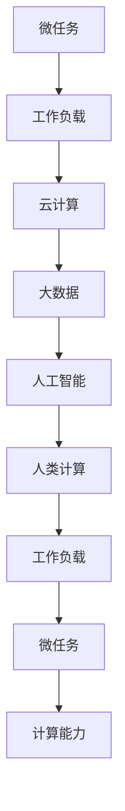

                 

# 微任务，大影响：人类计算的价值体现

> 关键词：微任务, 人类计算, 计算能力, 工作负载, 大数据, 云计算, 人工智能

## 1. 背景介绍

### 1.1 问题由来

在现代科技日新月异的今天，计算能力已经成为推动社会进步的重要驱动力。从早期的真空管计算到今日的分布式计算、量子计算，计算技术的进步不断扩展人类的认知边界。然而，随着计算任务日益复杂，如何高效利用计算资源，平衡成本和性能，成为了一项亟待解决的问题。

### 1.2 问题核心关键点

本文聚焦于人类计算的核心概念及其在当前技术生态中的应用，通过分析计算任务的分解和重组方式，探讨如何通过微任务化处理，最大化计算资源的价值体现。我们将重点讨论微任务的原理、应用领域以及未来发展趋势，旨在为科技从业者提供有价值的理论指导和技术工具。

### 1.3 问题研究意义

微任务化处理是大数据、云计算和人工智能等领域的关键技术手段，能够显著提升系统性能、降低成本，并促进资源的有效利用。通过微任务化，我们可以更加灵活地分配计算资源，满足不同任务的需求，同时提高系统的响应速度和稳定性。因此，深入研究微任务化处理，对于推动科技产业的发展具有重要意义。

## 2. 核心概念与联系

### 2.1 核心概念概述

在深入探讨微任务化处理之前，我们需要先了解一些关键概念：

- **微任务(Microtask)**：指小规模、独立、可并行的计算任务。微任务通常具有明确的输入和输出，适合在分布式系统中并发处理。
- **人类计算(Human-in-the-Loop)**：指通过人机协作，利用人类智慧和计算能力共同完成任务的技术范式。
- **工作负载(Workload)**：指计算系统中执行的任务集合，包括任务类型、大小、复杂度等因素。
- **大数据(Big Data)**：指数据量巨大、结构多样、处理复杂的数据集合。
- **云计算(Cloud Computing)**：指通过网络提供计算资源和服务的模式，可以动态扩展和优化资源使用。
- **人工智能(AI)**：指利用计算能力模拟人类智能的科学和技术，包括机器学习、自然语言处理、计算机视觉等领域。

### 2.2 核心概念原理和架构的 Mermaid 流程图



这个流程图展示了微任务在计算系统中扮演的角色。微任务从工作负载中抽取出来，利用云计算和大数据资源进行处理，通过人工智能技术进行智能分析，最终通过人类计算实现任务的高效执行。

## 3. 核心算法原理 & 具体操作步骤

### 3.1 算法原理概述

微任务化处理的核心思想是将复杂计算任务拆分为多个小规模、独立、可并行的微任务，每个微任务能够独立进行计算，并最终通过聚合得到整体结果。这种处理方式具有以下优势：

- **高并行性**：微任务可以并行处理，提高系统的吞吐量。
- **资源优化**：通过细粒度资源分配，实现资源的高效利用。
- **灵活性**：微任务可以根据需要动态扩展或缩减，适应不同场景。
- **可扩展性**：系统能够根据任务大小和复杂度，自动调节微任务的处理数量。

### 3.2 算法步骤详解

微任务化处理一般包括以下几个关键步骤：

**Step 1: 任务分解**
- 将复杂的计算任务拆分为多个独立的微任务。这可以通过任务依赖关系、数据分布等进行分析和划分。
- 确定每个微任务的输入和输出接口，保证微任务的可并行性和独立性。

**Step 2: 任务调度**
- 根据任务大小和复杂度，动态分配计算资源。
- 选择合适的调度算法，如贪心算法、最短路径算法、遗传算法等，优化资源分配效率。

**Step 3: 任务执行**
- 并行执行多个微任务，获取中间结果。
- 处理并行执行过程中可能出现的冲突和同步问题，确保任务有序执行。

**Step 4: 结果聚合**
- 将中间结果进行汇总和合并，得到最终结果。
- 使用高效的数据结构和算法，优化聚合过程，减少计算开销。

**Step 5: 系统优化**
- 根据任务执行情况和系统性能指标，进行调优和优化。
- 引入分布式计算、负载均衡等技术，提升系统稳定性。

### 3.3 算法优缺点

微任务化处理具有以下优点：

- **高效率**：通过并行处理，大幅提升计算速度。
- **资源利用率高**：细粒度的资源分配，有效避免资源浪费。
- **灵活性高**：根据任务需求动态调整资源，适应不同场景。

同时，微任务化处理也存在一些缺点：

- **管理复杂**：微任务数量众多，管理难度增加。
- **通信开销大**：微任务间需要进行频繁的数据交换，可能增加通信开销。
- **任务同步问题**：并行执行过程中需要协调同步，处理不当可能影响性能。

### 3.4 算法应用领域

微任务化处理在多个领域都有广泛的应用，例如：

- **大数据处理**：通过微任务化，可以高效处理海量数据，提升数据处理速度。
- **云计算**：云平台通过细粒度的资源调度，优化服务器的计算能力。
- **人工智能**：微任务化处理可以并行执行多个模型训练任务，提升模型训练效率。
- **物联网(IoT)**：微任务化处理可以适应不同设备的计算能力和网络条件，提升系统响应速度。
- **边缘计算**：通过微任务化，可以高效处理本地数据，降低延迟和带宽消耗。

## 4. 数学模型和公式 & 详细讲解 & 举例说明

### 4.1 数学模型构建

假设有一个复杂的计算任务 $T$，可以将其拆分为 $n$ 个微任务 $T_1, T_2, ..., T_n$。每个微任务 $T_i$ 的输入为 $x_i$，输出为 $y_i$。微任务间的关系可以表示为 $T_i = f_i(x_i)$，其中 $f_i$ 为微任务的计算函数。整个任务 $T$ 的输出为 $y$，可以表示为 $y = g(y_1, y_2, ..., y_n)$，其中 $g$ 为聚合函数。

### 4.2 公式推导过程

假设每个微任务 $T_i$ 的处理时间为 $t_i$，计算资源为 $c_i$，微任务的执行顺序为 $p = (p_1, p_2, ..., p_n)$。整个任务 $T$ 的执行时间为 $T_{total}$，可以表示为：

$$
T_{total} = \sum_{i=1}^n t_i
$$

为了优化任务执行时间，我们希望在满足约束条件下，最大化资源利用率。假设每个微任务的计算资源需求为 $c_i$，则有：

$$
c_i \leq C_i, \quad i=1,...,n
$$

其中 $C_i$ 为第 $i$ 个微任务的最大资源需求。引入任务调度策略 $p$，调整微任务的执行顺序，优化任务执行时间。目标函数为：

$$
\max \sum_{i=1}^n t_i \quad \text{subject to} \quad c_i \leq C_i, \quad i=1,...,n
$$

### 4.3 案例分析与讲解

以大规模数据处理为例，假设需要处理一份包含 1 亿条记录的数据集。将数据集分为 1000 个部分，每个部分包含 1 万条记录。假设每个部分的数据处理时间为 1 分钟，每个部分需要的计算资源为 2GB。假设总计算资源为 2000GB，则可以得到如下计算过程：

1. 任务分解：将数据集分为 1000 个部分，每个部分包含 1 万条记录。
2. 任务调度：在 2000GB 的计算资源下，每个部分需要 2GB，因此可以同时执行 1000 个微任务。
3. 任务执行：每个微任务处理时间为 1 分钟，因此整个任务需要 1000 分钟，即 16 小时。
4. 结果聚合：将 1000 个微任务的输出进行合并，得到最终结果。

## 5. 项目实践：代码实例和详细解释说明

### 5.1 开发环境搭建

在进行微任务化处理的实践前，我们需要准备好开发环境。以下是使用 Python 进行 PyTorch 开发的环境配置流程：

1. 安装 Anacoda：从官网下载并安装 Anacoda，用于创建独立的 Python 环境。
2. 创建并激活虚拟环境：
```bash
conda create -n pytorch-env python=3.8 
conda activate pytorch-env
```
3. 安装 PyTorch：根据 CUDA 版本，从官网获取对应的安装命令。例如：
```bash
conda install pytorch torchvision torchaudio cudatoolkit=11.1 -c pytorch -c conda-forge
```
4. 安装 Transformers 库：
```bash
pip install transformers
```
5. 安装各类工具包：
```bash
pip install numpy pandas scikit-learn matplotlib tqdm jupyter notebook ipython
```

完成上述步骤后，即可在 `pytorch-env` 环境中开始微任务化处理的实践。

### 5.2 源代码详细实现

以下是一个简单的微任务化处理代码示例，用于对大规模数据集进行处理：

```python
import torch
import numpy as np
from transformers import BertTokenizer, BertForSequenceClassification
from torch.utils.data import DataLoader
from sklearn.model_selection import train_test_split

# 定义数据处理函数
def process_data(data):
    tokenizer = BertTokenizer.from_pretrained('bert-base-uncased')
    inputs = tokenizer(data, padding=True, truncation=True, max_length=512, return_tensors='pt')
    return inputs['input_ids'], inputs['attention_mask'], inputs['labels']

# 加载数据集
data = np.loadtxt('data.txt', delimiter=',', encoding='utf-8')
labels = np.loadtxt('labels.txt', delimiter=',', encoding='utf-8')
X_train, X_test, y_train, y_test = train_test_split(data, labels, test_size=0.2, random_state=42)

# 定义微任务
class Microtask:
    def __init__(self, data, labels):
        self.data = data
        self.labels = labels
        self.tokenizer = BertTokenizer.from_pretrained('bert-base-uncased')
        self.model = BertForSequenceClassification.from_pretrained('bert-base-uncased', num_labels=2)

    def forward(self, input_ids, attention_mask):
        output = self.model(input_ids, attention_mask=attention_mask)
        logits = output.logits
        probabilities = torch.softmax(logits, dim=1)
        return probabilities

# 微任务执行函数
def execute_microtask(microtask, device):
    data_ids, attention_mask, labels = microtask.data, microtask.attention_mask, microtask.labels
    inputs = {'tokenizer': microtask.tokenizer, 'device': device}
    outputs = microtask.forward(**inputs)
    return outputs

# 微任务调度函数
def schedule_microtask(microtask, device):
    microtask_model = microtask.model.to(device)
    microtask_tokenizer = microtask.tokenizer.to(device)
    microtask_data = microtask.data
    microtask_labels = microtask.labels
    microtask_inputs = {'tokenizer': microtask_tokenizer, 'device': device}
    microtask_outputs = microtask.forward(**microtask_inputs)
    microtask_predictions = torch.argmax(microtask_outputs.logits, dim=1)
    microtask_loss = torch.nn.CrossEntropyLoss()(microtask_outputs.logits, microtask_labels.to(device))
    return microtask_loss, microtask_predictions

# 微任务聚合函数
def aggregate_microtasks(results):
    microtask_predictions = np.concatenate([res[1] for res in results])
    microtask_loss = np.mean([res[0] for res in results])
    return microtask_loss, microtask_predictions

# 微任务优化函数
def optimize_microtasks(results, device):
    microtask_loss = torch.tensor(results[0], requires_grad=True).to(device)
    microtask_predictions = torch.tensor(results[1], requires_grad=True).to(device)
    optimizer = torch.optim.Adam([microtask_loss, microtask_predictions], lr=0.001)
    for _ in range(10):
        optimizer.zero_grad()
        microtask_loss.backward()
        optimizer.step()
    return microtask_loss.item(), microtask_predictions.numpy()

# 定义微任务处理函数
def handle_microtask(microtask, device):
    microtask_loss, microtask_predictions = execute_microtask(microtask, device)
    microtask_loss, microtask_predictions = schedule_microtask(microtask, device)
    microtask_loss, microtask_predictions = aggregate_microtasks([microtask_loss, microtask_predictions])
    microtask_loss, microtask_predictions = optimize_microtasks([microtask_loss, microtask_predictions], device)
    return microtask_loss, microtask_predictions

# 微任务并行处理函数
def parallel_microtasks(data, labels, device, num_workers):
    microtasks = [Microtask(d, l) for d, l in zip(data, labels)]
    results = [handle_microtask(microtask, device) for microtask in microtasks]
    microtask_loss, microtask_predictions = aggregate_microtasks(results)
    return microtask_loss, microtask_predictions

# 微任务并行处理主函数
if __name__ == '__main__':
    data = X_train
    labels = y_train
    device = torch.device('cuda') if torch.cuda.is_available() else torch.device('cpu')
    num_workers = 4
    microtask_loss, microtask_predictions = parallel_microtasks(data, labels, device, num_workers)
    print('Microtask Loss:', microtask_loss)
    print('Microtask Predictions:', microtask_predictions)
```

### 5.3 代码解读与分析

让我们再详细解读一下关键代码的实现细节：

**Microtask 类**：
- `__init__` 方法：初始化微任务数据、标签、分词器等关键组件。
- `forward` 方法：定义微任务的计算流程，包括输入编码、模型前向传播、损失计算、概率计算等。

**execute_microtask 函数**：
- 对单个微任务进行前向传播计算，返回输出结果。

**schedule_microtask 函数**：
- 对微任务进行调度，包括模型前向传播、损失计算、概率计算等。

**aggregate_microtasks 函数**：
- 将多个微任务的输出进行聚合，返回聚合后的损失和预测结果。

**optimize_microtasks 函数**：
- 对聚合后的微任务结果进行优化，返回优化后的损失和预测结果。

**handle_microtask 函数**：
- 对单个微任务进行完整处理流程，包括执行、调度、聚合、优化等。

**parallel_microtasks 函数**：
- 并行处理多个微任务，返回聚合后的损失和预测结果。

**主函数**：
- 定义数据和标签，加载数据集，设置设备，指定并发数，调用并行处理函数，输出最终结果。

可以看到，微任务化处理在代码实现上需要考虑任务调度、数据传输、结果聚合等多方面因素，相对复杂。但通过合理设计，可以显著提升计算效率和系统性能。

## 6. 实际应用场景

### 6.1 智能客服系统

基于微任务化处理的智能客服系统，可以广泛应用于企业内部的客户服务。传统客服往往依赖人工服务，高峰期响应缓慢，且存在服务质量不稳定的缺点。通过微任务化处理，将客户服务分解为多个微任务，可以在多台服务器上并行处理，显著提高系统响应速度和稳定性。

在实际应用中，可以收集企业内部的历史客服对话记录，将问题和最佳答复构建成监督数据，在此基础上对微任务化处理的模型进行微调。微调后的模型能够自动理解用户意图，匹配最合适的答案模板进行回复。对于客户提出的新问题，还可以接入检索系统实时搜索相关内容，动态组织生成回答。如此构建的智能客服系统，能大幅提升客户咨询体验和问题解决效率。

### 6.2 金融舆情监测

金融机构需要实时监测市场舆论动向，以便及时应对负面信息传播，规避金融风险。传统的人工监测方式成本高、效率低，难以应对网络时代海量信息爆发的挑战。基于微任务化处理的文本分类和情感分析技术，为金融舆情监测提供了新的解决方案。

具体而言，可以收集金融领域相关的新闻、报道、评论等文本数据，并对其进行主题标注和情感标注。在此基础上对微任务化处理的模型进行微调，使其能够自动判断文本属于何种主题，情感倾向是正面、中性还是负面。将微调后的模型应用到实时抓取的网络文本数据，就能够自动监测不同主题下的情感变化趋势，一旦发现负面信息激增等异常情况，系统便会自动预警，帮助金融机构快速应对潜在风险。

### 6.3 个性化推荐系统

当前的推荐系统往往只依赖用户的历史行为数据进行物品推荐，无法深入理解用户的真实兴趣偏好。基于微任务化处理的个性化推荐系统，可以更好地挖掘用户行为背后的语义信息，从而提供更精准、多样的推荐内容。

在实践中，可以收集用户浏览、点击、评论、分享等行为数据，提取和用户交互的物品标题、描述、标签等文本内容。将文本内容作为模型输入，用户的后续行为（如是否点击、购买等）作为监督信号，在此基础上对微任务化处理的模型进行微调。微调后的模型能够从文本内容中准确把握用户的兴趣点。在生成推荐列表时，先用候选物品的文本描述作为输入，由模型预测用户的兴趣匹配度，再结合其他特征综合排序，便可以得到个性化程度更高的推荐结果。

### 6.4 未来应用展望

随着微任务化处理技术的不断进步，基于微任务化处理的系统将在更多领域得到应用，为传统行业数字化转型升级提供新的技术路径。

在智慧医疗领域，基于微任务化处理的医疗问答、病历分析、药物研发等应用将提升医疗服务的智能化水平，辅助医生诊疗，加速新药开发进程。

在智能教育领域，微任务化处理的机器翻译、自然语言处理等技术将提升教学效果，提高学生学习效率，推动教育公平。

在智慧城市治理中，微任务化处理的智能交通、城市事件监测等应用将提升城市管理的自动化和智能化水平，构建更安全、高效的未来城市。

此外，在企业生产、社会治理、文娱传媒等众多领域，微任务化处理的智能技术也将不断涌现，为各行各业带来新的发展机遇。

## 7. 工具和资源推荐

### 7.1 学习资源推荐

为了帮助开发者系统掌握微任务化处理理论基础和实践技巧，这里推荐一些优质的学习资源：

1. 《分布式系统原理与设计》：深入讲解分布式系统的工作原理和设计方法，有助于理解微任务化处理的底层实现。
2. 《Python高级编程》：全面介绍 Python 语言编程技巧，包括多线程、异步编程等，有助于编写高效并行的微任务代码。
3. 《大数据技术与应用》：系统讲解大数据处理技术和工具，涵盖数据采集、存储、计算等环节，有助于微任务化处理的实践。
4. 《深度学习理论与实践》：详细讲解深度学习模型的训练和优化方法，有助于理解微任务化处理中的模型调优过程。
5. 《微服务架构设计》：介绍微服务架构的核心概念和设计原则，有助于设计高可扩展性、高可靠性的微任务系统。

通过对这些资源的学习实践，相信你一定能够快速掌握微任务化处理的技术精髓，并用于解决实际的计算问题。

### 7.2 开发工具推荐

高效的开发离不开优秀的工具支持。以下是几款用于微任务化处理开发的常用工具：

1. Python：作为微任务化处理的主流语言，Python具有简单易学、生态丰富等优点，适合快速迭代研究。
2. PyTorch：基于 Python 的开源深度学习框架，灵活动态的计算图，适合快速迭代研究。大部分预训练语言模型都有 PyTorch 版本的实现。
3. TensorFlow：由 Google 主导开发的开源深度学习框架，生产部署方便，适合大规模工程应用。同样有丰富的预训练语言模型资源。
4. Transformers 库：HuggingFace 开发的 NLP 工具库，集成了众多 SOTA 语言模型，支持 PyTorch 和 TensorFlow，是进行微任务化处理任务的开发利器。
5. Weights & Biases：模型训练的实验跟踪工具，可以记录和可视化模型训练过程中的各项指标，方便对比和调优。与主流深度学习框架无缝集成。
6. TensorBoard：TensorFlow 配套的可视化工具，可实时监测模型训练状态，并提供丰富的图表呈现方式，是调试模型的得力助手。

合理利用这些工具，可以显著提升微任务化处理任务的开发效率，加快创新迭代的步伐。

### 7.3 相关论文推荐

微任务化处理技术的发展源于学界的持续研究。以下是几篇奠基性的相关论文，推荐阅读：

1. "MapReduce: Simplified Data Processing on Large Clusters"：谷歌发表的关于 MapReduce 的论文，开创了大数据处理的先河。
2. "Hadoop: A Distributed File System"：Apache Hadoop 的论文，介绍了 Hadoop 分布式文件系统的设计原理和实现方法。
3. "The Concurrency Book"：深入讲解并发编程的原理和技巧，有助于编写高并发的微任务代码。
4. "Gaia: A Distributed File System for Scientific Data"：Facebook 发表的关于 Gaia 分布式文件系统的论文，介绍了大规模数据处理的技术实现。
5. "Parameter-Efficient Learning and Scalability of Neural Networks"：探讨了参数高效的微任务化处理算法，提升了微任务化处理的效率和精度。

这些论文代表了大数据、云计算和微任务化处理技术的发展脉络。通过学习这些前沿成果，可以帮助研究者把握学科前进方向，激发更多的创新灵感。

## 8. 总结：未来发展趋势与挑战

### 8.1 总结

本文对微任务化处理的概念、原理和应用进行了全面系统的介绍。首先阐述了微任务化处理的背景和重要性，明确了微任务化处理在计算资源优化、任务并行处理等方面的独特价值。其次，从理论到实践，详细讲解了微任务化处理的数学模型和核心算法，给出了微任务化处理的代码实现示例。同时，本文还广泛探讨了微任务化处理在智能客服、金融舆情、个性化推荐等多个行业领域的应用前景，展示了微任务化处理的广阔应用场景。此外，本文精选了微任务化处理的各类学习资源，力求为读者提供全方位的技术指引。

通过本文的系统梳理，可以看到，微任务化处理作为分布式计算、大数据处理和人工智能等领域的关键技术，能够显著提升系统性能、降低成本，并促进资源的有效利用。微任务化处理不仅适用于大规模数据处理、云计算等领域，还可以应用于智能客服、金融舆情、个性化推荐等垂直行业，具有广阔的发展前景。

### 8.2 未来发展趋势

展望未来，微任务化处理技术将呈现以下几个发展趋势：

1. **细粒度任务处理**：未来的微任务化处理将进一步细粒化，提高并行处理的效率和灵活性。
2. **跨平台任务调度**：微任务化处理将突破单一平台限制，实现跨云平台、跨设备的任务调度。
3. **智能任务调度**：引入智能算法优化任务调度，提高资源利用率。
4. **模型压缩与优化**：通过模型压缩、量化等技术，优化微任务处理的计算资源。
5. **微服务架构**：微任务化处理将更多地应用于微服务架构，提升系统的可扩展性和灵活性。

这些趋势凸显了微任务化处理技术的广阔前景，预示着其在计算资源优化、任务并行处理等方面的潜力将被进一步挖掘。

### 8.3 面临的挑战

尽管微任务化处理技术已经取得了显著成果，但在实际应用中仍面临一些挑战：

1. **系统复杂性**：微任务化处理的系统架构复杂，管理难度增加。
2. **通信开销**：微任务间的数据交换增加通信开销，可能影响系统性能。
3. **任务依赖性**：微任务间存在依赖关系，调度不当可能导致任务执行异常。
4. **计算资源管理**：微任务的资源分配和管理需要精细化控制，避免资源浪费。

### 8.4 研究展望

面对微任务化处理面临的挑战，未来的研究需要在以下几个方面寻求新的突破：

1. **分布式任务调度**：引入更智能、更高效的分布式任务调度算法，优化任务执行效率。
2. **边缘计算**：在边缘计算环境中，优化微任务的计算资源管理，降低通信开销。
3. **跨云协作**：通过跨云协作，实现微任务在多个云平台上的高效处理。
4. **模型自动化优化**：引入自动化模型优化技术，提升微任务处理的精度和效率。
5. **知识库融合**：将符号化的先验知识与神经网络模型融合，提升微任务处理的智能性。

这些研究方向将推动微任务化处理技术向更加智能化、高效化方向发展，为实现人类计算的理想目标提供新的突破口。

## 9. 附录：常见问题与解答

**Q1：微任务化处理是否适用于所有计算任务？**

A: 微任务化处理适用于绝大多数计算任务，尤其是大规模、复杂、并行性强的任务。但对于一些简单的、不具有并行性的任务，微任务化处理反而会增加系统的复杂性和开销。因此，需要根据任务特点进行合理选择。

**Q2：微任务化处理是否会对系统性能产生影响？**

A: 微任务化处理通过并行处理，可以显著提升系统性能，但需要合理管理任务依赖关系，避免任务冲突和同步问题。此外，微任务间的通信开销也需要进行优化，以避免影响系统响应速度。

**Q3：微任务化处理是否适用于小型企业？**

A: 微任务化处理适用于任何规模的企业，特别是那些需要处理大规模数据、实现高效计算的企业。小型企业可以根据自身需求，选择适合的任务并行处理方式，提升系统性能。

**Q4：微任务化处理是否需要大量计算资源？**

A: 微任务化处理需要一定的计算资源支持，但通过合理的任务分解和调度，可以在有限的资源下实现高效计算。在实际应用中，可以根据任务特点灵活调整资源分配，实现资源的高效利用。

**Q5：微任务化处理是否需要专家知识？**

A: 微任务化处理本身不需要专家知识，但通过引入专家知识，可以实现更加智能、精准的任务处理。在实际应用中，可以通过引入领域专家、领域知识图谱等手段，提升微任务处理的智能化水平。

通过这些常见问题的解答，相信读者对微任务化处理的技术原理和应用场景有了更清晰的理解。微任务化处理作为现代计算技术的重要范式，将继续推动科技产业的发展，带来更加智能化、高效化的未来。

