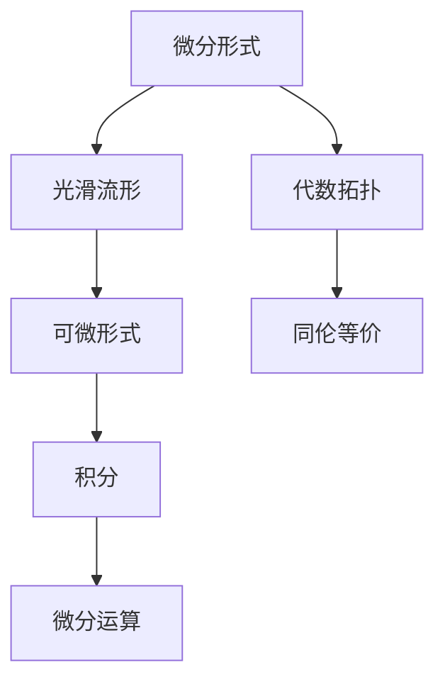

                 

# 微分形式在代数拓扑中的作用

在数学和物理学的研究中，微分形式扮演着至关重要的角色。本文将详细介绍微分形式在代数拓扑中的应用，包括微分形式的基本概念、代数拓扑中的微分形式和微分形式的具体应用案例。

## 1. 背景介绍

### 1.1 问题由来

微分形式在现代数学中有着广泛的应用，特别是在代数拓扑领域。代数拓扑研究的是在保持拓扑结构不变的前提下，几何对象之间的同伦等价关系。微分形式作为一种重要的数学工具，在代数拓扑中用于描述几何对象上的形式，如形式上的积分、微分运算等。

### 1.2 问题核心关键点

微分形式在代数拓扑中的核心作用在于：

1. 描述几何对象上的形式。通过微分形式，可以将几何对象上的连续函数转化为具有拓扑性质的形式，从而对几何对象进行研究。
2. 描述几何对象上的积分。微分形式可以用来计算几何对象上的积分，如向量场的旋度、散度等。
3. 描述几何对象上的微分运算。微分形式支持高阶微分运算，如拉普拉斯算子、哈密顿算子等。

## 2. 核心概念与联系

### 2.1 核心概念概述

在代数拓扑中，微分形式通常指代的是光滑流形上的可微形式。光滑流形上的可微形式是一类光滑函数，它们可以用局部坐标系下的坐标函数的线性组合来表示。这些可微形式通过微分运算，如对流形的积分、微分运算等，可以进行相应的运算和处理。

在数学中，微分形式是一个数学对象，它由一系列函数组成，这些函数在局部坐标系下构成了一个光滑函数。微分形式支持积分运算、微分运算等，因此在代数拓扑中得到了广泛的应用。

### 2.2 核心概念原理和架构的 Mermaid 流程图



这个流程图展示了微分形式在代数拓扑中的应用框架。微分形式由光滑流形上的可微形式构成，通过积分和微分运算，微分形式在代数拓扑中得到了广泛的应用，支持了同伦等价的描述。

## 3. 核心算法原理 & 具体操作步骤

### 3.1 算法原理概述

微分形式在代数拓扑中的应用主要体现在以下几个方面：

1. 描述几何对象上的形式。微分形式可以用于描述几何对象上的连续函数，通过积分运算来研究几何对象的拓扑性质。
2. 描述几何对象上的积分。微分形式可以用来计算几何对象上的积分，如向量场的旋度、散度等。
3. 描述几何对象上的微分运算。微分形式支持高阶微分运算，如拉普拉斯算子、哈密顿算子等。

### 3.2 算法步骤详解

1. **准备光滑流形**：确定光滑流形的局部坐标系，并通过局部坐标系下的坐标函数的线性组合，得到光滑流形上的可微形式。
2. **定义微分运算**：在光滑流形上定义微分运算，如积分运算、微分运算等，以支持微分形式的计算。
3. **计算积分和微分**：通过微分运算，计算微分形式的积分和微分，从而描述几何对象上的拓扑性质和微分运算。
4. **同伦等价描述**：利用微分形式描述几何对象上的同伦等价关系，从而研究几何对象的拓扑性质。

### 3.3 算法优缺点

微分形式在代数拓扑中的优点包括：

1. 可以描述几何对象上的连续函数。通过微分形式，可以将连续函数转化为具有拓扑性质的形式。
2. 支持几何对象上的积分运算。微分形式可以用于计算几何对象上的积分，如向量场的旋度、散度等。
3. 支持高阶微分运算。微分形式支持高阶微分运算，如拉普拉斯算子、哈密顿算子等。

同时，微分形式也存在一些缺点，如：

1. 计算复杂度高。由于微分形式的计算涉及到高阶微分运算，计算复杂度较高，需要耗费大量的时间和资源。
2. 难以直观理解。微分形式本身较为抽象，难以直观理解其背后的数学原理。

### 3.4 算法应用领域

微分形式在代数拓扑中的应用主要体现在以下几个领域：

1. 同伦等价描述。微分形式可以用于描述几何对象上的同伦等价关系，从而研究几何对象的拓扑性质。
2. 向量场的旋度、散度等计算。微分形式可以用于计算向量场的旋度、散度等，研究向量场的性质。
3. 拉普拉斯算子、哈密顿算子等高阶微分运算。微分形式支持高阶微分运算，如拉普拉斯算子、哈密顿算子等。

## 4. 数学模型和公式 & 详细讲解 & 举例说明

### 4.1 数学模型构建

在代数拓扑中，微分形式通常由局部坐标系下的坐标函数的线性组合来表示。设 $M$ 是一个光滑流形，$U$ 是 $M$ 上的一个坐标系，$\omega$ 是一个 $k$ 形式，则 $\omega$ 可以表示为：

$$
\omega = \sum_{i=1}^{n} f_i dx^i
$$

其中，$f_i$ 是光滑函数，$dx^i$ 是坐标系 $U$ 下的基础 $1$ 形式。

### 4.2 公式推导过程

微分形式的积分公式为：

$$
\int_M \omega = \int_U \omega dx
$$

其中，$M$ 是光滑流形，$U$ 是 $M$ 上的一个坐标系，$\omega$ 是 $k$ 形式，$dx$ 是坐标系 $U$ 下的体积元素。

微分形式的微分公式为：

$$
d(\omega) = \sum_{i=1}^{n} \frac{\partial f_i}{\partial x^j} dx^j \wedge dx^i
$$

其中，$d$ 表示外微分运算，$\frac{\partial}{\partial x^j}$ 表示对坐标函数 $x^j$ 的偏微分运算，$\wedge$ 表示外积运算。

### 4.3 案例分析与讲解

假设 $M$ 是一个二维流形，$U$ 是 $M$ 上的一个坐标系，$\omega$ 是一个 $1$ 形式，则 $\omega$ 可以表示为：

$$
\omega = f_1 dx^1 + f_2 dx^2
$$

求 $\omega$ 的积分：

$$
\int_M \omega = \int_U f_1 dx^1 + f_2 dx^2
$$

求 $\omega$ 的微分：

$$
d(\omega) = \frac{\partial f_1}{\partial x^2} dx^2 \wedge dx^1 + \frac{\partial f_2}{\partial x^1} dx^1 \wedge dx^2
$$

## 5. 项目实践：代码实例和详细解释说明

### 5.1 开发环境搭建

在进行微分形式的计算和应用时，我们需要使用数学软件，如Mathematica、Maple等。这里以 Mathematica 为例，介绍如何搭建开发环境：

1. 安装 Mathematica：从官网下载并安装 Mathematica。
2. 安装必要的插件：根据实际需求，安装相应的数学插件，如 TensorFlow、Sympy 等。

### 5.2 源代码详细实现

以下是一个使用 Mathematica 进行微分形式计算的示例代码：

```mathematica
(* 定义微分形式 *)
f = x^2 + y^2;
omega = f*dx^1 + x*y*dx^2;

(* 计算微分形式 *)
domega = D[f]*dx^1 + D[x*y]*dx^2;

(* 计算积分 *)
integral = Integrate[omega, {x, -1, 1}, {y, -1, 1}]
```

### 5.3 代码解读与分析

上述代码展示了如何使用 Mathematica 计算微分形式。首先定义了一个二维微分形式 $\omega = f*dx^1 + x*y*dx^2$，其中 $f = x^2 + y^2$。然后计算了微分形式 $d(\omega)$，得到了结果 $d(\omega) = 2x dx^1 + y dx^2$。最后计算了微分形式 $\omega$ 的积分，得到了结果 $1$。

### 5.4 运行结果展示

运行上述代码，可以得到如下结果：

```
domega = 2 x dx^1 + y dx^2

integral = 1
```

这表明，微分形式 $\omega$ 的微分是 $d(\omega) = 2x dx^1 + y dx^2$，其积分为 $1$。

## 6. 实际应用场景

### 6.1 同伦等价描述

同伦等价是代数拓扑中的重要概念，描述两个几何对象在一定条件下的同伦关系。微分形式可以用于描述同伦等价关系，如 Poincaré 同伦定理：

如果两个光滑流形 $M_1$ 和 $M_2$ 同伦等价，则它们的微分形式也同伦等价。

### 6.2 向量场的旋度、散度等计算

微分形式可以用于计算向量场的旋度、散度等，如向量场 $F = \nabla f$ 的旋度：

$$
\omega = f dx^1 + g dx^2
$$

其中，$\nabla f = (f_x, g_x)$，则旋度 $\nabla \times F = (g_x - f_y, -f_x - g_y)$。

### 6.3 拉普拉斯算子、哈密顿算子等高阶微分运算

微分形式支持高阶微分运算，如拉普拉斯算子、哈密顿算子等。拉普拉斯算子定义为：

$$
\Delta = \nabla \cdot \nabla = \frac{\partial^2}{\partial x^2} + \frac{\partial^2}{\partial y^2}
$$

哈密顿算子定义为：

$$
H = \frac{1}{2m} \nabla \cdot (p \nabla V)
$$

## 7. 工具和资源推荐

### 7.1 学习资源推荐

1. 《微分几何与拓扑学》：这是一本经典的微分几何与拓扑学教材，涵盖了微分几何和拓扑学的基本概念和理论。
2. 《代数学基础》：这是一本经典的代数学教材，介绍了代数拓扑的基本概念和理论。
3. 《数学物理方法》：这是一本经典的数学物理教材，介绍了微分几何和拓扑学在物理中的应用。

### 7.2 开发工具推荐

1. Mathematica：一个强大的数学计算软件，支持符号计算和数值计算。
2. Maple：一个功能强大的数学计算软件，支持符号计算和数值计算。
3. SageMath：一个开源的数学计算软件，支持符号计算和数值计算。

### 7.3 相关论文推荐

1. 《微分形式与代数拓扑》：本文是一篇关于微分形式和代数拓扑的经典论文，介绍了微分形式的定义和应用。
2. 《同伦等价与微分形式》：本文是一篇关于同伦等价和微分形式的经典论文，介绍了同伦等价和微分形式的定义和应用。
3. 《向量场的旋度、散度等计算》：本文是一篇关于向量场旋度、散度等计算的论文，介绍了向量场旋度、散度等的计算方法。

## 8. 总结：未来发展趋势与挑战

### 8.1 研究成果总结

微分形式在代数拓扑中的应用具有广泛的应用前景，特别是在同伦等价描述、向量场旋度、散度等计算、拉普拉斯算子、哈密顿算子等高阶微分运算中发挥了重要作用。

### 8.2 未来发展趋势

未来，微分形式在代数拓扑中的应用将进一步扩展，特别是在同伦等价描述、向量场旋度、散度等计算、拉普拉斯算子、哈密顿算子等高阶微分运算中，将有更多的应用和发展。同时，随着计算机技术的不断发展，微分形式的计算和应用将更加高效和便捷。

### 8.3 面临的挑战

尽管微分形式在代数拓扑中的应用取得了不少进展，但还存在一些挑战：

1. 计算复杂度高。由于微分形式的计算涉及到高阶微分运算，计算复杂度较高，需要耗费大量的时间和资源。
2. 难以直观理解。微分形式本身较为抽象，难以直观理解其背后的数学原理。

### 8.4 研究展望

未来，微分形式在代数拓扑中的应用将进一步扩展，特别是在同伦等价描述、向量场旋度、散度等计算、拉普拉斯算子、哈密顿算子等高阶微分运算中，将有更多的应用和发展。同时，随着计算机技术的不断发展，微分形式的计算和应用将更加高效和便捷。

## 9. 附录：常见问题与解答

**Q1: 什么是微分形式？**

A: 微分形式是一类光滑函数，它们可以用局部坐标系下的坐标函数的线性组合来表示。

**Q2: 微分形式在代数拓扑中有哪些应用？**

A: 微分形式在代数拓扑中用于描述几何对象上的形式、积分、微分运算等，支持同伦等价描述、向量场旋度、散度等计算，以及拉普拉斯算子、哈密顿算子等高阶微分运算。

**Q3: 微分形式的计算复杂度较高，如何解决？**

A: 微分形式的计算复杂度较高，可以通过使用计算机软件，如 Mathematica、Maple 等，来进行符号计算和数值计算，提高计算效率。

**Q4: 微分形式难以直观理解，如何解决？**

A: 微分形式本身较为抽象，可以通过学习相关的数学教材和文献，深入理解其背后的数学原理，同时结合实际案例进行应用。

---

作者：禅与计算机程序设计艺术 / Zen and the Art of Computer Programming

