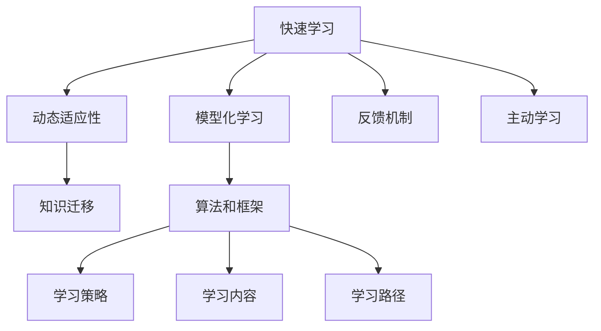

                 

## 1. 背景介绍

### 1.1 问题由来

在瞬息万变的数字时代，持续学习和自我更新成为个人和组织在竞争中保持领先的不二法门。技术的迭代、市场的变化、客户需求的多样化，使得过去静态的学习模式不再适用。因此，快速学习成为当前社会的重要课题。

### 1.2 问题核心关键点

快速学习的目的在于，通过高效的方法和策略，快速掌握新知识，适应新环境，持续提升自身能力。核心关键点包括：

- **动态适应性**：学习方式应能迅速响应环境变化，随时调整和优化学习策略。
- **高效学习效率**：在有限的时间内，最大化知识吸收和技能提升的速度和深度。
- **反馈机制**：及时获取反馈，纠正错误，调整学习路径，提升学习效果。
- **知识迁移**：将学到的知识迁移到新的任务和场景中，实现跨领域应用。

### 1.3 问题研究意义

快速学习不仅对个人职业发展具有重要意义，对企业组织能力提升、技术迭代更新也具有深远影响。具体研究意义如下：

1. **个人成长**：快速学习能帮助个人在不断变化的环境中快速适应新技能，提升职业竞争力。
2. **组织效能**：快速学习机制可以加速团队成员的知识同步，提升整体工作效率和创新能力。
3. **技术突破**：加速技术积累和迭代，推动更多前沿技术突破和应用落地。
4. **市场响应**：快速学习使得组织能够更快响应市场需求变化，保持竞争力。

## 2. 核心概念与联系

### 2.1 核心概念概述

为更好地理解快速学习的原理和实践，本节将介绍几个核心概念及其联系：

- **快速学习(Fast Learning)**：通过高效方法和策略，快速掌握新知识和技能。
- **动态适应性**：学习系统能够根据环境变化实时调整学习内容和方式。
- **知识迁移**：将已掌握的知识和技能应用到新的任务和场景中。
- **模型化学习**：将学习过程模型化，使用算法和框架来辅助学习。
- **反馈机制**：及时获取反馈，调整学习路径。
- **主动学习**：通过自我驱动和探索性学习，提升学习效率和深度。

这些概念之间的逻辑关系可以通过以下Mermaid流程图来展示：



这个流程图展示了快速学习的核心概念及其相互关系：

1. 快速学习是目标，通过动态适应性、知识迁移、模型化学习、反馈机制和主动学习等方法来实现。
2. 动态适应性、知识迁移和反馈机制是快速学习的关键支撑点。
3. 模型化学习、主动学习是快速学习的辅助手段，通过算法和框架来提高学习效率和效果。

## 3. 核心算法原理 & 具体操作步骤

### 3.1 算法原理概述

快速学习的核心在于通过高效的算法和策略，最大化知识吸收和技能提升的速度。具体来说，快速学习可以分解为以下几个步骤：

1. **数据收集**：从环境或任务中获取大量相关数据。
2. **模型化**：将学习过程模型化，使用算法和框架来辅助学习。
3. **动态适应**：根据数据和反馈，实时调整学习内容和方式。
4. **知识迁移**：将学到的知识和技能应用到新的任务和场景中。

### 3.2 算法步骤详解

基于上述原理，快速学习的具体操作步骤如下：

**Step 1: 数据收集**

- 识别并收集与目标任务相关的数据，包括文本、视频、图像等多种形式。
- 确保数据的代表性和多样性，涵盖任务的不同方面和场景。
- 利用数据增强技术，扩充数据集，提高学习效率。

**Step 2: 模型化**

- 选择适当的算法和框架，将学习过程模型化。常用的框架包括TensorFlow、PyTorch等。
- 定义损失函数和优化器，设定学习率和正则化参数。
- 使用预训练模型或迁移学习，初始化模型参数，加快收敛速度。

**Step 3: 动态适应**

- 利用在线学习或增量学习算法，实时更新模型参数，适应数据变化。
- 使用在线反馈机制，及时获取环境变化信息，调整学习路径和策略。
- 采用自适应学习率、弹性学习率等技术，动态调整学习速度。

**Step 4: 知识迁移**

- 通过迁移学习，将已学知识迁移到新任务中。
- 使用微调技术，对新任务进行适配，提升性能。
- 利用知识图谱、逻辑规则等先验知识，增强模型理解力和泛化能力。

### 3.3 算法优缺点

快速学习的优点包括：

- **高效性**：通过模型化和动态适应，最大化学习效率。
- **灵活性**：实时调整学习内容和方式，适应环境变化。
- **可扩展性**：能够处理多种形式的数据，实现跨领域应用。
- **稳定性和可靠性**：使用预训练模型和迁移学习，提升学习效果。

缺点包括：

- **复杂度**：需要设计和实现复杂的学习框架和算法。
- **资源需求**：需要大量的数据和计算资源，设备成本较高。
- **技术门槛**：对技术和算法有一定要求，非专业人士难以掌握。

### 3.4 算法应用领域

快速学习广泛应用于多个领域，包括但不限于：

- **自动驾驶**：通过模型化和动态适应，实时调整驾驶策略，提高安全性和效率。
- **医疗诊断**：利用知识迁移，将医学知识应用于新患者，提高诊断准确性。
- **金融分析**：通过动态适应，实时分析市场数据，优化投资决策。
- **教育培训**：采用主动学习，提升学习效果，个性化推荐学习内容。
- **市场营销**：利用快速学习模型，预测市场趋势，优化营销策略。

## 4. 数学模型和公式 & 详细讲解

### 4.1 数学模型构建

快速学习的数学模型主要基于监督学习和强化学习。假设学习任务为分类问题，输入为 $x$，输出为 $y$，模型为 $f$。则快速学习的目标是通过最小化损失函数，得到最优模型参数 $\theta$：

$$
\theta = \arg\min_\theta \sum_{i=1}^N \ell(f(x_i),y_i)
$$

其中 $\ell$ 为损失函数，$N$ 为样本数量。常用的损失函数包括交叉熵损失和均方误差损失。

### 4.2 公式推导过程

以交叉熵损失为例，假设模型 $f$ 对输入 $x$ 的输出为 $f(x)$，其概率分布为 $p(x)$，真实标签为 $y$，则交叉熵损失函数为：

$$
\ell(f(x),y) = -y \log p(x) - (1-y) \log(1-p(x))
$$

将损失函数代入总体损失函数，得到：

$$
\mathcal{L}(\theta) = \frac{1}{N} \sum_{i=1}^N \ell(f(x_i),y_i)
$$

通过梯度下降等优化算法，求解 $\theta$：

$$
\theta = \theta - \eta \nabla_\theta \mathcal{L}(\theta)
$$

其中 $\eta$ 为学习率，$\nabla_\theta \mathcal{L}(\theta)$ 为损失函数对 $\theta$ 的梯度，通过反向传播算法计算。

### 4.3 案例分析与讲解

以医疗诊断为例，快速学习可以应用于X光片的自动分类问题。假设已收集到大量标注的X光片数据，利用预训练模型或迁移学习初始化模型，通过交叉熵损失函数进行优化：

- **数据收集**：收集大量标注的X光片数据，涵盖不同的疾病类型和症状。
- **模型化**：选择适当的神经网络结构，如卷积神经网络（CNN），定义交叉熵损失函数，初始化模型参数。
- **动态适应**：利用在线学习算法，实时更新模型参数，适应新患者的情况。
- **知识迁移**：将已学知识应用于新患者，通过微调技术优化模型，提高诊断准确性。

## 5. 项目实践：代码实例和详细解释说明

### 5.1 开发环境搭建

在进行快速学习项目实践前，需要准备相应的开发环境。以下是使用Python和TensorFlow进行开发的流程：

1. 安装Python：从官网下载并安装Python，推荐使用Anaconda或Miniconda。
2. 创建虚拟环境：使用conda创建虚拟环境，以避免不同项目之间的依赖冲突。
3. 安装TensorFlow：使用pip或conda安装TensorFlow，安装指令如下：

```bash
pip install tensorflow
```

4. 安装相关依赖：安装必要的依赖库，如numpy、pandas、matplotlib等。

```bash
pip install numpy pandas matplotlib
```

### 5.2 源代码详细实现

以下是一个使用TensorFlow实现快速学习的代码实例，以医疗诊断中的X光片分类为例：

```python
import tensorflow as tf
import numpy as np
import matplotlib.pyplot as plt

# 定义模型结构
model = tf.keras.Sequential([
    tf.keras.layers.Conv2D(32, (3, 3), activation='relu', input_shape=(64, 64, 3)),
    tf.keras.layers.MaxPooling2D((2, 2)),
    tf.keras.layers.Conv2D(64, (3, 3), activation='relu'),
    tf.keras.layers.MaxPooling2D((2, 2)),
    tf.keras.layers.Flatten(),
    tf.keras.layers.Dense(64, activation='relu'),
    tf.keras.layers.Dense(2, activation='softmax')
])

# 加载数据集
(x_train, y_train), (x_test, y_test) = tf.keras.datasets.mnist.load_data()

# 数据预处理
x_train = x_train.reshape(-1, 64, 64, 3) / 255.0
x_test = x_test.reshape(-1, 64, 64, 3) / 255.0

# 定义损失函数和优化器
loss_fn = tf.keras.losses.SparseCategoricalCrossentropy()
optimizer = tf.keras.optimizers.Adam(learning_rate=0.001)

# 训练模型
model.compile(optimizer=optimizer, loss=loss_fn, metrics=['accuracy'])
model.fit(x_train, y_train, epochs=10, validation_data=(x_test, y_test))

# 评估模型
test_loss, test_acc = model.evaluate(x_test, y_test, verbose=2)
print(f'Test accuracy: {test_acc:.2f}')
```

### 5.3 代码解读与分析

上述代码实现了一个基本的卷积神经网络，用于对手写数字进行分类。关键点包括：

- **模型结构定义**：定义了卷积层、池化层和全连接层，用于特征提取和分类。
- **数据预处理**：将图像数据归一化，并将其转换为模型所需的形式。
- **损失函数和优化器定义**：使用交叉熵损失函数和Adam优化器。
- **模型训练和评估**：使用训练集和验证集进行模型训练和评估，输出测试集上的准确率。

## 6. 实际应用场景

### 6.1 智能推荐系统

快速学习在智能推荐系统中具有重要应用。传统的推荐系统主要依赖用户行为数据进行推荐，难以捕捉用户的隐式偏好和即时变化。而快速学习可以通过在线学习，实时更新推荐模型，适应用户的新需求和行为变化。

具体实现如下：

- **数据收集**：收集用户行为数据，包括浏览、点击、评分等。
- **模型化**：使用深度学习模型，如协同过滤、矩阵分解等，对用户和物品进行表示。
- **动态适应**：利用在线学习算法，实时更新模型参数，适应用户行为变化。
- **知识迁移**：将已学知识应用于新用户和新物品，提升推荐效果。

### 6.2 自动驾驶

自动驾驶中的快速学习，能够根据实时传感器数据和环境变化，动态调整驾驶策略，提高安全性和效率。具体实现如下：

- **数据收集**：收集车辆传感器数据、GPS数据、道路信息等。
- **模型化**：使用深度学习模型，如卷积神经网络、循环神经网络等，对传感器数据进行特征提取和模式识别。
- **动态适应**：利用在线学习算法，实时更新模型参数，适应道路变化和交通状况。
- **知识迁移**：将已学知识应用于新环境和任务，提升驾驶效果。

### 6.3 金融分析

在金融分析中，快速学习能够实时分析市场数据，预测价格波动，优化投资决策。具体实现如下：

- **数据收集**：收集历史股票数据、经济指标、新闻报道等。
- **模型化**：使用深度学习模型，如LSTM、GRU等，对市场数据进行时间序列分析和预测。
- **动态适应**：利用在线学习算法，实时更新模型参数，适应市场变化。
- **知识迁移**：将已学知识应用于新股票和新市场，提升预测准确性。

### 6.4 未来应用展望

未来，快速学习将在更多领域得到应用，为各行各业带来变革性影响：

- **医疗健康**：通过快速学习，实时分析患者数据，优化诊疗方案，提升诊断和治疗效果。
- **教育培训**：采用快速学习，实时调整教学内容和方式，个性化推荐学习资源，提高学习效果。
- **金融服务**：利用快速学习，实时分析市场数据，优化投资策略，提高风险控制能力。
- **智能制造**：通过快速学习，实时优化生产流程和设备维护，提高生产效率和质量。
- **城市管理**：利用快速学习，实时分析城市数据，优化交通管理，提升城市运行效率。

## 7. 工具和资源推荐

### 7.1 学习资源推荐

为了帮助开发者系统掌握快速学习的理论和实践，以下是推荐的资源：

1. **《深度学习》系列书籍**：由多位深度学习领域的权威专家所著，系统介绍了深度学习的基本原理和应用。
2. **《TensorFlow官方文档》**：TensorFlow的官方文档，提供了详细的API和使用方法，是快速学习开发的基础。
3. **《快速学习》在线课程**：各大平台提供的在线课程，系统讲解了快速学习的核心概念和实践方法。
4. **Kaggle竞赛**：Kaggle是一个著名的数据科学竞赛平台，提供了大量的数据集和模型竞赛，是快速学习实践的好地方。
5. **arXiv论文**：arXiv是一个开放获取的学术论文数据库，收录了大量最新的研究成果，是快速学习研究的必备资源。

### 7.2 开发工具推荐

快速学习开发离不开高效的开发工具。以下是推荐的工具：

1. **Python**：作为快速学习的主要编程语言，Python拥有丰富的科学计算库和数据处理工具。
2. **TensorFlow**：谷歌推出的深度学习框架，支持大规模分布式计算，是快速学习开发的主流选择。
3. **PyTorch**：Facebook开发的深度学习框架，灵活性和易用性较高，适合快速迭代和实验。
4. **Jupyter Notebook**：一个交互式的Python开发环境，支持实时代码执行和结果展示。
5. **Git和GitHub**：版本控制和代码托管平台，方便协作开发和版本管理。

### 7.3 相关论文推荐

快速学习的发展离不开学术界的持续研究。以下是几篇具有代表性的相关论文：

1. **《深度学习》系列论文**：深度学习领域的经典论文，系统介绍了深度学习的基本原理和应用。
2. **《在线学习》论文**：研究在线学习算法的最新进展，为快速学习提供了理论支持。
3. **《迁移学习》论文**：研究迁移学习的最新进展，为快速学习提供了丰富的技术手段。
4. **《快速学习》论文**：系统介绍了快速学习的理论和实践方法，为快速学习提供了全面的指导。

## 8. 总结：未来发展趋势与挑战

### 8.1 总结

本文对快速学习的原理和实践进行了全面系统的介绍。通过深入剖析动态适应性、知识迁移、模型化学习等核心概念，结合实际的代码实例，展示了快速学习的全面应用场景。快速学习在多个领域具有广泛的应用前景，已成为技术进步和组织发展的关键。

### 8.2 未来发展趋势

未来，快速学习的发展趋势包括：

1. **多模态学习**：快速学习将扩展到多模态数据处理，涵盖文本、图像、声音等多种形式的数据。
2. **自适应学习**：快速学习将进一步优化，实现自适应学习，主动适应环境和任务的变化。
3. **联邦学习**：快速学习将在分布式环境中得到应用，实现数据分布式处理和知识共享。
4. **深度强化学习**：快速学习将与强化学习结合，实现更高效、更智能的决策过程。
5. **可解释性**：快速学习将更加注重模型的可解释性，提升决策透明度和可靠性。

### 8.3 面临的挑战

快速学习在发展过程中，仍面临诸多挑战：

1. **数据质量**：高质量数据是快速学习的基础，数据的不完备性和噪声将影响学习效果。
2. **计算资源**：快速学习需要大量的计算资源，设备成本较高，限制了应用范围。
3. **技术门槛**：快速学习涉及多种技术和算法，非专业人士难以掌握。
4. **模型复杂度**：快速学习模型复杂度较高，难以调试和优化。
5. **伦理和安全**：快速学习模型可能存在偏见和歧视，需要确保模型的伦理和安全。

### 8.4 研究展望

未来，快速学习的研究应从以下几个方面进行突破：

1. **数据质量提升**：通过数据清洗和增强技术，提升数据质量和多样性。
2. **计算资源优化**：研究更高效的计算模型和算法，降低计算成本。
3. **模型简化**：简化模型结构，提高可解释性和易用性。
4. **伦理和安全保障**：引入伦理和安全机制，确保模型的公正性和安全性。
5. **跨领域应用**：将快速学习应用于更多领域，推动技术进步和应用创新。

通过不断突破和创新，快速学习将成为推动技术进步和产业升级的重要力量，为人类的可持续发展做出贡献。

## 9. 附录：常见问题与解答

**Q1: 快速学习和传统学习的区别是什么？**

A: 快速学习强调动态适应性和高效性，能够根据环境变化实时调整学习策略，提高学习效率。而传统学习则是静态的，需要预先设定学习策略和参数，学习过程较为缓慢。

**Q2: 快速学习是否适用于所有学习任务？**

A: 快速学习适用于需要动态调整学习策略和实时适应的任务，如智能推荐、自动驾驶、金融分析等。对于静态数据和任务，传统学习可能更适用。

**Q3: 快速学习的优点和缺点是什么？**

A: 快速学习的优点包括高效性、动态适应性、可扩展性等。缺点包括复杂度高、资源需求大、技术门槛高等。

**Q4: 快速学习的应用场景有哪些？**

A: 快速学习应用于自动驾驶、智能推荐、医疗诊断、金融分析等多个领域。通过动态适应和知识迁移，快速学习能够高效地解决实际问题。

**Q5: 如何快速提升快速学习的效果？**

A: 可以通过数据增强、自适应学习率、弹性学习率等技术，提升学习效率。同时，选择合适的算法和框架，进行有效的模型化和动态适应，也能提高学习效果。

---

作者：禅与计算机程序设计艺术 / Zen and the Art of Computer Programming

