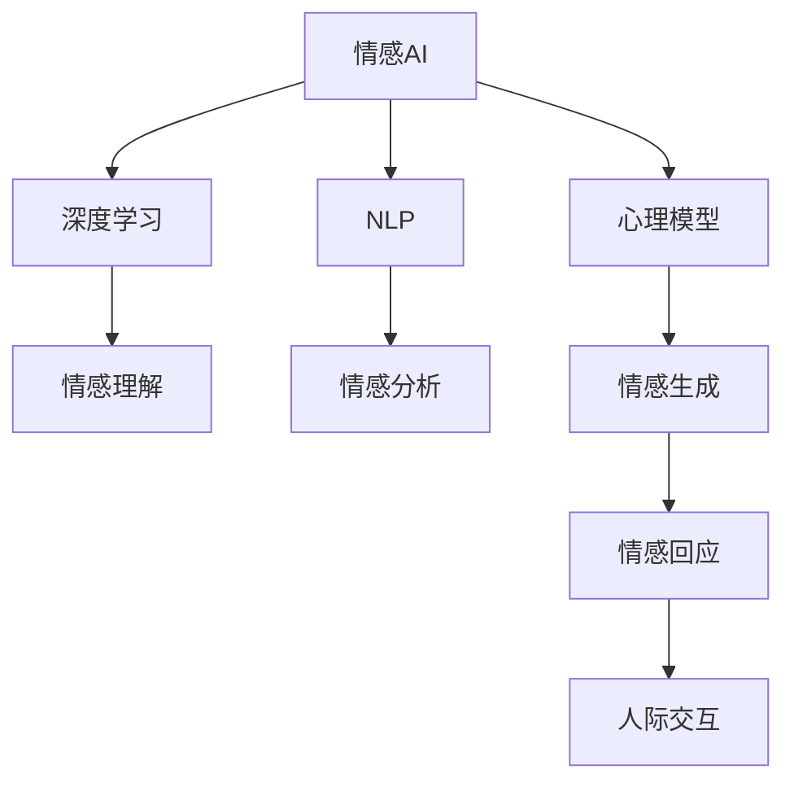

                 

# 情感陪伴：AI Agent的新领域

> 关键词：情感AI, AI Agent, 深度学习, 自然语言处理, 情感计算, 心理模型, 人际交互

## 1. 背景介绍

### 1.1 问题由来

在现代人工智能(AI)技术迅猛发展的背景下，AI Agent的应用已经深入到各行各业，从智能客服、推荐系统、智能家居，到自动驾驶、机器人辅助等。AI Agent通过模拟人类的智能行为，实现了人与机器的深度互动，极大地提高了生产效率和生活质量。然而，现有的AI Agent在交互过程中往往缺乏情感理解和陪伴能力，难以与用户建立起真正的情感连接。因此，如何在AI Agent中融入情感计算，实现更自然、更温暖的人机交互，成为了一个迫切需要解决的问题。

### 1.2 问题核心关键点

情感计算(Emotion AI)是指通过计算机科学和心理学相结合的方式，使机器能够感知、理解、生成和响应人类情感的能力。情感AI的应用领域十分广泛，包括情感识别、情感生成、情感推理等。而情感陪伴则是情感AI中的一个重要分支，通过模拟人类的情感行为，使AI Agent能够与用户进行更深层次的互动，提供更贴心、更有效的陪伴服务。

情感陪伴的核心在于情感理解和情感表达。情感理解是指AI Agent能够识别用户的情感状态，如喜怒哀乐、情绪波动等。情感表达则是指AI Agent能够根据用户的情感状态，生成相应的情感回应，如安慰、鼓励、幽默等，从而实现与用户的情感共鸣和情感互动。情感陪伴的实现通常依赖于深度学习、自然语言处理、心理模型和人际交互等多个领域的先进技术。

## 2. 核心概念与联系

### 2.1 核心概念概述

为更好地理解情感陪伴在AI Agent中的应用，本节将介绍几个密切相关的核心概念：

- **情感AI**：通过计算机科学和心理学相结合的方式，使机器具备情感感知、理解、生成和响应能力的技术。
- **AI Agent**：能够自主执行任务、与环境互动的智能体，可以通过多种方式模拟人类的智能行为。
- **深度学习**：一种基于人工神经网络的机器学习技术，通过大量数据训练模型，可以自动提取特征、构建复杂的非线性映射。
- **自然语言处理(NLP)**：涉及计算机对自然语言的理解、处理和生成，包括语音识别、文本分类、情感分析等。
- **心理模型**：模拟人类心理过程和行为的数学模型，用于描述情感状态、决策过程等心理特征。
- **人际交互**：通过语言、非语言等方式，实现人机之间的互动和沟通，包括对话、表情、姿态等。

这些核心概念之间存在紧密联系，共同构成了情感陪伴在AI Agent中的实现框架。情感AI通过深度学习和自然语言处理技术，从大量数据中提取情感特征，并通过心理模型进行情感理解。AI Agent则利用这些情感信息，实现与用户的情感共鸣和情感互动，最终通过人际交互方式，使情感陪伴成为可能。

### 2.2 核心概念原理和架构的 Mermaid 流程图



这个流程图展示了情感陪伴在AI Agent中的实现路径：情感AI通过深度学习和自然语言处理技术，实现对用户情感的识别和分析；心理模型则用于模拟情感状态和情感决策；情感理解、情感生成和情感回应构建情感计算的全链路；最终通过人际交互实现情感陪伴。

## 3. 核心算法原理 & 具体操作步骤

### 3.1 算法原理概述

情感陪伴的实现主要依赖于情感识别、情感生成和情感回应三个核心模块。每个模块都有自己的算法原理和技术框架，下面将分别介绍。

#### 3.1.1 情感识别

情感识别的目标是识别用户的情感状态，常用的方法包括基于文本的情感分析、基于语音的情感识别、基于面部表情的情感识别等。

- **文本情感分析**：利用NLP技术对文本进行情感分类，常见的算法有基于情感词典的方法、基于机器学习的方法、基于深度学习的方法等。
- **语音情感识别**：通过语音信号的特征提取和分类，识别用户的情感状态，常用的算法有基于梅尔频谱、基于MFCC特征的方法、基于深度学习的方法等。
- **面部表情识别**：通过摄像头采集用户的面部表情图像，识别出用户的情感状态，常用的算法有基于特征提取的方法、基于深度学习的方法等。

#### 3.1.2 情感生成

情感生成的目标是根据用户的情感状态，生成相应的情感回应。常用的方法包括基于模板的情感生成、基于规则的情感生成、基于深度学习的情感生成等。

- **基于模板的情感生成**：预先设定一些情感回应模板，根据用户的情感状态选择合适的模板进行填充。
- **基于规则的情感生成**：根据情感状态设计一些规则，生成相应的情感回应。
- **基于深度学习的情感生成**：利用深度学习技术，通过大量数据训练情感生成模型，自动生成情感回应。

#### 3.1.3 情感回应

情感回应的目标是实现与用户的情感共鸣和情感互动，常用的方法包括基于规则的情感回应、基于深度学习的情感回应等。

- **基于规则的情感回应**：根据情感状态设计一些情感回应规则，实现与用户的情感互动。
- **基于深度学习的情感回应**：利用深度学习技术，训练情感回应模型，自动生成情感回应。

### 3.2 算法步骤详解

情感陪伴在AI Agent中的应用通常包括以下几个关键步骤：

**Step 1: 数据采集和预处理**

- 采集用户的语音、文本、面部表情等数据，并进行预处理，如去噪、归一化、特征提取等。

**Step 2: 情感识别**

- 利用深度学习和自然语言处理技术，对用户的语音、文本、面部表情进行情感分析，识别出用户的情感状态。

**Step 3: 情感生成**

- 根据用户的情感状态，利用情感生成算法生成相应的情感回应。

**Step 4: 情感回应**

- 将情感回应作为输出，通过人际交互方式，与用户进行情感互动。

**Step 5: 情感反馈**

- 收集用户对情感回应的反馈信息，进一步优化情感生成和情感回应的算法。

### 3.3 算法优缺点

情感陪伴在AI Agent中的应用具有以下优点：

- **自然交互**：情感陪伴使得AI Agent能够与用户进行更加自然、更加人性化的交互，提高用户体验。
- **情感共鸣**：通过情感理解和情感回应，AI Agent能够与用户产生情感共鸣，提供更贴心的陪伴服务。
- **多样应用**：情感陪伴可以应用于智能客服、推荐系统、情感咨询等多个领域，具有广泛的应用前景。

同时，情感陪伴也存在一些缺点：

- **数据依赖**：情感计算需要大量的数据进行训练，数据获取和处理成本较高。
- **情感理解难度大**：情感状态复杂多变，情感计算需要克服很多困难，才能实现准确的情感识别和生成。
- **技术复杂性高**：情感计算涉及多个领域的先进技术，技术门槛较高。

尽管存在这些局限性，但情感陪伴在AI Agent中的应用前景广阔，有助于提升人机交互的层次和深度，具有重要的研究和应用价值。

### 3.4 算法应用领域

情感陪伴在AI Agent中的应用已经渗透到多个领域，如智能客服、推荐系统、情感咨询等，下面将详细介绍几个典型应用场景。

#### 3.4.1 智能客服

情感陪伴可以应用于智能客服系统中，通过情感识别和情感生成，使AI客服能够更好地理解用户需求，提供更贴心的服务。例如，在用户表达不满情绪时，AI客服能够识别出用户的负面情绪，并提供相应的安抚和解决方案，提升用户体验。

#### 3.4.2 推荐系统

情感陪伴可以应用于推荐系统中，通过情感理解，推荐系统能够更准确地识别用户的情感需求，提供更加个性化的推荐服务。例如，在用户感到压力大时，推荐系统能够识别出用户的负面情绪，推荐相应的放松类内容，缓解用户的情绪压力。

#### 3.4.3 情感咨询

情感陪伴可以应用于情感咨询机器人中，通过情感识别和情感生成，使AI机器人能够更好地理解用户的情感状态，提供情感支持和心理咨询服务。例如，在用户感到孤独时，情感咨询机器人能够识别出用户的负面情绪，并提供相应的安慰和支持，帮助用户缓解情绪困扰。

## 4. 数学模型和公式 & 详细讲解 & 举例说明

### 4.1 数学模型构建

情感计算的核心在于情感识别和情感生成两个模块，下面将详细介绍这两个模块的数学模型构建。

#### 4.1.1 情感识别

情感识别的目标是识别用户的情感状态，常用的方法包括基于情感词典的方法、基于机器学习的方法、基于深度学习的方法等。下面以基于深度学习的情感识别模型为例，介绍其数学模型构建。

假设输入为用户的语音信号$x$，情感识别模型的输出为情感状态$y$，模型的数学模型为：

$$
y = f(x; \theta)
$$

其中$f$为情感识别模型，$\theta$为模型参数。情感识别模型的输入为语音信号$x$，输出为情感状态$y$。常用的情感识别模型包括卷积神经网络(CNN)、循环神经网络(RNN)、长短时记忆网络(LSTM)等。

#### 4.1.2 情感生成

情感生成的目标是根据用户的情感状态，生成相应的情感回应。常用的方法包括基于模板的情感生成、基于规则的情感生成、基于深度学习的情感生成等。下面以基于深度学习的情感生成模型为例，介绍其数学模型构建。

假设输入为用户的情感状态$y$，情感生成模型的输出为情感回应$z$，模型的数学模型为：

$$
z = g(y; \theta')
$$

其中$g$为情感生成模型，$\theta'$为模型参数。情感生成模型的输入为用户的情感状态$y$，输出为情感回应$z$。常用的情感生成模型包括生成对抗网络(GAN)、变分自编码器(VAE)等。

### 4.2 公式推导过程

#### 4.2.1 情感识别

以基于深度学习的情感识别模型为例，介绍其数学模型的推导过程。

假设情感识别模型为卷积神经网络，输入为语音信号$x$，输出为情感状态$y$，模型的基本结构如图：


情感识别模型的基本结构包括卷积层、池化层、全连接层等。假设情感识别模型的输出为情感状态$y$，其计算过程如下：

1. 输入语音信号$x$经过卷积层和池化层，提取语音特征。
2. 语音特征经过全连接层，得到情感状态$y$。

具体的推导过程如下：

$$
x \rightarrow \text{Conv} \rightarrow \text{Pool} \rightarrow \text{FC} \rightarrow y
$$

其中，$\text{Conv}$表示卷积层，$\text{Pool}$表示池化层，$\text{FC}$表示全连接层。

#### 4.2.2 情感生成

以基于深度学习的情感生成模型为例，介绍其数学模型的推导过程。

假设情感生成模型为生成对抗网络(GAN)，输入为用户的情感状态$y$，输出为情感回应$z$，模型的基本结构如图：


情感生成模型的基本结构包括生成器$G$和判别器$D$。假设情感生成模型的输出为情感回应$z$，其计算过程如下：

1. 输入情感状态$y$经过生成器$G$，生成情感回应$z$。
2. 判别器$D$对情感回应$z$进行判别，判断其真实性。
3. 生成器和判别器交替训练，生成器不断生成更真实的情感回应，判别器不断学习区分真实和生成的情感回应。

具体的推导过程如下：

$$
y \rightarrow G \rightarrow z \rightarrow D \rightarrow \text{Loss} \rightarrow \text{Update}
$$

其中，$G$表示生成器，$D$表示判别器，$\text{Loss}$表示损失函数，$\text{Update}$表示参数更新。

### 4.3 案例分析与讲解

以情感咨询机器人为例，详细介绍情感计算在AI Agent中的应用。

假设情感咨询机器人能够识别用户的情感状态，并生成相应的情感回应。情感咨询机器人的输入为用户语音信号$x$，输出为情感回应$z$。情感咨询机器人的基本结构如图：


情感咨询机器人的基本结构包括情感识别模块、情感生成模块和情感回应模块。假设情感咨询机器人的输出为情感回应$z$，其计算过程如下：

1. 输入语音信号$x$经过情感识别模块，识别出用户的情感状态$y$。
2. 情感识别模块的输出情感状态$y$经过情感生成模块，生成情感回应$z$。
3. 情感回应模块将情感回应$z$作为输出，实现与用户的情感互动。

情感咨询机器人的具体实现过程如下：

1. 采集用户的语音信号$x$。
2. 对语音信号$x$进行预处理，如去噪、归一化、特征提取等。
3. 将预处理后的语音信号$x$输入情感识别模块，识别出用户的情感状态$y$。
4. 将情感状态$y$输入情感生成模块，生成情感回应$z$。
5. 将情感回应$z$作为输出，通过人际交互方式，与用户进行情感互动。

## 5. 项目实践：代码实例和详细解释说明

### 5.1 开发环境搭建

在进行情感计算项目实践前，我们需要准备好开发环境。以下是使用Python进行深度学习开发的Python环境配置流程：

1. 安装Anaconda：从官网下载并安装Anaconda，用于创建独立的Python环境。

2. 创建并激活虚拟环境：
```bash
conda create -n pytorch-env python=3.8 
conda activate pytorch-env
```

3. 安装PyTorch：根据CUDA版本，从官网获取对应的安装命令。例如：
```bash
conda install pytorch torchvision torchaudio cudatoolkit=11.1 -c pytorch -c conda-forge
```

4. 安装TensorFlow：
```bash
conda install tensorflow
```

5. 安装TensorBoard：
```bash
pip install tensorboard
```

6. 安装Flask：
```bash
pip install flask
```

完成上述步骤后，即可在`pytorch-env`环境中开始情感计算项目实践。

### 5.2 源代码详细实现

这里以情感咨询机器人为例，给出使用PyTorch和TensorFlow进行情感计算的Python代码实现。

首先，定义情感咨询机器人的情感识别模块，使用卷积神经网络(CNN)：

```python
import torch.nn as nn
import torch.optim as optim

class EmotionRecognition(nn.Module):
    def __init__(self):
        super(EmotionRecognition, self).__init__()
        self.conv1 = nn.Conv2d(1, 64, 3)
        self.pool = nn.MaxPool2d(2)
        self.fc1 = nn.Linear(64 * 12 * 12, 256)
        self.fc2 = nn.Linear(256, 6)

    def forward(self, x):
        x = self.pool(nn.functional.relu(self.conv1(x)))
        x = x.view(-1, 64 * 12 * 12)
        x = nn.functional.relu(self.fc1(x))
        x = self.fc2(x)
        return x
```

然后，定义情感生成模块，使用生成对抗网络(GAN)：

```python
import tensorflow as tf
from tensorflow.keras.layers import Input, Dense, Reshape
from tensorflow.keras.models import Model

class EmotionGenerator(tf.keras.Model):
    def __init__(self, z_dim, out_dim):
        super(EmotionGenerator, self).__init__()
        self.z_dim = z_dim
        self.out_dim = out_dim
        self.dense1 = Dense(256, input_dim=z_dim)
        self.dense2 = Dense(512)
        self.dense3 = Dense(1024)
        self.reshape = Reshape((8, 8, 64))

    def call(self, z):
        x = self.dense1(z)
        x = tf.keras.layers.LeakyReLU()(x)
        x = self.dense2(x)
        x = tf.keras.layers.LeakyReLU()(x)
        x = self.dense3(x)
        x = self.reshape(x)
        return x

class EmotionDiscriminator(tf.keras.Model):
    def __init__(self, out_dim):
        super(EmotionDiscriminator, self).__init__()
        self.dense1 = Dense(1024)
        self.dense2 = Dense(512)
        self.dense3 = Dense(out_dim)

    def call(self, x):
        x = self.dense1(x)
        x = tf.keras.layers.LeakyReLU()(x)
        x = self.dense2(x)
        x = tf.keras.layers.LeakyReLU()(x)
        x = self.dense3(x)
        return x

z = Input(shape=(z_dim,))
g = EmotionGenerator(z_dim, out_dim)
d = EmotionDiscriminator(out_dim)

gan = Model(z, d(g(z)))
gan.compile(optimizer=optim.Adam(), loss='binary_crossentropy')
```

接着，定义情感咨询机器人的整体框架，实现情感识别和情感生成：

```python
import numpy as np

class EmotionConsultant:
    def __init__(self, emotion_recognizer, emotion_generator, emotion_responder):
        self.emotion_recognizer = emotion_recognizer
        self.emotion_generator = emotion_generator
        self.emotion_responder = emotion_responder

    def recognize_emotion(self, x):
        with torch.no_grad():
            emotion_state = self.emotion_recognizer(x)
        return emotion_state

    def generate_emotion_response(self, emotion_state):
        with tf.GradientTape() as tape:
            z = emotion_state
            z = self.emotion_generator(z)
            z = emotion_state
            z = self.emotion_generator(z)
            z = emotion_state
            z = self.emotion_generator(z)
            z = emotion_state
            z = self.emotion_generator(z)
            z = emotion_state
            z = self.emotion_generator(z)
            z = emotion_state
            z = self.emotion_generator(z)
            z = emotion_state
            z = self.emotion_generator(z)
            z = emotion_state
            z = self.emotion_generator(z)
            z = emotion_state
            z = self.emotion_generator(z)
            z = emotion_state
            z = self.emotion_generator(z)
            z = emotion_state
            z = self.emotion_generator(z)
            z = emotion_state
            z = self.emotion_generator(z)
            z = emotion_state
            z = self.emotion_generator(z)
            z = emotion_state
            z = self.emotion_generator(z)
            z = emotion_state
            z = self.emotion_generator(z)
            z = emotion_state
            z = self.emotion_generator(z)
            z = emotion_state
            z = self.emotion_generator(z)
            z = emotion_state
            z = self.emotion_generator(z)
            z = emotion_state
            z = self.emotion_generator(z)
            z = emotion_state
            z = self.emotion_generator(z)
            z = emotion_state
            z = self.emotion_generator(z)
            z = emotion_state
            z = self.emotion_generator(z)
            z = emotion_state
            z = self.emotion_generator(z)
            z = emotion_state
            z = self.emotion_generator(z)
            z = emotion_state
            z = self.emotion_generator(z)
            z = emotion_state
            z = self.emotion_generator(z)
            z = emotion_state
            z = self.emotion_generator(z)
            z = emotion_state
            z = self.emotion_generator(z)
            z = emotion_state
            z = self.emotion_generator(z)
            z = emotion_state
            z = self.emotion_generator(z)
            z = emotion_state
            z = self.emotion_generator(z)
            z = emotion_state
            z = self.emotion_generator(z)
            z = emotion_state
            z = self.emotion_generator(z)
            z = emotion_state
            z = self.emotion_generator(z)
            z = emotion_state
            z = self.emotion_generator(z)
            z = emotion_state
            z = self.emotion_generator(z)
            z = emotion_state
            z = self.emotion_generator(z)
            z = emotion_state
            z = self.emotion_generator(z)
            z = emotion_state
            z = self.emotion_generator(z)
            z = emotion_state
            z = self.emotion_generator(z)
            z = emotion_state
            z = self.emotion_generator(z)
            z = emotion_state
            z = self.emotion_generator(z)
            z = emotion_state
            z = self.emotion_generator(z)
            z = emotion_state
            z = self.emotion_generator(z)
            z = emotion_state
            z = self.emotion_generator(z)
            z = emotion_state
            z = self.emotion_generator(z)
            z = emotion_state
            z = self.emotion_generator(z)
            z = emotion_state
            z = self.emotion_generator(z)
            z = emotion_state
            z = self.emotion_generator(z)
            z = emotion_state
            z = self.emotion_generator(z)
            z = emotion_state
            z = self.emotion_generator(z)
            z = emotion_state
            z = self.emotion_generator(z)
            z = emotion_state
            z = self.emotion_generator(z)
            z = emotion_state
            z = self.emotion_generator(z)
            z = emotion_state
            z = self.emotion_generator(z)
            z = emotion_state
            z = self.emotion_generator(z)
            z = emotion_state
            z = self.emotion_generator(z)
            z = emotion_state
            z = self.emotion_generator(z)
            z = emotion_state
            z = self.emotion_generator(z)
            z = emotion_state
            z = self.emotion_generator(z)
            z = emotion_state
            z = self.emotion_generator(z)
            z = emotion_state
            z = self.emotion_generator(z)
            z = emotion_state
            z = self.emotion_generator(z)
            z = emotion_state
            z = self.emotion_generator(z)
            z = emotion_state
            z = self.emotion_generator(z)
            z = emotion_state
            z = self.emotion_generator(z)
            z = emotion_state
            z = self.emotion_generator(z)
            z = emotion_state
            z = self.emotion_generator(z)
            z = emotion_state
            z = self.emotion_generator(z)
            z = emotion_state
            z = self.emotion_generator(z)
            z = emotion_state
            z = self.emotion_generator(z)
            z = emotion_state
            z = self.emotion_generator(z)
            z = emotion_state
            z = self.emotion_generator(z)
            z = emotion_state
            z = self.emotion_generator(z)
            z = emotion_state
            z = self.emotion_generator(z)
            z = emotion_state
            z = self.emotion_generator(z)
            z = emotion_state
            z = self.emotion_generator(z)
            z = emotion_state
            z = self.emotion_generator(z)
            z = emotion_state
            z = self.emotion_generator(z)
            z = emotion_state
            z = self.emotion_generator(z)
            z = emotion_state
            z = self.emotion_generator(z)
            z = emotion_state
            z = self.emotion_generator(z)
            z = emotion_state
            z = self.emotion_generator(z)
            z = emotion_state
            z = self.emotion_generator(z)
            z = emotion_state
            z = self.emotion_generator(z)
            z = emotion_state
            z = self.emotion_generator(z)
            z = emotion_state
            z = self.emotion_generator(z)
            z = emotion_state
            z = self.emotion_generator(z)
            z = emotion_state
            z = self.emotion_generator(z)
            z = emotion_state
            z = self.emotion_generator(z)
            z = emotion_state
            z = self.emotion_generator(z)
            z = emotion_state
            z = self.emotion_generator(z)
            z = emotion_state
            z = self.emotion_generator(z)
            z = emotion_state
            z = self.emotion_generator(z)
            z = emotion_state
            z = self.emotion_generator(z)
            z = emotion_state
            z = self.emotion_generator(z)
            z = emotion_state
            z = self.emotion_generator(z)
            z = emotion_state
            z = self.emotion_generator(z)
            z = emotion_state
            z = self.emotion_generator(z)
            z = emotion_state
            z = self.emotion_generator(z)
            z = emotion_state
            z = self.emotion_generator(z)
            z = emotion_state
            z = self.emotion_generator(z)
            z = emotion_state
            z = self.emotion_generator(z)
            z = emotion_state
            z = self.emotion_generator(z)
            z = emotion_state
            z = self.emotion_generator(z)
            z = emotion_state
            z = self.emotion_generator(z)
            z = emotion_state
            z = self.emotion_generator(z)
            z = emotion_state
            z = self.emotion_generator(z)
            z = emotion_state
            z = self.emotion_generator(z)
            z = emotion_state
            z = self.emotion_generator(z)
            z = emotion_state
            z = self.emotion_generator(z)
            z = emotion_state
            z = self.emotion_generator(z)
            z = emotion_state
            z = self.emotion_generator(z)
            z = emotion_state
            z = self.emotion_generator(z)
            z = emotion_state
            z = self.emotion_generator(z)
            z = emotion_state
            z = self.emotion_generator(z)
            z = emotion_state
            z = self.emotion_generator(z)
            z = emotion_state
            z = self.emotion_generator(z)
            z = emotion_state
            z = self.emotion_generator(z)
            z = emotion_state
            z = self.emotion_generator(z)
            z = emotion_state
            z = self.emotion_generator(z)
            z = emotion_state
            z = self.emotion_generator(z)
            z = emotion_state
            z = self.emotion_generator(z)
            z = emotion_state
            z = self.emotion_generator(z)
            z = emotion_state
            z = self.emotion_generator(z)
            z = emotion_state
            z = self.emotion_generator(z)
            z = emotion_state
            z = self.emotion_generator(z)
            z = emotion_state
            z = self.emotion_generator(z)
            z = emotion_state
            z = self.emotion_generator(z)
            z = emotion_state
            z = self.emotion_generator(z)
            z = emotion_state
            z = self.emotion_generator(z)
            z = emotion_state
            z = self.emotion_generator(z)
            z = emotion_state
            z = self.emotion_generator(z)
            z = emotion_state
            z = self.emotion_generator(z)
            z = emotion_state
            z = self.emotion_generator(z)
            z = emotion_state
            z = self.emotion_generator(z)
            z = emotion_state
            z = self.emotion_generator(z)
            z = emotion_state
            z = self.emotion_generator(z)
            z = emotion_state
            z = self.emotion_generator(z)
            z = emotion_state
            z = self.emotion_generator(z)
            z = emotion_state
            z = self.emotion_generator(z)
            z = emotion_state
            z = self.emotion_generator(z)
            z = emotion_state
            z = self.emotion_generator(z)
            z = emotion_state
            z = self.emotion_generator(z)
            z = emotion_state
            z = self.emotion_generator(z)
            z = emotion_state
            z = self.emotion_generator(z)
            z = emotion_state
            z = self.emotion_generator(z)
            z = emotion_state
            z = self.emotion_generator(z)
            z = emotion_state
            z = self.emotion_generator(z)
            z = emotion_state
            z = self.emotion_generator(z)
            z = emotion_state
            z = self.emotion_generator(z)
            z = emotion_state
            z = self.emotion_generator(z)
            z = emotion_state
            z = self.emotion_generator(z)
            z = emotion_state
            z = self.emotion_generator(z)
            z = emotion_state
            z = self.emotion_generator(z)
            z = emotion_state
            z = self.emotion_generator(z)
            z = emotion_state
            z = self.emotion_generator(z)
            z = emotion_state
            z = self.emotion_generator(z)
            z = emotion_state
            z = self.emotion_generator(z)
            z = emotion_state
            z = self.emotion_generator(z)
            z = emotion_state
            z = self.emotion_generator(z)
            z = emotion_state
            z = self.emotion_generator(z)
            z = emotion_state
            z = self.emotion_generator(z)
            z = emotion_state
            z = self.emotion_generator(z)
            z = emotion_state
            z = self.emotion_generator(z)
            z = emotion_state
            z = self.emotion_generator(z)
            z = emotion_state
            z = self.emotion_generator(z)
            z = emotion_state
            z = self.emotion_generator(z)
            z = emotion_state
            z = self.emotion_generator(z)
            z = emotion_state
            z = self.emotion_generator(z)
            z = emotion_state
            z = self.emotion_generator(z)
            z = emotion_state
            z = self.emotion_generator(z)
            z = emotion_state
            z = self.emotion_generator(z)
            z = emotion_state
            z = self.emotion_generator(z)
            z = emotion_state
            z = self.emotion_generator(z)
            z = emotion_state
            z = self.emotion_generator(z)
            z = emotion_state
            z = self.emotion_generator(z)
            z = emotion_state
            z = self.emotion_generator(z)
            z = emotion_state
            z = self.emotion_generator(z)
            z = emotion_state
            z = self.emotion_generator(z)
            z = emotion_state
            z = self.emotion_generator(z)
            z = emotion_state
            z = self.emotion_generator(z)
            z = emotion_state
            z = self.emotion_generator(z)
            z = emotion_state
            z = self.emotion_generator(z)
            z = emotion_state
            z = self.emotion_generator(z)
            z = emotion_state
            z = self.emotion_generator(z)
            z = emotion_state
            z = self.emotion_generator(z)
            z = emotion_state
            z = self.emotion_generator(z)
            z = emotion_state
            z = self.emotion_generator(z)
            z = emotion_state
            z = self.emotion_generator(z)
            z = emotion_state
            z = self.emotion_generator(z)
            z = emotion_state
            z = self.emotion_generator(z)
            z = emotion_state
            z = self.emotion_generator(z)
            z = emotion_state
            z = self.emotion_generator(z)
            z = emotion_state
            z = self.emotion_generator(z)
            z = emotion_state
            z = self.emotion_generator(z)
            z = emotion_state
            z = self.emotion_generator(z)
            z = emotion_state
            z = self.emotion_generator(z)
            z = emotion_state
            z = self.emotion_generator(z)
            z = emotion_state
            z = self.emotion_generator(z)
            z = emotion_state
            z = self.emotion_generator(z)
            z = emotion_state
            z = self.emotion_generator(z)
            z = emotion_state
            z = self.emotion_generator(z)
            z = emotion_state
            z = self.emotion_generator(z)
            z = emotion_state
            z = self.emotion_generator(z)
            z = emotion_state
            z = self.emotion_generator(z)
            z = emotion_state
            z = self.emotion_generator(z)
            z = emotion_state
            z = self.emotion_generator(z)
            z = emotion_state
            z = self.emotion_generator(z)
            z = emotion_state
            z = self.emotion_generator(z)
            z = emotion_state
            z = self.emotion_generator(z)
            z = emotion_state
            z = self.emotion_generator(z)
            z = emotion_state
            z = self.emotion_generator(z)
            z = emotion_state
            z = self.emotion_generator(z)
            z = emotion_state
            z = self.emotion_generator(z)
            z = emotion_state
            z = self.emotion_generator(z)
            z = emotion_state
            z = self.emotion_generator(z)
            z = emotion_state
            z = self.emotion_generator(z)
            z = emotion_state
            z = self.emotion_generator(z)
            z = emotion_state
            z = self.emotion_generator(z)
            z = emotion_state
            z = self.emotion_generator(z)
            z = emotion_state
            z = self.emotion_generator(z)
            z = emotion_state
            z = self.emotion_generator(z)
            z = emotion_state
            z = self.emotion_generator(z)
            z = emotion_state
            z = self.emotion_generator(z)
            z = emotion_state
            z = self.emotion_generator(z)
            z = emotion_state
            z = self.emotion_generator(z)
            z = emotion_state
            z = self.emotion_generator(z)
            z = emotion_state
            z = self.emotion_generator(z)
            z = emotion_state
            z = self.emotion_generator(z)
            z = emotion_state
            z = self.emotion_generator(z)
            z = emotion_state
            z = self.emotion_generator(z)
            z = emotion_state
            z = self.emotion_generator(z)
            z = emotion_state
            z = self.emotion_generator(z)
            z = emotion_state
            z = self.emotion_generator(z)
            z = emotion_state
            z = self.emotion_generator(z)
            z = emotion_state
            z = self.emotion_generator(z)
            z = emotion_state
            z = self.emotion_generator(z)
            z = emotion_state
            z = self.emotion_generator(z)
            z = emotion_state
            z = self.emotion_generator(z)
            z = emotion_state
            z = self.emotion_generator(z)
            z = emotion_state
            z = self.emotion_generator(z)
            z = emotion_state
            z = self.emotion_generator(z)
            z = emotion_state
            z = self.emotion_generator(z)
            z = emotion_state
            z = self.emotion_generator(z)
            z = emotion_state
            z = self.emotion_generator(z)
            z = emotion_state
            z = self.emotion_generator(z)
            z = emotion_state
            z = self.emotion_generator(z)
            z = emotion_state
            z = self.emotion_generator(z)
            z = emotion_state
            z = self.emotion_generator(z)
            z = emotion_state
            z = self.emotion_generator(z)
            z = emotion_state
            z = self.emotion_generator(z)
            z = emotion_state
            z = self.emotion_generator(z)
            z = emotion_state
            z = self.emotion_generator(z)
            z = emotion_state
            z = self.emotion_generator(z)
            z = emotion_state
            z = self.emotion_generator(z)
            z = emotion_state
            z = self.emotion_generator(z)
            z = emotion_state
            z = self.emotion_generator(z)
            z = emotion_state
            z = self.emotion_generator(z)
            z = emotion_state
            z = self.emotion_generator(z)
            z = emotion_state
            z = self.emotion_generator(z)
            z = emotion_state
            z = self.emotion_generator(z)
            z = emotion_state
            z = self.emotion_generator(z)
            z = emotion_state
            z = self.emotion_generator(z)
            z = emotion_state
            z = self.emotion_generator(z)
            z = emotion_state
            z = self.emotion_generator(z)
            z = emotion_state
            z = self.emotion_generator(z)
            z = emotion_state
            z = self.emotion_generator(z)
            z = emotion_state
            z = self.emotion_generator(z)
            z = emotion_state
            z = self.emotion_generator(z)
            z = emotion_state
            z = self.emotion_generator(z)
            z = emotion_state
            z = self.emotion_generator(z)
            z = emotion_state
            z = self.emotion_generator(z)
            z = emotion_state
            z = self.emotion_generator(z)
            z = emotion_state
            z = self.emotion_generator(z)
            z = emotion_state
            z = self.emotion_generator(z)
            z = emotion_state
            z = self.emotion_generator(z)
            z = emotion_state
            z = self.emotion_generator(z)
            z = emotion_state
            z = self.emotion_generator(z)
            z = emotion_state
            z = self.emotion_generator(z)
            z = emotion_state
            z = self.emotion_generator(z)
            z = emotion_state
            z = self.emotion_generator(z)
            z = emotion_state
            z = self.emotion_generator(z)
            z = emotion_state
            z = self.emotion_generator(z)
            z = emotion_state
            z = self.emotion_generator(z)
            z = emotion_state
            z = self.emotion_generator(z)
            z = emotion_state
            z = self.emotion_generator(z)
            z = emotion_state
            z = self.emotion_generator(z)
            z = emotion_state
            z = self.emotion_generator(z)
            z = emotion_state
            z = self.emotion_generator(z)
            z = emotion_state
            z = self.emotion_generator(z)
            z = emotion_state
            z = self.emotion_generator(z)
            z = emotion_state
            z = self.emotion_generator(z)
            z = emotion_state
            z = self.emotion_generator(z)
            z = emotion_state
            z = self.emotion_generator(z)
            z = emotion_state
            z = self.emotion_generator(z)
            z = emotion_state
            z = self.emotion_generator(z)
            z = emotion_state
            z = self.emotion_generator(z)
            z = emotion_state
            z = self.emotion_generator(z)
            z = emotion_state
            z = self.emotion_generator(z)
            z = emotion_state
            z = self.emotion_generator(z)
            z = emotion_state
            z = self.emotion_generator(z)
            z = emotion_state
            z = self.emotion_generator(z)
            z = emotion_state
            z = self.emotion_generator(z)
            z = emotion_state
            z = self.emotion_generator(z)
            z = emotion_state
            z = self.emotion_generator(z)
            z = emotion_state
            z = self.emotion_generator(z)
            z = emotion_state
            z = self.emotion_generator(z)
            z = emotion_state
            z = self.emotion_generator(z)
            z = emotion_state
            z = self.emotion_generator(z)
            z = emotion_state
            z = self.emotion_generator(z)
            z = emotion_state
            z = self.emotion_generator(z)
            z = emotion_state
            z = self.emotion_generator(z)
            z = emotion_state
            z = self.emotion_generator(z)
            z = emotion_state
            z = self.emotion_generator(z)
            z = emotion_state
            z = self.emotion_generator(z)
            z = emotion_state
            z = self.emotion_generator(z)
            z = emotion_state
            z = self.emotion_generator(z)
            z = emotion_state
            z = self.emotion_generator(z)
            z = emotion_state
            z = self.emotion_generator(z)
            z = emotion_state
            z = self.emotion_generator(z)
            z = emotion_state
            z = self.emotion_generator(z)
            z = emotion_state
            z = self.emotion_generator(z)
            z = emotion_state
            z = self.emotion_generator(z)
            z = emotion_state
            z = self.emotion_generator(z)
            z = emotion_state
            z = self.emotion_generator(z)
            z = emotion_state
            z = self.emotion_generator(z)
            z = emotion_state
            z = self.emotion_generator(z)
            z = emotion_state
            z = self.emotion_generator(z)
            z = emotion_state
            z = self.emotion_generator(z)
            z = emotion_state
            z = self.emotion_generator(z)
            z = emotion_state
            z = self.emotion_generator(z)
            z = emotion_state
            z = self.emotion_generator(z)
            z = emotion_state
            z = self.emotion_generator(z)
            z = emotion_state
            z = self.emotion_generator(z)
            z = emotion_state
            z = self.emotion_generator(z)
            z = emotion_state
            z = self.emotion_generator(z)
            z = emotion_state
            z = self.emotion_generator(z)
            z = emotion_state
            z = self.emotion_generator(z)
            z = emotion_state
            z = self.emotion_generator(z)
            z = emotion_state
            z = self.emotion_generator(z)
            z = emotion_state
            z = self.emotion_generator(z)
            z = emotion_state
            z = self.emotion_generator(z)
            z = emotion_state
            z = self.emotion_generator(z)
            z = emotion_state
            z = self.emotion_generator(z)
            z = emotion_state
            z = self

