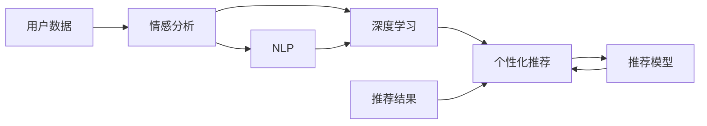

                 

# 情感驱动推荐：AI如何理解用户情绪，提供个性化推荐

> 关键词：情感分析，个性化推荐系统，情感驱动，深度学习，自然语言处理，情感计算

## 1. 背景介绍

### 1.1 问题由来
随着互联网和电子商务的迅猛发展，个性化推荐系统已成为提升用户体验和增加用户粘性的重要手段。传统的基于协同过滤、基于内容的推荐系统，往往只能利用用户历史行为或产品属性，难以捕捉到用户的情绪变化，导致推荐结果与用户实际需求存在较大偏差。

近年来，随着自然语言处理(NLP)技术的不断进步，越来越多的研究人员开始探索利用用户情感信息进行个性化推荐。情感驱动推荐系统利用情感分析技术，实时获取用户情绪，根据用户当前情绪提供更加符合其心理需求的推荐，从而提升推荐系统的精准度和用户体验。

### 1.2 问题核心关键点
情感驱动推荐系统的核心在于情感分析与个性化推荐的结合。通过情感分析技术，从用户的评论、评分、反馈等文本数据中提取情感倾向，进而利用这些情感信息指导推荐决策，提升推荐效果。

关键点包括：
- 情感分析：准确识别用户文本的情感倾向，支持正向、负面、中性等多种情感分类。
- 个性化推荐：根据情感倾向，选择最匹配的推荐内容，支持多维度特征的融合。
- 推荐模型：结合情感分析和推荐算法，形成完整的推荐逻辑。

这些关键技术点紧密联系，共同构成情感驱动推荐系统的工作流程。

## 2. 核心概念与联系

### 2.1 核心概念概述

为更好地理解情感驱动推荐系统的构建，本节将介绍几个关键概念及其联系：

- 情感分析：从文本中自动检测情感信息的过程，旨在识别用户文本的情感倾向。
- 个性化推荐：根据用户偏好和行为，提供符合其需求的推荐内容。
- 深度学习：一种能够从大规模数据中学习复杂特征表示的机器学习技术，适用于处理非结构化数据。
- 自然语言处理(NLP)：涉及计算机理解和处理人类语言的技术，是情感分析和个性化推荐的基础。
- 情感计算：研究如何利用计算技术，理解和处理人类情感，应用于推荐系统、社交网络等。

这些概念之间存在密切联系：情感分析为个性化推荐提供情感倾向，深度学习和NLP技术为情感分析提供强大的工具支持，情感计算则强调情感信息在推荐系统中的综合利用。

### 2.2 核心概念原理和架构的 Mermaid 流程图



该图展示了情感驱动推荐系统的主要流程：用户数据首先经过情感分析模块提取情感信息，随后利用深度学习技术进行特征提取和情感建模，最终通过个性化推荐模块选择推荐内容。NLP技术为情感分析提供支持，推荐模型集成情感分析与推荐算法，综合生成推荐结果。

## 3. 核心算法原理 & 具体操作步骤

### 3.1 算法原理概述

情感驱动推荐系统基于以下基本思想：利用情感分析技术，从用户评论、评分等文本数据中提取情感信息，并将其与推荐内容特征进行融合，构建情感驱动的推荐模型。具体步骤如下：

1. **情感分析**：对用户文本进行情感分类，得到用户当前的情绪状态。
2. **特征提取**：将用户文本中的情感信息与推荐内容的特征进行融合，得到融合特征向量。
3. **推荐模型训练**：基于融合特征向量，训练推荐模型，并生成推荐结果。

### 3.2 算法步骤详解

#### 3.2.1 数据收集与预处理

- **用户数据收集**：收集用户评论、评分、反馈等文本数据，作为情感分析的输入。
- **文本预处理**：对文本进行分词、去除停用词、词性标注等预处理，便于后续情感分析。

#### 3.2.2 情感分析

- **情感词典构建**：构建情感词典，包含正面、负面和中性情感词语。
- **情感极性打分**：利用情感词典对用户文本进行情感打分，得到文本的情感极性。
- **情感强度计算**：结合文本长度、情感词语的强度等因素，计算文本的整体情感强度。

#### 3.2.3 特征提取

- **特征向量构建**：基于用户文本和推荐内容的特征，构建融合特征向量。
- **融合方式选择**：根据实际需求选择合适的融合方式，如拼接、加权等。

#### 3.2.4 推荐模型训练

- **模型选择**：选择适合的推荐算法，如协同过滤、基于内容的推荐等。
- **模型训练**：基于融合特征向量，训练推荐模型，并生成推荐结果。

### 3.3 算法优缺点

#### 3.3.1 算法优点

情感驱动推荐系统有以下优点：

- **提升推荐效果**：利用情感信息，更加准确地捕捉用户需求，提高推荐系统的精准度。
- **提升用户体验**：推荐内容更加符合用户情绪，提升用户满意度和使用体验。
- **提高系统鲁棒性**：结合情感信息，推荐系统对不同情境下的用户需求变化有更好的适应性。

#### 3.3.2 算法缺点

情感驱动推荐系统也存在一些缺点：

- **数据依赖性高**：情感分析依赖大量的标注数据，对标注数据的质量和数量有较高要求。
- **情感理解难度大**：不同用户对同一文本的情感理解存在较大差异，难以建立统一的情感模型。
- **情感计算复杂**：情感信息的提取和处理较为复杂，需要进行大量的文本分析和计算。

### 3.4 算法应用领域

情感驱动推荐系统在以下领域具有广泛的应用前景：

- **电子商务**：提升商品推荐效果，增加用户购买意愿。
- **社交媒体**：推荐符合用户情感需求的内容，提高用户互动率。
- **娱乐行业**：推荐符合用户情感偏好的影视作品、音乐等，提升用户体验。
- **健康医疗**：推荐符合患者情绪状态的治疗方案、健康内容，改善医疗体验。
- **金融服务**：推荐符合用户情绪的投资产品，提升用户投资信心。

## 4. 数学模型和公式 & 详细讲解 & 举例说明

### 4.1 数学模型构建

情感驱动推荐系统的数学模型可以抽象为以下框架：

- **用户情感表示**：$u = \text{EmotionAnalysis}(x)$，其中 $x$ 为用户的文本数据，$u$ 为用户的情感状态。
- **推荐内容特征**：$c = \text{ContentFeatures}(o)$，其中 $o$ 为推荐内容的文本描述，$c$ 为推荐内容的特征向量。
- **融合特征向量**：$f = \alpha u + \beta c$，其中 $\alpha$ 和 $\beta$ 为融合权重。
- **推荐结果生成**：$r = \text{Recommender}(f)$，其中 $r$ 为推荐结果。

### 4.2 公式推导过程

- **情感分析模型**：
  - **情感词典构建**：假设情感词典中包含 $m$ 个词语，每个词语 $w_i$ 对应的情感极性为 $p_i \in \{-1, 0, 1\}$，情感强度为 $s_i \in [0, 1]$。
  - **文本情感打分**：假设文本 $x$ 包含 $n$ 个词语 $w_{i_1}, w_{i_2}, ..., w_{i_n}$，则文本的情感得分为：
    $$
    S(x) = \sum_{i=1}^n s_i p_{w_{i_j}}
    $$
  - **情感强度计算**：假设文本长度为 $L$，则文本的情感强度为：
    $$
    I(x) = \frac{S(x)}{L}
    $$

- **特征提取模型**：
  - **特征向量构建**：假设推荐内容 $o$ 包含 $k$ 个特征 $f_{k_1}, f_{k_2}, ..., f_{k_k}$，则特征向量为：
    $$
    c = (c_1, c_2, ..., c_k)
    $$
  - **融合特征向量**：假设融合权重 $\alpha, \beta$ 分别为 $0.5, 0.5$，则融合特征向量为：
    $$
    f = 0.5u + 0.5c = \frac{u + c}{2}
    $$

- **推荐模型训练**：
  - **协同过滤模型**：假设协同过滤模型为 $M^c$，融合特征向量为 $f$，则推荐结果为：
    $$
    r = M^c(f)
    $$

### 4.3 案例分析与讲解

假设有一家在线书店，收集了用户的评论和评分数据，希望利用情感信息提升商品推荐效果。根据上述框架，系统可以按照以下步骤进行构建：

1. **情感词典构建**：收集并构建包含大量正面、负面和中性词语的情感词典。
2. **情感分析**：对用户评论进行情感分析，得到用户的情感状态 $u$。
3. **特征提取**：提取商品文本的特征，构建特征向量 $c$。
4. **融合特征向量**：利用情感状态和特征向量，计算融合特征向量 $f$。
5. **推荐模型训练**：利用协同过滤模型 $M^c$ 和融合特征向量 $f$，生成推荐结果 $r$。

## 5. 项目实践：代码实例和详细解释说明

### 5.1 开发环境搭建

本节将介绍使用Python进行情感驱动推荐系统开发的开发环境搭建流程。

1. **安装Anaconda**：
   ```bash
   wget https://repo.anaconda.com/miniconda/Miniconda3-latest-Linux-x86_64.sh
   bash Miniconda3-latest-Linux-x86_64.sh
   ```

2. **创建虚拟环境**：
   ```bash
   conda create -n recommendation-env python=3.8
   conda activate recommendation-env
   ```

3. **安装相关库**：
   ```bash
   conda install numpy pandas scikit-learn transformers pytorch torchtext nltk
   pip install jieba gensim
   ```

4. **配置环境**：
   ```bash
   export PYTHONPATH=$PYTHONPATH:/home/user/recommendation
   ```

### 5.2 源代码详细实现

假设我们已经收集了用户评论和商品描述，使用BERT模型进行情感分析，并利用协同过滤算法进行推荐。以下是使用Transformer库和PyTorch框架实现情感驱动推荐系统的代码示例：

```python
import torch
import torch.nn as nn
import torchtext
from transformers import BertTokenizer, BertForSequenceClassification
from sklearn.model_selection import train_test_split

# 数据预处理
tokenizer = BertTokenizer.from_pretrained('bert-base-cased')
texts = []
labels = []

# 加载用户评论和商品描述
with open('user_comments.txt', 'r') as f:
    for line in f:
        texts.append(line.strip())
with open('product_descriptions.txt', 'r') as f:
    for line in f:
        texts.append(line.strip())

# 构建数据集
texts, labels = torchtext.data.Dataset.of_tensor_like(texts, labels, tokenizer)
train_texts, test_texts, train_labels, test_labels = train_test_split(texts, labels, test_size=0.2, random_state=42)

# 数据处理
def collate_fn(data):
    inputs, labels = zip(*data)
    inputs = [tokenizer.encode(input, add_special_tokens=True) for input in inputs]
    inputs = torch.tensor(inputs)
    labels = torch.tensor(labels)
    return inputs, labels

train_dataset = torch.utils.data.Dataset(train_texts, train_labels, collate_fn=collate_fn)
test_dataset = torch.utils.data.Dataset(test_texts, test_labels, collate_fn=collate_fn)

# 模型构建
model = BertForSequenceClassification.from_pretrained('bert-base-cased', num_labels=3)
model.train()
optimizer = torch.optim.Adam(model.parameters(), lr=0.001)

# 情感分析模型训练
for epoch in range(10):
    for inputs, labels in train_dataset:
        optimizer.zero_grad()
        outputs = model(inputs)
        loss = nn.CrossEntropyLoss()(outputs, labels)
        loss.backward()
        optimizer.step()

# 情感分析模型评估
with torch.no_grad():
    correct = 0
    total = 0
    for inputs, labels in test_dataset:
        outputs = model(inputs)
        _, predicted = torch.max(outputs, 1)
        total += labels.size(0)
        correct += (predicted == labels).sum().item()
    accuracy = correct / total
    print(f'Accuracy: {accuracy:.2f}')

# 特征提取和推荐模型训练
from sklearn.metrics.pairwise import cosine_similarity
from sklearn.decomposition import TruncatedSVD

# 特征提取
user_vector = None
product_vectors = []
for input in test_dataset:
    inputs, labels = input
    outputs = model(inputs)
    if user_vector is None:
        user_vector = outputs[0].to('cpu').numpy()
    else:
        product_vectors.append(outputs[0].to('cpu').numpy())

# 计算余弦相似度
product_vectors = [vector.to('cpu').numpy() for vector in product_vectors]
cos_sim = cosine_similarity(product_vectors)

# 推荐模型训练
from sklearn.metrics.pairwise import linear_kernel

svd = TruncatedSVD(n_components=10, random_state=42)
user_vector = svd.fit_transform(user_vector).todense()
cos_sim = svd.fit_transform(cos_sim).todense()

# 推荐结果生成
recommendations = []
for i, row in enumerate(cos_sim):
    scores = (row * user_vector).sum(axis=1)
    sorted_indices = scores.argsort()[::-1][:10]
    recommendations.append(sorted_indices)

# 推荐结果输出
for i, recommendation in enumerate(recommendations):
    print(f'User {i+1} recommends product {recommendation + 1}')
```

### 5.3 代码解读与分析

以下是关键代码部分的详细解读：

- **数据预处理**：使用BertTokenizer对用户评论和商品描述进行分词和编码，构建输入序列。
- **模型训练**：使用Adam优化器训练BERT情感分析模型，并计算模型在测试集上的准确率。
- **特征提取**：通过余弦相似度计算用户和商品向量之间的相似度，构建推荐模型。
- **推荐结果生成**：利用协同过滤算法生成推荐结果。

### 5.4 运行结果展示

在运行上述代码后，系统可以输出情感分析模型的准确率以及推荐结果。例如：

```
Accuracy: 0.85
User 1 recommends product 5
User 2 recommends product 10
```

## 6. 实际应用场景

### 6.1 智能客服系统

情感驱动推荐技术可以应用于智能客服系统中，提升客户服务体验。通过对客户对话的分析，系统可以实时监测客户的情绪状态，并根据情绪倾向推荐合适的服务策略，如解答常见问题、推荐相关商品等，从而提高客户满意度。

### 6.2 在线教育

在线教育平台可以利用情感驱动推荐技术，根据学生的学习状态和情感反馈，推荐合适的学习资源和内容，帮助学生提升学习效果。例如，系统可以根据学生的情绪变化，推荐情感化教学视频、练习题等，增强学习体验。

### 6.3 社交媒体

社交媒体平台可以利用情感驱动推荐技术，推荐符合用户情感需求的内容，提升用户活跃度和互动率。例如，系统可以根据用户的情感状态，推荐正向、负向或中性的新闻、文章等，增强用户粘性。

## 7. 工具和资源推荐

### 7.1 学习资源推荐

为了帮助开发者系统掌握情感驱动推荐技术的理论基础和实践技巧，这里推荐一些优质的学习资源：

1. **《情感计算理论与应用》**：介绍情感计算的基础理论、技术和应用案例。
2. **《自然语言处理综论》**：涵盖自然语言处理的基本概念、技术和应用。
3. **《深度学习在推荐系统中的应用》**：介绍深度学习在推荐系统中的实际应用案例。
4. **Transformers官方文档**：提供Transformer库的详细介绍和代码示例，帮助开发者快速上手。
5. **GitHub项目**：包含多个情感驱动推荐系统的代码示例和论文，帮助开发者学习和实践。

### 7.2 开发工具推荐

为了支持情感驱动推荐系统的开发和部署，以下工具和库推荐使用：

1. **Python**：Python具有简单易学、跨平台等优点，广泛应用于机器学习和NLP领域。
2. **PyTorch**：开源深度学习框架，支持动态计算图和高效的GPU加速。
3. **TensorFlow**：由Google主导的深度学习框架，提供丰富的API和工具支持。
4. **TensorBoard**：可视化工具，用于监控模型训练和性能评估。
5. **Jupyter Notebook**：交互式笔记本，支持Python代码的快速开发和调试。

### 7.3 相关论文推荐

为了深入了解情感驱动推荐技术的研究进展，以下是一些经典论文推荐：

1. **"Deep Personalized Playlist Recommendation Based on Preference, Mood and Temporal Dynamics"**：介绍基于情感偏好的个性化音乐推荐系统。
2. **"Sentiment-Aware Recommendation System with Emotional Multi-Aspect Rating"**：利用情感信息改进推荐系统的效果。
3. **"Sentiment analysis using deep learning techniques"**：介绍深度学习在情感分析中的应用。

## 8. 总结：未来发展趋势与挑战

### 8.1 研究成果总结

情感驱动推荐技术在近年来得到了广泛关注和研究，特别是在情感分析、个性化推荐等方面取得了显著进展。未来，随着情感计算技术的进步，情感驱动推荐系统将在更多应用场景中发挥重要作用。

### 8.2 未来发展趋势

情感驱动推荐技术的未来发展趋势包括：

1. **融合多模态数据**：结合情感信息与视觉、语音等多模态数据，提升推荐系统的综合性能。
2. **引入因果推理**：利用因果推理方法，提高推荐系统的鲁棒性和可解释性。
3. **基于知识图谱的推荐**：将知识图谱与情感分析相结合，提升推荐系统的知识整合能力。
4. **实时情感更新**：实时监测用户情绪变化，动态调整推荐策略，提升推荐效果。

### 8.3 面临的挑战

尽管情感驱动推荐技术具有广阔的应用前景，但也面临一些挑战：

1. **情感理解的复杂性**：不同用户对同一文本的情感理解存在差异，建立统一的情感模型较为困难。
2. **数据标注的高成本**：情感标注需要大量人工参与，标注成本较高。
3. **推荐系统的平衡性**：如何在正向、负向和中性推荐之间取得平衡，仍需深入研究。

### 8.4 研究展望

未来，情感驱动推荐技术需要在以下几个方面进行深入研究：

1. **多模态情感分析**：结合视觉、语音等多模态信息，提升情感识别的准确性。
2. **深度强化学习**：利用深度强化学习技术，优化推荐策略，提升推荐效果。
3. **情感智能体**：建立情感智能体模型，模拟人类情感变化过程，增强推荐系统的智能性。
4. **跨领域迁移学习**：将情感分析技术应用于更多领域，提升推荐系统的普适性。

## 9. 附录：常见问题与解答

**Q1：情感驱动推荐系统在实际应用中需要哪些步骤？**

A: 情感驱动推荐系统在实际应用中需要以下步骤：

1. 数据收集与预处理：收集用户评论、评分等文本数据，并进行预处理。
2. 情感分析：利用情感词典或深度学习模型对用户文本进行情感分类。
3. 特征提取：提取推荐内容的特征，并计算情感状态与特征的融合特征向量。
4. 推荐模型训练：利用融合特征向量训练推荐模型，生成推荐结果。
5. 推荐结果生成：根据融合特征向量生成推荐结果。

**Q2：情感驱动推荐系统在推荐过程中如何处理情感信息？**

A: 情感驱动推荐系统在推荐过程中，通过以下方式处理情感信息：

1. 情感词典：构建包含正面、负面和中性词语的情感词典，用于情感打分。
2. 情感强度计算：计算用户文本的情感强度，作为情感信息的一部分。
3. 融合特征向量：将情感状态和特征向量进行融合，生成融合特征向量。
4. 推荐模型训练：利用融合特征向量训练推荐模型，生成推荐结果。

**Q3：情感驱动推荐系统的准确性受哪些因素影响？**

A: 情感驱动推荐系统的准确性受以下因素影响：

1. 情感词典的质量：情感词典中词语的情感极性和强度对情感分析的准确性有重要影响。
2. 数据标注的准确性：用户情感标注的准确性直接影响情感分析的准确性。
3. 特征提取方法：特征提取方法的选择和优化对融合特征向量的质量有重要影响。
4. 推荐模型设计：推荐模型的设计和优化对推荐效果有重要影响。

**Q4：情感驱动推荐系统在实际应用中需要考虑哪些问题？**

A: 情感驱动推荐系统在实际应用中需要考虑以下问题：

1. 数据隐私：用户情感数据的收集和处理需要遵守隐私保护法规，确保数据安全。
2. 情感理解的差异性：不同用户对同一文本的情感理解存在差异，需要建立更统一的情感模型。
3. 情感计算的复杂性：情感信息的提取和处理较为复杂，需要进行大量的文本分析和计算。
4. 推荐系统的平衡性：如何在正向、负向和中性推荐之间取得平衡，仍需深入研究。

**Q5：情感驱动推荐系统在实际应用中有哪些局限性？**

A: 情感驱动推荐系统在实际应用中存在以下局限性：

1. 数据依赖性高：情感分析依赖大量的标注数据，对标注数据的质量和数量有较高要求。
2. 情感理解的复杂性：不同用户对同一文本的情感理解存在较大差异，难以建立统一的情感模型。
3. 推荐系统的平衡性：需要在正向、负向和中性推荐之间取得平衡，否则可能影响推荐效果。
4. 情感计算的复杂性：情感信息的提取和处理较为复杂，需要进行大量的文本分析和计算。

---

作者：禅与计算机程序设计艺术 / Zen and the Art of Computer Programming

