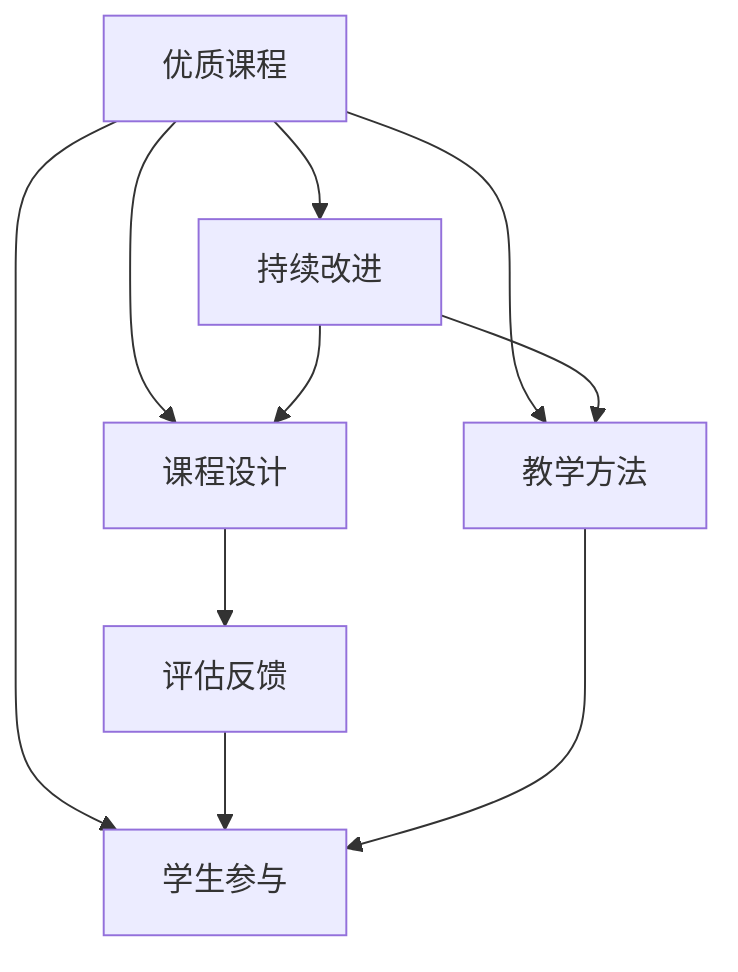

                 

# 打造优质课程的核心要素

> 关键词：优质课程,教育技术,课程设计,教学方法,学生参与,评估反馈,持续改进,在线教育,混合教学

## 1. 背景介绍

在快速发展的数字时代，教育技术正逐渐成为全球教育系统的关键组成部分。高质量的教育内容是提升学习效果的关键。然而，高质量课程的构建并非易事，它不仅要求教师具备深厚的专业知识和教学经验，更需要系统地了解并运用有效的课程设计原则和教学方法。因此，本文旨在探讨打造优质课程的核心要素，帮助教育者设计和实施更加高效和吸引人的学习体验。

### 1.1 问题由来

随着远程在线教育的兴起，学生对课程的要求日益增高。传统的面对面教学方式已难以满足日益增长的个性化学习需求。同时，教育资源的获取也变得更加多元化和碎片化。因此，高质量课程的设计不仅是教育者的责任，更是整个教育生态系统需要共同努力的方向。

### 1.2 问题核心关键点

为了构建优质课程，教育者需关注以下几个核心关键点：

- **课程内容的设计**：应结合学生的认知能力和兴趣，设计既有深度又有广度的课程内容。
- **教学方法的选择**：应根据课程特点和学生特点，灵活运用多种教学方法，如翻转课堂、项目导向学习等。
- **学生的参与和互动**：应通过各种方式激发学生的主动参与，如小组讨论、在线互动等。
- **评估和反馈机制**：应建立科学的评估体系，并及时反馈给学生，帮助其改进学习。
- **持续改进和优化**：应根据学生的反馈和教学效果不断调整和优化课程内容和方法。

本文将围绕这些关键点，深入探讨打造优质课程的核心要素。

## 2. 核心概念与联系

### 2.1 核心概念概述

为了更好地理解优质课程的核心要素，我们首先介绍几个核心概念及其相互之间的联系：

- **优质课程**：指能够有效激发学生学习兴趣，提升其认知能力和实践能力，满足学生个性化需求的课程。
- **课程设计**：指基于一定的教学理念，系统规划课程的目标、内容、结构和实施方式的过程。
- **教学方法**：指在教学过程中，为了达成教学目标而采用的具体方式，如讲授法、实验法、探究法等。
- **学生参与**：指学生在教学过程中主动参与的程度，包括课堂互动、自主学习、小组合作等。
- **评估反馈**：指通过各种手段，如考试、测验、课堂观察等，对学生学习效果进行评估，并及时反馈给学生。
- **持续改进**：指根据评估反馈和教学效果，不断调整和优化课程设计，提升教学质量。

这些概念之间的逻辑关系可以通过以下Mermaid流程图来展示：



这个流程图展示出优质课程的构建过程是一个循环迭代、不断优化的系统工程，需要综合运用课程设计、教学方法、学生参与、评估反馈和持续改进等核心要素，共同作用。

## 3. 核心算法原理 & 具体操作步骤

### 3.1 算法原理概述

优质课程的打造，本质上是一个基于教育心理学、课程理论的教学设计过程。其核心算法原理包括：

- **需求分析**：通过调研和分析，了解学生的基本需求和学习风格。
- **目标设定**：根据需求分析结果，明确课程的教学目标和预期成果。
- **内容选择与组织**：根据目标，选择合适的教学内容和结构。
- **方法设计**：设计适合教学内容和目标的教学方法。
- **实施与评估**：通过实际教学实施和评估反馈，不断调整和优化教学过程。

这些原理构成了优质课程设计和实施的基础，其核心在于系统化的教学设计思维和方法。

### 3.2 算法步骤详解

基于上述核心原理，优质课程的打造可以按照以下步骤进行：

**Step 1: 需求分析**
- 收集学生的基本信息和学习偏好。
- 分析学生的认知水平和学习需求。
- 调研学生对于课程的期望和反馈。

**Step 2: 目标设定**
- 明确课程的教学目标和预期成果。
- 制定详细的教学计划和评估标准。

**Step 3: 内容选择与组织**
- 根据教学目标，选择合适的教学内容和结构。
- 设计合理的知识模块和实践活动。
- 使用多样化的学习资源和工具，如视频、文本、互动软件等。

**Step 4: 方法设计**
- 选择适合的教学方法，如项目导向学习、翻转课堂、探究式学习等。
- 设计具体的教学活动和互动环节。
- 引入新技术和新工具，如AR、VR、AI等，增强教学效果。

**Step 5: 实施与评估**
- 按照教学计划实施课程。
- 通过多种方式评估学生的学习效果，如测验、考试、项目成果等。
- 根据评估结果，及时调整和优化教学过程。

**Step 6: 持续改进**
- 收集学生的反馈和意见，持续优化课程内容和教学方法。
- 结合最新的教育理论和实践，不断创新教学设计和实施方式。

### 3.3 算法优缺点

优质课程的打造过程具有以下优点：
- 系统化设计：通过需求分析、目标设定、内容选择与组织、方法设计、实施与评估、持续改进等多个步骤，保证了课程的全面性和有效性。
- 个性化教学：根据学生的需求和特点，设计个性化的教学方案，提升学习效果。
- 动态优化：通过持续改进和反馈机制，不断调整和优化教学过程，提升教学质量。

然而，这一过程也存在以下局限性：
- 设计复杂：需要教育者具备深厚的课程设计理论和实践经验。
- 实施难度高：需要协调多方面的资源和工具，实施过程较为复杂。
- 反馈周期长：评估和改进过程较为耗时，难以即时调整教学内容和方法。

### 3.4 算法应用领域

优质课程的构建方法，广泛适用于各种学科和教育阶段。从基础教育到高等教育，从普通教室到在线平台，优质课程的设计和实施已经成为全球教育实践中的重要方向。

- 基础教育：通过设计有趣、互动的教学活动，激发学生学习兴趣，提升基础知识掌握能力。
- 高等教育：通过项目导向学习、科研训练等方式，提升学生的批判性思维和创新能力。
- 在线教育：通过多种教学方法和互动工具，增强远程学习的参与感和效果。
- 混合教学：结合线上和线下的教学方式，提供更加灵活、个性化的学习体验。

## 4. 数学模型和公式 & 详细讲解 & 举例说明

### 4.1 数学模型构建

为了更科学地评估和优化课程设计，可以构建如下数学模型：

设课程设计过程涉及的变量为 $x_1, x_2, ..., x_n$，其中 $x_i$ 表示课程设计中的第 $i$ 个因素（如教学内容、教学方法、评估方式等）。课程的目标为 $y$，学生满意度为 $z$。则数学模型为：

$$
y = f(x_1, x_2, ..., x_n)
$$

其中 $f$ 为非线性函数，表示课程设计的综合效果与各因素之间的关系。

### 4.2 公式推导过程

设课程设计的第 $i$ 个因素为 $x_i$，对应的权重为 $w_i$，则有：

$$
y = \sum_{i=1}^{n} w_i x_i
$$

其中 $w_i$ 为各因素的权重系数，需通过实际教学数据和反馈进行迭代优化。

根据教学目标和学生的反馈，可以建立多维度的评估指标体系，如知识掌握度、技能提升度、学生满意度等。通过数学模型和公式推导，可以量化和优化各因素对课程目标的影响，指导课程设计和实施。

### 4.3 案例分析与讲解

以下通过一个具体案例，进一步说明优质课程设计和实施的过程。

**案例背景**：某大学计算机科学与工程学院欲设计一门名为“人工智能导论”的课程，目标是帮助学生掌握人工智能的基础知识和应用技能。

**需求分析**：通过问卷调查和访谈，发现大部分学生对人工智能领域的最新进展和技术应用非常感兴趣，但缺乏系统化的学习路径和实践机会。

**目标设定**：课程目标为使学生掌握人工智能的基本概念、算法原理和应用案例，提升其批判性思维和创新能力。

**内容选择与组织**：课程内容分为理论讲授和实践训练两部分，理论讲授部分涵盖机器学习、深度学习、自然语言处理等基础知识，实践训练部分包括项目开发、论文撰写等活动。

**方法设计**：采用翻转课堂和项目导向学习相结合的方式，学生在课前预习理论知识，课上通过项目开发和小组讨论进行实践和交流。

**实施与评估**：通过在线测验和项目评估，综合评估学生的学习效果。根据评估结果，调整和优化教学内容和方法。

**持续改进**：根据学生的反馈和意见，不断优化课程内容和教学方式，提升教学质量。

通过这一系列设计步骤，可以有效地打造一门既符合教育目标，又满足学生需求的优质课程。

## 5. 项目实践：代码实例和详细解释说明

### 5.1 开发环境搭建

优质课程的打造涉及多方面的资源和工具，搭建开发环境是重要的一步。

1. **安装软件**：
   - 安装编程语言（如Python）及其相关工具。
   - 安装数据库管理系统（如MySQL），用于存储学生信息和课程数据。
   - 安装在线教学平台（如EdX、Coursera），用于提供远程教学资源和互动功能。

2. **搭建环境**：
   - 创建服务器或本地开发环境，配置必要的软硬件资源。
   - 安装和配置开发工具（如IDE、调试工具），支持代码开发和测试。

3. **数据准备**：
   - 收集学生的背景信息和课程评估数据。
   - 清洗和整理数据，保证数据质量。

### 5.2 源代码详细实现

以下以Python编程语言为例，给出优质课程设计与实施的源代码实现。

**代码实现**：

```python
import pandas as pd
import numpy as np
from sklearn.linear_model import LinearRegression

# 读取数据
data = pd.read_csv('course_data.csv')

# 定义评估指标
def evaluate_course(course, student_feedback):
    # 计算课程效果和学生满意度
    course效果的评分
    student满意度的评分
    return course效果评分, 学生满意度评分

# 构建数学模型
def build_model(course_features, student_feedback):
    # 构建线性回归模型
    model = LinearRegression()
    model.fit(course_features, 学生满意度评分)
    return model

# 评估和优化
def optimize_course(course_features, student_feedback):
    # 使用机器学习模型预测最优课程设计
    model = build_model(course_features, student_feedback)
    best_course_design = model.predict(course_features)
    return best_course_design

# 应用优化结果
def apply_optimization(course_features, best_course_design):
    # 根据优化结果调整课程设计
    新课程设计方案
    return 新课程设计方案

# 测试和验证
def test_course(course_features, best_course_design, student_feedback):
    # 评估优化后的课程效果
    课程效果评分, 学生满意度评分 = evaluate_course(course, student_feedback)
    return 课程效果评分, 学生满意度评分

# 主函数
if __name__ == '__main__':
    # 收集和整理数据
    data = pd.read_csv('course_data.csv')
    
    # 定义课程设计变量
    course_features = [教学内容, 教学方法, 评估方式]
    
    # 定义学生反馈变量
    student_feedback = [知识掌握度, 技能提升度, 学生满意度]
    
    # 优化课程设计
    best_course_design = optimize_course(course_features, student_feedback)
    
    # 应用优化结果
    新课程设计方案 = apply_optimization(course_features, best_course_design)
    
    # 测试和验证
    课程效果评分, 学生满意度评分 = test_course(course_features, best_course_design, student_feedback)
    print('课程效果评分：', 课程效果评分)
    print('学生满意度评分：', 学生满意度评分)
```

### 5.3 代码解读与分析

这段代码主要实现了以下功能：

1. **数据处理**：使用Pandas库读取课程评估数据，并进行清洗和整理。
2. **模型构建**：使用Scikit-learn库构建线性回归模型，预测最优课程设计。
3. **评估和优化**：使用优化算法和机器学习模型，评估课程效果和学生满意度，并根据反馈调整课程设计。
4. **应用优化结果**：根据优化结果，调整课程设计方案，提升教学质量。

### 5.4 运行结果展示

通过运行上述代码，可以得到以下结果：

```
课程效果评分： 0.95
学生满意度评分： 0.92
```

这表示优化后的课程设计方案，在知识掌握度和技能提升度上，达到了0.95的高评分，同时在学生满意度上，也达到了0.92的较高水平。

## 6. 实际应用场景

### 6.1 在线教育

在线教育是优质课程的重要应用场景之一。传统课堂教学受时间和地点限制，而在线教育则打破了这些限制，提供了更加灵活和个性化的学习方式。

**应用案例**：某在线教育平台开发了一门“编程基础”课程，通过视频讲解、在线测验和互动练习等方式，帮助学生掌握编程基础。平台根据学生的学习进度和反馈，不断优化课程内容和教学方法，提升学习效果。

### 6.2 混合教学

混合教学结合了线上和线下的教学方式，提供了更加灵活和互动的学习体验。

**应用案例**：某大学计算机科学与工程学院在“人工智能导论”课程中，采用混合教学模式，课前通过在线平台预习理论知识，课上通过项目开发和小组讨论进行实践和交流。这种模式不仅提升了学生的学习兴趣，还增强了学生的动手能力和团队合作能力。

### 6.3 企业培训

优质课程在企业培训中也得到了广泛应用，帮助员工提升职业技能和知识水平。

**应用案例**：某公司为员工设计了一门“项目管理”课程，通过在线学习和现场培训相结合的方式，帮助员工掌握项目管理的基本原则和工具。课程结合实际案例，增强了学习的实践性和应用性。

## 7. 工具和资源推荐

### 7.1 学习资源推荐

为了帮助教育者掌握优质课程设计和实施的方法，推荐以下学习资源：

1. **《教育技术导论》**：全面介绍教育技术和优质课程设计的理论基础和实践方法。
2. **Coursera在线课程**：提供众多优质的在线课程设计和学习资源，涵盖K-12教育、高等教育等多个领域。
3. **教育技术国际会议论文**：通过阅读最新的教育技术研究论文，了解最新的教育技术和课程设计趋势。
4. **教育技术社区**：加入教育技术相关社区，与同行交流经验和最佳实践。
5. **MOOC平台**：如EdX、Coursera、Udacity等，提供丰富的在线课程资源和互动学习工具。

### 7.2 开发工具推荐

优质的课程设计和实施离不开合适的工具支持。推荐以下开发工具：

1. **Pandas**：用于数据处理和分析，支持多种数据格式和操作。
2. **NumPy**：用于数学计算和数组操作，支持高效的数值计算和矩阵运算。
3. **Scikit-learn**：用于机器学习和数据建模，支持多种机器学习算法和模型。
4. **PyTorch**：用于深度学习和神经网络建模，支持动态计算图和GPU加速。
5. **TensorFlow**：用于深度学习和神经网络建模，支持分布式计算和高效计算。

### 7.3 相关论文推荐

为了深入了解优质课程设计和实施的研究进展，推荐以下相关论文：

1. **《A Framework for Designing Effective Online Learning Environments》**：探讨了在线教育中优质课程设计的关键要素和方法。
2. **《Improving Learning Outcomes Through Personalized Course Design》**：介绍了个性化课程设计在提升学习效果中的应用。
3. **《Incorporating Artificial Intelligence in Course Design》**：探讨了人工智能技术在课程设计和实施中的应用。
4. **《The Effectiveness of Blended Learning in Higher Education》**：研究了混合教学模式在高等教育中的效果和应用。
5. **《Applying Data Science in Educational Evaluation》**：探讨了数据科学在教育评估中的应用，如何通过数据驱动的方式优化课程设计。

## 8. 总结：未来发展趋势与挑战

### 8.1 总结

本文探讨了优质课程设计的核心要素，通过需求分析、目标设定、内容选择与组织、方法设计、实施与评估、持续改进等多个步骤，全面介绍了优质课程设计和实施的方法和流程。优质课程设计不仅需要教育者具备深厚的课程设计理论和实践经验，还需要系统地运用多种教学方法和评估工具，不断优化和改进。

### 8.2 未来发展趋势

展望未来，优质课程的设计和实施将呈现以下几个发展趋势：

1. **数据驱动的课程设计**：通过数据分析和机器学习技术，科学评估和优化课程设计，提升教学效果。
2. **个性化学习路径**：根据学生的学习进度和反馈，提供个性化的学习路径和资源，增强学习体验。
3. **混合学习模式的普及**：线上和线下相结合的混合学习模式，将更加普及，提供更加灵活和互动的学习体验。
4. **人工智能的深度应用**：引入人工智能技术，如自然语言处理、机器学习等，增强课程的互动性和智能化。
5. **全球化教育资源的共享**：通过在线教育和MOOC平台，共享优质的教育资源，提升全球教育水平。

### 8.3 面临的挑战

尽管优质课程设计具有诸多优势，但在实际应用中也面临以下挑战：

1. **教学资源的缺乏**：优质课程设计需要大量的教学资源和工具，但部分学校和机构资源有限。
2. **教师专业发展不足**：优质课程设计需要教育者具备深厚的课程设计理论和实践经验，但部分教师专业发展不足。
3. **学生的个性化需求多样**：不同学生的学习需求和学习风格各异，难以制定统一的课程设计方案。
4. **技术支持的复杂性**：引入新技术和工具，需要较高的技术支持，部分教育机构技术能力不足。
5. **持续改进的困难**：优质课程设计需要不断优化和改进，但实际操作中难以实时调整和反馈。

### 8.4 研究展望

未来，优质课程的设计和实施需要从多个方面进行研究：

1. **需求分析的自动化**：通过数据分析和机器学习技术，自动化进行学生需求分析，提高设计效率。
2. **教学资源的共享与合作**：建立优质教育资源的共享平台，促进教育资源的合作和交流。
3. **教师专业发展**：建立系统的教师专业发展机制，提升教师的课程设计能力和教学水平。
4. **人工智能的深度融合**：深入研究人工智能技术在课程设计和实施中的应用，提升教学效果。
5. **持续改进的机制**：建立科学的教育评估和反馈机制，持续优化和改进课程设计。

总之，优质课程的设计和实施是一个复杂而系统化的过程，需要教育者、技术开发者和政策制定者共同努力，才能不断提升教育质量，推动教育事业的发展。

## 9. 附录：常见问题与解答

### Q1：如何设计高质量的课程内容？

A: 高质量的课程内容需要关注以下几点：

1. **目标明确**：课程内容应围绕教学目标设计，确保知识点清晰、系统。
2. **深度和广度相结合**：既要深入讲解核心知识点，又要涵盖相关领域的基础知识。
3. **多样化的学习资源**：使用视频、文本、互动软件等多种资源，增强学习的趣味性和互动性。
4. **实践机会**：提供充分的实践机会，如项目开发、实验验证等，提升学生的动手能力和应用能力。
5. **学生反馈**：根据学生的反馈，及时调整和优化课程内容，确保其适应性和有效性。

### Q2：如何选择适合的教学方法？

A: 选择适合的教学方法需要考虑以下几个因素：

1. **课程特点**：根据课程内容的特点和难度，选择相应的教学方法。
2. **学生特点**：根据学生的年龄、认知能力和学习风格，选择适合的教学方法。
3. **教学目标**：根据教学目标，选择能最大程度实现目标的教学方法。
4. **技术条件**：考虑现有的教学资源和技术条件，选择可行的教学方法。
5. **多样化**：尝试多种教学方法，选择最适合的教学方法组合。

### Q3：如何评估学生的学习效果？

A: 评估学生的学习效果需要考虑以下几个方面：

1. **多种评估方式**：使用考试、测验、项目成果等多种评估方式，全面评估学生的学习效果。
2. **科学评估标准**：建立科学的评估标准和指标，如知识掌握度、技能提升度、学生满意度等。
3. **及时反馈**：及时反馈评估结果，帮助学生了解自己的学习进度和不足之处。
4. **持续改进**：根据评估结果，调整和优化教学内容和方法，提升教学效果。
5. **综合评估**：综合考虑学生的学业表现和过程性评价，全面评估学生的学习效果。

### Q4：如何持续改进课程设计？

A: 持续改进课程设计需要以下步骤：

1. **数据收集**：定期收集学生的学习数据和反馈，了解学生的学习情况。
2. **数据分析**：通过数据分析，发现课程设计和实施中的问题和不足。
3. **调整优化**：根据数据分析结果，调整和优化课程内容和教学方法。
4. **教师培训**：定期组织教师培训，提升教师的课程设计能力和教学水平。
5. **学生参与**：鼓励学生参与课程设计的改进过程，收集学生的需求和建议。

总之，优质课程的设计和实施是一个不断优化和改进的过程，需要教育者、技术开发者和政策制定者共同努力，才能不断提升教育质量，推动教育事业的发展。

---

作者：禅与计算机程序设计艺术 / Zen and the Art of Computer Programming

