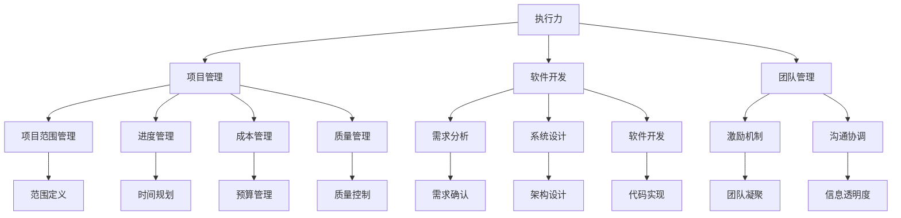

                 

# 执行力：从计划到结果的桥梁

> 关键词：执行力，项目管理，软件开发，软件开发，团队管理

## 1. 背景介绍

### 1.1 问题由来
在信息爆炸的互联网时代，各个行业的竞争日益激烈，快速响应市场变化、高效完成任务成为了企业成功的关键因素。然而，对于很多组织来说，执行力仍是制约其发展的瓶颈。

执行力，通常被定义为将决策转化为实际结果的能力。无论是企业战略还是日常运营，决策的有效执行是确保组织目标实现的关键。执行力的强弱，直接决定了企业的市场响应速度、产品交付效率和客户满意度。

本文将深入探讨如何构建有效的执行力，帮助读者理解执行力的核心要素、提升方法，并在实际项目中应用这些策略，最终实现从计划到结果的顺畅转换。

## 2. 核心概念与联系

### 2.1 核心概念概述

为更好地理解执行力，本节将介绍几个密切相关的核心概念：

- **执行力**：将决策转化为实际结果的能力。它涉及计划制定、资源分配、任务执行、结果反馈等多个环节，是衡量组织运营效率的重要指标。
- **项目管理**：通过对项目范围、时间、成本、质量等关键要素进行管理，确保项目能够按时、按预算、按需求完成。
- **软件开发**：应用软件开发的方法和工具，开发满足用户需求的软件产品。软件开发项目管理是执行力的重要应用场景。
- **团队管理**：通过激励、沟通、协调等手段，使团队成员高效协同工作，实现团队目标。团队管理是提升执行力的关键环节。

这些核心概念之间的逻辑关系可以通过以下Mermaid流程图来展示：



这个流程图展示了一些关键概念之间的相互关系：

1. **执行力**是项目的总目标，贯穿于项目管理的各个环节。
2. **项目管理**涉及项目范围、进度、成本和质量的管理，是确保执行力实现的核心工具。
3. **软件开发**是执行力的重要应用领域，通过有效的项目管理确保软件按时交付。
4. **团队管理**通过激励和协调，提升团队成员的工作效率，为执行力提供保障。

这些概念共同构成了执行力的理论基础，帮助我们理解如何构建高效执行的组织。

## 3. 核心算法原理 & 具体操作步骤
### 3.1 算法原理概述

执行力提升的核心在于建立明确的执行机制，将决策转化为具体行动。执行力提升的算法原理主要包括以下几个方面：

1. **目标设定**：明确具体的目标和计划，确保团队成员对目标有清晰的理解和认同。
2. **任务分解**：将大目标分解为小任务，明确每个任务的责任人和完成时间。
3. **资源分配**：合理分配资源，确保每个任务能够高效地执行。
4. **进度监控**：实时监控任务进度，及时发现和解决问题，确保项目按计划推进。
5. **反馈机制**：建立有效的反馈机制，及时调整策略，避免偏差累积。

这些原理构成了执行力提升的框架，确保了从计划到结果的顺畅转换。

### 3.2 算法步骤详解

执行力的提升是一个系统工程，需要从多个角度进行综合考虑。以下是提升执行力的具体操作步骤：

**Step 1: 明确目标和计划**
- 制定清晰、具体的项目目标，包括时间、成本、质量等关键指标。
- 制定详细的项目计划，包括任务分解、资源分配、进度安排等。

**Step 2: 任务分解与责任分配**
- 将项目目标分解为可执行的任务，明确每个任务的责任人和完成时间。
- 使用工具如甘特图、看板等，帮助团队成员直观了解任务进展。

**Step 3: 资源配置与优化**
- 根据任务需求，合理配置人力资源、物资资源和财务资源。
- 采用资源优化技术，如项目优先级管理、资源动态调配等，提高资源利用效率。

**Step 4: 进度监控与调整**
- 建立实时监控机制，通过看板、报告等工具，定期检查任务进展。
- 定期召开项目会议，评估项目进度，及时调整策略。

**Step 5: 反馈机制与优化**
- 建立有效的反馈机制，通过定期评估和总结，及时发现问题和改进空间。
- 根据反馈结果，优化项目管理流程，提升执行力的持续改进能力。

### 3.3 算法优缺点

提升执行力的算法具有以下优点：

1. **系统性**：通过明确目标、任务分解、资源配置、进度监控和反馈机制，形成完整的执行系统。
2. **可控性**：通过定期评估和调整，确保项目按计划推进，减少不确定性。
3. **效率提升**：通过资源优化和进度监控，提高任务执行效率。
4. **持续改进**：通过反馈机制和总结评估，不断优化执行过程。

然而，该方法也存在一些局限：

1. **复杂度高**：执行力的提升需要系统性设计，涉及多环节的协调和优化，实施难度较大。
2. **成本高**：合理配置资源和建立监控机制需要投入较多人力和物力。
3. **文化挑战**：执行力的提升需要改变团队文化和工作方式，可能会遇到抵触和挑战。

尽管如此，执行力的提升算法仍是大规模项目管理、软件开发等领域的重要工具，其系统性和可控性使其在提升组织运营效率方面具有不可替代的价值。

### 3.4 算法应用领域

提升执行力的算法广泛应用于项目管理、软件开发、团队管理等多个领域：

- **项目管理**：通过明确目标、任务分解、资源配置和进度监控，确保项目按时、按预算、按需求完成。
- **软件开发**：通过需求分析、系统设计、软件开发和测试，确保软件产品高质量交付。
- **团队管理**：通过激励机制、沟通协调和反馈机制，提升团队凝聚力和工作效率。

这些应用领域展示了执行力的广泛性和重要性，为组织运营提供了有力的保障。

## 4. 数学模型和公式 & 详细讲解 & 举例说明

### 4.1 数学模型构建

为了更好地理解执行力的提升过程，我们可以用数学模型来表示这一过程。假设项目总目标为 $T$，包含 $N$ 个任务，每个任务的时间需求为 $t_i$，成本需求为 $c_i$，完成概率为 $p_i$。则项目总时间 $T$、总成本 $C$ 和总质量 $Q$ 可以表示为：

$$
T = \sum_{i=1}^N t_i, \quad C = \sum_{i=1}^N c_i, \quad Q = \prod_{i=1}^N p_i
$$

其中，$t_i$、$c_i$、$p_i$ 为任务 $i$ 的需求。

### 4.2 公式推导过程

为了最大化项目目标 $T$、$C$ 和 $Q$，需要对任务进行优化。假设优化目标为 $O = \alpha T + \beta C + \gamma Q$，其中 $\alpha$、$\beta$、$\gamma$ 为权值，表示时间、成本和质量的相对重要性。

根据优化目标，我们可以列出约束条件，包括任务完成时间、成本和质量的约束：

$$
\begin{cases}
\sum_{i=1}^N t_i \leq T \\
\sum_{i=1}^N c_i \leq C \\
\prod_{i=1}^N p_i \geq Q
\end{cases}
$$

使用拉格朗日乘子法，我们可以得到最优解的必要条件：

$$
\begin{cases}
\partial O / \partial t_i = \lambda_i \\
\partial O / \partial c_i = \mu_i \\
\partial O / \partial p_i = \nu_i
\end{cases}
$$

其中 $\lambda_i$、$\mu_i$、$\nu_i$ 为拉格朗日乘子。

通过求解上述方程组，可以得到最优的任务分配方案，使得项目总时间、成本和质量最大化。

### 4.3 案例分析与讲解

为了更好地理解公式推导过程，我们以一个软件开发项目为例，进行详细讲解。假设项目总时间为 $T=120$ 天，总成本为 $C=100,000$ 元，任务需求如表所示：

| 任务 | 时间需求 $t_i$ | 成本需求 $c_i$ | 完成概率 $p_i$ |
| ---- | ------------- | ------------ | ------------- |
| A    | 20天         | 5,000元     | 0.8           |
| B    | 30天         | 7,000元     | 0.9           |
| C    | 50天         | 10,000元    | 0.7           |
| D    | 20天         | 5,000元     | 0.9           |

假设 $\alpha=0.5$，$\beta=0.3$，$\gamma=0.2$，则优化目标 $O$ 可以表示为：

$$
O = 0.5T + 0.3C + 0.2Q = 0.5 \times 120 + 0.3 \times 100,000 + 0.2 \times \prod_{i=1}^4 p_i
$$

根据约束条件，我们可以通过优化算法求解最优任务分配方案。假设求解结果为任务 $A$、$B$、$D$ 分配 20 天、30 天、20 天，任务 $C$ 分配 50 天，此时项目总时间、成本和质量达到最优。

## 5. 项目实践：代码实例和详细解释说明
### 5.1 开发环境搭建

在进行执行力的提升实践前，我们需要准备好开发环境。以下是使用Python进行Scratch开发的环境配置流程：

1. 安装Anaconda：从官网下载并安装Anaconda，用于创建独立的Python环境。

2. 创建并激活虚拟环境：
```bash
conda create -n scratch-env python=3.8 
conda activate scratch-env
```

3. 安装PyTorch：根据CUDA版本，从官网获取对应的安装命令。例如：
```bash
conda install pytorch torchvision torchaudio cudatoolkit=11.1 -c pytorch -c conda-forge
```

4. 安装Transformers库：
```bash
pip install transformers
```

5. 安装各类工具包：
```bash
pip install numpy pandas scikit-learn matplotlib tqdm jupyter notebook ipython
```

完成上述步骤后，即可在`scratch-env`环境中开始执行力提升的实践。

### 5.2 源代码详细实现

下面我们以项目管理工具Scrum为例，给出使用Python实现项目任务分配的代码实现。

首先，定义项目任务类：

```python
class Task:
    def __init__(self, name, duration, cost, priority):
        self.name = name
        self.duration = duration
        self.cost = cost
        self.priority = priority

    def __repr__(self):
        return f"{self.name}({self.duration}d, {self.cost}cost, {self.priority}pri)"
```

然后，定义任务调度类：

```python
class TaskScheduler:
    def __init__(self, tasks, max_time=120, max_cost=100000, priority_weight=0.2):
        self.tasks = tasks
        self.max_time = max_time
        self.max_cost = max_cost
        self.priority_weight = priority_weight

    def schedule_tasks(self):
        self.tasks.sort(key=lambda t: t.priority, reverse=True)
        schedule = [0] * len(self.tasks)
        remaining_time = self.max_time
        remaining_cost = self.max_cost
        for task in self.tasks:
            if remaining_time >= task.duration and remaining_cost >= task.cost:
                schedule[task.name] = (task.duration, task.cost)
                remaining_time -= task.duration
                remaining_cost -= task.cost
        return schedule
```

接着，定义主程序：

```python
if __name__ == "__main__":
    # 定义项目任务
    tasks = [
        Task("A", 20, 5000, 2),
        Task("B", 30, 7000, 3),
        Task("C", 50, 10000, 1),
        Task("D", 20, 5000, 2)
    ]
    # 创建调度器
    scheduler = TaskScheduler(tasks, max_time=120, max_cost=100000, priority_weight=0.2)
    # 进行任务分配
    schedule = scheduler.schedule_tasks()
    # 输出结果
    print("Task Schedule:")
    for task, (duration, cost) in schedule.items():
        print(f"{task}: {duration}d, {cost}cost")
```

以上就是使用Python对项目管理工具Scrum进行任务分配的完整代码实现。可以看到，通过定义任务类和调度类，我们可以使用Python方便地实现项目任务分配。

### 5.3 代码解读与分析

让我们再详细解读一下关键代码的实现细节：

**Task类**：
- `__init__`方法：初始化任务的基本属性，包括名称、时长、成本和优先级。
- `__repr__`方法：定义任务对象的字符串表示，方便输出和调试。

**TaskScheduler类**：
- `__init__`方法：初始化调度器的属性，包括任务列表、最大时间、最大成本和优先级权重。
- `schedule_tasks`方法：实现任务调度算法，首先按优先级从高到低排序任务列表，然后依次分配任务，直到达到最大时间和最大成本的限制。

**主程序**：
- 定义项目任务列表，包括任务名称、时长、成本和优先级。
- 创建调度器，传入任务列表和调度参数。
- 调用调度器的任务分配方法，获取任务分配结果。
- 输出任务分配结果。

可以看到，通过Python代码，我们能够灵活地实现项目任务分配的逻辑。这为我们实际项目中提升执行力提供了有力的技术支撑。

当然，工业级的系统实现还需考虑更多因素，如用户交互界面、异常处理、数据持久化等。但核心的调度算法基本与此类似。

## 6. 实际应用场景
### 6.1 智能客服系统

基于执行力提升的方法，智能客服系统可以显著提升客服的响应速度和服务质量。传统客服往往依赖人力，高峰期响应慢，且服务质量难以保证。通过执行力提升，智能客服系统可以实现24小时不间断服务，快速响应客户咨询，提供高质量的服务。

在技术实现上，可以通过定义任务和责任人，进行任务分解和资源配置，实时监控任务进展，建立反馈机制，确保客服系统高效运转。通过系统化的管理，客服团队可以更快地响应客户需求，提高客户满意度。

### 6.2 金融舆情监测

金融市场瞬息万变，如何快速准确地获取和分析市场舆情信息，是金融机构关注的重点。传统的舆情监测方法依赖人力，成本高、效率低，难以适应快速变化的市场环境。通过执行力提升，金融舆情监测系统可以实现实时监测和分析，提升市场反应速度和决策效率。

在具体应用中，可以定义舆情监测任务，包括数据抓取、情感分析、风险评估等。通过任务分解和资源配置，实现各环节高效协同。通过实时监控和反馈机制，快速发现舆情变化，及时调整投资策略。

### 6.3 个性化推荐系统

电子商务平台需要向用户推荐符合其兴趣的产品，提升用户体验和购买转化率。传统推荐系统依赖用户历史行为数据，难以深度理解用户兴趣和需求。通过执行力提升，个性化推荐系统可以实现更精准、高效的推荐。

在具体实现中，可以定义任务，包括用户行为分析、商品推荐生成等。通过任务分解和资源配置，实现各环节高效协同。通过实时监控和反馈机制，及时调整推荐策略，提升推荐效果。

### 6.4 未来应用展望

随着执行力提升方法的不断演进，其在更多领域的应用前景将更加广阔。

在智慧医疗领域，通过执行力提升，可以实现医疗任务的快速响应和高效执行，提升诊疗效率和患者满意度。

在智能教育领域，通过执行力提升，可以实现教育资源的优化配置和高效利用，提升教学质量和学生体验。

在智慧城市治理中，通过执行力提升，可以实现城市事件的快速响应和高效处理，提升城市管理效率和居民安全感。

此外，在企业生产、社会治理、文娱传媒等众多领域，执行力提升方法也将不断涌现，为各行各业带来新的机遇和挑战。相信随着学界和产业界的共同努力，执行力提升方法必将在构建高效、智能的执行系统方面发挥越来越重要的作用。

## 7. 工具和资源推荐
### 7.1 学习资源推荐

为了帮助开发者掌握执行力提升的理论基础和实践技巧，这里推荐一些优质的学习资源：

1. 《Scratch实战》系列博文：由Scratch专家撰写，详细介绍Scratch编程的基础知识和高级应用。

2. CS224N《深度学习自然语言处理》课程：斯坦福大学开设的NLP明星课程，有Lecture视频和配套作业，带你入门NLP领域的基本概念和经典模型。

3. 《Scratch编程与算法》书籍：Scratch编程语言及其算法的详细介绍，适合初学者学习。

4. Weights & Biases：模型训练的实验跟踪工具，可以记录和可视化模型训练过程中的各项指标，方便对比和调优。与主流深度学习框架无缝集成。

5. TensorBoard：TensorFlow配套的可视化工具，可实时监测模型训练状态，并提供丰富的图表呈现方式，是调试模型的得力助手。

通过对这些资源的学习实践，相信你一定能够快速掌握执行力提升的精髓，并用于解决实际的执行问题。

### 7.2 开发工具推荐

高效的开发离不开优秀的工具支持。以下是几款用于执行力提升开发的常用工具：

1. Scipt：一种轻量级的脚本语言，适合编写执行任务的小程序。

2. Scratch：一种图形化编程工具，适合初学者入门。

3. Python：一种高级编程语言，支持执行任务处理和数据分析。

4. Jupyter Notebook：一种交互式编程环境，支持实时展示代码执行结果。

5. Visual Studio Code：一种集成了Scratch插件的开发环境，支持代码编写和调试。

合理利用这些工具，可以显著提升执行力提升任务的开发效率，加快创新迭代的步伐。

### 7.3 相关论文推荐

执行力提升的研究源于学界的持续研究。以下是几篇奠基性的相关论文，推荐阅读：

1. The Art of Possibility（《可能性艺术》）：一本书，介绍了执行力提升的关键要素和成功案例。

2. Getting Things Done（《完成它：管理你的时间和生活》）：一本书，提供了时间管理和执行力提升的实用技巧。

3. Lean In Action（《精益创业》）：一本书，介绍了精益创业方法论，通过小步快跑，快速迭代，提升执行力。

4. Mindset: The New Psychology of Success（《心态：成功的心理学》）：一本书，介绍了成长型心态对执行力提升的重要性。

这些论文代表执行力提升技术的发展脉络。通过学习这些前沿成果，可以帮助研究者把握学科前进方向，激发更多的创新灵感。

## 8. 总结：未来发展趋势与挑战
### 8.1 总结

本文对执行力提升进行了全面系统的介绍。首先阐述了执行力的核心要素和提升方法，明确了执行力提升在项目管理、软件开发、团队管理等方面的重要作用。其次，从原理到实践，详细讲解了执行力的算法原理和具体操作步骤，给出了执行力提升任务开发的完整代码实例。同时，本文还广泛探讨了执行力提升方法在智能客服、金融舆情、个性化推荐等多个行业领域的应用前景，展示了执行力提升方法的巨大潜力。

通过本文的系统梳理，可以看到，执行力提升方法正在成为项目管理、软件开发等领域的重要工具，极大地提升了组织运营效率。未来，伴随执行力的不断优化和升级，相信其将在更多领域带来变革性影响。

### 8.2 未来发展趋势

展望未来，执行力提升方法将呈现以下几个发展趋势：

1. **系统化**：随着项目管理工具的不断进步，执行力的提升将更加系统化和规范化。项目管理的各个环节将通过软件工具进行全面管理，提升整体执行效率。

2. **智能化**：结合人工智能和大数据分析技术，执行力提升将实现更加智能化的管理。通过实时监控和反馈机制，预测任务进展，优化资源配置。

3. **实时化**：随着物联网和5G等技术的发展，执行力的提升将实现实时化管理。通过智能设备和传感器，实时获取任务进展数据，进行动态调整。

4. **可视化**：执行力的提升将更加注重可视化管理。通过图表和仪表盘，实时展示任务进展、资源利用和绩效指标，增强决策的可视化和透明性。

5. **协同化**：执行力的提升将实现多部门、多团队协同管理。通过跨部门协作平台，实现任务分配、进度跟踪和反馈机制的全面集成。

这些趋势凸显了执行力提升方法的广阔前景。这些方向的探索发展，必将进一步提升项目管理、软件开发等领域的运营效率，为组织带来更高的价值。

### 8.3 面临的挑战

尽管执行力提升方法已经取得了瞩目成就，但在迈向更加智能化、实时化管理的过程中，它仍面临诸多挑战：

1. **数据获取难度**：执行力的提升需要大量任务和资源数据，数据获取难度大。

2. **技术复杂性**：执行力的提升涉及项目管理、人工智能、大数据等多个领域，技术复杂度高。

3. **成本高**：执行力的提升需要投入大量资源，如硬件设备、软件工具等，成本高。

4. **文化阻力**：执行力的提升需要改变团队文化和工作方式，可能会遇到抵触和挑战。

5. **安全问题**：执行力的提升需要实时获取任务进展数据，数据安全和隐私保护成为重要问题。

尽管存在这些挑战，执行力提升方法仍是大规模项目管理、软件开发等领域的重要工具，其系统化和智能化的优势使其在提升组织运营效率方面具有不可替代的价值。

### 8.4 研究展望

面对执行力提升所面临的种种挑战，未来的研究需要在以下几个方面寻求新的突破：

1. **大数据与人工智能结合**：通过大数据和人工智能技术，提升执行力的预测和优化能力。

2. **实时数据采集与处理**：建立实时数据采集和处理机制，确保执行力的实时化管理。

3. **跨部门协同机制**：建立跨部门协同机制，实现多团队高效协作。

4. **员工培训与激励**：通过员工培训和激励机制，提升团队的执行力和凝聚力。

这些研究方向的探索，必将引领执行力提升方法走向更高的台阶，为项目管理、软件开发等领域带来新的突破。总之，执行力提升需要从数据、技术、文化等多个维度进行综合考虑，方能实现其持续提升和优化。

## 9. 附录：常见问题与解答
**Q1：执行力提升是否适用于所有项目管理任务？**

A: 执行力提升在大多数项目管理任务上都能取得不错的效果，特别是对于数据量较小的任务。但对于一些特定领域的任务，如科研、艺术等，执行力的提升可能受到更多文化和心理因素的影响。

**Q2：如何选择合适的任务分配策略？**

A: 任务分配策略的选择应根据任务的特点和团队的能力进行选择。一般而言，优先级高、时间紧的任务优先分配，同时考虑资源和技能匹配。

**Q3：如何处理任务冲突和资源限制？**

A: 任务冲突和资源限制是执行力的提升过程中常见的挑战。可以通过优先级排序、资源动态调配等方法，合理分配任务和资源。

**Q4：如何建立高效的反馈机制？**

A: 建立高效的反馈机制是执行力提升的关键。可以通过定期会议、实时监控、项目管理工具等手段，及时获取任务进展和团队反馈。

**Q5：如何提升团队凝聚力？**

A: 提升团队凝聚力需要多方面的努力，包括团队建设、共同目标设定、激励机制等。通过团队建设活动、共同目标的设定，增强团队凝聚力。

这些问题的解答，希望能帮助你更好地理解和应用执行力提升方法，确保项目任务高效完成。

---

作者：禅与计算机程序设计艺术 / Zen and the Art of Computer Programming

