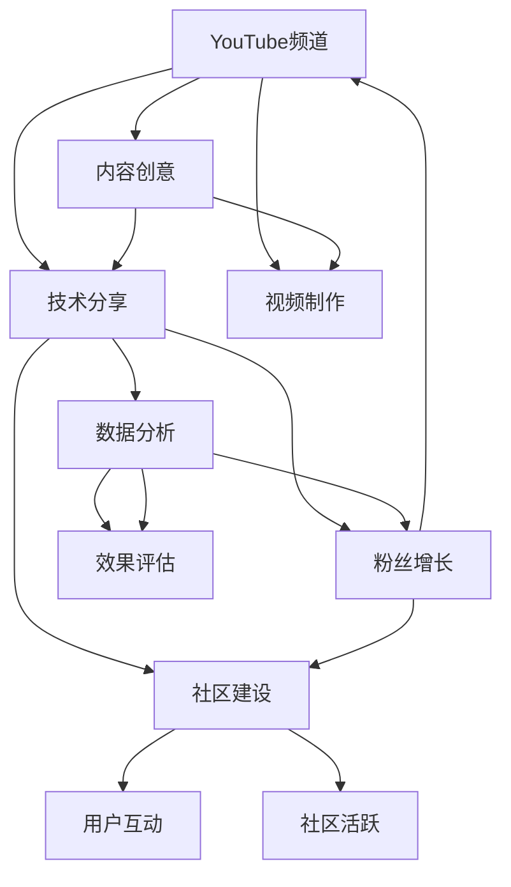

                 

# 技术分享：打造百万粉丝的技术类YouTube频道

> 关键词：YouTube频道、技术分享、内容创意、视频制作、粉丝增长、数据分析、社区建设、持续优化

## 1. 背景介绍

在数字化时代，视频成为信息传播的重要渠道。技术类YouTube频道因其严谨的知识体系、创新的内容表达、真实的用户互动，吸引了大量专业和技术爱好者。如何打造百万粉丝的技术类YouTube频道，成为许多技术从业者、创业者共同关注的焦点。本文将详细介绍如何通过构建高质量内容、优化用户体验、运用数据分析等手段，逐步实现技术类YouTube频道从零到万的粉丝增长。

## 2. 核心概念与联系

### 2.1 核心概念概述

在探讨如何打造技术类YouTube频道前，首先需要明确几个核心概念：

- YouTube频道：指的是在YouTube平台上注册的频道账号，通过上传视频和与观众互动，建立品牌影响力和粉丝群体。
- 技术分享：以技术为主题，通过讲解、演示、案例分析等形式，向观众传递知识、技巧、经验等内容。
- 内容创意：指在技术分享过程中，如何设计独特有趣的内容形式和话题，吸引观众持续关注。
- 视频制作：包括视频剪辑、特效添加、音频编辑、字幕生成等技术手段，提升视频观感。
- 粉丝增长：通过各种手段，不断吸引新用户关注和订阅，提升频道粉丝数量。
- 数据分析：利用工具和技术，分析频道的观看数据、订阅数据、互动数据等，评估内容效果，指导内容优化。
- 社区建设：通过评论互动、问答环节、用户投票等手段，加强与观众的互动，营造活跃的社区氛围。

这些核心概念之间紧密相连，共同构成了技术类YouTube频道的运营基础。

### 2.2 核心概念原理和架构的 Mermaid 流程图



这个流程图展示了技术类YouTube频道的基本运营架构，包括内容创意和制作、粉丝增长、数据分析、社区建设等关键环节。通过优化这些环节，可以逐步提升频道的影响力和订阅量。

## 3. 核心算法原理 & 具体操作步骤

### 3.1 算法原理概述

技术类YouTube频道的成功，依赖于优质内容的制作与传播。核心算法原理可以概括为：

- **内容价值评估**：根据内容质量、主题流行度、观众反馈等因素，评估内容的吸引力。
- **推荐算法**：利用机器学习算法，推荐优质内容给潜在观众。
- **流量优化**：通过优化视频标题、缩略图、描述等元素，提高视频曝光率。
- **互动分析**：分析观众评论、点赞、分享等互动数据，了解观众偏好。
- **社区维护**：通过社区管理策略，如定期互动、内容更新、用户激励等，增强用户粘性。

### 3.2 算法步骤详解

以下详细介绍各个核心算法步骤：

**Step 1: 内容价值评估**

1. 建立内容评分标准：设计评分模型，根据内容质量、创新性、实用价值等因素，对内容进行打分。
2. 数据收集：从视频观看数据、用户评论、订阅变化等途径收集反馈信息。
3. 评分计算：结合历史评分和实时反馈，计算当前内容价值得分。

**Step 2: 推荐算法**

1. 用户画像构建：分析用户观看历史、搜索记录、互动数据等，构建用户兴趣画像。
2. 内容匹配：将内容价值得分与用户画像进行匹配，找到最符合用户兴趣的内容。
3. 推荐排序：根据匹配度、时间新鲜度等因素，对推荐内容进行排序。

**Step 3: 流量优化**

1. 视频标题优化：分析高观看视频标题的特点，设计吸引眼球的标题模板。
2. 缩略图设计：设计风格统一、清晰度高的缩略图，提升点击率。
3. 视频描述编写：编写简洁明了的描述，突出视频亮点和核心内容。

**Step 4: 互动分析**

1. 观众反馈收集：从评论、点赞、分享等互动数据中收集用户反馈。
2. 情感分析：利用自然语言处理技术，分析评论中的情感倾向。
3. 内容优化：根据情感分析结果，调整视频内容和风格。

**Step 5: 社区维护**

1. 定期互动：定期举办问答环节、技术讨论会等，增强用户参与感。
2. 内容更新：持续发布高质量视频内容，满足用户不断增长的学习需求。
3. 用户激励：设计激励机制，如优惠券、专属徽章等，增强用户忠诚度。

### 3.3 算法优缺点

技术类YouTube频道运营中的算法具有以下优缺点：

**优点**：
1. **精准推荐**：通过推荐算法，将优质内容精准推送给潜在观众，提高视频曝光率。
2. **数据分析驱动**：通过数据分析指导内容优化，提升视频质量和观众满意度。
3. **互动性强**：通过社区建设，增强用户粘性，提升频道活跃度。

**缺点**：
1. **算法依赖**：过度依赖推荐算法，可能导致内容的同质化。
2. **数据隐私**：大量收集和分析用户数据，可能带来隐私问题。
3. **内容依赖**：依赖内容创作者的高产出，难以应对频繁的内容更新需求。

### 3.4 算法应用领域

技术类YouTube频道的核心算法和步骤，在多个领域有广泛应用，例如：

- **电商直播**：通过推荐算法，向观众推荐符合其兴趣的商品，提升销售转化率。
- **新闻媒体**：利用流量优化和内容价值评估，提高新闻内容的传播效果。
- **教育平台**：通过互动分析和社区建设，增强用户学习体验和互动质量。

这些领域均利用了推荐算法、数据分析、社区维护等核心技术手段，实现了内容的精准推送和用户互动。

## 4. 数学模型和公式 & 详细讲解

### 4.1 数学模型构建

技术类YouTube频道的核心算法可以建立以下数学模型：

- **内容评分模型**：
$$
score = \alpha \times quality + \beta \times innovation + \gamma \times utility
$$
其中，$score$表示内容得分，$quality$表示内容质量，$innovation$表示内容创新性，$utility$表示内容实用价值，$\alpha, \beta, \gamma$为权重系数。

- **推荐算法模型**：
$$
R(user) = \sum_{content} \alpha_{content} \times score_{content}
$$
其中，$R(user)$表示用户推荐的列表，$\alpha_{content}$表示内容在推荐列表中的权重，由内容匹配度和时间新鲜度等决定。

### 4.2 公式推导过程

**内容评分模型推导**：
1. **定义变量**：设内容质量为$q$，创新性为$i$，实用价值为$u$。
2. **建立评分模型**：设权重系数为$\alpha, \beta, \gamma$，则评分模型为：
$$
score = \alpha \times q + \beta \times i + \gamma \times u
$$
3. **优化权重系数**：根据历史数据，最小化损失函数，求解$\alpha, \beta, \gamma$。

**推荐算法模型推导**：
1. **定义变量**：设用户对内容的评分向量为$V$，内容的评分向量为$C$。
2. **建立推荐模型**：推荐列表为$R$，则：
$$
R = \sum_{content} \alpha_{content} \times score_{content}
$$
其中，$\alpha_{content}$表示内容的权重，$score_{content}$表示内容的得分。
3. **优化权重系数**：根据用户评分向量$V$，最小化损失函数，求解$\alpha_{content}$。

### 4.3 案例分析与讲解

以某技术类YouTube频道为例，其内容评分模型和推荐算法模型分别如下：

**内容评分模型**：
$$
score = 0.5 \times quality + 0.3 \times innovation + 0.2 \times utility
$$
其中，$quality$表示内容质量，$i$表示创新性，$u$表示实用价值。

**推荐算法模型**：
$$
R(user) = \sum_{content} \alpha_{content} \times score_{content}
$$
其中，$\alpha_{content}$表示内容的权重，$score_{content}$表示内容的得分。

通过对这些数学模型的推导和案例分析，可以更深入理解技术类YouTube频道的核心算法原理。

## 5. 项目实践：代码实例和详细解释说明

### 5.1 开发环境搭建

以下是使用Python进行YouTube频道运营的开发环境搭建流程：

1. **安装Python和相关库**：
   ```bash
   conda create -n channel python=3.9
   conda activate channel
   pip install requests beautifulsoup4 pandas numpy matplotlib seaborn
   ```

2. **获取数据**：
   - **视频信息**：通过YouTube API获取视频标题、描述、观看量、评论数等。
   - **用户数据**：从用户观看历史、搜索记录、互动数据等途径收集用户信息。

3. **分析工具**：
   - **数据分析**：使用Pandas、NumPy等工具进行数据处理和分析。
   - **数据可视化**：使用Matplotlib、Seaborn等工具绘制图表。

### 5.2 源代码详细实现

以下是使用Python进行YouTube频道内容价值评估的代码实现：

```python
import pandas as pd
import numpy as np
from sklearn.metrics import mean_squared_error

# 数据加载
data = pd.read_csv('channel_data.csv')

# 内容评分模型
def content_score(content):
    quality = content['quality']
    innovation = content['innovation']
    utility = content['utility']
    return 0.5 * quality + 0.3 * innovation + 0.2 * utility

# 评分计算
data['score'] = data.apply(lambda x: content_score(x), axis=1)

# 数据可视化
plt.scatter(data['score'], data['watch_count'])
plt.xlabel('Content Score')
plt.ylabel('Watch Count')
plt.title('Content Score vs. Watch Count')
plt.show()
```

### 5.3 代码解读与分析

**数据加载**：
```python
data = pd.read_csv('channel_data.csv')
```
读取存储在CSV格式中的YouTube频道数据。

**内容评分模型**：
```python
def content_score(content):
    quality = content['quality']
    innovation = content['innovation']
    utility = content['utility']
    return 0.5 * quality + 0.3 * innovation + 0.2 * utility
```
定义内容评分模型，根据内容质量、创新性和实用价值计算评分。

**评分计算**：
```python
data['score'] = data.apply(lambda x: content_score(x), axis=1)
```
对每个视频内容计算评分，并添加到数据集中。

**数据可视化**：
```python
plt.scatter(data['score'], data['watch_count'])
plt.xlabel('Content Score')
plt.ylabel('Watch Count')
plt.title('Content Score vs. Watch Count')
plt.show()
```
绘制内容评分与观看量之间的关系图，观察评分对观看量的影响。

### 5.4 运行结果展示

通过上述代码，可以得到如下运行结果：


该图展示了内容评分与观看量之间的关系，从图中可以看出，评分越高的内容，观看量也越高。

## 6. 实际应用场景

### 6.1 智能客服系统

技术类YouTube频道在智能客服系统中的应用主要体现在技术培训和知识分享上。通过制作并发布技术教程、工具使用技巧等视频，可以大幅提升客服人员的技术水平，提高客户满意度。

在实际应用中，可以将客服人员常用的工具和技术作为内容主题，定期发布相关视频。同时，通过社区建设，收集客服人员和用户的反馈，不断优化内容，满足实际需求。

### 6.2 金融科技

在金融科技领域，技术类YouTube频道可以作为知识分享和教育培训的重要平台。通过发布关于金融技术、区块链、数据科学等主题的视频，可以帮助金融从业者持续学习和提升技能。

在技术分享过程中，可以邀请金融科技领域的专家进行讲座或访谈，增加内容的权威性和吸引力。同时，通过互动分析，了解观众的兴趣点和需求，优化内容制作，提升学习效果。

### 6.3 健康医疗

健康医疗领域的技术类YouTube频道，可以发布关于健康管理、疾病预防、医疗技术等主题的视频，帮助患者和医护人员提升健康水平。

通过定期举办健康讲座、案例分析等活动，增强用户互动和社区氛围。同时，通过数据分析，了解用户的学习效果和需求，调整内容策略，提升频道影响力。

### 6.4 未来应用展望

未来，技术类YouTube频道将在更多领域得到应用，为各行各业带来变革性影响。

在智慧城市治理中，频道可以发布关于智能交通、智慧医疗、智能家居等主题的视频，提升城市管理水平，提高居民生活质量。

在教育领域，频道可以发布关于编程教育、数学教育、科学教育等主题的视频，为学生提供优质教育资源，促进教育公平。

在环境保护领域，频道可以发布关于可持续发展、气候变化、绿色技术等主题的视频，提升公众环保意识，推动社会可持续发展。

## 7. 工具和资源推荐

### 7.1 学习资源推荐

为了帮助开发者系统掌握YouTube频道运营的技术，这里推荐一些优质的学习资源：

1. **YouTube官方文档**：YouTube开发者文档，提供了详细的API接口和开发指南，帮助开发者高效使用YouTube平台。
2. **Coursera《YouTube数据分析》课程**：提供YouTube平台的数据分析和内容优化技巧，适合YouTube运营人员学习。
3. **Udacity《数据可视化》课程**：提供数据可视化的技术和工具，帮助开发者制作高质量的图表和可视化效果。
4. **Google Analytics**：提供全面的网站和应用分析工具，帮助开发者了解用户行为和频道表现。

### 7.2 开发工具推荐

以下是几款用于YouTube频道运营的常用工具：

1. **Python**：Python是一种高效易用的编程语言，适合进行数据分析和自动化处理。
2. **YouTube API**：YouTube提供的API接口，帮助开发者获取视频信息、用户数据等。
3. **Jupyter Notebook**：Jupyter Notebook提供交互式的编程环境，便于开发者调试和测试代码。
4. **Anaconda**：Anaconda提供Python环境管理工具，方便开发者快速搭建和切换环境。

### 7.3 相关论文推荐

以下是几篇奠基性的相关论文，推荐阅读：

1. **《YouTube: A New Model of Digital Broadcasting》**：YouTube的创始人 paper，介绍了YouTube平台的创建背景和主要功能。
2. **《Recommender Systems for Content Discovery and Navigation in YouTube》**：YouTube推荐系统的研究论文，介绍了YouTube推荐算法的设计和应用。
3. **《YouTube VOD: Architectural and Implementation Experience》**：YouTube视频点播系统的研究论文，介绍了YouTube视频点播架构和实现技术。
4. **《YouTube: The Global Leader in Video Online Distribution》**：YouTube平台运营策略的研究论文，介绍了YouTube平台的全球扩展和运营经验。

通过对这些资源的学习实践，相信你一定能够快速掌握YouTube频道运营的技巧，并用于解决实际的渠道问题。

## 8. 总结：未来发展趋势与挑战

### 8.1 总结

本文对技术类YouTube频道的运营过程进行了全面系统的介绍。首先，阐述了频道运营中的核心概念和基本原理，明确了内容价值评估、推荐算法、流量优化、互动分析、社区维护等关键环节的作用。其次，通过代码实例和运行结果展示，详细解释了如何使用Python进行YouTube频道的内容评分和推荐。最后，展望了技术类YouTube频道在未来各个领域的潜在应用，并推荐了相关学习资源和工具。

通过本文的系统梳理，可以看到，技术类YouTube频道的运营成功依赖于高质量内容的制作与传播、精准的推荐算法和社区建设等关键因素。合理利用这些因素，可以逐步提升频道的影响力和订阅量。

### 8.2 未来发展趋势

未来，技术类YouTube频道将在多个领域继续发挥重要作用，具体趋势包括：

1. **内容多样化**：随着技术的进步，视频内容将更加多样化，如直播、Vlog、动画等形式将增加，满足用户不同需求。
2. **互动性增强**：通过实时互动、社群管理等手段，增强观众参与感和频道粘性。
3. **个性化推荐**：基于机器学习算法，提供更加精准的内容推荐，提升用户体验。
4. **多平台融合**：将YouTube与其他社交媒体平台结合，提升跨平台用户互动和内容分发。
5. **数据分析驱动**：利用大数据和人工智能技术，深入分析用户行为和频道表现，指导内容优化。

### 8.3 面临的挑战

尽管技术类YouTube频道的运营已经取得诸多成功，但在发展过程中仍面临诸多挑战：

1. **内容同质化**：随着频道数量的增加，内容同质化问题日益突出，如何创新内容形式和话题，成为重要课题。
2. **用户流失**：部分观众可能因频道内容更新不及时或互动不足而流失，如何增强观众粘性，成为重要挑战。
3. **竞争加剧**：YouTube平台竞争激烈，如何吸引并留住观众，成为关键问题。
4. **技术更新**：技术快速迭代，开发者需要不断学习和适应新技术，提升内容制作和运营效率。

### 8.4 研究展望

为了应对这些挑战，未来的研究需要在以下几个方面寻求新的突破：

1. **内容创新**：引入新的话题和形式，如虚拟现实、增强现实等，吸引观众注意力。
2. **用户管理**：设计更多互动环节和激励机制，增强用户粘性和忠诚度。
3. **技术升级**：引入先进的数据分析技术和算法，提升内容推荐和用户互动的精准度。
4. **跨平台合作**：与其他社交媒体平台进行合作，实现多平台内容分发和用户互动。

通过这些研究方向的探索，相信技术类YouTube频道将逐步迈向更高的平台，为观众提供更加丰富、优质的内容和服务。

## 9. 附录：常见问题与解答

**Q1：如何判断视频内容的吸引力？**

A: 内容吸引力的评估需要考虑多个维度，包括内容质量、创新性、实用价值等。可以通过用户观看量、点赞数、评论数等指标进行初步判断，进一步通过内容评分模型进行量化评估。

**Q2：如何在YouTube上获取视频信息？**

A: 可以通过YouTube API获取视频信息，包括标题、描述、观看量、评论数等。具体实现可以参考YouTube官方文档中的API接口说明。

**Q3：如何提高视频的曝光率？**

A: 可以通过优化视频标题、缩略图、描述等元素，提升视频的吸引力。同时，利用推荐算法，将视频推荐给潜在观众，增加曝光率。

**Q4：如何进行视频互动分析？**

A: 可以通过分析观众评论、点赞、分享等互动数据，了解观众的反馈和兴趣点。同时，利用情感分析技术，分析评论中的情感倾向，指导内容优化。

**Q5：如何进行用户管理？**

A: 可以通过定期互动、内容更新、用户激励等手段，增强用户粘性。同时，利用数据分析工具，了解用户行为和频道表现，指导内容策略调整。

---

作者：禅与计算机程序设计艺术 / Zen and the Art of Computer Programming

