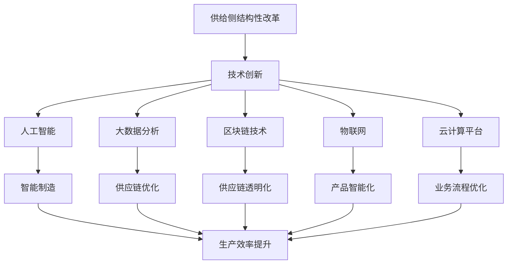

                 

# 技术创新在供给中的应用

> 关键词：技术创新,供给侧结构性改革,人工智能,大数据,区块链,物联网,云计算

## 1. 背景介绍

### 1.1 问题由来

在当前全球经济形势下，如何通过技术创新驱动经济高质量发展，实现供给侧结构性改革的目标，已成为各国政府和企业的共同课题。通过技术创新推动产业升级、提升产品质量和效率、优化供应链管理等，可以有效应对国内外市场变化和竞争压力，释放和培育新的经济增长点。

技术创新不仅涵盖了传统意义上的科技创新，还包括信息技术创新、管理创新、业务模式创新等。这些创新活动在推动经济增长、优化产业结构、提高资源配置效率等方面发挥着越来越重要的作用。从工业4.0到智慧城市，从大数据到云计算，新技术新业态层出不穷，正深刻影响着经济社会发展的方方面面。

### 1.2 问题核心关键点

当前，技术创新在供给侧结构性改革中的应用主要集中在以下几个方面：

1. **智能制造**：通过工业互联网和物联网技术，实现生产过程的数字化、网络化和智能化，提升制造业生产效率和产品质量。
2. **大数据分析**：利用大数据技术对生产数据进行分析，优化生产计划和库存管理，减少资源浪费和库存成本。
3. **区块链技术**：通过区块链技术建立透明的供应链管理系统，保障物流和资金流的安全，提升供应链的效率和可靠性。
4. **云计算平台**：构建高效的云计算平台，支持企业进行弹性计算和数据存储，降低IT成本，提升业务响应速度。
5. **人工智能应用**：利用机器学习和深度学习技术，优化产品设计、质量检测、客户服务等环节，提升用户体验和企业竞争力。

这些创新活动通过提升生产效率、优化供应链管理、增强市场竞争力，帮助企业实现高质量发展，促进经济持续健康增长。

### 1.3 问题研究意义

技术创新在供给侧结构性改革中的应用，具有以下重要意义：

1. **推动产业升级**：通过引入新技术新工艺，提升传统产业的技术水平，优化产品结构，促进新兴产业发展，推动产业转型升级。
2. **提高生产效率**：通过智能制造、大数据分析等技术手段，实现生产过程的自动化和智能化，大幅提升生产效率和资源利用率。
3. **优化供应链管理**：通过区块链和云计算技术，建立透明的供应链体系，提高物流和资金流的管理效率，降低交易成本，增强供应链的韧性和稳定性。
4. **提升用户体验**：通过人工智能应用，提供更加个性化和智能化的服务，增强用户粘性，提升品牌价值和企业竞争力。
5. **促进创新生态**：通过技术创新推动相关产业链上下游协同合作，形成更加开放、共享的创新生态，激发创新活力，形成更多新的经济增长点。

综上所述，技术创新在供给侧结构性改革中的重要性不言而喻，它是实现高质量发展、构建现代化经济体系的关键驱动力。

## 2. 核心概念与联系

### 2.1 核心概念概述

为了更好地理解技术创新在供给侧结构性改革中的应用，本节将介绍几个关键概念：

- **供给侧结构性改革**：指通过优化供给体系结构，提高经济增长的质量和效率，推动经济持续健康发展的政策导向。
- **技术创新**：指通过引入新技术、新工艺、新方法和新产品，提升产品和服务的价值和竞争力，推动经济社会发展的活动。
- **人工智能**：以机器学习和深度学习为代表的智能技术，通过模拟人脑的思维过程，实现自主学习、智能决策和适应性改进。
- **大数据分析**：利用数据挖掘、统计分析和可视化技术，对大规模数据进行分析和处理，发现数据背后的规律和趋势。
- **区块链技术**：基于去中心化、分布式账本和加密技术，实现数据的安全、透明和不可篡改，应用于金融、供应链、智能合约等领域。
- **物联网(IoT)**：通过各种传感器和智能设备，实现物与物、物与人的互联互通，提升物理世界的数字化和智能化水平。
- **云计算平台**：基于互联网提供高性能计算和数据存储服务，支持大规模分布式计算和数据处理，优化资源配置和业务流程。

这些概念之间相互关联，共同构成了技术创新在供给侧结构性改革中的核心内容。

### 2.2 核心概念原理和架构的 Mermaid 流程图



这个流程图展示了技术创新在供给侧结构性改革中的多个应用场景，以及它们之间的联系和互动关系。

## 3. 核心算法原理 & 具体操作步骤

### 3.1 算法原理概述

技术创新在供给侧结构性改革中的应用，本质上是一个多维度的系统工程。其核心算法原理包括但不限于以下几个方面：

- **机器学习算法**：用于数据分析、模式识别和预测，优化产品设计和生产过程，提升服务质量。
- **深度学习算法**：用于图像识别、语音识别和自然语言处理等复杂任务的建模，增强系统的智能化和自适应能力。
- **自然语言处理(NLP)**：用于文本分析、情感分析和语义理解等，提升用户体验和客户满意度。
- **计算机视觉(CV)**：用于图像识别、视频分析等，增强产品的感知能力和决策能力。
- **区块链技术**：用于建立去中心化、透明和不可篡改的数据管理系统，保障供应链和金融交易的安全。
- **物联网技术**：用于设备互联和数据采集，实现智能制造和智慧城市。
- **云计算平台**：用于分布式计算和数据存储，支持大数据分析和智能决策。

这些算法和技术的有机结合，构成了技术创新在供给侧结构性改革中的核心技术框架。

### 3.2 算法步骤详解

技术创新在供给侧结构性改革中的应用，通常包括以下几个关键步骤：

1. **需求分析**：通过市场调研和用户反馈，明确企业转型升级的需求和目标。
2. **技术选择**：根据需求选择合适的技术方案，如人工智能、大数据、区块链等。
3. **系统设计**：根据技术方案设计系统的架构和功能模块，确保技术的兼容性和可扩展性。
4. **数据准备**：收集和清洗生产数据、供应链数据等，为后续的数据分析和模型训练做准备。
5. **模型训练和优化**：利用机器学习和深度学习算法，对数据进行训练和优化，得到能够满足业务需求的模型。
6. **系统部署和测试**：将训练好的模型部署到生产环境中，进行全面测试和验证，确保系统的稳定性和可靠性。
7. **持续改进**：根据反馈和业务需求的变化，持续优化系统，不断提升技术创新效果。

### 3.3 算法优缺点

技术创新在供给侧结构性改革中的应用，具有以下优缺点：

**优点**：

1. **提升效率**：通过引入新技术，大幅提升生产效率和资源利用率，降低生产成本。
2. **优化流程**：通过数字化和智能化手段，优化生产流程和供应链管理，提高运营效率。
3. **增强竞争力**：通过智能制造和个性化服务，增强企业的市场竞争力和品牌价值。
4. **提升质量**：通过机器学习和自然语言处理技术，提升产品质量和用户体验。
5. **促进创新**：通过技术创新推动相关产业链上下游协同合作，形成更加开放、共享的创新生态。

**缺点**：

1. **高成本**：技术创新往往需要高额的初期投资，包括硬件设备、软件系统、技术人才等。
2. **技术门槛**：部分技术如深度学习、区块链等，需要较高的技术门槛，对企业技术能力提出了挑战。
3. **数据隐私**：在数据采集和分析过程中，可能面临数据隐私和安全问题，需要采取相应的保护措施。
4. **业务融合**：技术创新需要与现有业务进行深度融合，可能面临组织和文化上的阻力。
5. **持续投入**：技术创新需要持续投入，包括技术更新、人员培训、系统维护等，成本较高。

### 3.4 算法应用领域

技术创新在供给侧结构性改革中的应用，涵盖了工业制造、金融服务、零售电商、智慧城市等多个领域。具体应用包括但不限于以下几个方面：

1. **智能制造**：通过工业互联网和物联网技术，实现生产过程的数字化、网络化和智能化，提升制造业生产效率和产品质量。
2. **金融科技**：利用区块链和大数据分析技术，建立透明的金融交易和监管体系，提高金融服务的效率和安全性。
3. **智慧物流**：通过物联网和云计算技术，优化物流和供应链管理，提升物流效率和客户满意度。
4. **电子商务**：利用大数据分析和人工智能技术，优化客户推荐和个性化营销，提升用户体验和销售转化率。
5. **智慧医疗**：通过人工智能和大数据分析技术，实现医疗影像分析、疾病预测和智能诊断，提升医疗服务质量。
6. **智慧城市**：通过物联网和云计算技术，实现城市管理的数字化、智能化和精细化，提升城市运营效率和管理水平。

## 4. 数学模型和公式 & 详细讲解 & 举例说明

### 4.1 数学模型构建

技术创新在供给侧结构性改革中的应用，涉及多个领域的数学模型构建。以下以智能制造为例，介绍一种典型的数学模型构建过程：

假设某制造业企业希望通过智能制造技术提升生产效率，其数学模型可以表示为：

$$
\maximize \text{生产效率} = f(\text{数据输入}, \text{生产流程}, \text{技术方案})
$$

其中 $\text{数据输入}$ 包括生产数据、设备状态数据等，$\text{生产流程}$ 包括生产线的自动化控制和调度，$\text{技术方案}$ 包括智能制造的算法和技术选择。

### 4.2 公式推导过程

在智能制造中，常见的数学模型包括线性回归模型、支持向量机(SVM)模型、随机森林模型等。以线性回归模型为例，其推导过程如下：

假设有一组生产数据 $(x_i, y_i)$，其中 $x_i$ 表示生产条件，$y_i$ 表示生产效率。构建线性回归模型 $y = wx + b$，其中 $w$ 为权重向量，$b$ 为偏置项。

通过最小二乘法，求得模型参数 $w$ 和 $b$：

$$
w = \frac{\sum_{i=1}^{n} (x_i - \bar{x})(y_i - \bar{y})}{\sum_{i=1}^{n} (x_i - \bar{x})^2}
$$

$$
b = \bar{y} - w\bar{x}
$$

其中 $\bar{x}$ 和 $\bar{y}$ 分别为 $x$ 和 $y$ 的均值。

### 4.3 案例分析与讲解

以某汽车制造企业为例，分析其智能制造的数学模型构建过程：

1. **数据准备**：收集和清洗生产线上的生产数据、设备状态数据、工人操作数据等。
2. **特征选择**：选择与生产效率相关的特征，如设备故障率、生产节拍、工人操作熟练度等。
3. **模型训练**：利用线性回归模型对数据进行训练，得到最优的权重和偏置项。
4. **模型验证**：在验证集上评估模型的预测效果，调整模型参数以提高预测准确度。
5. **模型应用**：将训练好的模型应用于生产线的自动化控制和调度，提升生产效率和产品质量。

## 5. 项目实践：代码实例和详细解释说明

### 5.1 开发环境搭建

为了进行技术创新的项目实践，需要先搭建好开发环境。以下是使用Python进行智能制造开发的环境配置流程：

1. 安装Anaconda：从官网下载并安装Anaconda，用于创建独立的Python环境。

2. 创建并激活虚拟环境：
```bash
conda create -n intell_manuf python=3.8 
conda activate intell_manuf
```

3. 安装必要的Python包：
```bash
pip install numpy pandas scikit-learn matplotlib tensorboard
```

4. 安装必要的硬件设备：
- 安装智能传感器设备，用于采集生产数据。
- 配置网络环境，确保数据能够实时传输和处理。
- 配置计算资源，如CPU、GPU等，用于高性能计算。

完成上述步骤后，即可在`intell_manuf`环境中开始智能制造的开发实践。

### 5.2 源代码详细实现

以下是智能制造中生产效率优化的代码实现，以线性回归模型为例：

```python
import numpy as np
from sklearn.linear_model import LinearRegression

# 创建训练集
X_train = np.array([[1, 2, 3], [4, 5, 6], [7, 8, 9]])
y_train = np.array([10, 20, 30])

# 创建模型
model = LinearRegression()

# 训练模型
model.fit(X_train, y_train)

# 预测
X_test = np.array([[10, 11, 12]])
y_pred = model.predict(X_test)

print(y_pred)
```

### 5.3 代码解读与分析

代码中使用了Python的NumPy和Scikit-learn库，构建了一个简单的线性回归模型，用于预测生产效率。

1. **数据准备**：创建训练集，包含输入特征 $x$ 和输出标签 $y$。
2. **模型构建**：使用Scikit-learn的LinearRegression类创建线性回归模型。
3. **模型训练**：调用fit方法，对训练集进行模型训练，得到最优的权重和偏置项。
4. **模型应用**：使用predict方法，对测试集进行预测，输出预测结果。

## 6. 实际应用场景

### 6.1 智能制造

智能制造是技术创新在供给侧结构性改革中的重要应用场景之一。通过引入物联网和工业互联网技术，实现生产过程的数字化、网络化和智能化，大幅提升制造业生产效率和产品质量。

智能制造的核心应用包括：

1. **智能监测**：通过传感器和智能设备，实时监测生产设备的运行状态和生产数据，及时发现和解决故障问题。
2. **智能调度**：利用大数据分析和机器学习算法，优化生产线的自动化控制和调度，提高生产效率和资源利用率。
3. **智能检测**：通过计算机视觉技术，实现产品质量的自动检测和分类，减少人工检测成本，提高检测精度。
4. **智能维护**：利用预测性维护技术，通过分析历史数据，预测设备的维护需求，避免设备故障和停机时间。
5. **智能物流**：通过物联网和云计算技术，优化物料管理和物流配送，提高供应链的响应速度和灵活性。

通过智能制造，企业可以实现生产过程的智能化和自动化，大幅提升生产效率和产品质量，降低生产成本。

### 6.2 金融科技

金融科技是技术创新在供给侧结构性改革中的另一个重要应用场景。通过区块链和大数据分析技术，建立透明的金融交易和监管体系，提高金融服务的效率和安全性。

金融科技的核心应用包括：

1. **智能合约**：利用区块链技术，实现金融合约的自动化执行和监管，保障交易的透明和可信。
2. **风险管理**：通过大数据分析，预测和监控金融市场的风险，提供及时的风险预警和应对措施。
3. **智能投顾**：利用机器学习和自然语言处理技术，提供智能化的投资建议和客户服务，提升客户体验。
4. **供应链金融**：通过区块链技术，建立供应链各方的信任机制，保障物流和资金流的安全。
5. **数字货币**：利用区块链技术，实现数字货币的发行和交易，提供安全、透明的交易环境。

通过金融科技，金融机构可以实现金融服务的智能化和高效化，提升金融服务的质量和安全性，降低金融风险。

### 6.3 智慧物流

智慧物流是技术创新在供给侧结构性改革中的重要应用场景之一。通过物联网和云计算技术，优化物流和供应链管理，提升物流效率和客户满意度。

智慧物流的核心应用包括：

1. **实时监控**：通过传感器和智能设备，实时监控物流运输过程中的货物状态和位置，确保货物的安全性和准时性。
2. **路径优化**：利用大数据分析和机器学习算法，优化物流路径和配送计划，提高物流效率和降低成本。
3. **库存管理**：通过智能仓库管理系统，实时监控库存状态，优化库存管理和补货策略，减少库存积压和缺货风险。
4. **客户服务**：通过智能客服系统，提供实时的物流查询和问题解决，提升客户满意度和服务质量。
5. **数据分析**：通过数据分析和可视化技术，对物流数据进行全面分析，提供决策支持和业务优化建议。

通过智慧物流，企业可以实现物流管理的智能化和高效化，提升物流效率和客户满意度，降低物流成本。

### 6.4 未来应用展望

随着技术创新的不断发展，未来智能制造、金融科技、智慧物流等领域将迎来更多创新应用。

1. **智能制造**：通过引入更多的物联网设备和智能算法，进一步提升生产效率和产品质量，实现全生产链的智能化。
2. **金融科技**：利用人工智能和大数据分析技术，提供更加个性化和智能化的金融服务，提升金融服务的质量和效率。
3. **智慧物流**：通过引入5G、无人驾驶等前沿技术，进一步提升物流效率和客户满意度，实现智慧物流的全面升级。
4. **智慧城市**：通过物联网和云计算技术，实现城市管理的数字化、智能化和精细化，提升城市运营效率和管理水平。
5. **智能医疗**：通过人工智能和大数据分析技术，实现医疗影像分析、疾病预测和智能诊断，提升医疗服务质量。

这些前沿技术的应用，将深刻影响经济社会的各个方面，带来更多创新和变革。

## 7. 工具和资源推荐

### 7.1 学习资源推荐

为了帮助开发者系统掌握技术创新在供给侧结构性改革中的应用，这里推荐一些优质的学习资源：

1. **Coursera《数据科学基础》课程**：由斯坦福大学开设，涵盖了数据科学的基本概念和工具，适合初学者入门。
2. **edX《人工智能与机器学习》课程**：由麻省理工学院和哈佛大学联合开设，深入讲解人工智能和机器学习的原理与应用。
3. **Udacity《高级数据科学》纳米学位**：涵盖数据科学、机器学习、深度学习等方面的内容，适合进阶学习。
4. **Kaggle竞赛平台**：提供了大量实际数据和比赛任务，适合实战练习和项目开发。
5. **机器学习社区（Kaggle）**：全球最大的数据科学社区，提供丰富的学习资源和社区支持，适合交流和分享。

通过这些学习资源，相信你一定能够快速掌握技术创新的相关知识，并用于解决实际的供给侧结构性改革问题。

### 7.2 开发工具推荐

高效的开发离不开优秀的工具支持。以下是几款用于技术创新开发的常用工具：

1. **Jupyter Notebook**：开源的交互式计算环境，支持Python、R等编程语言，适合数据科学和机器学习开发。
2. **TensorFlow**：由Google主导开发的深度学习框架，支持分布式计算和模型优化，适合大规模数据处理。
3. **PyTorch**：由Facebook主导开发的深度学习框架，灵活易用，适合研究和实验。
4. **Keras**：基于TensorFlow和Theano开发的高级神经网络API，适合快速原型开发和模型构建。
5. **Scikit-learn**：Python的机器学习库，提供了丰富的算法和工具，适合数据预处理和模型训练。

合理利用这些工具，可以显著提升技术创新项目的开发效率，加快创新迭代的步伐。

### 7.3 相关论文推荐

技术创新在供给侧结构性改革中的应用，涉及多个领域的创新研究和应用实践。以下是几篇奠基性的相关论文，推荐阅读：

1. **《智能制造技术发展趋势》**：综述了智能制造技术的现状和发展趋势，分析了智能制造的核心技术与应用。
2. **《区块链技术在金融领域的应用》**：介绍了区块链技术在金融领域的应用场景和优势，探讨了区块链技术在金融创新的前景。
3. **《物联网与智能制造的融合》**：分析了物联网技术在智能制造中的应用，探讨了物联网与智能制造的融合机制与效果。
4. **《大数据在供应链管理中的应用》**：探讨了大数据技术在供应链管理中的应用，分析了大数据与供应链管理的互动关系。
5. **《云计算平台在智慧城市中的应用》**：介绍了云计算平台在智慧城市中的应用，探讨了云计算与智慧城市的融合机制。

这些论文代表了大规模技术创新的研究进展和实践成果，通过学习这些前沿成果，可以帮助研究者把握学科前进方向，激发更多的创新灵感。

## 8. 总结：未来发展趋势与挑战

### 8.1 研究成果总结

本文对技术创新在供给侧结构性改革中的应用进行了全面系统的介绍。首先阐述了技术创新在推动供给侧结构性改革中的重要性，明确了其对经济高质量发展、产业升级、效率提升等方面的独特价值。其次，从原理到实践，详细讲解了智能制造、金融科技、智慧物流等多个领域的技术创新方法，给出了具体的代码实现和案例分析。同时，本文还广泛探讨了技术创新在各个领域的应用前景，展示了其广阔的想象空间。最后，本文精选了技术创新相关的学习资源、开发工具和相关论文，力求为读者提供全方位的技术指引。

通过本文的系统梳理，可以看到，技术创新在供给侧结构性改革中的重要性不言而喻，它是实现高质量发展、构建现代化经济体系的关键驱动力。

### 8.2 未来发展趋势

展望未来，技术创新在供给侧结构性改革中的应用将呈现以下几个发展趋势：

1. **智能化水平提升**：随着人工智能和机器学习技术的发展，智能制造、智慧物流、智能投顾等应用将更加智能化，实现全生产链和全业务链的智能化管理。
2. **数据驱动决策**：大数据和人工智能技术将深入应用于决策过程，实现数据驱动的智能决策和精准管理，提升运营效率和资源配置效率。
3. **平台化生态构建**：通过区块链和云计算技术，构建开放、共享的创新平台，促进不同领域和环节的协同创新，形成更加开放、创新的生态系统。
4. **技术融合加速**：人工智能、物联网、大数据、区块链等技术将加速融合，形成更加强大、高效的技术创新体系，推动产业创新和升级。
5. **场景化应用深化**：技术创新将在更多具体场景中得到应用，如智能交通、智能家居、智能医疗等，提升人们的生活质量和幸福感。

这些趋势凸显了技术创新在供给侧结构性改革中的重要性和广阔前景，它是推动经济高质量发展的关键驱动力。

### 8.3 面临的挑战

尽管技术创新在供给侧结构性改革中具有重要意义，但在迈向更加智能化、普适化应用的过程中，它仍面临诸多挑战：

1. **技术门槛较高**：部分前沿技术如深度学习、区块链等，需要较高的技术门槛，对企业技术能力提出了挑战。
2. **数据隐私和安全**：在数据采集和分析过程中，可能面临数据隐私和安全问题，需要采取相应的保护措施。
3. **资源配置成本高**：技术创新往往需要高额的初期投资，包括硬件设备、软件系统、技术人才等，可能对企业财务状况造成压力。
4. **业务协同难度大**：技术创新需要与现有业务进行深度融合，可能面临组织和文化上的阻力。
5. **持续投入成本高**：技术创新需要持续投入，包括技术更新、人员培训、系统维护等，成本较高。

正视技术创新面临的这些挑战，积极应对并寻求突破，将是大规模技术创新走向成熟的必由之路。

### 8.4 研究展望

面对技术创新在供给侧结构性改革中面临的挑战，未来的研究需要在以下几个方面寻求新的突破：

1. **低成本技术引入**：开发更加高效、低成本的技术方案，降低技术创新的门槛和成本，推动更多企业应用技术创新。
2. **跨领域协同创新**：加强不同领域、环节的协同创新，形成更加开放、共享的创新生态，激发创新活力。
3. **数据隐私保护**：在技术创新过程中，注重数据隐私和安全保护，确保数据使用的合规性和可信度。
4. **技术融合发展**：推进人工智能、物联网、大数据、区块链等技术的深度融合，形成更加强大、高效的技术创新体系。
5. **创新生态建设**：构建开放、共享、协作的创新生态，推动技术创新与业务融合，形成持续创新的生态系统。

这些研究方向和突破将推动技术创新在供给侧结构性改革中更好地发挥作用，为经济高质量发展和现代化经济体系建设提供强大动力。

## 9. 附录：常见问题与解答

**Q1：技术创新在供给侧结构性改革中的应用有哪些？**

A: 技术创新在供给侧结构性改革中的应用涵盖了智能制造、金融科技、智慧物流等多个领域。具体包括但不限于以下几个方面：

1. **智能制造**：通过引入物联网和工业互联网技术，实现生产过程的数字化、网络化和智能化，提升制造业生产效率和产品质量。
2. **金融科技**：利用区块链和大数据分析技术，建立透明的金融交易和监管体系，提高金融服务的效率和安全性。
3. **智慧物流**：通过物联网和云计算技术，优化物流和供应链管理，提升物流效率和客户满意度。
4. **电子商务**：利用大数据分析和人工智能技术，优化客户推荐和个性化营销，提升用户体验和销售转化率。
5. **智慧医疗**：通过人工智能和大数据分析技术，实现医疗影像分析、疾病预测和智能诊断，提升医疗服务质量。

这些技术创新应用，通过提升生产效率、优化供应链管理、增强市场竞争力，帮助企业实现高质量发展，促进经济持续健康增长。

**Q2：如何进行技术创新项目的开发和部署？**

A: 技术创新项目的开发和部署通常包括以下几个关键步骤：

1. **需求分析**：通过市场调研和用户反馈，明确企业转型升级的需求和目标。
2. **技术选择**：根据需求选择合适的技术方案，如人工智能、大数据、区块链等。
3. **系统设计**：根据技术方案设计系统的架构和功能模块，确保技术的兼容性和可扩展性。
4. **数据准备**：收集和清洗生产数据、供应链数据等，为后续的数据分析和模型训练做准备。
5. **模型训练和优化**：利用机器学习和深度学习算法，对数据进行训练和优化，得到能够满足业务需求的模型。
6. **系统部署和测试**：将训练好的模型部署到生产环境中，进行全面测试和验证，确保系统的稳定性和可靠性。
7. **持续改进**：根据反馈和业务需求的变化，持续优化系统，不断提升技术创新效果。

在开发过程中，可以使用Python、R、Java等编程语言，配合相应的开发工具和框架，如Jupyter Notebook、TensorFlow、Scikit-learn等，进行高效开发。在部署过程中，可以使用云计算平台如AWS、Azure、阿里云等，进行弹性计算和数据存储，确保系统的高可用性和高扩展性。

**Q3：技术创新在供给侧结构性改革中面临哪些挑战？**

A: 技术创新在供给侧结构性改革中面临以下挑战：

1. **技术门槛较高**：部分前沿技术如深度学习、区块链等，需要较高的技术门槛，对企业技术能力提出了挑战。
2. **数据隐私和安全**：在数据采集和分析过程中，可能面临数据隐私和安全问题，需要采取相应的保护措施。
3. **资源配置成本高**：技术创新往往需要高额的初期投资，包括硬件设备、软件系统、技术人才等，可能对企业财务状况造成压力。
4. **业务协同难度大**：技术创新需要与现有业务进行深度融合，可能面临组织和文化上的阻力。
5. **持续投入成本高**：技术创新需要持续投入，包括技术更新、人员培训、系统维护等，成本较高。

针对这些挑战，需要通过技术创新和业务创新的结合，优化资源配置和业务流程，降低技术门槛和成本，提高系统稳定性和可靠性，实现持续创新和优化。

**Q4：技术创新在各个领域的应用前景如何？**

A: 技术创新在各个领域的应用前景广阔，以下是几个主要领域的未来发展趋势：

1. **智能制造**：通过引入更多的物联网设备和智能算法，进一步提升生产效率和产品质量，实现全生产链的智能化。
2. **金融科技**：利用人工智能和大数据分析技术，提供更加个性化和智能化的金融服务，提升金融服务的质量和效率。
3. **智慧物流**：通过引入5G、无人驾驶等前沿技术，进一步提升物流效率和客户满意度，实现智慧物流的全面升级。
4. **智慧城市**：通过物联网和云计算技术，实现城市管理的数字化、智能化和精细化，提升城市运营效率和管理水平。
5. **智能医疗**：通过人工智能和大数据分析技术，实现医疗影像分析、疾病预测和智能诊断，提升医疗服务质量。

这些前沿技术的应用，将深刻影响经济社会的各个方面，带来更多创新和变革。

**Q5：如何构建开放、共享的创新生态？**

A: 构建开放、共享的创新生态，需要从以下几个方面入手：

1. **平台化建设**：通过建设开放的平台，汇聚各类技术资源和创新主体，促进跨领域、跨环节的协同创新。
2. **数据共享机制**：建立数据共享和开放机制，推动数据资源的流通和共享，提升创新效率和创新能力。
3. **协同创新网络**：构建创新网络，促进企业、科研机构、高校、政府等创新主体的协同合作，形成创新合力。
4. **创新激励机制**：通过设立创新基金、奖励政策等方式，激励各类创新主体积极参与技术创新和应用。
5. **标准规范制定**：制定技术创新标准和规范，确保技术创新的一致性和互操作性，推动技术创新的标准化和规范化。

通过这些措施，可以构建更加开放、共享、协作的创新生态，促进技术创新与业务融合，形成持续创新的生态系统。

---

作者：禅与计算机程序设计艺术 / Zen and the Art of Computer Programming

