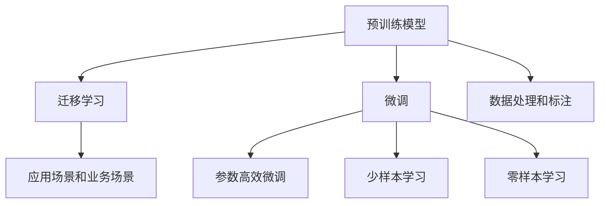

                 

## 1. 背景介绍

### 1.1 问题由来

随着人工智能技术的迅猛发展，大模型（Large Model）已经成为一个炙手可热的领域。大模型是指在深度学习中使用的超高维、超高量的参数化模型，它们通过海量的数据进行预训练，能够进行自然语言处理（NLP）、计算机视觉（CV）、语音识别（ASR）等多项复杂的任务。这些模型具有强大的泛化能力和适应性，能够应对大量新数据的挑战。

大模型在创业领域也逐渐崭露头角。创业公司可以利用大模型开发出更具竞争力的产品，增强自身的市场竞争力。然而，大模型创业也面临着严峻的挑战，如何在技术创新上保持领先地位，构建核心竞争力，是众多创业公司需要思考和解决的问题。

### 1.2 问题核心关键点

技术创新是大模型创业的核心竞争力，这涉及到以下几个关键点：

- **模型训练和优化**：大模型需要高效的训练和优化算法，以保证其在大规模数据集上的收敛速度和精度。
- **数据处理和标注**：大模型需要高质量的数据进行预训练和微调，而数据标注是一个耗时且昂贵的环节。
- **部署和优化**：如何将大模型有效地部署到生产环境，并在性能和资源消耗上实现最优的平衡。
- **应用场景和业务场景**：如何发现并利用大模型在实际应用中的价值，将其与具体业务场景相结合，实现商业化应用。

本文将深入探讨这些核心点，帮助创业公司在大模型领域中实现技术创新和商业成功。

## 2. 核心概念与联系

### 2.1 核心概念概述

大模型创业涉及多个核心概念，包括预训练模型、迁移学习、微调、参数高效微调（PEFT）、少样本学习、零样本学习等。这些概念通过一系列的技术流程相互联系，共同构建了大模型的应用框架。

- **预训练模型**：使用大量无标签数据对模型进行预训练，学习到通用语言表示。
- **迁移学习**：利用预训练模型的知识，将其迁移到下游任务中进行微调，以适应特定应用场景。
- **微调**：在预训练模型的基础上，利用下游任务的标注数据进行有监督学习，优化模型性能。
- **参数高效微调（PEFT）**：仅更新少量模型参数，保留大部分预训练权重，提高微调效率和泛化能力。
- **少样本学习**：在有限的标注样本下，模型能够快速适应新任务，减少标注成本。
- **零样本学习**：模型能够在未见过的任务上，仅通过任务描述进行推理和生成。

这些概念之间的逻辑关系可以用以下Mermaid流程图表示：



这个流程图展示了预训练模型通过迁移学习进入微调，进而通过参数高效微调和少样本学习提高模型效率，最终在特定应用场景中展现零样本学习的能力。

## 3. 核心算法原理 & 具体操作步骤

### 3.1 算法原理概述

大模型创业的核心在于如何利用预训练模型的知识进行技术创新。预训练模型通常是通过在大规模无标签数据上进行自监督学习训练得到的，这些模型能够学习到丰富的语言表示和先验知识。

在迁移学习阶段，创业公司需要选择合适的任务，并准备相应的标注数据。然后，利用预训练模型的知识和下游任务的标注数据，进行微调，使模型能够适应特定应用场景。微调过程通常使用有监督学习算法，如梯度下降法、Adam优化器等，对模型参数进行更新。

参数高效微调（PEFT）是一种特殊的微调方式，它仅更新部分模型参数，保留预训练模型的其他部分，以提高微调效率和模型的泛化能力。PEFT适用于资源有限或标注数据不足的情况。

少样本学习和零样本学习则是在数据稀缺或没有标注数据的情况下，利用预训练模型的语言表示能力，进行推理和生成。这些技术在大模型创业中具有重要的应用价值。

### 3.2 算法步骤详解

1. **数据准备**：
   - 收集下游任务的标注数据集，并将其划分为训练集、验证集和测试集。
   - 使用预训练模型进行数据处理和标注，如文本分词、向量化等。

2. **模型微调**：
   - 在预训练模型基础上，设计适当的任务适配层，如全连接层、softmax层等。
   - 选择合适的优化算法，如AdamW、SGD等，设置学习率、批大小等超参数。
   - 利用标注数据进行微调，通过反向传播算法更新模型参数。

3. **参数高效微调（PEFT）**：
   - 仅更新顶层参数，保持底层参数不变，减少微调过程中参数更新量。
   - 使用较小的学习率，避免破坏预训练权重。

4. **少样本学习**：
   - 在微调过程中，利用少量标注样本训练模型，通过输入格式或提示模板，引导模型学习任务。
   - 在推理过程中，使用预训练模型的语言表示能力，进行推理和生成。

5. **零样本学习**：
   - 通过精心设计的输入文本格式或提示模板，引导大模型进行推理和生成。
   - 在推理过程中，无需标注数据，仅通过任务描述和预训练模型的语言表示能力进行生成。

### 3.3 算法优缺点

大模型创业在技术创新方面具有以下优点：

- **高效泛化能力**：利用预训练模型的知识，在少量标注数据下仍能获得良好的性能。
- **快速迭代**：微调过程快速，能够迅速适应新任务。
- **可扩展性**：通过参数高效微调和少样本学习，适应多种应用场景。

同时，也存在一些缺点：

- **依赖标注数据**：微调效果受标注数据质量和数量的影响较大。
- **模型复杂度**：大模型参数量庞大，训练和推理耗时较长。
- **模型解释性不足**：大模型往往是“黑盒”模型，难以解释其内部工作机制。

## 4. 数学模型和公式 & 详细讲解 & 举例说明

### 4.1 数学模型构建

假设预训练模型为 $M_{\theta}$，其中 $\theta$ 为预训练得到的模型参数。下游任务的标注数据集为 $D=\{(x_i,y_i)\}_{i=1}^N$，其中 $x_i$ 为输入文本，$y_i$ 为标注标签。

微调的目标是找到最优参数 $\hat{\theta}$，使得模型在特定任务上的预测与标注标签一致。

### 4.2 公式推导过程

假设微调任务为二分类任务，其损失函数为交叉熵损失：

$$
\ell(M_{\theta}(x_i),y_i) = -[y_i\log M_{\theta}(x_i) + (1-y_i)\log (1-M_{\theta}(x_i))]
$$

其中 $M_{\theta}(x_i)$ 为模型在输入 $x_i$ 上的预测概率。

微调的优化目标是最小化损失函数：

$$
\mathcal{L}(\theta) = \frac{1}{N} \sum_{i=1}^N \ell(M_{\theta}(x_i),y_i)
$$

利用梯度下降等优化算法，最小化损失函数，更新模型参数：

$$
\theta \leftarrow \theta - \eta \nabla_{\theta}\mathcal{L}(\theta)
$$

其中 $\eta$ 为学习率，$\nabla_{\theta}\mathcal{L}(\theta)$ 为损失函数对参数 $\theta$ 的梯度。

### 4.3 案例分析与讲解

以命名实体识别（NER）任务为例，假设模型在输入 $x_i$ 上的预测概率为 $\hat{y}=M_{\theta}(x_i)$，真实标签为 $y_i$，则交叉熵损失函数为：

$$
\ell(M_{\theta}(x_i),y_i) = -[y_i\log \hat{y} + (1-y_i)\log (1-\hat{y})]
$$

假设模型为BERT，其在输入 $x_i$ 上的输出为向量表示 $h_i$，则模型预测概率为：

$$
\hat{y} = \sigma(h_i)
$$

其中 $\sigma$ 为sigmoid函数。

假设模型为全连接层，其输出为：

$$
\hat{y} = \mathbf{W}h_i + b
$$

其中 $\mathbf{W}$ 和 $b$ 为全连接层的参数。

## 5. 项目实践：代码实例和详细解释说明

### 5.1 开发环境搭建

1. 安装Anaconda：
```bash
conda install anaconda
```

2. 创建虚拟环境：
```bash
conda create --name pytorch-env python=3.8
conda activate pytorch-env
```

3. 安装PyTorch和Transformer库：
```bash
pip install torch torchvision transformers
```

4. 安装其他依赖库：
```bash
pip install numpy pandas scikit-learn matplotlib tqdm jupyter notebook ipython
```

完成环境搭建后，即可开始代码实现。

### 5.2 源代码详细实现

以下是一个基于BERT的命名实体识别任务的微调代码示例：

```python
from transformers import BertForTokenClassification, AdamW
import torch
import numpy as np
from sklearn.metrics import classification_report

# 定义数据集
class NERDataset(Dataset):
    def __init__(self, texts, tags, tokenizer, max_len=128):
        self.texts = texts
        self.tags = tags
        self.tokenizer = tokenizer
        self.max_len = max_len
        
    def __len__(self):
        return len(self.texts)
    
    def __getitem__(self, item):
        text = self.texts[item]
        tags = self.tags[item]
        
        encoding = self.tokenizer(text, return_tensors='pt', max_length=self.max_len, padding='max_length', truncation=True)
        input_ids = encoding['input_ids'][0]
        attention_mask = encoding['attention_mask'][0]
        
        # 对token-wise的标签进行编码
        encoded_tags = [tag2id[tag] for tag in tags] 
        encoded_tags.extend([tag2id['O']] * (self.max_len - len(encoded_tags)))
        labels = torch.tensor(encoded_tags, dtype=torch.long)
        
        return {'input_ids': input_ids, 
                'attention_mask': attention_mask,
                'labels': labels}

# 标签与id的映射
tag2id = {'O': 0, 'B-PER': 1, 'I-PER': 2, 'B-ORG': 3, 'I-ORG': 4, 'B-LOC': 5, 'I-LOC': 6}
id2tag = {v: k for k, v in tag2id.items()}

# 创建dataset
tokenizer = BertTokenizer.from_pretrained('bert-base-cased')

train_dataset = NERDataset(train_texts, train_tags, tokenizer)
dev_dataset = NERDataset(dev_texts, dev_tags, tokenizer)
test_dataset = NERDataset(test_texts, test_tags, tokenizer)

# 定义模型和优化器
model = BertForTokenClassification.from_pretrained('bert-base-cased', num_labels=len(tag2id))

optimizer = AdamW(model.parameters(), lr=2e-5)

# 定义训练和评估函数
device = torch.device('cuda') if torch.cuda.is_available() else torch.device('cpu')
model.to(device)

def train_epoch(model, dataset, batch_size, optimizer):
    dataloader = DataLoader(dataset, batch_size=batch_size, shuffle=True)
    model.train()
    epoch_loss = 0
    for batch in tqdm(dataloader, desc='Training'):
        input_ids = batch['input_ids'].to(device)
        attention_mask = batch['attention_mask'].to(device)
        labels = batch['labels'].to(device)
        model.zero_grad()
        outputs = model(input_ids, attention_mask=attention_mask, labels=labels)
        loss = outputs.loss
        epoch_loss += loss.item()
        loss.backward()
        optimizer.step()
    return epoch_loss / len(dataloader)

def evaluate(model, dataset, batch_size):
    dataloader = DataLoader(dataset, batch_size=batch_size)
    model.eval()
    preds, labels = [], []
    with torch.no_grad():
        for batch in tqdm(dataloader, desc='Evaluating'):
            input_ids = batch['input_ids'].to(device)
            attention_mask = batch['attention_mask'].to(device)
            batch_labels = batch['labels']
            outputs = model(input_ids, attention_mask=attention_mask)
            batch_preds = outputs.logits.argmax(dim=2).to('cpu').tolist()
            batch_labels = batch_labels.to('cpu').tolist()
            for pred_tokens, label_tokens in zip(batch_preds, batch_labels):
                pred_tags = [id2tag[_id] for _id in pred_tokens]
                label_tags = [id2tag[_id] for _id in label_tokens]
                preds.append(pred_tags[:len(label_tags)])
                labels.append(label_tags)
                
    print(classification_report(labels, preds))

# 训练和评估
epochs = 5
batch_size = 16

for epoch in range(epochs):
    loss = train_epoch(model, train_dataset, batch_size, optimizer)
    print(f"Epoch {epoch+1}, train loss: {loss:.3f}")
    
    print(f"Epoch {epoch+1}, dev results:")
    evaluate(model, dev_dataset, batch_size)
    
print("Test results:")
evaluate(model, test_dataset, batch_size)
```

### 5.3 代码解读与分析

该代码实现了使用BERT进行命名实体识别任务的全参数微调。其中，数据处理、模型定义、训练和评估等环节均有详细注释。代码的执行结果展示了模型在训练、验证和测试集上的分类指标，帮助用户了解模型性能。

## 6. 实际应用场景

### 6.1 智能客服系统

智能客服系统是大模型创业中的一个典型应用场景。利用微调后的语言模型，智能客服系统可以提供7x24小时不间断服务，快速响应客户咨询，用自然流畅的语言解答各类常见问题。

### 6.2 金融舆情监测

金融机构需要实时监测市场舆论动向，以便及时应对负面信息传播，规避金融风险。利用微调后的文本分类和情感分析技术，可以实现实时舆情监测，帮助金融机构快速应对潜在风险。

### 6.3 个性化推荐系统

个性化推荐系统利用微调后的语言模型，从用户行为中提取和用户兴趣偏好相关的语言信息，提供更精准、多样的推荐内容。

### 6.4 未来应用展望

随着大模型和微调技术的不断发展，基于微调范式将在更多领域得到应用，为传统行业带来变革性影响。

在智慧医疗领域，微调技术可用于医疗问答、病历分析、药物研发等，提升医疗服务的智能化水平。

在智能教育领域，微调技术可用于作业批改、学情分析、知识推荐等，因材施教，促进教育公平。

在智慧城市治理中，微调技术可用于城市事件监测、舆情分析、应急指挥等环节，提高城市管理的自动化和智能化水平。

## 7. 工具和资源推荐

### 7.1 学习资源推荐

为了帮助开发者系统掌握大模型微调的理论基础和实践技巧，这里推荐一些优质的学习资源：

1. 《Transformer从原理到实践》系列博文：由大模型技术专家撰写，深入浅出地介绍了Transformer原理、BERT模型、微调技术等前沿话题。

2. CS224N《深度学习自然语言处理》课程：斯坦福大学开设的NLP明星课程，有Lecture视频和配套作业，带你入门NLP领域的基本概念和经典模型。

3. 《Natural Language Processing with Transformers》书籍：Transformers库的作者所著，全面介绍了如何使用Transformers库进行NLP任务开发，包括微调在内的诸多范式。

4. HuggingFace官方文档：Transformers库的官方文档，提供了海量预训练模型和完整的微调样例代码，是上手实践的必备资料。

5. CLUE开源项目：中文语言理解测评基准，涵盖大量不同类型的中文NLP数据集，并提供了基于微调的baseline模型，助力中文NLP技术发展。

通过对这些资源的学习实践，相信你一定能够快速掌握大模型微调的精髓，并用于解决实际的NLP问题。

### 7.2 开发工具推荐

高效的开发离不开优秀的工具支持。以下是几款用于大模型微调开发的常用工具：

1. PyTorch：基于Python的开源深度学习框架，灵活动态的计算图，适合快速迭代研究。大部分预训练语言模型都有PyTorch版本的实现。

2. TensorFlow：由Google主导开发的开源深度学习框架，生产部署方便，适合大规模工程应用。同样有丰富的预训练语言模型资源。

3. Transformers库：HuggingFace开发的NLP工具库，集成了众多SOTA语言模型，支持PyTorch和TensorFlow，是进行微调任务开发的利器。

4. Weights & Biases：模型训练的实验跟踪工具，可以记录和可视化模型训练过程中的各项指标，方便对比和调优。与主流深度学习框架无缝集成。

5. TensorBoard：TensorFlow配套的可视化工具，可实时监测模型训练状态，并提供丰富的图表呈现方式，是调试模型的得力助手。

6. Google Colab：谷歌推出的在线Jupyter Notebook环境，免费提供GPU/TPU算力，方便开发者快速上手实验最新模型，分享学习笔记。

合理利用这些工具，可以显著提升大模型微调任务的开发效率，加快创新迭代的步伐。

### 7.3 相关论文推荐

大模型和微调技术的发展源于学界的持续研究。以下是几篇奠基性的相关论文，推荐阅读：

1. Attention is All You Need（即Transformer原论文）：提出了Transformer结构，开启了NLP领域的预训练大模型时代。

2. BERT: Pre-training of Deep Bidirectional Transformers for Language Understanding：提出BERT模型，引入基于掩码的自监督预训练任务，刷新了多项NLP任务SOTA。

3. Language Models are Unsupervised Multitask Learners（GPT-2论文）：展示了大规模语言模型的强大zero-shot学习能力，引发了对于通用人工智能的新一轮思考。

4. Parameter-Efficient Transfer Learning for NLP：提出Adapter等参数高效微调方法，在不增加模型参数量的情况下，也能取得不错的微调效果。

5. Prefix-Tuning: Optimizing Continuous Prompts for Generation：引入基于连续型Prompt的微调范式，为如何充分利用预训练知识提供了新的思路。

6. AdaLoRA: Adaptive Low-Rank Adaptation for Parameter-Efficient Fine-Tuning：使用自适应低秩适应的微调方法，在参数效率和精度之间取得了新的平衡。

这些论文代表了大模型微调技术的发展脉络。通过学习这些前沿成果，可以帮助研究者把握学科前进方向，激发更多的创新灵感。

## 8. 总结：未来发展趋势与挑战

### 8.1 总结

本文对大模型创业中的技术创新进行了全面系统的介绍。首先阐述了基于监督学习的大语言模型微调方法的基本原理和核心步骤，详细讲解了模型训练和优化算法、数据处理和标注、微调过程及参数高效微调等关键环节。通过深入探讨大模型创业中的技术创新点，帮助创业公司在大模型领域中实现技术突破和商业成功。

通过本文的系统梳理，可以看到，大模型创业中的技术创新是大模型成功的关键，它不仅能够提升模型的性能和效率，还能够为创业公司带来新的商业模式和市场机会。未来，伴随预训练语言模型和微调方法的持续演进，大模型创业将呈现更加多样化和高效化的趋势。

### 8.2 未来发展趋势

展望未来，大模型创业在技术创新方面将呈现以下几个发展趋势：

1. **模型规模持续增大**：随着算力成本的下降和数据规模的扩张，预训练语言模型的参数量还将持续增长。超大规模语言模型蕴含的丰富语言知识，有望支撑更加复杂多变的下游任务微调。

2. **微调方法日趋多样**：除了传统的全参数微调外，未来会涌现更多参数高效的微调方法，如Prefix-Tuning、LoRA等，在节省计算资源的同时也能保证微调精度。

3. **持续学习成为常态**：随着数据分布的不断变化，微调模型也需要持续学习新知识以保持性能。如何在不遗忘原有知识的同时，高效吸收新样本信息，将成为重要的研究课题。

4. **标注样本需求降低**：受启发于提示学习(Prompt-based Learning)的思路，未来的微调方法将更好地利用大模型的语言表示能力，通过更加巧妙的任务描述，在更少的标注样本上也能实现理想的微调效果。

5. **多模态微调崛起**：当前的微调主要聚焦于纯文本数据，未来会进一步拓展到图像、视频、语音等多模态数据微调。多模态信息的融合，将显著提升语言模型对现实世界的理解和建模能力。

6. **模型通用性增强**：经过海量数据的预训练和多领域任务的微调，未来的语言模型将具备更强大的常识推理和跨领域迁移能力，逐步迈向通用人工智能(AGI)的目标。

以上趋势凸显了大模型微调技术的广阔前景。这些方向的探索发展，必将进一步提升NLP系统的性能和应用范围，为人类认知智能的进化带来深远影响。

### 8.3 面临的挑战

尽管大模型微调技术已经取得了瞩目成就，但在迈向更加智能化、普适化应用的过程中，它仍面临着诸多挑战：

1. **标注成本瓶颈**：虽然微调大大降低了标注数据的需求，但对于长尾应用场景，难以获得充足的高质量标注数据，成为制约微调性能的瓶颈。如何进一步降低微调对标注样本的依赖，将是一大难题。

2. **模型鲁棒性不足**：当前微调模型面对域外数据时，泛化性能往往大打折扣。对于测试样本的微小扰动，微调模型的预测也容易发生波动。如何提高微调模型的鲁棒性，避免灾难性遗忘，还需要更多理论和实践的积累。

3. **推理效率有待提高**：大规模语言模型虽然精度高，但在实际部署时往往面临推理速度慢、内存占用大等效率问题。如何在保证性能的同时，简化模型结构，提升推理速度，优化资源占用，将是重要的优化方向。

4. **可解释性亟需加强**：当前微调模型更像是“黑盒”模型，难以解释其内部工作机制和决策逻辑。对于医疗、金融等高风险应用，算法的可解释性和可审计性尤为重要。如何赋予微调模型更强的可解释性，将是亟待攻克的难题。

5. **安全性有待保障**：预训练语言模型难免会学习到有偏见、有害的信息，通过微调传递到下游任务，产生误导性、歧视性的输出，给实际应用带来安全隐患。如何从数据和算法层面消除模型偏见，避免恶意用途，确保输出的安全性，也将是重要的研究课题。

6. **知识整合能力不足**：现有的微调模型往往局限于任务内数据，难以灵活吸收和运用更广泛的先验知识。如何让微调过程更好地与外部知识库、规则库等专家知识结合，形成更加全面、准确的信息整合能力，还有很大的想象空间。

正视微调面临的这些挑战，积极应对并寻求突破，将是大模型微调走向成熟的必由之路。相信随着学界和产业界的共同努力，这些挑战终将一一被克服，大模型微调必将在构建人机协同的智能时代中扮演越来越重要的角色。

### 8.4 研究展望

面对大模型微调面临的挑战，未来的研究需要在以下几个方面寻求新的突破：

1. **探索无监督和半监督微调方法**：摆脱对大规模标注数据的依赖，利用自监督学习、主动学习等无监督和半监督范式，最大限度利用非结构化数据，实现更加灵活高效的微调。

2. **研究参数高效和计算高效的微调范式**：开发更加参数高效的微调方法，在固定大部分预训练参数的同时，只更新极少量的任务相关参数。同时优化微调模型的计算图，减少前向传播和反向传播的资源消耗，实现更加轻量级、实时性的部署。

3. **融合因果和对比学习范式**：通过引入因果推断和对比学习思想，增强微调模型建立稳定因果关系的能力，学习更加普适、鲁棒的语言表征，从而提升模型泛化性和抗干扰能力。

4. **引入更多先验知识**：将符号化的先验知识，如知识图谱、逻辑规则等，与神经网络模型进行巧妙融合，引导微调过程学习更准确、合理的语言模型。同时加强不同模态数据的整合，实现视觉、语音等多模态信息与文本信息的协同建模。

5. **结合因果分析和博弈论工具**：将因果分析方法引入微调模型，识别出模型决策的关键特征，增强输出解释的因果性和逻辑性。借助博弈论工具刻画人机交互过程，主动探索并规避模型的脆弱点，提高系统稳定性。

6. **纳入伦理道德约束**：在模型训练目标中引入伦理导向的评估指标，过滤和惩罚有偏见、有害的输出倾向。同时加强人工干预和审核，建立模型行为的监管机制，确保输出符合人类价值观和伦理道德。

这些研究方向的探索，必将引领大语言模型微调技术迈向更高的台阶，为构建安全、可靠、可解释、可控的智能系统铺平道路。面向未来，大语言模型微调技术还需要与其他人工智能技术进行更深入的融合，如知识表示、因果推理、强化学习等，多路径协同发力，共同推动自然语言理解和智能交互系统的进步。只有勇于创新、敢于突破，才能不断拓展语言模型的边界，让智能技术更好地造福人类社会。

## 9. 附录：常见问题与解答

**Q1：大模型创业是否适用于所有NLP任务？**

A: 大模型创业在大多数NLP任务上都能取得不错的效果，特别是对于数据量较小的任务。但对于一些特定领域的任务，如医学、法律等，仅仅依靠通用语料预训练的模型可能难以很好地适应。此时需要在特定领域语料上进一步预训练，再进行微调，才能获得理想效果。此外，对于一些需要时效性、个性化很强的任务，如对话、推荐等，微调方法也需要针对性的改进优化。

**Q2：微调过程中如何选择合适的学习率？**

A: 微调的学习率一般要比预训练时小1-2个数量级，如果使用过大的学习率，容易破坏预训练权重，导致过拟合。一般建议从1e-5开始调参，逐步减小学习率，直至收敛。也可以使用warmup策略，在开始阶段使用较小的学习率，再逐渐过渡到预设值。需要注意的是，不同的优化器(如AdamW、Adafactor等)以及不同的学习率调度策略，可能需要设置不同的学习率阈值。

**Q3：采用大模型微调时会面临哪些资源瓶颈？**

A: 目前主流的预训练大模型动辄以亿计的参数规模，对算力、内存、存储都提出了很高的要求。GPU/TPU等高性能设备是必不可少的，但即便如此，超大批次的训练和推理也可能遇到显存不足的问题。因此需要采用一些资源优化技术，如梯度积累、混合精度训练、模型并行等，来突破硬件瓶颈。同时，模型的存储和读取也可能占用大量时间和空间，需要采用模型压缩、稀疏化存储等方法进行优化。

**Q4：如何缓解微调过程中的过拟合问题？**

A: 过拟合是微调面临的主要挑战，尤其是在标注数据不足的情况下。常见的缓解策略包括：

1. 数据增强：通过回译、近义替换等方式扩充训练集
2. 正则化：使用L2正则、Dropout、Early Stopping等避免过拟合
3. 对抗训练：引入对抗样本，提高模型鲁棒性
4. 参数高效微调（PEFT）：仅更新顶层参数，保持底层参数不变，减少微调过程中参数更新量
5. 多模型集成：训练多个微调模型，取平均输出，抑制过拟合

这些策略往往需要根据具体任务和数据特点进行灵活组合。只有在数据、模型、训练、推理等各环节进行全面优化，才能最大限度地发挥大模型微调的威力。

**Q5：微调模型在落地部署时需要注意哪些问题？**

A: 将微调模型转化为实际应用，还需要考虑以下因素：

1. 模型裁剪：去除不必要的层和参数，减小模型尺寸，加快推理速度
2. 量化加速：将浮点模型转为定点模型，压缩存储空间，提高计算效率
3. 服务化封装：将模型封装为标准化服务接口，便于集成调用
4. 弹性伸缩：根据请求流量动态调整资源配置，平衡服务质量和成本
5. 监控告警：实时采集系统指标，设置异常告警阈值，确保服务稳定性
6. 安全防护：采用访问鉴权、数据脱敏等措施，保障数据和模型安全

大模型微调为NLP应用开启了广阔的想象空间，但如何将强大的性能转化为稳定、高效、安全的业务价值，还需要工程实践的不断打磨。唯有从数据、算法、工程、业务等多个维度协同发力，才能真正实现人工智能技术在垂直行业的规模化落地。总之，微调需要开发者根据具体任务，不断迭代和优化模型、数据和算法，方能得到理想的效果。

---

作者：禅与计算机程序设计艺术 / Zen and the Art of Computer Programming

