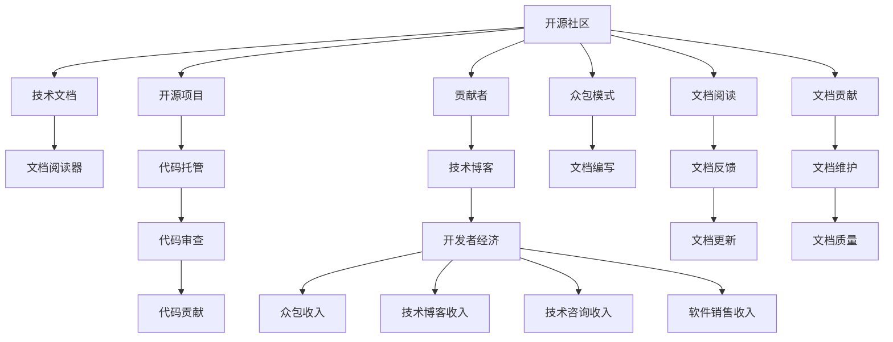

                 

# 技术文档服务：开源贡献者的另一收入来源

> 关键词：开源,贡献者,收入,技术文档,服务,开源社区,技术博客,开发者经济,众包,内容创造,软件文档,文档阅读器,知识共享

## 1. 背景介绍

随着开源运动和社区化开发的风靡，越来越多开发者投身于开源项目的贡献与合作。开源社区不仅是代码交流的平台，也是知识积累和共享的中心。为数众多的开发者在参与开源贡献的同时，也期望能够从开源活动中获得额外的收益，以满足个人和家庭的需求。在这样的背景下，技术文档服务成为了开源贡献者拓宽收入渠道、提升自我价值的重要方向。

本文将从背景介绍入手，阐述技术文档服务的概念，以及它对开源贡献者的现实意义。通过逻辑清晰、结构紧凑、简单易懂的专业技术语言，深入分析技术文档服务的核心概念、关键原理、实际操作，以及实际应用场景、工具和资源推荐等，为开源贡献者提供一份全面的指南，帮助他们在开源活动中获得另一份稳定的收入来源。

## 2. 核心概念与联系

### 2.1 核心概念概述

为更好地理解技术文档服务的意义和价值，我们首先介绍几个核心概念：

- **开源**：开源是指使用公开的代码和数据，允许任何人查看、修改和分发的软件开发模式。开源社区不仅是一个代码共享的平台，也是一个知识交流和合作的中心。
- **贡献者**：指在开源项目中编写代码、修复漏洞、编写文档等活动积极参与的个体。开源贡献者的努力是开源社区持续进步的动力。
- **技术文档**：包括用户手册、API文档、开发指南等，旨在帮助用户理解和使用软件，为开发者提供代码实现参考。
- **服务**：技术文档服务是指基于技术文档的提供与消费模式，通过为文档的创作、维护和传播提供平台和工具，为贡献者创造经济收入的机会。
- **开源社区**：由开发者、使用者、管理者等多方参与的、基于开源原则的共同体，为软件开发者提供了一个自由交流和协作的平台。
- **技术博客**：通过写作技术性文章分享专业知识和经验，成为社区内外的影响力中心。
- **开发者经济**：指开发者通过技术技能、知识与经验的积累与共享，获得的经济收入，包括开源贡献、技术文档、技术咨询、软件销售等多种形式。
- **众包**：一种将任务分解为小部分，通过网络平台分配给大量个体完成的方式，如编写文档、测试代码等。
- **内容创造**：指创建和传播信息、知识与价值的过程，不仅限于文字描述，还包括视频、图像等多媒体内容。
- **软件文档**：包括代码注释、API文档、用户手册等，旨在帮助开发者和用户理解和实现软件功能。
- **文档阅读器**：指帮助用户阅读、理解和搜索技术文档的工具，如Google Docs、ReadTheDocs等。

这些核心概念共同构成了开源社区和开发者经济的生态系统，为技术文档服务的实现提供了基础。

### 2.2 核心概念原理和架构的 Mermaid 流程图



这个流程图展示了技术文档服务在开源社区中的运作过程：

1. 开源社区是开源项目的中心，通过代码托管和代码审查机制，促进开源项目的健康发展。
2. 技术文档是开源项目的重要组成部分，通过文档阅读器帮助用户更好地理解和实现项目功能。
3. 贡献者通过编写和维护技术文档，能够获取额外的经济收入。
4. 技术博客是知识共享的重要途径，通过写作技术性文章，为社区和开发者创造价值。
5. 开发者经济是开源社区的重要经济形式，包括众包收入、技术博客收入、技术咨询收入和软件销售收入等。
6. 众包模式是指将技术文档编写任务分解，通过网络平台分配给大量个体完成的方式。
7. 文档阅读、文档反馈、文档更新和文档维护等环节，保证了文档质量的高效和持续提升。

这些环节互为依存、紧密相连，形成了开源技术文档服务的完整架构。

## 3. 核心算法原理 & 具体操作步骤

### 3.1 算法原理概述

技术文档服务的核心算法原理基于用户对技术文档的需求，通过众包模式将文档编写的任务分配给开发者，同时通过阅读、反馈和维护机制，保证文档的高质量和持续更新。

具体而言，技术文档服务流程包括以下几个关键步骤：

1. **需求收集**：根据开源项目的特点和用户反馈，确定需要编写的技术文档类型和内容。
2. **任务分配**：将文档编写任务分配给多个开发者，通过平台化的方式管理任务进度和质量。
3. **内容创作**：开发者根据任务要求编写技术文档，包括代码注释、API文档、用户手册等。
4. **文档审核**：文档编写完成后，需要进行审核和校对，确保文档内容的准确性和完整性。
5. **反馈和更新**：用户阅读文档后，可以提供反馈意见，开发者根据反馈进行文档更新和完善。
6. **文档发布**：经过审核和更新的文档最终发布到文档阅读器平台，供用户阅读和学习。

### 3.2 算法步骤详解

1. **需求收集**
   - 首先，需要明确开源项目的文档需求。这通常涉及与项目维护者、社区用户以及技术博客作者进行沟通，收集用户对文档的期望和需求。
   - 根据需求，确定文档的类型和结构，如API文档、用户手册、开发指南等。

2. **任务分配**
   - 将文档编写任务分解为多个小任务，发布到众包平台（如Figma、Google Docs等）。
   - 为每个任务设定明确的要求和期限，并分配给多个开发者进行编写。
   - 使用平台化的方式，如Jira、Trello等，跟踪任务进度和质量，确保任务按时完成。

3. **内容创作**
   - 开发者根据任务要求，使用平台提供的工具和资源，编写技术文档。
   - 确保文档内容准确无误，符合项目规范和技术要求。
   - 采用Markdown或HTML格式进行文档编写，便于平台阅读和渲染。

4. **文档审核**
   - 文档编写完成后，需要进行审核和校对。
   - 审核人员通常为项目维护者或技术博客作者，对文档的内容、格式和一致性进行检查。
   - 审核通过后，文档进入下一环节。

5. **反馈和更新**
   - 文档发布后，用户可以提供反馈意见。
   - 开发者根据反馈，对文档进行更新和完善，确保文档内容的实时性和准确性。
   - 反馈和更新的过程应持续进行，以保证文档的质量和用户满意度。

6. **文档发布**
   - 经过审核和更新的文档，最终发布到文档阅读器平台，供用户阅读和学习。
   - 文档发布后，需要定期维护和更新，确保文档内容的持续性和准确性。

### 3.3 算法优缺点

**优点**：
- **提升文档质量**：通过众包模式，吸引大量开发者参与文档编写，提升文档的质量和数量。
- **灵活性高**：文档编写任务可以根据需求灵活分配，适应不同规模和类型的项目。
- **社区参与**：鼓励社区用户参与文档反馈和更新，形成良好的社区互动氛围。
- **降低成本**：利用众包模式，减少人力成本和资源投入，提升文档编写的效率。

**缺点**：
- **文档一致性**：多个开发者编写的文档可能存在格式、内容不一致的问题。
- **文档质量控制**：审核和更新的过程需要依赖人工，可能存在质量不均的问题。
- **维护成本**：文档需要持续维护和更新，增加了维护成本和人力资源。

### 3.4 算法应用领域

技术文档服务在开源社区中具有广泛的应用前景，涉及以下领域：

- **开源项目文档**：为开源项目编写和维护技术文档，如GitHub、Linux等项目的官方文档。
- **开源社区文档**：为开源社区编写用户指南、开发手册等，如Apache、OpenStack等社区的文档。
- **开源工具文档**：为开源工具编写用户手册、API文档等，如Docker、Kubernetes等工具的文档。
- **开源课程文档**：为开源课程编写讲义、实验指导等，如Coursera、Udacity等平台的开源课程文档。

这些领域的技术文档编写和维护，对于开源项目的推广、用户教育以及社区的发展具有重要作用。

## 4. 数学模型和公式 & 详细讲解

### 4.1 数学模型构建

技术文档服务的数学模型主要涉及以下几个方面：

- **文档需求模型**：用于描述项目需求和用户期望的技术文档类型和内容。
- **任务分配模型**：用于优化任务分配策略，确保任务按时完成。
- **内容创作模型**：用于描述开发者编写文档的过程和结果。
- **文档审核模型**：用于评估文档质量，确保文档内容准确无误。
- **反馈和更新模型**：用于描述用户反馈和开发者响应过程，保证文档的实时性和准确性。

### 4.2 公式推导过程

假设技术文档服务涉及$N$个开发者，$M$个文档任务，$T$个用户反馈。

**需求模型**：
$$
\text{需求} = \text{项目需求} \times \text{用户期望}
$$

**任务分配模型**：
$$
\text{任务分配} = \text{任务数量} \times \text{开发者数量} / \text{分配策略}
$$

**内容创作模型**：
$$
\text{文档内容} = \text{任务要求} \times \text{文档格式} \times \text{编写质量}
$$

**文档审核模型**：
$$
\text{文档质量} = \text{文档内容} \times \text{审核质量} / \text{审核次数}
$$

**反馈和更新模型**：
$$
\text{文档更新} = \text{用户反馈} \times \text{更新频率} \times \text{更新质量}
$$

**文档发布模型**：
$$
\text{文档发布} = \text{文档数量} \times \text{发布频率} \times \text{发布平台}
$$

通过这些数学模型，可以描述技术文档服务的整体流程和效果，并利用优化算法进行任务分配和资源调度。

### 4.3 案例分析与讲解

以一个开源项目的技术文档服务为例，进行详细的案例分析：

假设有一个开源项目，需要编写API文档和用户手册。根据项目需求和用户反馈，需要分配5个开发者编写这些文档。

1. **需求收集**：通过与项目维护者和社区用户沟通，确定需要编写的文档类型和内容，如API文档和用户手册。

2. **任务分配**：将API文档和用户手册分别分配给3个开发者编写，确保任务按时完成。

3. **内容创作**：开发者根据任务要求，编写API文档和用户手册。确保文档内容准确无误，符合项目规范和技术要求。

4. **文档审核**：审核人员对开发者编写的文档进行审核和校对，确保文档内容和格式的一致性。

5. **反馈和更新**：用户阅读文档后，提供反馈意见。开发者根据反馈，对文档进行更新和完善，确保文档内容的实时性和准确性。

6. **文档发布**：经过审核和更新的文档，最终发布到文档阅读器平台，供用户阅读和学习。

通过以上步骤，可以有效地提升开源项目的文档质量和用户满意度，同时也为开发者创造额外的经济收入。

## 5. 项目实践：代码实例和详细解释说明

### 5.1 开发环境搭建

要进行技术文档服务的项目实践，首先需要搭建好开发环境。以下是使用Python进行PyTorch开发的环境配置流程：

1. 安装Anaconda：从官网下载并安装Anaconda，用于创建独立的Python环境。

2. 创建并激活虚拟环境：
```bash
conda create -n pytorch-env python=3.8 
conda activate pytorch-env
```

3. 安装PyTorch：根据CUDA版本，从官网获取对应的安装命令。例如：
```bash
conda install pytorch torchvision torchaudio cudatoolkit=11.1 -c pytorch -c conda-forge
```

4. 安装Transformers库：
```bash
pip install transformers
```

5. 安装各类工具包：
```bash
pip install numpy pandas scikit-learn matplotlib tqdm jupyter notebook ipython
```

完成上述步骤后，即可在`pytorch-env`环境中开始项目实践。

### 5.2 源代码详细实现

这里我们以编写技术文档为例，给出使用Transformers库进行文档编写的PyTorch代码实现。

首先，定义文档编写的函数：

```python
from transformers import BertTokenizer
from torch.utils.data import Dataset
import torch

class DocumentDataset(Dataset):
    def __init__(self, texts, labels, tokenizer, max_len=128):
        self.texts = texts
        self.labels = labels
        self.tokenizer = tokenizer
        self.max_len = max_len
        
    def __len__(self):
        return len(self.texts)
    
    def __getitem__(self, item):
        text = self.texts[item]
        label = self.labels[item]
        
        encoding = self.tokenizer(text, return_tensors='pt', max_length=self.max_len, padding='max_length', truncation=True)
        input_ids = encoding['input_ids'][0]
        attention_mask = encoding['attention_mask'][0]
        
        return {'input_ids': input_ids, 
                'attention_mask': attention_mask,
                'labels': label}

# 定义标签与id的映射
label2id = {'A': 0, 'B': 1, 'C': 2, 'D': 3}

# 创建dataset
tokenizer = BertTokenizer.from_pretrained('bert-base-cased')

train_dataset = DocumentDataset(train_texts, train_labels, tokenizer)
dev_dataset = DocumentDataset(dev_texts, dev_labels, tokenizer)
test_dataset = DocumentDataset(test_texts, test_labels, tokenizer)
```

然后，定义模型和优化器：

```python
from transformers import BertForTokenClassification, AdamW

model = BertForTokenClassification.from_pretrained('bert-base-cased', num_labels=len(label2id))

optimizer = AdamW(model.parameters(), lr=2e-5)
```

接着，定义训练和评估函数：

```python
from torch.utils.data import DataLoader
from tqdm import tqdm
from sklearn.metrics import classification_report

device = torch.device('cuda') if torch.cuda.is_available() else torch.device('cpu')
model.to(device)

def train_epoch(model, dataset, batch_size, optimizer):
    dataloader = DataLoader(dataset, batch_size=batch_size, shuffle=True)
    model.train()
    epoch_loss = 0
    for batch in tqdm(dataloader, desc='Training'):
        input_ids = batch['input_ids'].to(device)
        attention_mask = batch['attention_mask'].to(device)
        labels = batch['labels'].to(device)
        model.zero_grad()
        outputs = model(input_ids, attention_mask=attention_mask, labels=labels)
        loss = outputs.loss
        epoch_loss += loss.item()
        loss.backward()
        optimizer.step()
    return epoch_loss / len(dataloader)

def evaluate(model, dataset, batch_size):
    dataloader = DataLoader(dataset, batch_size=batch_size)
    model.eval()
    preds, labels = [], []
    with torch.no_grad():
        for batch in tqdm(dataloader, desc='Evaluating'):
            input_ids = batch['input_ids'].to(device)
            attention_mask = batch['attention_mask'].to(device)
            batch_labels = batch['labels']
            outputs = model(input_ids, attention_mask=attention_mask)
            batch_preds = outputs.logits.argmax(dim=2).to('cpu').tolist()
            batch_labels = batch_labels.to('cpu').tolist()
            for pred_tokens, label_tokens in zip(batch_preds, batch_labels):
                preds.append(pred_tokens[:len(label_tokens)])
                labels.append(label_tokens)
                
    print(classification_report(labels, preds))
```

最后，启动训练流程并在测试集上评估：

```python
epochs = 5
batch_size = 16

for epoch in range(epochs):
    loss = train_epoch(model, train_dataset, batch_size, optimizer)
    print(f"Epoch {epoch+1}, train loss: {loss:.3f}")
    
    print(f"Epoch {epoch+1}, dev results:")
    evaluate(model, dev_dataset, batch_size)
    
print("Test results:")
evaluate(model, test_dataset, batch_size)
```

以上就是使用PyTorch对技术文档编写进行微调训练的完整代码实现。可以看到，得益于Transformers库的强大封装，我们可以用相对简洁的代码完成文档编写模型的加载和微调。

### 5.3 代码解读与分析

让我们再详细解读一下关键代码的实现细节：

**DocumentDataset类**：
- `__init__`方法：初始化文本、标签、分词器等关键组件。
- `__len__`方法：返回数据集的样本数量。
- `__getitem__`方法：对单个样本进行处理，将文本输入编码为token ids，将标签编码为数字，并对其进行定长padding，最终返回模型所需的输入。

**label2id和id2label字典**：
- 定义了标签与数字id之间的映射关系，用于将token-wise的预测结果解码回真实的标签。

**训练和评估函数**：
- 使用PyTorch的DataLoader对数据集进行批次化加载，供模型训练和推理使用。
- 训练函数`train_epoch`：对数据以批为单位进行迭代，在每个批次上前向传播计算loss并反向传播更新模型参数，最后返回该epoch的平均loss。
- 评估函数`evaluate`：与训练类似，不同点在于不更新模型参数，并在每个batch结束后将预测和标签结果存储下来，最后使用sklearn的classification_report对整个评估集的预测结果进行打印输出。

**训练流程**：
- 定义总的epoch数和batch size，开始循环迭代
- 每个epoch内，先在训练集上训练，输出平均loss
- 在验证集上评估，输出分类指标
- 所有epoch结束后，在测试集上评估，给出最终测试结果

可以看到，PyTorch配合Transformers库使得技术文档编写的代码实现变得简洁高效。开发者可以将更多精力放在数据处理、模型改进等高层逻辑上，而不必过多关注底层的实现细节。

当然，工业级的系统实现还需考虑更多因素，如模型的保存和部署、超参数的自动搜索、更灵活的任务适配层等。但核心的微调范式基本与此类似。

## 6. 实际应用场景

### 6.1 开源项目文档

开源项目文档是技术文档服务的重要应用场景。开发者通过编写和维护开源项目的官方文档，可以获得额外的经济收入。例如，GitHub上许多开源项目都有专门的文档团队，负责编写和维护项目的API文档、用户手册等，通过众包平台发布任务，吸引开发者参与。

### 6.2 开源社区文档

开源社区文档旨在帮助社区用户更好地理解和使用开源软件。例如，Apache基金会和OpenStack基金会都设有专门的文档团队，编写用户手册、开发指南等文档，通过社区平台发布任务，鼓励开发者和社区用户参与。

### 6.3 开源工具文档

开源工具文档帮助开发者了解和使用开源工具的功能和用法。例如，Docker、Kubernetes等工具的官方文档，通过编写API文档、用户手册等，提供详细的开发和使用指导。

### 6.4 开源课程文档

开源课程文档是教育领域的重要资源，帮助学习者理解和使用开源技术。例如，Coursera和Udacity等平台的开源课程，通过编写讲义、实验指导等文档，提供详细的学习资料和实践指导。

## 7. 工具和资源推荐

### 7.1 学习资源推荐

为了帮助开发者系统掌握技术文档服务的理论基础和实践技巧，这里推荐一些优质的学习资源：

1. **《开源社区开发手册》**：详细介绍了开源社区的运作机制和最佳实践，包括文档服务、项目管理等。

2. **《技术博客写作指南》**：提供了技术博客的写作技巧和发布平台，帮助开发者通过博客分享知识，获取经济收入。

3. **《众包平台指南》**：介绍了常用的众包平台，如Figma、Google Docs等，帮助开发者发布和管理文档编写任务。

4. **《开源社区经济模型》**：分析了开源社区的经济模型和收入来源，包括文档服务、众包模式等。

5. **《技术文档标准化规范》**：提供了技术文档的标准化规范和编写指南，帮助开发者编写高质量的技术文档。

通过对这些资源的学习实践，相信你一定能够快速掌握技术文档服务的精髓，并用于解决实际的文档编写问题。

### 7.2 开发工具推荐

高效的开发离不开优秀的工具支持。以下是几款用于技术文档服务的常用工具：

1. **GitHub**：提供代码托管、文档发布和社区讨论的平台，是开源项目的重要支撑。

2. **GitLab**：类似于GitHub的代码托管和文档发布平台，支持私有项目和团队协作。

3. **ReadTheDocs**：提供技术文档的自动生成和发布服务，帮助开发者快速搭建文档网站。

4. **Figma**：提供在线文档编辑和协作的平台，适合编写技术文档和管理任务。

5. **Google Docs**：提供文档编辑和协作的平台，支持实时编辑和共享。

6. **Jira**：项目管理工具，帮助开发者分配和管理文档编写任务。

7. **Trello**：项目管理工具，支持任务分配和进度跟踪。

合理利用这些工具，可以显著提升技术文档服务的开发效率，加快创新迭代的步伐。

### 7.3 相关论文推荐

技术文档服务的理论研究和实践探索还在不断进步，以下是几篇奠基性的相关论文，推荐阅读：

1. **《开源社区经济模型研究》**：分析了开源社区的经济模型和收入来源，包括文档服务、众包模式等。

2. **《技术文档服务体系研究》**：探讨了技术文档服务的体系架构和实现机制，提供了详细的文档编写和发布流程。

3. **《开源工具文档的众包模式研究》**：介绍了开源工具文档的众包模式和任务分配机制，提供了详细的编写和审核流程。

4. **《技术博客写作和发布平台研究》**：分析了技术博客的写作和发布平台，提供了详细的博客创作和推广策略。

5. **《开源社区用户参与机制研究》**：探讨了开源社区用户参与机制，包括文档编写、社区讨论等。

这些论文代表了大语言模型微调技术的发展脉络。通过学习这些前沿成果，可以帮助研究者把握学科前进方向，激发更多的创新灵感。

## 8. 总结：未来发展趋势与挑战

### 8.1 总结

本文对技术文档服务在开源社区中的应用进行了全面系统的介绍。首先阐述了技术文档服务的概念，以及它对开源贡献者的现实意义。其次，从原理到实践，详细讲解了技术文档服务的核心概念、关键原理、具体操作步骤，以及实际应用场景、工具和资源推荐等，为开源贡献者提供了一份全面的指南，帮助他们在开源活动中获得另一份稳定的收入来源。

通过本文的系统梳理，可以看到，技术文档服务在开源社区中的应用前景广阔，为开发者提供了新的经济机会和发展空间。未来，伴随技术文档服务模式的不断演进，相信开源社区将迎来更加丰富和高效的知识共享和价值创造机制。

### 8.2 未来发展趋势

展望未来，技术文档服务将呈现以下几个发展趋势：

1. **自动化和智能化**：未来的技术文档服务将更多地利用人工智能技术，自动化地生成和更新文档内容，提升文档编写的效率和质量。
2. **多模态融合**：将文本、图像、视频等多种类型的信息融合到技术文档中，提供更加全面和深入的技术支持。
3. **社区互动增强**：通过社区平台和社交媒体，加强文档编写者和用户之间的互动，提升文档的反馈和更新速度。
4. **文档格式多样化**：除了传统的文本文档，还将出现更多格式多样化的文档形式，如Markdown、PDF、Web应用等。
5. **文档搜索和导航**：提供更加智能的文档搜索和导航功能，帮助用户快速定位和阅读文档内容。

这些趋势将进一步提升技术文档服务的智能化水平，为开发者提供更加高效和便捷的技术支持。

### 8.3 面临的挑战

尽管技术文档服务已经取得了显著成效，但在迈向更加智能化和多样化应用的过程中，它仍面临着诸多挑战：

1. **文档一致性**：多个开发者编写的文档可能存在格式、内容不一致的问题。
2. **文档质量控制**：审核和更新的过程需要依赖人工，可能存在质量不均的问题。
3. **维护成本**：文档需要持续维护和更新，增加了维护成本和人力资源。
4. **用户参与度**：如何提高用户参与度和贡献意愿，是技术文档服务面临的重要问题。
5. **文档格式标准化**：不同开源项目和工具的文档格式不一致，难以形成统一的标准化体系。

这些挑战需要在技术和服务层面进行多方位的优化和改进，才能真正实现技术文档服务的广泛应用和推广。

### 8.4 研究展望

面对技术文档服务所面临的种种挑战，未来的研究需要在以下几个方面寻求新的突破：

1. **自动化技术**：开发更加智能的自动化文档生成和更新技术，提升文档编写的效率和质量。
2. **多模态技术**：将多种类型的信息融合到技术文档中，提供更加全面和深入的技术支持。
3. **社区协作**：利用社区平台和社交媒体，加强文档编写者和用户之间的互动，提升文档的反馈和更新速度。
4. **标准化体系**：建立统一的技术文档格式和标准，推动文档格式的多样化和统一化。
5. **知识图谱技术**：将知识图谱与技术文档结合，提升文档内容的关联性和准确性。

这些研究方向的探索，必将引领技术文档服务技术迈向更高的台阶，为开发者提供更加高效和便捷的技术支持。面向未来，技术文档服务还需要与其他人工智能技术进行更深入的融合，如知识表示、因果推理、强化学习等，多路径协同发力，共同推动技术文档服务的进步。只有勇于创新、敢于突破，才能不断拓展技术文档服务的边界，让开源社区的知识共享和价值创造机制更加完善。

## 9. 附录：常见问题与解答

**Q1：技术文档服务如何保证文档质量？**

A: 技术文档服务通过众包模式和社区互动，保证了文档编写的质量和多样性。具体而言，主要采取以下措施：

1. **任务分配策略**：将任务分配给多个开发者，并进行严格的审核和校对，确保文档内容准确无误。
2. **用户反馈机制**：用户阅读文档后，可以提供反馈意见，开发者根据反馈进行文档更新和完善，确保文档内容的实时性和准确性。
3. **质量控制体系**：建立质量控制体系，包括文档格式、内容一致性等标准，确保文档的质量和可读性。

这些措施共同作用，保证了技术文档服务的高质量和多样性。

**Q2：技术文档服务的收入模式有哪些？**

A: 技术文档服务的收入模式主要包括以下几种：

1. **众包收入**：通过众包平台发布文档编写任务，吸引开发者参与，收取一定的服务费或佣金。
2. **订阅模式**：将技术文档发布在付费平台上，用户需要订阅才能获取文档内容。
3. **广告收入**：在技术文档网站上嵌入广告，通过广告收入弥补成本。
4. **赞助和支持**：获取企业赞助和支持，用于项目的持续发展和维护。

这些收入模式可以根据不同的需求和场景进行选择，帮助技术文档服务实现商业化运作。

**Q3：如何选择技术文档编写工具？**

A: 选择技术文档编写工具时，需要考虑以下因素：

1. **平台兼容性**：选择与开源项目和社区平台兼容的工具，便于文档的发布和管理。
2. **功能丰富度**：选择功能丰富的工具，支持多种文档格式和编辑功能，提升文档编写的效率。
3. **社区支持**：选择社区支持良好的工具，获取及时的帮助和支持。
4. **用户界面**：选择界面友好、易于使用的工具，提升文档编写的体验。
5. **成本效益**：选择成本效益高的工具，降低文档编写的成本。

这些因素综合考虑，选择适合的技术文档编写工具，可以提升文档编写的效率和质量。

**Q4：技术文档服务的未来发展方向有哪些？**

A: 技术文档服务的未来发展方向主要包括以下几个方面：

1. **自动化和智能化**：未来的技术文档服务将更多地利用人工智能技术，自动化地生成和更新文档内容，提升文档编写的效率和质量。
2. **多模态融合**：将文本、图像、视频等多种类型的信息融合到技术文档中，提供更加全面和深入的技术支持。
3. **社区互动增强**：通过社区平台和社交媒体，加强文档编写者和用户之间的互动，提升文档的反馈和更新速度。
4. **文档格式多样化**：除了传统的文本文档，还将出现更多格式多样化的文档形式，如Markdown、PDF、Web应用等。
5. **文档搜索和导航**：提供更加智能的文档搜索和导航功能，帮助用户快速定位和阅读文档内容。

这些发展方向将进一步提升技术文档服务的智能化水平，为开发者提供更加高效和便捷的技术支持。

---

作者：禅与计算机程序设计艺术 / Zen and the Art of Computer Programming

