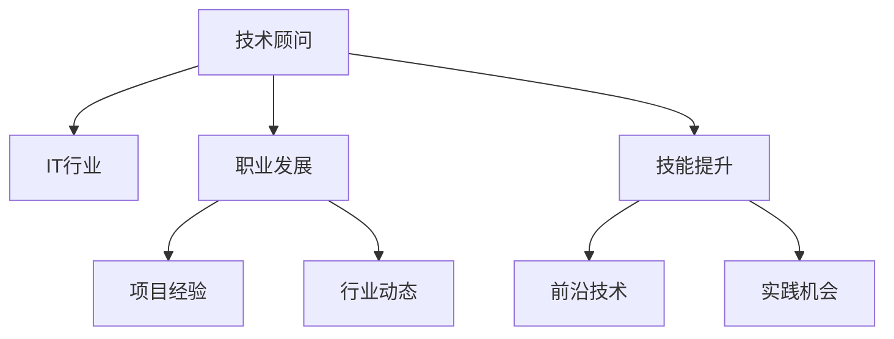

                 

# 技术顾问：高薪兼职的选择

> 关键词：高薪兼职,技术顾问,IT行业,技能提升,职业发展

## 1. 背景介绍

在现代IT行业中，技术顾问这一职业角色日渐受到关注。随着技术的不断演进和企业对于技术解决方案需求的日益增长，技术顾问成为了连接技术前沿与实际应用的重要桥梁。特别是在全球化和技术复杂性不断提升的背景下，企业对于能够提供专业、定制化解决方案的技术顾问的需求日益迫切。同时，技术顾问市场也在持续扩大，尤其是在中国，拥有丰富技术资源和巨大市场需求的推动下，这一职业的吸引力也在不断增强。

### 1.1 行业背景

随着信息技术的飞速发展，各行各业都在加速数字化转型。云计算、大数据、人工智能、区块链等前沿技术的兴起，为技术顾问创造了前所未有的机遇和挑战。在智能制造、智慧城市、在线教育、金融科技等诸多领域，技术顾问通过提供解决方案和技术支持，帮助企业实现了业务的创新和转型，创造了巨大的商业价值。

### 1.2 市场需求

据业内专家预测，未来5年，中国技术顾问市场需求将持续增长，年复合增长率预计在10%以上。这一增长趋势主要受到以下几个因素的驱动：

1. **企业数字化转型加速**：越来越多的企业开始认识到数字化转型的重要性，尤其是中小型企业，对技术顾问的需求急剧增加。
2. **新业务模式的探索**：新兴的业务模式（如物联网、电子商务、在线服务）的不断出现，为企业带来新的挑战，需要技术顾问提供全方位的技术支持。
3. **政策支持与投资**：政府在多个政策文件中明确提出支持数字化转型，增加了企业的数字化投入，从而推动了技术顾问市场的发展。

## 2. 核心概念与联系

### 2.1 核心概念概述

为了更好地理解技术顾问这一职业角色，我们首先需要明确几个核心概念：

- **技术顾问**：指的是具备深厚技术背景和专业技能的职业人士，主要为客户提供技术咨询、解决方案制定和实施指导，帮助客户提升技术水平和业务效率。
- **IT行业**：包括计算机硬件、软件、互联网、大数据、人工智能、云计算等多个细分领域，是技术顾问的主要服务对象。
- **职业发展**：指技术顾问通过不断学习、实践和创新，提升专业技能和实战经验，实现职业生涯的稳步提升。
- **技能提升**：涉及技术顾问在编程语言、项目管理、架构设计、人工智能等方面的持续学习和实践，以适应行业变化和技术迭代。

这些概念之间的逻辑关系可以通过以下Mermaid流程图来展示：

这个流程图展示了几大核心概念之间的联系：技术顾问通过服务IT行业，不断提升自己的职业发展水平和技能，掌握最新的前沿技术，积累丰富的项目经验，最终实现职业目标。

## 3. 核心算法原理 & 具体操作步骤

### 3.1 算法原理概述

技术顾问的工作主要基于以下算法原理：

- **需求分析**：通过与客户进行深入沟通，理解其业务需求和技术痛点，确定解决方案的方向和范围。
- **方案设计**：结合客户需求和市场趋势，设计符合客户需求的解决方案，包括技术选型、架构设计、项目规划等。
- **实施指导**：在解决方案实施过程中，提供技术指导和项目管理，确保项目按时按质完成。
- **效果评估**：实施完成后，进行效果评估，收集反馈，优化改进。

这些步骤共同构成了技术顾问的核心工作流程。

### 3.2 算法步骤详解

技术顾问的工作流程可以分为以下几个关键步骤：

**Step 1: 需求分析**

- 与客户进行沟通，了解其业务背景、需求痛点和目标。
- 识别业务流程中的技术瓶颈和改进点。
- 收集相关数据和信息，为后续的解决方案设计做准备。

**Step 2: 方案设计**

- 基于需求分析结果，设计符合客户需求的解决方案。
- 包括技术选型、架构设计、项目规划等，确保方案的可行性和高效性。
- 与客户沟通，确认方案的合理性，并获取反馈。

**Step 3: 实施指导**

- 在解决方案实施过程中，提供技术指导和项目管理，确保项目按时按质完成。
- 处理实施过程中的技术问题和挑战，提供解决方案。
- 协调团队协作，确保项目的顺利进行。

**Step 4: 效果评估**

- 实施完成后，进行效果评估，收集客户反馈。
- 分析评估结果，识别问题，提出改进建议。
- 对客户进行培训，确保其能够熟练使用新系统。

以上步骤是技术顾问工作的基本流程。在实际操作中，每个步骤都需要与客户紧密沟通，确保方案符合实际需求，并能够顺利实施和落地。

### 3.3 算法优缺点

技术顾问的工作基于以下优缺点：

**优点**

- **专业知识丰富**：技术顾问具备丰富的技术知识和实践经验，能够为客户提供专业的技术咨询和解决方案。
- **项目经验丰富**：通过长期的项目实施，技术顾问积累了丰富的项目经验，能够更高效地处理复杂项目。
- **跨领域能力**：技术顾问具备跨领域的技术整合能力，能够提供综合性的解决方案。

**缺点**

- **依赖客户需求**：技术顾问的工作高度依赖客户需求，不同客户的需求差异较大，需要量身定制解决方案。
- **持续学习压力**：技术领域变化迅速，技术顾问需要持续学习和跟进最新技术，以保持竞争力。
- **工作强度高**：项目周期长，涉及的技术复杂度高，技术顾问需要投入大量时间和精力。

### 3.4 算法应用领域

技术顾问的工作不仅限于传统IT行业，其应用领域正在不断扩展。以下是几个主要的应用领域：

1. **企业数字化转型**：帮助企业实现数字化转型，提升业务效率和竞争力。
2. **智能制造**：提供智能制造解决方案，实现生产自动化、智能化。
3. **智慧城市**：提供智慧城市解决方案，提升城市治理效率和服务质量。
4. **在线教育**：提供在线教育解决方案，提升教育质量和教学效果。
5. **金融科技**：提供金融科技解决方案，提升金融服务效率和安全性。

## 4. 数学模型和公式 & 详细讲解 & 举例说明

### 4.1 数学模型构建

为了更好地理解技术顾问的工作原理，我们将构建一个简单的数学模型。假设有一个项目，其完成时间 $T$ 与技术顾问的投入 $X$ 和项目复杂度 $C$ 有关。则数学模型可以表示为：

$$ T = f(X, C) $$

其中，$f$ 表示时间与投入和复杂度之间的关系，可以是一个线性函数、指数函数或非线性函数。

### 4.2 公式推导过程

对于线性函数模型，我们可以推导出：

$$ T = aX + bC $$

其中，$a$ 和 $b$ 为系数，代表了技术顾问投入和项目复杂度对项目完成时间的影响。

### 4.3 案例分析与讲解

假设在一个智能制造项目中，技术顾问需要投入的时间与项目复杂度成正比，即每增加一个复杂度单位，技术顾问需要额外投入 2 个单位时间。此时，项目的完成时间可以表示为：

$$ T = 2X + C $$

例如，当项目复杂度为 10，技术顾问投入时间为 5 时，项目完成时间为：

$$ T = 2 \times 5 + 10 = 20 $$

这表明，技术顾问投入时间在项目完成时间中占比为 50%，而项目复杂度占比为 50%。

## 5. 项目实践：代码实例和详细解释说明

### 5.1 开发环境搭建

技术顾问的工作不需要具体的编程实现，但其项目管理和解决方案设计需要借助一些开发工具。以下是几个推荐的开发环境：

1. **Visual Studio Code**：轻量级的代码编辑器，支持多种编程语言和插件。
2. **JIRA**：项目管理工具，支持任务分配、进度跟踪和报表生成。
3. **Confluence**：团队协作工具，支持文档管理、知识共享和版本控制。
4. **GitLab**：代码托管平台，支持版本控制、CI/CD和团队协作。

### 5.2 源代码详细实现

虽然技术顾问的工作不需要具体的编程实现，但可以通过案例来说明其工作原理。以下是一个简化的项目管理和解决方案设计案例：

1. **需求分析**

假设一家制造企业希望提升其生产线的自动化水平，提高生产效率和产品质量。技术顾问需要与企业管理层和生产部门进行深入沟通，了解其具体需求。

2. **方案设计**

基于需求分析结果，技术顾问可以设计一个基于机器视觉和物联网的自动化生产线解决方案。方案包括：

- **设备选型**：选择适合的自动化设备和传感器。
- **系统架构**：设计系统架构，确保系统的高效性和稳定性。
- **项目管理**：制定详细的项目计划和任务分配。

3. **实施指导**

在解决方案实施过程中，技术顾问需要提供技术指导和项目管理，确保项目按时按质完成。具体步骤如下：

- **设备安装**：协调设备安装和调试。
- **系统集成**：集成各设备和传感器，确保系统正常运行。
- **测试验证**：进行系统测试，验证功能和性能。

4. **效果评估**

项目完成后，技术顾问需要对项目效果进行评估，收集客户反馈，提出改进建议。具体步骤如下：

- **功能测试**：测试系统各项功能，确保满足业务需求。
- **性能测试**：测试系统性能，确保满足生产效率要求。
- **用户培训**：对企业员工进行培训，确保其能够熟练使用新系统。

### 5.3 代码解读与分析

技术顾问的工作虽然不需要具体的编程实现，但其项目管理和解决方案设计需要借助一些开发工具。以下是几个推荐的开发环境：

1. **Visual Studio Code**：轻量级的代码编辑器，支持多种编程语言和插件。
2. **JIRA**：项目管理工具，支持任务分配、进度跟踪和报表生成。
3. **Confluence**：团队协作工具，支持文档管理、知识共享和版本控制。
4. **GitLab**：代码托管平台，支持版本控制、CI/CD和团队协作。

### 5.4 运行结果展示

项目完成后，技术顾问需要对项目效果进行评估，收集客户反馈，提出改进建议。具体步骤如下：

- **功能测试**：测试系统各项功能，确保满足业务需求。
- **性能测试**：测试系统性能，确保满足生产效率要求。
- **用户培训**：对企业员工进行培训，确保其能够熟练使用新系统。

## 6. 实际应用场景

### 6.1 智能制造

技术顾问在智能制造领域发挥着重要作用。通过提供自动化、智能化解决方案，技术顾问帮助企业提升生产效率、降低成本，并提升产品质量。

### 6.2 智慧城市

在智慧城市建设中，技术顾问提供城市治理、公共安全、交通管理等方面的解决方案，提升城市治理效率和服务质量。

### 6.3 在线教育

在线教育领域，技术顾问提供教学平台、在线课程、智能辅导等解决方案，提升教育质量和教学效果。

### 6.4 金融科技

在金融科技领域，技术顾问提供安全支付、风险管理、金融分析等解决方案，提升金融服务效率和安全性。

## 7. 工具和资源推荐

### 7.1 学习资源推荐

为了帮助技术顾问不断提升自身技能，以下是几个推荐的资源：

1. **Coursera**：在线学习平台，提供丰富的IT和计算机科学课程。
2. **edX**：在线学习平台，提供全球顶尖大学的IT课程。
3. **Udacity**：在线学习平台，提供实战导向的IT课程和纳米学位。
4. **GitHub**：代码托管平台，提供丰富的开源项目和技术资源。
5. **Stack Overflow**：技术问答社区，提供丰富的技术讨论和解决方案。

### 7.2 开发工具推荐

以下是几个推荐的技术顾问工具：

1. **Visual Studio Code**：轻量级的代码编辑器，支持多种编程语言和插件。
2. **JIRA**：项目管理工具，支持任务分配、进度跟踪和报表生成。
3. **Confluence**：团队协作工具，支持文档管理、知识共享和版本控制。
4. **GitLab**：代码托管平台，支持版本控制、CI/CD和团队协作。
5. **Microsoft Office Suite**：办公套件，支持文档处理、邮件通信和团队协作。

### 7.3 相关论文推荐

以下是几篇推荐的技术顾问相关论文：

1. **"Effective Project Management Techniques for Software Projects"**：探讨有效的项目管理方法，提升项目成功率。
2. **"The Role of Technology Advisors in Digital Transformation"**：分析技术顾问在数字化转型中的作用和策略。
3. **"Skills Development for Technology Advisors"**：探讨技术顾问技能提升的有效途径。
4. **"The Impact of Machine Learning on Technology Advisory Services"**：探讨机器学习在技术顾问服务中的应用和影响。

## 8. 总结：未来发展趋势与挑战

### 8.1 研究成果总结

技术顾问作为连接技术前沿与实际应用的重要桥梁，其工作流程和技术要求在不断演进。近年来，技术顾问的关注点从传统IT转向新兴技术，如人工智能、大数据、物联网等。通过不断学习新知识和新技术，技术顾问能够更好地服务企业，推动业务创新和数字化转型。

### 8.2 未来发展趋势

未来技术顾问的发展趋势主要包括以下几个方面：

1. **技术融合**：技术顾问将更多地融合人工智能、大数据、区块链等新兴技术，提供更全面、高效的解决方案。
2. **跨领域能力**：技术顾问将具备更强的跨领域整合能力，能够提供综合性的解决方案。
3. **服务模式创新**：技术顾问将探索更多的服务模式，如咨询+实施、平台+服务等，提升服务质量和效率。
4. **持续学习**：技术顾问需要持续学习和跟进最新技术，保持竞争力。
5. **全球化拓展**：技术顾问将更多地参与全球化项目，提升国际业务能力。

### 8.3 面临的挑战

技术顾问在快速发展的同时，也面临着一些挑战：

1. **技术快速迭代**：技术领域的快速迭代对技术顾问的持续学习能力提出了更高的要求。
2. **项目管理复杂性**：项目规模的扩大和技术复杂度的提高，增加了技术顾问的项目管理难度。
3. **客户需求多样性**：不同客户的需求差异较大，技术顾问需要灵活应对。
4. **市场竞争激烈**：技术顾问市场竞争激烈，需要具备较强的市场响应能力和服务质量。
5. **法规遵从**：技术顾问需要了解并遵守相关法规，确保服务合规。

### 8.4 研究展望

未来技术顾问的研究方向主要包括以下几个方面：

1. **新兴技术应用**：探索新兴技术在技术顾问服务中的应用，提升服务质量和效率。
2. **跨领域整合**：探索跨领域的解决方案，提升技术顾问的跨领域整合能力。
3. **服务模式创新**：探索新的服务模式，提升服务质量和客户满意度。
4. **持续学习**：探索持续学习的有效方法，提升技术顾问的竞争力。
5. **市场扩展**：探索全球化市场的开拓和拓展，提升国际业务能力。

## 9. 附录：常见问题与解答

**Q1：技术顾问的工作压力大吗？**

A: 技术顾问的工作压力主要来自项目交付期限、客户需求变化和技术快速迭代。但通过良好的时间管理、沟通技巧和项目管理，可以有效缓解压力。

**Q2：如何提升技术顾问的市场竞争力？**

A: 技术顾问需要不断提升自身技能，持续学习新知识和新技术，保持竞争力和行业前沿性。同时，需要注重客户关系维护和服务质量，提升客户满意度。

**Q3：技术顾问在职业生涯中需要哪些软技能？**

A: 技术顾问在职业生涯中需要具备的软技能包括沟通能力、项目管理、团队协作、客户服务、时间管理等。这些软技能对于技术顾问的成功至关重要。

**Q4：如何评估技术顾问的工作成果？**

A: 技术顾问的工作成果可以通过项目完成时间、客户满意度、项目质量、成本控制等方面进行评估。具体评估指标需根据项目特点和客户需求进行设定。

**Q5：技术顾问的未来发展方向是什么？**

A: 技术顾问的未来发展方向包括技术融合、跨领域能力提升、服务模式创新、持续学习和市场扩展等方面。未来技术顾问将更多地涉及新兴技术和跨领域整合，提供更全面、高效的解决方案。

作者：禅与计算机程序设计艺术 / Zen and the Art of Computer Programming

