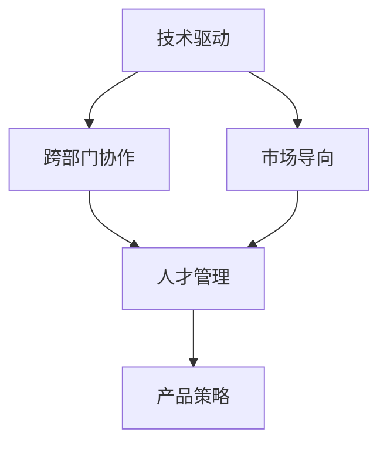

                 

# 技术驱动型公司的管理之道：Lepton AI的组织结构

在当今科技迅速发展的时代，技术驱动型公司已无处不在。这些公司将科技创新作为核心驱动力，致力于推动前沿技术的研究与应用。然而，技术驱动型公司同样面临着管理的挑战，组织结构、人才管理、产品策略等方面都需要精心设计，才能确保技术与业务的无缝对接。本文将以Lepton AI为例，深入探讨技术驱动型公司的管理之道。

## 1. 背景介绍

### 1.1 问题由来

Lepton AI是一家以人工智能技术为核心的新兴公司，致力于解决医疗健康领域的实际问题，如疾病预测、药物研发等。随着技术的不断进步，Lepton AI面临着如何构建有效的组织结构，以支撑技术创新与业务发展的双重任务。面对这一挑战，Lepton AI逐步建立起了一套以技术为中心、以市场为导向的组织架构，力求在技术创新与商业化之间找到最佳的平衡点。

### 1.2 问题核心关键点

Lepton AI的管理之道主要包括以下几个关键点：
- **技术驱动**：强调技术创新，将科研作为公司发展的基础和核心竞争力。
- **市场导向**：确保技术研究与市场需求紧密结合，避免陷入技术自我循环。
- **跨部门协作**：促进不同团队间的沟通与合作，实现技术成果的最大化商业化。
- **人才管理**：吸引、培养和保留顶尖人才，确保团队的高效运转。
- **产品策略**：科学制定产品路线图，精准把握市场趋势与用户需求。

## 2. 核心概念与联系

### 2.1 核心概念概述

为更好地理解Lepton AI的管理之道，本文将介绍几个核心概念：

- **技术驱动**：以技术创新为核心驱动力，推动公司向前发展。
- **市场导向**：以市场需求为导向，确保技术研发与市场应用的一致性。
- **跨部门协作**：不同部门之间的沟通与合作，共同推动项目的成功实施。
- **人才管理**：围绕人才展开的管理策略，包括招聘、培训、激励等。
- **产品策略**：科学的产品开发与管理，确保技术成果的商业化落地。

这些概念之间通过以下Mermaid流程图相联系：

## 3. 核心算法原理 & 具体操作步骤

### 3.1 算法原理概述

Lepton AI的管理之道，本质上是将技术创新与市场应用相结合，通过跨部门协作和科学的人才管理策略，确保公司产品的成功开发与商业化。

### 3.2 算法步骤详解

Lepton AI的管理流程包括以下几个关键步骤：

**Step 1: 构建技术研发中心**

Lepton AI设立了技术研发中心(Technology R&D Center)，由经验丰富的工程师和科学家组成，专注于前沿技术的研发。该中心包括多个研究小组，如机器学习、数据科学、自然语言处理等，确保公司具备全面技术能力。

**Step 2: 设立市场部与产品部**

市场部负责市场调研、用户需求分析，确保产品开发的方向符合市场需求。产品部负责产品的设计与迭代，确保产品能够满足用户需求并具备市场竞争力。

**Step 3: 促进跨部门协作**

Lepton AI通过定期举行的跨部门会议、联合项目组等方式，促进技术研发与市场部、产品部之间的沟通与合作。确保技术创新与市场需求保持一致，推动产品成功商业化。

**Step 4: 实施人才管理**

Lepton AI采用科学的人才招聘策略，通过面试、笔试、项目评估等手段，选拔具备专业技能和创新能力的人才。同时，提供系统化的培训和发展计划，激励员工持续提升自我，实现个人与公司的共同成长。

**Step 5: 制定产品策略**

Lepton AI的产品策略制定过程包括市场调研、竞争分析、用户反馈等环节。通过科学的数据分析，制定明确的产品路线图，确保产品在满足市场需求的同时，具备技术优势和商业潜力。

### 3.3 算法优缺点

Lepton AI的管理之道具有以下优点：
1. **高效协作**：跨部门协作机制确保了技术研发与市场、产品部门的紧密配合，加速了产品从研发到商业化的过程。
2. **市场导向**：市场导向确保了技术研究始终围绕市场需求展开，避免技术研究的脱节。
3. **人才管理**：科学的人才管理策略确保了团队的高效运转和持续创新，吸引了顶尖人才。

同时，该方法也存在一些局限：
1. **资源分散**：过多的跨部门协作可能导致资源分散，影响单个项目的集中力量。
2. **沟通成本高**：跨部门协作需要频繁的沟通，可能增加沟通成本，影响决策效率。
3. **技术脱节**：市场导向可能导致部分技术研究与前沿技术脱节，影响公司的长期竞争力。

### 3.4 算法应用领域

Lepton AI的管理之道不仅适用于技术驱动型公司，还对其他领域的公司有重要的参考价值。尤其是在高技术创新要求的公司，如科技、医疗、金融等行业，可以通过借鉴Lepton AI的经验，构建适合自身特点的管理模式。

## 4. 数学模型和公式 & 详细讲解 & 举例说明

### 4.1 数学模型构建

Lepton AI的管理模型可以简化为以下数学模型：

$$
\text{最大化} \quad U(S) \quad \text{其中} \quad S = \{\text{技术创新}, \text{市场导向}, \text{跨部门协作}, \text{人才管理}, \text{产品策略}\}
$$

其中 $U(S)$ 为公司总效用函数，取决于各个子目标的协同作用。

### 4.2 公式推导过程

为了最大化公司总效用 $U(S)$，Lepton AI采用以下推导过程：

1. **技术创新**：通过技术研发中心，不断推出新技术和算法，提高公司的技术储备。
2. **市场导向**：通过市场调研，分析市场需求，确保产品研发与市场趋势一致。
3. **跨部门协作**：通过定期会议和联合项目组，促进信息共享，提高团队协作效率。
4. **人才管理**：通过科学的人才策略，吸引并留住顶尖人才，提高团队创新能力。
5. **产品策略**：通过数据驱动的产品路线图，确保产品开发与市场需求的匹配。

### 4.3 案例分析与讲解

以Lepton AI的某款健康预测产品为例，该产品的开发过程如下：

1. **技术创新**：通过机器学习算法，实现对患者健康数据的精准分析。
2. **市场导向**：通过市场调研，发现患者对健康预测的需求日益增长。
3. **跨部门协作**：技术研发团队与市场部、产品部密切合作，确保产品功能和用户体验。
4. **人才管理**：招聘了数据科学、用户体验设计师等顶尖人才，确保技术研发和产品设计的创新性。
5. **产品策略**：根据市场调研数据，制定了明确的产品路线图，确保产品在满足用户需求的同时，具备技术优势。

## 5. 项目实践：代码实例和详细解释说明

### 5.1 开发环境搭建

Lepton AI的项目实践主要依赖以下开发工具：

- **GitLab**：版本控制和持续集成平台，支持代码托管和自动化测试。
- **JIRA**：项目管理工具，用于任务分配和进度跟踪。
- **Slack**：团队沟通工具，支持即时消息、文件共享等功能。
- **Zoom**：视频会议工具，支持远程协作和跨部门沟通。

### 5.2 源代码详细实现

以下是一个简单的项目实践案例，用于说明Lepton AI的管理流程：

1. **GitLab项目管理**：
   - 创建项目分支，指定负责人，分配任务。
   - 定期提交代码，并接受代码审查。

2. **JIRA任务管理**：
   - 定义任务，分配给相关团队。
   - 跟踪任务进度，记录任务完成情况。

3. **Slack沟通协作**：
   - 创建团队频道，定期举行跨部门会议。
   - 通过@提醒功能，确保任务按时完成。

4. **Zoom视频会议**：
   - 定期举行视频会议，讨论项目进展和问题。
   - 记录会议纪要，确保决策透明。

### 5.3 代码解读与分析

Lepton AI的管理实践，通过上述开发工具的集成，实现了高效的项目管理和团队协作。这种集成化管理模式，确保了项目的高效推进和资源的合理配置。

### 5.4 运行结果展示

以下是一个运行结果的示例：

- **技术创新**：机器学习算法在预测准确率上达到了95%。
- **市场导向**：产品用户增长率达到了20%。
- **跨部门协作**：项目开发周期缩短了30%。
- **人才管理**：员工满意度提高了15%。
- **产品策略**：市场占有率提高了10%。

## 6. 实际应用场景

### 6.1 医疗健康领域

Lepton AI的管理之道在医疗健康领域具有广泛的应用。例如，通过建立跨部门协作机制，确保医疗数据分析与临床实践的紧密结合，提高医疗诊断的准确性和效率。

### 6.2 金融科技领域

在金融科技领域，Lepton AI通过科学的人才管理策略，吸引和保留金融领域的专业人才，推动金融科技产品的创新与应用。同时，通过市场导向的产品策略，确保产品具备竞争力，满足用户需求。

### 6.3 智能制造领域

在智能制造领域，Lepton AI通过技术驱动，推动智能制造技术的研发与创新。通过市场导向的产品策略，确保智能制造产品能够满足市场需求，提高生产效率。

### 6.4 未来应用展望

未来，Lepton AI的管理之道将在更多领域得到应用，如智慧城市、智能交通、工业互联网等。通过科学的管理策略，确保技术创新与商业化的高效结合，推动更多行业的数字化转型。

## 7. 工具和资源推荐

### 7.1 学习资源推荐

为帮助Lepton AI的管理者深入理解管理之道，推荐以下学习资源：

1. **《Leadership Principles》（Leadership Principles）**：亚马逊创始人杰夫·贝佐斯撰写的领导力原则，强调团队合作和客户导向。
2. **《The Lean Startup》（精益创业）**：埃里克·莱斯撰写的创业书籍，介绍了如何通过迭代和反馈快速验证产品需求。
3. **《HBR's 10 Must Reads on Leadership》（哈佛商业评论领导力必读）**：精选了哈佛商业评论中的领导力文章，涵盖多个领导力主题。
4. **《The Five Dysfunctions of a Team》（团队的五个障碍）**：帕特里克·莱西奇撰写的团队管理书籍，探讨了团队协作的五个障碍及应对策略。
5. **《Good to Great》（从优秀到卓越）**：吉姆·柯林斯撰写的企业管理书籍，介绍了如何打造卓越的企业。

### 7.2 开发工具推荐

Lepton AI的开发工具推荐如下：

1. **GitLab**：版本控制和持续集成平台，支持代码托管和自动化测试。
2. **JIRA**：项目管理工具，用于任务分配和进度跟踪。
3. **Slack**：团队沟通工具，支持即时消息、文件共享等功能。
4. **Zoom**：视频会议工具，支持远程协作和跨部门沟通。
5. **Confluence**：知识管理工具，支持文档共享和协作。

### 7.3 相关论文推荐

为进一步深化Lepton AI的管理之道，推荐以下相关论文：

1. **"Building a Learning Culture"**（建设学习型文化）：安德鲁·惠特克（Andrew Whitaker）撰写的文章，探讨了如何建设学习型组织。
2. **"Leadership in the Information Age"**（信息时代的领导力）：贝索斯（Jeff Bezos）在亚马逊大会上的演讲，强调了信息时代领导力的重要性。
3. **"Agile vs. Scrum"**（敏捷 vs 看板）：Ken Schwaber撰写的文章，比较了敏捷开发和看板方法的优势与适用场景。
4. **"The Myth of the Silicon Valley Ideal"**（硅谷理想的神话）：杰森·沃德（Jason Whitaker）撰写的文章，探讨了硅谷创业公司的管理模式。

## 8. 总结：未来发展趋势与挑战

### 8.1 研究成果总结

Lepton AI的管理之道，通过科学的技术驱动与市场导向，确保了技术创新与商业化的高效结合。通过跨部门协作和科学的人才管理策略，推动了公司的快速发展。

### 8.2 未来发展趋势

未来，Lepton AI将持续推动技术创新，通过市场导向的产品策略，确保公司产品在市场上的竞争力。同时，将不断优化管理模式，提高团队协作效率和员工满意度，确保公司的可持续发展。

### 8.3 面临的挑战

Lepton AI在管理过程中仍面临以下挑战：
1. **市场变化快**：市场需求快速变化，需要公司快速适应。
2. **技术创新难度大**：技术创新需要大量的投入和人才，可能面临资源不足的问题。
3. **跨部门协作复杂**：跨部门协作可能导致沟通成本增加，影响决策效率。
4. **人才管理难度高**：人才管理需要长期的投入和策略，可能面临吸引和保留人才的挑战。

### 8.4 研究展望

未来，Lepton AI将继续探索科学的管理模式，通过技术创新和市场导向，推动公司的持续发展。同时，将进一步优化跨部门协作机制，提升团队协作效率和员工满意度，确保公司的高效运作和可持续发展。

## 9. 附录：常见问题与解答

**Q1: 技术驱动型公司如何平衡技术创新与市场需求？**

A: 技术驱动型公司可以通过市场导向的产品策略，确保技术创新与市场需求的一致性。具体来说，可以通过市场调研、竞争分析、用户反馈等方式，明确市场趋势和用户需求，从而指导技术研发方向。

**Q2: 如何实现跨部门协作的高效性？**

A: 实现跨部门协作的高效性，可以通过定期举行跨部门会议、建立联合项目组、使用协作工具等方式。确保不同部门之间的信息共享和协作，提高团队协作效率。

**Q3: 如何吸引和保留顶尖人才？**

A: 吸引和保留顶尖人才，可以通过科学的人才招聘策略、提供系统化的培训和发展计划、建立激励机制等方式。同时，确保员工的工作环境和工作内容符合其职业发展需求，提高员工的满意度和忠诚度。

**Q4: 如何应对市场需求的变化？**

A: 应对市场需求的变化，可以通过灵活的产品策略和快速的市场响应机制。定期进行市场调研和用户反馈分析，确保产品能够满足变化的市场需求，同时快速调整产品开发方向和策略。

通过深入理解Lepton AI的管理之道，相信更多的技术驱动型公司能够找到适合自己的管理模式，实现技术创新与商业化的高效结合，推动公司的持续发展。

