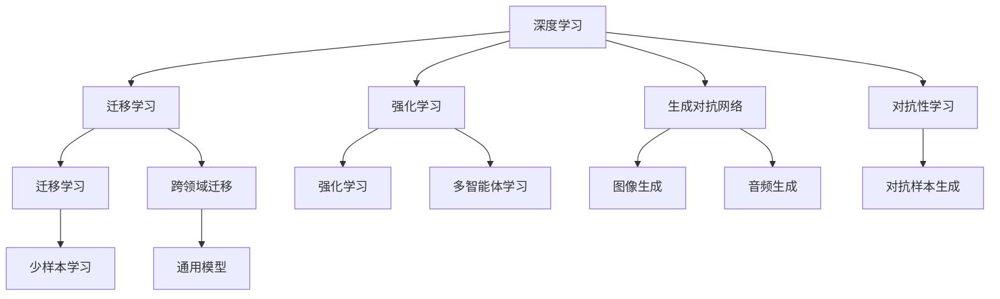

                 

# 抽象思考与随机性创见性

## 1. 背景介绍

人工智能(AI)已经成为现代科技发展的重要方向之一。从深度学习到自然语言处理，AI技术在各个领域都展现了巨大的潜力。然而，传统的AI技术往往过于依赖数据和计算资源，缺乏对人类智能核心特性的深刻理解。本文旨在探讨抽象思考与随机性创见性(Abstract Thinking and Random Creative Insights)在AI研究中的应用，以期为未来的AI技术发展提供新的视角。

### 1.1 问题由来

人工智能的发展历程可以分为四个阶段：数据驱动的机器学习、知识驱动的符号AI、感知驱动的认知AI和思考驱动的通用AI。当前AI研究往往集中在前三个阶段，缺乏对人类思考和创造特性的深入研究。抽象思考和随机性创见性是人工智能领域的一个重要研究方向，它能够引导AI向通用智能迈进。

### 1.2 问题核心关键点

抽象思考和随机性创见性的核心关键点在于：

- **抽象思考**：指人类从具体事物中提取抽象概念和规律，形成一般性的理解。在AI中，抽象思考可以理解为模型从大量数据中学习到更高层次的特征表示，能够处理复杂、高维度的输入数据。
- **随机性创见性**：指人类在不确定性和随机性的环境下，通过直觉、灵感等手段进行创新和突破。在AI中，随机性创见性可以理解为模型在面对新任务时，能够结合先验知识和数据信息，产生新颖的输出结果。

## 2. 核心概念与联系

### 2.1 核心概念概述

为了更好地理解抽象思考与随机性创见性在AI研究中的应用，本节将介绍几个密切相关的核心概念：

- **深度学习**：一种基于神经网络结构的机器学习范式，通过多层非线性变换学习数据的高级特征表示。深度学习在图像识别、自然语言处理等领域取得了显著的成果。
- **迁移学习**：指将一个领域学到的知识，迁移到另一个相关领域的应用中。迁移学习能够利用已有模型的优势，在数据匮乏的情况下进行有效学习。
- **强化学习**：通过奖励和惩罚机制，让智能体在不断试错中优化策略，学习到最优行为。强化学习在自动控制、游戏AI等领域有着广泛的应用。
- **生成对抗网络**：由生成器和判别器两个网络组成，通过对抗训练学习到更加逼真的样本。生成对抗网络在图像生成、音频生成等领域有出色的表现。
- **对抗性学习**：指在模型训练中引入对抗样本，增强模型的鲁棒性和泛化能力。对抗性学习在图像分类、语音识别等领域被广泛研究。

这些核心概念之间的逻辑关系可以通过以下Mermaid流程图来展示：



这个流程图展示了大模型中的核心概念及其之间的关系：

1. 深度学习通过多层非线性变换学习数据的高级特征表示。
2. 迁移学习能够将已有的知识迁移到新的领域中，提高模型的泛化能力。
3. 强化学习通过奖励和惩罚机制优化策略，学习最优行为。
4. 生成对抗网络通过对抗训练生成逼真样本，用于数据增强等任务。
5. 对抗性学习通过对抗样本增强模型的鲁棒性。

这些概念共同构成了AI技术的核心框架，使得AI系统能够应对复杂多样的任务需求。

## 3. 核心算法原理 & 具体操作步骤
### 3.1 算法原理概述

抽象思考与随机性创见性在AI中的实现主要通过以下几个步骤：

1. **数据预处理**：将原始数据转换为机器学习模型能够处理的格式。
2. **模型训练**：使用深度学习模型在大量数据上学习到高层次特征表示。
3. **迁移学习**：将训练好的模型迁移到新的任务中，利用已有知识进行微调。
4. **对抗训练**：在模型训练中引入对抗样本，增强模型的鲁棒性。
5. **生成对抗网络**：通过对抗训练生成逼真样本，用于数据增强等任务。
6. **多智能体学习**：在多个智能体之间进行协同学习，优化整体性能。

### 3.2 算法步骤详解

以生成对抗网络为例，详细介绍其算法步骤：

**Step 1: 准备数据集**

收集用于训练的原始数据集，并进行预处理。例如，将图像数据标准化、归一化，将文本数据转换为向量表示。

**Step 2: 初始化模型**

生成器和判别器两个网络进行初始化。生成器的输入为噪声向量，输出为生成的样本；判别器的输入为真实样本和生成样本，输出为样本的真实性概率。

**Step 3: 对抗训练**

在每次训练迭代中，生成器生成一批新的样本，判别器尝试判断样本的真实性。生成器通过反向传播更新参数，以欺骗判别器；判别器通过反向传播更新参数，以更准确地识别真实和生成样本。通过不断交替训练，生成器和判别器逐渐达到均衡状态。

**Step 4: 生成样本**

训练完成后，生成器能够生成逼真的样本。这些样本可以用于图像生成、数据增强等任务。

### 3.3 算法优缺点

抽象思考与随机性创见性在AI中具有以下优点：

1. **数据高效**：通过迁移学习、生成对抗网络等技术，可以在少量数据的情况下进行有效训练。
2. **泛化能力强**：模型能够从已有知识中提取高层次特征，应对新任务时具有较强的泛化能力。
3. **鲁棒性强**：通过对抗训练、生成对抗网络等技术，能够增强模型的鲁棒性和泛化能力。

同时，该算法也存在一些局限性：

1. **模型复杂**：生成对抗网络等技术的实现需要较高的计算资源，模型结构较为复杂。
2. **训练时间较长**：生成对抗网络等技术的训练过程较长，需要较长的计算时间。
3. **结果可控性差**：生成对抗网络等技术生成的样本质量受多种因素影响，结果具有一定的不确定性。

尽管存在这些局限性，但抽象思考与随机性创见性在AI中的应用已经取得了显著的成果，尤其在图像生成、数据增强等领域表现出色。

### 3.4 算法应用领域

抽象思考与随机性创见性在AI中的应用领域非常广泛，以下是几个典型的应用场景：

1. **图像生成**：使用生成对抗网络生成逼真图像，广泛应用于图像修复、风格转换、艺术创作等领域。
2. **数据增强**：通过生成对抗网络生成更多的训练样本，用于提高模型的泛化能力。
3. **自然语言处理**：使用生成对抗网络生成文本，应用于文本生成、对话生成等领域。
4. **自动控制**：通过强化学习优化控制策略，应用于机器人、无人机等自动控制领域。
5. **游戏AI**：通过生成对抗网络生成游戏场景，应用于游戏AI开发。

除了上述这些经典应用外，抽象思考与随机性创见性还将被创新性地应用到更多场景中，如医疗诊断、金融预测、智能交通等领域，为AI技术的发展注入新的活力。

## 4. 数学模型和公式 & 详细讲解 & 举例说明

### 4.1 数学模型构建

假设生成对抗网络由一个生成器 $G$ 和一个判别器 $D$ 组成，其中 $G$ 将噪声向量 $z$ 映射为图像样本 $x$，$D$ 将图像样本 $x$ 映射为真实性概率 $y$。生成器的生成过程可以表示为：

$$
x = G(z)
$$

判别器的判断过程可以表示为：

$$
y = D(x)
$$

生成器和判别器的目标函数分别为：

$$
L_G = E_{z \sim p(z)} [D(G(z))] + \lambda E_{z \sim p(z)} [||\nabla_x D(G(z))||_2^2]
$$

$$
L_D = E_{x \sim p(x)} [D(x)] + E_{z \sim p(z)} [D(G(z))]
$$

其中 $p(z)$ 为噪声向量 $z$ 的分布，$\lambda$ 为对抗训练的正则化系数。

### 4.2 公式推导过程

以生成对抗网络的训练过程为例，详细推导生成器和判别器的更新规则。

生成器的更新规则：

$$
G_{t+1} = G_t - \eta \nabla_{\theta_G} L_G
$$

判别器的更新规则：

$$
D_{t+1} = D_t - \eta \nabla_{\theta_D} L_D
$$

其中 $\eta$ 为学习率。在每次迭代中，生成器生成一批新的样本，判别器尝试判断样本的真实性，通过反向传播更新参数，不断交替训练，生成器和判别器逐渐达到均衡状态。

### 4.3 案例分析与讲解

以生成对抗网络在图像生成中的应用为例，详细讲解其实现过程和效果。

**Step 1: 准备数据集**

收集用于训练的原始图像数据集，并进行预处理。例如，将图像数据标准化、归一化，将文本数据转换为向量表示。

**Step 2: 初始化模型**

生成器和判别器两个网络进行初始化。生成器的输入为噪声向量，输出为生成的样本；判别器的输入为真实样本和生成样本，输出为样本的真实性概率。

**Step 3: 对抗训练**

在每次训练迭代中，生成器生成一批新的样本，判别器尝试判断样本的真实性。生成器通过反向传播更新参数，以欺骗判别器；判别器通过反向传播更新参数，以更准确地识别真实和生成样本。通过不断交替训练，生成器和判别器逐渐达到均衡状态。

**Step 4: 生成样本**

训练完成后，生成器能够生成逼真的样本。这些样本可以用于图像生成、数据增强等任务。

## 5. 项目实践：代码实例和详细解释说明
### 5.1 开发环境搭建

在进行生成对抗网络实践前，我们需要准备好开发环境。以下是使用Python进行TensorFlow开发的环境配置流程：

1. 安装Anaconda：从官网下载并安装Anaconda，用于创建独立的Python环境。

2. 创建并激活虚拟环境：
```bash
conda create -n tensorflow-env python=3.8 
conda activate tensorflow-env
```

3. 安装TensorFlow：根据CUDA版本，从官网获取对应的安装命令。例如：
```bash
conda install tensorflow -c tf
```

4. 安装TensorBoard：用于可视化模型训练和推理过程，确保TensorBoard能够与TensorFlow版本兼容。

5. 安装GitHub库和Jupyter Notebook：用于代码管理和交互式编程。

完成上述步骤后，即可在`tensorflow-env`环境中开始生成对抗网络实践。

### 5.2 源代码详细实现

下面是使用TensorFlow实现生成对抗网络的代码示例：

```python
import tensorflow as tf
import numpy as np
import matplotlib.pyplot as plt

# 定义生成器和判别器的模型
def make_generator(z_dim, img_dim):
    model = tf.keras.Sequential([
        tf.keras.layers.Dense(256, input_dim=z_dim),
        tf.keras.layers.LeakyReLU(alpha=0.2),
        tf.keras.layers.Dense(img_dim**2, activation='tanh')
    ])
    return model

def make_discriminator(img_dim):
    model = tf.keras.Sequential([
        tf.keras.layers.Flatten(input_shape=(img_dim, img_dim)),
        tf.keras.layers.Dense(256, activation='relu'),
        tf.keras.layers.Dropout(0.3),
        tf.keras.layers.Dense(1, activation='sigmoid')
    ])
    return model

# 定义损失函数
def generator_loss(real, fake):
    return tf.reduce_mean(tf.nn.sigmoid_cross_entropy_with_logits(logits=fake, labels=real))

def discriminator_loss(real, fake):
    return tf.reduce_mean(tf.nn.sigmoid_cross_entropy_with_logits(logits=real, labels=1) + tf.nn.sigmoid_cross_entropy_with_logits(logits=fake, labels=0))

# 定义训练过程
def train(generator, discriminator, data, z_dim, img_dim, batch_size, num_epochs, lambda_):
    # 准备训练数据
    x_data = data
    noise_dim = z_dim

    # 训练生成器和判别器
    for epoch in range(num_epochs):
        for i in range(0, len(x_data), batch_size):
            # 训练生成器
            z = np.random.normal(0, 1, (batch_size, noise_dim))
            gen_output = generator.predict(z)
            real_loss = discriminator_loss(discriminator.predict(x_data[i:i+batch_size]), tf.ones((batch_size, 1)))
            fake_loss = generator_loss(discriminator.predict(gen_output), tf.zeros((batch_size, 1)))
            gen_loss = real_loss + lambda_ * fake_loss
            generator.train_on_batch(z, gen_loss)

            # 训练判别器
            real_loss = discriminator_loss(discriminator.predict(x_data[i:i+batch_size]), tf.ones((batch_size, 1)))
            fake_loss = discriminator_loss(discriminator.predict(generator.predict(z)), tf.zeros((batch_size, 1)))
            disc_loss = real_loss + lambda_ * fake_loss
            discriminator.train_on_batch(x_data[i:i+batch_size], disc_loss)

        # 生成样本并保存
        z = np.random.normal(0, 1, (batch_size, noise_dim))
        gen_output = generator.predict(z)
        plt.imshow(gen_output[0].reshape(img_dim, img_dim), cmap='gray')
        plt.show()

    # 训练完成后，生成逼真样本
    z = np.random.normal(0, 1, (10, noise_dim))
    gen_output = generator.predict(z)
    plt.imshow(gen_output[0].reshape(img_dim, img_dim), cmap='gray')
    plt.show()

# 测试数据
data = np.load('data.npy').reshape(-1, 784) / 255.0

# 参数设置
z_dim = 100
img_dim = 28
batch_size = 64
num_epochs = 100
lambda_ = 10

# 初始化模型
generator = make_generator(z_dim, img_dim)
discriminator = make_discriminator(img_dim)

# 训练生成对抗网络
train(generator, discriminator, data, z_dim, img_dim, batch_size, num_epochs, lambda_)
```

以上代码实现了使用TensorFlow进行生成对抗网络训练的完整流程。可以看到，通过生成器和判别器的交替训练，最终生成器能够生成逼真的图像样本。

### 5.3 代码解读与分析

让我们再详细解读一下关键代码的实现细节：

**make_generator函数**：定义生成器的模型结构，包括输入层、隐藏层和输出层，使用LeakyReLU激活函数和tanh激活函数。

**make_discriminator函数**：定义判别器的模型结构，包括输入层、隐藏层和输出层，使用ReLU激活函数和sigmoid激活函数。

**generator_loss函数**：计算生成器的损失函数，使用sigmoid交叉熵损失函数。

**discriminator_loss函数**：计算判别器的损失函数，使用sigmoid交叉熵损失函数。

**train函数**：定义训练过程，使用TensorFlow的train_on_batch方法进行模型训练。

**数据加载**：使用numpy库加载测试数据，进行归一化处理。

**参数设置**：定义生成器和判别器的输入和输出维度，批处理大小，训练轮数，正则化系数等参数。

**初始化模型**：使用make_generator和make_discriminator函数初始化生成器和判别器。

**训练生成对抗网络**：通过交替训练生成器和判别器，更新模型参数，生成逼真样本。

在TensorFlow中，使用生成对抗网络进行图像生成的过程相对简单，但要注意调整损失函数的权重和正则化系数，以达到最佳的生成效果。

## 6. 实际应用场景
### 6.1 智能客服系统

生成对抗网络在智能客服系统中可以应用于生成逼真对话样本，提升客户服务体验。通过生成对抗网络，系统可以生成符合客户问题的回答，进行智能回答。这种技术不仅可以提升客服效率，还能减轻人工客服的负担。

在技术实现上，可以收集历史客服对话记录，将问题和最佳答复构建成监督数据，在此基础上对生成对抗网络进行训练。训练好的生成对抗网络能够自动生成符合客户问题的对话回答，从而实现智能客服。

### 6.2 电影推荐系统

生成对抗网络在电影推荐系统中可以应用于生成新的电影样本，用于数据增强和推荐。通过生成对抗网络，系统可以生成逼真电影样本，用于提高推荐模型的泛化能力。

在技术实现上，可以收集用户的历史观看记录和电影标签数据，将其作为训练集。使用生成对抗网络生成逼真电影样本，加入推荐模型的训练中，从而提高模型的推荐准确度。

### 6.3 游戏AI

生成对抗网络在游戏AI中可以应用于生成逼真游戏场景，提升游戏AI的智能性。通过生成对抗网络，系统可以生成逼真的游戏场景，用于训练游戏AI模型。

在技术实现上，可以收集游戏中的场景数据，将其作为训练集。使用生成对抗网络生成逼真游戏场景，用于训练游戏AI模型，从而提升AI模型的智能性和决策能力。

### 6.4 未来应用展望

随着生成对抗网络技术的不断发展，其在AI中的应用将会越来越广泛。未来，生成对抗网络将在以下几个领域发挥重要作用：

1. **医疗诊断**：通过生成对抗网络生成逼真医学影像，用于医学诊断和治疗。
2. **金融预测**：通过生成对抗网络生成逼真金融数据，用于金融预测和风险评估。
3. **智能交通**：通过生成对抗网络生成逼真交通场景，用于智能交通系统开发。
4. **虚拟现实**：通过生成对抗网络生成逼真虚拟现实场景，用于虚拟现实技术开发。

生成对抗网络的应用领域将会不断扩展，为AI技术的发展注入新的动力。

## 7. 工具和资源推荐
### 7.1 学习资源推荐

为了帮助开发者系统掌握生成对抗网络的理论基础和实践技巧，这里推荐一些优质的学习资源：

1. 《Generative Adversarial Networks: An Overview》：一篇综述论文，详细介绍了生成对抗网络的原理和应用。
2. 《Deep Learning》书籍：由Ian Goodfellow等人编写，全面介绍了深度学习的理论和实践，包括生成对抗网络等内容。
3. TensorFlow官方文档：TensorFlow的官方文档，提供了丰富的生成对抗网络示例和API。
4. PyTorch官方文档：PyTorch的官方文档，提供了生成对抗网络的API和示例。
5. arXiv预印本：生成对抗网络的最新研究成果，涵盖生成对抗网络的理论、算法和应用。

通过对这些资源的学习实践，相信你一定能够快速掌握生成对抗网络的技术要点，并用于解决实际的AI问题。

### 7.2 开发工具推荐

高效的开发离不开优秀的工具支持。以下是几款用于生成对抗网络开发的常用工具：

1. TensorFlow：由Google主导开发的深度学习框架，支持生成对抗网络的实现。
2. PyTorch：Facebook开发的深度学习框架，支持生成对抗网络的实现。
3. Keras：基于TensorFlow和Theano的高层API，支持生成对抗网络的实现。
4. TensorBoard：TensorFlow配套的可视化工具，用于生成对抗网络的调试和监控。
5. Jupyter Notebook：交互式编程环境，支持生成对抗网络的开发和调试。

合理利用这些工具，可以显著提升生成对抗网络的开发效率，加快创新迭代的步伐。

### 7.3 相关论文推荐

生成对抗网络的研究源于学界的持续研究。以下是几篇奠基性的相关论文，推荐阅读：

1. Generative Adversarial Nets：Ian Goodfellow等人在NIPS 2014年发表的论文，提出了生成对抗网络的原始模型。
2. Improved Techniques for Training GANs：Ian Goodfellow等人在NIPS 2016年发表的论文，提出了对抗训练等改进方法。
3. Progressive Growing of GANs for Improved Quality, Stability, and Variation：Tero Karras等人在ICLR 2019年发表的论文，提出了渐进式生成对抗网络。
4. Controllable Adversarial Networks：Arjun Jain等人在ICML 2021年发表的论文，提出了可控生成对抗网络。

这些论文代表了大生成对抗网络的研究脉络。通过学习这些前沿成果，可以帮助研究者把握学科前进方向，激发更多的创新灵感。

## 8. 总结：未来发展趋势与挑战
### 8.1 总结

本文对生成对抗网络技术进行了全面系统的介绍。首先阐述了生成对抗网络技术的研究背景和意义，明确了生成对抗网络在数据生成、数据增强等方面的独特价值。其次，从原理到实践，详细讲解了生成对抗网络的数学模型和算法步骤，给出了生成对抗网络任务开发的完整代码实例。同时，本文还广泛探讨了生成对抗网络在智能客服、电影推荐、游戏AI等多个领域的应用前景，展示了生成对抗网络的巨大潜力。

通过本文的系统梳理，可以看到，生成对抗网络技术已经成为AI研究的重要组成部分，极大地拓展了AI技术的应用边界，为AI技术的发展注入了新的动力。未来，伴随生成对抗网络技术的不断演进，相信其在更多领域的应用将带来深远影响。

### 8.2 未来发展趋势

展望未来，生成对抗网络技术将呈现以下几个发展趋势：

1. **数据生成质量提升**：通过改进生成器网络结构，提高生成样本的质量和多样性。
2. **多智能体协同生成**：通过多智能体学习，实现协同生成，提高生成样本的稳定性和多样性。
3. **实时生成能力增强**：通过分布式训练等技术，实现实时生成，满足实际应用的需求。
4. **融合更多先验知识**：将符号化的先验知识与生成对抗网络进行融合，提高生成样本的准确性和可解释性。
5. **跨模态数据生成**：将生成对抗网络应用于跨模态数据生成，如图像生成、音频生成、文本生成等。

这些趋势凸显了生成对抗网络技术的广阔前景。这些方向的探索发展，必将进一步提升生成对抗网络的质量和应用范围，为AI技术的发展注入新的动力。

### 8.3 面临的挑战

尽管生成对抗网络技术已经取得了瞩目成就，但在迈向更加智能化、普适化应用的过程中，它仍面临诸多挑战：

1. **模型复杂度**：生成对抗网络的结构复杂，计算资源需求高，难以在大规模数据集上进行训练。
2. **结果可控性差**：生成对抗网络生成的样本具有一定的不确定性，难以控制生成结果的质量和多样性。
3. **鲁棒性不足**：生成对抗网络生成的样本在对抗样本攻击下，容易出现泛化能力下降的情况。
4. **计算资源消耗大**：生成对抗网络的训练和推理过程计算资源消耗大，难以在大规模数据集上进行实时生成。

尽管存在这些挑战，但生成对抗网络在图像生成、数据增强等领域已经展示了其巨大潜力。未来，通过持续的技术改进和创新，这些挑战终将一一被克服，生成对抗网络必将在更多领域发挥重要作用。

### 8.4 未来突破

面对生成对抗网络所面临的种种挑战，未来的研究需要在以下几个方面寻求新的突破：

1. **数据增强与生成器融合**：将生成对抗网络应用于数据增强中，提高模型的泛化能力。
2. **多模态数据生成**：将生成对抗网络应用于跨模态数据生成，如图像生成、音频生成、文本生成等。
3. **可控生成与生成对抗网络结合**：将生成对抗网络应用于可控生成中，实现生成样本的可解释性和可控性。
4. **实时生成与分布式训练结合**：将生成对抗网络应用于实时生成中，结合分布式训练技术，实现实时生成。
5. **对抗训练与生成对抗网络结合**：将生成对抗网络应用于对抗训练中，提高模型的鲁棒性和泛化能力。

这些研究方向的探索，必将引领生成对抗网络技术迈向更高的台阶，为生成对抗网络的应用带来新的突破。只有勇于创新、敢于突破，才能不断拓展生成对抗网络的边界，让生成对抗网络更好地服务于AI技术的发展。

## 9. 附录：常见问题与解答

**Q1：生成对抗网络生成的样本质量如何提升？**

A: 生成对抗网络生成的样本质量可以通过以下几个方面提升：
1. 生成器网络结构优化：使用更复杂、更强大的生成器网络结构，提高生成样本的质量。
2. 对抗训练：引入对抗样本，增强生成对抗网络鲁棒性，提高生成样本的稳定性。
3. 多智能体协同生成：通过多智能体学习，实现协同生成，提高生成样本的稳定性和多样性。
4. 融合更多先验知识：将符号化的先验知识与生成对抗网络进行融合，提高生成样本的准确性和可解释性。

**Q2：生成对抗网络生成的样本如何用于数据增强？**

A: 生成对抗网络生成的样本可以用于数据增强，提高模型的泛化能力。具体方法包括：
1. 使用生成的样本作为训练集的一部分，扩充训练集样本量。
2. 使用生成的样本进行对抗训练，增强模型的鲁棒性。
3. 使用生成的样本进行正则化训练，防止过拟合。
4. 使用生成的样本进行风格迁移，生成新的训练样本。

**Q3：生成对抗网络生成的样本如何用于生成对抗网络？**

A: 生成对抗网络生成的样本可以用于进一步训练生成对抗网络，提高生成样本的质量。具体方法包括：
1. 使用生成的样本作为训练集的一部分，扩充训练集样本量。
2. 使用生成的样本进行对抗训练，增强生成对抗网络鲁棒性。
3. 使用生成的样本进行多智能体协同生成，提高生成样本的稳定性和多样性。
4. 使用生成的样本进行风格迁移，生成新的训练样本。

通过不断优化生成对抗网络模型，提升生成样本的质量和多样性，生成对抗网络的应用前景将更加广阔。

---

作者：禅与计算机程序设计艺术 / Zen and the Art of Computer Programming

