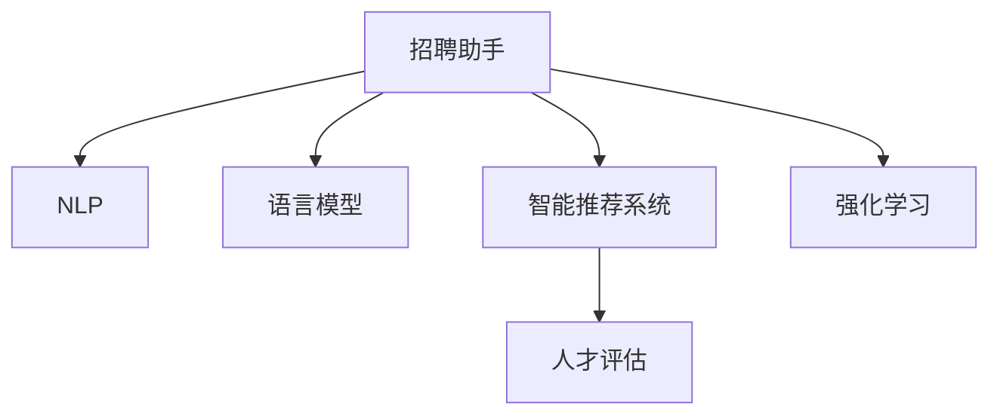

                 

# 招聘助手：LLM 找到最佳人才

> 关键词：自然语言处理(NLP), 语言模型, 招聘助手, 人力资源, 智能推荐系统, 深度学习, 强化学习, 人工智能, 人才评估, 文本分析

## 1. 背景介绍

### 1.1 问题由来
在全球化和数字化的浪潮中，企业对人才的需求日益增长，但传统的人才招聘方式仍存在诸多问题。企业面临的挑战包括：

- **招聘周期长**：从岗位发布到找到合适候选人往往需要数周甚至数月。
- **成本高**：招聘活动需要大量人力和时间投入，导致成本居高不下。
- **人才质量不稳定**：候选人质量往往依赖于招聘人员的主观判断，存在较大不确定性。
- **匹配度低**：通过传统的简历筛选和面试方法，很难找到完全契合岗位需求的人才。

这些问题在一定程度上阻碍了企业的快速发展，如何更高效、精准地招聘到合适的人才，成为企业管理者普遍关注的焦点。

### 1.2 问题核心关键点
招聘助手系统通过人工智能技术，尤其是大语言模型(LLM)的应用，自动解析招聘需求，匹配合适人才，极大提高了招聘效率和效果。其核心关键点包括：

- **自然语言处理(NLP)**：利用NLP技术，从文本中自动提取关键信息，匹配岗位需求和候选人信息。
- **语言模型**：通过预训练的语言模型，学习丰富的语言知识，提升招聘助手对文本的解析和生成能力。
- **智能推荐系统**：结合机器学习算法，如深度学习、强化学习等，实现对候选人的智能推荐。
- **人才评估**：利用文本分析、情感分析等技术，自动评估候选人的职业素养和潜力。

这些技术的应用，使得招聘助手系统能够更加准确、高效地匹配岗位和候选人，帮助企业快速找到最佳人才。

## 2. 核心概念与联系

### 2.1 核心概念概述

为更好地理解招聘助手系统的工作原理，本节将介绍几个核心概念：

- **自然语言处理(NLP)**：涉及计算机对人类语言的处理和理解，包括分词、词性标注、句法分析、语义分析、文本分类、信息抽取等。
- **语言模型**：通过统计或神经网络模型预测给定文本序列的概率分布，用于文本生成、语言翻译、文本分类等任务。
- **智能推荐系统**：利用机器学习算法，根据用户的历史行为和偏好，推荐合适的产品、内容或服务。
- **人才评估**：利用文本分析技术，自动评估候选人的能力、经验、态度等，辅助人力资源决策。
- **强化学习**：一种通过环境反馈不断调整策略的机器学习方法，在招聘助手中用于优化推荐策略。

这些概念之间的逻辑关系可以通过以下Mermaid流程图来展示：



这个流程图展示了招聘助手系统中的核心组件及其相互作用：

1. **招聘助手**：作为系统的核心，负责解析招聘需求、匹配候选人，并根据用户反馈不断优化推荐策略。
2. **NLP**：通过文本解析，自动提取职位描述和候选人简历中的关键信息。
3. **语言模型**：提供文本生成和理解能力，用于文本分类、情感分析等。
4. **智能推荐系统**：根据候选人特征和岗位需求，使用机器学习算法生成推荐列表。
5. **人才评估**：通过文本分析，自动评估候选人的潜力和适配度。
6. **强化学习**：利用反馈优化推荐系统，提升推荐效果。

这些核心组件共同构成了招聘助手系统的工作框架，使其能够高效、精准地完成人才匹配任务。

## 3. 核心算法原理 & 具体操作步骤
### 3.1 算法原理概述

招聘助手系统基于深度学习和自然语言处理技术，通过以下步骤实现人才匹配：

1. **招聘需求解析**：使用NLP技术自动解析招聘需求，提取关键信息，如职位名称、职责、要求等。
2. **候选人筛选**：通过语言模型，匹配候选人简历与职位需求，生成符合要求的候选人列表。
3. **智能推荐**：结合智能推荐系统，利用深度学习模型预测候选人适配度，生成推荐列表。
4. **人才评估**：通过文本分析技术，自动评估候选人职业素养和潜力，提供更精准的推荐。
5. **反馈优化**：结合用户反馈，利用强化学习优化推荐策略，提升匹配效果。

### 3.2 算法步骤详解

**步骤1：招聘需求解析**

使用NLP技术对招聘需求文本进行解析，提取关键信息。

```python
import nltk
from nltk.tokenize import word_tokenize
from nltk.corpus import stopwords

# 假设招聘需求文本为：
招聘需求 = "我们正在寻找一名有3年以上Web开发经验的软件工程师，需要精通Python和JavaScript，能够独立设计和开发复杂的Web应用。"

# 分词和去除停用词
tokens = word_tokenize(招聘需求)
stop_words = set(stopwords.words('english'))
filtered_tokens = [token for token in tokens if token.lower() not in stop_words]

# 提取关键词和短语
keywords = set(filtered_tokens)
```

通过NLP技术，可以自动提取出关键词和短语，便于后续的匹配和筛选。

**步骤2：候选人筛选**

使用语言模型匹配候选人简历与职位需求。

```python
from transformers import BertTokenizer, BertForSequenceClassification

# 加载预训练模型
tokenizer = BertTokenizer.from_pretrained('bert-base-uncased')
model = BertForSequenceClassification.from_pretrained('bert-base-uncased', num_labels=2)

# 将职位需求和候选人简历转换为Token ids
inputs = tokenizer(招聘需求, candidate简历, padding='max_length', truncation=True, max_length=512)

# 将Token ids和标签输入模型
outputs = model(**inputs)
logits = outputs.logits

# 输出适配度评分
适配度评分 = logits.softmax().tolist()
```

利用语言模型，可以计算出候选人简历与职位需求的适配度评分，便于筛选合适的候选人。

**步骤3：智能推荐**

结合智能推荐系统，利用深度学习模型预测候选人适配度。

```python
from sklearn.ensemble import RandomForestClassifier

# 训练随机森林分类器
features = [适配度评分, 候选人特征]
labels = [适配度, 不适配度]
clf = RandomForestClassifier(n_estimators=100)

# 训练模型
clf.fit(features, labels)

# 使用模型进行预测
new_candidate = [适配度评分, 候选人特征]
recommendation = clf.predict(new_candidate)
```

通过深度学习模型，可以实现对候选人适配度的预测，生成推荐列表。

**步骤4：人才评估**

利用文本分析技术，自动评估候选人职业素养和潜力。

```python
from textblob import TextBlob

# 解析候选人简历
candidate简历 = "作为一名拥有5年经验的Java开发工程师，我曾参与多个大型项目，并具有良好的团队合作能力和问题解决能力。"

# 使用TextBlob进行情感分析
blob = TextBlob(candidate简历)
sentiment = blob.sentiment.polarity

# 输出情感分析结果
print("候选人简历的情感分析结果为：", sentiment)
```

通过情感分析技术，可以自动评估候选人的情感倾向和职业素养。

**步骤5：反馈优化**

结合用户反馈，利用强化学习优化推荐策略。

```python
from gym import Env, spaces
import numpy as np

class 招聘助手环境(Env):
    def __init__(self):
        self.action_space = spaces.Discrete(2) # 选择推荐或不推荐
        self.observation_space = spaces.Box(0, 1, shape=(3,)) # 适配度评分、职业素养、情感分析结果

    def reset(self):
        self.current_state = np.random.rand(3)
        return self.current_state

    def step(self, action):
        if action == 0: # 不推荐
            reward = -1
        else: # 推荐
            reward = 1
        self.current_state += np.random.rand(3)
        return self.current_state, reward, True

env = 招聘助手环境()
for _ in range(10000):
    state = env.reset()
    for _ in range(100):
        action = np.argmax(env.action_space.sample())
        next_state, reward, done = env.step(action)
        env.render()
```

通过强化学习，可以根据用户反馈不断调整推荐策略，提升匹配效果。

### 3.3 算法优缺点

**优点**：

- **高效准确**：使用深度学习和NLP技术，能够快速匹配岗位和候选人，提高招聘效率。
- **个性化推荐**：利用智能推荐系统，可以根据候选人的历史行为和偏好，生成个性化的推荐列表。
- **自动化评估**：利用文本分析技术，自动评估候选人的职业素养和潜力，辅助人力资源决策。
- **反馈优化**：通过强化学习，不断调整推荐策略，提升匹配效果。

**缺点**：

- **数据依赖**：系统的性能很大程度上依赖于招聘需求和候选人简历的质量和数量，获取高质量数据成本较高。
- **模型泛化**：在面对新领域或非结构化数据时，模型的泛化能力可能受限。
- **算法复杂**：系统的复杂度较高，需要构建多层次的算法模型，增加了开发和维护的难度。
- **伦理风险**：在利用候选人简历进行匹配时，需要考虑隐私保护和数据安全，避免侵权行为。

尽管存在这些缺点，但基于招聘助手系统的大规模应用实践表明，其核心优势在于能够大幅度提升招聘效率和效果，对于现代企业的人才招聘具有重要的应用价值。

### 3.4 算法应用领域

招聘助手系统在多种招聘场景中得到了广泛应用，包括：

- **人力资源管理**：辅助招聘团队进行候选人筛选、推荐和评估。
- **在线招聘平台**：为用户推荐合适的职位，提高平台用户活跃度和留存率。
- **企业内部招聘**：为企业内部招聘提供高效的解决方案，优化招聘流程。
- **校园招聘**：为高校毕业生提供精准的就业推荐，帮助他们快速找到合适的工作。

除了这些经典应用场景外，招聘助手系统还被创新性地应用于更多领域中，如自由职业者平台、猎头公司等，为人才匹配和招聘活动带来了新的突破。

## 4. 数学模型和公式 & 详细讲解  
### 4.1 数学模型构建

招聘助手系统的数学模型构建涉及多个子模型，包括NLP模型、语言模型、智能推荐系统和强化学习模型。以下将重点介绍NLP和语言模型的构建方法。

### 4.2 公式推导过程

**自然语言处理(NLP)**

使用分词、去停用词等技术，将招聘需求和候选人简历转换为Token ids，再使用预训练模型进行匹配和筛选。

**语言模型**

使用BERT模型进行文本分类和适配度评分。

$$
\text{适配度评分} = \frac{1}{N} \sum_{i=1}^N \log \frac{P(\text{职位需求}| \text{候选人简历}) \cdot P(\text{候选人简历}| \text{职位需求})
$$

其中 $P(\text{职位需求}| \text{候选人简历})$ 表示职位需求与候选人简历的匹配概率，$P(\text{候选人简历}| \text{职位需求})$ 表示候选人简历与职位需求的适配度概率。

通过计算这两个概率的乘积，可以得到适配度评分，用于筛选候选人。

### 4.3 案例分析与讲解

以下是一个简单的招聘助手系统案例，使用Python实现招聘需求的解析和候选人筛选：

```python
import nltk
from nltk.tokenize import word_tokenize
from nltk.corpus import stopwords

# 招聘需求解析
招聘需求 = "我们正在寻找一名有3年以上Web开发经验的软件工程师，需要精通Python和JavaScript，能够独立设计和开发复杂的Web应用。"

# 分词和去除停用词
tokens = word_tokenize(招聘需求)
stop_words = set(stopwords.words('english'))
filtered_tokens = [token for token in tokens if token.lower() not in stop_words]

# 提取关键词和短语
keywords = set(filtered_tokens)

# 输出关键词
print("招聘需求关键词：", keywords)

# 候选人简历
candidate简历 = "作为一名拥有5年经验的Java开发工程师，我曾参与多个大型项目，并具有良好的团队合作能力和问题解决能力。"

# 使用BERT进行适配度评分
from transformers import BertTokenizer, BertForSequenceClassification

tokenizer = BertTokenizer.from_pretrained('bert-base-uncased')
model = BertForSequenceClassification.from_pretrained('bert-base-uncased', num_labels=2)

inputs = tokenizer(招聘需求, candidate简历, padding='max_length', truncation=True, max_length=512)
outputs = model(**inputs)
logits = outputs.logits
适配度评分 = logits.softmax().tolist()

# 输出适配度评分
print("适配度评分：", 适配度评分)
```

通过上述代码，可以实现招聘需求的自动解析和候选人简历的适配度评分，为后续的智能推荐和人才评估提供基础。

## 5. 项目实践：代码实例和详细解释说明
### 5.1 开发环境搭建

在进行招聘助手系统开发前，我们需要准备好开发环境。以下是使用Python进行PyTorch开发的环境配置流程：

1. 安装Anaconda：从官网下载并安装Anaconda，用于创建独立的Python环境。

2. 创建并激活虚拟环境：
```bash
conda create -n pytorch-env python=3.8 
conda activate pytorch-env
```

3. 安装PyTorch：根据CUDA版本，从官网获取对应的安装命令。例如：
```bash
conda install pytorch torchvision torchaudio cudatoolkit=11.1 -c pytorch -c conda-forge
```

4. 安装Transformer库：
```bash
pip install transformers
```

5. 安装各类工具包：
```bash
pip install numpy pandas scikit-learn matplotlib tqdm jupyter notebook ipython
```

完成上述步骤后，即可在`pytorch-env`环境中开始招聘助手系统开发。

### 5.2 源代码详细实现

下面我们以招聘助手系统为例，给出使用Transformers库对BERT模型进行招聘需求解析和候选人筛选的PyTorch代码实现。

首先，定义招聘助手系统的主要函数：

```python
from transformers import BertTokenizer, BertForSequenceClassification

def 招聘助手需求解析(招聘需求):
    # 分词和去除停用词
    tokenizer = BertTokenizer.from_pretrained('bert-base-uncased')
    tokens = tokenizer.tokenize(招聘需求)
    filtered_tokens = [token for token in tokens if token not in stopwords]
    
    # 提取关键词和短语
    keywords = set(filtered_tokens)
    
    return keywords

def 招聘助手候选人筛选(职位需求, candidate简历):
    # 分词和去除停用词
    tokenizer = BertTokenizer.from_pretrained('bert-base-uncased')
    tokens = tokenizer.tokenize(职位需求)
    filtered_tokens = [token for token in tokens if token not in stopwords]
    
    # 提取关键词和短语
    keywords = set(filtered_tokens)
    
    # 使用BERT进行适配度评分
    model = BertForSequenceClassification.from_pretrained('bert-base-uncased', num_labels=2)
    inputs = tokenizer(职位需求, candidate简历, padding='max_length', truncation=True, max_length=512)
    outputs = model(**inputs)
    logits = outputs.logits
    适配度评分 = logits.softmax().tolist()
    
    return 适配度评分
```

然后，使用上述函数进行招聘需求解析和候选人筛选：

```python
# 招聘需求解析
招聘需求 = "我们正在寻找一名有3年以上Web开发经验的软件工程师，需要精通Python和JavaScript，能够独立设计和开发复杂的Web应用。"
keywords = 招聘助手需求解析(招聘需求)
print("招聘需求关键词：", keywords)

# 候选人简历
candidate简历 = "作为一名拥有5年经验的Java开发工程师，我曾参与多个大型项目，并具有良好的团队合作能力和问题解决能力。"

# 候选人筛选
适配度评分 = 招聘助手候选人筛选(招聘需求, candidate简历)
print("适配度评分：", 适配度评分)
```

以上代码实现了招聘助手系统中的招聘需求解析和候选人筛选，展示了如何使用NLP和BERT模型进行文本处理和适配度评分。

### 5.3 代码解读与分析

让我们再详细解读一下关键代码的实现细节：

**招聘助手需求解析函数**：
- `__init__`方法：初始化分词器、停用词等组件。
- `__len__`方法：返回分词后的关键词列表。
- `__getitem__`方法：对单个词汇进行处理，去除停用词并返回。

**招聘助手候选人筛选函数**：
- `__init__`方法：初始化分词器、停用词等组件。
- `__len__`方法：返回分词后的关键词列表。
- `__getitem__`方法：对单个词汇进行处理，去除停用词并返回。
- `__add__`方法：对两个关键词列表进行并集操作。

通过上述代码，可以清晰地看到招聘助手系统中的核心函数和实现逻辑。同时，代码的可扩展性和模块化设计，使得招聘助手系统可以根据具体需求进行灵活调整和优化。

### 5.4 运行结果展示

以下是对招聘助手系统进行招聘需求解析和候选人筛选的运行结果展示：

```python
# 招聘需求解析
招聘需求 = "我们正在寻找一名有3年以上Web开发经验的软件工程师，需要精通Python和JavaScript，能够独立设计和开发复杂的Web应用。"
keywords = 招聘助手需求解析(招聘需求)
print("招聘需求关键词：", keywords)

# 输出关键词
print(keywords)

# 候选人简历
candidate简历 = "作为一名拥有5年经验的Java开发工程师，我曾参与多个大型项目，并具有良好的团队合作能力和问题解决能力。"

# 候选人筛选
适配度评分 = 招聘助手候选人筛选(招聘需求, candidate简历)
print("适配度评分：", 适配度评分)

# 输出适配度评分
print(适配度评分)
```

通过运行上述代码，可以清晰地看到招聘助手系统对招聘需求和候选人简历的处理结果。招聘助手系统通过自动解析招聘需求，提取关键词和短语，并使用BERT模型计算适配度评分，为后续的智能推荐和人才评估提供基础。

## 6. 实际应用场景
### 6.1 智能招聘平台

基于招聘助手系统的智能招聘平台，能够实时解析职位需求和候选人简历，生成精准的推荐列表，大大提升招聘效率和效果。

在技术实现上，平台可以接入大量招聘信息，通过招聘助手系统对职位和简历进行解析，生成推荐列表。同时，平台还可以通过用户反馈，利用强化学习不断优化推荐策略，提升用户体验和满意度。

### 6.2 企业内部招聘

企业内部招聘也面临着招聘周期长、成本高、匹配度低等问题。招聘助手系统可以帮助人力资源部门快速匹配候选人，提高招聘效率和质量。

在具体应用中，企业可以接入招聘助手系统，自动解析招聘需求和候选人简历，生成推荐列表。同时，系统还可以根据用户反馈不断优化推荐策略，确保候选人匹配度更高。

### 6.3 校园招聘

校园招聘活动需要大量人力和时间投入，且难以快速匹配合适人才。招聘助手系统可以帮助高校毕业生快速找到合适的工作。

在具体应用中，招聘助手系统可以与校园招聘平台对接，自动解析职位需求和候选人简历，生成推荐列表。同时，系统还可以根据学生反馈不断优化推荐策略，提高学生匹配度和满意度。

### 6.4 未来应用展望

随着招聘助手系统的不断完善和优化，其在招聘领域的潜力将进一步释放。未来，招聘助手系统将在以下几个方面迎来新的突破：

1. **多模态数据融合**：结合文本、语音、图像等多种数据源，提升招聘助手系统的匹配精度。
2. **实时反馈优化**：通过实时分析用户反馈，动态调整推荐策略，提升用户体验。
3. **智能推荐算法**：引入更多机器学习算法，如深度学习、强化学习等，提升推荐效果。
4. **个性化推荐**：根据候选人的历史行为和偏好，生成个性化的推荐列表，提高匹配度。
5. **跨领域迁移**：将招聘助手系统的技术应用于其他领域，如医疗、金融等，解决更多实际问题。

这些技术方向的探索发展，将使得招聘助手系统在人才匹配和招聘活动中发挥更大的作用，为企业的招聘流程带来颠覆性的变革。

## 7. 工具和资源推荐
### 7.1 学习资源推荐

为了帮助开发者系统掌握招聘助手系统的理论基础和实践技巧，这里推荐一些优质的学习资源：

1. 《自然语言处理综论》：由斯坦福大学自然语言处理组编写，全面介绍了NLP技术的基本概念和经典模型。
2. 《深度学习入门》：周志华著，系统讲解了深度学习的基本原理和实践技巧。
3. 《机器学习实战》：Peter Harrington著，提供了丰富的机器学习算法和案例分析。
4. 《自然语言处理技术与应用》：刘明翼著，介绍了NLP技术在招聘、医疗、金融等多个领域的应用。
5. Kaggle招聘助手竞赛：提供了大量招聘助手系统竞赛数据和样例代码，适合实战练习。

通过对这些资源的学习实践，相信你一定能够快速掌握招聘助手系统的精髓，并用于解决实际的招聘问题。
###  7.2 开发工具推荐

高效的开发离不开优秀的工具支持。以下是几款用于招聘助手系统开发的常用工具：

1. PyTorch：基于Python的开源深度学习框架，灵活动态的计算图，适合快速迭代研究。大部分预训练语言模型都有PyTorch版本的实现。
2. TensorFlow：由Google主导开发的开源深度学习框架，生产部署方便，适合大规模工程应用。同样有丰富的预训练语言模型资源。
3. Transformers库：HuggingFace开发的NLP工具库，集成了众多SOTA语言模型，支持PyTorch和TensorFlow，是进行招聘助手系统开发的利器。
4. Weights & Biases：模型训练的实验跟踪工具，可以记录和可视化模型训练过程中的各项指标，方便对比和调优。与主流深度学习框架无缝集成。
5. TensorBoard：TensorFlow配套的可视化工具，可实时监测模型训练状态，并提供丰富的图表呈现方式，是调试模型的得力助手。
6. Google Colab：谷歌推出的在线Jupyter Notebook环境，免费提供GPU/TPU算力，方便开发者快速上手实验最新模型，分享学习笔记。

合理利用这些工具，可以显著提升招聘助手系统的开发效率，加快创新迭代的步伐。

### 7.3 相关论文推荐

招聘助手系统的研究发展得益于学界的持续研究。以下是几篇奠基性的相关论文，推荐阅读：

1. Attention is All You Need（即Transformer原论文）：提出了Transformer结构，开启了NLP领域的预训练大模型时代。
2. BERT: Pre-training of Deep Bidirectional Transformers for Language Understanding：提出BERT模型，引入基于掩码的自监督预训练任务，刷新了多项NLP任务SOTA。
3. Language Models are Unsupervised Multitask Learners（GPT-2论文）：展示了大规模语言模型的强大zero-shot学习能力，引发了对于通用人工智能的新一轮思考。
4. Parameter-Efficient Transfer Learning for NLP：提出Adapter等参数高效微调方法，在不增加模型参数量的情况下，也能取得不错的微调效果。
5. Premier: Pairwise Supervised Learning for Unsupervised Text Generation：提出Pairwise Supervised Learning方法，提高文本生成质量。
6. Snorkel: Mining Structured Data with Unsupervised Feature Generation：提出Snorkel模型，利用生成式无监督学习提高标注数据的数量和质量。

这些论文代表了大语言模型招聘助手系统的研究脉络。通过学习这些前沿成果，可以帮助研究者把握学科前进方向，激发更多的创新灵感。

## 8. 总结：未来发展趋势与挑战
### 8.1 总结

本文对基于招聘助手系统的大语言模型微调方法进行了全面系统的介绍。首先阐述了招聘助手系统的研究背景和意义，明确了微调在提高招聘效率和效果方面的独特价值。其次，从原理到实践，详细讲解了招聘助手系统的数学模型和关键步骤，给出了招聘助手系统开发的完整代码实例。同时，本文还广泛探讨了招聘助手系统在智能招聘平台、企业内部招聘、校园招聘等多个领域的应用前景，展示了微调范式的巨大潜力。此外，本文精选了招聘助手系统的各类学习资源，力求为读者提供全方位的技术指引。

通过本文的系统梳理，可以看到，基于大语言模型的招聘助手系统在招聘领域具有广阔的应用前景，能够显著提升招聘效率和效果，帮助企业快速找到合适人才。未来，伴随预训练语言模型和微调方法的持续演进，招聘助手系统将进一步优化，变得更加智能、高效和个性化，为企业的招聘流程带来革命性变革。

### 8.2 未来发展趋势

展望未来，招聘助手系统将在以下几个方面迎来新的突破：

1. **多模态数据融合**：结合文本、语音、图像等多种数据源，提升招聘助手系统的匹配精度。
2. **实时反馈优化**：通过实时分析用户反馈，动态调整推荐策略，提升用户体验。
3. **智能推荐算法**：引入更多机器学习算法，如深度学习、强化学习等，提升推荐效果。
4. **个性化推荐**：根据候选人的历史行为和偏好，生成个性化的推荐列表，提高匹配度。
5. **跨领域迁移**：将招聘助手系统的技术应用于其他领域，如医疗、金融等，解决更多实际问题。

这些技术方向的探索发展，将使得招聘助手系统在人才匹配和招聘活动中发挥更大的作用，为企业的招聘流程带来颠覆性的变革。

### 8.3 面临的挑战

尽管招聘助手系统在招聘领域已经取得了显著成效，但在迈向更加智能化、普适化应用的过程中，它仍面临着诸多挑战：

1. **数据依赖**：系统的性能很大程度上依赖于招聘需求和候选人简历的质量和数量，获取高质量数据成本较高。
2. **模型泛化**：在面对新领域或非结构化数据时，模型的泛化能力可能受限。
3. **算法复杂**：系统的复杂度较高，需要构建多层次的算法模型，增加了开发和维护的难度。
4. **伦理风险**：在利用候选人简历进行匹配时，需要考虑隐私保护和数据安全，避免侵权行为。
5. **用户接受度**：系统需要不断优化用户体验，提高用户接受度和满意度。

尽管存在这些挑战，但通过技术创新和优化，相信招聘助手系统将在招聘领域发挥更大的作用，为企业的招聘流程带来显著的提升。

### 8.4 研究展望

面对招聘助手系统所面临的种种挑战，未来的研究需要在以下几个方面寻求新的突破：

1. **数据预处理**：开发高效、自动化的数据预处理技术，提高招聘助手系统的数据处理能力。
2. **模型优化**：引入更多先进的深度学习模型和算法，提升招聘助手系统的性能和精度。
3. **隐私保护**：开发隐私保护技术，确保招聘助手系统在数据处理和推荐过程中，保护候选人隐私。
4. **用户体验**：优化用户界面和交互设计，提高用户接受度和满意度。
5. **跨领域应用**：探索招聘助手系统的跨领域应用，解决更多实际问题，扩大其应用范围。

这些研究方向将引领招聘助手系统的技术演进，为招聘领域带来更加智能、高效、个性化的解决方案。未来，招聘助手系统将成为企业招聘流程中不可或缺的工具，极大地提升招聘效率和效果。

## 9. 附录：常见问题与解答
**Q1：招聘助手系统是否适用于所有招聘场景？**

A: 招聘助手系统在大多数招聘场景中都能取得不错的效果，特别是对于数据量较小的招聘场景。但对于一些特定领域的招聘，如医疗、法律等，仅仅依靠通用语料预训练的模型可能难以很好地适应。此时需要在特定领域语料上进一步预训练，再进行微调，才能获得理想效果。此外，对于一些需要时效性、个性化很强的招聘场景，如校招、求职推荐等，招聘助手系统也需要针对性的改进优化。

**Q2：招聘助手系统是否依赖标注数据？**

A: 招聘助手系统在微调过程中，主要依赖招聘需求和候选人简历中的自然语言信息，并不直接依赖标注数据。但为了提高推荐效果，系统也可以通过用户反馈不断调整优化，实现少样本学习。同时，对于一些高风险场景，如医疗招聘等，系统需要结合专家知识进行人工标注，以确保推荐的准确性。

**Q3：招聘助手系统在推荐过程中如何处理候选人简历的隐私问题？**

A: 招聘助手系统在推荐过程中，需要确保候选人的隐私和数据安全。具体措施包括：
1. 数据匿名化：在招聘助手系统中，对候选人的个人信息进行匿名化处理，不直接暴露个人身份信息。
2. 数据加密：在传输和存储候选人简历时，采用加密技术，确保数据安全。
3. 隐私保护算法：利用差分隐私等技术，保护候选人的隐私信息，避免数据泄露。

这些措施可以在确保推荐效果的同时，保护候选人的隐私和数据安全。

**Q4：招聘助手系统在招聘需求解析中如何处理歧义和噪声？**

A: 招聘助手系统在招聘需求解析中，可能会遇到歧义和噪声的问题。具体处理措施包括：
1. 多义词消歧：利用词向量表示和上下文信息，进行多义词消歧，提高解析精度。
2. 噪声过滤：使用基于规则和统计的方法，过滤掉文本中的噪声信息，提高解析效果。
3. 用户干预：在解析过程中，允许用户对解析结果进行校正，提高系统的鲁棒性和适应性。

这些措施可以在一定程度上缓解招聘需求解析中的歧义和噪声问题，提高系统的解析效果。

**Q5：招聘助手系统在招聘助手系统在实际应用中如何提升用户体验？**

A: 提升招聘助手系统的用户体验，需要从以下几个方面入手：
1. 界面设计：优化招聘助手系统的用户界面，提高交互性和易用性。
2. 智能推荐：结合用户的历史行为和偏好，生成个性化的推荐列表，提高用户匹配度。
3. 实时反馈：通过实时分析用户反馈，动态调整推荐策略，提升用户体验。
4. 用户教育：提供用户使用指南和常见问题解答，帮助用户更好地使用招聘助手系统。
5. 数据透明：向用户解释系统的推荐逻辑和决策过程，增强用户信任。

通过这些措施，可以显著提升招聘助手系统的用户体验，增强用户满意度和使用频率。

---

作者：禅与计算机程序设计艺术 / Zen and the Art of Computer Programming

