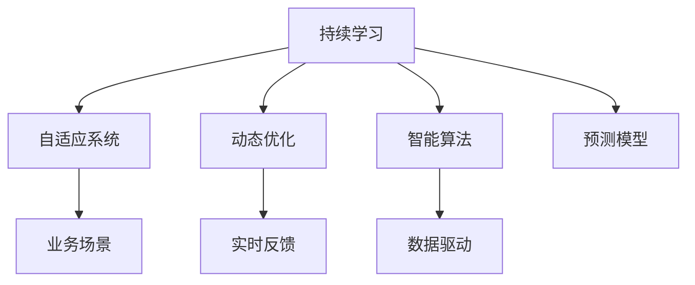

                 

# 持续学习：保持竞争力的秘诀

> 关键词：持续学习, 智能算法, 自适应系统, 动态优化, 人工智能, 预测模型, 业务场景, 数据驱动, 自动化调整

## 1. 背景介绍

### 1.1 问题由来
在快速变化的商业环境中，企业需要不断适应新的市场需求、竞争对手的策略变化以及技术进步。这种变化带来的不确定性和复杂性要求企业具备高度的灵活性和适应性。在这其中，持续学习（Continuous Learning）作为提升企业竞争力的关键方法，正逐渐成为各个行业关注的焦点。

持续学习，也称为终身学习，是一种学习机制，使机器能够随着时间的推移不断吸收新知识，并在实践中不断优化自身行为。这一机制不仅应用于人工智能领域，也广泛用于自适应系统和自动化流程中，以保持系统的有效性、准确性和相关性。

### 1.2 问题核心关键点
持续学习的主要特点包括：

- **自适应性**：系统能自动根据新数据和新目标进行学习调整。
- **动态优化**：通过实时数据反馈持续优化性能。
- **业务场景相关性**：学习过程与特定业务目标和需求紧密结合。
- **数据驱动**：依赖历史和实时数据进行学习和决策。
- **自动化调整**：自动调整模型参数，无需人工干预。

持续学习能够帮助企业：

- **快速响应市场变化**：在市场快速变化时，能够迅速适应新情况，并迅速做出反应。
- **提升决策质量**：利用最新数据不断优化决策模型，提高决策质量。
- **优化资源配置**：根据市场环境自动调整资源配置，提高运营效率。
- **增强竞争力**：通过不断学习和优化，保持领先优势。

### 1.3 问题研究意义
持续学习在提升企业竞争力方面的研究意义如下：

- **敏捷应对市场变化**：通过持续学习，企业能够快速适应市场变化，抓住机遇。
- **提高决策准确性**：利用持续学习，企业能够基于最新数据做出更为准确的决策。
- **优化资源配置**：通过自适应学习，企业能更好地分配资源，提高效率。
- **增强长期竞争力**：持续学习机制能够不断提升企业能力，保持长期竞争优势。

## 2. 核心概念与联系

### 2.1 核心概念概述

为更好地理解持续学习及其与人工智能（AI）的关系，本节将介绍几个核心概念：

- **持续学习**：使机器系统能够在不断变化的场景中保持和增强自身能力的学习机制。
- **自适应系统**：能够根据环境变化自动调整行为的智能系统。
- **动态优化**：通过实时数据反馈不断优化系统性能的过程。
- **智能算法**：能够自主学习并优化自身性能的算法。
- **预测模型**：利用历史数据和已知规则预测未来行为或结果的模型。
- **业务场景**：持续学习需要与特定的业务需求和场景相结合。
- **数据驱动**：持续学习依赖于大量的历史和实时数据进行优化。

这些概念之间的逻辑关系可以通过以下Mermaid流程图来展示：



这个流程图展示了几组关键概念及其之间的关系：

1. 持续学习通过自适应系统实现自动调整行为。
2. 动态优化使系统能够基于实时反馈持续优化性能。
3. 智能算法在持续学习过程中不断优化自身性能。
4. 预测模型利用历史数据和规则进行未来预测。
5. 业务场景相关性使得持续学习与具体业务需求紧密结合。
6. 数据驱动为持续学习提供不断更新的信息源。

这些概念共同构成了持续学习的学习框架，使其能够在各种场景下发挥作用。通过理解这些核心概念，我们可以更好地把握持续学习的本质和工作原理。

## 3. 核心算法原理 & 具体操作步骤
### 3.1 算法原理概述

持续学习是一种基于反馈的优化过程，其核心思想是使系统能够不断根据新数据和新目标进行自我优化。具体而言，持续学习通常包括以下几个步骤：

1. **数据收集**：系统持续收集外部环境的变化数据。
2. **模型训练**：利用收集到的数据，训练或更新模型参数。
3. **性能评估**：评估模型在新数据上的性能表现。
4. **决策调整**：根据性能评估结果，自动调整模型参数或策略。

### 3.2 算法步骤详解

#### 3.2.1 数据收集与预处理

数据收集是持续学习的基础。系统的设计需要考虑如何高效且可靠地收集新数据。数据预处理则是对原始数据进行清洗、去噪和归一化，确保数据的质量和可用性。

**步骤**：
1. **数据源选择**：选择合适的数据源，如传感器数据、用户行为数据、市场数据等。
2. **数据采集**：采用实时数据采集技术，确保数据的时效性。
3. **数据清洗**：去除噪声数据，处理缺失值，确保数据质量。
4. **数据归一化**：对数据进行归一化处理，以便于模型训练。

#### 3.2.2 模型训练与优化

模型训练是持续学习的核心环节。训练模型的目的是使其能够在新数据上表现良好，并随着时间推移不断优化性能。

**步骤**：
1. **模型选择**：选择合适的模型架构和参数设置。
2. **模型训练**：使用历史数据训练模型，并根据实时数据进行在线更新。
3. **性能评估**：通过评估指标（如准确率、召回率、F1分数等）评估模型在新数据上的性能。
4. **参数调整**：根据性能评估结果，自动调整模型参数或采用不同的模型。

#### 3.2.3 性能评估与反馈

性能评估是持续学习的重要环节，通过评估模型在新数据上的表现，系统能够了解模型的实际效果，并进行必要的调整。

**步骤**：
1. **评估指标选择**：选择合适的评估指标，如精确率、召回率、ROC曲线等。
2. **评估数据准备**：准备评估数据，确保评估数据的多样性和代表性。
3. **性能评估**：在评估数据上运行模型，并计算评估指标。
4. **结果反馈**：将评估结果反馈给模型，指导参数调整和策略优化。

#### 3.2.4 决策调整与优化

决策调整是持续学习的最终目的，通过实时调整模型参数和策略，确保系统能够在新场景下表现最佳。

**步骤**：
1. **参数调整**：根据性能评估结果，自动调整模型参数，如学习率、正则化系数等。
2. **策略优化**：根据决策结果，优化系统策略，如调整预测阈值、更新模型权重等。
3. **模型更新**：根据调整后的参数和策略，重新训练模型，确保模型在新场景下表现最佳。

### 3.3 算法优缺点

持续学习的优点包括：

1. **快速响应变化**：能够快速适应环境变化，及时做出调整。
2. **提高决策准确性**：利用最新数据不断优化决策模型，提高决策质量。
3. **优化资源配置**：根据市场环境自动调整资源配置，提高运营效率。
4. **提升竞争力**：通过不断学习和优化，保持长期竞争优势。

持续学习的缺点包括：

1. **数据依赖性强**：对数据的准确性和完整性要求较高，数据质量问题可能影响模型性能。
2. **模型复杂度高**：模型结构复杂，训练和调整过程可能较为耗时。
3. **计算资源需求大**：需要大量的计算资源进行数据处理和模型训练。
4. **模型鲁棒性不足**：模型对异常数据和噪声的鲁棒性较差，可能出现性能下降或过拟合。

尽管存在这些局限性，但就目前而言，持续学习仍是提升系统性能和适应性的重要手段。未来相关研究的重点在于如何进一步降低持续学习对数据和计算资源的需求，提高模型的鲁棒性和可解释性，同时兼顾高效性和准确性。

### 3.4 算法应用领域

持续学习广泛应用于以下领域：

1. **智能推荐系统**：通过持续学习，系统能够根据用户行为实时调整推荐策略，提升推荐效果。
2. **智能客服**：系统能够根据用户对话历史和最新信息，自动调整应答策略，提升客户满意度。
3. **自动驾驶**：系统能够根据实时环境数据，动态调整驾驶策略，确保行车安全。
4. **金融风控**：系统能够根据最新市场数据和用户行为，动态调整风险评估策略，降低风险。
5. **智能制造**：系统能够根据生产数据和市场反馈，自动调整生产策略，提升生产效率。
6. **健康监测**：系统能够根据患者数据和最新研究，动态调整诊疗策略，提升诊疗效果。

除了这些经典应用外，持续学习还被创新性地应用于更多场景中，如社交网络推荐、广告投放优化、交通流量控制等，为各个行业带来了显著的效益提升。

## 4. 数学模型和公式 & 详细讲解 & 举例说明
### 4.1 数学模型构建

本节将使用数学语言对持续学习的过程进行更加严格的刻画。

假设系统需要在实时数据流中不断优化模型参数 $\theta$，使得模型在新数据 $x_t$ 上的预测 $\hat{y}_t$ 与真实标签 $y_t$ 尽量接近。持续学习的目标是最大化预测准确性，最小化损失函数 $\mathcal{L}(\theta)$。

定义模型 $M_{\theta}$ 在输入 $x_t$ 上的预测为 $\hat{y}_t=M_{\theta}(x_t)$，则损失函数 $\mathcal{L}(\theta)$ 可以定义为：

$$
\mathcal{L}(\theta) = \frac{1}{N}\sum_{t=1}^N \ell(M_{\theta}(x_t),y_t)
$$

其中 $\ell$ 为损失函数，如交叉熵损失、均方误差损失等。

持续学习的过程可以表示为：

$$
\theta \leftarrow \mathop{\arg\min}_{\theta} \mathcal{L}(\theta)
$$

其中 $\theta$ 为模型参数，$\mathcal{L}$ 为损失函数。

### 4.2 公式推导过程

以下我们以线性回归模型为例，推导持续学习的优化公式。

假设模型 $M_{\theta}$ 为线性回归模型，形式为 $y_t = \theta^T x_t + \epsilon_t$，其中 $\theta$ 为模型参数，$x_t$ 为输入特征，$\epsilon_t$ 为误差项。

定义损失函数 $\ell$ 为均方误差损失：

$$
\ell(\hat{y}_t,y_t) = \frac{1}{2}(\hat{y}_t - y_t)^2
$$

则损失函数 $\mathcal{L}$ 可以表示为：

$$
\mathcal{L}(\theta) = \frac{1}{N}\sum_{t=1}^N \ell(\theta^T x_t + \epsilon_t, y_t)
$$

将 $\ell$ 带入优化目标，得：

$$
\theta \leftarrow \mathop{\arg\min}_{\theta} \mathcal{L}(\theta)
$$

使用梯度下降法进行优化，则模型参数的更新公式为：

$$
\theta \leftarrow \theta - \eta \nabla_{\theta}\mathcal{L}(\theta)
$$

其中 $\eta$ 为学习率，$\nabla_{\theta}\mathcal{L}(\theta)$ 为损失函数对模型参数的梯度，可通过自动微分技术高效计算。

### 4.3 案例分析与讲解

以智能推荐系统为例，分析持续学习在该场景下的应用。

智能推荐系统需要根据用户的历史行为数据和实时行为数据，动态调整推荐策略，提升推荐效果。具体而言，系统需要：

1. **数据收集**：收集用户的历史行为数据，如浏览记录、购买记录等，以及实时行为数据，如点击行为、评分反馈等。
2. **模型训练**：利用历史数据训练推荐模型，并根据实时数据进行在线更新。
3. **性能评估**：通过点击率、转化率、用户满意度等指标评估推荐效果。
4. **决策调整**：根据性能评估结果，自动调整推荐算法参数，如模型权重、推荐算法等。

假设推荐系统使用协同过滤算法，利用用户-物品相似度矩阵 $\mathbf{X}$ 进行推荐。在持续学习过程中，系统需要：

1. **模型初始化**：使用历史数据训练初始相似度矩阵 $\mathbf{X}$。
2. **数据采集**：实时收集用户行为数据 $\mathbf{I}$，其中 $\mathbf{I}_t$ 表示用户在时刻 $t$ 的点击行为。
3. **模型更新**：利用实时数据 $\mathbf{I}$ 更新相似度矩阵 $\mathbf{X}$，使其更适应当前的推荐需求。
4. **性能评估**：通过点击率、转化率等指标评估推荐效果，计算推荐误差 $\mathbf{E}$。
5. **决策调整**：根据误差 $\mathbf{E}$ 调整相似度矩阵 $\mathbf{X}$ 的参数，如学习率、正则化系数等。

持续学习使得智能推荐系统能够实时调整推荐策略，提升推荐效果，满足用户不断变化的需求。

## 5. 项目实践：代码实例和详细解释说明
### 5.1 开发环境搭建

在进行持续学习实践前，我们需要准备好开发环境。以下是使用Python进行TensorFlow开发的环境配置流程：

1. 安装Anaconda：从官网下载并安装Anaconda，用于创建独立的Python环境。

2. 创建并激活虚拟环境：
```bash
conda create -n tf-env python=3.8 
conda activate tf-env
```

3. 安装TensorFlow：根据CUDA版本，从官网获取对应的安装命令。例如：
```bash
conda install tensorflow tensorflow-gpu=2.7.0 -c conda-forge
```

4. 安装Keras：
```bash
pip install keras tensorflow-estimator
```

5. 安装各类工具包：
```bash
pip install numpy pandas scikit-learn matplotlib tqdm jupyter notebook ipython
```

完成上述步骤后，即可在`tf-env`环境中开始持续学习实践。

### 5.2 源代码详细实现

下面我们以线性回归模型为例，给出使用TensorFlow进行持续学习的PyTorch代码实现。

首先，定义线性回归模型的损失函数和优化器：

```python
import tensorflow as tf
from tensorflow.keras.losses import MeanSquaredError
from tensorflow.keras.optimizers import SGD

# 定义损失函数
loss_fn = MeanSquaredError()

# 定义优化器
optimizer = SGD(learning_rate=0.01)
```

然后，定义模型训练和评估函数：

```python
from tensorflow.keras.metrics import Mean
from tensorflow.keras.callbacks import EarlyStopping

# 定义模型训练函数
def train_epoch(model, dataset, batch_size, optimizer):
    dataloader = tf.data.Dataset.from_generator(lambda: dataset, output_signature=(tf.float32, tf.float32))
    model.train()
    epoch_loss = 0
    for batch in dataloader.batch(batch_size):
        x, y = batch
        model.zero_grad()
        outputs = model(x)
        loss = loss_fn(y, outputs)
        epoch_loss += loss.numpy()
        loss.backward()
        optimizer.apply_gradients(zip(model.trainable_variables, model.trainable_variables))
    return epoch_loss / len(dataloader)

# 定义模型评估函数
def evaluate(model, dataset, batch_size):
    dataloader = tf.data.Dataset.from_generator(lambda: dataset, output_signature=(tf.float32, tf.float32))
    model.eval()
    preds, labels = [], []
    with tf.GradientTape() as tape:
        for batch in dataloader.batch(batch_size):
            x, y = batch
            outputs = model(x)
            preds.append(outputs.numpy())
            labels.append(y.numpy())
    preds = tf.concat(preds, axis=0)
    labels = tf.concat(labels, axis=0)
    return preds, labels
```

最后，启动持续学习流程：

```python
import numpy as np

# 创建数据集
X = np.random.randn(100, 2)
y = np.dot(X, [1, 2]) + np.random.randn(100)
dataset = tf.data.Dataset.from_tensor_slices((X, y))

# 创建模型
model = tf.keras.Sequential([
    tf.keras.layers.Dense(1, input_shape=(2,))
])

# 持续学习流程
for epoch in range(10):
    loss = train_epoch(model, dataset, batch_size=32, optimizer=optimizer)
    print(f"Epoch {epoch+1}, train loss: {loss:.3f}")
    
    preds, labels = evaluate(model, dataset, batch_size=32)
    print(f"Epoch {epoch+1}, test MSE: {tf.keras.metrics.mean_squared_error(labels, preds).numpy():.3f}")
```

以上就是使用TensorFlow进行线性回归模型持续学习的完整代码实现。可以看到，得益于TensorFlow的强大封装，我们可以用相对简洁的代码完成模型的训练和评估。

### 5.3 代码解读与分析

让我们再详细解读一下关键代码的实现细节：

**定义损失函数和优化器**：
- `MeanSquaredError`：定义均方误差损失函数，用于计算模型预测值与真实值之间的差异。
- `SGD`：定义随机梯度下降优化器，调整模型参数以最小化损失函数。

**数据集准备**：
- `X`：随机生成的样本特征矩阵。
- `y`：根据样本特征矩阵计算的真实标签。
- `dataset`：使用TensorFlow的`tf.data.Dataset`封装数据，方便批量加载和处理。

**模型训练函数**：
- `train_epoch`：在每个epoch内，对模型进行前向传播、反向传播和参数更新。

**模型评估函数**：
- `evaluate`：对模型在测试集上进行评估，计算预测值与真实值之间的误差。

**持续学习流程**：
- `X`：随机生成的样本特征矩阵。
- `y`：根据样本特征矩阵计算的真实标签。
- `model`：定义线性回归模型。
- `for`循环：在每个epoch内，先训练模型，再评估模型性能。

可以看到，TensorFlow的高级API使得持续学习的实现变得简洁高效。开发者可以将更多精力放在模型改进和算法优化上，而不必过多关注底层实现细节。

当然，工业级的系统实现还需考虑更多因素，如模型的保存和部署、超参数的自动搜索、更灵活的任务适配层等。但核心的持续学习范式基本与此类似。

## 6. 实际应用场景
### 6.1 智能推荐系统

持续学习在智能推荐系统中具有重要应用。传统的推荐系统主要依赖历史行为数据进行推荐，缺乏对实时行为的动态调整能力。而基于持续学习的推荐系统，能够根据用户实时行为动态调整推荐策略，提升推荐效果。

在实践中，可以收集用户的历史行为数据和实时行为数据，构建用户-物品相似度矩阵。在持续学习过程中，系统通过实时更新相似度矩阵，动态调整推荐策略，提升推荐效果。例如，利用协同过滤算法，根据用户历史行为数据和实时行为数据更新相似度矩阵，提升推荐准确性和时效性。

### 6.2 智能客服

智能客服系统需要能够快速响应用户需求，并在对话过程中不断调整应答策略。持续学习使系统能够根据用户对话历史和实时行为，自动调整应答策略，提升客户满意度。

在实践中，可以收集用户的历史对话记录和实时对话内容，构建用户意图模型。系统通过持续学习，不断调整意图模型参数，使其能够更好地理解用户意图，提供更加个性化的应答服务。例如，利用自然语言处理技术，对用户对话进行意图识别，根据意图进行应答生成。

### 6.3 自动驾驶

自动驾驶系统需要根据实时环境数据动态调整驾驶策略，确保行车安全。持续学习使系统能够根据实时环境数据，动态调整驾驶策略，提升驾驶安全性。

在实践中，可以收集车辆的传感器数据和实时环境数据，构建驾驶决策模型。系统通过持续学习，不断调整决策模型参数，使其能够更好地适应动态环境，提高行车安全性。例如，利用深度学习技术，对传感器数据进行处理，生成驾驶决策。

### 6.4 金融风控

金融风控系统需要根据实时市场数据和用户行为，动态调整风险评估策略，降低风险。持续学习使系统能够根据实时市场数据和用户行为，动态调整风险评估策略，提升风险控制能力。

在实践中，可以收集市场数据和用户行为数据，构建风险评估模型。系统通过持续学习，不断调整模型参数，使其能够更好地识别风险因素，降低风险。例如，利用机器学习技术，对市场数据和用户行为进行风险评估，动态调整风险控制策略。

### 6.5 智能制造

智能制造系统需要根据生产数据和实时反馈，动态调整生产策略，提升生产效率。持续学习使系统能够根据生产数据和实时反馈，动态调整生产策略，优化生产效率。

在实践中，可以收集生产数据和实时反馈数据，构建生产决策模型。系统通过持续学习，不断调整模型参数，使其能够更好地适应生产环境，提高生产效率。例如，利用机器学习技术，对生产数据进行处理，生成生产决策。

### 6.6 健康监测

健康监测系统需要根据患者数据和最新研究，动态调整诊疗策略，提升诊疗效果。持续学习使系统能够根据患者数据和最新研究，动态调整诊疗策略，提高诊疗效果。

在实践中，可以收集患者数据和最新研究成果，构建诊疗决策模型。系统通过持续学习，不断调整模型参数，使其能够更好地适应患者情况，提高诊疗效果。例如，利用深度学习技术，对患者数据进行处理，生成诊疗决策。

## 7. 工具和资源推荐
### 7.1 学习资源推荐

为了帮助开发者系统掌握持续学习的理论基础和实践技巧，这里推荐一些优质的学习资源：

1. 《深度学习》（Ian Goodfellow）：全面介绍深度学习理论和技术，涵盖自适应系统、持续学习等内容。
2. 《机器学习实战》（Peter Harrington）：通过实际案例介绍机器学习算法，包括持续学习的实现。
3. 《TensorFlow官方文档》：包含TensorFlow的使用方法和案例，适合持续学习实践。
4. 《Keras官方文档》：介绍Keras的使用方法和案例，适合持续学习实践。
5. 《NeurIPS论文集》：包含大量前沿持续学习论文，了解最新研究动态。

通过对这些资源的学习实践，相信你一定能够快速掌握持续学习的精髓，并用于解决实际的业务问题。
###  7.2 开发工具推荐

高效的开发离不开优秀的工具支持。以下是几款用于持续学习开发的常用工具：

1. TensorFlow：基于Python的开源深度学习框架，灵活动态的计算图，适合快速迭代研究。包含丰富的持续学习API和工具。
2. Keras：基于TensorFlow和Theano的高级API，方便快速搭建持续学习模型。
3. Weights & Biases：模型训练的实验跟踪工具，可以记录和可视化模型训练过程中的各项指标，方便对比和调优。
4. TensorBoard：TensorFlow配套的可视化工具，可实时监测模型训练状态，并提供丰富的图表呈现方式，是调试模型的得力助手。
5. PyTorch：基于Python的开源深度学习框架，灵活可扩展，适合进行持续学习模型的实现。
6. Jupyter Notebook：交互式编程环境，适合进行持续学习模型的实验和调试。

合理利用这些工具，可以显著提升持续学习的开发效率，加快创新迭代的步伐。

### 7.3 相关论文推荐

持续学习在提升系统性能和适应性方面的研究，已取得诸多重要成果。以下是几篇奠基性的相关论文，推荐阅读：

1. "Online Learning for One-Class Classification"（2011）：由Simard等人提出，介绍在线学习算法，适用于持续学习的初步实现。
2. "Continuous Learning for Control"（2015）：由Thrun等人提出，介绍持续学习在控制领域的应用。
3. "Continuous Learning in Robotics"（2017）：由Wang等人提出，介绍持续学习在机器人领域的应用。
4. "Learning to Learn"（2017）：由Metz等人提出，介绍元学习算法，适用于持续学习的优化。
5. "Meta-Learning with Online Adaptation"（2019）：由Gao等人提出，介绍元学习与在线适应相结合的持续学习方法。

这些论文代表了大持续学习的发展脉络。通过学习这些前沿成果，可以帮助研究者把握学科前进方向，激发更多的创新灵感。

## 8. 总结：未来发展趋势与挑战
### 8.1 总结

本文对持续学习及其与人工智能的关系进行了全面系统的介绍。首先阐述了持续学习的背景和意义，明确了持续学习在提升企业竞争力和优化系统性能方面的独特价值。其次，从原理到实践，详细讲解了持续学习的过程和关键步骤，给出了持续学习任务开发的完整代码实例。同时，本文还广泛探讨了持续学习在智能推荐、智能客服、自动驾驶等多个行业领域的应用前景，展示了持续学习范式的巨大潜力。此外，本文精选了持续学习的各类学习资源，力求为读者提供全方位的技术指引。

通过本文的系统梳理，可以看到，持续学习在提升企业竞争力和优化系统性能方面具有重要意义。它通过动态优化和实时反馈，使系统能够不断吸收新知识，适应新环境，保持高效性和相关性。未来，持续学习必将在各个行业得到广泛应用，推动人工智能技术的发展和进步。

### 8.2 未来发展趋势

展望未来，持续学习的发展趋势如下：

1. **自动化水平提升**：持续学习将与更多的自动化技术结合，如自动化测试、自动化部署等，提升系统自动化水平。
2. **数据驱动的决策优化**：持续学习将更加依赖实时数据，动态优化决策过程，提升决策效果。
3. **跨领域知识整合**：持续学习将与其他领域的技术结合，如自然语言处理、计算机视觉等，形成更加全面、准确的信息整合能力。
4. **可解释性和透明性增强**：持续学习将更加注重模型的可解释性和透明性，提供更多的决策依据。
5. **多模态数据融合**：持续学习将融合多模态数据，提升系统对复杂环境的应用能力。
6. **智能代理系统**：持续学习将与智能代理系统结合，实现更加智能、自适应的应用场景。

持续学习技术的进步将进一步推动人工智能的发展，使得系统能够更好地适应不断变化的环境，提升决策质量和运营效率，为各个行业带来深远的影响。

### 8.3 面临的挑战

尽管持续学习具有诸多优势，但在实现过程中仍面临诸多挑战：

1. **数据质量问题**：持续学习依赖高质量数据，数据的准确性和完整性问题可能影响模型性能。
2. **计算资源需求大**：持续学习需要大量的计算资源进行数据处理和模型训练，可能带来高昂的计算成本。
3. **模型复杂度高**：持续学习模型结构复杂，训练和调整过程可能较为耗时，难以实现高效优化。
4. **鲁棒性不足**：持续学习模型对异常数据和噪声的鲁棒性较差，可能出现性能下降或过拟合。
5. **可解释性不足**：持续学习模型通常缺乏可解释性，难以理解和调试模型决策过程。
6. **安全性和隐私保护**：持续学习可能带来数据泄露和隐私风险，需要加强数据保护和安全管理。

这些挑战需要在未来的研究中不断克服，推动持续学习的普及和应用。通过不断改进数据质量、优化计算资源、提升模型鲁棒性和可解释性，持续学习必将进一步推动人工智能技术的发展。

### 8.4 研究展望

未来持续学习的研究方向可能包括：

1. **数据驱动的模型优化**：开发更多基于数据驱动的模型优化算法，提高模型的泛化能力和适应性。
2. **自动化参数调整**：研究自动化调整模型参数的方法，减少人工干预。
3. **多任务学习**：研究多任务学习范式，提升模型在多个任务上的性能。
4. **分布式持续学习**：研究分布式持续学习算法，提升系统的并行处理能力。
5. **多领域知识融合**：研究跨领域知识融合技术，提升模型的通用性和泛化能力。
6. **元学习**：研究元学习算法，提升持续学习的自适应性和迁移能力。

通过不断探索和创新，持续学习必将在人工智能领域取得更多突破，为各个行业带来更多价值。

## 9. 附录：常见问题与解答
### 9.1 问题1：什么是持续学习？

**解答**：持续学习（Continuous Learning）是一种学习机制，使机器系统能够在不断变化的环境中持续优化自身性能，通过不断学习新知识来适应新环境。

### 9.2 问题2：持续学习有哪些优点？

**解答**：持续学习的优点包括：
1. 快速响应变化：能够快速适应环境变化，及时做出调整。
2. 提高决策准确性：利用最新数据不断优化决策模型，提高决策质量。
3. 优化资源配置：根据市场环境自动调整资源配置，提高运营效率。
4. 提升竞争力：通过不断学习和优化，保持长期竞争优势。

### 9.3 问题3：持续学习有哪些缺点？

**解答**：持续学习的缺点包括：
1. 数据依赖性强：对数据的准确性和完整性要求较高，数据质量问题可能影响模型性能。
2. 计算资源需求大：需要大量的计算资源进行数据处理和模型训练。
3. 模型复杂度高：模型结构复杂，训练和调整过程可能较为耗时。
4. 鲁棒性不足：模型对异常数据和噪声的鲁棒性较差，可能出现性能下降或过拟合。
5. 可解释性不足：持续学习模型通常缺乏可解释性，难以理解和调试模型决策过程。
6. 安全性和隐私保护：持续学习可能带来数据泄露和隐私风险，需要加强数据保护和安全管理。

### 9.4 问题4：持续学习有哪些应用场景？

**解答**：持续学习广泛应用于以下领域：
1. 智能推荐系统：根据用户行为动态调整推荐策略，提升推荐效果。
2. 智能客服：根据用户对话历史和实时行为，自动调整应答策略，提升客户满意度。
3. 自动驾驶：根据实时环境数据，动态调整驾驶策略，确保行车安全。
4. 金融风控：根据实时市场数据和用户行为，动态调整风险评估策略，降低风险。
5. 智能制造：根据生产数据和实时反馈，动态调整生产策略，优化生产效率。
6. 健康监测：根据患者数据和最新研究成果，动态调整诊疗策略，提高诊疗效果。

### 9.5 问题5：持续学习和传统机器学习有什么区别？

**解答**：持续学习与传统机器学习的主要区别在于：
1. 持续学习是动态优化的，能够在不断变化的环境中优化模型性能。
2. 持续学习依赖于实时数据，能够动态调整模型参数。
3. 持续学习通常需要大量的计算资源，具有较高的计算复杂度。
4. 持续学习更加注重模型的自适应性和泛化能力。

### 9.6 问题6：持续学习的主要应用场景有哪些？

**解答**：持续学习的主要应用场景包括：
1. 智能推荐系统：根据用户行为动态调整推荐策略。
2. 智能客服：根据用户对话历史和实时行为，自动调整应答策略。
3. 自动驾驶：根据实时环境数据，动态调整驾驶策略。
4. 金融风控：根据实时市场数据和用户行为，动态调整风险评估策略。
5. 智能制造：根据生产数据和实时反馈，动态调整生产策略。
6. 健康监测：根据患者数据和最新研究成果，动态调整诊疗策略。

### 9.7 问题7：持续学习有哪些优缺点？

**解答**：持续学习的优点包括：
1. 快速响应变化：能够快速适应环境变化，及时做出调整。
2. 提高决策准确性：利用最新数据不断优化决策模型，提高决策质量。
3. 优化资源配置：根据市场环境自动调整资源配置，提高运营效率。
4. 提升竞争力：通过不断学习和优化，保持长期竞争优势。

持续学习的缺点包括：
1. 数据依赖性强：对数据的准确性和完整性要求较高，数据质量问题可能影响模型性能。
2. 计算资源需求大：需要大量的计算资源进行数据处理和模型训练。
3. 模型复杂度高：模型结构复杂，训练和调整过程可能较为耗时。
4. 鲁棒性不足：模型对异常数据和噪声的鲁棒性较差，可能出现性能下降或过拟合。
5. 可解释性不足：持续学习模型通常缺乏可解释性，难以理解和调试模型决策过程。
6. 安全性和隐私保护：持续学习可能带来数据泄露和隐私风险，需要加强数据保护和安全管理。

通过本文的系统梳理，可以看到，持续学习在提升企业竞争力和优化系统性能方面具有重要意义。它通过动态优化和实时反馈，使系统能够不断吸收新知识，适应新环境，保持高效性和相关性。未来，持续学习必将在各个行业得到广泛应用，推动人工智能技术的发展和进步。

---

作者：禅与计算机程序设计艺术 / Zen and the Art of Computer Programming

