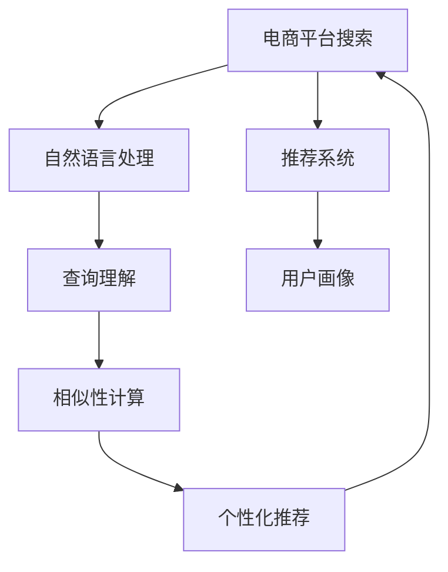

                 

## 1. 背景介绍

### 1.1 问题由来

随着电商行业的快速发展和竞争加剧，用户需求日益多样化和个性化。如何通过有效的搜索策略，快速准确地匹配用户需求，提升用户体验，成为了电商平台亟待解决的关键问题。传统搜索算法往往依赖规则和简单的统计模型，难以应对海量数据和多变用户行为。而人工智能技术的引入，为搜索策略的优化提供了新的契机。

### 1.2 问题核心关键点

电商搜索优化的问题核心在于如何利用人工智能技术，提升搜索的个性化和精准度，同时减少误匹配和信息过载，提升用户体验。主要包括以下几个方面：

- 个性化推荐：通过用户历史行为和属性，推荐最相关的商品和广告。
- 实时搜索：根据实时用户查询和反馈，动态调整搜索策略。
- 查询理解：利用自然语言处理技术，理解用户查询意图，提高匹配精度。
- 数据建模：构建用户行为和商品特征的模型，优化搜索排序算法。

## 2. 核心概念与联系

### 2.1 核心概念概述

为更好地理解AI在电商平台搜索策略优化中的应用，本节将介绍几个密切相关的核心概念：

- 电商平台搜索：指用户在电商平台上通过搜索条输入关键词，获取相关商品列表的过程。
- 自然语言处理(NLP)：通过算法处理自然语言文本，使得机器能够理解、生成和推理文本。
- 推荐系统：通过分析用户历史行为和实时数据，推荐用户可能感兴趣的商品或服务。
- 用户画像(User Profile)：记录用户的基本信息、行为偏好、历史互动等数据，用于个性化推荐。
- 相似性计算(Similarity Computation)：计算用户或商品之间的相似度，用于排序和推荐。

这些核心概念之间的逻辑关系可以通过以下Mermaid流程图来展示：



这个流程图展示了这个电商搜索系统的核心概念及其之间的关系：

1. 用户通过电商平台搜索，输入自然语言查询。
2. 利用自然语言处理技术理解用户查询意图。
3. 根据用户画像和历史行为，利用推荐系统构建个性化推荐模型。
4. 通过相似性计算，衡量用户和商品之间的匹配度。
5. 最终生成个性化推荐列表，提升用户体验。

## 3. 核心算法原理 & 具体操作步骤

### 3.1 算法原理概述

基于AI的电商平台搜索优化算法，主要分为以下几个步骤：

1. **用户查询理解**：通过NLP技术解析用户查询，提取关键词和上下文信息。
2. **商品匹配**：根据用户画像和商品特征，构建用户和商品的相似性度量。
3. **推荐排序**：根据相似性度量结果，对商品进行排序和推荐。
4. **实时调整**：根据用户点击和购买行为，动态调整推荐策略，优化搜索排序算法。

整个算法流程可以概括为：输入自然语言查询 -> 解析用户意图 -> 匹配商品 -> 排序推荐 -> 实时优化。

### 3.2 算法步骤详解

**Step 1: 用户查询理解**

用户输入的自然语言查询需要进行分词、词性标注、命名实体识别等处理，提取关键词和上下文信息。这一步需要依靠NLP技术，如BERT、GPT等预训练模型，或者专门的查询理解算法，如词向量模型、LDA主题模型等。

**Step 2: 商品匹配**

商品匹配是指根据用户画像和商品特征，计算用户和商品的相似度。常见的相似度计算方法包括余弦相似度、Jaccard相似度、编辑距离等。用户画像通常包括用户基本信息、行为偏好、历史评分等数据，通过这些信息可以构建用户特征向量。商品特征包括商品名称、描述、类别、价格等，通过这些信息可以构建商品特征向量。

**Step 3: 推荐排序**

推荐排序是指根据相似度计算结果，对商品进行排序和推荐。排序算法包括基于用户的协同过滤、基于物品的协同过滤、混合协同过滤等方法。基于用户的协同过滤算法，通过计算用户对商品的历史评分，构建用户特征向量，计算相似度后进行推荐排序。基于物品的协同过滤算法，通过计算商品之间的相似度，构建物品特征向量，计算相似度后进行推荐排序。混合协同过滤算法则结合了基于用户和基于物品的协同过滤方法。

**Step 4: 实时调整**

实时调整是指根据用户点击和购买行为，动态调整推荐策略，优化搜索排序算法。例如，可以通过A/B测试，对比不同推荐策略的效果，选择最优方案。也可以使用强化学习算法，根据用户反馈，动态调整推荐策略和排序算法参数。

### 3.3 算法优缺点

基于AI的电商平台搜索优化算法具有以下优点：

- 个性化推荐：通过分析用户历史行为和属性，推荐最相关的商品，提升用户体验。
- 实时优化：根据用户反馈和实时数据，动态调整推荐策略，保持高精度和高相关性。
- 高性能处理：利用分布式计算和GPU加速，快速处理大规模数据，提升系统响应速度。

同时，该算法也存在一定的局限性：

- 数据质量要求高：需要大量高质量的用户数据和商品数据，否则效果不佳。
- 模型复杂度高：需要复杂的NLP模型和推荐算法，开发和维护成本较高。
- 隐私保护难度大：需要处理大量用户隐私数据，可能面临隐私保护和数据安全问题。
- 过拟合风险高：在训练模型时，需要防止过拟合，否则推荐结果可能泛化能力不足。

尽管存在这些局限性，但AI在电商平台搜索优化中的应用已经展现出了巨大的潜力，成为电商技术发展的重要方向。

### 3.4 算法应用领域

基于AI的电商平台搜索优化算法，已经在多个领域得到了应用，例如：

- 推荐系统：提升商品推荐的相关性和多样性，增加用户粘性和转化率。
- 个性化搜索：根据用户查询，提供个性化搜索结果，提升搜索体验。
- 实时广告：根据用户行为和查询意图，动态调整广告投放策略，提高广告转化率。
- 多渠道整合：整合线上线下数据，构建全渠道的用户画像和推荐模型。

除了上述这些经典应用外，AI在电商搜索优化中的应用还在不断拓展，如情感分析、事件监测、智能客服等，为电商平台的智能化转型提供了新的技术手段。

## 4. 数学模型和公式 & 详细讲解 & 举例说明

### 4.1 数学模型构建

本节将使用数学语言对基于AI的电商平台搜索优化算法进行更加严格的刻画。

记用户查询为 $q$，商品为 $i$，用户画像为 $u$，商品特征为 $p_i$，相似度函数为 $s(u,i)$。假设推荐系统输出的商品列表为 $\{r_1, r_2, \dots, r_n\}$。

推荐排序的目标是最小化以下损失函数：

$$
\mathcal{L} = \frac{1}{N} \sum_{i=1}^N \ell(f(s(u,r_i), s(u,p_i)))
$$

其中 $f$ 为推荐排序函数，$\ell$ 为损失函数，常见的损失函数包括均方误差、交叉熵等。

### 4.2 公式推导过程

以下我们以协同过滤推荐算法为例，推导基于余弦相似度的推荐排序公式。

根据用户画像和商品特征向量，计算用户和商品之间的余弦相似度：

$$
s(u,i) = \cos(\theta) = \frac{\mathbf{u} \cdot \mathbf{p}_i}{\|\mathbf{u}\|\|\mathbf{p}_i\|}
$$

其中 $\mathbf{u}$ 为用户画像向量，$\mathbf{p}_i$ 为商品特征向量，$\theta$ 为夹角余弦。

将相似度函数代入损失函数，得：

$$
\mathcal{L} = \frac{1}{N} \sum_{i=1}^N \ell(\cos(\theta) - s(u,p_i))
$$

根据链式法则，损失函数对相似度函数 $s(u,i)$ 的梯度为：

$$
\frac{\partial \mathcal{L}}{\partial s(u,i)} = \frac{1}{N} \sum_{i=1}^N \frac{\partial \ell}{\partial s(u,i)} \cdot \frac{\partial s(u,i)}{\partial \theta} \cdot \frac{\partial \theta}{\partial \mathbf{u}} \cdot \frac{\partial \mathbf{u}}{\partial \mathbf{u}} + \frac{\partial \ell}{\partial s(u,i)} \cdot \frac{\partial s(u,i)}{\partial \mathbf{p}_i} \cdot \frac{\partial \mathbf{p}_i}{\partial \mathbf{p}_i}
$$

根据余弦相似度的性质，可以简化为：

$$
\frac{\partial \mathcal{L}}{\partial s(u,i)} = \frac{1}{N} \sum_{i=1}^N \frac{\partial \ell}{\partial s(u,i)} \cdot (\mathbf{u} - \mathbf{p}_i) \cdot \mathbf{p}_i
$$

将梯度代入优化算法，完成推荐排序模型的迭代优化。重复上述过程直至收敛，最终得到推荐排序模型的最优参数。

### 4.3 案例分析与讲解

**案例1: 协同过滤推荐算法**

假设有一个电商平台，需要根据用户历史行为，推荐商品。具体步骤如下：

1. 收集用户历史购买记录 $D=\{(r_i, u_i)\}_{i=1}^M$，其中 $r_i$ 为用户购买的商品，$u_i$ 为用户画像。
2. 根据用户购买记录，构建用户特征向量 $\mathbf{u}_i$。
3. 根据商品特征，构建商品特征向量 $\mathbf{p}_i$。
4. 计算用户和商品之间的余弦相似度 $s(u_i, p_i)$。
5. 对所有相似度结果进行排序，选择top $K$ 个商品进行推荐。

具体实现代码如下：

```python
import numpy as np
from sklearn.metrics.pairwise import cosine_similarity

# 用户购买记录
D = [(r1, u1), (r2, u2), ...]

# 构建用户特征向量
user_vecs = [np.array([user_feat1, user_feat2, ...]) for r, u in D]

# 构建商品特征向量
item_vecs = [np.array([item_feat1, item_feat2, ...]) for r, u in D]

# 计算相似度
similarity_matrix = cosine_similarity(user_vecs, item_vecs)

# 选择top K个商品进行推荐
top_k = 10
recommend_items = [item for item, score in sorted(zip(D.keys(), similarity_matrix.flatten()))[:top_k]]
```

通过上述代码，即可实现基于余弦相似度的协同过滤推荐算法。需要注意的是，实际应用中用户特征和商品特征通常更复杂，需要根据具体业务场景进行调整。

**案例2: 基于深度学习的推荐算法**

基于深度学习的推荐算法，通常使用神经网络模型进行用户和商品的相似度计算。以下是一个简单的基于MLP的推荐算法实现：

```python
import tensorflow as tf

# 定义神经网络模型
model = tf.keras.Sequential([
    tf.keras.layers.Dense(128, activation='relu', input_shape=(user_feat_shape,)),
    tf.keras.layers.Dense(128, activation='relu'),
    tf.keras.layers.Dense(1)
])

# 训练模型
model.compile(optimizer='adam', loss='mse')
model.fit(user_vecs, item_vecs, epochs=10)

# 预测推荐结果
recommend_items = np.argmax(model.predict(user_vecs), axis=1)
```

通过上述代码，即可使用深度学习模型构建基于相似度计算的推荐算法。深度学习模型通常具有更强的表达能力和泛化能力，适合处理复杂特征和关系，但也面临着较大的模型训练和存储成本。

## 5. 项目实践：代码实例和详细解释说明

### 5.1 开发环境搭建

在进行AI在电商平台搜索优化中的应用开发前，我们需要准备好开发环境。以下是使用Python进行TensorFlow开发的环境配置流程：

1. 安装Anaconda：从官网下载并安装Anaconda，用于创建独立的Python环境。

2. 创建并激活虚拟环境：
```bash
conda create -n tf-env python=3.8 
conda activate tf-env
```

3. 安装TensorFlow：根据CUDA版本，从官网获取对应的安装命令。例如：
```bash
conda install tensorflow -c tensorflow
```

4. 安装PyTorch：
```bash
pip install torch torchvision torchaudio
```

5. 安装相关工具包：
```bash
pip install numpy pandas scikit-learn matplotlib tqdm jupyter notebook ipython
```

完成上述步骤后，即可在`tf-env`环境中开始AI在电商平台搜索优化实践。

### 5.2 源代码详细实现

下面我们以基于协同过滤推荐算法为例，给出使用TensorFlow实现电商搜索优化的完整代码实现。

```python
import tensorflow as tf
import numpy as np
from sklearn.metrics.pairwise import cosine_similarity

# 用户购买记录
D = [(r1, u1), (r2, u2), ...]

# 构建用户特征向量
user_vecs = [np.array([user_feat1, user_feat2, ...]) for r, u in D]

# 构建商品特征向量
item_vecs = [np.array([item_feat1, item_feat2, ...]) for r, u in D]

# 构建神经网络模型
model = tf.keras.Sequential([
    tf.keras.layers.Dense(128, activation='relu', input_shape=(user_feat_shape,)),
    tf.keras.layers.Dense(128, activation='relu'),
    tf.keras.layers.Dense(1)
])

# 训练模型
model.compile(optimizer='adam', loss='mse')
model.fit(user_vecs, item_vecs, epochs=10)

# 预测推荐结果
recommend_items = np.argmax(model.predict(user_vecs), axis=1)
```

通过上述代码，即可实现基于协同过滤推荐算法的电商搜索优化。需要注意的是，实际应用中用户特征和商品特征通常更复杂，需要根据具体业务场景进行调整。

### 5.3 代码解读与分析

让我们再详细解读一下关键代码的实现细节：

**D: 用户购买记录**：
- 记录用户购买商品的历史记录，每个历史记录包括用户ID和商品ID。

**user_vecs: 用户特征向量**：
- 根据用户购买记录，构建用户特征向量。每个用户特征向量包括用户ID和商品ID，可以表示为矩阵形式。

**item_vecs: 商品特征向量**：
- 根据用户购买记录，构建商品特征向量。每个商品特征向量包括商品ID和商品特征，也可以表示为矩阵形式。

**模型定义**：
- 使用TensorFlow定义一个简单的神经网络模型，包括两个全连接层和一个输出层。模型输入为用户特征向量，输出为相似度评分。

**模型训练**：
- 使用Adam优化器，均方误差损失函数，训练模型。

**预测推荐结果**：
- 使用模型预测用户对商品的相似度评分，选择top K个商品进行推荐。

以上代码实现了基于协同过滤推荐算法的电商搜索优化。需要注意的是，实际应用中用户特征和商品特征通常更复杂，需要根据具体业务场景进行调整。

## 6. 实际应用场景

### 6.1 智能客服系统

基于AI的电商平台搜索优化，可以广泛应用于智能客服系统的构建。传统客服往往需要配备大量人力，高峰期响应缓慢，且一致性和专业性难以保证。而使用AI搜索优化技术，可以7x24小时不间断服务，快速响应客户咨询，用自然流畅的语言解答各类常见问题。

在技术实现上，可以收集企业内部的历史客服对话记录，将问题和最佳答复构建成监督数据，在此基础上对推荐算法进行微调。微调后的推荐算法能够自动理解用户意图，匹配最合适的答案模板进行回复。对于客户提出的新问题，还可以接入检索系统实时搜索相关内容，动态组织生成回答。如此构建的智能客服系统，能大幅提升客户咨询体验和问题解决效率。

### 6.2 金融舆情监测

金融机构需要实时监测市场舆论动向，以便及时应对负面信息传播，规避金融风险。传统的人工监测方式成本高、效率低，难以应对网络时代海量信息爆发的挑战。基于AI的文本相似度计算和推荐排序技术，为金融舆情监测提供了新的解决方案。

具体而言，可以收集金融领域相关的新闻、报道、评论等文本数据，并对其进行主题标注和情感标注。在此基础上对推荐算法进行微调，使其能够自动判断文本属于何种主题，情感倾向是正面、中性还是负面。将微调后的推荐算法应用到实时抓取的网络文本数据，就能够自动监测不同主题下的情感变化趋势，一旦发现负面信息激增等异常情况，系统便会自动预警，帮助金融机构快速应对潜在风险。

### 6.3 个性化推荐系统

当前的推荐系统往往只依赖用户的历史行为数据进行物品推荐，无法深入理解用户的真实兴趣偏好。基于AI的电商搜索优化技术，可以更好地挖掘用户行为背后的语义信息，从而提供更精准、多样的推荐内容。

在实践中，可以收集用户浏览、点击、评论、分享等行为数据，提取和用户交互的物品标题、描述、标签等文本内容。将文本内容作为模型输入，用户的后续行为（如是否点击、购买等）作为监督信号，在此基础上微调推荐算法。微调后的推荐算法能够从文本内容中准确把握用户的兴趣点。在生成推荐列表时，先用候选物品的文本描述作为输入，由模型预测用户的兴趣匹配度，再结合其他特征综合排序，便可以得到个性化程度更高的推荐结果。

### 6.4 未来应用展望

随着AI在电商平台搜索优化技术的发展，未来的应用场景将更加广泛，为传统行业带来变革性影响。

在智慧医疗领域，基于AI的搜索优化技术可以用于病历搜索、药物推荐等场景，提升医疗服务的智能化水平，辅助医生诊疗，加速新药开发进程。

在智能教育领域，搜索优化技术可应用于作业批改、学情分析、知识推荐等方面，因材施教，促进教育公平，提高教学质量。

在智慧城市治理中，搜索优化技术可应用于城市事件监测、舆情分析、应急指挥等环节，提高城市管理的自动化和智能化水平，构建更安全、高效的未来城市。

此外，在企业生产、社会治理、文娱传媒等众多领域，基于AI的搜索优化技术也将不断涌现，为NLP技术带来了全新的突破。相信随着预训练语言模型和微调方法的不断进步，搜索优化技术必将在更广阔的应用领域大放异彩，深刻影响人类的生产生活方式。

## 7. 工具和资源推荐

### 7.1 学习资源推荐

为了帮助开发者系统掌握AI在电商平台搜索优化技术的基础知识，这里推荐一些优质的学习资源：

1. 《深度学习理论与实践》系列博文：由大模型技术专家撰写，深入浅出地介绍了深度学习在电商搜索优化中的应用。

2. CS231n《深度学习计算机视觉》课程：斯坦福大学开设的计算机视觉课程，涵盖了深度学习在图像、视频处理中的应用，为电商搜索优化提供了理论基础。

3. 《Natural Language Processing with PyTorch》书籍：使用PyTorch框架实现自然语言处理任务，介绍了NLP在电商搜索优化中的应用。

4. HuggingFace官方文档：Transformer库的官方文档，提供了海量预训练模型和完整的搜索优化样例代码，是上手实践的必备资料。

5. CLUE开源项目：中文语言理解测评基准，涵盖大量不同类型的中文NLP数据集，并提供了基于搜索优化的baseline模型，助力中文NLP技术发展。

通过对这些资源的学习实践，相信你一定能够快速掌握AI在电商平台搜索优化技术的基础知识，并用于解决实际的NLP问题。

### 7.2 开发工具推荐

高效的开发离不开优秀的工具支持。以下是几款用于AI在电商平台搜索优化开发的常用工具：

1. TensorFlow：由Google主导开发的开源深度学习框架，生产部署方便，适合大规模工程应用。同样有丰富的推荐算法资源。

2. PyTorch：基于Python的开源深度学习框架，灵活动态的计算图，适合快速迭代研究。大部分推荐算法都有PyTorch版本的实现。

3. Transformers库：HuggingFace开发的NLP工具库，集成了众多SOTA推荐算法，支持TensorFlow和PyTorch，是进行搜索优化任务开发的利器。

4. Weights & Biases：模型训练的实验跟踪工具，可以记录和可视化模型训练过程中的各项指标，方便对比和调优。与主流深度学习框架无缝集成。

5. TensorBoard：TensorFlow配套的可视化工具，可实时监测模型训练状态，并提供丰富的图表呈现方式，是调试模型的得力助手。

6. Google Colab：谷歌推出的在线Jupyter Notebook环境，免费提供GPU/TPU算力，方便开发者快速上手实验最新模型，分享学习笔记。

合理利用这些工具，可以显著提升AI在电商平台搜索优化任务的开发效率，加快创新迭代的步伐。

### 7.3 相关论文推荐

AI在电商平台搜索优化技术的发展源于学界的持续研究。以下是几篇奠基性的相关论文，推荐阅读：

1. Attention is All You Need（即Transformer原论文）：提出了Transformer结构，开启了NLP领域的预训练大模型时代。

2. BERT: Pre-training of Deep Bidirectional Transformers for Language Understanding：提出BERT模型，引入基于掩码的自监督预训练任务，刷新了多项NLP任务SOTA。

3. Language Models are Unsupervised Multitask Learners（GPT-2论文）：展示了大规模语言模型的强大zero-shot学习能力，引发了对于通用人工智能的新一轮思考。

4. Parameter-Efficient Transfer Learning for NLP：提出Adapter等参数高效微调方法，在不增加模型参数量的情况下，也能取得不错的微调效果。

5. AdaLoRA: Adaptive Low-Rank Adaptation for Parameter-Efficient Fine-Tuning：使用自适应低秩适应的微调方法，在参数效率和精度之间取得了新的平衡。

6. Language Understanding by Modeling Contextual Vectors：提出了BERT模型，使用预训练语言模型进行文本理解，取得了显著的SOTA性能。

这些论文代表了大模型搜索优化技术的发展脉络。通过学习这些前沿成果，可以帮助研究者把握学科前进方向，激发更多的创新灵感。

## 8. 总结：未来发展趋势与挑战

### 8.1 总结

本文对AI在电商平台搜索优化技术进行了全面系统的介绍。首先阐述了AI在电商平台搜索优化技术的研究背景和意义，明确了搜索优化的核心问题，即如何利用AI技术提升搜索的个性化和精准度。其次，从原理到实践，详细讲解了搜索优化的数学原理和关键步骤，给出了搜索优化任务开发的完整代码实例。同时，本文还广泛探讨了搜索优化技术在智能客服、金融舆情、个性化推荐等多个领域的应用前景，展示了搜索优化技术的巨大潜力。

通过本文的系统梳理，可以看到，AI在电商平台搜索优化技术正在成为NLP领域的重要范式，极大地拓展了电商平台的智能化应用边界，提升了用户体验。未来，伴随预训练语言模型和微调方法的不断进步，搜索优化技术必将在更广泛的场景下发挥其独特价值。

### 8.2 未来发展趋势

展望未来，AI在电商平台搜索优化技术将呈现以下几个发展趋势：

1. 模型规模持续增大。随着算力成本的下降和数据规模的扩张，预训练语言模型的参数量还将持续增长。超大规模语言模型蕴含的丰富语言知识，有望支撑更加复杂多变的推荐和搜索策略。

2. 搜索策略多样化。除了传统的协同过滤推荐算法，未来将涌现更多搜索优化算法，如基于深度学习的推荐算法、基于图神经网络的推荐算法、基于因果推理的推荐算法等，满足不同类型的推荐和搜索需求。

3. 实时动态调整。实时动态调整推荐和搜索策略，根据用户行为和反馈，及时优化算法参数和推荐列表。增强推荐和搜索策略的适应性和灵活性。

4. 多模态信息融合。将视觉、语音、文本等多模态信息进行协同建模，提升推荐和搜索的全面性和精准度。

5. 因果推理和强化学习。引入因果推理和强化学习思想，提高推荐和搜索策略的稳定性和鲁棒性，避免模型在复杂环境下的退化。

以上趋势凸显了AI在电商平台搜索优化技术的前景，这些方向的探索发展，必将进一步提升推荐和搜索策略的性能，为电商平台的智能化转型提供新的技术支持。

### 8.3 面临的挑战

尽管AI在电商平台搜索优化技术已经取得了瞩目成就，但在迈向更加智能化、普适化应用的过程中，它仍面临着诸多挑战：

1. 数据质量瓶颈。推荐和搜索算法依赖大量的用户数据和商品数据，数据质量不佳可能导致算法效果下降。

2. 隐私保护难度大。推荐和搜索算法需要处理大量用户隐私数据，可能面临隐私保护和数据安全问题。

3. 模型过拟合风险高。在训练模型时，需要防止过拟合，否则推荐结果可能泛化能力不足。

4. 实时优化复杂度高。实时动态调整推荐和搜索策略，需要高效的算法和架构支撑，否则可能导致系统不稳定。

5. 多模态信息融合难度大。将视觉、语音、文本等多模态信息进行协同建模，需要复杂的算法和大量的计算资源。

6. 因果推理和强化学习复杂度高。引入因果推理和强化学习，需要解决复杂的因果关系和优化问题，提高算法的鲁棒性和可靠性。

这些挑战凸显了AI在电商平台搜索优化技术的发展前景，需要多方协同努力，攻克技术难题，实现搜索优化算法的优化和普及。

### 8.4 研究展望

面对AI在电商平台搜索优化技术面临的挑战，未来的研究需要在以下几个方面寻求新的突破：

1. 探索无监督和半监督学习算法。摆脱对大规模标注数据的依赖，利用自监督学习、主动学习等无监督和半监督范式，最大限度利用非结构化数据，实现更加灵活高效的推荐和搜索策略。

2. 研究高效低秩优化算法。开发更加参数高效的推荐和搜索算法，在固定大部分预训练参数的同时，只更新极少量的任务相关参数。同时优化推荐和搜索算法的计算图，减少前向传播和反向传播的资源消耗，实现更加轻量级、实时性的部署。

3. 引入因果推理和强化学习算法。将因果推理和强化学习思想引入推荐和搜索策略，增强算法稳定性和鲁棒性，学习更加普适、鲁棒的语言表征。

4. 引入更多先验知识。将符号化的先验知识，如知识图谱、逻辑规则等，与神经网络模型进行巧妙融合，引导推荐和搜索策略学习更准确、合理的语言模型。

5. 纳入伦理道德约束。在推荐和搜索算法目标中引入伦理导向的评估指标，过滤和惩罚有偏见、有害的输出倾向。同时加强人工干预和审核，建立推荐和搜索策略行为的监管机制，确保输出符合人类价值观和伦理道德。

这些研究方向的探索，必将引领AI在电商平台搜索优化技术迈向更高的台阶，为构建安全、可靠、可解释、可控的智能系统铺平道路。面向未来，AI在电商平台搜索优化技术还需要与其他人工智能技术进行更深入的融合，如知识表示、因果推理、强化学习等，多路径协同发力，共同推动自然语言理解和智能交互系统的进步。只有勇于创新、敢于突破，才能不断拓展语言模型的边界，让智能技术更好地造福人类社会。

## 9. 附录：常见问题与解答

**Q1: AI在电商平台搜索优化技术是否适用于所有电商平台？**

A: AI在电商平台搜索优化技术适用于大多数电商平台，尤其是数据规模较大、用户行为多样化的平台。对于小型平台，需要根据具体情况进行调整，可能面临数据量不足、算法复杂度高等问题。

**Q2: AI在电商平台搜索优化中，如何处理多模态数据？**

A: AI在电商平台搜索优化中，通常需要将多模态数据进行特征融合，再输入到推荐和搜索算法中。例如，将视觉数据进行特征提取，将文本数据进行词向量化，然后将这些特征进行拼接或融合，输入到深度学习模型中进行预测。

**Q3: AI在电商平台搜索优化中，如何保证数据隐私？**

A: AI在电商平台搜索优化中，需要严格遵守数据隐私保护法律法规，如GDPR、CCPA等。可以采用数据匿名化、差分隐私、联邦学习等技术，保护用户隐私和数据安全。同时，需要建立透明的数据使用和隐私保护机制，确保用户知情和同意。

**Q4: AI在电商平台搜索优化中，如何避免过拟合？**

A: AI在电商平台搜索优化中，需要避免过拟合，可以通过以下几种方法：

1. 数据增强：通过回译、近义替换等方式扩充训练集，增加数据多样性。

2. 正则化：使用L2正则、Dropout、Early Stopping等方法，防止模型过拟合。

3. 对抗训练：引入对抗样本，提高模型鲁棒性，防止模型对输入数据过于敏感。

4. 模型集成：通过集成多个模型，降低过拟合风险，提高推荐和搜索策略的稳定性。

**Q5: AI在电商平台搜索优化中，如何提高推荐和搜索的实时性？**

A: AI在电商平台搜索优化中，需要提高推荐和搜索的实时性，可以通过以下几种方法：

1. 分布式计算：使用分布式计算框架，如Hadoop、Spark等，将计算任务分解为多个子任务并行处理。

2. GPU加速：使用GPU或TPU加速推荐和搜索算法的计算，提高系统响应速度。

3. 模型裁剪：通过剪枝、量化等技术，优化模型结构和参数，减小模型尺寸，提高推理速度。

4. 缓存机制：使用缓存机制，将热门商品和推荐结果缓存起来，减少重复计算和数据传输。

通过这些方法，可以显著提高AI在电商平台搜索优化中的实时性，提升用户体验。

