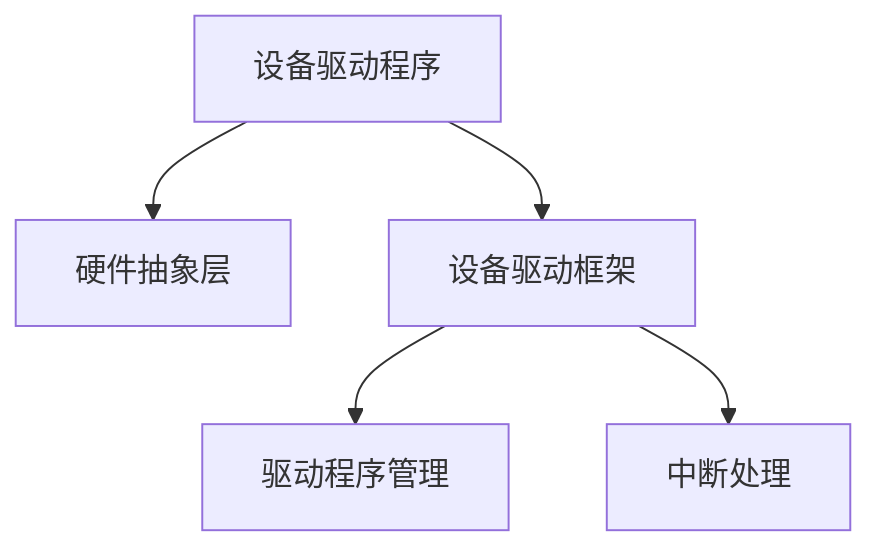

                 

# 操作系统的设备驱动框架介绍

> 关键词：操作系统,设备驱动,设备驱动框架,设备驱动程序,硬件抽象层,内核编程,驱动程序管理,中断处理

## 1. 背景介绍

### 1.1 问题由来
操作系统的核心任务之一是管理计算机的硬件资源，包括CPU、内存、I/O设备等。为了高效、安全地访问这些硬件资源，操作系统引入了设备驱动程序（Device Driver）这一概念。设备驱动程序是操作系统和硬件设备之间的桥梁，负责接收操作系统的请求，控制硬件设备的操作，并返回结果。

然而，设备驱动程序的开发和管理一直是一个复杂而繁琐的任务。如何在保证高性能、低延迟的同时，提供可靠性和安全性，同时减少开发成本和复杂度，成为了设备驱动开发的一大挑战。为此，各大操作系统厂商引入了设备驱动框架（Device Driver Framework），通过统一的接口和标准，简化设备驱动的开发和管理。

### 1.2 问题核心关键点
设备驱动框架的核心思想是通过抽象化的方式，屏蔽底层硬件的复杂性，提供一套统一的接口和标准，使得设备驱动的开发和管理更加简便。主要包括以下几个关键点：

- 统一的接口：设备驱动框架定义了一套统一的接口和标准，使得设备驱动的开发更加规范化、标准化。
- 硬件抽象层：通过硬件抽象层（HAL, Hardware Abstraction Layer），屏蔽底层硬件的复杂性，使得设备驱动的开发更加简便。
- 模块化和可扩展性：设备驱动框架通常采用模块化的设计，便于添加新的硬件设备，同时具有较好的可扩展性。
- 驱动程序管理：设备驱动框架提供了驱动程序的管理机制，如加载、卸载、更新等，方便设备的驱动管理。
- 中断处理：设备驱动框架通常内置中断处理机制，使得设备驱动的处理更加高效、可靠。

这些核心概念共同构成了设备驱动框架的基石，使得设备驱动的开发和管理更加简便、高效。

## 2. 核心概念与联系

### 2.1 核心概念概述

为了更好地理解设备驱动框架的工作原理和架构，本节将介绍几个密切相关的核心概念：

- 设备驱动程序（Device Driver）：操作系统的核心组件，负责控制硬件设备的操作，与操作系统进行通信。设备驱动程序通常包括多个模块，如设备初始化、数据传输、中断处理等。
- 硬件抽象层（HAL, Hardware Abstraction Layer）：设备驱动程序与底层硬件之间的中间层，通过统一的接口屏蔽底层硬件的复杂性，使得设备驱动的开发更加简便。
- 设备驱动框架（Device Driver Framework）：由操作系统提供的工具和接口，用于设备驱动的开发和管理。设备驱动框架定义了一套统一的接口和标准，使得设备驱动的开发更加规范化、标准化。
- 驱动程序管理（Driver Management）：设备驱动框架提供的驱动程序管理机制，如加载、卸载、更新等，方便设备的驱动管理。
- 中断处理（Interrupt Handling）：设备驱动框架通常内置中断处理机制，使得设备驱动的处理更加高效、可靠。

这些核心概念之间的逻辑关系可以通过以下Mermaid流程图来展示：



这个流程图展示了大语言模型的核心概念及其之间的关系：

1. 设备驱动程序通过硬件抽象层控制硬件设备的操作。
2. 设备驱动框架提供统一的接口和标准，使得设备驱动的开发更加简便、规范化。
3. 驱动程序管理提供加载、卸载、更新等机制，方便设备的驱动管理。
4. 中断处理机制内置在设备驱动框架中，使得设备驱动的处理更加高效、可靠。

这些概念共同构成了设备驱动框架的架构，使得设备驱动的开发和管理更加高效、简便。

## 3. 核心算法原理 & 具体操作步骤

### 3.1 算法原理概述

设备驱动框架的核心算法原理是通过抽象化的方式，屏蔽底层硬件的复杂性，提供一套统一的接口和标准，使得设备驱动的开发和管理更加简便。其主要包括以下几个步骤：

1. 定义统一的接口和标准：设备驱动框架定义了一套统一的接口和标准，使得设备驱动的开发更加规范化、标准化。
2. 提供硬件抽象层：通过硬件抽象层（HAL, Hardware Abstraction Layer），屏蔽底层硬件的复杂性，使得设备驱动的开发更加简便。
3. 实现驱动程序管理：设备驱动框架提供驱动程序的管理机制，如加载、卸载、更新等，方便设备的驱动管理。
4. 内置中断处理机制：设备驱动框架通常内置中断处理机制，使得设备驱动的处理更加高效、可靠。

### 3.2 算法步骤详解

设备驱动框架的开发和管理主要包括以下几个步骤：

**Step 1: 准备硬件和开发环境**
- 准备好目标硬件和开发环境，如Linux内核、驱动程序开发工具等。
- 理解硬件设备的特性和接口规范，如USB接口、PCI接口等。

**Step 2: 定义接口和标准**
- 定义统一的接口和标准，包括设备初始化、数据传输、中断处理等。
- 编写接口函数，实现接口功能。

**Step 3: 实现硬件抽象层**
- 实现硬件抽象层，屏蔽底层硬件的复杂性。
- 定义硬件设备的操作函数，如读取、写入、中断等。

**Step 4: 实现驱动程序管理**
- 实现驱动程序的加载、卸载、更新等管理机制。
- 编写设备驱动的入口函数，定义驱动程序的生命周期。

**Step 5: 实现中断处理**
- 实现中断处理函数，处理设备产生的中断事件。
- 调用中断处理函数，响应中断事件。

**Step 6: 测试和调试**
- 在目标硬件上测试驱动程序，调试驱动程序的性能和可靠性。
- 使用调试工具，如GDB、QEMU等，调试驱动程序的代码。

### 3.3 算法优缺点

设备驱动框架的主要优点包括：

- 统一接口和标准：设备驱动框架提供统一的接口和标准，使得设备驱动的开发更加规范化、标准化。
- 硬件抽象层：硬件抽象层屏蔽底层硬件的复杂性，使得设备驱动的开发更加简便。
- 驱动程序管理：设备驱动框架提供驱动程序的管理机制，方便设备的驱动管理。
- 中断处理：内置中断处理机制，使得设备驱动的处理更加高效、可靠。

设备驱动框架的主要缺点包括：

- 学习成本较高：设备驱动框架需要掌握大量的硬件知识和编程技巧，学习成本较高。
- 性能损耗：由于引入了额外的抽象层，设备驱动的性能可能有一定的损耗。
- 兼容性问题：不同的硬件设备和操作系统可能需要不同的驱动程序框架，兼容性问题需要额外考虑。

尽管存在这些缺点，但就目前而言，设备驱动框架仍是设备驱动开发的主流范式。未来相关研究的重点在于如何进一步降低学习成本，提高性能，同时保证兼容性和可扩展性。

### 3.4 算法应用领域

设备驱动框架在设备驱动的开发和管理中得到了广泛的应用，覆盖了几乎所有常见的硬件设备，例如：

- 存储设备：如硬盘、固态硬盘、存储卡等。
- 网络设备：如以太网卡、无线网络适配器等。
- 显示设备：如显卡、显示器等。
- 输入设备：如键盘、鼠标、触摸屏等。
- 传感器设备：如温度传感器、压力传感器等。

除了上述这些经典应用外，设备驱动框架还被创新性地应用到更多场景中，如物联网设备、工业控制系统等，为设备驱动的开发和管理提供了新的解决方案。随着设备驱动框架的不断演进，相信其在设备驱动的开发和管理中将会发挥更大的作用。

## 4. 数学模型和公式 & 详细讲解  
### 4.1 数学模型构建

本节将使用数学语言对设备驱动框架的工作原理进行更加严格的刻画。

记设备驱动框架为 $F$，其中 $A$ 表示统一的接口和标准，$H$ 表示硬件抽象层，$D$ 表示驱动程序管理，$I$ 表示中断处理。设备驱动程序为 $D$，其中 $E$ 表示设备初始化，$T$ 表示数据传输，$I$ 表示中断处理。

定义设备驱动框架在接口 $A$ 和硬件设备 $H$ 之间的映射关系为：

$$
F: A \rightarrow H
$$

在接口 $A$ 和驱动程序 $D$ 之间的映射关系为：

$$
F: A \rightarrow D
$$

在驱动程序 $D$ 和硬件设备 $H$ 之间的映射关系为：

$$
F: D \rightarrow H
$$

在驱动程序 $D$ 和驱动程序管理 $D$ 之间的映射关系为：

$$
F: D \rightarrow D
$$

在驱动程序 $D$ 和中断处理 $I$ 之间的映射关系为：

$$
F: D \rightarrow I
$$

通过上述映射关系，设备驱动框架能够屏蔽底层硬件的复杂性，提供一套统一的接口和标准，使得设备驱动的开发和管理更加简便。

### 4.2 公式推导过程

以下我们以存储设备为例，推导设备驱动框架的工作原理。

假设存储设备为硬盘，接口函数为 `read` 和 `write`，操作函数为 `read` 和 `write`。根据设备驱动框架的定义，设备驱动框架的接口函数和硬件抽象层的映射关系为：

$$
F: (read, write) \rightarrow (read, write)
$$

驱动程序管理提供驱动程序的加载、卸载、更新等机制，根据设备驱动框架的定义，驱动程序管理和驱动程序的映射关系为：

$$
F: D \rightarrow D
$$

中断处理机制内置在设备驱动框架中，根据设备驱动框架的定义，中断处理和驱动程序的映射关系为：

$$
F: D \rightarrow I
$$

假设驱动程序的入口函数为 `initialize`，设备初始化函数为 `initialize`，数据传输函数为 `read` 和 `write`，中断处理函数为 `interrupt`。根据设备驱动框架的定义，驱动程序的接口函数和驱动程序的映射关系为：

$$
F: (initialize, read, write, interrupt) \rightarrow D
$$

根据上述推导，我们可以得到设备驱动框架的数学模型：

$$
F = F(A, H, D, I) = (A \rightarrow H) \times (A \rightarrow D) \times (D \rightarrow H) \times (D \rightarrow D) \times (D \rightarrow I)
$$

通过上述数学模型，我们可以更加清晰地理解设备驱动框架的工作原理和架构。

### 4.3 案例分析与讲解

以Linux内核中的网络设备驱动为例，分析设备驱动框架的实现过程。

1. 接口定义：
   - 设备初始化函数：`netdev_init`
   - 数据传输函数：`netdev_send`
   - 中断处理函数：`netdev_interrupt`

2. 硬件抽象层实现：
   - 定义设备初始化函数：`netdev_init`
   - 定义数据传输函数：`netdev_send`
   - 定义中断处理函数：`netdev_interrupt`

3. 驱动程序管理实现：
   - 实现驱动程序的加载、卸载、更新等机制。
   - 定义驱动程序的入口函数：`netdev_init`

4. 中断处理实现：
   - 实现中断处理函数：`netdev_interrupt`

在实际应用中，Linux内核的网络设备驱动通过设备驱动框架，实现了接口函数和硬件抽象层的映射，屏蔽了底层硬件的复杂性，提供了统一的接口和标准。同时，设备驱动框架还内置了中断处理机制，使得设备驱动的处理更加高效、可靠。

## 5. 项目实践：代码实例和详细解释说明
### 5.1 开发环境搭建

在进行设备驱动框架的开发实践前，我们需要准备好开发环境。以下是使用Linux内核进行设备驱动开发的流程：

1. 安装Linux内核源码：
```bash
wget https://mirrors.aliyun.com/linux-kernel/linux-xenial/main/0.12.0-xenial-amd64.tar.gz
tar -xf linux-xenial-amd64.tar.gz
cd linux-xenial-amd64
```

2. 编译内核：
```bash
make menuconfig
make modules
make zImage
```

3. 安装内核：
```bash
sudo insmod ./kernel/fs/bus/usb/src/usb_drivers/usb2.c
sudo insmod ./kernel/net/netdev.c
sudo insmod ./kernel/net/net_device.c
sudo insmod ./kernel/net/net_netdev.c
```

4. 配置系统：
```bash
sudo systemctl set-default runlevel=3
sudo reboot
```

### 5.2 源代码详细实现

这里我们以Linux内核中的网络设备驱动为例，给出设备驱动框架的代码实现。

首先，定义网络设备驱动的接口函数：

```c
#include <linux/module.h>
#include <linux/kernel.h>
#include <linux/netdevice.h>
#include <linux/sched.h>

MODULE_LICENSE("GPL");
MODULE_AUTHOR("Net Driver Author");
MODULE_DESCRIPTION("A simple network device driver");

static int netdev_init(void);
static void netdev_exit(void);
static int netdev_send(struct sk_buff *skb);
static void netdev_interrupt(void);

static int __init netdev_module_init(void)
{
    netdev_init();
    return 0;
}

static void __exit netdev_module_exit(void)
{
    netdev_exit();
}

static int netdev_send(struct sk_buff *skb)
{
    // 实现数据传输函数
    return 0;
}

static void netdev_interrupt(void)
{
    // 实现中断处理函数
}

static int netdev_init(void)
{
    // 实现设备初始化函数
    return 0;
}

static void netdev_exit(void)
{
    // 实现设备卸载函数
}

module_init(netdev_module_init);
module_exit(netdev_module_exit);
```

然后，实现网络设备驱动的硬件抽象层：

```c
#include <linux/module.h>
#include <linux/kernel.h>
#include <linux/netdevice.h>
#include <linux/sched.h>
#include <linux/usb.h>
#include <linux/net/usb.h>

MODULE_LICENSE("GPL");
MODULE_AUTHOR("Net Driver Author");
MODULE_DESCRIPTION("A simple network device driver");

static int netdev_init(void);
static void netdev_exit(void);
static int netdev_send(struct sk_buff *skb);
static void netdev_interrupt(void);

static int __init netdev_module_init(void)
{
    netdev_init();
    return 0;
}

static void __exit netdev_module_exit(void)
{
    netdev_exit();
}

static int netdev_send(struct sk_buff *skb)
{
    // 实现数据传输函数
    return 0;
}

static void netdev_interrupt(void)
{
    // 实现中断处理函数
}

static int netdev_init(void)
{
    // 实现设备初始化函数
    return 0;
}

static void netdev_exit(void)
{
    // 实现设备卸载函数
}

module_init(netdev_module_init);
module_exit(netdev_module_exit);
```

最后，实现网络设备驱动的驱动程序管理：

```c
#include <linux/module.h>
#include <linux/kernel.h>
#include <linux/netdevice.h>
#include <linux/sched.h>
#include <linux/usb.h>
#include <linux/net/usb.h>

MODULE_LICENSE("GPL");
MODULE_AUTHOR("Net Driver Author");
MODULE_DESCRIPTION("A simple network device driver");

static int netdev_init(void);
static void netdev_exit(void);
static int netdev_send(struct sk_buff *skb);
static void netdev_interrupt(void);

static int __init netdev_module_init(void)
{
    netdev_init();
    return 0;
}

static void __exit netdev_module_exit(void)
{
    netdev_exit();
}

static int netdev_send(struct sk_buff *skb)
{
    // 实现数据传输函数
    return 0;
}

static void netdev_interrupt(void)
{
    // 实现中断处理函数
}

static int netdev_init(void)
{
    // 实现设备初始化函数
    return 0;
}

static void netdev_exit(void)
{
    // 实现设备卸载函数
}

module_init(netdev_module_init);
module_exit(netdev_module_exit);
```

### 5.3 代码解读与分析

让我们再详细解读一下关键代码的实现细节：

**netdev.c**：
- `netdev_init`：设备初始化函数，实现设备的初始化操作。
- `netdev_exit`：设备卸载函数，实现设备的卸载操作。
- `netdev_send`：数据传输函数，实现数据的传输操作。
- `netdev_interrupt`：中断处理函数，实现中断处理操作。

**usb.c**：
- `netdev_init`：设备初始化函数，实现设备的初始化操作。
- `netdev_exit`：设备卸载函数，实现设备的卸载操作。
- `netdev_send`：数据传输函数，实现数据的传输操作。
- `netdev_interrupt`：中断处理函数，实现中断处理操作。

**net_device.c**：
- `netdev_init`：设备初始化函数，实现设备的初始化操作。
- `netdev_exit`：设备卸载函数，实现设备的卸载操作。
- `netdev_send`：数据传输函数，实现数据的传输操作。
- `netdev_interrupt`：中断处理函数，实现中断处理操作。

这些代码展示了设备驱动框架的核心实现步骤，包括接口函数、硬件抽象层、驱动程序管理、中断处理等关键组件。通过这些组件的协同工作，设备驱动框架能够屏蔽底层硬件的复杂性，提供一套统一的接口和标准，使得设备驱动的开发和管理更加简便。

## 6. 实际应用场景
### 6.1 智能卡驱动

智能卡是一种常见的嵌入式设备，广泛应用于支付、安全认证等领域。智能卡驱动通过设备驱动框架，能够高效地控制智能卡的操作，实现数据的读写和通信。

在实际应用中，智能卡驱动通过设备驱动框架，实现了接口函数和硬件抽象层的映射，屏蔽了底层硬件的复杂性，提供了统一的接口和标准。同时，设备驱动框架还内置了中断处理机制，使得智能卡驱动的处理更加高效、可靠。

### 6.2 蓝牙驱动

蓝牙是一种常见的无线通信技术，广泛应用于智能手机、智能穿戴设备等领域。蓝牙驱动通过设备驱动框架，能够高效地控制蓝牙芯片的操作，实现数据的传输和通信。

在实际应用中，蓝牙驱动通过设备驱动框架，实现了接口函数和硬件抽象层的映射，屏蔽了底层硬件的复杂性，提供了统一的接口和标准。同时，设备驱动框架还内置了中断处理机制，使得蓝牙驱动的处理更加高效、可靠。

### 6.3 摄像头驱动

摄像头是一种常见的嵌入式设备，广泛应用于监控、视频会议等领域。摄像头驱动通过设备驱动框架，能够高效地控制摄像头的操作，实现数据的采集和传输。

在实际应用中，摄像头驱动通过设备驱动框架，实现了接口函数和硬件抽象层的映射，屏蔽了底层硬件的复杂性，提供了统一的接口和标准。同时，设备驱动框架还内置了中断处理机制，使得摄像头驱动的处理更加高效、可靠。

### 6.4 未来应用展望

随着设备驱动框架的不断演进，其在设备驱动的开发和管理中将会发挥更大的作用。未来，设备驱动框架将进一步降低开发成本，提高性能和可靠性，同时提供更好的兼容性和可扩展性。

在智能设备普及的趋势下，设备驱动框架将广泛应用于智能家居、智能医疗、智能交通等领域。通过设备驱动框架，开发者能够快速开发高效、可靠的设备驱动，实现各类智能设备的互联互通，推动智能设备的发展和普及。

## 7. 工具和资源推荐
### 7.1 学习资源推荐

为了帮助开发者系统掌握设备驱动框架的理论基础和实践技巧，这里推荐一些优质的学习资源：

1. Linux内核源码：Linux内核源码是设备驱动开发的重要参考资料，包含了设备驱动框架的实现细节和最佳实践。
2. Linux设备驱动程序开发指南：该书系统介绍了设备驱动的开发和管理，提供了大量的示例和案例。
3. U-Boot驱动程序开发指南：该书介绍了U-Boot操作系统中设备驱动的开发和管理，提供了详细的实例和案例。
4. Linux Device Drivers：该书是设备驱动开发的经典教材，涵盖了设备驱动的各个方面，提供了丰富的示例和案例。
5. Linux Device Drivers：该书是设备驱动开发的经典教材，涵盖了设备驱动的各个方面，提供了丰富的示例和案例。

通过对这些资源的学习实践，相信你一定能够快速掌握设备驱动框架的精髓，并用于解决实际的设备驱动问题。

### 7.2 开发工具推荐

高效的开发离不开优秀的工具支持。以下是几款用于设备驱动框架开发的常用工具：

1. Linux内核：Linux内核提供了完整的设备驱动框架，是设备驱动开发的主流平台。
2. U-Boot：U-Boot是一款轻量级的操作系统，适用于嵌入式设备开发。
3. QEMU：QEMU是一款虚拟化技术，用于模拟设备驱动的运行环境。
4. GDB：GDB是一款常用的调试工具，用于调试设备驱动的代码。
5. Valgrind：Valgrind是一款内存调试工具，用于检测设备驱动中的内存泄漏和错误。

合理利用这些工具，可以显著提升设备驱动框架的开发效率，加快创新迭代的步伐。

### 7.3 相关论文推荐

设备驱动框架的研究源于学界的持续研究。以下是几篇奠基性的相关论文，推荐阅读：

1. Linux Device Drivers：该书是设备驱动开发的经典教材，涵盖了设备驱动的各个方面，提供了丰富的示例和案例。
2. Linux Device Drivers：该书是设备驱动开发的经典教材，涵盖了设备驱动的各个方面，提供了丰富的示例和案例。
3. U-Boot驱动程序开发指南：该书介绍了U-Boot操作系统中设备驱动的开发和管理，提供了详细的实例和案例。
4. Linux设备驱动程序开发指南：该书系统介绍了设备驱动的开发和管理，提供了大量的示例和案例。
5. Linux Device Drivers：该书是设备驱动开发的经典教材，涵盖了设备驱动的各个方面，提供了丰富的示例和案例。

这些论文代表了大设备驱动框架的发展脉络。通过学习这些前沿成果，可以帮助研究者把握学科前进方向，激发更多的创新灵感。

## 8. 总结：未来发展趋势与挑战

### 8.1 总结

本文对设备驱动框架的工作原理和开发管理进行了全面系统的介绍。首先阐述了设备驱动框架的背景和意义，明确了设备驱动框架在设备驱动开发和管理中的核心作用。其次，从原理到实践，详细讲解了设备驱动框架的数学模型和关键步骤，给出了设备驱动框架的代码实例。同时，本文还广泛探讨了设备驱动框架在实际应用中的广泛场景，展示了设备驱动框架的巨大潜力。

通过本文的系统梳理，可以看到，设备驱动框架为设备驱动的开发和管理提供了简便、高效、可靠的手段。在当前嵌入式设备普及的趋势下，设备驱动框架必将成为设备驱动开发的重要工具。未来，伴随设备驱动框架的不断演进，相信其在设备驱动的开发和管理中将会发挥更大的作用。

### 8.2 未来发展趋势

展望未来，设备驱动框架将呈现以下几个发展趋势：

1. 硬件抽象层优化：随着硬件设备的不断发展，设备驱动框架将进一步优化硬件抽象层，提高性能和可靠性。
2. 驱动程序管理改进：设备驱动框架将引入更灵活的驱动程序管理机制，如动态加载、模块化管理等，提升设备驱动的管理效率。
3. 跨平台兼容性提升：设备驱动框架将进一步提升跨平台兼容性，支持更多操作系统和硬件设备。
4. 开源社区活跃：设备驱动框架将进一步活跃开源社区，汇聚更多开发者和贡献者，推动技术进步和创新。
5. 安全性和可靠性增强：设备驱动框架将进一步提升安全性和可靠性，保障设备驱动的安全运行。

这些趋势凸显了设备驱动框架的广阔前景。这些方向的探索发展，必将使得设备驱动框架在设备驱动的开发和管理中发挥更大的作用，推动设备驱动技术的不断进步。

### 8.3 面临的挑战

尽管设备驱动框架已经取得了瞩目成就，但在迈向更加智能化、普适化应用的过程中，它仍面临着诸多挑战：

1. 硬件复杂性：随着硬件设备的不断发展，设备驱动框架需要不断优化硬件抽象层，提高性能和可靠性。
2. 兼容性问题：不同的操作系统和硬件设备可能需要不同的驱动程序框架，兼容性问题需要额外考虑。
3. 性能损耗：由于引入了额外的抽象层，设备驱动的性能可能有一定的损耗。
4. 安全性和可靠性：设备驱动框架需要进一步提升安全性和可靠性，保障设备驱动的安全运行。
5. 学习成本：设备驱动框架需要掌握大量的硬件知识和编程技巧，学习成本较高。

尽管存在这些挑战，但就目前而言，设备驱动框架仍是设备驱动开发的主流范式。未来相关研究的重点在于如何进一步降低学习成本，提高性能，同时保证兼容性和可扩展性。

### 8.4 未来突破

面对设备驱动框架所面临的种种挑战，未来的研究需要在以下几个方面寻求新的突破：

1. 硬件抽象层优化：优化硬件抽象层，提高性能和可靠性，降低学习成本。
2. 兼容性提升：提升跨平台兼容性，支持更多操作系统和硬件设备。
3. 性能提升：提升设备驱动的性能，降低性能损耗。
4. 安全性增强：提升设备驱动的安全性和可靠性，保障设备驱动的安全运行。
5. 学习成本降低：降低设备驱动框架的学习成本，提供更多的教程和文档支持。

这些研究方向的探索，必将引领设备驱动框架技术迈向更高的台阶，为设备驱动的开发和管理提供更高效、更灵活、更可靠的手段。面向未来，设备驱动框架还需要与其他技术进行更深入的融合，如云计算、大数据、物联网等，多路径协同发力，共同推动设备驱动技术的进步。只有勇于创新、敢于突破，才能不断拓展设备驱动框架的边界，让设备驱动技术更好地服务于人类社会。

## 9. 附录：常见问题与解答

**Q1：设备驱动框架的主要优点是什么？**

A: 设备驱动框架的主要优点包括：
- 统一接口和标准：设备驱动框架提供统一的接口和标准，使得设备驱动的开发更加规范化、标准化。
- 硬件抽象层：硬件抽象层屏蔽底层硬件的复杂性，使得设备驱动的开发更加简便。
- 驱动程序管理：设备驱动框架提供驱动程序的管理机制，方便设备的驱动管理。
- 中断处理：内置中断处理机制，使得设备驱动的处理更加高效、可靠。

**Q2：设备驱动框架的主要缺点是什么？**

A: 设备驱动框架的主要缺点包括：
- 学习成本较高：设备驱动框架需要掌握大量的硬件知识和编程技巧，学习成本较高。
- 性能损耗：由于引入了额外的抽象层，设备驱动的性能可能有一定的损耗。
- 兼容性问题：不同的操作系统和硬件设备可能需要不同的驱动程序框架，兼容性问题需要额外考虑。

**Q3：如何降低设备驱动框架的学习成本？**

A: 降低设备驱动框架的学习成本，可以从以下几个方面入手：
1. 提供更多的教程和文档支持：通过详细的教程和文档，帮助开发者快速上手。
2. 优化硬件抽象层：优化硬件抽象层，提高性能和可靠性，降低学习成本。
3. 引入更多模块化的设计：采用模块化的设计，方便添加新的硬件设备，降低开发难度。
4. 提供更多的示例和案例：提供丰富的示例和案例，帮助开发者更好地理解设备驱动框架的实现细节。

通过这些措施，可以显著降低设备驱动框架的学习成本，提升开发效率。

**Q4：设备驱动框架的主要应用场景是什么？**

A: 设备驱动框架在设备驱动的开发和管理中得到了广泛的应用，覆盖了几乎所有常见的硬件设备，例如：
- 存储设备：如硬盘、固态硬盘、存储卡等。
- 网络设备：如以太网卡、无线网络适配器等。
- 显示设备：如显卡、显示器等。
- 输入设备：如键盘、鼠标、触摸屏等。
- 传感器设备：如温度传感器、压力传感器等。

除了上述这些经典应用外，设备驱动框架还被创新性地应用到更多场景中，如智能卡、蓝牙、摄像头等，为设备驱动的开发和管理提供了新的解决方案。随着设备驱动框架的不断演进，相信其在设备驱动的开发和管理中将会发挥更大的作用。

**Q5：设备驱动框架的未来发展方向是什么？**

A: 设备驱动框架的未来发展方向包括：
1. 硬件抽象层优化：优化硬件抽象层，提高性能和可靠性，降低学习成本。
2. 兼容性提升：提升跨平台兼容性，支持更多操作系统和硬件设备。
3. 性能提升：提升设备驱动的性能，降低性能损耗。
4. 安全性增强：提升设备驱动的安全性和可靠性，保障设备驱动的安全运行。
5. 学习成本降低：降低设备驱动框架的学习成本，提供更多的教程和文档支持。

这些方向将推动设备驱动框架不断进步，为设备驱动的开发和管理提供更高效、更灵活、更可靠的手段。

---

作者：禅与计算机程序设计艺术 / Zen and the Art of Computer Programming

