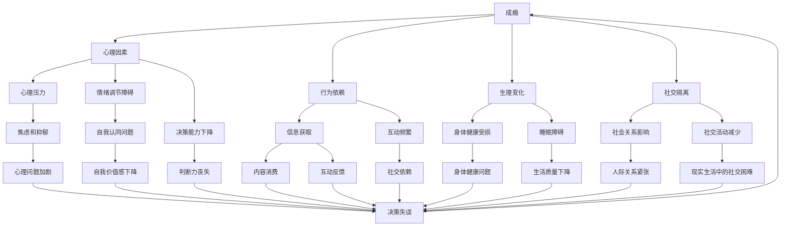

                 

# 数字化威胁意识：意识到数字化时代的危险性并有所防范，包括成瘾、隐私、霸凌等

## 1. 背景介绍

### 1.1 问题由来

随着数字化时代的到来，信息技术不断渗透到生活的各个层面，其正面作用不言而喻。人们的生活变得更加便捷，工作效率显著提高，学习知识更加自由。然而，数字化也带来了许多挑战，尤其是一些潜在的威胁，这些问题如果不加以关注，可能会对个人和社会产生严重负面影响。其中，成瘾、隐私泄露、网络霸凌等问题最为突出，需要得到广泛关注和深入研究。

### 1.2 问题核心关键点

这些问题涉及的技术、心理和社会等多方面的因素，需要对每个方面都有深刻的认识和理解，才能找到有效的解决策略。以下是这些问题的重要核心点：

- **成瘾**：过度使用互联网和手机等设备可能导致心理和生理上的依赖，影响学习和工作。
- **隐私泄露**：在数字化时代，个人信息无处不在，容易成为网络攻击的目标，导致隐私被非法获取和滥用。
- **网络霸凌**：网络空间的匿名性和不受限制性使得网络霸凌变得更为普遍，对受害者的心理和现实生活造成严重影响。

## 2. 核心概念与联系

### 2.1 核心概念概述

为了更好地理解这些问题，我们首先定义和理解相关的核心概念：

- **成瘾(Addiction)**：指个体对某种行为或物质产生强烈的依赖，难以控制，导致生理和心理健康受损。
- **隐私(Privacy)**：指个人在公共领域和私人领域的信息不被他人随意获取、使用和公开。
- **网络霸凌(Cyberbullying)**：指通过互联网平台进行的言语、文字、图像或视频等形式的欺凌行为，往往具有隐蔽性、匿名性和扩散性。
- **安全(Security)**：指个人和组织的信息系统、网络通信等不受未授权访问和破坏。
- **伦理(Ethics)**：指在设计和应用信息技术时，遵循的道德原则和规范，确保技术的合理使用。

这些概念之间有着紧密的联系，隐私泄露、网络霸凌等问题往往与安全、伦理密切相关，需要通过技术手段和道德规范来预防和应对。

### 2.2 核心概念原理和架构的 Mermaid 流程图



这个流程图展示了成瘾、隐私泄露、网络霸凌等问题的相互关联和影响。例如，成瘾可能导致心理健康问题，如焦虑和抑郁，进而影响判断力和社交关系。而隐私泄露则可能导致个人信息被滥用，从而引发一系列问题，如身份盗窃和网络霸凌。网络霸凌则可能引发心理和生理上的伤害，进一步加剧心理健康问题。

## 3. 核心算法原理 & 具体操作步骤

### 3.1 算法原理概述

数字化威胁的防范涉及多个层面的技术和方法，包括但不限于以下几个方面：

- **预防技术**：通过技术手段，如加密、防火墙、身份认证等，保护个人信息和系统的安全。
- **监测和响应**：通过自动化工具，如入侵检测系统(IDS)和网络监控工具，实时监测网络活动，及时发现并响应潜在威胁。
- **教育和培训**：通过教育和培训，提高个人和组织的安全意识和防范能力。
- **法律和政策**：通过法律和政策手段，规范网络行为，保障个人和组织权益。

这些技术方法需要综合运用，才能有效防范数字化威胁。

### 3.2 算法步骤详解

针对成瘾、隐私泄露、网络霸凌等问题，防范措施可以细分为以下几个步骤：

1. **成瘾预防**：
   - **教育和培训**：在学校和工作场所进行有关互联网和手机使用的教育，帮助人们了解成瘾的危害和预防方法。
   - **限制使用**：设置时间限制和使用规则，避免过度使用。
   - **替代活动**：鼓励参与户外活动、体育锻炼等，分散注意力。

2. **隐私保护**：
   - **数据加密**：对敏感数据进行加密存储和传输，防止被非法获取。
   - **隐私策略**：明确隐私保护策略，对数据收集和使用进行严格控制。
   - **隐私教育**：向用户普及隐私保护知识，提高其隐私意识。

3. **网络霸凌防范**：
   - **身份验证**：实行严格的账户验证措施，避免匿名恶意行为。
   - **监控和举报**：建立有效的监控和举报机制，及时处理网络霸凌行为。
   - **心理干预**：对受害者和施害者进行心理辅导，缓解负面影响。

### 3.3 算法优缺点

这些防范措施的优点包括：

- **技术手段**：通过技术手段，可以有效提高信息系统的安全性，保护个人隐私。
- **自动化监测**：自动化工具可以实时监控网络活动，及时发现和响应威胁，提高防范效率。

不足之处在于：

- **技术依赖**：过度依赖技术手段可能导致忽视心理和社会因素的作用。
- **法律和政策缺失**：缺乏有效的法律和政策支持，技术手段的效果可能大打折扣。

### 3.4 算法应用领域

这些措施广泛应用于多个领域：

- **教育**：在学校和大学中，通过教育和技术手段，帮助学生远离成瘾和网络霸凌。
- **企业**：在企业内部，通过技术手段和政策措施，保障员工隐私和安全。
- **公共服务**：政府和公共机构，通过法律和政策，保护公民的隐私和权益。

## 4. 数学模型和公式 & 详细讲解

### 4.1 数学模型构建

为了更好地理解这些问题，我们可以使用一些数学模型进行描述。例如，可以使用信息熵模型来衡量隐私泄露的风险，使用马尔可夫链来描述网络霸凌的传播过程。

- **信息熵**：表示信息的不确定性，熵越高，信息的不确定性越大，隐私泄露的风险越高。公式为 $H(X)=-\sum_{i}p_i\log p_i$，其中 $p_i$ 为事件 $i$ 的概率。

- **马尔可夫链**：用于描述网络霸凌的传播过程，可以建立状态转移矩阵，分析不同状态之间的转移概率。

### 4.2 公式推导过程

以信息熵模型为例，假设我们有 $n$ 个用户的个人信息，每个信息被非法获取的概率为 $p_i$，则整个系统的信息熵为：

$$
H(X)=-\sum_{i=1}^{n}p_i\log p_i
$$

如果对某些关键信息进行加密处理，那么信息被非法获取的概率变为 $q_i$，则新的信息熵为：

$$
H'(X)=-\sum_{i=1}^{n}q_i\log q_i
$$

显然，$H'(X)$ 小于 $H(X)$，即加密处理能够降低系统的信息熵，提高隐私保护效果。

### 4.3 案例分析与讲解

以网络霸凌为例，假设霸凌者从 $A$ 状态（未施霸凌）到 $B$ 状态（已施霸凌）的概率为 $p_{AB}$，从 $B$ 状态到 $C$ 状态（已停止霸凌）的概率为 $p_{BC}$，则霸凌的传播过程可以用马尔可夫链表示为：

$$
P(t+1)=P(t)A
$$

其中 $P(t)$ 表示状态的概率分布，$A$ 为状态转移矩阵。通过求解 $P(t+1)$，可以预测霸凌传播的趋势，进而采取有效措施进行干预。

## 5. 项目实践：代码实例和详细解释说明

### 5.1 开发环境搭建

在数字化威胁防范的实践中，我们需要使用一些开发工具和框架。以下是几个常用的开发环境：

1. **Python**：Python是一种强大的编程语言，广泛应用于数据分析、机器学习等领域。
2. **TensorFlow**：谷歌开发的深度学习框架，支持大规模的分布式训练和推理。
3. **PyTorch**：Facebook开发的深度学习框架，支持动态计算图和高效的模型构建。
4. **Keras**：高级神经网络API，支持快速搭建和训练模型。

### 5.2 源代码详细实现

以下是一个简单的Python代码示例，用于加密处理用户敏感信息：

```python
from cryptography.fernet import Fernet

# 生成密钥
key = Fernet.generate_key()
cipher_suite = Fernet(key)

# 加密数据
data = b"敏感信息"
cipher_text = cipher_suite.encrypt(data)

# 解密数据
plain_text = cipher_suite.decrypt(cipher_text)
```

在这个例子中，使用了加密库 `cryptography` 中的 `Fernet` 算法，对敏感信息进行了加密处理。

### 5.3 代码解读与分析

- **密钥生成**：使用 `generate_key()` 方法生成一个随机的密钥。
- **加密数据**：使用密钥创建 `Fernet` 对象，对数据进行加密处理，得到密文 `cipher_text`。
- **解密数据**：使用相同的密钥和 `Fernet` 对象对密文进行解密，得到原始的明文 `plain_text`。

### 5.4 运行结果展示

运行上述代码，可以成功加密和解密数据，确保敏感信息的安全性。

## 6. 实际应用场景

### 6.1 智能客服系统

智能客服系统在数字化时代得到了广泛应用，但在安全性和隐私保护方面仍需加强。例如，通过使用加密技术和身份验证机制，保护用户个人信息，避免信息泄露和滥用。同时，建立有效的监控和举报机制，及时处理用户投诉，提高服务质量。

### 6.2 金融服务平台

金融服务平台需要处理大量的用户财务信息，隐私保护尤为重要。通过使用数据加密、隐私策略和法律保护措施，保障用户财务信息的安全性。同时，建立有效的反欺诈系统，防止金融欺诈行为的发生。

### 6.3 医疗健康平台

医疗健康平台涉及到用户的健康信息，隐私保护至关重要。通过使用数据加密、隐私协议和法律保护措施，保障用户健康信息的隐私性。同时，建立有效的网络行为监控机制，防止医疗信息泄露和滥用。

## 7. 工具和资源推荐

### 7.1 学习资源推荐

为了深入理解数字化威胁和防范措施，推荐以下学习资源：

1. **《网络安全原理与实践》**：系统介绍网络安全的基本原理和实践方法，涵盖加密、身份认证、入侵检测等多个方面。
2. **《隐私保护与数据安全》**：详细介绍隐私保护的理论和技术，包括数据加密、隐私策略和法律保护措施。
3. **《数字时代的网络霸凌》**：分析网络霸凌的成因和影响，提出有效的防范和应对措施。

### 7.2 开发工具推荐

以下是一些常用的开发工具，可以用于数字化威胁防范的开发和实现：

1. **Wireshark**：网络协议分析工具，用于监控和分析网络流量。
2. **Nmap**：网络探测工具，用于扫描和评估网络安全漏洞。
3. **OpenSSL**：开源的加密库，支持多种加密算法和协议。

### 7.3 相关论文推荐

以下是几篇与数字化威胁防范相关的经典论文，推荐阅读：

1. **《信息熵理论在隐私保护中的应用》**：介绍信息熵模型在隐私保护中的作用和应用。
2. **《网络霸凌的传播模型及防范策略》**：分析网络霸凌的传播过程，提出有效的防范策略。
3. **《基于机器学习的用户成瘾预测模型》**：使用机器学习模型预测用户成瘾风险，提出干预策略。

## 8. 总结：未来发展趋势与挑战

### 8.1 研究成果总结

数字化威胁防范的研究已经取得显著进展，涵盖了技术、法律和社会多个方面。然而，数字化威胁的复杂性和多样性决定了防范措施需要不断更新和改进，才能适应新的安全挑战。

### 8.2 未来发展趋势

未来，数字化威胁防范将呈现以下趋势：

1. **技术创新**：随着新技术的不断涌现，如区块链、人工智能等，将推动数字化威胁防范技术的升级和创新。
2. **法律和政策**：随着数字化发展的不断深入，相关法律和政策将更加完善，为数字化威胁防范提供更有力的支持。
3. **公众教育**：提高公众的安全意识和防范能力，是防范数字化威胁的重要一环，需要持续加强教育宣传。

### 8.3 面临的挑战

数字化威胁防范仍面临诸多挑战：

1. **技术依赖**：过度依赖技术手段可能导致忽视心理和社会因素的作用。
2. **法律和政策缺失**：缺乏有效的法律和政策支持，技术手段的效果可能大打折扣。
3. **隐私保护**：在隐私保护和信息共享之间找到平衡，是一项复杂的任务。
4. **网络霸凌**：网络霸凌的隐蔽性和匿名性，使得防范和处理更加困难。
5. **成瘾问题**：互联网和手机等设备的成瘾问题，对个人和社会的负面影响不容忽视。

### 8.4 研究展望

未来，数字化威胁防范的研究需要在以下几个方面进行突破：

1. **综合治理**：综合运用技术、法律和社会多方面的手段，全面提升数字化威胁防范能力。
2. **跨领域合作**：加强各领域之间的合作，共同应对数字化威胁。
3. **公众参与**：鼓励公众参与数字化威胁防范，提高防范效果。

## 9. 附录：常见问题与解答

**Q1：如何有效防范数字化威胁？**

A: 防范数字化威胁需要综合运用技术手段、法律和政策措施以及公众教育，具体包括：
- 加密和身份验证，保护个人信息安全。
- 建立有效的监控和举报机制，及时处理威胁。
- 提高公众的安全意识和防范能力。

**Q2：隐私保护和信息共享之间如何平衡？**

A: 隐私保护和信息共享之间的平衡需要考虑以下几个方面：
- 明确隐私保护策略，限制敏感信息的共享。
- 建立数据使用和共享的透明机制，增加用户信任。
- 在保障隐私的前提下，尽可能提供有价值的信息共享服务。

**Q3：如何应对网络霸凌？**

A: 应对网络霸凌需要采取以下措施：
- 实施严格的账户验证措施，避免匿名恶意行为。
- 建立有效的监控和举报机制，及时处理霸凌行为。
- 对受害者和施害者进行心理辅导，缓解负面影响。

这些问题的解决需要多方面的努力，包括技术、法律和社会多方面的协同作用，共同构建安全的数字化环境。

---

作者：禅与计算机程序设计艺术 / Zen and the Art of Computer Programming

