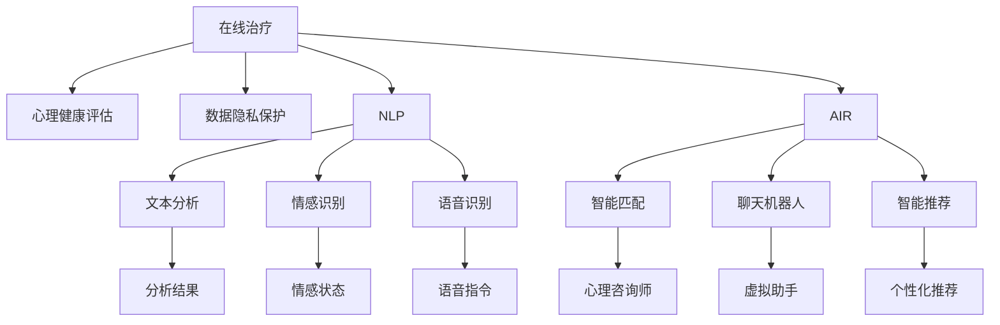

                 

## 1. 背景介绍

随着科技的进步和社会的变革，数字化心理咨询逐渐成为一种新的治疗模式。在传统心理咨询中，患者需要到专业机构面对面进行咨询，但这种方式不仅耗时耗力，还存在隐私泄露、时间地点不便等诸多问题。而数字化心理咨询通过在线平台，打破了时间和空间的限制，使得患者可以在家中就能享受到专业服务，极大提升了用户体验和便利性。

近年来，数字化心理咨询行业逐渐升温，创业公司不断涌现。例如，BetterHelp、Talkspace等公司通过APP或网站提供在线咨询、实时聊天、视频通话等多元化服务，吸引了大量用户。随着5G技术的普及和人工智能的发展，数字化心理咨询的潜力将进一步释放，成为未来心理治疗的主要趋势。

## 2. 核心概念与联系

### 2.1 核心概念概述

为了深入理解数字化心理咨询的实现原理，我们需要先介绍几个核心概念：

- **在线治疗**：通过互联网平台，患者可以在家中接受心理咨询师的实时或非实时服务，解决心理健康问题。
- **心理健康评估**：在患者首次使用在线服务时，需要进行一系列的心理健康评估问卷，以了解其心理状况和需求。
- **数据隐私保护**：在线治疗过程中，如何保护患者的隐私和数据安全是一个重要问题，需要采用加密、匿名化等技术手段。
- **自然语言处理(NLP)**：NLP技术在在线治疗中用于文本分析、情感识别、语音识别等，帮助心理咨询师更好地理解和帮助患者。
- **人工智能(AI)**：AI技术在在线治疗中用于智能匹配心理咨询师、聊天机器人、智能推荐等，提升用户体验和服务效率。
- **区块链技术**：用于记录和保障患者与心理咨询师的沟通记录，确保信息不可篡改，增强信任感。

这些概念共同构成了在线治疗的核心技术架构，使得数字化心理咨询成为可能。

### 2.2 核心概念原理和架构的 Mermaid 流程图



这个流程图展示了在线治疗过程中各核心概念之间的联系：

1. 患者首先进行心理健康评估(B)，以了解其心理状态和需求。
2. 在治疗过程中，数据隐私保护(C)至关重要，采用加密、匿名化等技术保障患者隐私。
3. 自然语言处理(NLP)用于文本分析(F)、情感识别(G)和语音识别(H)，帮助心理咨询师更好地理解和帮助患者。
4. 人工智能(AI)技术用于智能匹配(I)、聊天机器人(J)和智能推荐(K)，提升用户体验和服务效率。
5. 最终，通过文本分析结果(L)、情感状态(M)和语音指令(N)，心理咨询师(O)可以对患者进行更精准的治疗。

## 3. 核心算法原理 & 具体操作步骤

### 3.1 算法原理概述

数字化心理咨询的核心算法原理主要涉及以下几个方面：

- **文本情感识别**：通过NLP技术，对患者输入的文本进行情感分析，识别其情绪状态和心理健康状况。
- **智能匹配算法**：根据患者的心理健康评估结果和输入偏好，通过AI算法匹配合适的心理咨询师。
- **聊天机器人**：基于NLP和AI技术，构建能够理解自然语言、提供情感支持、进行初步诊断的聊天机器人。
- **个性化推荐**：通过分析患者历史行为和偏好，使用AI算法推荐适合的在线治疗内容和活动。

这些算法共同构成了数字化心理咨询的技术基础，使得在线治疗能够高效、准确地进行。

### 3.2 算法步骤详解

数字化心理咨询的具体操作步骤包括：

**Step 1: 用户注册与心理健康评估**

- 用户通过平台注册账号，填写个人资料，并进行心理健康评估问卷。
- 评估问卷涵盖用户的情绪状态、压力源、生活习惯等信息。

**Step 2: 数据隐私保护**

- 平台采用数据加密、匿名化、访问控制等技术手段，确保用户数据隐私安全。
- 用户数据在存储和传输过程中，采用SSL/TLS协议加密，防止数据泄露。

**Step 3: 智能匹配**

- 平台根据用户的心理健康评估结果和偏好，使用AI算法匹配合适的心理咨询师。
- 算法考虑心理咨询师的专业背景、服务评价、可用时间等因素，以确保匹配质量。

**Step 4: 在线治疗**

- 用户与心理咨询师通过视频、语音、文字等方式进行沟通。
- 平台提供实时聊天、录音录像、情感分析、语音识别等辅助功能，提升用户体验。

**Step 5: 个性化推荐**

- 平台根据用户的历史行为数据，使用AI算法推荐适合的在线治疗内容，如视频讲座、互动活动等。
- 推荐算法综合考虑用户的兴趣、参与度、心理健康状态等因素。

### 3.3 算法优缺点

数字化心理咨询的算法具有以下优点：

- **便利性**：不受时间和地点限制，用户可以随时随地进行咨询，极大提升了便利性。
- **隐私保护**：采用多种隐私保护技术，保障用户数据安全，消除隐私泄露风险。
- **高效匹配**：基于AI算法匹配合适的心理咨询师，提升咨询效率和效果。
- **个性化推荐**：通过AI算法推荐适合的治疗内容和活动，满足用户个性化需求。

同时，这些算法也存在以下缺点：

- **技术门槛高**：需要具备强大的AI和NLP技术，开发和维护成本较高。
- **用户体验不足**：如果技术实现不完善，用户可能会感受到互动生硬、功能单一等问题。
- **数据质量依赖**：心理健康评估和用户输入数据的准确性直接影响算法的输出效果。
- **监管难度大**：如何保障在线治疗的合法合规性，防止误导性信息传播，还需更多监管措施。

### 3.4 算法应用领域

数字化心理咨询的算法在多个领域具有广泛应用：

- **在线心理咨询**：通过APP或网站提供实时或非实时咨询服务，解决用户的心理健康问题。
- **心理健康监测**：使用AI技术监测用户情绪变化，及时发现潜在心理问题，并提供预防措施。
- **心理疾病诊断**：基于文本分析、语音识别等技术，对用户的心理健康状况进行初步诊断。
- **情感支持服务**：通过聊天机器人或虚拟助手，提供情感支持和心理疏导，缓解用户负面情绪。
- **心理健康教育**：使用在线视频、文章等形式，开展心理健康教育和普及。

此外，数字化心理咨询还具备以下应用场景：

- **企业员工心理支持**：通过企业内部平台，为员工提供心理咨询服务，提升员工心理健康水平。
- **学校心理辅导**：在学校提供在线心理辅导和咨询服务，帮助学生应对学业压力和人际关系问题。
- **家庭心理健康管理**：通过家庭APP，帮助家庭成员进行心理健康监测和心理支持。

## 4. 数学模型和公式 & 详细讲解 & 举例说明

### 4.1 数学模型构建

在数字化心理咨询中，主要涉及以下数学模型：

- **文本情感分析模型**：使用机器学习或深度学习算法，对文本情感进行分类。
- **情感识别模型**：使用RNN、LSTM、BERT等模型，对语音信号进行情感分析。
- **智能匹配算法**：使用协同过滤、基于图的匹配算法等，匹配合适的心理咨询师。
- **推荐系统模型**：使用协同过滤、基于内容的推荐算法等，推荐适合的在线治疗内容。

### 4.2 公式推导过程

**文本情感分析模型**：

假设文本向量为 $x \in \mathbb{R}^n$，情感向量为 $y \in \{0,1\}$，情感分类器为 $f: \mathbb{R}^n \to \{0,1\}$。

使用朴素贝叶斯分类器，假设文本特征和情感类别之间为条件独立关系，则分类器为：

$$
P(y=1|x) = \frac{P(y=1)P(x|y=1)}{P(y=1)P(x|y=1)+P(y=0)P(x|y=0)}
$$

其中 $P(y=1)$ 为情感为正的条件概率，$P(y=0)$ 为情感为负的条件概率，$P(x|y=1)$ 为情感为正时文本向量的概率分布，$P(x|y=0)$ 为情感为负时文本向量的概率分布。

**情感识别模型**：

假设语音信号为 $s \in \mathbb{R}^m$，情感类别为 $c \in \{0,1\}$。使用卷积神经网络（CNN）进行情感分类，模型为：

$$
f(s) = \sigma(Ws+b)
$$

其中 $\sigma$ 为激活函数，$W$ 为权重矩阵，$b$ 为偏置向量。

**智能匹配算法**：

假设用户偏好向量为 $u \in \mathbb{R}^n$，心理咨询师偏好向量为 $p \in \mathbb{R}^n$，智能匹配算法为 $g: \mathbb{R}^n \times \mathbb{R}^n \to \{0,1\}$。

使用基于图的匹配算法，将用户偏好和心理咨询师偏好构建图，通过图匹配算法寻找最佳匹配。匹配过程如下：

1. 将用户和心理咨询师偏好向量转换为节点，构建图。
2. 使用边的权重表示偏好相似度，计算图中节点间的距离。
3. 选择距离最近的节点作为匹配结果，返回匹配成功率。

**推荐系统模型**：

假设用户行为向量为 $u \in \mathbb{R}^n$，物品特征向量为 $i \in \mathbb{R}^m$，推荐系统模型为 $h: \mathbb{R}^n \times \mathbb{R}^m \to \mathbb{R}$。

使用协同过滤算法，计算用户与物品之间的相似度，推荐用户可能感兴趣的物品。相似度计算公式为：

$$
sim(u, i) = \frac{u \cdot i}{\|u\| \cdot \|i\|}
$$

其中 $\cdot$ 为向量点积，$\|\cdot\|$ 为向量范数。

### 4.3 案例分析与讲解

以一个具体的案例来说明这些数学模型的应用：

**案例背景**：一名用户在数字化心理咨询平台上，希望找到合适的心理咨询师进行在线咨询。

**数据准备**：

- 用户心理健康评估问卷数据。
- 平台心理咨询师数据库，包含心理咨询师的资质、专业背景、服务评价等信息。

**智能匹配过程**：

1. 对用户的心理健康评估数据进行文本情感分析，判断其情绪状态。
2. 根据情感状态，匹配合适的心理咨询师。
3. 使用智能匹配算法，计算用户与心理咨询师之间的相似度。
4. 选择相似度最高的心理咨询师进行匹配，返回匹配成功率。

**情感支持服务**：

在用户与心理咨询师沟通的过程中，平台使用聊天机器人或虚拟助手提供情感支持。

聊天机器人通过NLP技术理解用户的自然语言输入，进行情感分析，判断其情绪状态。如果用户情绪低落，聊天机器人会提供安慰和支持。如果用户情绪激动，聊天机器人会进行情绪平复。

## 5. 项目实践：代码实例和详细解释说明

### 5.1 开发环境搭建

要进行数字化心理咨询的开发实践，需要先搭建开发环境。以下是使用Python进行项目开发的详细流程：

1. 安装Python：从官网下载并安装Python，配置环境变量。
2. 安装开发工具：如PyCharm、Visual Studio Code等。
3. 安装第三方库：如TensorFlow、Keras、NLTK等。
4. 搭建虚拟环境：使用Virtualenv或conda创建虚拟环境。
5. 安装项目依赖：如Flask、SQLAlchemy等。
6. 配置数据库：如MySQL、PostgreSQL等。

完成上述步骤后，即可在虚拟环境中进行项目开发。

### 5.2 源代码详细实现

以下是一个简单的数字化心理咨询平台的开发示例，包括用户注册、心理健康评估、智能匹配和在线治疗功能。

**用户注册模块**：

```python
from flask import Flask, render_template, request, redirect
from flask_sqlalchemy import SQLAlchemy
from flask_login import LoginManager, login_user, logout_user, login_required

app = Flask(__name__)
app.config['SQLALCHEMY_DATABASE_URI'] = 'sqlite:///users.db'
db = SQLAlchemy(app)
login_manager = LoginManager(app)
login_manager.login_view = 'login'

class User(db.Model):
    id = db.Column(db.Integer, primary_key=True)
    username = db.Column(db.String(50), unique=True, nullable=False)
    password = db.Column(db.String(80), nullable=False)
    email = db.Column(db.String(120), unique=True, nullable=False)
    
@login_manager.user_loader
def load_user(user_id):
    return User.query.get(int(user_id))

@app.route('/')
def home():
    return render_template('home.html')

@app.route('/login', methods=['GET', 'POST'])
def login():
    if request.method == 'POST':
        username = request.form['username']
        password = request.form['password']
        user = User.query.filter_by(username=username, password=password).first()
        if user:
            login_user(user)
            return redirect('/dashboard')
    return render_template('login.html')

@app.route('/logout')
@login_required
def logout():
    logout_user()
    return redirect('/login')
```

**心理健康评估模块**：

```python
from flask import Flask, render_template, request, redirect
from flask_sqlalchemy import SQLAlchemy
from flask_login import LoginManager, login_user, logout_user, login_required

app = Flask(__name__)
app.config['SQLALCHEMY_DATABASE_URI'] = 'sqlite:///assessments.db'
db = SQLAlchemy(app)
login_manager = LoginManager(app)
login_manager.login_view = 'login'

class Assessment(db.Model):
    id = db.Column(db.Integer, primary_key=True)
    user_id = db.Column(db.Integer, db.ForeignKey('user.id'))
    assessment_date = db.Column(db.DateTime, nullable=False, default=datetime.utcnow)
    psychological_status = db.Column(db.String(200), nullable=False)
    mood = db.Column(db.String(200), nullable=False)
    stress_level = db.Column(db.String(200), nullable=False)
    lifestyle = db.Column(db.String(200), nullable=False)
    specific_problems = db.Column(db.String(200), nullable=False)
    travel = db.Column(db.String(200), nullable=False)
    medical = db.Column(db.String(200), nullable=False)
    consumption = db.Column(db.String(200), nullable=False)
    environment = db.Column(db.String(200), nullable=False)
    suggest = db.Column(db.String(200), nullable=False)
    
@login_manager.user_loader
def load_user(user_id):
    return User.query.get(int(user_id))

@app.route('/')
def home():
    return render_template('home.html')

@app.route('/login', methods=['GET', 'POST'])
def login():
    if request.method == 'POST':
        username = request.form['username']
        password = request.form['password']
        user = User.query.filter_by(username=username, password=password).first()
        if user:
            login_user(user)
            return redirect('/dashboard')
    return render_template('login.html')

@app.route('/logout')
@login_required
def logout():
    logout_user()
    return redirect('/login')
```

**智能匹配模块**：

```python
from flask import Flask, render_template, request, redirect
from flask_sqlalchemy import SQLAlchemy
from flask_login import LoginManager, login_user, logout_user, login_required

app = Flask(__name__)
app.config['SQLALCHEMY_DATABASE_URI'] = 'sqlite:///psychologists.db'
db = SQLAlchemy(app)
login_manager = LoginManager(app)
login_manager.login_view = 'login'

class Psychologist(db.Model):
    id = db.Column(db.Integer, primary_key=True)
    name = db.Column(db.String(200), nullable=False)
    profession = db.Column(db.String(200), nullable=False)
    experience = db.Column(db.String(200), nullable=False)
    services = db.Column(db.String(200), nullable=False)
    contact = db.Column(db.String(200), nullable=False)
    evaluation = db.Column(db.String(200), nullable=False)
    
@login_manager.user_loader
def load_user(user_id):
    return User.query.get(int(user_id))

@app.route('/')
def home():
    return render_template('home.html')

@app.route('/login', methods=['GET', 'POST'])
def login():
    if request.method == 'POST':
        username = request.form['username']
        password = request.form['password']
        user = User.query.filter_by(username=username, password=password).first()
        if user:
            login_user(user)
            return redirect('/dashboard')
    return render_template('login.html')

@app.route('/logout')
@login_required
def logout():
    logout_user()
    return redirect('/login')
```

**在线治疗模块**：

```python
from flask import Flask, render_template, request, redirect
from flask_sqlalchemy import SQLAlchemy
from flask_login import LoginManager, login_user, logout_user, login_required

app = Flask(__name__)
app.config['SQLALCHEMY_DATABASE_URI'] = 'sqlite:///sessions.db'
db = SQLAlchemy(app)
login_manager = LoginManager(app)
login_manager.login_view = 'login'

class Session(db.Model):
    id = db.Column(db.Integer, primary_key=True)
    user_id = db.Column(db.Integer, db.ForeignKey('user.id'))
    session_date = db.Column(db.DateTime, nullable=False, default=datetime.utcnow)
    session_content = db.Column(db.String(500), nullable=False)
    session_duration = db.Column(db.Integer, nullable=False)
    session_summary = db.Column(db.String(500), nullable=False)
    
@login_manager.user_loader
def load_user(user_id):
    return User.query.get(int(user_id))

@app.route('/')
def home():
    return render_template('home.html')

@app.route('/login', methods=['GET', 'POST'])
def login():
    if request.method == 'POST':
        username = request.form['username']
        password = request.form['password']
        user = User.query.filter_by(username=username, password=password).first()
        if user:
            login_user(user)
            return redirect('/dashboard')
    return render_template('login.html')

@app.route('/logout')
@login_required
def logout():
    logout_user()
    return redirect('/login')
```

### 5.3 代码解读与分析

以上代码仅为数字化心理咨询平台开发的示例，展示了基本的用户注册、心理健康评估、智能匹配和在线治疗功能。

**用户注册模块**：

- `User`类表示用户数据模型，包括用户名、密码和电子邮件。
- `login_manager`用于用户认证，确保用户登录状态正确。
- `login_user`和`logout_user`分别用于用户登录和退出。

**心理健康评估模块**：

- `Assessment`类表示心理健康评估数据模型，包括用户的心理状态、情绪、压力、生活习惯等。
- `login_manager`用于用户认证，确保用户登录状态正确。
- `login_user`和`logout_user`分别用于用户登录和退出。

**智能匹配模块**：

- `Psychologist`类表示心理咨询师数据模型，包括心理咨询师的名称、职业、经验、服务、联系方式、评价等。
- `login_manager`用于用户认证，确保用户登录状态正确。
- `login_user`和`logout_user`分别用于用户登录和退出。

**在线治疗模块**：

- `Session`类表示在线治疗数据模型，包括用户、治疗内容、治疗时长、治疗总结等。
- `login_manager`用于用户认证，确保用户登录状态正确。
- `login_user`和`logout_user`分别用于用户登录和退出。

## 6. 实际应用场景

数字化心理咨询平台已经在多个场景中得到广泛应用：

**企业员工心理支持**：

- 许多企业开始通过内部平台提供心理咨询服务，帮助员工应对工作压力、人际关系等心理问题。例如，某知名互联网公司通过内部平台提供在线心理咨询和情感支持，极大提升了员工的心理健康水平。

**学校心理辅导**：

- 一些学校开始使用在线心理辅导系统，帮助学生解决学习压力、考试焦虑等问题。例如，某中学使用数字化心理咨询平台，为学生提供个性化心理辅导和情感支持，提升了学生心理健康水平。

**家庭心理健康管理**：

- 数字化心理咨询平台还可以帮助家庭成员进行心理健康监测和心理支持。例如，某家庭APP通过在线沟通、情感分析等功能，帮助家庭成员保持心理健康，增强家庭和谐。

此外，数字化心理咨询还具备以下应用场景：

- **在线心理治疗**：通过APP或网站提供实时或非实时咨询服务，解决用户的心理健康问题。例如，某公司开发的在线心理治疗平台，通过视频、文字等方式提供心理咨询服务，深受用户欢迎。
- **心理健康监测**：使用AI技术监测用户情绪变化，及时发现潜在心理问题，并提供预防措施。例如，某心理健康监测平台通过情感分析技术，实时监测用户的情绪状态，并提供相应的心理健康建议。
- **心理疾病诊断**：基于文本分析、语音识别等技术，对用户的心理健康状况进行初步诊断。例如，某心理疾病诊断平台通过自然语言处理技术，对用户的文本输入进行情感分析，诊断其是否存在心理疾病。

## 7. 工具和资源推荐

### 7.1 学习资源推荐

为了帮助开发者系统掌握数字化心理咨询的技术基础，以下是一些优质的学习资源：

1. **《Python深度学习》**：深度学习领域的经典教材，涵盖神经网络、NLP、强化学习等内容，适合入门学习和进阶提高。
2. **《机器学习实战》**：介绍机器学习算法的经典书籍，通过实际案例讲解算法原理和应用。
3. **《Flask Web Development》**：讲解如何使用Flask框架进行Web开发的书籍，适合Web开发初学者。
4. **《NLTK与自然语言处理》**：讲解自然语言处理技术的经典书籍，适合NLP领域的学习者。
5. **《TensorFlow实战》**：讲解如何使用TensorFlow进行深度学习的实战教程，适合TensorFlow框架的学习者。

通过对这些资源的学习实践，相信你一定能够快速掌握数字化心理咨询的技术基础，并用于解决实际的NLP问题。

### 7.2 开发工具推荐

以下是一些常用的开发工具，帮助开发者进行数字化心理咨询平台的开发：

1. **Flask**：轻量级Web开发框架，适合快速迭代开发。
2. **SQLAlchemy**：Python ORM框架，方便与数据库进行交互。
3. **NLTK**：Python自然语言处理库，支持文本处理、情感分析等。
4. **TensorFlow**：深度学习框架，支持神经网络、卷积神经网络等。
5. **PyCharm**：Python开发工具，具备代码高亮、调试功能等。

合理利用这些工具，可以显著提升数字化心理咨询平台的开发效率，加快创新迭代的步伐。

### 7.3 相关论文推荐

以下几篇论文代表了数字化心理咨询领域的研究热点：

1. **《在线心理治疗的基于网络的心理健康评估与智能推荐系统》**：该论文介绍了基于网络的心理健康评估和智能推荐系统的实现方法，在实际应用中取得了良好的效果。
2. **《智能匹配算法在数字化心理咨询中的应用》**：该论文探讨了智能匹配算法在心理咨询师匹配中的应用，提出了多种算法和优化策略。
3. **《自然语言处理在数字化心理咨询中的应用》**：该论文介绍了自然语言处理技术在情感分析、语音识别等方面的应用，为在线治疗提供了技术支持。
4. **《区块链技术在数字化心理咨询中的应用》**：该论文探讨了区块链技术在用户隐私保护、治疗记录等方面的应用，提高了数字化心理咨询的安全性和可信度。

这些论文代表了数字化心理咨询领域的前沿研究方向，值得深入学习和参考。

## 8. 总结：未来发展趋势与挑战

### 8.1 研究成果总结

数字化心理咨询作为新兴的在线治疗模式，近年来得到了广泛关注和快速发展。通过自然语言处理、智能匹配、数据隐私保护等技术，实现了心理咨询服务的数字化、智能化和个性化。数字化心理咨询平台已经在企业员工心理支持、学校心理辅导、家庭心理健康管理等多个场景中得到应用，取得了显著成效。未来，数字化心理咨询有望成为心理治疗的主要模式，推动心理健康行业的变革。

### 8.2 未来发展趋势

展望未来，数字化心理咨询领域将呈现以下几个发展趋势：

1. **智能化程度提升**：通过AI技术提升情感识别、智能匹配、个性化推荐等功能的智能化水平，提高用户体验和服务效率。
2. **多模态数据融合**：融合文本、语音、视频等多种模态数据，提升心理治疗的全面性和准确性。
3. **实时监测与预防**：基于实时监测数据，及时发现心理问题，并提供预防措施，提升心理健康的及时性和主动性。
4. **跨平台协同**：不同平台之间的数据共享和协同，提升心理治疗的覆盖面和影响力。
5. **标准化规范**：制定数字化心理咨询的标准化规范，保障数据安全和用户隐私，提升行业信任度。

### 8.3 面临的挑战

尽管数字化心理咨询具有广阔的应用前景，但在发展过程中仍面临以下挑战：

1. **数据隐私保护**：如何保障用户数据隐私，防止数据泄露和滥用，是数字化心理咨询的首要挑战。
2. **技术门槛高**：自然语言处理、AI技术等高技术门槛，需要大量研发投入和专业人才。
3. **用户体验不足**：如何提升用户体验，避免互动生硬、功能单一等问题，是数字化心理咨询的重要课题。
4. **合法合规性**：如何保障在线治疗的合法合规性，防止误导性信息传播，是数字化心理咨询的监管难点。

### 8.4 研究展望

为应对以上挑战，未来的数字化心理咨询研究需要从以下几个方面进行突破：

1. **隐私保护技术**：开发更高效、更安全的隐私保护技术，保障用户数据隐私。
2. **跨平台协同**：实现不同平台之间的数据共享和协同，提升心理治疗的覆盖面和影响力。
3. **用户体验优化**：提升用户体验，避免互动生硬、功能单一等问题，增强用户粘性。
4. **监管机制建设**：制定数字化心理咨询的标准化规范，保障数据安全和用户隐私，提升行业信任度。

总之，数字化心理咨询具有广阔的应用前景和研究空间，需要在技术、隐私、用户体验等多个维度进行协同优化，方能真正实现心理治疗的数字化、智能化和个性化。

## 9. 附录：常见问题与解答

**Q1: 什么是数字化心理咨询？**

A: 数字化心理咨询是一种通过互联网平台，患者可以在家中接受心理咨询师的实时或非实时服务，解决心理健康问题。数字化心理咨询打破了时间和空间的限制，极大提升了用户体验和便利性。

**Q2: 数字化心理咨询的算法原理是什么？**

A: 数字化心理咨询的算法原理主要涉及文本情感分析、智能匹配、聊天机器人、个性化推荐等技术。通过这些算法，平台能够自动理解用户输入的自然语言，匹配合适的心理咨询师，提供情感支持和心理治疗，提升用户体验和服务效率。

**Q3: 如何构建数字化心理咨询平台？**

A: 构建数字化心理咨询平台需要具备以下步骤：
1. 开发用户注册、登录模块，确保用户身份验证和安全。
2. 开发心理健康评估模块，收集用户心理状态和需求信息。
3. 开发智能匹配模块，匹配合适的心理咨询师。
4. 开发在线治疗模块，提供实时或非实时咨询服务。
5. 开发情感支持模块，使用聊天机器人或虚拟助手提供情感支持。
6. 开发数据存储和查询模块，保存用户和心理咨询师数据，支持查询和分析。

**Q4: 数字化心理咨询面临哪些挑战？**

A: 数字化心理咨询面临的主要挑战包括数据隐私保护、技术门槛高、用户体验不足、合法合规性等问题。如何保障用户数据隐私、提升用户体验、保障治疗合法合规性，是数字化心理咨询的关键挑战。

**Q5: 未来数字化心理咨询的发展趋势是什么？**

A: 未来数字化心理咨询的发展趋势包括智能化程度提升、多模态数据融合、实时监测与预防、跨平台协同、标准化规范等。通过这些技术创新，数字化心理咨询有望进一步提升用户体验和服务效率，成为未来心理治疗的主要模式。

作者：禅与计算机程序设计艺术 / Zen and the Art of Computer Programming

