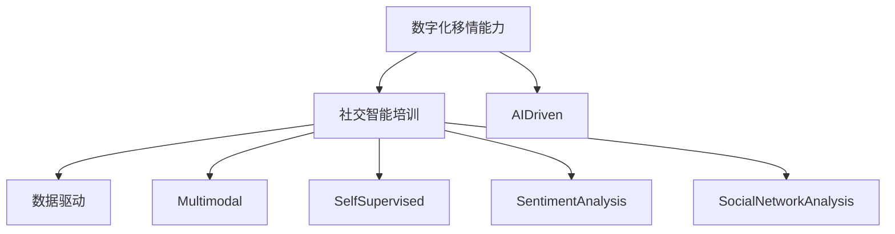

                 

# 数字化移情能力开发：AI增强的社交智能培训

> 关键词：数字化移情能力, 社交智能培训, AI增强, 数据驱动, 多模态学习, 自监督学习, 情感分析, 社交网络分析

## 1. 背景介绍

### 1.1 问题由来
随着数字化时代的到来，人工智能技术在各个领域的应用越来越广泛，特别是在社交智能培训方面，其作用显得尤为重要。社交智能（Social Intelligence, SI）是指个体理解和影响他人心理状态、动机、情绪和意图的能力。对于企业、教育机构以及公共服务行业，培养具备高社交智能的员工或学生，不仅可以提升团队协作效率，增强社会交往能力，还能够促进社会和谐稳定。然而，培养社交智能并非易事，传统的方式往往耗时耗力且难以量化。因此，数字化移情能力开发成为了新的研究热点。

数字化移情能力开发，是指通过人工智能技术，自动分析和理解人类情感状态，进而训练个体或群体提升社交智能的一种方法。近年来，深度学习、自然语言处理、计算机视觉等技术的快速发展，为社交智能培训提供了新的可能。本文将深入探讨数字化移情能力开发的原理、操作步骤以及未来应用前景，以期为相关领域的从业者提供参考。

### 1.2 问题核心关键点
数字化移情能力开发的核心在于：
- 如何准确地识别和分析人类的情感状态。
- 如何将情感分析结果转化为具体的社交智能培训内容。
- 如何在不同情境下优化社交智能培训的策略和效果。

本文将从算法原理、操作步骤、实际应用三个方面进行详细讲解，旨在帮助读者全面理解数字化移情能力开发的流程和方法。

## 2. 核心概念与联系

### 2.1 核心概念概述

为了更好地理解数字化移情能力开发，我们首先需要明确几个核心概念：

- **数字化移情能力**：指通过人工智能技术，识别和理解人类情感状态，并将其应用于社交智能培训的过程。
- **社交智能培训**：指通过各种培训手段，提升个体或群体的社交能力和情感理解力。
- **AI增强**：指利用人工智能技术，增强社交智能培训的效果和效率。
- **数据驱动**：指在社交智能培训中，通过大量数据来指导和优化培训策略。
- **多模态学习**：指在情感分析中，结合文本、语音、图像等多模态数据，提升情感识别的准确性。
- **自监督学习**：指在没有标注数据的情况下，通过大规模无标签数据训练模型，进而进行情感分析。
- **情感分析**：指通过算法自动识别和理解文本、语音等数据中的情感倾向。
- **社交网络分析**：指通过分析社交网络结构，评估个体在社交群体中的影响力和关系网络。

这些核心概念之间的逻辑关系可以通过以下Mermaid流程图来展示：



这个流程图展示了大语言模型的核心概念及其之间的关系：

1. 数字化移情能力通过AI增强，利用数据驱动的方式，结合多模态学习和自监督学习，进行情感分析。
2. 情感分析结果用于社交网络分析，评估个体在社交群体中的影响力和关系网络。
3. 社交智能培训利用情感分析结果，结合社交网络分析，设计具体的培训内容，提升个体的社交智能。

## 3. 核心算法原理 & 具体操作步骤

### 3.1 算法原理概述

数字化移情能力开发的核心算法包括情感分析、社交网络分析和社交智能培训。这些算法通过深度学习和数据挖掘技术，自动识别和理解人类情感状态，并据此设计社交智能培训内容。

情感分析是社交智能培训的基础，通过分析文本、语音、图像等多模态数据，自动判断其中蕴含的情感倾向。社交网络分析则通过分析社交网络结构，评估个体在社交群体中的影响力和关系网络。社交智能培训则是根据情感分析结果和社交网络分析结果，设计具体的培训内容和策略，提升个体的社交能力和情感理解力。

### 3.2 算法步骤详解

以下是数字化移情能力开发的详细步骤：

1. **数据采集与预处理**：收集各类情感数据和社交网络数据，并进行清洗、标注等预处理工作。

2. **情感分析**：
   - **文本情感分析**：使用自然语言处理技术，对文本进行情感极性（正面、负面、中性）识别和情感强度分析。
   - **语音情感分析**：通过语音识别和特征提取技术，结合时频分析、声学特征等方法，进行情感状态的识别。
   - **图像情感分析**：利用计算机视觉技术，对图像中的面部表情、姿势等进行情感识别。

3. **社交网络分析**：
   - **社交网络结构分析**：使用图神经网络（Graph Neural Network, GNN）等技术，分析社交网络的结构和关系，评估个体在网络中的影响力和地位。
   - **社交行为分析**：分析个体在社交网络中的行为模式，如互动频率、情感表达等，进一步评估其社交能力和情感状态。

4. **社交智能培训**：
   - **情感理解培训**：通过模拟情感对话、情感模拟训练等方式，提升个体对他人情感状态的识别和理解能力。
   - **社交技能培训**：结合社交网络分析结果，设计针对性的社交技能培训内容，如沟通技巧、团队协作等。

5. **评估与优化**：通过反馈机制，收集培训效果数据，利用机器学习技术，对培训策略进行优化和调整。

### 3.3 算法优缺点

数字化移情能力开发的算法具有以下优点：

1. **高效性**：自动化处理大量数据，快速识别情感状态，缩短培训时间。
2. **精确性**：通过多模态学习和自监督学习，提升情感分析的准确性，减少人为误差。
3. **可扩展性**：算法可以应用于不同场景和领域，灵活性强。
4. **可解释性**：通过可视化技术，将分析结果转化为易于理解的图表和报告，便于评估和改进。

同时，这些算法也存在一些缺点：

1. **数据依赖性**：算法的效果很大程度上依赖于数据的质量和数量，获取高质量数据的成本较高。
2. **模型复杂性**：深度学习和多模态分析模型往往较为复杂，需要较高的计算资源和专业知识。
3. **伦理问题**：在处理敏感情感数据时，需注意隐私保护和伦理问题。
4. **适用性局限**：对于非文本或图像情感表达，如身体语言、语音语调等，算法效果可能受限。

### 3.4 算法应用领域

数字化移情能力开发在多个领域具有广泛的应用前景，包括但不限于：

1. **企业培训**：通过分析员工的社交网络和情感状态，设计针对性的培训方案，提升团队协作效率。
2. **教育培训**：利用学生的社交网络数据和情感分析结果，设计个性化学习路径，增强学生的社交能力和学习效果。
3. **医疗服务**：通过分析患者的社交网络数据和情感状态，评估其心理健康状态，提供针对性的心理辅导和治疗方案。
4. **客户服务**：分析客户在社交媒体上的情感状态，优化客户服务策略，提升客户满意度。
5. **公共安全**：通过分析社交网络数据和情感状态，预防和应对社会事件，维护社会稳定。

## 4. 数学模型和公式 & 详细讲解 & 举例说明

### 4.1 数学模型构建

以下是数字化移情能力开发的主要数学模型：

1. **情感分析模型**：
   - **文本情感分析**：基于卷积神经网络（CNN）或递归神经网络（RNN）等模型，对文本进行情感极性识别。
   - **语音情感分析**：基于深度学习模型，如卷积神经网络（CNN）或长短期记忆网络（LSTM），进行情感识别。
   - **图像情感分析**：基于卷积神经网络（CNN）或区域卷积神经网络（RCNN），对图像进行情感状态识别。

2. **社交网络分析模型**：
   - **社交网络结构分析**：使用图神经网络（GNN）等模型，分析社交网络的结构和关系。
   - **社交行为分析**：使用深度学习模型，如长短期记忆网络（LSTM）或Transformer模型，分析个体在社交网络中的行为模式。

3. **社交智能培训模型**：
   - **情感理解培训**：基于强化学习模型，设计情感理解任务，通过模拟对话等方式进行培训。
   - **社交技能培训**：结合社交网络分析结果，设计社交技能培训内容，如沟通技巧、团队协作等。

### 4.2 公式推导过程

以文本情感分析为例，推导其公式如下：

- **卷积神经网络（CNN）情感分析**：
  - 输入：文本 $x$
  - 输出：情感极性 $y$
  - 模型结构：$x \rightarrow [CNN \rightarrow softmax]$
  - 公式推导：
    $$
    \hat{y} = softmax(\sum_{i=1}^{n}w_i \cdot CNN(x_i))
    $$
    其中，$w_i$ 为卷积核权重，$x_i$ 为文本的$i$-th卷积特征。

- **长短期记忆网络（LSTM）情感分析**：
  - 输入：文本 $x$
  - 输出：情感极性 $y$
  - 模型结构：$x \rightarrow [LSTM \rightarrow softmax]$
  - 公式推导：
    $$
    \hat{y} = softmax(\sum_{i=1}^{n}w_i \cdot LSTM(x_i))
    $$
    其中，$w_i$ 为LSTM权重，$x_i$ 为文本的$i$-th LSTM隐藏状态。

### 4.3 案例分析与讲解

以下以企业培训为例，详细讲解数字化移情能力开发的案例：

1. **数据采集与预处理**：
   - **数据来源**：员工在社交媒体上的评论、邮件、聊天记录等。
   - **数据标注**：由人工标注情感极性和强度，标注个体在社交网络中的影响力和地位。
   - **数据清洗**：去除无关信息，如无关文本、低质量数据等。

2. **情感分析**：
   - **文本情感分析**：使用CNN或LSTM模型，对员工的社交媒体评论进行情感极性和强度分析。
   - **语音情感分析**：通过语音识别和特征提取技术，分析员工在会议中的语音情感状态。
   - **图像情感分析**：利用计算机视觉技术，对员工在社交活动中的面部表情进行情感识别。

3. **社交网络分析**：
   - **社交网络结构分析**：使用图神经网络（GNN）模型，分析员工在企业内部的社交网络结构，评估其在网络中的影响力和地位。
   - **社交行为分析**：利用LSTM模型，分析员工在企业内部的互动频率和情感表达，进一步评估其社交能力和情感状态。

4. **社交智能培训**：
   - **情感理解培训**：通过模拟情感对话，提升员工对他人情感状态的识别和理解能力。
   - **社交技能培训**：根据社交网络分析结果，设计沟通技巧、团队协作等培训内容，提升员工的社交能力和情感状态。

5. **评估与优化**：
   - **评估**：通过员工在实际工作中的表现数据，评估培训效果。
   - **优化**：利用机器学习技术，对培训策略进行优化和调整，提升培训效果。

## 5. 项目实践：代码实例和详细解释说明

### 5.1 开发环境搭建

在进行数字化移情能力开发实践前，我们需要准备好开发环境。以下是使用Python进行PyTorch开发的环境配置流程：

1. 安装Anaconda：从官网下载并安装Anaconda，用于创建独立的Python环境。

2. 创建并激活虚拟环境：
```bash
conda create -n pytorch-env python=3.8 
conda activate pytorch-env
```

3. 安装PyTorch：根据CUDA版本，从官网获取对应的安装命令。例如：
```bash
conda install pytorch torchvision torchaudio cudatoolkit=11.1 -c pytorch -c conda-forge
```

4. 安装Transformers库：
```bash
pip install transformers
```

5. 安装各类工具包：
```bash
pip install numpy pandas scikit-learn matplotlib tqdm jupyter notebook ipython
```

完成上述步骤后，即可在`pytorch-env`环境中开始数字化移情能力开发实践。

### 5.2 源代码详细实现

以下是使用PyTorch进行文本情感分析的代码实现：

```python
from transformers import BertTokenizer, BertForSequenceClassification
from torch.utils.data import DataLoader
import torch
from sklearn.metrics import accuracy_score, f1_score

# 定义情感分析模型
class SentimentAnalysisModel:
    def __init__(self, model_name='bert-base-cased'):
        self.tokenizer = BertTokenizer.from_pretrained(model_name)
        self.model = BertForSequenceClassification.from_pretrained(model_name, num_labels=2)
    
    def forward(self, text):
        input_ids = self.tokenizer(text, return_tensors='pt', padding='max_length', truncation=True)
        return self.model(input_ids['input_ids'], attention_mask=input_ids['attention_mask'])
    
    def evaluate(self, data_loader, metric='accuracy'):
        self.model.eval()
        total_correct, total_predictions = 0, 0
        with torch.no_grad():
            for batch in data_loader:
                input_ids = batch['input_ids']
                attention_mask = batch['attention_mask']
                labels = batch['labels']
                outputs = self.forward(input_ids)
                predictions = outputs[0]
                if metric == 'accuracy':
                    total_correct += (predictions.argmax(dim=1) == labels).sum().item()
                    total_predictions += labels.size(0)
                elif metric == 'f1_score':
                    predictions = torch.softmax(predictions, dim=1)
                    predictions = torch.argmax(predictions, dim=1)
                    total_correct += (predictions == labels).sum().item()
                    total_predictions += labels.size(0)
        if metric == 'accuracy':
            return total_correct / total_predictions
        elif metric == 'f1_score':
            predictions = torch.softmax(predictions, dim=1)
            predictions = torch.argmax(predictions, dim=1)
            predictions = torch.tensor([predictions.cpu().numpy()])
            labels = torch.tensor([labels.cpu().numpy()])
            return f1_score(labels, predictions, average='micro')

# 加载数据
train_dataset = ...
train_loader = DataLoader(train_dataset, batch_size=16, shuffle=True)

# 实例化模型
model = SentimentAnalysisModel()

# 训练和评估
for epoch in range(10):
    loss = train_epoch(model, train_loader)
    print(f'Epoch {epoch+1}, loss: {loss:.4f}')
    acc = model.evaluate(train_loader)
    print(f'Epoch {epoch+1}, accuracy: {acc:.4f}')
```

### 5.3 代码解读与分析

让我们再详细解读一下关键代码的实现细节：

**SentimentAnalysisModel类**：
- `__init__`方法：初始化BERT分词器和情感分析模型。
- `forward`方法：对输入文本进行编码和前向传播，得到情感分类概率。
- `evaluate`方法：在数据集上评估模型性能，支持准确率和F1分数两种评估指标。

**训练和评估流程**：
- 加载数据集和模型
- 设置训练轮数
- 在每个epoch内，对模型进行训练，并计算损失
- 在验证集上评估模型性能，输出准确率或F1分数

## 6. 实际应用场景

### 6.1 企业培训

数字化移情能力开发在企业培训中的应用主要体现在员工情感分析和管理上。通过分析员工在社交媒体和公司内部的情感状态，可以及时发现其情绪变化，提供针对性的心理辅导和团队协作培训。例如，某公司发现员工在社交媒体上频繁表达负面情绪，可以及时介入，提供心理咨询和团队活动，缓解员工压力，提升团队凝聚力。

### 6.2 教育培训

在教育培训中，数字化移情能力开发可以用于评估学生的情感状态和学习效果。通过分析学生在社交媒体和课堂互动中的情感状态，教师可以了解学生的学习兴趣和心理状态，调整教学策略，提供个性化的学习支持。例如，某大学发现学生在社交媒体上表达出较高的学习压力，可以调整课程内容，增加互动环节，缓解学生压力，提升学习效果。

### 6.3 医疗服务

在医疗服务中，数字化移情能力开发可以用于评估患者的情感状态和心理健康状况。通过分析患者在社交媒体和病患记录中的情感状态，医生可以提供针对性的心理辅导和药物治疗。例如，某医院发现患者在社交媒体上表达出较高的焦虑情绪，可以及时介入，提供心理支持和治疗，缓解患者情绪，提升治疗效果。

### 6.4 客户服务

在客户服务中，数字化移情能力开发可以用于评估客户在社交媒体上的情感状态，优化客户服务策略。通过分析客户在社交媒体上的情感状态，企业可以及时调整服务策略，提升客户满意度。例如，某电商平台发现客户在社交媒体上频繁表达负面情绪，可以优化售后服务，提升客户满意度。

### 6.5 公共安全

在公共安全中，数字化移情能力开发可以用于预防和应对社会事件。通过分析社交网络数据和情感状态，政府可以及时发现和应对社会事件，维护社会稳定。例如，某城市发现社交网络中出现了大量反社会情绪，政府可以及时介入，采取措施，维护社会稳定。

## 7. 工具和资源推荐

### 7.1 学习资源推荐

为了帮助开发者系统掌握数字化移情能力开发的理论基础和实践技巧，这里推荐一些优质的学习资源：

1. 《Deep Learning for Social Network Analysis》课程：斯坦福大学开设的NLP明星课程，有Lecture视频和配套作业，带你入门社交网络分析的基本概念和经典模型。

2. 《Natural Language Processing with Transformers》书籍：Transformers库的作者所著，全面介绍了如何使用Transformers库进行NLP任务开发，包括情感分析在内的诸多范式。

3. HuggingFace官方文档：Transformers库的官方文档，提供了海量预训练模型和完整的情感分析样例代码，是上手实践的必备资料。

4. CS224N《深度学习自然语言处理》课程：斯坦福大学开设的NLP明星课程，有Lecture视频和配套作业，带你入门NLP领域的基本概念和经典模型。

5. Weights & Biases：模型训练的实验跟踪工具，可以记录和可视化模型训练过程中的各项指标，方便对比和调优。与主流深度学习框架无缝集成。

6. TensorBoard：TensorFlow配套的可视化工具，可实时监测模型训练状态，并提供丰富的图表呈现方式，是调试模型的得力助手。

通过对这些资源的学习实践，相信你一定能够快速掌握数字化移情能力开发的精髓，并用于解决实际的社交智能培训问题。

### 7.2 开发工具推荐

高效的开发离不开优秀的工具支持。以下是几款用于数字化移情能力开发开发的常用工具：

1. PyTorch：基于Python的开源深度学习框架，灵活动态的计算图，适合快速迭代研究。大部分预训练语言模型都有PyTorch版本的实现。

2. TensorFlow：由Google主导开发的开源深度学习框架，生产部署方便，适合大规模工程应用。同样有丰富的预训练语言模型资源。

3. Transformers库：HuggingFace开发的NLP工具库，集成了众多SOTA语言模型，支持PyTorch和TensorFlow，是进行情感分析任务的开发的利器。

4. Weights & Biases：模型训练的实验跟踪工具，可以记录和可视化模型训练过程中的各项指标，方便对比和调优。与主流深度学习框架无缝集成。

5. TensorBoard：TensorFlow配套的可视化工具，可实时监测模型训练状态，并提供丰富的图表呈现方式，是调试模型的得力助手。

6. Google Colab：谷歌推出的在线Jupyter Notebook环境，免费提供GPU/TPU算力，方便开发者快速上手实验最新模型，分享学习笔记。

合理利用这些工具，可以显著提升数字化移情能力开发的开发效率，加快创新迭代的步伐。

### 7.3 相关论文推荐

数字化移情能力开发的研究源于学界的持续研究。以下是几篇奠基性的相关论文，推荐阅读：

1. Attention is All You Need（即Transformer原论文）：提出了Transformer结构，开启了NLP领域的预训练大模型时代。

2. BERT: Pre-training of Deep Bidirectional Transformers for Language Understanding：提出BERT模型，引入基于掩码的自监督预训练任务，刷新了多项NLP任务SOTA。

3. Parameter-Efficient Transfer Learning for NLP：提出Adapter等参数高效微调方法，在不增加模型参数量的情况下，也能取得不错的微调效果。

4. Adaptation Algorithms for Neural Network Text Pretraining：提出Adaptation算法，通过微调部分预训练参数，提升模型泛化能力。

5. Deep Learning for Social Network Analysis：介绍社交网络分析的基本方法和深度学习模型，为社交网络情感分析提供了理论和实践支持。

这些论文代表了大语言模型微调技术的发展脉络。通过学习这些前沿成果，可以帮助研究者把握学科前进方向，激发更多的创新灵感。

## 8. 总结：未来发展趋势与挑战

### 8.1 总结

本文对数字化移情能力开发的原理、操作步骤以及实际应用进行了全面系统的介绍。首先阐述了数字化移情能力开发的背景和意义，明确了其对于提升社交智能培训效果的独特价值。其次，从算法原理到实践，详细讲解了情感分析、社交网络分析和社交智能培训的具体步骤，给出了情感分析任务的代码实例。同时，本文还广泛探讨了数字化移情能力开发在企业培训、教育培训、医疗服务、客户服务和公共安全等领域的实际应用前景，展示了其在社会智能化建设中的巨大潜力。

通过本文的系统梳理，可以看到，数字化移情能力开发为社交智能培训带来了新的可能，极大地提升了培训效果和效率。未来，伴随深度学习、自然语言处理和社交网络分析技术的不断进步，数字化移情能力开发必将在更多的应用场景中发挥作用，为人类社会带来更智能化的服务。

### 8.2 未来发展趋势

展望未来，数字化移情能力开发将呈现以下几个发展趋势：

1. **多模态融合**：未来的情感分析将结合文本、语音、图像等多模态数据，提升情感识别的准确性。

2. **自监督学习**：利用无标签数据进行预训练，减少标注数据的需求，提高情感分析的普适性。

3. **实时情感分析**：通过实时数据流处理，实现对情感状态的实时监测和分析，提供即时反馈。

4. **个性化培训**：根据个体情感状态和学习效果，提供个性化的社交智能培训方案，提升培训效果。

5. **跨领域应用**：将情感分析技术应用于更多领域，如金融、教育、医疗等，提供更加精准的培训方案。

6. **伦理和隐私保护**：随着情感分析的广泛应用，数据隐私和伦理问题将受到更多关注，未来的算法需更加注重数据保护和伦理考量。

这些趋势凸显了数字化移情能力开发的广阔前景。这些方向的探索发展，必将进一步提升社交智能培训的效果和效率，为人类社会带来更加智能化、个性化的服务。

### 8.3 面临的挑战

尽管数字化移情能力开发已经取得了瞩目成就，但在迈向更加智能化、普适化应用的过程中，它仍面临着诸多挑战：

1. **数据质量问题**：情感数据往往存在噪音和不一致，数据质量对算法效果有很大影响。如何获取高质量、高覆盖的情感数据，仍是一大挑战。

2. **模型复杂性**：深度学习模型复杂度高，对计算资源和专业知识要求较高，需要更多的技术支持和投入。

3. **伦理和隐私问题**：在处理情感数据时，需注意隐私保护和伦理问题，避免数据滥用和泄露。

4. **算法可解释性**：情感分析模型的黑盒特性，导致其决策过程难以解释，需要更多研究和实践探索，提升算法的可解释性。

5. **实时性和稳定性**：情感分析需要实时性支持，如何在保证实时性的同时，确保算法的稳定性和准确性，是一个重要挑战。

6. **跨领域应用局限**：情感分析在跨领域应用中，可能存在文化差异和语境差异，影响算法的泛化能力。

这些挑战需要未来的研究不断突破，才能将数字化移情能力开发技术推向新的高度，更好地服务于社会。

### 8.4 研究展望

面向未来，数字化移情能力开发的研究可以从以下几个方面寻求新的突破：

1. **跨领域迁移学习**：将情感分析技术应用于不同领域，提升算法的普适性和泛化能力。

2. **多任务学习**：结合多个情感分析任务，进行联合训练，提升算法的效率和效果。

3. **动态情感分析**：引入动态模型，实时调整情感状态，提供更准确的情感分析结果。

4. **自适应情感分析**：根据个体和情境变化，自适应调整情感分析策略，提升算法的灵活性。

5. **多模态情感分析**：结合语音、图像等多模态数据，提升情感识别的准确性和鲁棒性。

6. **零样本和少样本学习**：利用少量样本，快速实现情感分析，提升算法的适用性和效率。

这些研究方向将为数字化移情能力开发带来新的突破，推动其在更多领域的应用，提升社交智能培训的效果和效率。

## 9. 附录：常见问题与解答

**Q1：如何提升数字化移情能力开发的准确性？**

A: 提升数字化移情能力开发的准确性，主要可以从以下几个方面入手：
1. **数据质量**：确保数据标注准确、覆盖全面，减少噪音和不一致。
2. **模型选择**：选择适合自己任务的模型，并调整超参数，优化模型效果。
3. **多模态融合**：结合文本、语音、图像等多模态数据，提升情感识别的准确性。
4. **自监督学习**：利用无标签数据进行预训练，减少标注数据的需求，提高情感分析的普适性。
5. **实时性优化**：引入动态模型，实时调整情感状态，提供更准确的情感分析结果。

**Q2：数字化移情能力开发如何应对跨领域应用？**

A: 数字化移情能力开发在跨领域应用中，可能存在文化差异和语境差异，影响算法的泛化能力。应对跨领域应用，可以采取以下策略：
1. **领域适应性训练**：在特定领域数据上进行微调，提升模型在该领域的泛化能力。
2. **多任务学习**：结合多个情感分析任务，进行联合训练，提升算法的效率和效果。
3. **跨领域迁移学习**：利用已有模型的预训练参数，在特定领域进行微调，提升模型的泛化能力。

**Q3：数字化移情能力开发如何实现自适应情感分析？**

A: 实现自适应情感分析，可以从以下几个方面入手：
1. **动态模型**：引入动态模型，实时调整情感状态，提供更准确的情感分析结果。
2. **自适应算法**：结合个体情感状态和学习效果，自适应调整情感分析策略，提升算法的灵活性。
3. **多任务学习**：结合多个情感分析任务，进行联合训练，提升算法的效率和效果。

**Q4：数字化移情能力开发如何保证数据的隐私和伦理？**

A: 数字化移情能力开发在处理情感数据时，需注意隐私保护和伦理问题。可以从以下几个方面入手：
1. **数据匿名化**：对情感数据进行匿名化处理，确保数据隐私。
2. **合法合规**：确保数据采集和处理过程符合法律法规和伦理标准。
3. **透明性**：公开算法的训练和推理过程，增强算法的透明性和可解释性。

**Q5：数字化移情能力开发如何应对实时情感分析的需求？**

A: 实现实时情感分析，可以从以下几个方面入手：
1. **流式处理**：采用流式处理技术，实时处理情感数据。
2. **分布式计算**：利用分布式计算框架，提升处理效率。
3. **动态模型**：引入动态模型，实时调整情感状态，提供更准确的情感分析结果。

这些策略将有助于提升数字化移情能力开发的准确性和效率，增强其跨领域应用能力，解决隐私和伦理问题，适应实时情感分析的需求，推动其在更多领域的应用。

---

作者：禅与计算机程序设计艺术 / Zen and the Art of Computer Programming

