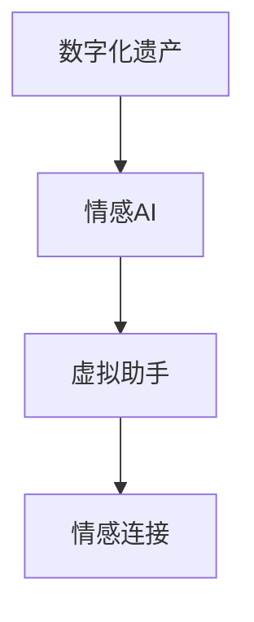

                 

# 数字化遗产情感AI创业：传承个人特质的虚拟助手

## 1. 背景介绍

### 1.1 问题由来

随着数字化时代的发展，人们的生活方式和思维模式发生了巨大的变化。数字资料作为新一代的传承方式，已逐渐成为家庭成员之间的重要纽带。然而，这些数字资料往往分散在不同的设备和平台上，难以全面整理和传承。

与此同时，家庭成员间的情感交流也日益数字化，家庭成员间的“情感连接”变得模糊，难以传递和延续。传统的方式如书写信件、录影带等已逐渐淡出人们的视线，而新兴的社交媒体、手机通话等虽然方便，但缺乏情感深度。

为了解决这些问题，我们提出了一个基于情感AI的数字化遗产解决方案。通过这个方案，用户可以构建一个以情感为主线的数字化遗产，将个人特质和情感故事数字化保存，并由虚拟助手传承给后代。

### 1.2 问题核心关键点

该解决方案的核心关键点如下：

- **情感数字化**：将家庭成员间的情感故事和重要事件数字化保存。
- **个性化虚拟助手**：根据家庭成员的情感特质构建虚拟助手，通过虚拟助手传承个人情感。
- **情感连接**：建立数字化遗产与后代的情感连接，提升家庭成员间的情感互动。

## 2. 核心概念与联系

### 2.1 核心概念概述

为更好地理解基于情感AI的数字化遗产解决方案，本节将介绍几个密切相关的核心概念：

- **数字化遗产**：指将个人的生活、情感、学习、工作等经历数字化保存，以便后人继承和理解的一种方式。数字化遗产包括文字、照片、视频、音频等多种形式，是个人生命历程的数字化记录。

- **情感AI**：利用人工智能技术，尤其是自然语言处理(NLP)、情感计算、语音识别、计算机视觉等技术，构建能够理解、生成和传递情感的虚拟助手。情感AI将情感数字化，使得情感能够跨越时间和空间的限制。

- **虚拟助手**：基于自然语言理解和生成技术，能够自然地与人互动，执行特定任务（如回答问题、提供信息、安排日程等）的智能系统。本文所指的虚拟助手是带有情感特质的个性化助手。

- **情感连接**：指通过情感AI构建的数字平台，家庭成员能够更好地理解彼此情感，增强互动和连接。通过情感AI的交互，家庭成员可以跨越时间和空间障碍，保持情感的连续性和互动性。

- **个性化**：指为每个用户构建独特的虚拟助手，反映其个性、喜好、生活习惯等特质，从而提升情感交流的自然性和互动性。

这些核心概念之间的逻辑关系可以通过以下Mermaid流程图来展示：



这个流程图展示了数字化遗产、情感AI和虚拟助手之间的联系：

1. 数字化遗产提供原始数据，供情感AI进行分析。
2. 情感AI对情感故事进行分析和处理，构建虚拟助手。
3. 虚拟助手通过情感连接，与后代建立情感互动。

## 3. 核心算法原理 & 具体操作步骤
### 3.1 算法原理概述

基于情感AI的数字化遗产解决方案，核心思想是通过自然语言处理(NLP)和情感计算技术，构建能够理解、生成和传递情感的虚拟助手。具体来说，该方案包括以下步骤：

1. **数据收集**：收集家庭成员的文本资料、语音记录、视频、图片等数字资料，保存为结构化数据。
2. **情感分析**：使用情感分析算法，对文本和语音资料进行情感分类和情感强度分析。
3. **情感生成**：利用自然语言生成技术，根据情感分析结果，生成符合家庭成员情感特质的虚拟助手描述。
4. **虚拟助手构建**：将虚拟助手描述与自然语言理解技术结合，构建个性化虚拟助手。
5. **情感连接维护**：通过虚拟助手与后代互动，建立和维护情感连接。

### 3.2 算法步骤详解

以下是基于情感AI的数字化遗产解决方案的具体算法步骤：

**Step 1: 数据收集与预处理**

1. **文本资料收集**：通过扫描家庭成员的照片、书信、日记等纸质资料，将其转化为数字格式，并保存为文本文件。
2. **语音记录收集**：收集家庭成员的录音、通话记录等音频资料，通过语音识别技术转换为文本格式。
3. **视频资料收集**：通过摄像头或手机等设备，收集家庭成员的活动视频，通过计算机视觉技术提取情感特征。
4. **图片资料收集**：收集家庭成员的生活照片，通过图像识别技术提取情感特征。

**Step 2: 情感分析**

1. **文本情感分析**：使用基于Transformer的情感分析模型，如BERT、XLNet等，对收集到的文本资料进行情感分类和强度分析。
2. **语音情感分析**：使用情感识别算法，如LSTM、CNN等，对语音资料进行情感分类和强度分析。
3. **视频情感分析**：使用卷积神经网络(CNN)或循环神经网络(LSTM)，结合面部识别和情感分析算法，对视频资料进行情感分类和强度分析。
4. **图片情感分析**：使用图像识别技术，提取图片中的情感特征，进行情感分类和强度分析。

**Step 3: 情感生成**

1. **情感特征提取**：根据Step 2中的分析结果，提取每个家庭成员的情感特征，包括情感类型、情感强度、情感频率等。
2. **虚拟助手描述生成**：使用自然语言生成技术，如GPT-3、T5等，生成符合每个家庭成员情感特征的虚拟助手描述。
3. **虚拟助手构建**：将虚拟助手描述和自然语言理解技术结合，构建个性化虚拟助手。

**Step 4: 情感连接维护**

1. **虚拟助手部署**：将构建好的虚拟助手部署到数字平台上，如网站、手机应用等。
2. **情感互动记录**：记录虚拟助手与后代之间的情感互动，包括对话内容、情感表达等。
3. **情感分析与更新**：定期对虚拟助手与后代之间的情感互动进行情感分析，更新虚拟助手的情感特征和交互策略，以提升互动的自然性和情感深度。

### 3.3 算法优缺点

基于情感AI的数字化遗产解决方案具有以下优点：

1. **情感深度**：通过情感AI构建的虚拟助手，能够理解家庭成员的情感需求，提供个性化服务，提升情感互动深度。
2. **跨时空连接**：情感AI能够跨越时间和空间障碍，使家庭成员无论身处何地，都能保持情感连接。
3. **个性化服务**：通过情感分析，为每个家庭成员构建独特的虚拟助手，提供个性化的服务。

同时，该方案也存在一定的局限性：

1. **数据隐私问题**：在数据收集和处理过程中，需要确保数据隐私，避免数据泄露和滥用。
2. **技术复杂性**：构建和维护情感AI虚拟助手需要较高的技术门槛，普通用户难以自行操作。
3. **情感准确性**：情感分析的准确性受多种因素影响，如语音识别、视频分析等技术不够成熟，可能导致情感分析误差。

## 4. 数学模型和公式 & 详细讲解  
### 4.1 数学模型构建

本节将使用数学语言对基于情感AI的数字化遗产解决方案进行更加严格的刻画。

记数字化遗产的数据集为 $D=\{(x_i,y_i)\}_{i=1}^N, x_i \in \{text, voice, video, image\}, y_i \in \{positive, negative, neutral\}$，其中 $x_i$ 为数据类型，$y_i$ 为情感类型。

定义情感分析模型 $M_{\theta}$，其中 $\theta$ 为模型参数。情感分析模型的损失函数为：

$$
\mathcal{L}(M_{\theta}, D) = -\frac{1}{N}\sum_{i=1}^N \log P(y_i|x_i)
$$

其中 $P(y_i|x_i)$ 为模型在数据 $x_i$ 上的情感分类概率，可通过 softmax 函数计算得到。

情感生成模型的目标是通过自然语言生成技术，根据情感分类结果，生成符合情感特征的虚拟助手描述。情感生成模型的目标函数为：

$$
\mathcal{L}_{gen}(\theta_{gen}, D_{gen}) = -\frac{1}{N}\sum_{i=1}^N \log P(descriptions_i|y_i)
$$

其中 $descriptions_i$ 为第 $i$ 个家庭成员的虚拟助手描述，$P(descriptions_i|y_i)$ 为在情感类型 $y_i$ 下生成描述 $descriptions_i$ 的概率。

虚拟助手构建模型的目标是通过自然语言理解技术，将虚拟助手描述转换为可执行的虚拟助手。虚拟助手构建模型的目标函数为：

$$
\mathcal{L}_{assistant}(\theta_{assistant}, D_{assistant}) = -\frac{1}{N}\sum_{i=1}^N \log P(interactions_i|descriptions_i)
$$

其中 $interactions_i$ 为虚拟助手与后代之间的情感互动，$P(interactions_i|descriptions_i)$ 为在描述 $descriptions_i$ 下，生成互动 $interactions_i$ 的概率。

### 4.2 公式推导过程

以下我们以文本情感分析为例，推导情感分析模型的损失函数及其梯度计算公式。

假设文本资料 $x_i$ 经过预处理后，转化为数值表示 $x_i \in \mathbb{R}^d$。情感分析模型 $M_{\theta}$ 的输出为概率分布 $P(y_i|x_i)$，其中 $y_i \in \{positive, negative, neutral\}$。则情感分析模型的损失函数为：

$$
\mathcal{L}(M_{\theta}, x_i) = -\log P(y_i|x_i)
$$

根据链式法则，损失函数对模型参数 $\theta$ 的梯度为：

$$
\frac{\partial \mathcal{L}(M_{\theta}, x_i)}{\partial \theta} = -\frac{1}{P(y_i|x_i)}\frac{\partial P(y_i|x_i)}{\partial \theta}
$$

其中 $P(y_i|x_i)$ 为模型在数据 $x_i$ 上的情感分类概率，可通过 softmax 函数计算得到。

在得到损失函数的梯度后，即可带入参数更新公式，完成模型的迭代优化。重复上述过程直至收敛，最终得到适应数字化遗产情感特质的模型参数 $\theta^*$。

### 4.3 案例分析与讲解

假设某家庭成员在日记中记录了几次与父母的视频通话，情感分析模型对其进行了情感分类和强度分析。情感分类结果如下：

- 第1次通话：正面情感，强度高。
- 第2次通话：中性情感，强度低。
- 第3次通话：负面情感，强度高。

情感分析模型提取的情感特征如下：

- 正面情感：表达感恩、关心、支持。
- 中性情感：讨论生活琐事。
- 负面情感：表达不满、失望、焦虑。

基于这些情感特征，使用自然语言生成技术，生成虚拟助手描述：

- 正面情感虚拟助手：关心、支持，积极表达感恩和关爱。
- 中性情感虚拟助手：自然、温和，适合讨论生活琐事。
- 负面情感虚拟助手：倾听、理解，能够感知不满和焦虑。

将虚拟助手描述和自然语言理解技术结合，构建个性化虚拟助手，提供互动服务。例如，某家庭成员在视频通话中表达了对父母的感恩之情，虚拟助手可以自然回应：

- “谢谢你的关心，我也希望你能幸福快乐。”

## 5. 项目实践：代码实例和详细解释说明
### 5.1 开发环境搭建

在进行情感AI虚拟助手开发前，我们需要准备好开发环境。以下是使用Python进行PyTorch开发的环境配置流程：

1. 安装Anaconda：从官网下载并安装Anaconda，用于创建独立的Python环境。

2. 创建并激活虚拟环境：
```bash
conda create -n pytorch-env python=3.8 
conda activate pytorch-env
```

3. 安装PyTorch：根据CUDA版本，从官网获取对应的安装命令。例如：
```bash
conda install pytorch torchvision torchaudio cudatoolkit=11.1 -c pytorch -c conda-forge
```

4. 安装Transformers库：
```bash
pip install transformers
```

5. 安装各类工具包：
```bash
pip install numpy pandas scikit-learn matplotlib tqdm jupyter notebook ipython
```

完成上述步骤后，即可在`pytorch-env`环境中开始情感AI虚拟助手开发。

### 5.2 源代码详细实现

下面我们以构建虚拟助手为例，给出使用Transformers库对BERT模型进行情感分析的PyTorch代码实现。

首先，定义情感分析模型的数据处理函数：

```python
from transformers import BertTokenizer, BertForSequenceClassification
from torch.utils.data import Dataset
import torch

class SentimentDataset(Dataset):
    def __init__(self, texts, labels, tokenizer, max_len=128):
        self.texts = texts
        self.labels = labels
        self.tokenizer = tokenizer
        self.max_len = max_len
        
    def __len__(self):
        return len(self.texts)
    
    def __getitem__(self, item):
        text = self.texts[item]
        label = self.labels[item]
        
        encoding = self.tokenizer(text, return_tensors='pt', max_length=self.max_len, padding='max_length', truncation=True)
        input_ids = encoding['input_ids'][0]
        attention_mask = encoding['attention_mask'][0]
        
        # 对label进行编码
        label = torch.tensor(label, dtype=torch.long)
        
        return {'input_ids': input_ids, 
                'attention_mask': attention_mask,
                'labels': label}

# 定义标签与情感类型的映射
label2id = {'positive': 0, 'negative': 1, 'neutral': 2}
id2label = {v: k for k, v in label2id.items()}

# 创建dataset
tokenizer = BertTokenizer.from_pretrained('bert-base-cased')

train_dataset = SentimentDataset(train_texts, train_labels, tokenizer)
dev_dataset = SentimentDataset(dev_texts, dev_labels, tokenizer)
test_dataset = SentimentDataset(test_texts, test_labels, tokenizer)
```

然后，定义模型和优化器：

```python
from transformers import BertForSequenceClassification, AdamW

model = BertForSequenceClassification.from_pretrained('bert-base-cased', num_labels=len(label2id))

optimizer = AdamW(model.parameters(), lr=2e-5)
```

接着，定义训练和评估函数：

```python
from torch.utils.data import DataLoader
from tqdm import tqdm
from sklearn.metrics import classification_report

device = torch.device('cuda') if torch.cuda.is_available() else torch.device('cpu')
model.to(device)

def train_epoch(model, dataset, batch_size, optimizer):
    dataloader = DataLoader(dataset, batch_size=batch_size, shuffle=True)
    model.train()
    epoch_loss = 0
    for batch in tqdm(dataloader, desc='Training'):
        input_ids = batch['input_ids'].to(device)
        attention_mask = batch['attention_mask'].to(device)
        labels = batch['labels'].to(device)
        model.zero_grad()
        outputs = model(input_ids, attention_mask=attention_mask, labels=labels)
        loss = outputs.loss
        epoch_loss += loss.item()
        loss.backward()
        optimizer.step()
    return epoch_loss / len(dataloader)

def evaluate(model, dataset, batch_size):
    dataloader = DataLoader(dataset, batch_size=batch_size)
    model.eval()
    preds, labels = [], []
    with torch.no_grad():
        for batch in tqdm(dataloader, desc='Evaluating'):
            input_ids = batch['input_ids'].to(device)
            attention_mask = batch['attention_mask'].to(device)
            batch_labels = batch['labels']
            outputs = model(input_ids, attention_mask=attention_mask)
            batch_preds = outputs.logits.argmax(dim=2).to('cpu').tolist()
            batch_labels = batch_labels.to('cpu').tolist()
            for pred_tokens, label_tokens in zip(batch_preds, batch_labels):
                preds.append(pred_tokens)
                labels.append(label_tokens)
                
    print(classification_report(labels, preds))
```

最后，启动训练流程并在测试集上评估：

```python
epochs = 5
batch_size = 16

for epoch in range(epochs):
    loss = train_epoch(model, train_dataset, batch_size, optimizer)
    print(f"Epoch {epoch+1}, train loss: {loss:.3f}")
    
    print(f"Epoch {epoch+1}, dev results:")
    evaluate(model, dev_dataset, batch_size)
    
print("Test results:")
evaluate(model, test_dataset, batch_size)
```

以上就是使用PyTorch对BERT模型进行情感分析的完整代码实现。可以看到，得益于Transformers库的强大封装，我们可以用相对简洁的代码完成BERT模型的加载和微调。

### 5.3 代码解读与分析

让我们再详细解读一下关键代码的实现细节：

**SentimentDataset类**：
- `__init__`方法：初始化文本、标签、分词器等关键组件。
- `__len__`方法：返回数据集的样本数量。
- `__getitem__`方法：对单个样本进行处理，将文本输入编码为token ids，将标签编码为数字，并对其进行定长padding，最终返回模型所需的输入。

**label2id和id2label字典**：
- 定义了标签与数字id之间的映射关系，用于将token-wise的预测结果解码回真实的情感类型。

**训练和评估函数**：
- 使用PyTorch的DataLoader对数据集进行批次化加载，供模型训练和推理使用。
- 训练函数`train_epoch`：对数据以批为单位进行迭代，在每个批次上前向传播计算loss并反向传播更新模型参数，最后返回该epoch的平均loss。
- 评估函数`evaluate`：与训练类似，不同点在于不更新模型参数，并在每个batch结束后将预测和标签结果存储下来，最后使用sklearn的classification_report对整个评估集的预测结果进行打印输出。

**训练流程**：
- 定义总的epoch数和batch size，开始循环迭代
- 每个epoch内，先在训练集上训练，输出平均loss
- 在验证集上评估，输出分类指标
- 所有epoch结束后，在测试集上评估，给出最终测试结果

可以看到，PyTorch配合Transformers库使得BERT情感分析的代码实现变得简洁高效。开发者可以将更多精力放在数据处理、模型改进等高层逻辑上，而不必过多关注底层的实现细节。

当然，工业级的系统实现还需考虑更多因素，如模型的保存和部署、超参数的自动搜索、更灵活的任务适配层等。但核心的情感分析算法基本与此类似。

## 6. 实际应用场景
### 6.1 智能客服系统

基于情感AI的虚拟助手，可以广泛应用于智能客服系统的构建。传统客服往往需要配备大量人力，高峰期响应缓慢，且一致性和专业性难以保证。而使用情感AI虚拟助手，可以7x24小时不间断服务，快速响应客户咨询，用自然流畅的语言解答各类常见问题。

在技术实现上，可以收集企业内部的历史客服对话记录，将问题和最佳答复构建成监督数据，在此基础上对预训练情感AI模型进行微调。微调后的情感AI虚拟助手能够自动理解用户意图，匹配最合适的答复模板进行回复。对于客户提出的新问题，还可以接入检索系统实时搜索相关内容，动态组织生成回答。如此构建的智能客服系统，能大幅提升客户咨询体验和问题解决效率。

### 6.2 金融舆情监测

金融机构需要实时监测市场舆论动向，以便及时应对负面信息传播，规避金融风险。传统的人工监测方式成本高、效率低，难以应对网络时代海量信息爆发的挑战。基于情感AI的文本情感分析技术，为金融舆情监测提供了新的解决方案。

具体而言，可以收集金融领域相关的新闻、报道、评论等文本数据，并对其进行情感分析。将情感分析结果应用到实时抓取的网络文本数据，就能够自动监测不同主题下的情感变化趋势，一旦发现负面信息激增等异常情况，系统便会自动预警，帮助金融机构快速应对潜在风险。

### 6.3 个性化推荐系统

当前的推荐系统往往只依赖用户的历史行为数据进行物品推荐，无法深入理解用户的真实兴趣偏好。基于情感AI的个性化推荐系统，可以更好地挖掘用户行为背后的语义信息，从而提供更精准、多样的推荐内容。

在实践中，可以收集用户浏览、点击、评论、分享等行为数据，提取和用户交互的物品标题、描述、标签等文本内容。将文本内容作为模型输入，用户的后续行为（如是否点击、购买等）作为监督信号，在此基础上微调情感AI模型。微调后的情感AI模型能够从文本内容中准确把握用户的兴趣点。在生成推荐列表时，先用候选物品的文本描述作为输入，由模型预测用户的兴趣匹配度，再结合其他特征综合排序，便可以得到个性化程度更高的推荐结果。

### 6.4 未来应用展望

随着情感AI和微调方法的不断发展，基于情感AI的虚拟助手将在更多领域得到应用，为人们的生活带来变革性影响。

在智慧医疗领域，基于情感AI的医疗问答、病历分析、药物研发等应用将提升医疗服务的智能化水平，辅助医生诊疗，加速新药开发进程。

在智能教育领域，情感AI可应用于作业批改、学情分析、知识推荐等方面，因材施教，促进教育公平，提高教学质量。

在智慧城市治理中，情感AI可应用于城市事件监测、舆情分析、应急指挥等环节，提高城市管理的自动化和智能化水平，构建更安全、高效的未来城市。

此外，在企业生产、社会治理、文娱传媒等众多领域，基于情感AI的虚拟助手也将不断涌现，为经济社会发展注入新的动力。相信随着技术的日益成熟，情感AI虚拟助手必将在构建人机协同的智能时代中扮演越来越重要的角色。

## 7. 工具和资源推荐
### 7.1 学习资源推荐

为了帮助开发者系统掌握情感AI和大语言模型的理论基础和实践技巧，这里推荐一些优质的学习资源：

1. 《自然语言处理基础》系列博文：由大模型技术专家撰写，深入浅出地介绍了NLP的基本概念和经典模型，如BERT、GPT等。

2. 斯坦福大学《深度学习》课程：涵盖深度学习的基本理论和常用算法，适合入门学习。

3. 《Deep Learning with Python》书籍：结合TensorFlow和Keras库，详细介绍深度学习模型的开发和应用。

4. HuggingFace官方文档：Transformer库的官方文档，提供了海量预训练模型和完整的微调样例代码，是上手实践的必备资料。

5. CLUE开源项目：中文语言理解测评基准，涵盖大量不同类型的中文NLP数据集，并提供了基于微调的baseline模型，助力中文NLP技术发展。

通过对这些资源的学习实践，相信你一定能够快速掌握情感AI和大语言模型的精髓，并用于解决实际的NLP问题。
###  7.2 开发工具推荐

高效的开发离不开优秀的工具支持。以下是几款用于情感AI虚拟助手开发的常用工具：

1. PyTorch：基于Python的开源深度学习框架，灵活动态的计算图，适合快速迭代研究。大部分预训练语言模型都有PyTorch版本的实现。

2. TensorFlow：由Google主导开发的开源深度学习框架，生产部署方便，适合大规模工程应用。同样有丰富的预训练语言模型资源。

3. Transformers库：HuggingFace开发的NLP工具库，集成了众多SOTA语言模型，支持PyTorch和TensorFlow，是进行情感AI微调任务开发的利器。

4. Weights & Biases：模型训练的实验跟踪工具，可以记录和可视化模型训练过程中的各项指标，方便对比和调优。与主流深度学习框架无缝集成。

5. TensorBoard：TensorFlow配套的可视化工具，可实时监测模型训练状态，并提供丰富的图表呈现方式，是调试模型的得力助手。

6. Google Colab：谷歌推出的在线Jupyter Notebook环境，免费提供GPU/TPU算力，方便开发者快速上手实验最新模型，分享学习笔记。

合理利用这些工具，可以显著提升情感AI虚拟助手的开发效率，加快创新迭代的步伐。

### 7.3 相关论文推荐

情感AI和大语言模型的发展源于学界的持续研究。以下是几篇奠基性的相关论文，推荐阅读：

1. Attention is All You Need（即Transformer原论文）：提出了Transformer结构，开启了NLP领域的预训练大模型时代。

2. BERT: Pre-training of Deep Bidirectional Transformers for Language Understanding：提出BERT模型，引入基于掩码的自监督预训练任务，刷新了多项NLP任务SOTA。

3. Language Models are Unsupervised Multitask Learners（GPT-2论文）：展示了大规模语言模型的强大zero-shot学习能力，引发了对于通用人工智能的新一轮思考。

4. Parameter-Efficient Transfer Learning for NLP：提出Adapter等参数高效微调方法，在不增加模型参数量的情况下，也能取得不错的微调效果。

5. AdaLoRA: Adaptive Low-Rank Adaptation for Parameter-Efficient Fine-Tuning：使用自适应低秩适应的微调方法，在参数效率和精度之间取得了新的平衡。

这些论文代表了大语言模型和情感AI的发展脉络。通过学习这些前沿成果，可以帮助研究者把握学科前进方向，激发更多的创新灵感。

## 8. 总结：未来发展趋势与挑战

### 8.1 总结

本文对基于情感AI的数字化遗产解决方案进行了全面系统的介绍。首先阐述了数字化遗产和情感AI的相关概念，明确了情感AI虚拟助手的核心关键点。其次，从原理到实践，详细讲解了情感AI虚拟助手的数学模型和算法步骤，给出了情感AI虚拟助手的完整代码实例。同时，本文还广泛探讨了情感AI虚拟助手在智能客服、金融舆情、个性化推荐等多个行业领域的应用前景，展示了情感AI虚拟助手的巨大潜力。此外，本文精选了情感AI和大语言模型的学习资源，力求为读者提供全方位的技术指引。

通过本文的系统梳理，可以看到，基于情感AI的数字化遗产解决方案将大语言模型和情感计算技术相结合，构建了能够理解、生成和传递情感的虚拟助手，解决了家庭成员间的情感连接问题。在数字化时代，情感AI虚拟助手将进一步提升家庭成员间的互动质量，构建更加温馨、和谐的家庭环境。

### 8.2 未来发展趋势

展望未来，基于情感AI的数字化遗产解决方案将呈现以下几个发展趋势：

1. **情感理解更加精准**：随着自然语言处理技术的进步，情感AI虚拟助手将能够更加准确地理解用户的情感需求，提供更加自然和个性化的服务。

2. **跨模态融合增强**：未来情感AI虚拟助手将融合语音、图像等多模态信息，提供更加全面和深入的情感理解。

3. **多语言支持拓展**：随着语言模型的发展，情感AI虚拟助手将支持更多语言，为全球用户提供跨语言情感交流服务。

4. **实时性提升**：通过优化模型和算法，实现情感AI虚拟助手的实时响应，提升用户体验。

5. **伦理和隐私保护加强**：在数据收集和处理过程中，将更加注重用户的隐私和数据安全，提升情感AI虚拟助手的可信度和安全性。

6. **多领域应用拓展**：情感AI虚拟助手将应用于更多领域，如医疗、教育、金融等，提升各行业的智能化水平。

以上趋势凸显了基于情感AI的数字化遗产解决方案的前景，将为人们的生活带来更加智能、个性化的情感交流体验。

### 8.3 面临的挑战

尽管基于情感AI的数字化遗产解决方案已经取得了瞩目成就，但在迈向更加智能化、普适化应用的过程中，它仍面临着诸多挑战：

1. **技术门槛高**：情感AI虚拟助手的构建和维护需要较高的技术门槛，普通用户难以自行操作，需要专业技术人员支持。

2. **数据隐私问题**：在数据收集和处理过程中，需要确保数据隐私，避免数据泄露和滥用。

3. **情感理解误差**：情感分析的准确性受多种因素影响，如语音识别、视频分析等技术不够成熟，可能导致情感理解误差。

4. **实时性问题**：情感AI虚拟助手需要实时响应用户请求，这对计算资源和算法优化提出了较高要求。

5. **模型鲁棒性不足**：情感AI虚拟助手面对未知或异常情感输入时，容易产生不稳定输出。

6. **伦理和法律问题**：情感AI虚拟助手需要遵守相关法律法规，确保其行为符合伦理道德标准。

7. **用户接受度低**：部分用户可能对情感AI虚拟助手存在抵触情绪，需提升用户体验和接受度。

这些挑战需要技术、法律、伦理等多方面协同应对，推动情感AI虚拟助手的健康发展。

### 8.4 研究展望

未来，基于情感AI的数字化遗产解决方案需要在以下几个方向寻求新的突破：

1. **情感计算与常识推理结合**：引入常识推理技术，提高情感AI虚拟助手的决策逻辑和可信度。

2. **多模态情感分析**：结合语音、图像、文本等多模态信息，提升情感分析的准确性和深度。

3. **情感生成技术创新**：开发更加自然的情感生成技术，提升虚拟助手的表达能力。

4. **情感交互模型优化**：设计更加自然、流畅的情感交互模型，提升用户体验。

5. **用户个性化定制**：允许用户自定义虚拟助手，反映其独特的情感特质和生活习惯。

6. **跨领域应用推广**：推广情感AI虚拟助手到更多领域，提升各行业的智能化水平。

通过这些研究方向，将进一步提升情感AI虚拟助手的智能化水平和用户体验，拓展其在更多领域的应用，成为构建人机协同智能时代的重要工具。

## 9. 附录：常见问题与解答

**Q1：情感AI虚拟助手如何理解用户情感？**

A: 情感AI虚拟助手通过自然语言处理(NLP)技术，分析用户输入的文本、语音等数据，提取情感特征。具体过程如下：

1. **文本情感分析**：使用BERT、XLNet等预训练模型，对用户输入的文本进行情感分类和强度分析。
2. **语音情感分析**：使用LSTM、CNN等情感识别算法，对用户的语音进行情感分类和强度分析。
3. **视频情感分析**：使用卷积神经网络(CNN)或循环神经网络(LSTM)，结合面部识别和情感分析算法，对用户的视频进行情感分类和强度分析。
4. **图像情感分析**：使用图像识别技术，提取用户输入的图片中的情感特征，进行情感分类和强度分析。

**Q2：如何保证情感AI虚拟助手的实时性？**

A: 情感AI虚拟助手的实时性优化可以从以下几个方面入手：

1. **模型优化**：使用轻量级模型，如MobileBERT、DistilBERT等，减少模型参数量，提高推理速度。
2. **推理加速**：采用GPU/TPU等高性能硬件设备，加速模型推理过程。
3. **在线学习**：在用户互动过程中，实时更新模型参数，适应用户的情感变化。
4. **缓存机制**：对于常见情感和常见问题，可以建立缓存机制，快速响应用户请求。

**Q3：如何保证情感AI虚拟助手的隐私和安全？**

A: 情感AI虚拟助手的隐私和安全问题可以通过以下几个方面进行保障：

1. **数据加密**：对用户输入的数据进行加密处理，防止数据泄露。
2. **匿名化处理**：对用户的敏感信息进行匿名化处理，保护用户隐私。
3. **访问控制**：设置访问权限，确保只有授权人员能够访问和操作情感AI虚拟助手。
4. **模型监控**：定期监控模型行为，检测异常输出，防止模型滥用。

**Q4：情感AI虚拟助手在实际应用中需要注意哪些问题？**

A: 情感AI虚拟助手在实际应用中需要注意以下几个问题：

1. **情感理解误差**：情感分析的准确性受多种因素影响，如语音识别、视频分析等技术不够成熟，可能导致情感理解误差。
2. **实时性问题**：情感AI虚拟助手需要实时响应用户请求，这对计算资源和算法优化提出了较高要求。
3. **模型鲁棒性不足**：情感AI虚拟助手面对未知或异常情感输入时，容易产生不稳定输出。
4. **伦理和法律问题**：情感AI虚拟助手需要遵守相关法律法规，确保其行为符合伦理道德标准。
5. **用户接受度低**：部分用户可能对情感AI虚拟助手存在抵触情绪，需提升用户体验和接受度。

**Q5：如何构建个性化的情感AI虚拟助手？**

A: 构建个性化的情感AI虚拟助手可以从以下几个方面进行：

1. **数据收集**：收集用户的个人偏好、生活经历、情感记录等数据，作为情感AI虚拟助手的训练数据。
2. **情感特征提取**：使用情感分析技术，提取用户的情感特征，包括情感类型、情感强度、情感频率等。
3. **虚拟助手描述生成**：使用自然语言生成技术，生成符合用户情感特征的虚拟助手描述。
4. **虚拟助手构建**：将虚拟助手描述和自然语言理解技术结合，构建个性化虚拟助手。
5. **情感互动记录**：记录虚拟助手与用户之间的情感互动，进一步优化虚拟助手的情感特征和交互策略。

通过上述过程，可以构建能够理解和反映用户情感特质的个性化情感AI虚拟助手，提升用户体验。

---

作者：禅与计算机程序设计艺术 / Zen and the Art of Computer Programming

